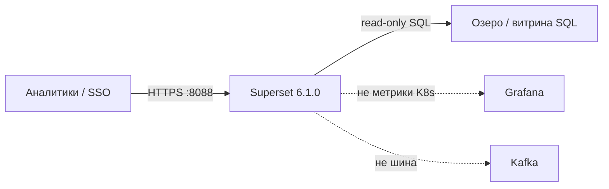
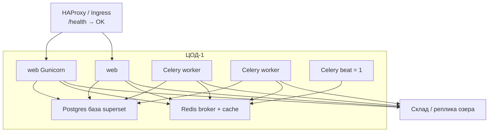
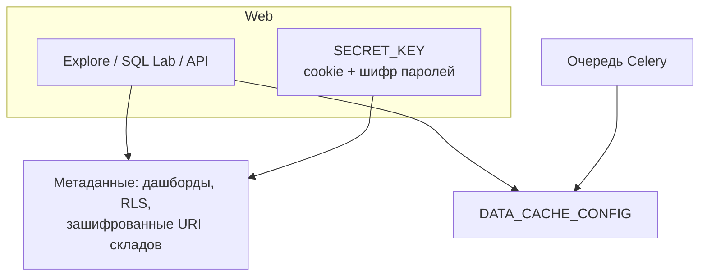
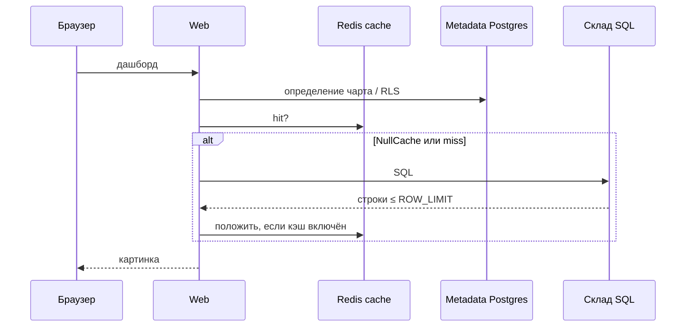
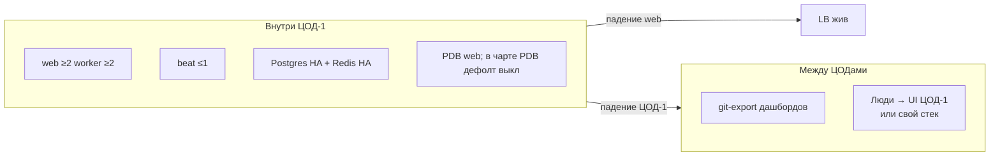
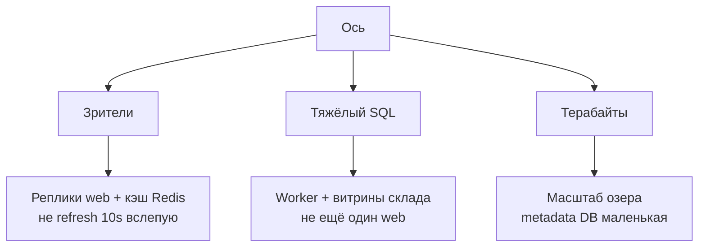
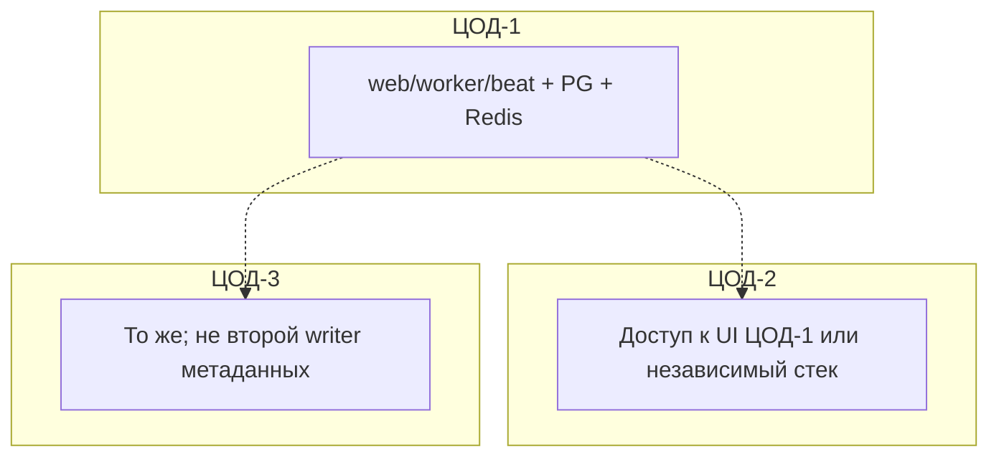

# Apache Superset 6.1.0 — схемы устройства

Связанные документы: правила — `Apache Superset.md`; установка — `Apache Superset.install.md`.

C4 / «D4»: контекст → контейнеры → компоненты. Код чартов не рисуем.

Допущения: stretch metadata Postgres + Redis на 2–3 ЦОДа **нет**; Helm `superset/superset` **0.21.1**, образ **6.1.0**; не Grafana и не склад; нагрузка не замерена.

---

## 1. Контекст

Superset — **BI поверх SQL**. Терабайты живут в озере/витрине. Он *спрашивает* склад и рисует картинку.

Без витрины в SQL Superset — пустая рамка. Он **не создаёт** озеро. Операционные БД Camunda/интеграций аналитикам не открывать — смотреть проекции.

---

## 2. Контейнеры (несколько процессов одного ПО)

Это **не** кворум. Stateless web/worker + **одна** metadata DB + **один** Redis **внутри ЦОД-1**.

Порт **8088** — UI/API. **5432** и **6379** — не Superset. Beat **ровно один**: два beat = двойные письма. `/health` **не** проверяет Postgres/Redis/склад.

Сабчарты Bitnami в чарте — стенд. Прод: `postgresql.enabled: false`, `redis.enabled: false`. SQLite — не несколько подов.

**Сильное:** падение одного web — UI жив (cookie, sticky не обязателен). **Слабое:** падение metadata DB = нет логина, даже если поды зелёные.

---

## 3. Компоненты внутри стека

| Компонент | Для чего настраивать |
|---|---|
| `SECRET_KEY` | С 2.1.0 дефолт на не-debug **запрещает старт**. Helm-дока знает `thisISaSECRET_1234` — тоже не оставлять |
| NullCache | Дефолт `CACHE_CONFIG` / `DATA_CACHE_CONFIG`. Refresh дашборда = шторм SQL |
| Results backend | Общий Redis, не диск пода: иначе web-A не заберёт результат worker-B |
| SQL Lab | Консоль к складу от имени учётки datasource. RLS приложения **обходима** |

`superset run` / `flask run` — не прод. Alerts & Reports — beat + worker + webdriver; в первом проде можно выкл.

---

## 4. Поток: открыть чарт

Нагрузка на склад ≈ N web × gunicorn × одновременные чарты × (1 − cache hit). При NullCache hit = 0. Добавить реплик «для HA» можно съесть `max_connections` озера.

---

## 5. Что настраивать: отказоустойчивость

| Ручка | Если забыть |
|---|---|
| Свой SECRET_KEY **до** datasources | Смена потом — `re-encrypt-secrets` |
| `ENABLE_PROXY_FIX` + cookie Secure | OAuth/`redirect_uri` ломаются за TLS-прокси |
| Non-root образ с драйвером склада | Чарт `runAsUser: 0` + apt на старте — не прод |
| Init Job один раз | `db upgrade` с трёх подов сразу |

---

## 6. Что настраивать: масштабируемость

Gunicorn `-w 10` gevent в доке — **пример**. `ROW_LIMIT` 50k / `SQL_MAX_ROW` 100k — потолки UI, не индекс озера. Читать **реплику** склада, не primary SoT.

---

## 7. Прод: 2 или 3 ЦОДа без stretch

Три полных Superset — тройные права, обычно хуже. Склад в другом ЦОДе: учесть `SQLLAB_TIMEOUT` / Gunicorn / Ingress.

**Сильное:** Postgres/Redis не на WAN. **Слабое:** падение ЦОД-1 = нет этого BI; `/health` слеп к складу; Admin = ключ ко всем URI и к SQL.

---

## 8. Безопасность (ручки на той же схеме)

Нет `admin`/`admin`. SSO, регистрация **не** в Admin. Public/anonymous на ПДн не включать. `PREVENT_UNSAFE_DB_CONNECTIONS` не выключать. `DATASET_IMPORT_ALLOWED_DATA_URLS` сузить (дефолт `.*` — SSRF). Scarf выкл. SQL Lab — узкая роль, учётка БД **SELECT**. Flower не в интернет.

Источники: `Apache Superset.md`. Порога RTT у проекта **нет**.
