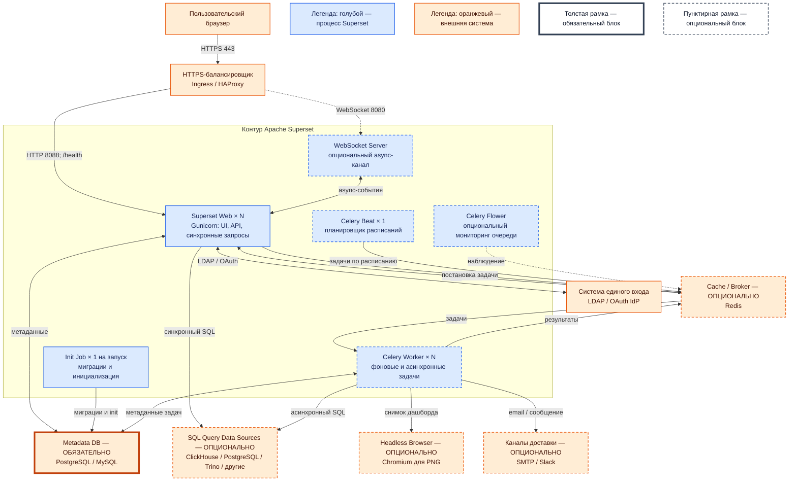

# Apache Superset 6.1.0

Apache Superset — self-hosted платформа бизнес-аналитики: пользователи строят графики и дашборды SQL-запросами к подключённым базам. Superset не хранит терабайты озера: он запрашивает внешние источники и визуализирует результат.

Версия продукта: **6.1.0**. Образ: `apache/superset:6.1.0`. PyPI: `apache_superset==6.1.0`. Лицензия: **Apache License 2.0**.

Документация: https://superset.apache.org/
Релиз: https://github.com/apache/superset/releases/tag/6.1.0

---

## Назначение системы

Superset — слой **просмотра и анализа уже подготовленных данных в SQL**. Руководитель или аналитик открывает в браузере дашборд и видит показатели по заявкам, клиентам и филиалам, если доступна соответствующая SQL-витрина.

Система читает данные из подключённых баз и складов. Она:

- не хранит эталонные клиентские карточки;
- не заменяет очередь событий Kafka;
- не исполняет бизнес-процессы Camunda;
- не обращается напрямую к государственным сервисам;
- не создаёт озеро данных;
- не заменяет Grafana: метрики и алерты инфраструктуры относятся к другому контуру.

Без подключённой SQL-витрины интерфейс Superset может работать, но аналитические чарты не получают данных.

---

## Перечень функций

Self-hosted Apache Superset OSS умеет:

1. **Показывать чарты и дашборды** в браузере. Чарт визуализирует результат SQL-запроса; дашборд объединяет чарты.
2. **Подключать внешние SQL-источники**: например, PostgreSQL, ClickHouse и другие поддерживаемые СУБД. Для конкретного источника в образе должен быть соответствующий Python-драйвер.
3. **Создавать наборы данных** на основе таблиц или SQL-представлений.
4. **Строить визуализации без ручного SQL** в Explore и выполнять SQL в редакторе SQL Lab.
5. **Ограничивать строки на уровне приложения** с помощью Row Level Security. Это дополнение к правам в СУБД, а не замена им.
6. **Разграничивать доступ** встроенными ролями Admin, Alpha, Gamma, `sql_lab` и Public.
7. **Подключать единый вход** через LDAP или OAuth средствами Flask-AppBuilder.
8. **Кэшировать** объекты и результаты запросов. Без настроенного кэша обновление чарта повторно обращается к источнику.
9. **Выполнять фоновые задачи**: асинхронный SQL Lab, прогрев кэша и подготовку снимков отчётов.
10. **Отправлять отчёты по расписанию** через email или Slack при наличии worker, beat, браузера без графического интерфейса и канала доставки.
11. **Встраивать дашборды** во внешнее веб-приложение с гостевым JWT, если функция включена и настроена.
12. **Импортировать и экспортировать конфигурацию** дашбордов и источников в YAML/ZIP.
13. **Ограничивать размер результата в UI**. В версии 6.1.0 предел чарта — 50 000 строк, SQL Lab — 100 000 строк; эти ограничения не уменьшают объём данных в источнике.

Superset не является хранилищем фактов, шиной событий, BPMN-движком или межсетевым экраном СУБД. SQL Lab выполняет запросы с правами учётной записи, указанной в подключении к источнику.

---

## Основные элементы системы и зависимости

Superset состоит из нескольких процессов, но не образует кластер с голосованием. Веб-реплики используют общую базу метаданных. Фоновые процессы и общий кэш подключаются только тогда, когда нужны соответствующие функции.

### Обязательные и опциональные части

| Часть | Обязательность | Статус относительно Superset |
|---|---|---|
| **Веб Superset** | Обязателен | Процесс самого Superset |
| **Metadata DB** | **Обязательна всегда** | Отдельно развёрнутая СУБД; не встроена в веб-процесс |
| **SQL query data source** | Опционален для запуска UI, но нужен для полезной аналитики | Внешняя, отдельно развёрнутая СУБД или SQL-движок |
| **Celery worker** | Опционален | Отдельный процесс Superset |
| **Celery beat** | Опционален; нужен для расписаний | Отдельный процесс Superset, ровно один активный экземпляр |
| **Cache / task broker** | Опционален для базового синхронного UI; нужен для общего кэша и фоновых задач | Отдельно развёрнутая система, обычно Redis |
| **Init Job** | Обязателен при инициализации и миграциях, не работает постоянно | Разовый процесс Superset |
| **Flower и WebSocket server** | Опциональны | Отдельные вспомогательные процессы |

Ключевое различие:

- **Metadata DB обязательна**: в ней Superset хранит пользователей, роли, дашборды, наборы данных, сохранённые запросы, расписания и зашифрованные реквизиты подключений.
- **Worker опционален**: без него остаются веб-интерфейс и синхронные запросы, но не выполняются назначенные ему фоновые задачи.
- **Cache/broker опционален только для базового синхронного сценария**: Redis нужен, если включены Celery-задачи, общий кэш или распределённое хранение результатов.
- **Query data sources опциональны для технического запуска**, однако без них Superset не может показывать прикладные данные.

### Схема инстансов и потоков

### Как читать схему

1. **Сначала смотрите на цвет и рамку.** Голубые блоки — процессы дистрибутива Superset. Оранжевые блоки — системы за его границей, которыми Superset пользуется по сети. Толстая рамка отмечает обязательную Metadata DB, пунктир — опциональные части.
2. **Стрелка показывает инициатора и направление обмена.** Подпись на стрелке указывает протокол, порт или тип передаваемых данных. Двусторонняя стрелка означает обмен в обе стороны, а не совместное хранение данных.
3. **Основной пользовательский путь идёт сверху вниз:** браузер открывает HTTPS-порт 443 балансировщика; балансировщик передаёт запрос на порт 8088 одной из веб-реплик. Прямой доступ пользователя к 8088 не требуется.
4. **Веб-процесс не хранит состояние приложения локально.** Он читает пользователей, права, определения дашбордов и подключения из обязательной Metadata DB. Поэтому несколько веб-реплик видят одну конфигурацию.
5. **Синхронный запрос идёт непосредственно из Web в SQL Query Data Source.** В источнике выполняется SQL, а в Superset возвращается результат для визуализации. Данные источника не копируются в Metadata DB как хранилище фактов.
6. **Фоновый путь читается через Redis:** Web или Beat ставит задачу в broker, Worker забирает её, при необходимости обращается к SQL-источнику и сохраняет результат в общий backend. Если Worker и Redis не подключены, этот путь отсутствует, но базовый синхронный UI может продолжать работать.
7. **Beat — только источник событий расписания.** Он не выполняет запросы и не отправляет отчёты сам; работу делает Worker. Активный Beat должен быть один, иначе одно расписание может породить дублирующиеся задачи.
8. **Отчёт с PNG имеет дополнительную ветку.** Worker обращается к headless browser, чтобы отрисовать дашборд, затем передаёт результат в SMTP или Slack. Эти блоки не нужны, если Alerts & Reports не используются.
9. **Init Job — не постоянный сервис.** Он обращается к Metadata DB при создании или обновлении экземпляра, выполняя миграции и инициализацию. После успешного завершения постоянного потока через него нет.
10. **IdP, Flower и WebSocket Server — независимые расширения.** IdP нужен для единого входа; Flower показывает состояние очереди; WebSocket Server обслуживает экспериментальный асинхронный канал. Наличие одного не означает обязательность остальных.
11. **Проверка `/health` относится только к Web.** Ответ Web не доказывает доступность Metadata DB, Redis или SQL-источника. Поэтому зелёный балансировщик и работающий дашборд — разные уровни проверки.
12. **Отказ читается по зависимостям.** Без Metadata DB приложение теряет рабочее состояние и фактически недоступно. Без SQL-источника UI может открываться, но прикладные чарты не получают данные. Без Redis/Worker прекращаются фоновые функции, а синхронные могут сохраниться.

### Описание блоков

#### Пользовательский браузер

- **Технологии и варианты:** современный браузер; для встроенного дашборда — браузер внутри другого веб-приложения.
- **Назначение:** UI для просмотра дашбордов, Explore, SQL Lab и административных операций.
- **Статус:** внешняя система, развёртывается и обновляется отдельно от Superset.

#### HTTPS-балансировщик

- **Технологии и варианты:** Kubernetes Ingress Controller, HAProxy или другой reverse proxy.
- **Назначение:** завершение TLS, публикация HTTPS и распределение запросов между Web × N.
- **Статус:** внешняя система, развёрнута отдельно; не входит в образ Superset.

#### Система единого входа

- **Технологии и варианты:** LDAP-каталог или OAuth/OIDC-провайдер, поддержанный конфигурацией Flask-AppBuilder.
- **Назначение:** аутентификация пользователей и привязка внешних идентификаторов к ролям приложения.
- **Статус:** опциональная внешняя система, развёрнута отдельно. Локальная аутентификация Superset остаётся встроенной возможностью.

#### Superset Web

- **Технологии и варианты:** Python-приложение Superset под Gunicorn; несколько одинаковых реплик Web × N.
- **Назначение:** веб-интерфейс, REST API, проверка прав, построение чартов и синхронное выполнение запросов.
- **Статус:** обязательный процесс Superset. Встроен в дистрибутив, но каждая реплика запускается отдельным процессом или подом.

#### Metadata DB

- **Технологии и варианты:** **PostgreSQL 10–17** или MySQL 5.7/8.x согласно документации Superset 6.1.0. SQLite пригоден только для ограниченного локального знакомства и не является общей БД нескольких реплик.
- **Назначение:** хранение пользователей, ролей, наборов данных, дашбордов, сохранённых SQL-запросов, расписаний и зашифрованных реквизитов SQL-источников.
- **Статус:** **обязательная внешняя система, развёрнутая отдельно**. Это не query data source и не озеро данных.

#### SQL Query Data Sources

- **Технологии и варианты:** ClickHouse, PostgreSQL-витрины, Trino и другие SQLAlchemy-совместимые источники при наличии драйвера. Kafka и Camunda напрямую SQL-источниками не являются.
- **Назначение:** хранение и обработка прикладных данных, по которым строятся чарты.
- **Статус:** опциональные внешние системы, развёрнутые отдельно. Они не нужны для старта UI, но хотя бы один источник нужен для прикладной аналитики.

#### Cache / Broker

- **Технологии и варианты:** обычно Redis; для Celery возможны поддерживаемые broker/result backend, однако показанная схема фиксирует типовой Redis. Кэш и очередь могут использовать разные логические базы Redis.
- **Назначение:** кэш объектов и результатов, очередь Celery-задач и общее хранилище результатов асинхронного SQL Lab.
- **Статус:** опциональная внешняя система, развёрнутая отдельно. Становится функционально обязательной для показанного распределённого фонового контура.

#### Celery Worker

- **Технологии и варианты:** процессы Celery Worker × N; состав задач зависит от включённых функций.
- **Назначение:** асинхронный SQL Lab, прогрев кэша, выполнение задач Alerts & Reports и подготовка снимков.
- **Статус:** опциональный процесс Superset. Входит в программный состав, но запускается отдельно от Web и масштабируется независимо.

#### Celery Beat

- **Технологии и варианты:** один процесс Celery Beat.
- **Назначение:** формирование задач по расписанию для Alerts & Reports.
- **Статус:** опциональный отдельный процесс Superset; нужен только при расписаниях. Одновременно активен **ровно один** экземпляр.

#### Init Job

- **Технологии и варианты:** команды миграции БД и `superset init`, оформленные как разовый контейнер, Kubernetes Job или локальный процесс.
- **Назначение:** привести схему Metadata DB к версии приложения и инициализировать права.
- **Статус:** встроенный инструмент Superset, запускаемый отдельно и разово; не является runtime-сервисом.

#### Celery Flower

- **Технологии и варианты:** Flower из конфигурации Helm; стандартный порт 5555.
- **Назначение:** просмотр состояния Celery workers и очередей.
- **Статус:** опциональный отдельно запущенный вспомогательный процесс; по умолчанию в чарте выключен.

#### WebSocket Server

- **Технологии и варианты:** отдельный сервер WebSocket для экспериментального режима асинхронных запросов; в Helm связан с отдельным community-образом.
- **Назначение:** передача клиенту событий и результатов асинхронного выполнения.
- **Статус:** опциональный отдельно развёрнутый процесс; по умолчанию выключен.

#### Headless Browser

- **Технологии и варианты:** Chromium/Chrome без графического интерфейса.
- **Назначение:** открыть дашборд как браузер и получить PNG для отчёта.
- **Статус:** опциональная внешняя зависимость, развёрнутая отдельно от Web; нужна только для соответствующих отчётов.

#### Каналы доставки

- **Технологии и варианты:** SMTP-сервер и/или Slack.
- **Назначение:** доставка уведомлений и сформированных отчётов.
- **Статус:** опциональные внешние системы, развёрнутые и администрируемые отдельно.

### Состав процессов

| Компонент | Назначение | Модель экземпляров |
|---|---|---|
| **Superset Web** | UI, API и синхронные запросы | Web × N |
| **Celery Worker** | Фоновые и асинхронные задачи | Worker × N, если функция нужна |
| **Celery Beat** | Создание задач по расписанию | Beat × 1, если расписания нужны |
| **Init Job** | Миграции и инициализация | Разовый запуск |
| **Celery Flower** | Мониторинг Celery | Опциональный одиночный сервис |
| **WebSocket Server** | Async-события в экспериментальном режиме | Опциональный отдельный сервис |
| **Metadata DB** | Постоянное состояние Superset | Отдельная обязательная СУБД |
| **Cache / Broker** | Кэш, очередь и результаты | Отдельный опциональный сервис |

### Порты

| Порт | Блок и назначение | Кому нужен доступ |
|---|---|---|
| **443/TCP** | HTTPS-балансировщик | Пользовательским браузерам |
| **8088/TCP** | Superset Web: UI и API, дефолт сервиса Helm | Только балансировщику и внутренним проверкам |
| **6379/TCP** | Redis: кэш, broker и backend результатов | Web, Worker, Beat и Flower по необходимости |
| **5432/TCP** | PostgreSQL Metadata DB | Web, Worker и Init Job |
| **3306/TCP** | MySQL Metadata DB, если выбран вместо PostgreSQL | Web, Worker и Init Job |
| **5555/TCP** | Celery Flower, по умолчанию выключен | Только внутренним администраторам |
| **8080/TCP** | WebSocket Server чарта, по умолчанию выключен | Балансировщику при включённом async-режиме |

Порты SQL Query Data Sources, LDAP/OAuth, SMTP и Slack определяются соответствующими внешними системами и сетевыми контрактами. Порт 8088 не требуется публиковать напрямую пользователям.

---

## Глоссарий

**Beat** — планировщик Celery, который по расписанию создаёт задачи; сам тяжёлую работу не выполняет.

**Broker** — посредник-очередь, через который производитель передаёт задачу worker-процессу.

**Cache** — временное хранилище готовых объектов или результатов, уменьшающее число повторных SQL-запросов.

**Celery** — система фонового выполнения задач Python-приложения.

**Чарт** — одна визуализация результата запроса: график, таблица, показатель или другой вид.

**Дашборд** — экран, объединяющий несколько чартов и фильтров.

**Explore** — визуальный конструктор чартов Superset.

**Flower** — веб-интерфейс мониторинга Celery workers и очередей.

**Gunicorn** — сервер процессов Python, запускающий веб-приложение Superset.

**Headless browser** — браузер без видимого окна, используемый для программного снимка дашборда.

**Init Job** — разовый процесс миграции схемы Metadata DB и инициализации прав Superset.

**Metadata DB** — обязательная служебная база состояния Superset; не содержит основной массив аналитических фактов.

**Query data source** — внешняя SQL-система, где хранятся и обрабатываются прикладные данные для чартов.

**Result backend** — общее хранилище результата фоновой задачи, откуда его затем получает Web.

**Row Level Security (RLS)** — правила Superset, добавляющие фильтры строк к запросу для выбранных пользователей или ролей.

**SQL Lab** — встроенный SQL-редактор и интерфейс выполнения запросов к подключённым источникам.

**SQL-витрина** — подготовленная таблица или представление, рассчитанное на чтение аналитическими инструментами.

**WebSocket** — постоянное двустороннее соединение браузера с сервером для доставки событий без опроса HTTP.

**Worker** — отдельный процесс, который забирает задания из broker и выполняет их в фоне.

---

## Источники

- Релиз 6.1.0: https://github.com/apache/superset/releases/tag/6.1.0
- Настройка, Metadata DB, Gunicorn и `/health`: https://superset.apache.org/docs/configuration/configuring-superset
- Роли и безопасность: https://superset.apache.org/docs/security/
- Асинхронные запросы, Celery и Redis: https://superset.apache.org/docs/configuration/async-queries-celery
- Kubernetes и Helm: https://superset.apache.org/docs/installation/kubernetes
- Helm-чарт 0.21.1 и значения портов/компонентов: https://artifacthub.io/packages/helm/superset/superset/0.21.1
