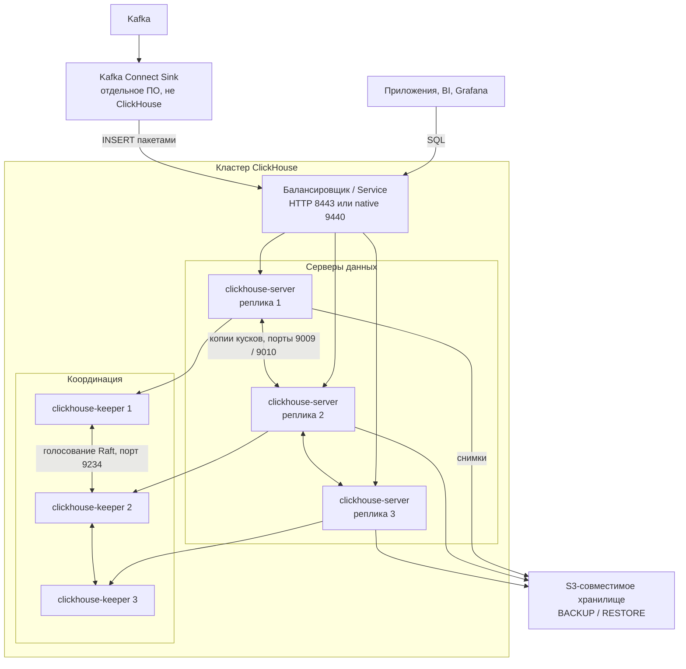

# ClickHouse 26.7.5.10 — развёртывание и настройка

ClickHouse — колоночная аналитическая база: быстро считает суммы, средние и срезы по большим таблицам. Этот документ про **свою установку** версии **26.7.5.10-stable** (релиз 21 августа 2026, на дату подготовки — последний стабильный патч линии 26.7). Это не облако ClickHouse Cloud и не ClickHouse Private: там другие диски, другие обещания и другие манифесты, их сюда копировать нельзя.

Документация: https://clickhouse.com/docs/  
Образы: `clickhouse/clickhouse-server:26.7.5.10`, `clickhouse/clickhouse-keeper:26.7.5.10`.  
На Kubernetes для этой схемы: **Altinity Kubernetes Operator 0.27.3** (12 августа 2026; объекты `ClickHouseInstallation` и `ClickHouseKeeperInstallation`).

Если внутренние правила запрещают частые крупные обновления — весь кластер ставят на линейку с длительной поддержкой **26.3** (на дату документа последний патч **26.3.21.7-lts**). Поставщик по умолчанию рекомендует `stable`. **Не смешивать** 26.7 и 26.3 в одном кластере.

Этот текст — не набор команд «скопируй и запусти», а правила, без которых экземпляр не будет одновременно устойчивым к сбоям, масштабируемым и безопасным. Пошаговая установка — в `ClickHouse.install.md`.

---

## Назначение системы

ClickHouse нужен, чтобы **считать агрегаты по большим объёмам** (сроки заявок, полнота эталона, ошибки интеграций, логи сервисов), не убивая транзакционную базу и не превращая поиск (OpenSearch) в склад отчётов.

События приходят из Kafka. Эталон карточек живёт в озере. Процессы ведёт Camunda. Интеграционное API ходит наружу. ClickHouse — **аналитическая проекция**: «сколько», «какие сроки», «какие ошибки», а не «дай клиента по ИНН и поправь ФИО».

Точечные правки строк, юридически значимые карточки и состояние процесса Camunda здесь живут плохо: переписывание данных дорогое, подтверждение записи — про блоки строк, не про одну запись.

---

## Перечень функций

Что умеет self-hosted ClickHouse OSS:

1. **Выполнять SQL** по колоночным таблицам: фильтры, `GROUP BY`, соединения, оконные функции — с упором на скан и агрегацию, не на частые `UPDATE` одной строки.
2. **Сжимать данные на диске** и хранить их кусками (parts), которые в фоне сливаются.
3. **Делить таблицу на шарды** (куски данных на разных серверах) и держать **копии шарда** (реплики), чтобы падение одной машины не уничтожило данные.
4. **Размазывать запрос по шардам** таблицей-прокси Distributed (сама она данные не хранит).
5. **Координировать копии и создание таблиц на всех узлах** через ClickHouse Keeper (свой Raft, замена ZooKeeper).
6. **Создавать таблицу сразу на всём кластере** (`ON CLUSTER`). Без этой оговорки `CREATE` создаст таблицу только на той машине, куда вы подключились.
7. **Самой удалять или переносить старые данные** по правилу TTL («через N дней»).
8. **Принимать поток из Kafka** встроенным движком (доставка «хотя бы один раз», дубли возможны) или через отдельный Kafka Connect Sink (режим «ровно один раз» — для боя).
9. **Делать снимок и восстанавливаться** (`BACKUP` / `RESTORE` в S3-совместимое хранилище). Копии шарда это **не** заменяют: команду «удали таблицу» копия повторит.
10. **Отдавать HTTP** (порт 8123, с TLS — 8443) и свой TCP-протокол (9000 / 9440) для клиентов, JDBC, `clickhouse-client`.
11. **Управлять пользователями через SQL** (роли, квоты, ограничение строк). Учётки только в XML-файле в бэкап кластера **не входят**.
12. **Писать метрики** (в том числе Prometheus, если включить endpoint).

Чего система **не** делает и часто путают: она не озеро эталона, не шина событий, не BPMN, не интеграция с ведомствами, не OLTP «как PostgreSQL». Сама по новым машинам данные не раскладывает: сначала увеличивают CPU/RAM/диск одной реплики, шарды — когда одна машина уже мала. По умолчанию успешный `INSERT` подтверждается **одной** копией: если эта копия умерла до копирования на соседей, блок пропал. Чтобы подтверждение ждало несколько копий, это включают явно.

---

## Требования к развёртыванию

### Требования к ПО

| Что | Что ставить | Комментарий |
|---|---|---|
| **Формат поставки** | Контейнеры Docker **или** поды Kubernetes | Официальные образы `clickhouse/clickhouse-server` и `clickhouse/clickhouse-keeper`. Для Kubernetes в этом документе — оператор Altinity **0.27.3**, не «голый» Deployment с данными в `emptyDir`. |
| **ОС** | Linux x86_64 или ARM64 | Это основной контур. **Боевой ClickHouse на Windows-хосте в схеме с Kubernetes не предполагается.** |
| **Оркестратор боя** | Kubernetes (свой) | Чарты и манифесты фиксировать **тегом релиза**, не `latest`. Перед боем прогнать именно **26.7.5.10** на стенде: оператор умеет много версий ClickHouse. |
| **Диск** | Локальные SSD / NVMe, обычная файловая система POSIX | **Не NFS и не «сетевая папка как каталог данных».** Слияние кусков и запись чувствительны к задержке fsync. В Kubernetes — отдельный том на каждую реплику и каждый Keeper, класс диска с предсказуемым IOPS. |
| **Java** | На сам ClickHouse **не нужна** (это C++) | Java понадобится **рядом**, если ставите Kafka Connect. |
| **ZooKeeper** | Не нужен, если ставите Keeper | Смешивать Keeper и ZooKeeper в одном кворуме нельзя. |
| **Бэкап** | S3-совместимое хранилище, доступное с нод | Реплики бэкап не заменяют. |
| **Сертификаты** | Корпоративный PKI для боя | Самоподписанные — только стенд. |

Лимит открытых файлов в Docker-гайде: `ulimit nofile=262144`. Имена хостов в конфиге лучше фиксировать **именем, не сырым IP**: смена имени у Keeper = вывести и ввести сервер в кворум, иногда это невозможно.

### Требования к ресурсам

Цифр «сколько ядер на ваши терабайты» у проекта **нет** — нагрузки в исходном запросе не было. Ниже ориентиры поставщика, не смета закупки.

| Роль | CPU | RAM | Диск |
|---|---|---|---|
| **Сервер данных, даже малый объём** | Запас под пик запроса; для склада ad-hoc в тексте поставщика целевая утилизация порядка **10–20%**, не «загрузить на 90%» | **Не ниже 8 ГиБ** | SSD / NVMe. Для частого доступа отношение RAM : диск примерно **1 : 30–1 : 50**; для длинного хранения **1 : 100–1 : 130** (пример: 100 ГиБ RAM на 10 ТБ данных **на одну реплику**) |
| **ClickHouse Keeper** | Небольшие машины, не соседствовать с тяжёлым слиянием кусков | Ориентир из туториала: порядка **4 ГиБ**, «пока серверы данных не выросли» | **Отдельный быстрый том** под журнал голосования и снимки. По умолчанию каждое признание записи идёт через fsync: медленный диск Keeper = медленное создание таблиц и репликация **всего** кластера |
| **Учебный один контейнер** | Минимальные | Хватит меньше боевого минимума | Можно маленький том; на бою так нельзя |

Дополнительно:

- Три копии одного шарда занимают примерно **утроенный** сжатый объём плюс запас под слияние кусков, переписывание и бэкап.
- В Kubernetes том не умеют уменьшить — размер сразу с запасом.
- Примеры «сотни терабайт, десятки реплик» из гайда поставщика — чужие кластеры, не ваш список закупки.

---

## Основные элементы системы и зависимости

Это одно ПО из **нескольких процессов**. Ниже — те, что живут отдельными инстансами, и как они вызывают друг друга.

### Схема инстансов и потоков



Как читать схему:

1. Клиенты (люди, сервисы, Grafana) ходят на **8123/8443** (HTTP) или **9000/9440** (свой протокол). На Keeper и на порт копирования кусков **клиентов не пускают**.
2. **clickhouse-server** хранит таблицы и считает SQL. Несколько серверов — это либо копии одного шарда (отказ машины), либо разные шарды (больше объёма и параллелизма).
3. Копии одного шарда пересылают друг другу куски файлов напрямую (**9009**, с TLS — **9010**). Общий «один адрес на все 9009» ломает копирование.
4. **ClickHouse Keeper** (обычно **три** отдельных процесса) помнит, какие копии живы, и проводит `CREATE` на всех узлах. Без большинства Keeper реплицируемые таблицы переходят в **только чтение**.
5. Поток из Kafka в бою лучше вести через **отдельный** Connect, не через встроенный движок на сервере. Connect — другое ПО со своей отказоустойчивостью.
6. Снимки уезжают в объектное хранилище. Реплика спасает от падения **машины**, не от `DROP TABLE` и не от шифровальщика.

### Что входит в состав

| Компонент | Зачем | Как масштабируется |
|---|---|---|
| **clickhouse-server** | Данные + SQL | Сначала больше CPU/RAM/диск на реплику, потом новые шарды. Копии шарда — для отказа и чтения |
| **ClickHouse Keeper** | Метаданные копий, создание таблиц на всех | Нечётное число, типично **3** выделенных узла. Не масштабируют «от числа отчётов» |
| **clickhouse-client / HTTP** | Клиенты | Без своего склада данных |
| **Движки таблиц** | MergeTree / реплицируемый MergeTree / Distributed / Kafka / … | Выбираются **на таблицу**, не «галочка HA на весь кластер» |

Рядом, но это уже другое ПО: Kafka Connect ClickHouse Sink, Vector/Fluent Bit, Grafana, бакет для снимков. Их отказ проектируется отдельно.

### Официальные порты (менять можно, это контракт сети)

| Порт | Назначение |
|---|---|
| **8123/TCP** | HTTP |
| **8443/TCP** | HTTP + TLS |
| **9000/TCP** | Native TCP, запросы между шардами |
| **9440/TCP** | Native + TLS |
| **9009/TCP** | Копии кусков между репликами |
| **9010/TCP** | То же + TLS |
| **9181/TCP** | Keeper, клиенты (рекомендованный; в XML исторически встречался 2181 как у ZooKeeper) |
| **9281/TCP** | Keeper клиент + TLS |
| **9234/TCP** | Голосование Keeper между собой |
| **9363/TCP** | Prometheus-метрики, если включили |
| **9004 / 9005 / 9100** | Эмуляция MySQL / PostgreSQL / gRPC — в бою **выключают**, если не используете |

Балансировщик перед HTTP допустим. Native 9000 тоже можно закрыть Service для **клиентов**. Репликация 9009 и голосование 9234 — **прямое** соединение машина↔машина.

### Зависимости окружения

- Стабильный DNS или IP каждой ноды на 9000/9009 и каждого Keeper на 9181/9234.
- В Kubernetes том с режимом «один под — один диск» на каждую реплику и каждый Keeper. `emptyDir` как каталог данных OSS = потеря кусков при рестарте пода (так устроены Cloud/Private, не эта схема).
- Идентификация: люди — отдельные SQL-пользователи; сервисы — свои учётки с минимумом прав. Общий пользователь `default` у приложений запрещён.

---

## Краткие вводные

### Как устроена отказоустойчивость

Это **большинство Keeper** плюс **копии шарда** плюс **явное правило, сколько копий подтверждают INSERT**. Три контейнера с обычным MergeTree — это три разные базы, не отказоустойчивый кластер.

**1) Keeper**

| Что падает | Что происходит |
|---|---|
| Один Keeper из трёх | Остаётся двое, большинство есть, выбирается другой лидер |
| Два Keeper из трёх | Большинства нет. Нет лидера. Реплицируемые таблицы — **только чтение**. Новые `ON CLUSTER` не проходят |
| Keeper совмещён с тяжёлым clickhouse-server на тех же дисках | Нагрузка отчётов бьёт по fsync голосования → «странно медленное создание таблиц и репликация» |
| Все Keeper в одном дата-центре | Падение площадки = нет координации, даже если данные копий живы в других местах |

Поставщик настоятельно рекомендует **отдельные** машины для Keeper в бою. Совмещать на одном процессе «можно», для боя — нет.

Три Keeper в трёх зонах переживают потерю **одной** зоны, не двух.

**2) Данные (копии + подтверждение INSERT)**

| Что падает | Что происходит |
|---|---|
| Одна реплика, данные уже успели скопироваться | Чтение с оставшихся. Запись жива, если живых копий не меньше порога подтверждения |
| Реплика, на которую только что успешно записали **без** порога, умерла до копирования | Блок **потерян**. Это штатное поведение завода, не баг |
| Нет `BACKUP`, погибли все копии шарда / сделали `DROP` | Данных нет. Реплика не бэкап |

Репликация **таблицы**, не «всего сервера». На одной ноде могут быть и реплицируемая таблица, и голый MergeTree (последний при падении ноды просто исчезает).

`CREATE` / `DROP` / `RENAME` **сами по копиям не едут** — нужен `ON CLUSTER` (или повторить команду). Иначе «на одной ноде таблица есть, на другой нет».

**3) Клиентский вход**

Падение одного сервера при правильном балансировщике ≠ падение кластера. Все копии в одной зоне — отказ **площадки**, не протокола.

**4) Пайплайн перед кластером**

Connect или встроенный Kafka-движок упал — ClickHouse хранит старое, новое не приходит. Буфер должен быть **в Kafka**, не «в надежде что выгрузка не умрёт».

### Как устроено масштабирование

Несколько независимых осей (их нельзя путать):

1. **Больше объёма и тяжёлых сканов** → сначала **больше железа** на реплику. Поставщик прямо: ClickHouse сам не шардирует; перекладка по новым шардам дорогая; «берите машину побольше, чтобы не шардировать рано».
2. **Когда одна реплика уже не влезает** → **шарды**. При вставке через Distributed ключ шардирования задаёте вы (или приложение пишет в нужный шард).
3. **Отказ и чтение** → **копии шарда**. Поставщик: **не меньше трёх** копий на шард on-prem (две — оговорка для облачных дисков вроде Amazon EBS; у вас своих дата-центров это не касается).
4. **Keeper** почти не масштабируют «от числа отчётов». Ему важны fsync и число операций метаданных. На каждый блок INSERT в Keeper уходит порядка десяти записей; совет «не чаще одного INSERT в секунду» относится к **мелким** вставкам в координатор, не к строкам. Поток строк может быть огромным, если пакеты крупные.

С версии **26.3** (есть и в 26.7) сервер **сам пакует мелкие INSERT**. Это не отменяет пакеты на стороне Kafka Connect. Миллионы одиночных строк из десятков интеграций всё равно рождают куски на диске и давят Keeper.

### Безопасность самого ClickHouse

Компрометация кластера с витринами клиентов или аудитом интеграций = компрометация персональных данных и ответов ведомств. Учётка `default` без пароля и открытый 8123 в интернет равносильны ключу от склада.

- Пользователь `default` без пароля; в Docker сетевой доступ у него **выключен**, пока не зададите пароль.
- Переменная `CLICKHOUSE_SKIP_USER_SETUP=1` открывает `default` «чтобы завелось» — только лаборатория.
- Туториал репликации сам пишет: пароль на `default` в примере выключен для простоты, на практике так делать не стоит.
- Адрес прослушивания надо задавать явно; `0.0.0.0` без сетевой политики — весь интерфейс.
- В файле пользователей открыть доступ с любого IP поставщик называет небезопасным, если нет нормального файрвола.
- Учётки только в XML не попадут в `BACKUP`.
- В 26.7 SQL пользователя по умолчанию **не берёт** облачные ключи процесса для S3 — ключи кладут в именованный набор на сервере, не в текст запроса.

«Поднять `docker run` из гайда и выдать 8123 в интернет» — это новая поверхность атаки, не аналитическая платформа. Штатный TLS — OpenSSL, не отдельная криптография по требованиям КИИ, если ИБ её выдвинет.

---

## Допущения

Ниже то, чего не было в исходном запросе, но без чего нельзя нарисовать конкретную схему. Если допущение неверно — схему надо пересмотреть.

1. Берём **свою установку OSS 26.7.5.10**, не Cloud и не Private.
2. Бой крутится в Kubernetes, установщик — **Altinity Operator 0.27.3**.
3. Если политика обновлений требует линейку с длительной поддержкой — **весь** кластер на **26.3.21.7-lts**, не «серверы 26.7, Keeper 26.3».
4. Три дата-центра = три независимых отказа. Три зала с общим питанием эту схему не спасают.
5. Один кластер, размазанный на три площадки, принимается **только если** сеть голосования Keeper (9234) и копирования кусков (9009) достаточно быстрая и стабильная. Порога задержки у проекта **нет**. Пока её не измерили — это гипотеза.
6. Цель отказа: пережить **1** дата-центр, не 2 из 3. Три Keeper по одному на площадку это переживают; два мёртвых дата-центра — нет.
7. Нагрузки нет — поэтому **нет** цифры «N шардов и M терабайт тома». Есть сигналы (куски на диске, отставание копий, CPU, RAM, диск, лаг Kafka) и рычаги (железо, копии, шарды, TTL, пакеты).
8. Формального SLA нет. Три живые копии ≠ юридический круглосуточный режим и ≠ «ни один факт не потерян, если выгрузка из Kafka отстала».
9. Корпоративные сертификаты есть или будут. Самоподписанные — для теста.
10. Люди и сервисы — разные SQL-учётки, минимум прав.
11. Шифрование канала — TLS OpenSSL. Требования отдельной криптографии государством не озвучены; обычный ClickHouse их не закрывает.
12. Учебный стенд изолирован. На нём допустимы одна нода, HTTP без TLS и слабые лимиты. В бой их не копируем.
13. Kafka, Camunda, озеро, интеграционное API — источники и потребители, не часть этого ПО. Контракт: пакет INSERT, ключ шарда, схема колонок, TTL, повтор той же пачки не плодит дубли.
14. Лицензия Apache 2.0 у OSS ClickHouse. Отдельного license-server нет. Следить нужно за обвязкой (Connect, UI, оператор — свои лицензии).
15. Питание из Kafka в бою — **ClickHouse Kafka Connect Sink** с режимом «ровно один раз», не ставка «только встроенный Kafka-движок на сервере». Движок оставляем как упрощение стенда.

---

## Критически важные условия, которых нет в исходном контексте

Их нужно закрыть **до** «поставили оператор и забыли».

| Пробел | Почему это ломает решение |
|---|---|
| **Задержка и потери между дата-центрами** на портах 9234, 9181, 9009, 9000 | Заводские настройки Keeper: пульс **500 мс**, окно выборов **1–2 с**. Если задержка сети сопоставима — ложные выборы лидера и уход таблиц в только чтение. Подтверждённый INSERT не быстрее, чем доставка блока на вторую площадку |
| **Один Kubernetes на три площадки или три изолированных** | Размазанный кластер требует прямого под↔под на 9009/9234. Иначе — один кластер в одном дата-центре + восстановление из снимка, не один экземпляр |
| **Что именно кладёте в ClickHouse** (витрины? аудит интеграций? сырые логи? всё сразу?) | Разный ключ сортировки, TTL, шардирование, класс диска, права. «Терабайты» без состава — не смета |
| **Как пишете и как читаете** (пакеты в секунду vs тяжёлые SELECT) | Иначе купите CPU «под отчёты», а умрёте на мелких кусках на диске — или наоборот |
| **Срок хранения и персональные данные** | TTL, что можно класть в колонки, куда уезжает снимок |
| **Где живёт бакет снимков** | Если только в одном дата-центре — падение этой площадки убивает бэкап |
| **Нужна ли запись при падении одной копии** | Тогда порог подтверждения INSERT = 2 (при трёх копиях), не 3. Иначе «отказ на чтение переживается, на запись — нет» |
| **Класс диска: локальный SSD vs сеть** | Медленный том = рост кусков, отставание копий, лаг выгрузки из Kafka при «живом» SQL |
| **Совместимость оператора 0.27.3 с вашей версией Kubernetes** | Релиз оператора не заменяет проверку в вашем контуре |

---

## Краткое описание ключевых этапов и элементов развертывания

Общий каркас (и тест, и бой):

1. Зафиксировать **26.7.5.10** на серверах данных **и** на Keeper (или весь контур на 26.3.21.7-lts). Не `latest`.
2. Выбрать роли: Keeper **отдельно** в бою; на тесте допустимо на одной машине с сервером.
3. Поднять тройку Keeper, проверить, что процесс не просто слушает порт, а **член кворума** (команды `ruok` / `mntr` из документации).
4. Поднять серверы, прописать адреса Keeper, макросы имён копии/шарда, список шардов.
5. Выпустить **своих** пользователей и TLS **до** боевых клиентов. Не оставлять пустой пароль `default`.
6. Создать таблицы **реплицируемого MergeTree с `ON CLUSTER`**, не голый MergeTree «на одной ноде».
7. Зарегистрировать диск для **снимка в S3** и сделать первый снимок тестовой таблицы (проверка, что восстановление вообще работает).
8. Задать **TTL и ключ сортировки** до боевого потока. Ключ сортировки потом дёшево не поменять.
9. Включить метрики: состояние копий, куски на диске, запросы, Keeper, лаг Kafka.
10. Прогнать пакет INSERT и SELECT. Убедиться, что падение одной реплики оставляет таблицу читаемой **и** что INSERT с порогом подтверждения 2 проходит.

Боевая схема на несколько дата-центров — в `ClickHouse.install.md`. Ниже — только учебный стенд.

---

### 1 инстанс: тестовый стенд, 1 площадка, без нагрузки

**Цель стенда:** чтобы разработчики писали SQL, подбирали ключ сортировки, смотрели сжатие ваших событий из Kafka. **Не** цель: доказать отказ дата-центра.

**Путь A — один контейнер** (быстрее понять продукт):

```text
docker run -d \
  --name ch-dev \
  --ulimit nofile=262144:262144 \
  -p 8123:8123 -p 9000:9000 \
  -e CLICKHOUSE_PASSWORD=<strong-password> \
  -e CLICKHOUSE_DEFAULT_ACCESS_MANAGEMENT=1 \
  clickhouse/clickhouse-server:26.7.5.10
```

Проверка: `clickhouse-client` или `curl` на `http://localhost:8123`.  
Без пароля в Docker пользователь `default` **не слушает сеть** — это не «сломанный образ».

**Путь B — официальный пример из двух серверов и трёх Keeper** (`cluster_1S_2R`). Поставщик даёт его как **учебный** docker-compose, не как бой. В примере часто `default` без пароля — на практике так не делают.

На Kubernetes: один объект серверов с 1 копией, маленький том, без отдельного Keeper. Этот YAML в бой не копировать.

#### Что сознательно упрощаем

| Параметр | На тесте | Почему можно |
|---|---|---|
| Число серверов | 1 | Нет требования пережить обновление |
| Keeper | нет (обычный MergeTree) | Иначе команда утонет в голосовании раньше, чем в ключе сортировки |
| Копии | 0 | Некому копировать |
| TLS | нет, сеть изолирована | Иначе сертификаты раньше SQL |
| Пароль | свой сильный | Без него с хоста не зайдёте; в интернет всё равно не открываем |
| CPU / диск | минимальные | Не цель — ёмкость |
| Встроенный Kafka-движок | можно | На стенде проще, чем поднимать Connect |
| Снимок | можно отложить на день | Нельзя «забыть навсегда» — на препроде бакет обязателен |

#### Чего на тесте **не** стоит упрощать

- Версия **26.7.5.10** (или сразу линейка с длительной поддержкой, если бой будет на ней).
- Таблицы с явным ключом сортировки под **ваши** запросы («по client_id + дате»), не пустой ключ.
- Пакеты INSERT, не «вставить каждую строку из цикла». Сервер сам пакует мелкие вставки с 26.3, но схема «десятки интеграций по одной строке» всё равно врёт про бой.
- Понимание, что **голый MergeTree на одной ноде не копируется**. Успешный SELECT на ноутбуке **не** доказывает порог подтверждения INSERT и голосование Keeper.

#### Сильные стороны такой схемы

- Поднимается за часы, совпадает с официальным Docker-гайдом.
- Дешево показывает сжатие и «какие GROUP BY взрывают RAM» на *ваших* данных.
- Одна нода официально нормальна для разработки.

#### Слабые стороны (обязательно понимать)

- Нет модели отказа площадки, нет Keeper, нет копирования кусков между машинами.
- Успешный отчёт на одном узле **не** доказывает, что подтверждённый INSERT переживёт задержку сети и что `ON CLUSTER` создаст таблицу везде.
- HTTP без TLS и учётка `default` приучают «зайти как получится».

Практическая рекомендация: препрод = маленькая **копия боевой топологии** (3 Keeper + 1 шард × 3 копии, TLS, порог INSERT = 2, снимки), даже без боевого трафика. Всё это **в одном** дата-центре.

---

## Сводка: что считать «экземпляр готов»

| Требование | Тест (1 площадка) | Бой |
|---|---|---|
| Отказоустойчивость | Не требуется | 3 выделенных Keeper; 3 копии шарда; реплицируемый MergeTree; порог подтверждения INSERT = 2 (или «большинство»); снимок с прогнанным восстановлением. Схема на 2–3 дата-центра — в `ClickHouse.install.md` |
| Производительность / масштаб | Не требуется | Сначала больше железа; шарды когда одна машина мала; пакеты INSERT; SSD не NFS; TTL; клиенты не на Keeper |
| Безопасность | Пароль `default` в изоляции; без «пропустить настройку пользователя» | Нет пустого `default` в сеть; TLS на клиентских портах, между репликами и у Keeper; пользователи через SQL; 8123 не в интернет; секреты не в git; шифрование томов |

**Не готов к бою**, если: один MergeTree без Keeper; порог подтверждения INSERT выключен на фактах, которые нельзя терять; Distributed сам пишет во все копии вместо репликации; пропущена настройка пользователя; открытый HTTP/копирование кусков «на три дата-центра»; данные на NFS или в `emptyDir`; все копии в одной зоне; нет снимка; задержку сети не мерили, а схему уже размазали; ClickHouse назначен эталоном клиентских карточек; встроенный Kafka-движок без понимания дублей выдан за «ровно один раз».

---

## Источники (чтобы не принимать на веру)

- Релиз 26.7.5.10 (21 Aug 2026): https://github.com/ClickHouse/ClickHouse/releases/tag/v26.7.5.10-stable
- Линейка с длительной поддержкой 26.3.21.7 (22 Aug 2026): https://github.com/ClickHouse/ClickHouse/releases
- Модель релизов stable vs LTS: https://clickhouse.com/docs/development/backports и https://clickhouse.com/docs/knowledgebase/production
- Keeper: https://clickhouse.com/docs/guides/oss/deployment-and-scaling/keeper
- Туториал репликации: https://clickhouse.com/docs/architecture/replication
- Реплицируемые таблицы, подтверждение INSERT, нагрузка на координатор: https://clickhouse.com/docs/reference/engines/table-engines/mergetree-family/replication
- Настройка `insert_quorum`: https://clickhouse.com/docs/reference/settings/session-settings/insert-quorum
- Distributed: https://clickhouse.com/docs/reference/engines/table-engines/special/distributed
- Горизонталь: https://clickhouse.com/docs/architecture/horizontal-scaling
- Железо: https://clickhouse.com/docs/guides/oss/best-practices/sizing-and-hardware-recommendations
- Порты: https://clickhouse.com/docs/concepts/features/security/network-ports
- Docker, `default`, ulimit: https://clickhouse.com/docs/get-started/setup/self-managed/docker
- TLS: https://clickhouse.com/docs/concepts/features/security/tls/configuring-tls
- Пользователи: https://clickhouse.com/docs/concepts/features/configuration/settings/settings-users
- BACKUP: https://clickhouse.com/docs/concepts/features/backup-restore/overview
- Kafka engine: https://clickhouse.com/docs/integrations/kafka/kafka-table-engine
- Kafka Connect: https://clickhouse.com/docs/integrations/kafka/clickhouse-kafka-connect-sink
- Altinity Operator 0.27.3: https://github.com/Altinity/clickhouse-operator/releases
- Изменение 26.7 (ключи S3 в пользовательском SQL): https://clickhouse.com/docs/whats-new/changelog

Утверждения вида «ClickHouse переживёт два дата-центра» или «N миллисекунд — можно размазать Keeper» в документации проекта **отсутствуют**. Задержку на 9234 и 9009 надо измерить у себя. Рекомендации ClickHouse Private (кэш в `emptyDir`, объектное хранилище как основной диск) к этой OSS-схеме **не применяются**.
