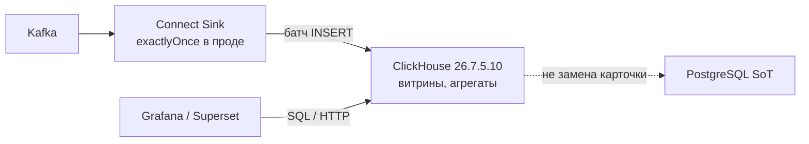
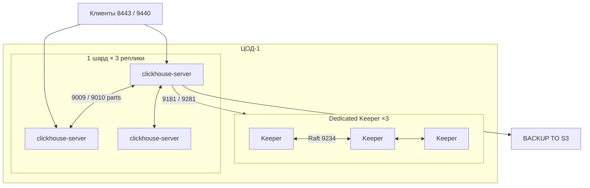
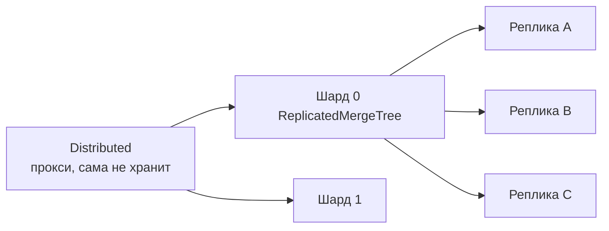
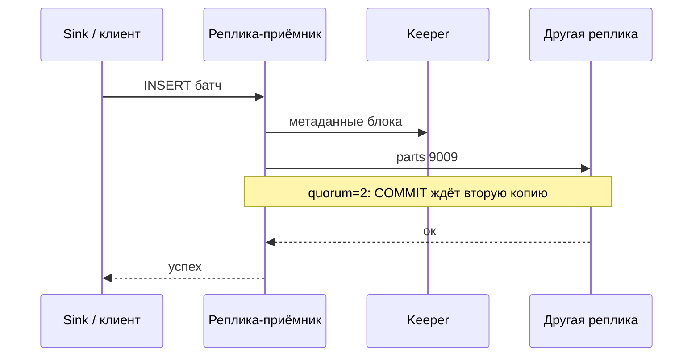
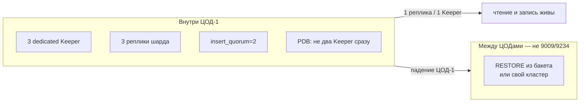
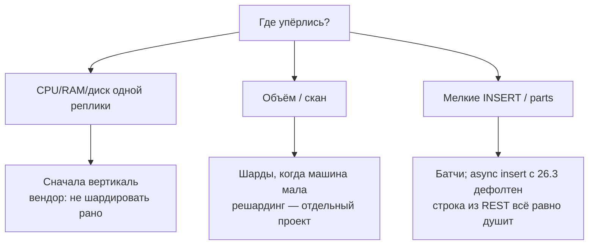
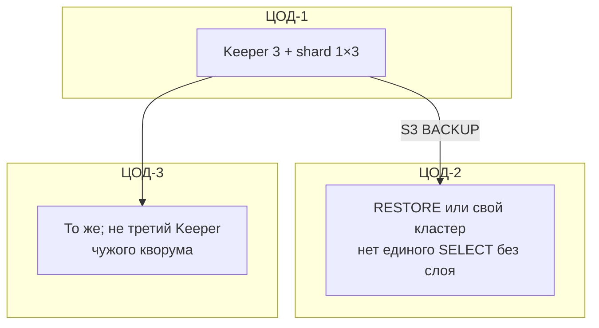

# ClickHouse 26.7.5.10 — схемы устройства

Связанные документы: правила — `ClickHouse.md`; установка — `ClickHouse.install.md`.

C4 / «D4»: контекст → контейнеры → компоненты. Код SQL клиентов не рисуем.

Допущения: stretch Raft Keeper **9234** и interserver **9009** на 2–3 ЦОДа **нет**; OSS 26.7.5.10 + Altinity Operator **0.27.3**, не Cloud/Private; не OLTP; нагрузка не замерена.

---

## 1. Контекст

ClickHouse — **колоночный OLAP**. Не карточка клиента, не шина, не Camunda.

Точечный `UPDATE` по ИНН и многотабличные транзакции здесь живут плохо. Мутации дорогие. Kafka engine на сервере — **at-least-once**; exactly-once — у Connect + KeeperMap.

---

## 2. Контейнеры (один кластер = один ЦОД)

Три контейнера с голым MergeTree — три разные базы, не HA.

Клиенты: **8123/8443** HTTP, **9000/9440** native. **На Keeper и на 9009 внешний трафик не пускают.** VIP «на все 9009» ломает копирование parts. Диск — local SSD, не NFS, не `emptyDir` для `/var/lib/clickhouse`.

**Сильное:** падение одной реплики при живом кворуме — чтение живо. **Слабое:** дефолт INSERT подтверждает **одну** реплику; блок может пропасть до копирования.

---

## 3. Компоненты таблиц

`ON CLUSTER` + макросы `{shard}`/`{replica}` — иначе `CREATE` только на той ноде, куда подключились. `internal_replication=true`: Distributed пишет в **одну** здоровую реплику, дальше копирует ReplicatedMergeTree.

`insert_quorum=2` (или `'auto'` при 3 репликах): клиент ждёт большинство. `insert_quorum=3` остановит запись при падении одной реплики.

---

## 4. Поток INSERT с кворумом

Без quorum: OK клиенту **до** догона. Реплика не бэкап: `DROP TABLE` уедет на всех. XML-учётки не входят в `BACKUP` — прод SQL-driven.

---

## 5. Что настраивать: отказоустойчивость

| Ручка | Если забыть |
|---|---|
| Dedicated Keeper | Тяжёлый merge бьёт по fsync Raft → DDL и репликация «странные» |
| `internal_replication=true` | Distributed сам пишет во все реплики — расхождения |
| Бакет переживает ЦОД-1 | Бэкап умер вместе с кластером |
| Один мажор 26.7 | Мешать с LTS 26.3 в одном кластере нельзя |

Два мёртвых Keeper из трёх — нет лидера, ReplicatedMergeTree **read-only**. Не класть «все Keeper в ЦОД-1, данные в трёх»: падение мозга = данные без координации.

---

## 6. Что настраивать: масштабируемость

TTL и `ORDER BY` с первого дня: ключ сортировки дешево не поменять. Ориентиры RAM:диск вендора — не смета вашего прода.

---

## 7. Прод: 2 или 3 ЦОДа без stretch

Heartbeat Keeper дефолт **500 мс**. Если p99 RTT сопоставим — ложные выборы. Порога в доке **нет**, поэтому 9009/9234 между ЦОДами **не** рисуем.

**Сильное:** Raft локальный. **Слабое:** падение ЦОД-1 = нет аналитики, пока restore; RPO > 0; второй кластер — вторая правда таблиц.

---

## 8. Безопасность (ручки на той же схеме)

Нет `CLICKHOUSE_SKIP_USER_SETUP`. `default` без пароля в сеть — дыра. Прод: 8443/9440, interserver 9010, Keeper TLS. `secret` в `remote_servers`, иначе чужой 9000 прикинется шардом. Эмуляции 9004/9005/9100 выключить. В 26.7 пользовательский SQL по умолчанию **не** берёт server-side S3 credentials.

Источники: `ClickHouse.md`. Порога RTT у проекта **нет**.
