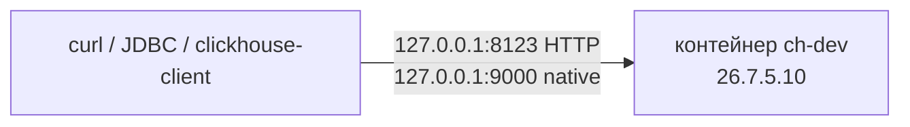

# ClickHouse 26.7.5.10 — установка (учебный контур)

ClickHouse — колоночная аналитическая база (**OLAP**: сканы и агрегаты по большим таблицам, не точечный `UPDATE` карточки). Ставите **свою** OSS-копию **26.7.5.10-stable** (релиз 21 августа 2026), не Cloud и не Private. Образ: `clickhouse/clickhouse-server:26.7.5.10`. Не `latest`.

**Допущение:** закрытая сеть, одна Linux-машина, Docker. Этот запуск в бой не копировать.

**Docker** — программа, которая запускает **образ** (упакованная программа с зависимостями) как **контейнер**. Официальный путь: [Install using Docker](https://clickhouse.com/docs/get-started/setup/self-managed/docker). Тег на Docker Hub проверен: `26.7.5.10`.

Если политика запрещает частые крупные релизы — **весь** контур на **26.3.21.7-lts**, не смесь. Сервер 26.7 и Keeper 26.3 (или наоборот) **нельзя**. На этом стенде Keeper не ставим.

---

## Куда ставить и сколько ресурсов (учебный контур)

**Куда.** Выделенная Linux-машина стенда. На ней — один контейнер `clickhouse-server` (**процесс**, который принимает SQL и хранит таблицы). Порты хоста: **8123** (HTTP) и **9000** (native TCP) только на `127.0.0.1`. Каталог данных — **локальный диск**, не NFS (NFS как data dir вендор не описывает; слияние **parts** — кусков на диске — чувствительно к fsync). Kubernetes и оператор Altinity **0.27.3** — не этот шаг.

Совместимость образа ([Docker](https://clickhouse.com/docs/get-started/setup/self-managed/docker)): amd64 = **x86-64-v3** (AVX2 и др., CPU примерно после 2015); arm64 = ARMv8.2-A + Load-Acquire RCpc. Raspberry Pi 4 — нет. С 24.11 база образа `ubuntu:22.04` → Docker **≥ 20.10.10**.



**Сколько.** Минимум «процесс поднялся» и смета боя — разные вещи. Нагрузки в контексте нет — **не** обещать «хватит для терабайтов». В Docker-гайде **нет** цифр CPU/RAM на один контейнер.

| Зачем | CPU | RAM | Диск | Откуда |
|---|---|---|---|---|
| Сервер данных, даже малый объём | для ad-hoc целевая утилизация порядка **10–20%**, не «загрузить на 90%» | **не ниже 8 ГиБ** | SSD/NVMe. Частое чтение: RAM:диск ~**1:30–1:50**; длинное хранение ~**1:100–1:130** | [Sizing](https://clickhouse.com/docs/guides/oss/best-practices/sizing-and-hardware-recommendations) |
| Учебный один контейнер | хватит, чтобы процесс жил | меньше 8 ГиБ на стенде допустимо (карточка платформы, не цифра вендора) | маленький том `/var/lib/clickhouse` | решение платформы; в Docker-гайде минимума нет |

Шарды (куски строк на разных серверах) на стенде **не** плодим: вендор — сначала вертикаль одной копии, решардинг дорогой.

**Сильная сторона:** минуты, тот же `docker run`, что у вендора. **Слабая:** одна нода, голый **MergeTree** (колоночная таблица без копий) — нет Keeper, нет шардов, нет отказа зала.

**Критично:** 8123 и 9000 в интернет не публиковать. Без `CLICKHOUSE_PASSWORD` пользователь **`default`** сеть не принимает — так задумано, не «сломанный образ». `CLICKHOUSE_SKIP_USER_SETUP=1` не включать. Не `latest`. Не смешивать 26.7 и 26.3, если позже появится Keeper. Один контейнер ≠ кластер.

---

## Установка для новичка

Команды — **на Linux-машине стенда**. Страница шагов: https://clickhouse.com/docs/get-started/setup/self-managed/docker

### Что должно быть до установки

**Есть:**

- Docker **≥ 20.10.10**, демон запущен
- CPU совместим с образом (x86-64-v3 или arm64 как выше)
- свободны localhost **8123** и **9000**
- закрытая сеть; вход с jump-хоста / VPN

**Нет** (и не должно появиться):

- `-p 8123:8123` без `127.0.0.1` (слушает все интерфейсы)
- `CLICKHOUSE_SKIP_USER_SETUP=1`
- тег `latest` / ветка `26.7` без патча
- Keeper другой линейки (26.3) рядом с этим сервером
- публикация 8123/9000/9009/9234 в интернет

### Этап 1. Docker и образ

**Что делаем:** проверяем Docker и скачиваем **именно** 26.7.5.10.

```bash
docker version
docker pull clickhouse/clickhouse-server:26.7.5.10
```

Успех: клиент и демон живы; pull без ошибки. `Cannot connect to the Docker daemon` — демон не запущен.

### Этап 2. Запуск контейнера

**Что делаем:** поднимаем сервер. `--ulimit nofile=262144:262144` — лимит открытых файлов из гайда вендора. `CLICKHOUSE_PASSWORD` открывает `default` в сеть. `CLICKHOUSE_DEFAULT_ACCESS_MANAGEMENT=1` включает SQL-пользователей (`CREATE USER`). Том — данные после рестарта.

```bash
docker run -d --name ch-dev \
  --ulimit nofile=262144:262144 \
  -p 127.0.0.1:8123:8123 \
  -p 127.0.0.1:9000:9000 \
  -v ch-dev-data:/var/lib/clickhouse/ \
  -e CLICKHOUSE_PASSWORD=dev \
  -e CLICKHOUSE_DEFAULT_ACCESS_MANAGEMENT=1 \
  clickhouse/clickhouse-server:26.7.5.10
```

Пароль `dev` — **только закрытый стенд**, не секрет боя. Привязка к `127.0.0.1` — требование этого контура (пример вендора мапит порты без адреса хоста).

Успех: `docker ps` — `ch-dev` в `Up`; образ с тегом **26.7.5.10**.

### Этап 3. `SELECT version()` = 26.7.5.10

**Что делаем:** проверяем, что отвечает именно эта сборка. Пароль в URL вендор **не** рекомендует (логи прокси) — заголовки.

```bash
curl -s http://127.0.0.1:8123/ping
echo 'SELECT version()' | curl -s 'http://127.0.0.1:8123/' \
  -H 'X-ClickHouse-User: default' \
  -H 'X-ClickHouse-Key: dev' \
  --data-binary @-
```

Успех: `/ping` → `Ok.`; версия **ровно** `26.7.5.10`. Иначе — не тот тег.

То же native-клиентом внутри контейнера (`clickhouse-client` говорит **native**, не HTTP):

```bash
docker exec -it ch-dev clickhouse-client --user default --password dev -q 'SELECT version()'
```

### Этап 4. Пользователь `app` и база `analytics`

**Что делаем:** заводим SQL-учётку приложения. Приложения **не** ходят как `default` ([access rights](https://clickhouse.com/docs/concepts/features/security/access-rights), [CREATE USER](https://clickhouse.com/docs/reference/statements/create/user), [GRANT](https://clickhouse.com/docs/reference/statements/grant)).

```bash
docker exec -it ch-dev clickhouse-client --user default --password dev -n -q "
CREATE USER app IDENTIFIED BY 'dev-app';
CREATE DATABASE analytics;
GRANT SELECT, INSERT ON analytics.* TO app;
"
```

Проверка от имени `app`:

```bash
docker exec -it ch-dev clickhouse-client --user app --password dev-app -q 'SHOW DATABASES'
```

Успех: база `analytics` видна; `INSERT`/`SELECT` в чужие базы — отказ.

Таблицы — **MergeTree** с явным `ORDER BY` под ваши фильтры (это ключ сортировки на диске, не PRIMARY KEY PostgreSQL). Вставки — **пакетами**, не строка из цикла.

**Чего этот стенд не доказывает:** отказ зала / ЦОД; шарды и таблица-прокси Distributed; кворум Keeper и выборы лидера; копии ReplicatedMergeTree и порог подтверждения INSERT; сеть 9009/9234 между площадками; нагрузка и «хватит терабайтов»; exactly-once из Kafka (встроенный Kafka-движок — **at-least-once**, дубли возможны). Успешный `SELECT version()` на одной ноде — не кластер.

---

## Первый запуск — URL, порт, учётка, смена пароля

Порты контейнера ([network ports](https://clickhouse.com/docs/concepts/features/security/network-ports), [HTTP](https://clickhouse.com/docs/concepts/features/interfaces/http), [native TCP](https://clickhouse.com/docs/concepts/features/interfaces/tcp)):

| Куда | URL / адрес | Кто |
|---|---|---|
| HTTP | `http://127.0.0.1:8123/` → `Ok.` | curl, JDBC, многие BI |
| Play (учебный SQL в браузере) | `http://127.0.0.1:8123/play` | человек на VPN |
| Health | `http://127.0.0.1:8123/ping` → `Ok.` | скрипт |
| Native | `127.0.0.1:9000` | `clickhouse-client`, native-драйверы |

TLS **8443 / 9440** на этом стенде нет. Клиентов на **9009** (копии parts) и на Keeper **не** пускают — здесь этих портов на хост нет.

**Учётка из коробки.** Пользователь **`default`**, пароль — значение `CLICKHOUSE_PASSWORD` (`dev` в команде выше). Без пароля сеть у `default` выключена. `CLICKHOUSE_SKIP_USER_SETUP=1` не использовать.

**Приложение.** Пользователь **`app`**, пароль стенда `dev-app`, база **`analytics`**. Из сервисов и BI — только `app`, не `default`.

**Смена пароля** сразу после проверки ([ALTER USER](https://clickhouse.com/docs/reference/statements/alter/user)):

```sql
ALTER USER default IDENTIFIED BY 'свой-стендовый';
ALTER USER app IDENTIFIED BY 'свой-стендовый-app';
```

Учебные `dev` / `dev-app` в бой не копировать. Новый пароль — сейф / Vault, не git. Заголовки `X-ClickHouse-User` / `X-ClickHouse-Key` или HTTP Basic; `?user=&password=` в URL — только если иначе нельзя (вендор: может попасть в лог прокси).

---

## Подключение к своей системе

Писать **агрегаты и события аналитики**, не карточку с `COMMIT` как в PostgreSQL. Эталон карточек — озеро / PostgreSQL. Шина — Kafka. Процессы — Camunda. Ведомства — своё интеграционное API, не этот продукт.

| Клиент | Протокол | Порт | Пример |
|---|---|---|---|
| curl / HTTP API | HTTP | **8123** | заголовки user/key, тело = SQL |
| Официальный JDBC | HTTP (драйвер **не** угадывает протокол по порту) | **8123** | `jdbc:clickhouse:http://127.0.0.1:8123/analytics` |
| Python `clickhouse-connect` | HTTP | **8123** | `host=127.0.0.1`, user `app` |
| `clickhouse-client` | native | **9000** | `--user app --password …` |
| Superset / Grafana | как умеет выбранный драйвер | 8123 или 9000 | учётка **`app`**, не `default` |

JDBC на **9000** — чужой протокол: зависание или ошибка фрейма, не «почти HTTP». Страница драйвера: https://clickhouse.com/docs/integrations/language-clients/java/jdbc

**Поток из Kafka** ([карточка](https://clickhouse.com/docs/integrations/kafka/kafka-table-engine), [Connect](https://clickhouse.com/docs/integrations/kafka/clickhouse-kafka-connect-sink)):

- стенд: встроенный **Kafka engine** + materialized view → MergeTree. Семантика **at-least-once**; дубли возможны.
- не этот стенд: отдельный **ClickHouse Kafka Connect Sink**, `exactlyOnce=true` (состояние в KeeperMap). Java — у Connect, не у ClickHouse.

### Секреты (не в git)

| Секрет | Где живёт | Куда не класть |
|---|---|---|
| `CLICKHOUSE_PASSWORD` (`default`) | env контейнера / сейф | git, образ, чат |
| Пароль `app` | сейф / Vault | git, дашборд в открытом виде |
| Пароль / SASL Kafka (если движок на стенде) | `config.d` на сервере, не SQL | git |

В git — процедура и имена переменных без значений.

### Чем продукт не является

| Сосед | Чем отличается |
|---|---|
| PostgreSQL | OLTP-карточки, многотабличный `COMMIT`. Мутации `ALTER UPDATE`/`DELETE` в ClickHouse переписывают parts — дорого |
| OpenSearch | поиск документов, не колоночный SQL-склад |
| Kafka | доставка событий, не хранение сканов |
| OpenStack Swift | озеро файлов; ClickHouse — витрина |
| Camunda | состояние процесса сюда не кладут |
| Интеграционное API | исходящие вызовы к ведомствам не из этой базы |

---

## Ссылки на материал

| Факт | URL |
|---|---|
| Релиз **26.7.5.10-stable** (21 Aug 2026) | https://github.com/ClickHouse/ClickHouse/releases/tag/v26.7.5.10-stable |
| Тег образа `26.7.5.10` | https://hub.docker.com/r/clickhouse/clickhouse-server |
| Docker: `ulimit nofile=262144`, `default` без пароля без сети, `CLICKHOUSE_PASSWORD`, `CLICKHOUSE_DEFAULT_ACCESS_MANAGEMENT`, `CLICKHOUSE_SKIP_USER_SETUP`, том `/var/lib/clickhouse/`, порты 8123/9000, Docker ≥ 20.10.10, x86-64-v3 / ARM | https://clickhouse.com/docs/get-started/setup/self-managed/docker |
| HTTP 8123, `/ping`, Play `/play`, пароль в URL не рекомендуется | https://clickhouse.com/docs/concepts/features/interfaces/http |
| Native TCP, `clickhouse-client` | https://clickhouse.com/docs/concepts/features/interfaces/tcp · https://clickhouse.com/docs/concepts/features/interfaces/client |
| Порты 8123, 9000, 8443, 9440, 9009, 9181, 9234 | https://clickhouse.com/docs/concepts/features/security/network-ports |
| RAM не ниже 8 ГиБ; RAM:диск; CPU 10–20% для ad-hoc; не шардировать рано; ≥ 3 реплик on-prem | https://clickhouse.com/docs/guides/oss/best-practices/sizing-and-hardware-recommendations |
| `CREATE USER` / `IDENTIFIED BY` | https://clickhouse.com/docs/reference/statements/create/user |
| `ALTER USER` (смена пароля) | https://clickhouse.com/docs/reference/statements/alter/user |
| `GRANT SELECT, INSERT` | https://clickhouse.com/docs/reference/statements/grant |
| SQL-пользователи; `default` | https://clickhouse.com/docs/concepts/features/security/access-rights |
| `users.xml`; SQL-driven рекомендуется; `<ip>::/0</ip>` небезопасно без firewall | https://clickhouse.com/docs/concepts/features/configuration/settings/settings-users |
| JDBC = HTTP, пример `jdbc:clickhouse:http://localhost:8123` | https://clickhouse.com/docs/integrations/language-clients/java/jdbc |
| Python `clickhouse-connect` = HTTP 8123 | https://clickhouse.com/docs/integrations/language-clients/python |
| Kafka engine: at-least-once, дубли | https://clickhouse.com/docs/integrations/kafka/kafka-table-engine |
| Kafka Connect Sink, `exactlyOnce`, KeeperMap | https://clickhouse.com/docs/integrations/kafka/clickhouse-kafka-connect-sink |
| Keeper: не смешивать с ZooKeeper; Raft; dedicated в бою | https://clickhouse.com/docs/guides/oss/deployment-and-scaling/keeper |
| Копии таблиц, подтверждение INSERT | https://clickhouse.com/docs/architecture/replication |
| Оператор Altinity **0.27.3** | https://github.com/Altinity/clickhouse-operator/releases |
| Линейка LTS 26.3 | https://github.com/ClickHouse/ClickHouse/releases |
| Зачем продукт, порты, железо | `ClickHouse.md` |
| Словарь | `ClickHouse.info.md` |
| Схема стыковки с платформой | `ClickHouse.shema.md` |
| Роль консультанта | `ClickHouse.consultant.md` |

**В доке вендора нет (и здесь не выдумано):** минимум CPU/RAM на один контейнер Docker; порог RTT, при котором можно растянуть Keeper/9009 на 2–3 ЦОДа; «N шардов на ваши терабайты»; NFS как каталог данных; обещание, что учебный `SELECT` доказывает отказ зала.
