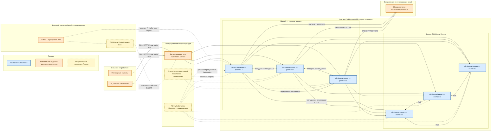

# ClickHouse 26.7.5.10 — назначение, состав и связи

ClickHouse — колоночная аналитическая СУБД. В карточке рассматривается собственная установка ClickHouse OSS **26.7.5.10-stable**, а не ClickHouse Cloud или ClickHouse Private. Для Kubernetes допустим Altinity Kubernetes Operator **0.27.3**. Если внутренняя политика требует линию с длительной поддержкой, весь контур переводят на **26.3.21.7-lts**; смешивать серверы и Keeper разных линий в одном кластере нельзя.

Пошаговая установка вынесена в `ClickHouse.install.md`.

---

## Назначение системы

ClickHouse нужен, чтобы быстро считать агрегаты и строить аналитические срезы по большим объёмам данных: срокам обработки заявок, полноте эталона, ошибкам интеграций, событиям и логам сервисов. Такая нагрузка не должна мешать транзакционной СУБД и не должна превращать OpenSearch в склад отчётов.

В платформе ClickHouse выступает **аналитической проекцией**. События могут поступать из Kafka; эталонные карточки остаются в профильной СУБД или озере; процессы ведёт Camunda; внешние ведомства вызываются через интеграционное API. ClickHouse отвечает на вопросы «сколько», «за какой срок», «какие ошибки», но не является источником юридически значимой карточки и не предназначен для частых точечных исправлений строк.

Сильная сторона решения — быстрые сканы, агрегации и хорошее сжатие больших таблиц. Ограничение — модель хранения и подтверждения записи ориентирована на блоки данных, а не на транзакции над отдельной строкой, как в OLTP-СУБД.

---

## Перечень функций

Self-hosted ClickHouse OSS позволяет:

1. Выполнять SQL по колоночным таблицам: фильтрацию, `GROUP BY`, соединения и оконные функции.
2. Сжимать данные на диске, хранить их частями и выполнять фоновые слияния.
3. Делить набор данных на шарды и создавать реплики каждого шарда. ClickHouse сам не перераскладывает существующие данные при добавлении новых машин: решение о шардировании и переносе данных остаётся за владельцем системы.
4. Выполнять распределённые запросы через таблицу `Distributed`, которая маршрутизирует запросы и сама данные не хранит.
5. Координировать реплицируемые таблицы и распределённые DDL-операции через ClickHouse Keeper.
6. Выполнять DDL на перечисленных узлах с `ON CLUSTER`. Без этой конструкции операция создаёт или изменяет объект только на сервере, куда пришёл запрос.
7. Удалять или переносить устаревшие данные по правилам TTL.
8. Получать поток из Kafka:
   - через встроенный Kafka table engine — **опциональный упрощённый вариант**, при котором возможна повторная обработка;
   - через отдельно развёрнутый ClickHouse Kafka Connect Sink — **опциональный внешний вариант**, поддерживающий exactly-once для подходящего конвейера.
9. Создавать и восстанавливать резервные копии командами `BACKUP` / `RESTORE`, в том числе в S3-совместимом объектном хранилище. Реплики не заменяют резервную копию: логическое удаление может распространиться на все реплики.
10. Принимать клиентские подключения по HTTP(S) и native TCP, в том числе от JDBC-драйверов и `clickhouse-client`.
11. Управлять SQL-пользователями, ролями, квотами и ограничениями. Учётные записи, заданные только XML-файлами, не входят в SQL-бэкап.
12. Отдавать метрики, включая **опциональный** endpoint в формате Prometheus.

ClickHouse не заменяет Kafka, объектное озеро, Camunda, OpenSearch, PostgreSQL или интеграционное API. Порог подтверждения `INSERT` несколькими репликами не включается автоматически для всех записей — требуемую гарантию задают явно.

---

## Основные элементы системы и зависимости

ClickHouse состоит из нескольких процессов и логических объектов. Ниже показана **референсная**, а не обязательная для каждого контура топология: один кластер на одной площадке, один шард и три реплики. Число шардов, реплик и наличие Kafka-контура определяются нагрузкой и требованиями к отказоустойчивости. Живой кластер не следует растягивать на несколько дата-центров без измеренных характеристик сети и подтверждённого проектного решения; документация ClickHouse не задаёт универсального допустимого RTT.

### Схема инстансов и потоков

### Описание блоков схемы

#### Прикладные сервисы

- **Что это:** клиенты, которые записывают аналитические факты или читают витрины.
- **Технологии и варианты:** HTTP(S), native TCP, JDBC и совместимые драйверы.
- **Назначение:** пакетная запись и SQL-запросы.
- **Поставка:** не входят в ClickHouse, развёртываются отдельно.

#### BI, Grafana и аналитики

- **Что это:** пользовательские и машинные клиенты аналитики.
- **Технологии и варианты:** BI-инструменты, Grafana, `clickhouse-client`, JDBC/ODBC-совместимые средства.
- **Назначение:** отчёты, визуализация и исследовательские запросы.
- **Поставка:** не входят в сервер ClickHouse; `clickhouse-client` выпускается проектом ClickHouse, остальные клиенты развёртываются отдельно.

#### Kafka — брокер событий

- **Что это:** внешняя шина событий и буфер входного потока.
- **Технологии и варианты:** существующий платформенный Kafka-кластер.
- **Назначение:** хранить события до их успешной загрузки в аналитику.
- **Поставка:** не входит в ClickHouse и не является обязательной зависимостью, если данные поступают другим способом.

#### ClickHouse Kafka Connect Sink

- **Что это:** отдельный коннектор, работающий в среде Kafka Connect.
- **Технологии и варианты:** ClickHouse Kafka Connect Sink; альтернативой для менее строгого сценария служит встроенный Kafka table engine.
- **Назначение:** читать события из Kafka и выполнять пакетные вставки в ClickHouse; для корректно настроенного конвейера доступен режим exactly-once.
- **Поставка:** не входит в процессы `clickhouse-server` или Keeper, развёртывается и масштабируется отдельно; компонент **опционален**.

#### Балансировщик или Kubernetes Service

- **Что это:** единая клиентская точка входа к доступным серверам данных.
- **Технологии и варианты:** Kubernetes Service, ingress/L4-балансировщик или внешний балансировщик, умеющий проверять доступность узлов.
- **Назначение:** не направлять клиентов на недоступную реплику и не раскрывать внутренние порты репликации.
- **Поставка:** не входит в ClickHouse, предоставляется платформенной инфраструктурой. Для одиночного стенда **опционален**.

#### Altinity Kubernetes Operator

- **Что это:** контроллер Kubernetes для декларативного управления объектами `ClickHouseInstallation` и `ClickHouseKeeperInstallation`.
- **Технологии и варианты:** Altinity Kubernetes Operator 0.27.3 для описанной версии карточки; вне Kubernetes возможна самостоятельная оркестрация.
- **Назначение:** создавать и согласованно изменять инстансы, сервисы и конфигурацию.
- **Поставка:** отдельный open-source продукт, не часть ClickHouse OSS; нужен только для выбранного Kubernetes-варианта.

#### Prometheus-совместимый мониторинг

- **Что это:** внешняя система сбора метрик.
- **Технологии и варианты:** Prometheus либо другой сборщик, понимающий совместимый формат.
- **Назначение:** наблюдать состояние запросов, реплик, частей данных и ресурсов.
- **Поставка:** развёртывается отдельно; endpoint ClickHouse включается **опционально**.

#### clickhouse-server — реплики 1–3

- **Что это:** отдельные процессы/поды ClickHouse, каждый со своим диском и копией данных шарда.
- **Технологии и варианты:** `clickhouse/clickhouse-server:26.7.5.10`; при принятой LTS-политике все инстансы используют одну согласованную LTS-версию. Обычный MergeTree подходит одиночному сценарию, ReplicatedMergeTree — таблицам с репликацией, Distributed — маршрутизации по шардам.
- **Назначение:** хранить части таблиц, выполнять SQL, слияния и обмен данными между репликами.
- **Поставка:** основной компонент ClickHouse OSS. Три реплики на схеме — проектный пример, а не скрытая обязательная зависимость продукта.

#### clickhouse-keeper — инстансы 1–3

- **Что это:** отдельные процессы координации, образующие нечётный кворум.
- **Технологии и варианты:** `clickhouse/clickhouse-keeper:26.7.5.10`; ZooKeeper может быть альтернативным координатором в иных проектах, но не смешивается с Keeper в одном кворуме.
- **Назначение:** хранить координационные метаданные реплицируемых таблиц, участвовать в выборе лидера и обслуживать распределённые DDL-задачи.
- **Поставка:** входит в дистрибутив ClickHouse OSS, но в рабочем контуре развёртывается отдельными инстансами. Для одиночной нереплицируемой таблицы Keeper не обязателен.

#### S3-совместимое объектное хранилище

- **Что это:** внешнее долговременное хранилище резервных копий.
- **Технологии и варианты:** S3 API или совместимая реализация, поддержанная выбранной конфигурацией `BACKUP` / `RESTORE`.
- **Назначение:** восстановление после потери всех реплик, ошибочного удаления или иной логической порчи.
- **Поставка:** не входит в ClickHouse и развёртывается отдельно. На временном стенде может быть отложено, но реплики его функцию не выполняют.

### Как читать схему

1. **Цвет показывает границу ответственности.** Голубые блоки — процессы ClickHouse OSS. Оранжевые — внешние системы или платформенная инфраструктура. Жёлтые пунктирные блоки и пунктирные стрелки — опциональные элементы и альтернативные потоки; их наличие нельзя считать обязательным только потому, что они показаны.
2. **Вложенные рамки показывают область размещения.** Три `clickhouse-server` находятся в одном логическом шарде и хранят копии одного набора данных. Три Keeper образуют отдельный кворум. Вся рамка кластера относится к одной площадке; схема не предлагает соединять три дата-центра в один живой кластер.
3. **Сплошные стрелки — основные рабочие связи референсной топологии.** Клиент отправляет SQL на балансировщик или Service, а тот выбирает доступный `clickhouse-server`. Балансировщик не хранит данные и не заменяет репликацию.
4. **Каждый сервер данных обслуживает запросы самостоятельно.** Реплика — не «пассивная копия»: она хранит свои файлы, выполняет SELECT и может принимать INSERT. Таблицы реплицируются только тогда, когда для них выбран реплицируемый движок и настроен Keeper.
5. **Стрелки между серверами показывают прямую передачу частей данных.** Этот трафик не должен проходить через общий клиентский балансировщик. Репликация защищает от отказа узла только после передачи данных; требование дождаться нескольких реплик для успешного `INSERT` задаётся отдельной настройкой.
6. **Связи серверов со всеми Keeper означают список узлов координации.** Сервер не «закреплён» за Keeper с тем же номером. Он должен уметь обратиться к доступным членам кворума. Потеря большинства Keeper останавливает координационные операции и переводит реплицируемые таблицы в ограниченный режим.
7. **Связи Keeper между собой — внутренний протокол Raft.** Три инстанса позволяют сохранить большинство при отказе одного. Это не означает, что три Keeper переживут одновременную потерю двух инстансов.
8. **Пунктирный Kafka-контур показывает два альтернативных способа загрузки.** Вариант A использует встроенный Kafka table engine и проще для стенда, но допускает повторную обработку. Вариант B добавляет отдельно эксплуатируемый Kafka Connect Sink и подходит для конвейера с более строгой семантикой доставки. Одновременное применение обоих вариантов к одному потоку без отдельного проекта приведёт к дублированию.
9. **Стрелки к объектному хранилищу — операции резервного копирования и восстановления.** Это не постоянная репликация основного тома. Наличие нескольких реплик не защищает от команды `DROP`, распространившейся по кластеру.
10. **Operator управляет Kubernetes-ресурсами, а не обслуживает SQL-трафик.** Его отказ не превращает его в хранилище данных, но мешает автоматическому согласованию изменений до восстановления контроллера.
11. **Мониторинг только читает опубликованные метрики.** Он не участвует в запросах, репликации или выборе лидера Keeper и может быть заменён другим совместимым сборщиком.
12. **На схеме нет Camunda, OpenSearch, PostgreSQL, озера и интеграционного API как прямых зависимостей.** Они могут быть источниками или потребителями данных через прикладной слой, но ClickHouse не требует их для запуска.

### Термины схемы

- **Аналитическая проекция** — производное представление данных, оптимизированное для отчётов и допускающее восстановление из первичного источника.
- **Колоночная СУБД** — база, которая хранит значения по колонкам и эффективно читает выбранные поля больших наборов строк.
- **OLTP** — обработка коротких транзакций и точечных изменений отдельных записей.
- **Инстанс** — отдельно запущенный процесс или под со своей конфигурацией и ресурсами.
- **Шард** — горизонтальная часть общего набора данных.
- **Реплика** — самостоятельная копия данных одного шарда.
- **Часть данных (part)** — набор файлов MergeTree, созданный вставкой или фоновым слиянием.
- **MergeTree** — семейство основных табличных движков ClickHouse для хранения и слияния частей.
- **ReplicatedMergeTree** — вариант MergeTree, который координирует копирование частей между репликами через Keeper.
- **Distributed** — таблица-маршрутизатор для запросов и вставок по нескольким шардам; собственных данных не хранит.
- **DDL** — команды создания и изменения структуры объектов, например `CREATE`, `ALTER` и `DROP`.
- **`ON CLUSTER`** — указание выполнить DDL-задачу на узлах именованного кластера.
- **TTL** — правило срока жизни данных, по которому ClickHouse удаляет или перемещает устаревшие части.
- **Keeper** — сервис координации реплицируемых таблиц и распределённых DDL-задач.
- **Кворум** — большинство участников, необходимое Keeper для согласованного решения.
- **Raft** — протокол согласования журнала и выбора лидера между Keeper.
- **Native TCP** — собственный бинарный клиентский протокол ClickHouse.
- **Kafka table engine** — встроенный табличный движок, читающий сообщения Kafka.
- **Kafka Connect Sink** — отдельно работающий коннектор, переносящий данные из Kafka в целевую систему.
- **Exactly-once** — семантика конвейера, при которой подтверждённое событие должно попасть в результат один раз при соблюдении условий конкретной интеграции.
- **S3-совместимое хранилище** — объектное хранилище с API, совместимым с Amazon S3.
- **Endpoint** — сетевой адрес и порт, на котором сервис принимает запросы или отдаёт метрики.
- **Kubernetes Service** — стабильная сетевая точка входа к выбранной группе подов.
- **Operator** — контроллер Kubernetes, который приводит фактические ресурсы к декларативно заданному состоянию.
- **RTT** — время прохождения сетевого запроса до узла и ответа обратно.

### Что входит в состав

| Компонент | Статус | Назначение и масштабирование |
|---|---|---|
| **clickhouse-server** | Входит в ClickHouse OSS | Хранит данные и выполняет SQL. Сначала масштабируется ресурсами одного инстанса; новые шарды добавляются, когда одного узла недостаточно. Реплики решают задачи доступности и параллельного чтения |
| **ClickHouse Keeper** | Входит в ClickHouse OSS, запускается отдельно | Координирует реплицируемые таблицы и DDL. Обычно используется нечётное число инстансов; потребность не растёт линейно с числом отчётов |
| **clickhouse-client и HTTP-интерфейс** | Клиент поставляется проектом; HTTP встроен в сервер | Дают пользователям и приложениям доступ к SQL, собственного хранилища не имеют |
| **Табличные движки** | Входят в сервер | MergeTree, ReplicatedMergeTree, Distributed, Kafka и другие выбираются на уровне таблицы; единого переключателя «HA всего кластера» нет |
| **Altinity Kubernetes Operator** | Отдельный продукт, опционален | Управляет ClickHouse в Kubernetes |
| **Kafka Connect Sink** | Отдельный продукт, опционален | Загружает поток Kafka в ClickHouse |
| **Kafka, балансировщик, мониторинг, объектное хранилище** | Внешние системы | Проектируются, защищаются и масштабируются независимо |

### Порты (контракт сети)

Все порты можно изменить конфигурацией; таблица фиксирует стандартные назначения. Открывать следует только реально используемые направления.

| Порт | Назначение | Кто соединяется |
|---|---|---|
| **8123/TCP** | HTTP без TLS | Клиенты → `clickhouse-server`; допустим только в доверенной сети |
| **8443/TCP** | HTTPS | Клиенты → `clickhouse-server` |
| **9000/TCP** | Native TCP без TLS; также распределённые запросы | Клиенты и серверы → `clickhouse-server` |
| **9440/TCP** | Native TCP с TLS | Клиенты и серверы → `clickhouse-server` |
| **9009/TCP** | Передача частей между репликами без TLS | `clickhouse-server` ↔ `clickhouse-server`, напрямую |
| **9010/TCP** | Передача частей между репликами с TLS | `clickhouse-server` ↔ `clickhouse-server`, напрямую |
| **9181/TCP** | Клиентский протокол Keeper без TLS | `clickhouse-server` → Keeper |
| **9281/TCP** | Клиентский протокол Keeper с TLS | `clickhouse-server` → Keeper |
| **9234/TCP** | Внутренний обмен Keeper по Raft | Keeper ↔ Keeper, напрямую |
| **9363/TCP** | Prometheus-метрики, если endpoint включён | Система мониторинга → `clickhouse-server` |
| **9004/TCP** | Эмуляция MySQL, опционально | Совместимый клиент → `clickhouse-server` |
| **9005/TCP** | Эмуляция PostgreSQL, опционально | Совместимый клиент → `clickhouse-server` |
| **9100/TCP** | gRPC, опционально | gRPC-клиент → `clickhouse-server` |

Клиентов не направляют на порты репликации и голосования. Клиентский HTTP(S) или native TCP можно публиковать через Service/балансировщик; соединения на 9009/9010 и 9234 должны сохранять прямую адресуемость соответствующих инстансов. Неиспользуемые эмуляционные интерфейсы следует оставить выключенными.

### Зависимости и условия окружения

- Для одиночного ClickHouse без реплицируемых таблиц обязательны только процесс `clickhouse-server`, локальное хранилище данных и клиентский сетевой доступ.
- Keeper требуется для ReplicatedMergeTree и распределённых DDL-задач, но не является обязательным для каждой возможной установки ClickHouse.
- Kafka и Kafka Connect нужны только при выбранной потоковой интеграции.
- S3-совместимое хранилище требуется выбранной стратегии внешнего `BACKUP` / `RESTORE`; оно не является условием запуска процесса ClickHouse.
- Каждый сервер и Keeper должен иметь стабильное имя или адрес для прямых внутренних соединений.
- У каждой реплики и каждого Keeper должно быть своё постоянное хранилище. Временный `emptyDir` не сохраняет данные при пересоздании пода.
- Сервисы используют отдельные SQL-учётные записи с минимальными правами. Общий `default` для приложений применять не следует.
- Внешние системы — Kafka, балансировщик, мониторинг и объектное хранилище — имеют собственную модель доступности; наличие ClickHouse не делает их отказоустойчивыми.

---

## Источники

- Релиз 26.7.5.10: https://github.com/ClickHouse/ClickHouse/releases/tag/v26.7.5.10-stable
- Релизы и LTS-линия: https://github.com/ClickHouse/ClickHouse/releases
- Модель stable/LTS: https://clickhouse.com/docs/development/backports
- ClickHouse Keeper: https://clickhouse.com/docs/guides/oss/deployment-and-scaling/keeper
- Репликация: https://clickhouse.com/docs/architecture/replication
- ReplicatedMergeTree и подтверждение вставок: https://clickhouse.com/docs/reference/engines/table-engines/mergetree-family/replication
- `insert_quorum`: https://clickhouse.com/docs/reference/settings/session-settings/insert-quorum
- Distributed: https://clickhouse.com/docs/reference/engines/table-engines/special/distributed
- Сетевые порты: https://clickhouse.com/docs/concepts/features/security/network-ports
- `BACKUP` / `RESTORE`: https://clickhouse.com/docs/concepts/features/backup-restore/overview
- Kafka table engine: https://clickhouse.com/docs/integrations/kafka/kafka-table-engine
- ClickHouse Kafka Connect Sink: https://clickhouse.com/docs/integrations/kafka/clickhouse-kafka-connect-sink
- Altinity Kubernetes Operator 0.27.3: https://github.com/Altinity/clickhouse-operator/releases
