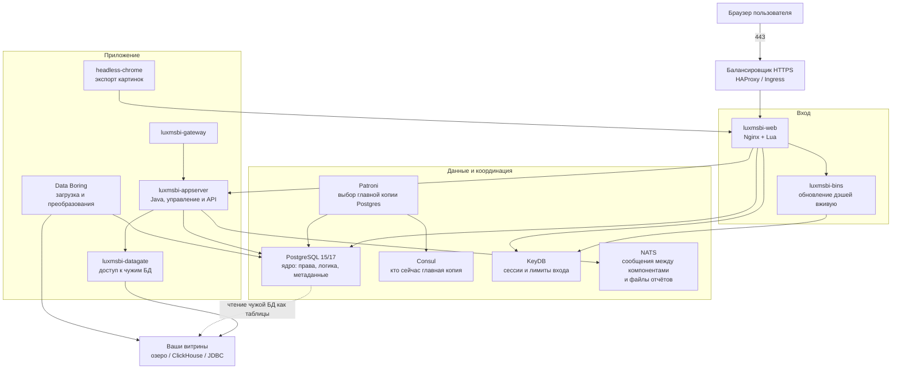

# Luxms BI 12.x — развёртывание и настройка

Luxms BI — коммерческая платформа для бизнес-аналитики (дэшборды, отчёты, самостоятельная сборка витрин). В реестре российского ПО она числится как «Визуальный управленческий контроль Luxms BI», номер **3366**. Скачать её как бесплатную Grafana нельзя: нужен договор, лицензия и доступ к репозиторию поставщика.

Версия, о которой этот документ: линейка **12**. На дату подготовки:

- последний релиз с отдельной страницей изменений на сайте поставщика — **12.0.2**: https://luxmsbi.ru/products/relizy/
- портал документации помечен как **12.1.0**: https://luxmsbi.ru/docs/
- переход с версии 11 на 12 — не обычное обновление пакетов, есть отдельная инструкция поставщика

Точный номер сборки (12.0.2 или 12.1.0) фиксируют договором и доступом к **вашему** репозиторию пакетов. Публичного образа на Docker Hub нет.

Если службе безопасности нужна **сертифицированная государством** сборка (для аттестованных информационных систем), это **другой комплект программ — версия 11.0.x**. У неё есть сертификат, у версии 12 — нет. Нельзя поставить 12 и считать, что сертификат версии 11 на неё распространяется.

Этот текст — не набор команд «скопируй и выполни», а правила, без которых система не будет одновременно устойчивой к сбоям, масштабируемой и безопасной. Пошаговая установка — в `Luxms BI.install.md`.

---

## Назначение системы

Luxms BI — слой **просмотра и анализа уже подготовленных данных**. Руководитель или аналитик открывает в браузере дэшборд и видит цифры по заявкам, клиентам, филиалам.

Система **читает** данные из ваших баз и витрин (или копирует их к себе для отчётов). Она **не** хранит эталон клиентских карточек, **не** заменяет очередь событий (Kafka), **не** исполняет бизнес-процессы (Camunda) и **не** ходит сама в государственные сервисы. Для операционного мониторинга серверов и Kubernetes используйте Grafana / Prometheus — это другой контур и другие зрители.

---

## Перечень функций

Что платформа умеет из коробки (по документации поставщика):

1. **Показывать дэшборды и отчёты** в браузере: графики, таблицы, фильтры, карты (WMS/WFS с версии 12.0.2).
2. **Подключать источники данных**: PostgreSQL, ClickHouse, MySQL, Oracle, MS SQL, Kafka, любые JDBC-базы, потоки вроде MQTT/Redis; то, что умеет NiFi — через витрины или CSV. Российские СУБД Arenadata — отдельный список на сайте поставщика.
3. **Читать чужую базу «как свою таблицу»** (механизм PostgreSQL Foreign Data Wrapper): запрос уходит в источник сразу, без обязательного копирования. Либо копировать данные внутрь витрины.
4. **Собирать витрины без кода** (модуль Data Boring): расписание, преобразования, загрузка. Это внутренний ETL платформы, не ваш интеграционный контур к ведомствам.
5. **Self-service**: пользователь с правом Creator сам подключает источник, собирает набор данных и дэшборд. Зритель (Viewer) только смотрит.
6. **Разграничивать доступ**: роли лицензии (Viewer / Creator / Admin), права внутри проекта («атлас»), ограничение строк — филиал видит только свои объекты.
7. **Единый вход**: Keycloak, LDAP/Active Directory, ЕСИА, токены API.
8. **Обновлять дэшборд у коллеги без перезагрузки страницы** (сервис BINS по WebSocket).
9. **Экспортировать картинки и выгрузки** (в том числе PNG через отдельный процесс браузера без окна).
10. **Писать журнал действий** (кто открыл дэш, какие фильтры, загрузка файлов) и отдавать его в SIEM. Есть отдельный экран для сотрудника безопасности (сессии, аудит, инциденты).
11. **ИИ-помощник аналитика** (с 12.0.0) — отдельная опция лицензии. Куда уходят тексты запросов к модели, в публичных заметках не расписано; в контуре с персональными данными это отдельное решение, не «галочка в настройках».

Чего система **не** делает и часто путают: она не озеро эталонных данных, не шина микросервисов, не BPMN, не замена Grafana и не готовый Helm-оператор «как у Grafana». Штатный путь установки — пакеты Linux и (для боя) сценарии Ansible поставщика после согласования схемы.

---

## Требования к развёртыванию

### Требования к ПО

| Что | Что ставить | Комментарий |
|---|---|---|
| **Формат поставки** | Виртуальные машины (или железные серверы) с пакетами Linux | Это основной путь. Публичного Docker-образа `luxmsbi:latest` нет. Контейнеры — только если поставщик явно дал их в договоре и поддерживает. |
| **Kubernetes** | Не штатный инсталлятор | В открытой документации версии 12 оператора/Helm-чарта нет. Самодельный чарт = вы сами чините отказ базы. Честный вариант: Luxms на отдельных VM, в Kubernetes — только вход (балансировщик). |
| **ОС** | Linux из списка поставщика | **Astra Linux SE 1.7 / 1.8**, **РЕД ОС 7.3 / 8.0**, **Альт СП 10**, **Rocky Linux 9**, **MosOS Arbat 15.5**. Не «любой Ubuntu с Docker». **Windows как сервер Luxms не заявлена.** |
| **База ядра** | PostgreSQL **15 или 17** (или Postgres Pro 15/17, Tantor 15, Jatoba 5) | Пакеты для PostgreSQL 13 поставщик **перестал выпускать с 01.12.2025**. Ставить «привычную» 13 нельзя. Расширения базы (`plv8`, `pgsql-http`, работа с KeyDB) — **только из пакетов поставщика**, не с GitHub. |
| **Рядом в составе** | Nginx, LuaJIT 2.1, Node.js 18 или 20, OpenJDK 17, KeyDB 6.x, NATS 2.11.6, Consul 1.16.1, Patroni 3.2.x | Это не «поставьте что угодно свежее». Версии из текущей технической информации поставщика. ClickHouse 25.3 — только если большие объёмы выносите туда, это не ядро Luxms. |
| **Браузеры** | Chrome 90+, Firefox 85+, Safari 14+, Edge 89+, Яндекс 21+ | Internet Explorer для нового контура не рассматриваем. |
| **Часы** | NTP на **всех** машинах | Без синхронизации времени кластер базы и сессии ведут себя непредсказуемо. |
| **Лицензия** | Лицензия + базовая техподдержка | Поддержка у поставщика — обязательное условие покупки (ориентир: **30% в год** от стоимости). Без неё нет обновлений ядра. Для теста бывает отдельная лицензия DEVL. |

Готовая учебная виртуальная машина (Appliance) у поставщика есть — для знакомства, не для боя.

### Требования к ресурсам

Цифры ниже — **на весь сервер Luxms**, не «на один контейнер». Это ориентир поставщика, не смета вашей нагрузки.

| Сценарий | CPU | RAM | Диск |
|---|---|---|---|
| **Минимум** (официально) | **8 ядер**, частота от 2 ГГц | **24 ГиБ** | **500 ГиБ** полезного места, чтение **от 150 МБ/с** |
| **Ориентир на 100 человек одновременно** | **16 ядер** | **32 ГиБ** | **1 ТиБ**, тот же порог скорости диска |
| **Один узел «чтобы не стыдно»** (гайд администратора 9.2) | от **8 vCPU** | **32 ГиБ** | как минимум |

Дополнительно:

- Каталог данных PostgreSQL — **локальный диск**, не сетевая папка NFS. Для пустого ядра в гайде фигурируют **10 ГиБ** — это метаданные и настройки, не терабайты фактов.
- Хранилище внутренней шины NATS (готовые отчёты, конфиги): старт **10 ГиБ** на `/opt/nats`, для больших выгрузок может не хватить.
- Терабайты цифр для дэшбордов кладут в ClickHouse / Greenplum / озеро, **не** в единственный PostgreSQL ядра.
- На одном хосте поставщик пишет «обычно до **100 активных** пользователей». Дальше — несколько веб-узлов и кластер базы.
- В описании лицензии Enterprise Cluster UL — потолок **1000 одновременных сессий**. Это потолок лицензии, не обещание железа.
- На тестовой песочнице без нагрузки 24 ГиБ можно не требовать. Этот «облегчённый» стенд **нельзя** переносить в бой как «официальный минимум».

---

## Основные элементы системы и зависимости

Платформа — это **несколько отдельных программ**, а не один процесс. Ниже — те из них, которые ставятся как отдельные инстансы (свои процесс, часто своя машина), и как они вызывают друг друга.

### Схема инстансов и потоков

Как читать схему:

1. Человек заходит по HTTPS на балансировщик, тот отдаёт запрос на **luxmsbi-web** (это **не** системный nginx операционной системы, а отдельный сервис поставщика).
2. Веб-слой раздаёт интерфейс и проксирует запросы в **appserver**, **bins** и **PostgreSQL**. Основная бизнес-логика считается **внутри PostgreSQL** (процедуры на PL/pgSQL), а не в толстом Java-приложении.
3. К внешним базам ходит **datagate**, чтобы тяжёлые запросы JDBC не убивали тот же процесс, что рисует экран.
4. **KeyDB** (родственник Redis, порт 6379) хранит сессии и нужен для живого обновления дэшей.
5. **NATS** — внутренняя очередь и файлы между компонентами Luxms. Это **не** замена вашей Apache Kafka.
6. **Patroni + Consul** делают из PostgreSQL отказоустойчивую пару «главная копия + запасные»: Consul помнит, кто сейчас главный; Patroni переключает, если главный умер.
7. **Data Boring** и **headless-chrome** — отдельные процессы. Их не ставят на те же ядра, что веб-вход, если нагрузка серьёзная.

Рядом, но это уже другое ПО: **Keycloak** (единый вход), **HAProxy**, объектное хранилище под отчёты, ClickHouse как склад больших витрин. Ваша Kafka — только как *источник* для витрин, не транспорт ядра Luxms.

### Что входит в поставку

| Роль | Зачем | Как масштабируется |
|---|---|---|
| **PostgreSQL / Postgres Pro** | Метаданные, права, логика, часто и небольшие витрины | Отказоустойчивость = Patroni + Consul, не «два docker postgres». Большие объёмы выносят в ClickHouse/Greenplum |
| **Расширения Postgres** | Обязательны: `pgsql-http`, pub/sub к KeyDB, **plv8**, чтение KeyDB как таблицы | Только из пакетов поставщика |
| **luxmsbi-web** | HTTPS-вход, раздача интерфейса, прокси | Несколько веб-узлов за балансировщиком |
| **luxmsbi-appserver** (или сборка «всё в одном» — mono) | API управления, часть работы с источниками | Несколько инстансов; при нагрузке источники выносят в datagate. Mono удобна для теста |
| **luxmsbi-datagate** | Хождение в чужие БД | Выделенные узлы |
| **luxmsbi-bins** | Живое обновление дэшей | Зависит от KeyDB и базы |
| **luxmsbi-gateway** | Шлюз в составе поставки | Не путать с вашим интеграционным API к ведомствам |
| **Data Boring** | Загрузка данных внутри BI | Отдельный процесс; расписание бьёт по диску и CPU |
| **NATS** | Сообщения и файлы между компонентами | Кластер из нескольких серверов, диск `/opt/nats` |
| **KeyDB** | Сессии, защита от подбора пароля, живые дэши | Репликация, не один контейнер «рядом» |
| **headless-chrome** | Картинки дэшей для экспорта | Тяжёлый процесс; в интернет не открывать |
| **Consul + Patroni** | Отказоустойчивость ядра базы | Нечётное число Consul (обычно 3); одна **главная** копия Postgres |

### Порты (контракт сети)

В документации версии 12 явно разобраны порты **NATS**. Остальные порты Java и веба ниже взяты из руководства администратора линейки **9.2**. Перед боем **сверить** с руководством **той сборки 12**, что в договоре: имена пакетов и порты могли измениться.

| Порт | Назначение | Кому открывать |
|---|---|---|
| **443/TCP** | HTTPS для людей | Только внутренняя сеть / прокси единого входа. Шифрование поставщик для нагрузки рекомендует **на балансировщике**, не на каждом веб-узле |
| **80/TCP** | HTTP, если ещё не унесли на балансировщик | Не в интернет |
| **5432/TCP** | PostgreSQL | Веб, appserver, datagate, Patroni, пул балансировщика. Не мир |
| **6379/TCP** | KeyDB | Веб, bins, расширения базы. Не мир |
| **4222/TCP** | NATS, клиенты компонентов | Appserver и другие части BI |
| **6222/TCP** | NATS, разговор узлов кластера между собой | Только узлы NATS |
| **8222/TCP** | NATS, страница мониторинга | Операторы, не мир |
| **8888/TCP** | В примере NATS версии 12 — WebSocket. В гайде 9.2 тот же номер — HTTP API bins | На одном хосте может быть конфликт — проверить на вашей сборке. Не мир |
| **8080/TCP** | appserver | С веба / балансировщика |
| **8200/TCP** | datagate | С веба / внутренней сети |
| **8192/TCP** | старый импортёр | Если он ещё установлен. Для **новых** внедрений поставщик его не рекомендует |
| **8889/TCP** | gateway | С веба |
| **8282/TCP** | внутренний API Lua | Только localhost / веб |
| **7200 / 7192/TCP** | служебный протокол appserver / импортёра | Внутри контура |
| **1880/TCP** | Data Boring | Админы загрузки данных, не мир |
| **8300 / 8301 / 8500 / 8600** | Consul | Только Consul и Patroni |

Пример конфига NATS в документации 12 содержит отключённое шифрование и заготовки паролей `"x"` / `"y"`. Это **учебный каркас**, не боевые настройки.

### Зависимости окружения (что ещё должно быть)

- Источники *для витрин* (не ядро): список СУБД на https://luxmsbi.ru/docs/overviews/compatibility/dbms
- Пароли базы, KeyDB, NATS, JDBC и секрет Keycloak — в Vault (или аналог), не в git и не `bi` / `bi` из старых примеров
- Журналы Luxms можно отдавать в Wazuh / SIEM — это не замена Falco
- Grafana смотрит здоровье Nginx, Postgres, NATS — не бизнес-дэшборды

---

## Краткие вводные

### Как устроена отказоустойчивость

Это **не** один общий механизм на весь продукт. Несколько слоёв, у каждого свой отказ.

**1) Вход (несколько веб-узлов + балансировщик)**

| Что падает | Что происходит |
|---|---|
| Один веб-узел, когда их два или больше | Балансировщик перестаёт слать на него трафик. Экран жив |
| Все веб-узлы | Нет интерфейса. Данные в PostgreSQL и ClickHouse **на месте** |
| HTTPS только на одном веб-узле без балансировщика | Обновление nginx = простой всех людей |

**2) Ядро PostgreSQL (Patroni)**

| Что падает | Что происходит |
|---|---|
| Запасная копия | Чтение можно пережить; запись идёт на главную |
| Главная копия, Consul ещё жив (большинство узлов) | Patroni выбирает новую главную. Короткий простой записи. Клиенты должны ходить **через** виртуальный IP / HAProxy, не на зашитый адрес старой главной |
| Потеря большинства Consul (например 2 из 3 серверов в мёртвом дата-центре) | Patroni **не знает**, кого считать главным → запись BI встаёт |
| Диск главной, нет живой копии и бэкапа | Потеря метаданных, прав, локальных витрин |

Поставщик рекомендует кластер Postgres через Patroni + Consul; HAProxy — чтобы приложения не держали по соединению на каждый запрос и отличали главную копию от запасных.

**3) KeyDB и NATS**

Без KeyDB ломаются сессии, защита от подбора пароля и живые дэши. Без NATS — обмен между Java-компонентами и выкладка отчётов. Оба нужны **кластером**, не «один контейнер рядом».

**4) Источник витрин**

Упало озеро или ClickHouse — экраны открываются, цифры пустые. Это не «упал Luxms», это упал **источник**. Для круглосуточной картинки бизнеса считают по самому слабому звену: веб, Postgres, NATS, KeyDB, витрина, сеть, единый вход.

### Как устроено масштабирование

Три разные оси (их путают):

1. **Больше людей смотрят дэши** → больше CPU и RAM веба и базы, пул соединений на балансировщике, лимит сессий лицензии. Цифра «16 ядер = 100 человек» — **ориентир поставщика**, не ваш замер.
2. **Тяжёлые запросы и «живой» JDBC в чужую базу** → нагрузка на **источник** и на datagate, не на «ещё один nginx».
3. **Терабайты** → витрины на ClickHouse/Greenplum (или ваше озеро), **не** раздувание единственного PostgreSQL. Ядро Luxms остаётся Postgres; большая аналитическая база подключается «чтобы скорость на объёме».

Горизонтально растут: веб, appserver, datagate, узлы большой аналитической базы. Вертикально — диск и RAM Postgres/ClickHouse. Добавить третий дата-центр **без** большинства Consul и без схемы «кто главная копия» отказоустойчивости не добавляет.

### Безопасность самой Luxms

Компрометация учётки **Admin** = права на пользователей, источники, выгрузки. Сотрудник с правом Creator и JDBC в озеро клиентов читает эталон так же, как интеграционный сервис, только из браузера.

Заявленное поставщиком: роли, ограничение строк, экран для ИБ, журнал, Keycloak, парольные политики, выгрузка в SIEM, ЕСИА, токены API. Качество настройки — ваше.

Опасные значения «из коробки / из примера»:

| Что | Как в примере | Почему опасно |
|---|---|---|
| Учётка базы в примере Lua | пользователь `bi`, пароль `bi` (гайд 9.2) | Первый же сканер на порту 5432 |
| Защита от подбора пароля | `max_login_attempts = 0` — **выключена** (9.2) | Можно подбирать пароль |
| Лимит API | `rpmlimit = 0` — **выключен** (9.2) | Можно выкачивать API |
| Пример NATS версии 12 | шифрование выкл, вход без нормального пароля | Пока не включите сами |
| KeyDB на разных хостах (гайд 9.2) | отключить защитный режим, слушать не только localhost | Открытый Redis-протокол без списка доступа |
| Шифрование до Postgres | поставщик **рекомендует не шифровать** во внутренней сети «для скорости» | Для контура с персональными данными это решение ИБ, не «поставщик разрешил открытый текст» |
| HTTPS на самих веб-узлах | для высокой нагрузки шифрование лучше на отдельном балансировщике | Нормально, **если** люди не ходят на веб-узел по HTTP в обход балансировщика |

---

## Допущения

Ниже то, чего не было в исходном запросе, но без чего нельзя нарисовать конкретную схему. Если допущение неверно — схему надо пересмотреть.

1. Речь о **Luxms BI** (ГК Luxms, реестр 3366), не о другом продукте с похожим именем.
2. Для **нового** контура, если никто не потребовал сертифицированную государством сборку, ставим **версию 12** и фиксируем номер пакета из репозитория поставщика. Если сертификат обязателен — ставим **отдельный комплект 11.0.x**.
3. Ставим **у себя**, не облако поставщика.
4. Поставка **пакетами** в закрытый репозиторий (dnf / apt / zypper). Боевые сценарии Ansible — после схемы, согласованной с поставщиком.
5. Боевое ядро базы — PostgreSQL 15 или 17 (или Postgres Pro тех же мажоров) + Patroni 3.2.x + Consul 1.16.1. Не случайный `postgres:latest` в том же namespace, что микросервисы.
6. Терабайты фактов **не** живут только в Postgres ядра. Для объёма — витрины озера и/или ClickHouse.
7. Luxms **не ходит** в государственные сервисы. Только чтение из озера / витрин, которые наполнил интеграционный контур.
8. Единый вход будет (Keycloak / Active Directory). Локальный Admin — запасная учётка в сейфе, не ежедневный вход.
9. Три дата-центра = три независимых отказа (питание, сеть). Три зала с общим ИБП — это не три площадки.
10. Размазывать Patroni, Consul и NATS синхронно на три площадки **вслепую нельзя**: в документации нет порога задержки сети. Пока задержку не измерили — кворум Consul и главную копию Postgres не растягивать на три стороны.
11. Цель отказа боя: пережить **один** дата-центр для экрана и записи, только если в живых площадках осталось большинство Consul **и** новая главная Postgres **и** веб. Пережить смерть двух площадок из трёх, если Consul жил только там — нельзя.
12. Цифр вашей нагрузки нет — поэтому нет фразы «купите 12 серверов». Есть минимум отказоустойчивости (два веб-узла, Patroni, кластер NATS и KeyDB) и потолок сессий лицензии.
13. Kubernetes не является штатным установщиком в открытой документации. Для теста допустима одна VM. Для боя рядом с Kubernetes — выделенные машины **или** контейнеры, если поставщик их даст и поддержит.
14. ИИ-модуль в первом боевом контуре **выключен**, пока нет ответа «где считается модель» и отдельной лицензии.
15. Старый импортёр из гайда 9.2 для новых установок **не берём** — Data Boring и datagate.
16. Формального обещания «дэшборд за 2 секунды» нет. Скорость — свой замер на ваших данных.

---

## Критически важные условия, которых нет в исходном контексте

Их нужно закрыть **до** «дали доступ к репозиторию и открыли порт 443».

| Пробел | Почему это ломает решение |
|---|---|
| **Версия 12 или сертифицированная 11.0.x** | Для аттестованных систем несертифицированная линейка может быть запрещена. Это две ветки обновлений, не одна |
| **Какая лицензия и сколько машин** | В прайсе кластерная лицензия сформулирована как **2** промышленных сервера. Три площадки и отдельный ClickHouse — согласовать отдельно (узлы, именованные пользователи, потолок 1000 сессий) |
| **Задержка и какие порты открыты между дата-центрами** | Consul, Patroni, NATS 6222, копирование Postgres. Городской файрвол режет — «кластер» не соберётся |
| **Один Kubernetes на три площадки или три кластера** | От этого зависит: одна база ядра или три разных набора дэшбордов и прав (обычно плохо) |
| **Где главная Postgres и большинство Consul** | Веб в трёх зонах при «мозге» базы в одной — переживают зону экрана, не зону базы |
| **Живой запрос в озеро или копия в витрину** | Без решения будет либо удар по эталону, либо устаревшие цифры |
| **Персональные данные в кубах** | Self-service и выгрузка в Excel. Зритель с широким набором данных = читатель клиентов. Ограничение строк и запрет выгрузок — политика, не заводская настройка |
| **ИИ-помощник** | Риск унести персональные данные в модель |
| **Профиль нагрузки** | 20 руководителей ≠ 800 человек, которые сами собирают дэши. «100 пользователей» в техинформации — репер, не ваша смета |
| **Кто владеет репозиторием пакетов и сценариями установки** | Без поставщика нет дистрибутива. Зеркало в закрытом контуре — отдельная работа |
| **Шифрование канала по требованиям ИБ** | Сертификат версии 11 не заменяет отдельное средство криптозащиты на канале, если ИБ его требует |
| **Граница с Grafana** | Два «BI» без правила «эксплуатация vs бизнес» = персональные данные в мониторинге или метрики на бизнес-дэшах |

---

## Краткое описание ключевых этапов и элементов развертывания

Общий каркас (и тест, и бой):

1. Закрыть лицензию, **ветку** (12 или сертифицированная 11.0.x), доступ к репозиторию, перечень пакетов из **вашего** руководства администратора.
2. Сначала **ОС из списка поставщика** + NTP + разделы диска, потом **Postgres + обязательные расширения**, потом NATS и KeyDB, потом appserver, потом веб, потом единый вход.
3. Выпустить **свои** пароли базы, KeyDB и NATS **до** первого пользовательского входа. Примеры `bi` / `bi` не копировать.
4. Один проект («атлас») + один запрос к **вашей** витрине (не учебный CSV). Проверка: дэшборд не пустой.
5. Бэкап ядра Postgres (метаданные, права, локальные наборы данных). Запасная копия Patroni **не** заменяет backup: ошибочный `DROP` копия послушно повторит.
6. Только потом — второй веб-узел, Patroni, единый вход, экран ИБ, выгрузки.

Боевая схема на несколько дата-центров, порядок включения и проверки — в `Luxms BI.install.md`. Ниже — только тестовый стенд.

---

### 1 инстанс: тестовый стенд, 1 площадка, без нагрузки

**Цель стенда:** увидеть свой дэшборд по витрине из озера (или учебный атлас), понять роли Viewer и Creator, не утонуть в Patroni. **Не** цель: доказать падение дата-центра и 1000 сессий.

Официальные минимальные пути (выберите один):

**Путь A — пакеты на одну виртуальную машину** (ближе к бою):

- ОС из списка (для теста часто Rocky 9 / РЕД ОС / Astra).
- Минимум железа из таблицы выше можно не требовать, если это песочница.
- Пакеты: Postgres 15/17 + расширения поставщика, KeyDB, NATS (блок кластера в конфиге **не** включать), appserver-mono, luxmsbi-web, bins, при необходимости Data Boring.
- Учебный атлас: пакет вида `bi-pg-ds-demo174` / `bi-pg-demo174` — только если репозиторий его отдаёт.
- Вход с jump-хоста, не балансировщик в интернет.

**Путь B — готовая учебная VM поставщика:** состав и гипервизор — в **текущем** гайде поставки, не в старом PDF 7.0 (там ещё CentOS 7).

Режим «три копии веба + один Postgres без Patroni» для знакомства **не нужен**: получите три экрана с одной точкой отказа.

#### Что сознательно упрощаем

| Параметр | На тесте | Почему можно |
|---|---|---|
| Patroni / Consul | выкл | Нет цели пережить падение VM |
| Кластер NATS | один узел, файлы на локальный диск | Нет нескольких площадок |
| Реплика KeyDB | один узел | Нет цели отказоустойчивости |
| ClickHouse | выкл, если витрина маленькая | Не цель терабайты |
| Сертификаты HTTPS | самоподписанные / SSH-туннель | Иначе команда утонет в PKI раньше, чем в дэшах |
| Единый вход | локальные учётки, пароль не `bi` / `bi` | На тесте важнее контур данных |
| ИИ | выкл | Лицензия и ИБ |
| Сертифицированная сборка 11 | не обязательна | Если тест не аттестационный стенд |

#### Чего на тесте **не** стоит упрощать

- ОС и **мажор Postgres из списка для версии 12**, не «тринадцатая, потому что привыкли».
- Обязательные расширения. Без них ядро «как в документации» не встанет.
- Хотя бы один набор данных с **вашими** полями (или честно учебный, но тогда в голове пометка «это не озеро»).
- Веб и порт 5432 **не** с интернета.
- Понимание: всё состояние на одном диске VM. Снесли машину — снесли дэшборды.

#### Сильные стороны такой схемы

- Совпадает с официальным «один сервер / тестовая лицензия».
- Дешево показывает, есть ли у вас **вообще** витрина, которую BI может показать (часто нет: сырой JSON из Kafka, нет ключей, нет согласованных справочников).

#### Слабые стороны (обязательно понимать)

- Нет модели отказа, нет пула HAProxy, нет единого входа.
- Успешный дэш на одной VM **не** доказывает, что живой запрос в озеро не убьёт эталон в бою.
- Привычка открытого Postgres и пароля `bi` / `bi` уедет в бой, если не запретить явно.

Практическая рекомендация: препрод = маленький **боевой профиль** (Patroni на 2–3 VM в **одном** дата-центре, два веб-узла, HAProxy, свои секреты, заглушка Keycloak, NATS с шифрованием и учётками), даже без боевых пользователей.

---

## Сводка: что считать «экземпляр готов»

| Требование | Тест (1 площадка) | Бой |
|---|---|---|
| Отказоустойчивость | Не требуется | Не меньше двух веб-узлов; Patroni с большинством Consul; кластер NATS и KeyDB; балансировщик на 443; бэкап ядра с учебной восстановкой; витрины — отдельный проект отказоустойчивости. Схема на 2–3 дата-центра — в `Luxms BI.install.md` |
| Производительность / масштаб | Не требуется | Не класть терабайты в единственный Postgres ядра; большая аналитическая база / озеро; пул соединений; не превышать лицензионные сессии; замер на **ваших** дэшах, не «16 ядер = 100 людей» как смета |
| Безопасность | Свои пароли; порты не с интернета | Единый вход; нет примеров `bi` / `bi` и учебного NATS; защита от подбора пароля; шифрование на балансировщике и (по решению ИБ) до Postgres; datagate не в ведомства; ограничение строк на персональные данные; сертифицированная сборка 11, если регулятор требует; ИИ выкл или согласован; журналы в SIEM |

**Не готов к бою**, если: одна машина «как тест»; три веб-узла без Patroni; пароль `bi` / `bi`; версия 12 там, где обязали сертифицированную 11; BI ходит в государственные API; эталон клиентов живёт только в датасете Luxms; Consul растянули на три площадки, не измерив сеть; восстановление ядра из бэкапа не делали; лицензия «2 сервера», а узлов пять; ждут, что Luxms заменит Kafka, Camunda или Grafana.

---

## Источники (чтобы не принимать на веру)

- Документация (портал, на дату файла помечен 12.1.0): https://luxmsbi.ru/docs/ · https://luxmsbi.ru/products/documentation/
- Техническая информация (лицензии, железо, стороннее ПО, реестр 3366): https://luxmsbi.ru/docs/overviews/general-overview/tech-info
- PostgreSQL 15/17, расширения, конец пакетов версии 13 с 01.12.2025: https://luxmsbi.ru/docs/overviews/compatibility/postgresql
- СУБД-источники: https://luxmsbi.ru/docs/overviews/compatibility/dbms
- NATS (порты 4222/6222/8222, учебный пример без шифрования, диск `/opt/nats`): https://luxmsbi.ru/docs/guides/sysadm-guide/appendix/nats/
- Релизы: https://luxmsbi.ru/products/relizy/ · 12.0.0 и переход с 11: https://luxmsbi.ru/products/relizy/luxms-bi-12-0-0-release-notes/
- Продукт, Keycloak, кластер: https://luxmsbi.ru/products/luxms-bi/
- Архитектура (логика в Postgres, источники включая Kafka): https://luxmsbi.ru/products/fichi-luxms-bi/platformennost/
- Безопасность и сертифицированная сборка **11.0.x**: https://luxmsbi.ru/about/luxms-bi-bezopasnaya-rossiyskaya-bi-platforma/ · https://luxmsbi.ru/products/fstek/
- Учебный атлас, пакетная установка: https://luxmsbi.ru/news/analitika/obnovlenie-demonstratsionnogo-atlasa/
- Руководство администратора **9.2** (слои, порты Java/web, Patroni+Consul, HAProxy, примеры Lua/KeyDB, «до 100 активных», старый импортёр): https://community.luxmsbi.com/-/u/5/v/36/il3td7gacx5a53ws4x545btoztbijz.pdf — **не** замена руководства версии 12 вашей поставки
- Обзор архитектуры **7.0** (исторический): https://dashboard.niioz.ru/docs/Luxms-BI-general-overview-v7.0.pdf — не фиксация версии 12

Утверждения вида «Luxms переживёт два дата-центра» или «N ядер на терабайт Kafka» в документации Luxms **отсутствуют** — поэтому в этом файле их нет. Задержка сети, большинство Consul и то, где лежит главная Postgres, решают, жив ли BI при отказе площадки — это надо измерить и нарисовать у себя.
