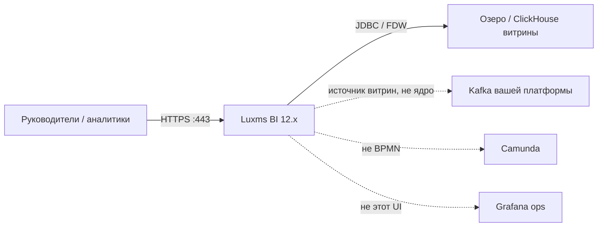
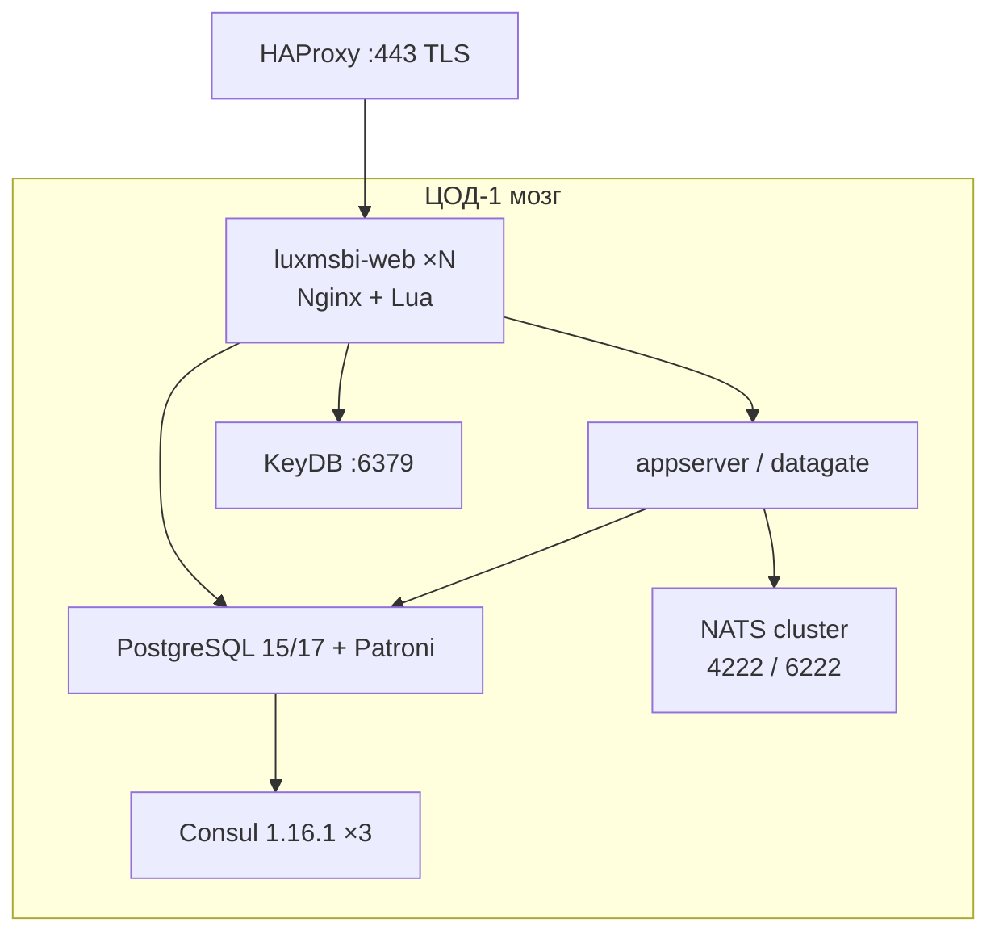
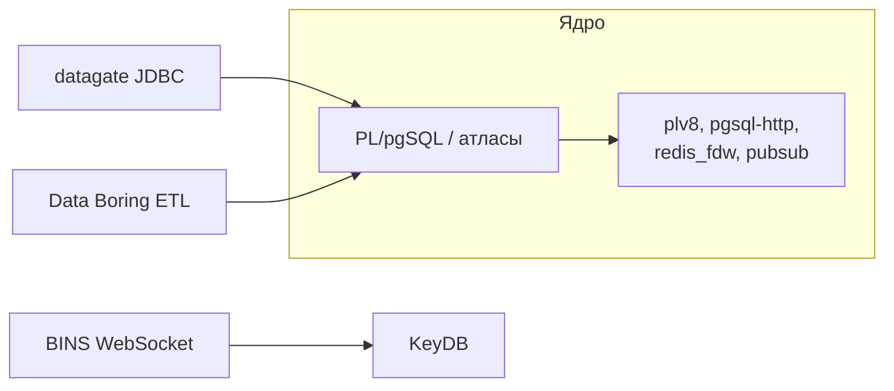
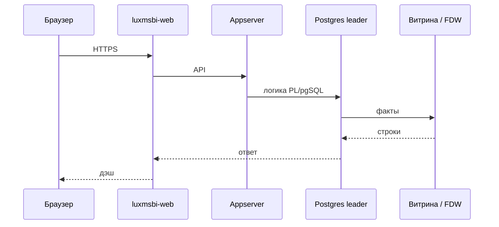
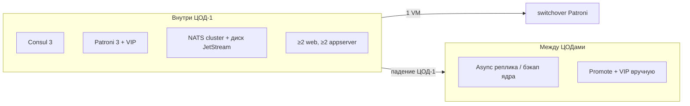
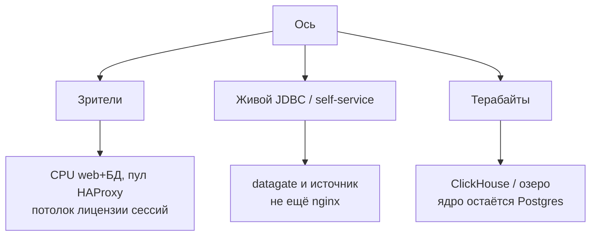
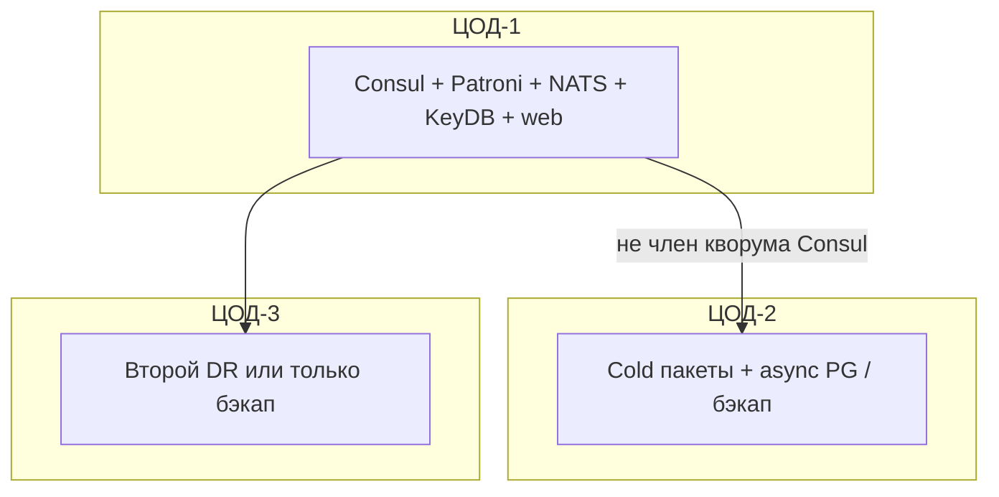

# Luxms BI 12.x — схемы устройства

Связанные документы: правила — `Luxms BI.md`; установка — `Luxms BI.install.md`.

C4 / «D4»: контекст → контейнеры → компоненты. Код PL/pgSQL атласов не рисуем.

Допущения: stretch Consul/Patroni/NATS на 2–3 ЦОДа **нет**; коммерческие **пакеты** вендора (реестр 3366), не выдуманный docker-compose прод; публичного Helm 12.x **нет**; не замена Kafka/Camunda/Grafana; нагрузка не замерена.

---

## 1. Контекст

Luxms — **бизнес-дэшборды** (ВУК). Двухзвенность: логика в PostgreSQL, короткий путь через Nginx. Не озеро-эталон и не шина микросервисов.

Data Boring/JDBC в СМЭВ — обход интеграционного API. NATS внутри Luxms **не** замена Apache Kafka.

ФСТЭК № 5055 — сборка **11.0.x**, не «12.x с тем же сертификатом».

---

## 2. Контейнеры (мозг в одном ЦОДе)

Штатный путь — пакеты Linux на VM (матрица ОС вендора) + Ansible после согласования схемы. Самодельный Compose = вы сами support.

Порты NATS **12.x**: клиенты 4222, cluster 6222, monitor 8222. Java/web (8080, 8200, 8888, …) — сверять с **sysadm-guide вашей сборки**; гайд 9.2 не замена. Пример NATS `no_tls` / `no_auth_user` / пароли `"x"`/`"y"` — демо, не прод.

Клиенты Postgres **только** через VIP/HAProxy, не hostname лидера. В гайде 9.2 липкость к appserver **желательна** (`hash $upstream_cookie`).

**Сильное:** падение одного web — LB жив. **Слабое:** упал primary без кворума Consul — nginx зелёный, записи нет.

---

## 3. Компоненты платформы

Importer линейки 9.2 для **новых** внедрений не берём. Terabytes фактов — MPP/озеро, **не** единственный Postgres метаданных. Расширения — **из пакетов вендора**, не «с GitHub на глаз». Пакеты PG **13** вендор прекратил с 01.12.2025.

Лицензия UL: в описании потолок **1000** одновременных сессий. Enterprise Cluster в tech-info — формулировка **2** промышленных сервера; три площадки согласовать отдельно.

---

## 4. Поток: открыть дэш

Падение озера: UI жив, дэши пустые — **ожидаемо**, это не «упал Luxms».

---

## 5. Что настраивать: отказоустойчивость

| Ручка | Если забыть |
|---|---|
| Кворум Consul в **этом** ЦОДе | Stretch gossip = запись встаёт при split |
| Бэкап **ядра** (атласы, роли) | Реплика повторит `DROP`; витрины пересчитаешь, метаданные — нет |
| Пароли не `bi`/`bi` | Пример Lua гайда 9.2 |
| Антибрут | `max_login_attempts = 0` в 9.2 — **выкл** |

Реплика Patroni не заменяет backup ядра.

---

## 6. Что настраивать: масштабируемость

Tech-info: минимум **8 ядер / 24 ГиБ / 500 ГиБ** на сервер; ориентир **100** одновременных — **16/32/1 ТиБ**. Это репер вендора, не ваша смета. На одном хосте «обычно до 100 активных».

---

## 7. Прод: 2 или 3 ЦОДа без stretch

Web в чужом ЦОДе без согласованного KeyDB — «то залогинен, то нет». Три независимых атласа «для HA» — три правды прав.

**Сильное:** кворум DCS предсказуем. **Слабое:** падение ЦОДа мозга = нет BI для всех; нет публичного оператора K8s.

---

## 8. Безопасность (ручки на той же схеме)

SSO Keycloak/AD; Admin — break-glass. Datagate исходящие **только** на витрины, не в подсеть ведомств. RLS и запрет бесконтрольного Excel на ПДн. ИИ-модуль 12.x в первом проде выкл. Журналы в SIEM. TLS на LB; plaintext Postgres «для нагрузки» из гайда — слабая рекомендация для контура с ПДн. `protected-mode no` у KeyDB в прод не тащить.

Источники: `Luxms BI.md`. Порога RTT у Luxms **нет**.
