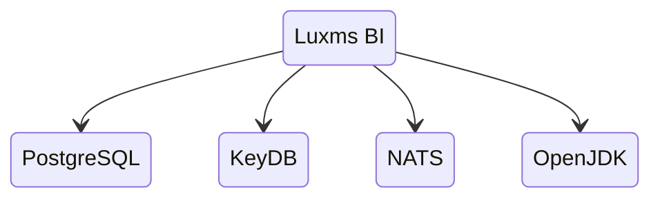
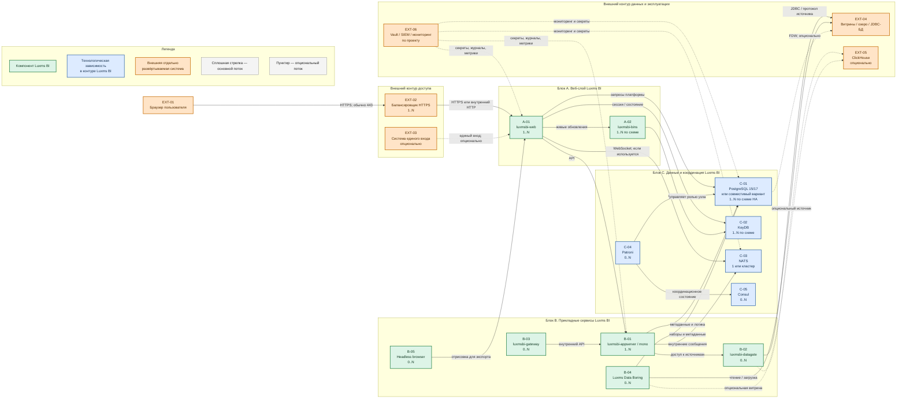

# Luxms BI 12.x — назначение и состав системы

Luxms BI — коммерческая платформа бизнес-аналитики. В Едином реестре российского ПО она зарегистрирована как «Визуальный управленческий контроль Luxms BI», номер **3366**. Для установки нужны договор, лицензия и доступ к репозиторию поставщика.

Документ относится к линейке **12**. Точный номер сборки определяют договор и доступный заказчику репозиторий. Портал документации на дату проверки помечен как 12.1.0, а публичная страница релизов содержит отдельные сведения о выпусках линейки 12:

- документация: https://luxmsbi.ru/docs/
- релизы: https://luxmsbi.ru/products/relizy/

Если требуется сертифицированная сборка для аттестованной информационной системы, нужно отдельно рассматривать комплект **11.0.x**. Сертификат этой ветки не распространяется на версию 12: https://luxmsbi.ru/products/fstek/

Пошаговая установка вынесена в `Luxms BI.install.md`.

---

## Назначение системы

Luxms BI — слой **просмотра и анализа уже подготовленных данных**. Руководитель или аналитик открывает в браузере дэшборд и видит показатели по заявкам, клиентам, филиалам и другим предметным областям.

Система читает данные из подключённых баз и витрин либо загружает их в собственные наборы данных для отчётности. Luxms BI не следует считать эталонным хранилищем клиентских карточек, заменой Kafka, исполнителем процессов Camunda или средством инфраструктурного мониторинга вместо Grafana и Prometheus. Интеграции с государственными и ведомственными системами должны выполняться через интеграционный контур платформы, а не напрямую из BI, если отдельное архитектурное решение не установило иное.

---

## Перечень функций

По открытой документации поставщика платформа поддерживает:

1. **Дэшборды и отчёты в браузере**: графики, таблицы, фильтры, карты и другие визуализации.
2. **Подключение источников данных**: PostgreSQL, ClickHouse, MySQL, Oracle, MS SQL, Kafka, JDBC-совместимые базы и другие источники из перечня совместимости.
3. **Чтение внешней базы без обязательного копирования** через механизм Foreign Data Wrapper либо загрузку данных в наборы и витрины.
4. **Подготовку данных без кода или с небольшим объёмом кода** в Luxms Data Boring: извлечение, преобразование, загрузку и запуск задач по расписанию.
5. **Self-service-аналитику**: пользователи с ролью Creator или Admin могут подключать источники, размечать данные, создавать витрины, визуализации и отчёты; Viewer только просматривает разрешённые объекты.
6. **Разграничение доступа** по лицензионным ролям и правам на объекты BI-атласа.
7. **Интеграцию единого входа** с внешней системой управления учётными записями. Конкретный вариант, например Keycloak или LDAP/Active Directory, зависит от проекта.
8. **Синхронизацию состояния открытых дэшбордов** без ручного обновления страницы.
9. **Экспорт отчётов и изображений**, если соответствующие компоненты включены в поставку и конфигурацию.
10. **Аудит действий пользователей** и передачу журналов во внешнюю SIEM при настроенной интеграции.
11. **AI/ML-расширения** как заказываемую опцию. Их наличие, лицензирование и допустимость обработки данных нужно подтверждать для конкретной поставки.

Официальное описание состава, ролей и self-service: https://luxmsbi.ru/docs/overviews/general-overview/tech-info

---

## Основные элементы системы и зависимости

Luxms BI — не один исполняемый процесс. В решении есть сервисы самого продукта, сторонние программные зависимости и внешние системы заказчика. Число инстансов каждого элемента определяется лицензией, нагрузкой, требованиями к отказоустойчивости и поддерживаемой поставщиком схемой. Обозначение `1..N` на схеме означает возможность нескольких инстансов, но не утверждает, что несколько экземпляров обязательны во всех средах.

### Что входит в состав

| Элемент | Роль в решении | Статус и варианты |
|---|---|---|
| **luxmsbi-web** | Веб-интерфейс и проксирование запросов к внутренним компонентам | Компонент Luxms BI; один или несколько инстансов |
| **luxmsbi-appserver / mono** | API управления и серверные функции | Компонент Luxms BI; `mono` может объединять функции для небольшой или тестовой среды, точный состав зависит от сборки |
| **luxmsbi-datagate / Data Gateway Framework** | Единый интерфейс доступа к внешним данным, включая JDBC-источники | Компонент Luxms BI; отдельный инстанс применяется по схеме поставки и нагрузке |
| **luxmsbi-bins** | Синхронизация состояния и обновление открытых дэшбордов | Компонент Luxms BI; наличие и способ запуска сверяются с конкретной сборкой |
| **luxmsbi-gateway** | Шлюз из состава продукта | Компонент Luxms BI; не является интеграционным API платформы к ведомствам |
| **Luxms Data Boring** | ETL-процессы подготовки и загрузки данных | Компонент Luxms BI; используется, если внутренний ETL нужен проекту |
| **headless browser** | Формирование изображений и файлов при экспорте | Служебный процесс; нужен только для функций экспорта, которые его используют |
| **PostgreSQL / совместимая СУБД** | Ядро платформы: метаданные, права и хранимая логика | Обязательная технологическая зависимость ядра; поддерживаются PostgreSQL/Postgres Pro 15 и 17, Tantor 15, Jatoba 5 |
| **Расширения PostgreSQL** | HTTP-вызовы, JavaScript-процедуры и обмен с KeyDB/Redis-протоколом | Зависимости ядра: `pgsql-http`, `redis_pub_sub`, `plv8`, `redis_fdw`; устанавливаются из пакетов |
| **KeyDB** | Сессии и обмен изменениями состояния | Сторонняя зависимость в составе технологического стека; число инстансов зависит от целевой схемы |
| **NATS** | Внутренние сообщения и хранение оперативных объектов/файлов | Сторонняя зависимость; один инстанс допустим технически, для отказоустойчивой продуктовой среды вендор рекомендует нечётный кластер минимум из трёх узлов |
| **Patroni + Consul** | Управление переключением PostgreSQL и хранение координационного состояния | Сторонние компоненты; нужны только в выбранной схеме высокой доступности PostgreSQL |
| **ClickHouse** | Отдельная аналитическая база для больших объёмов | Не ядро Luxms BI; опциональная внешняя система/источник данных |

- Подтверждённые версии PostgreSQL и обязательные расширения: https://luxmsbi.ru/docs/overviews/compatibility/postgresql
- Состав продукта и версии стороннего ПО: https://luxmsbi.ru/docs/overviews/general-overview/tech-info
- Требования и рекомендации для NATS: https://luxmsbi.ru/docs/guides/sysadm-guide/appendix/nats/

### Порты (контракт сети)

Таблица разделяет подтверждённые в открытой документации порты и проектные/зависящие от сборки значения. Порт открывают только между указанными клиентом и сервером; слово «опционально» означает, что поток нужен лишь при использовании соответствующей функции.

| Порт / протокол | Сервер и назначение | Разрешённые клиенты | Основание и обязательность |
|---|---|---|---|
| **443/TCP** | Внешний HTTPS-вход через балансировщик или веб-узел | Браузеры пользователей, доверенный прокси единого входа | Проектный контракт; номер и место завершения TLS должны быть закреплены в проекте |
| **80/TCP** | Необязательный HTTP-вход или перенаправление на HTTPS | Только доверенная внутренняя сеть | Опционально; не публиковать в интернет без отдельного решения |
| **5432/TCP** | PostgreSQL | Компоненты Luxms BI, средства управления PostgreSQL | Стандартный порт PostgreSQL; фактический порт может быть изменён конфигурацией |
| **6379/TCP** | KeyDB по Redis-протоколу | Компоненты Luxms BI и расширения PostgreSQL, которым нужен KeyDB | Типовое значение; подтвердить по конфигурации поставки |
| **4222/TCP** | Клиентские подключения NATS | Java- и другие компоненты Luxms BI | Подтверждено текущей инструкцией NATS |
| **6222/TCP** | Обмен между узлами NATS | Только узлы одного кластера NATS | Подтверждено текущей инструкцией NATS; нужно только для кластера |
| **8222/TCP** | HTTP-интерфейс встроенного мониторинга NATS | Система мониторинга и администраторы | Подтверждено текущей инструкцией NATS; опционально включается в конфигурации |
| **8888/TCP** | WebSocket NATS в опубликованном примере | Веб-компоненты Luxms BI | Подтверждено примером текущей инструкции NATS; фактическая необходимость зависит от сборки |
| **8080, 8200, 8889, 8282, 7200, 7192, 1880/TCP** | Исторически использовались appserver, datagate, gateway, внутренним API, служебными протоколами и Data Boring | Только внутренние компоненты и администраторы по необходимости | Значения известны из руководства старой линейки 9.2; **не считать контрактом версии 12**, пока их не подтвердит руководство конкретной сборки |
| **8300, 8301, 8500, 8600/TCP/UDP** | Служебные интерфейсы Consul | Consul, Patroni и администраторы по выбранной схеме | Нужны только при применении Consul; направления и протоколы сверить с документацией Consul и проектной конфигурацией |

Официальная инструкция NATS с портами 4222, 6222, 8222 и 8888: https://luxmsbi.ru/docs/guides/sysadm-guide/appendix/nats/

### Схема инстансов и потоков

#### Как читать схему

1. Каждый прямоугольник — **логический компонент или отдельная внешняя система**, а не обязательно отдельная виртуальная машина. Код перед названием (`A-01`, `C-03`, `EXT-04`) позволяет однозначно ссылаться на блок.
2. Зелёные блоки — сервисы Luxms BI. Синие — технологические зависимости, которые разворачиваются отдельными процессами и могут иметь собственные узлы. Оранжевые — системы заказчика вне продукта Luxms BI.
3. Значение `1..N` показывает, что возможен один или несколько инстансов. `0..N` означает опциональный компонент: его наличие определяется функциями, лицензией и схемой конкретной поставки.
4. Сплошная стрелка показывает основной рабочий поток. Пунктирная стрелка показывает поток, который возникает только при включении функции или выбранном способе интеграции.
5. Основной пользовательский путь идёт слева направо: браузер `EXT-01` обращается к балансировщику `EXT-02`, затем к `luxmsbi-web` `A-01`. Балансировщик показан внешним, поскольку это отдельная система заказчика, а не часть продукта.
6. Веб-слой передаёт серверные запросы в `appserver` `B-01`, работает с ядром PostgreSQL `C-01` и, в зависимости от сборки, использует `bins`, KeyDB и NATS для состояния и обновлений.
7. Доступ к аналитическим данным отделён от пользовательского входа. `datagate` `B-02`, Data Boring `B-04` или механизм FDW в PostgreSQL обращаются к внешним витринам `EXT-04`; ClickHouse `EXT-05` показан отдельным опциональным источником.
8. Patroni `C-04` и Consul `C-05` относятся только к схеме высокой доступности PostgreSQL. Их присутствие на рисунке не означает обязательность для одиночного тестового инстанса.
9. Vault, SIEM и мониторинг объединены в `EXT-06` для читаемости, но на практике это разные внешние системы. Конкретные потоки секретов, журналов и метрик определяет проект.
10. Схема показывает логические связи, но не размещение по дата-центрам и не гарантирует отказоустойчивость. Количество узлов, сетевые задержки и правила переключения должны быть согласованы отдельно; открытая документация Luxms BI не задаёт допустимый порог задержки между площадками.
11. Типовой просмотр дэшборда идёт так: браузер `EXT-01` открывает HTTPS-адрес; запрос проходит балансировщик `EXT-02` и попадает в `luxmsbi-web` `A-01`. Веб-слой отдаёт интерфейс и вызывает `appserver` `B-01`. Состав дэшборда, права и настройки читаются из PostgreSQL `C-01`. Цифры для графиков приходят не из этого ядра, а из внешних витрин `EXT-04` через `datagate` `B-02` либо FDW, или из опционального ClickHouse `EXT-05`.
12. Пока страница открыта, `bins` `A-02`, KeyDB `C-02` и NATS `C-03` могут доставлять изменения состояния без полной перезагрузки. Если несколько веб-узлов не используют один и тот же KeyDB, сессия на одном узле не обязана существовать на другом: это ограничение схемы, а не свойство «кластера само собой».
13. Опциональные ветки не нужны для базового просмотра: единый вход `EXT-03`, Data Boring `B-04`, экспорт через headless browser `B-05`, Patroni/Consul `C-04`/`C-05` и эксплуатационный контур `EXT-06`. Их рисуют, чтобы показать место в решении, а не как обязательный минимум установки.
14. NATS на схеме — внутренняя шина Luxms BI, а не платформенная Kafka. ClickHouse — внешний аналитический склад, а не замена PostgreSQL-ядра. `luxmsbi-gateway` `B-03` — внутренний шлюз продукта, а не интеграционное API платформы к ведомствам.

Термины из пунктов выше собраны в разделе «Глоссарий».

#### Компоненты схемы

**EXT-01 — браузер пользователя**

- **Сущность:** клиентское приложение на рабочем месте.
- **Технологии и варианты:** поддерживаемый браузер; актуальный перечень версий приведён в технической информации поставщика.
- **Назначение:** отображает интерфейс, дэшборды и отчёты.
- **Принадлежность:** внешняя система, не часть Luxms BI.

**EXT-02 — балансировщик HTTPS**

- **Сущность:** сетевой прокси перед веб-узлами.
- **Технологии и варианты:** HAProxy, Ingress-контроллер либо утверждённый в платформе аналог.
- **Назначение:** единая точка входа, завершение TLS и распределение запросов между веб-инстансами.
- **Принадлежность:** отдельная система заказчика; не обязательна для одиночного закрытого стенда, но применяется в многосерверной схеме по проекту.

**EXT-03 — система единого входа**

- **Сущность:** внешний поставщик удостоверений.
- **Технологии и варианты:** Keycloak, LDAP/Active Directory или другой поддержанный конкретной поставкой вариант.
- **Назначение:** аутентифицирует пользователей и передаёт Luxms BI подтверждённую идентичность.
- **Принадлежность:** отдельная внешняя система; опциональность и протокол подтверждаются проектом.

**A-01 — luxmsbi-web**

- **Сущность:** веб-сервис продукта.
- **Технологии и варианты:** Nginx, LuaJIT, Node.js и клиентские библиотеки из технологического стека Luxms BI; точный пакет зависит от сборки.
- **Назначение:** раздаёт пользовательский интерфейс и направляет запросы к серверным компонентам.
- **Принадлежность:** часть Luxms BI.

**A-02 — luxmsbi-bins**

- **Сущность:** сервис синхронизации состояния.
- **Технологии и варианты:** отдельный процесс, взаимодействующий с веб-слоем и KeyDB; детали портов зависят от сборки.
- **Назначение:** обновляет состояние дэшбордов у подключённых пользователей без полной перезагрузки страницы.
- **Принадлежность:** часть Luxms BI; необходимость отдельного инстанса проверяется по составу поставки.

**B-01 — luxmsbi-appserver / mono**

- **Сущность:** серверный компонент API.
- **Технологии и варианты:** Java/OpenJDK 17; вариант `mono` может объединять серверные функции.
- **Назначение:** выполняет функции управления и координирует работу с данными и внутренними сервисами.
- **Принадлежность:** часть Luxms BI.

**B-02 — luxmsbi-datagate**

- **Сущность:** сервис доступа к данным.
- **Технологии и варианты:** Data Gateway Framework, JDBC и драйверы конкретных источников.
- **Назначение:** изолирует подключения и запросы к внешним базам от веб-процесса.
- **Принадлежность:** часть Luxms BI; отдельное развёртывание опционально и зависит от поставки и нагрузки.

**B-03 — luxmsbi-gateway**

- **Сущность:** внутренний шлюз продукта.
- **Технологии и варианты:** вариант реализации и порт фиксируются руководством конкретной сборки.
- **Назначение:** маршрутизирует предусмотренные поставкой внутренние вызовы.
- **Принадлежность:** часть Luxms BI; не заменяет интеграционный API платформы.

**B-04 — Luxms Data Boring**

- **Сущность:** ETL-инструмент класса No Code/Low Code.
- **Технологии и варианты:** отдельные процессы извлечения, преобразования и загрузки; источники и приёмники зависят от проекта.
- **Назначение:** создаёт и запускает внутренние для BI конвейеры подготовки данных.
- **Принадлежность:** лицензируемый компонент Luxms BI; используется опционально, если эти задачи не полностью выполняет внешний интеграционный контур.

**B-05 — headless browser**

- **Сущность:** браузерный процесс без графического окна.
- **Технологии и варианты:** Chromium/Chrome либо вариант, поставляемый и поддерживаемый для конкретной сборки.
- **Назначение:** отрисовывает дэшборд для экспорта изображения или файла.
- **Принадлежность:** служебный компонент решения; нужен только при использовании соответствующего экспорта.

**C-01 — PostgreSQL или совместимый вариант**

- **Сущность:** реляционная СУБД ядра.
- **Технологии и варианты:** PostgreSQL 15/17, Postgres Pro 15/17, Tantor 15 или Jatoba 5 по текущей таблице совместимости.
- **Назначение:** хранит метаданные, права и логику Luxms BI; может хранить небольшие наборы данных, но не обязан быть единственным хранилищем аналитических фактов.
- **Принадлежность:** сторонняя технологическая зависимость ядра Luxms BI.

**C-02 — KeyDB**

- **Сущность:** отдельный сервер данных в памяти, совместимый с Redis-протоколом.
- **Технологии и варианты:** KeyDB 6.x указан в текущем технологическом стеке.
- **Назначение:** хранит сессии и оперативное состояние, используемое веб-компонентами и расширениями базы.
- **Принадлежность:** сторонняя технологическая зависимость; схема репликации определяется проектом.

**C-03 — NATS**

- **Сущность:** сервер сообщений и оперативного хранения объектов.
- **Технологии и варианты:** NATS из пакета поставщика; одиночный инстанс либо кластер. Для отказоустойчивой продуктовой среды вендор рекомендует нечётное число узлов, минимум три.
- **Назначение:** передаёт внутренние сообщения и хранит используемые платформой оперативные данные и файлы.
- **Принадлежность:** сторонняя технологическая зависимость; не заменяет платформенную Kafka.

**C-04 — Patroni**

- **Сущность:** процесс управления высокой доступностью PostgreSQL.
- **Технологии и варианты:** Patroni 3.2.x указан в текущем технологическом стеке.
- **Назначение:** наблюдает за узлом PostgreSQL и участвует в выборе основной реплики при отказе.
- **Принадлежность:** сторонний компонент; опционален и нужен только в согласованной схеме высокой доступности.

**C-05 — Consul**

- **Сущность:** распределённое хранилище координационного состояния.
- **Технологии и варианты:** Consul 1.16.1 указан в текущем технологическом стеке.
- **Назначение:** предоставляет Patroni согласованную информацию для выбора роли узла PostgreSQL.
- **Принадлежность:** сторонний компонент; опционален вне схемы высокой доступности.

**EXT-04 — витрины, озеро и JDBC-базы**

- **Сущность:** внешние источники подготовленных данных.
- **Технологии и варианты:** поддерживаемые СУБД, файловые витрины и другие источники; перечень СУБД: https://luxmsbi.ru/docs/overviews/compatibility/dbms
- **Назначение:** предоставляют показатели и наборы данных для анализа.
- **Принадлежность:** отдельные системы заказчика, не часть Luxms BI.

**EXT-05 — ClickHouse**

- **Сущность:** колоночная аналитическая СУБД.
- **Технологии и варианты:** ClickHouse указан в технологическом стеке и перечне источников; конкретная версия и способ поставки сверяются с договором.
- **Назначение:** хранит и обрабатывает большие аналитические витрины.
- **Принадлежность:** отдельная опциональная система, не ядро Luxms BI.

**EXT-06 — Vault, SIEM и мониторинг**

- **Сущность:** группа внешних эксплуатационных систем.
- **Технологии и варианты:** корпоративное хранилище секретов, SIEM, Prometheus/Grafana либо утверждённые аналоги.
- **Назначение:** управляет секретами, принимает журналы и собирает технические метрики.
- **Принадлежность:** отдельные системы заказчика; конкретные интеграции опциональны и задаются требованиями эксплуатации и информационной безопасности.

---

## Глоссарий

- **0..N** — на схеме: компонент может отсутствовать или иметь несколько инстансов; ноль означает «не обязателен для каждой установки».
- **1..N** — на схеме: допустим один или несколько инстансов; несколько не являются обязательными во всех средах.
- **AI/ML** — технологии искусственного интеллекта и машинного обучения; в Luxms BI могут поставляться как отдельные расширения.
- **API** — программный интерфейс, через который один компонент вызывает функции другого.
- **appserver / luxmsbi-appserver** — серверный процесс Luxms BI, который принимает внутренние API-запросы от веб-слоя и координирует работу с данными.
- **BI** — бизнес-аналитика: подготовка, исследование и визуальное представление данных для принятия решений.
- **BI-атлас** — объект Luxms BI, объединяющий наборы данных, визуализации, дэшборды и права доступа в рамках аналитического приложения.
- **bins / luxmsbi-bins** — сервис Luxms BI, который синхронизирует состояние открытых дэшбордов у подключённых пользователей.
- **ClickHouse** — отдельно развёртываемая колоночная аналитическая СУБД; для Luxms BI это внешний источник или витрина, а не ядро продукта.
- **Consul** — распределённое хранилище служебного состояния, которое Patroni использует при выборе роли узла PostgreSQL; нужно только в схеме высокой доступности.
- **Creator / Viewer / Admin** — лицензионные роли Luxms BI: создание аналитических объектов, только просмотр и полный административный доступ соответственно.
- **Data Boring** — ETL-инструмент Luxms BI класса No Code/Low Code для извлечения, преобразования и загрузки данных по расписанию.
- **Data Gateway Framework / datagate / luxmsbi-datagate** — компонент, предоставляющий единый доступ Luxms BI к различным источникам данных.
- **Дата-центр** — отдельная площадка размещения серверов; схема не описывает растяжку одного живого кластера на несколько площадок.
- **Единый вход** — вход пользователя через внешнюю систему учёток (например Keycloak или LDAP/Active Directory), без отдельного пароля только внутри Luxms BI.
- **ETL** — последовательность извлечения, преобразования и загрузки данных.
- **FDW (Foreign Data Wrapper)** — механизм PostgreSQL, позволяющий представить таблицу внешней системы как доступный из PostgreSQL объект.
- **gateway / luxmsbi-gateway** — внутренний шлюз из состава Luxms BI; не является интеграционным API платформы к ведомствам.
- **Headless browser** — браузер без видимого окна, используемый автоматическим процессом, например для экспорта изображения.
- **HA (High Availability)** — схема высокой доступности, уменьшающая простой за счёт резервных инстансов и автоматического переключения.
- **HTTPS / TLS** — защищённый сетевой протокол и используемое им шифрование соединения.
- **Ingress-контроллер** — компонент Kubernetes, принимающий внешний HTTP/HTTPS-трафик и направляющий его к сервисам.
- **Инстанс** — один запущенный экземпляр программы или сервиса.
- **JDBC** — стандартный интерфейс Java для подключения к реляционным базам данных.
- **Kafka** — платформенная шина событий; на схеме Luxms BI её нет как внутренней зависимости, NATS её не заменяет.
- **KeyDB** — сервер данных в памяти, совместимый с протоколом Redis.
- **Кластер** — несколько взаимодействующих инстансов одной системы, настроенных для совместной работы; само наличие нескольких узлов не гарантирует отказоустойчивость.
- **Колоночная СУБД** — база данных, хранящая значения по столбцам для быстрого анализа больших наборов.
- **Конвейер данных** — последовательность операций чтения, преобразования и записи данных.
- **luxmsbi-web** — веб-сервис Luxms BI: отдаёт интерфейс в браузер и направляет запросы к серверным компонентам.
- **Метаданные** — описание структуры, настроек, прав и связей данных, а не сами бизнес-факты.
- **mono** — вариант поставки серверной части, который может объединять несколько функций `appserver` в одном процессе; точный состав зависит от сборки.
- **NATS** — система сообщений и оперативного хранения, применяемая для внутреннего взаимодействия компонентов Luxms BI.
- **No Code/Low Code** — настройка логики через визуальные средства без программирования или с небольшим объёмом кода.
- **Patroni** — программа, управляющая ролями и переключением узлов PostgreSQL в схеме высокой доступности.
- **PostgreSQL** — реляционная СУБД ядра Luxms BI; поддерживаемые варианты ядра: PostgreSQL/Postgres Pro 15 и 17, Tantor 15, Jatoba 5.
- **Прокси / балансировщик** — промежуточный сетевой сервис, принимающий запросы и передающий их одному из серверов назначения.
- **Реплика** — копия данных или сервиса, поддерживаемая для чтения либо переключения при отказе; резервная реплика не заменяет резервную копию.
- **Сессия** — состояние авторизованного взаимодействия пользователя с системой.
- **Self-service** — режим, в котором уполномоченный пользователь самостоятельно подключает и размечает данные, создаёт отчёты и дэшборды.
- **SIEM** — внешняя система централизованного сбора и анализа событий информационной безопасности.
- **СУБД** — система управления базами данных.
- **Vault** — обобщённое название защищённого хранилища паролей, токенов и других секретов; это не требование использовать продукт конкретного производителя.
- **Витрина данных** — подготовленный для определённой аналитической задачи набор данных.
- **WebSocket** — постоянное двунаправленное соединение между браузером и сервером для доставки обновлений без перезагрузки страницы.

---

## Допущения и границы

1. Рассматривается новая установка Luxms BI линейки 12 без требования сертификата. При требовании сертификации применяется отдельная ветка 11.0.x.
2. Система разворачивается в инфраструктуре заказчика из пакетов и артефактов, доступных по договору.
3. Внешние источники уже подготовлены интеграционным контуром; Luxms BI не обращается напрямую к ведомственным API.
4. ClickHouse, единый вход, Data Boring, экспорт, Patroni/Consul и многосерверное развёртывание отмечены как опциональные, пока проект или договор не требуют их.
5. На схеме нет привязки к трём дата-центрам: открытая документация вендора не задаёт допустимый порог сетевой задержки для растянутого кластера.
6. Значения портов, пришедшие из старого руководства 9.2, требуют подтверждения по руководству именно той сборки 12, которая поставлена заказчику.

---

## Источники

- Документация Luxms BI: https://luxmsbi.ru/docs/
- Техническая информация: состав продукта, роли, лицензии, стороннее ПО и реестр 3366: https://luxmsbi.ru/docs/overviews/general-overview/tech-info
- Поддерживаемые PostgreSQL и обязательные расширения: https://luxmsbi.ru/docs/overviews/compatibility/postgresql
- Совместимые источники данных: https://luxmsbi.ru/docs/overviews/compatibility/dbms
- NATS: назначение, варианты инстансов, порты и рекомендации по кластеру: https://luxmsbi.ru/docs/guides/sysadm-guide/appendix/nats/
- Платформенная архитектура и источники данных: https://luxmsbi.ru/products/fichi-luxms-bi/platformennost/
- Релизы линейки 12: https://luxmsbi.ru/products/relizy/
- Сертифицированная сборка 11.0.x: https://luxmsbi.ru/products/fstek/

Сведения о составе, портах и именах процессов, которых нет в открытой документации версии 12, необходимо проверять в закрытом руководстве конкретной договорной сборки. Такие сведения в документе не обозначены как обязательные для всех установок.
