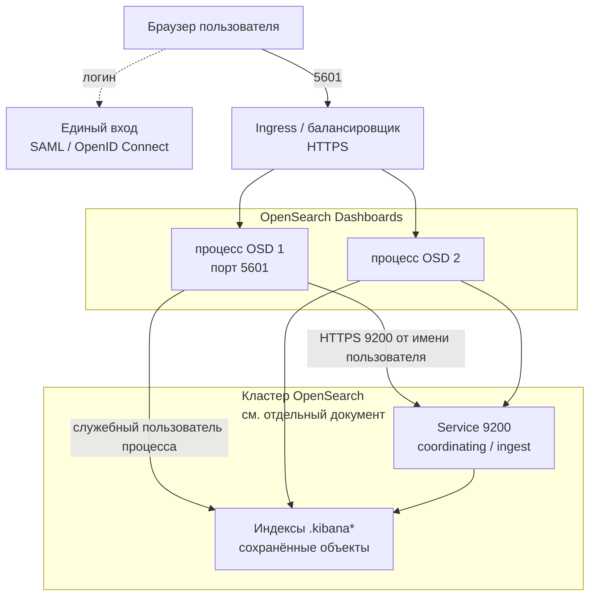

# OpenSearch Dashboards 3.8.0 — развёртывание и настройка

OpenSearch Dashboards — веб-интерфейс к кластеру OpenSearch: Discover, визуализации, дашборды, часть админки прав доступа. Этот документ про **свою установку** версии **3.8.0** (тот же релиз, что кластер OpenSearch 3.8.0 от 4 августа 2026). Кластер поиска живёт без UI; UI без живого кластера бесполезен. Документ по кластеру: `OpenSearch.md`. Здесь — только слой Dashboards.

Документация: https://docs.opensearch.org/latest/install-and-configure/install-dashboards/  
Образ: `opensearchproject/opensearch-dashboards:3.8.0`.  
На Kubernetes официальные пути: секция `spec.dashboards` в **OpenSearch Kubernetes Operator** и отдельно Helm-чарт `opensearch/opensearch-dashboards` (appVersion 3.8.0, репозиторий `https://opensearch-project.github.io/helm-charts/`). Для боя целевой путь — **оператор вместе с кластером OpenSearch**; Helm-чарт — запасной, более «ручной».

Это **другое ПО**, чем OpenSearch: процесс на Node.js, порт **5601**, прокси к REST 9200. Картинки и сохранённые объекты живут **в индексах кластера**, не на диске пода.

Этот текст — не набор команд «скопируй конфиг и запусти», а правила, без которых экземпляр не будет одновременно устойчивым к сбоям, масштабируемым и безопасным. Пошаговая установка — в `OpenSearch Dashboards.install.md`.

---

## Назначение системы

Dashboards нужен, чтобы **люди в браузере** смотрели логи и поисковую проекцию: Discover, дашборды, часть эксплуатации (политика жизни индексов, алерты плагинов). Кластер даёт API 9200; люди так не работают.

Падение Dashboards = «не видим картинки». Поиск по API и запись документов при этом могут быть живы. «Поиск 99.9%» ≠ «картинка в браузере 99.9%».

Система **не** хранит эталон клиентских карточек, **не** заменяет Grafana и Prometheus, **не** является SIEM (Wazuh — отдельный UI и отдельный кластер) и **не** ускоряет индексацию из Kafka. Без живого OpenSearch это красный экран.

---

## Перечень функций

Что умеет self-hosted OpenSearch Dashboards:

1. **Показывать Discover, визуализации и дашборды** в браузере по данным кластера OpenSearch.
2. **Хранить нарисованное** (шаблоны индексов, визуализации, дашборды, сохранённые поиски) в индексах кластера `.kibana*` / `.opensearch_dashboards*`, не на диске пода. Имя индекса должно совпасть с настройкой Security plugin (`index: '.kibana'` по умолчанию).
3. **Делить сохранённые объекты по тенантам** («папкам»): общий, личный на пользователя, именованные. Security plugin для каждого тенанта плодит **отдельный** индекс вида `.kibana_<hash>_<имя>`.
4. **Ходить в OpenSearch служебным пользователем** процесса (в учебнике — `kibanaserver`, роль `kibana_server`) — это **не** учётка аналитика. Если имя пользователя не `kibanaserver`, его **надо явно** привязать к роли.
5. **Показывать админку Security plugin**: логин, роли, тенанты, cookie-сессия. Без плагина Security в дистрибутиве ключи вроде `opensearch_security.cookie.secure` **не существуют**, процесс падает. В стандартном дистрибутиве плагин есть.
6. **Держать сессию в cookie** браузера (имя по умолчанию `security_authentication`). Отдельной базы сессий и Redis **нет**. Любая реплика примет cookie, **если** у всех одинаковый секрет шифрования cookie.
7. **Подключать единый вход** (SAML / OpenID Connect): настройка и в конфиге Security на кластере, и в конфиге Dashboards. На экране логина можно несколько кнопок; если типов больше одного — обычный пароль **обязан** быть в списке. Обход авторедиректа для админа: `?auto_login=false`.
8. **Проксировать запросы пользователя** на 9200 от его имени плюс служебные запросы процесса.
9. **Смотреть несколько источников** (фича выключена по умолчанию): тогда в UI можно добавить другие кластеры. Список адресов `opensearch.hosts` без этой фичи — ноды **одного и того же** кластера (запас, если одна не отвечает), не «два разных кластера в одном UI». Timeline-визуализации с несколькими источниками **не** поддерживаются.
10. **Шифровать канал** браузер ↔ UI (порт 5601) и UI ↔ OpenSearch (9200). По умолчанию для простоты старта UI слушает **HTTP**.
11. **Жить за reverse-proxy на подпути** (`/logs`): `server.basePath`; у оператора поле `basePath` само включает переписывание пути. Ingress должен совпадать.

Чего система **не** делает и часто путает: она не хранит логи и шарды (это OpenSearch), не озеро эталона, не Grafana, не кластерная сессионная база. Бэкап дашбордов = снимок индексов `.kibana*` **внутри OpenSearch**. Удалили индекс / нет снимка — визуализации нет, даже если поды UI живы. Порога «N одновременных аналитиков» в документации нет.

Браузеры, которые вендор **заявляет**: Chrome, Firefox, Safari, Edge (Chromium). Internet Explorer и Microsoft Edge Legacy — **нет**.

---

## Требования к развёртыванию

### Требования к ПО

| Что | Что ставить | Комментарий |
|---|---|---|
| **Формат поставки** | Контейнеры Docker **или** поды Kubernetes | Образ `opensearchproject/opensearch-dashboards:3.8.0`. В Kubernetes — секция `dashboards` оператора вместе с кластером. Helm-чарт — запасной путь. Это **Deployment**: поды взаимозаменяемы, постоянный диск под данные поиска **не нужен**. |
| **ОС** | Linux как основной контур | Боевой UI на Windows-хосте в схеме с Kubernetes не предполагается. |
| **Оркестратор боя** | Kubernetes (свой) | `spec.dashboards.enable: true`, `version: 3.8.0` = версия кластера. Чарты оператора фиксировать тегом релиза. В примерах оператора встречается `version: 3.0.0` — перед боем прогон **3.8.0** на стенде. |
| **Связанный кластер** | OpenSearch **той же линии 3.8.0** | Документация плагинов: Dashboards 2.3.0 работает с OpenSearch 2.3.0; плагины — major.minor.patch. Смешивать 3.8 Dashboards с 2.x кластером — неподдерживаемая лотерея. |
| **Node.js** | В пакете Dashboards 3.5+ лежит **Node.js 22** | Свой runtime — через `NODE_OSD_HOME` / `NODE_HOME`. Для контейнера обычно не трогают. |
| **Учётка процесса** | Пользователь с ролью `kibana_server` | Без неё UI не создаст и не починит `.kibana` и стартует «красным». |
| **Заголовок тенанта** | `securitytenant` в белом списке заголовков вместе с `Authorization` | Если его нет, документация: UI стартует со статусом **red**. |
| **Сертификаты** | Корпоративный PKI / Ingress для боя | Учебные и самоподписанные — только стенд. Для браузера удобнее валидный сертификат на Ingress; оператор предлагает: внутренний сертификат оператора + публичный на Ingress. |

### Требования к ресурсам

Цифр «сколько реплик на ваши терабайты озера» у проекта **нет** — нагрузки (число аналитиков, тяжесть Discover) в исходном запросе не было. Терабайты на UI **не влияют**, пока вы не открыли Discover по этим терабайтам: тогда страдает **кластер**. Ниже то, что есть у проекта, не смета закупки.

| Сценарий | CPU | RAM | Диск |
|---|---|---|---|
| **Дефолт официального Helm-чарта** | **100m** request/limit | **512M** | Почти пустой (кэш Node). Данные поиска не здесь |
| **Абзац README того же чарта** | не нормирован | Рекомендуется **8 ГиБ** RAM *доступно* на хосте/ноде, минимум **4 ГиБ**, иначе «deployment is expected to fail» | как выше |
| **Пример кучи V8 в комментарии чарта** | — | `--max-old-space-size=1800` через `NODE_OPTIONS` | — |

Дополнительно:

- Дефолт 512M **противоречит** абзацу «4–8 ГиБ» — в бой 512M не копировать. Это стендовый минимум чарта, не норма.
- Куча V8 задаётся отдельно. Лимит Kubernetes должен быть **выше** этой кучи, иначе убийца памяти, а не «Node сам пожмёт». Конкретного «официального размера кучи для Dashboards» в гайде установки нет — только эмпирика и абзац Helm.
- В чарте есть автомасштабирование (порог CPU/памяти **80%**), нужен Metrics Server. Это не замена пониманию, что узкое место часто 9200, а не 5601.
- Дефолт чарта: **1** реплика. Для боя минимум **2**.
- Дефолт **официального Helm-чарта** на выкате: сначала убиваются все поды, потом встают новые (`Recreate`). Это **простой UI**. Для отказа его меняют на поочерёдное обновление.
- Числа «терабайты озера» на Dashboards не влияют. Нет официальной формулы «N аналитиков = M реплик».
- На тестовой песочнице 512M можно оставить. Этот стенд **нельзя** переносить в бой как официальный минимум.

---

## Основные элементы системы и зависимости

Это одно ПО из **нескольких связанных частей**. Ниже — те, что живут отдельными инстансами, и как они вызывают друг друга.

### Схема инстансов и потоков



Как читать схему:

1. Человек заходит по HTTPS на Ingress, тот отдаёт запрос на **любую** реплику Dashboards. Процессы взаимозаменяемы: постоянного диска под поиск нет.
2. После логина сессия лежит в **cookie**. Отдельного Redis нет. Если секрет cookie на репликах разный — «то логинит, то выкидывает».
3. UI ходит на **9200** кластера: запросы от имени пользователя и служебные запросы пользователя процесса (обслуживание `.kibana*`). Список `opensearch.hosts` должен резолвиться на coordinating/ingest (или Service перед ними), **не** на выделенный cluster manager.
4. Нарисованные дашборды живут **в OpenSearch**. Удалили том пода UI — картинки на месте. Удалили индекс `.kibana*` — картинок нет.
5. Единый вход настраивается в двух местах: Security plugin кластера и конфиг Dashboards. Падение IdP = нельзя войти, если в запасе нет обычного пароля.
6. Kafka, Data Prepper, микросервисы пишут документы **в кластер**, не в Dashboards.

Рядом, но это уже другое ПО: Ingress / HAProxy, IdP, WAF если UI торчит наружу. Их отказ проектируется отдельно.

### Что входит в состав

| Компонент | Зачем | Как масштабируется |
|---|---|---|
| **Процесс Dashboards** | UI + прокси запросов пользователя в OpenSearch | Горизонтально: реплики Deployment. Вертикально: CPU/RAM + `NODE_OPTIONS` |
| **Индексы `.kibana*`** | Сохранённые объекты и тенанты | Это данные **кластера OpenSearch**. Копии, зоны, снимок — правила OpenSearch, не UI |
| **Пользователь процесса** | Обслуживание индексов UI | Один на кластер; пароль в Secret, не в Git |
| **Security plugin на кластере** | Кто вошёл, какие индексы видит | Без него UI — открытое окно в 9200 |
| **Плагины UI** (Security, политика жизни индексов, Alerting, Observability, …) | Экраны поверх возможностей кластера | Версия плагина = версия UI = версия OpenSearch (**major.minor.patch**) |
| **IdP (по желанию)** | Единый вход людей | Отказоустойчивость IdP — отдельная задача |
| **Ingress / балансировщик** | Доступ людей и распределение по репликам | Минимум 2 реплики UI + живой балансировщик, иначе точка отказа на входе |

### Официальные порты (менять можно, это контракт сети)

| Порт | Назначение | Кому открывать |
|---|---|---|
| **5601/TCP** | UI и API самого Dashboards (браузер, иногда автоматизация сохранённых объектов) | Только внутренняя сеть / прокси единого входа. Не мир |
| **9200/TCP** | Не слушает Dashboards. Это **исходящие** запросы UI → OpenSearch | С подов UI на coordinating/ingest. Не этот процесс |

UDP нет. Порт **9600** — Performance Analyzer **ноды OpenSearch**, не Dashboards.  
Helm-чарт дополнительно описывает `metricsPort: 9601` и съём метрик на `/_prometheus/metrics` — это **опция чарта**, не строка обязательных портов в гайде установки UI. В бою включать только если реально подняли экспорт и ограничили, кто скрейпит.

### Зависимости окружения (что ещё должно быть)

- Сеть UI → 9200. HTTPS, если на кластере включён HTTP TLS (в бою — да, см. `OpenSearch.md`).
- Секреты: пароль пользователя процесса, секрет cookie (минимум **32 символа**), client secret OpenID Connect, ключ TLS. Не в Git.
- Снимок `.kibana*` — часть политики снимков **кластера OpenSearch**, не «галочка в UI».
- Режим проверки сертификата OpenSearch: `full` (сертификат + имя хоста, дефолт и рекомендация), `certificate`, `none` (как в docker-примерах; для боя нет).
- Клиентский сертификат на 9200 по умолчанию **не** предъявляют (`alwaysPresentCertificate: false`).

---

## Краткие вводные

### Как устроена отказоустойчивость

Dashboards **не выбирает руководителя голосованием**. Отказоустойчивость — это «несколько одинаковых процессов + общие сохранённые объекты в OpenSearch + одинаковый секрет cookie».

| Что падает | Что происходит |
|---|---|
| Один под UI из двух или больше за балансировщиком | Балансировщик уводит трафик. Сессия в cookie — пользователь не обязан перелогиниваться, **если** секрет cookie одинаковый |
| Единственный под UI | Нет интерфейса. Кластер OpenSearch может быть green |
| Все поды UI в одной зоне, зона умерла | Нет интерфейса, даже если кластер в других площадках жив |
| OpenSearch yellow/red, нет главного шарда `.kibana` | UI не отрисует сохранённые объекты / не стартанёт нормально |
| OpenSearch недоступен с подов UI (сеть 9200) | UI «красный», люди думают «упал поиск», хотя data-ноды живы |
| Сменили секрет cookie на части реплик | Часть подов не принимает чужие cookie → «то логинит, то выкидывает» |
| Helm с выкатом «убить все, потом новые» | На время выката **ноль** подов — простой UI гарантирован чартом |
| Нет снимка `.kibana*` | После удаления индекса или гибели всех копий визуализации нет |

Три дата-центра **сами по себе** UI не спасают. Спасает раскладка реплик по машинам **и** то, что 9200 с этих реплик всё ещё достаёт кластер. Реплики UI в чужой площадке без живого 9200 дают ложное чувство устойчивости.

### Как устроено масштабирование

Две разные оси (их путают):

1. **Больше одновременных людей / вкладок** → больше **реплик UI** (и CPU/RAM каждой). Это горизонталь экрана.
2. **Тяжелее Discover / агрегации / больше данных** → это **data и coordinating OpenSearch**, не «добавь пятый Dashboards». UI только проксирует запрос.

HPA включать только после появления профиля: иначе реплики вырастут из-за тяжёлой агрегации, которую надо лечить шардами OpenSearch.

### Безопасность самого Dashboards

UI видит то же, что видит пользователь через Security plugin: логи интеграций, клиентский поиск, карты индексов. Украденная сессия `admin` или учебный пароль пользователя процесса = работа от чужого имени в UI.

Опасные значения «из коробки / из примера»:

| Что | Как в примере | Почему опасно |
|---|---|---|
| TLS на 5601 | HTTP, `server.ssl.enabled: false` | Старт «для простоты» |
| Проверка сертификата кластера | `verificationMode: none` в docker-гайде | Для самоподписанных на стенде; в бою запрещён |
| Секрет cookie | дефолт `security_cookie_default_password` (ровно 32 символа, общеизвестен) | Кто знает дефолт — может подделать сессию |
| Флаг «cookie только по HTTPS» | дефолт плагина **false** | Документация TLS: если включили HTTPS у UI — ставить **true** |
| Пароль пользователя процесса | demo `kibanaserver` / `kibanaserver` в docker-гайде | Первый же вход в админку индексов |
| Анонимный вход | `auth.anonymous_auth_enabled` дефолт false | Включить в бою = публичное чтение того, что разрешите роли anonymous |
| Срок сессии | `session.ttl` / `cookie.ttl` дефолт **3600000** мс (1 час); `session.keepalive` дефолт true | Продлевается при активности — это штатно, не «забыли таймаут» |

Оператор, если секрет не дали, **генерирует случайный** пароль пользователя процесса в `<cluster>-dashboards-password` — это лучше demo, но Secret всё равно надо ротировать и не светить в логи.

Для API 9200 без браузера вендор по SAML рекомендует **ещё один** способ входа (internal / LDAP / basic), иначе автоматизация разъедется с людьми.

Доверять заголовкам с reverse-proxy (человек уже аутентифицирован снаружи) можно только если 5601 **недоступен** в обход proxy. Иначе заголовки можно подделать.

Публичный 5601 без единого входа и без сети = инцидент, не «витрина для руководства». Штатный TLS — Node.js/JDK, не отдельная криптография по требованиям КИИ.

---

## Допущения

Ниже то, чего не было в исходном запросе, но без чего нельзя нарисовать конкретную схему. Если допущение неверно — схему надо пересмотреть.

1. Берём **свою установку Dashboards 3.8.0** к своей установке OpenSearch 3.8.0, не Amazon OpenSearch Service (там другой URL, IAM, нет ваших манифестов).
2. Бой в Kubernetes, UI ставится **оператором** вместе с кластером. Helm — запасной путь.
3. **Один логический UI на один поисковый кластер** (тот, что в `OpenSearch.md`). Wazuh indexer — **отдельный** UI и кластер, не второй источник «для удобства».
4. Реплики UI размазываем по машинам той площадки, где живёт 9200. Если «три дата-центра» без отдельных зон в планировщике — anti-affinity не сработает.
5. Цель отказа для UI: пережить отказ **пода** (и одной машины). Два мёртвых дата-центра из трёх при по одной реплике в зоне = один живой под; если живая площадка без 9200 до кластера — UI всё равно мёртв.
6. Нагрузки нет — нет цифры реплик. Есть правило «не меньше 2» и сигналы (задержка 5601, куча Node, задержка 9200, отказы на кластере).
7. Формального обещания «дашборд открылся за 2 секунды» нет. Green OpenSearch ≠ «картинка жива».
8. Люди в бою входят через единый вход + запасной парольный вход для аварии. Общая учётка `admin` в UI запрещена.
9. Корпоративный PKI / сертификат Ingress есть или будет. HTTP 5601 в бою только за прокси, который уже закрывает TLS, и тогда флаг cookie и заголовки надо согласовать (иначе cookie не выставится).
10. Шифрование канала — обычный TLS. Отдельная криптография государством не озвучена.
11. Учебный стенд изолирован. Учебные пароли, `verificationMode: none`, одна реплика, HTTP 5601 — только там.
12. Сохранённые объекты — часть данных кластера. Их судьба = копии / зоны / снимок OpenSearch. Отдельного «бэкапа Dashboards» нет.
13. Лицензия Apache 2.0 у дистрибутива. Сторонние плагины (`plugins.installList` в Helm) проверять отдельно.
14. В инструкции установки живой UI держат **рядом с кластером той же площадки**. Размазать UI «для устойчивости» при кластере только в одном дата-центре нельзя выдавать за устойчивость поиска.

---

## Критически важные условия, которых нет в исходном контексте

Их нужно закрыть **до** «выкатили 5601 и скинули ссылку в чат».

| Пробел | Почему это ломает решение |
|---|---|
| **Кто пользователь UI** (10 админов? 300 аналитиков? подрядчики?) | От этого зависят реплики, единый вход, тенанты, нужен ли вообще публичный Ingress |
| **Куда смотрит 5601** (только VPN / внутренний DNS? есть ли WAF?) | Публичный Ingress с дефолтным секретом cookie — инцидент |
| **Есть ли IdP** (Keycloak / AD FS / иное) | Без IdP вы либо раздадите внутренних пользователей (плохо масштабируется и аудитится), либо оставите `admin` |
| **UI в том же Kubernetes, что OpenSearch, или отдельно** | От этого зависит DNS `opensearch.hosts`, сетевая политика, и переживает ли UI падение namespace кластера |
| **Где живёт кластер OpenSearch** (одна площадка vs размазан vs ведомая копия) | Реплики UI в «чужом» дата-центре без 9200 до кластера бесполезны. Задержка UI = задержка до 9200 |
| **Нужны ли несколько источников в одном UI** | Второй кластер в одном UI — удобно и опасно (два контура прав в одной сессии оператора) |
| **Состав тенантов** (один общий на всех vs тенант на команду) | Каждый личный тенант = ещё индекс `.kibana_*` в состоянии кластера. Сотни пользователей × личный = сюрприз для кучи cluster manager |
| **Кто владеет сохранёнными объектами** (Git / NDJSON vs «накликали в UI») | Без экспорта после аварии `.kibana` вы восстанавливаете только то, что попало в снимок |
| **Согласование TLS: Ingress vs TLS на самом UI vs флаг cookie** | Классика: Ingress HTTPS, UI HTTP внутри, cookie «только HTTPS» → логин «не работает». Или наоборот, cookie без Secure на HTTP |
| **Совместимость оператора: поле `dashboards` вашей версии объекта** | Документация оператора в примерах пишет `version: 3.0.0`. Перед боем — прогон **3.8.0** на стенде |

---

## Краткое описание ключевых этапов и элементов развертывания

Общий каркас (и тест, и бой):

1. Зафиксировать **Dashboards 3.8.0 = OpenSearch 3.8.0**. Не смешивать major/minor/patch плагинов.
2. Сначала **здоровый кластер** (хотя бы green или осознанный yellow), пользователь процесса, TLS 9200 как решили для кластера.
3. Выпустить **свои** пароли (пользователь процесса, секрет cookie ≥ 32 символов) **до** боевых пользователей. Не оставлять учебные.
4. Поднять UI, проверить логин, создание шаблона индекса, что документ **виден**.
5. Включить снимок, покрывающий `.kibana*` (и прогнать восстановление — это процедура кластера).
6. Метрики: процесс жив (проверка порта 5601), задержка UI, ошибки 5xx Ingress, куча Node; с другой стороны — здоровье 9200.
7. Только потом — единый вход, тенанты, несколько источников, Ingress «для всех».

Боевая схема на несколько дата-центров — в `OpenSearch Dashboards.install.md`. Ниже — только тестовый стенд.

---

### 1 инстанс: тестовый стенд, 1 площадка, без нагрузки

**Цель стенда:** чтобы разработчики открыли Discover, настроили шаблон индекса, потыкали админку прав. **Не** цель: доказать отказ дата-центра и N одновременных сессий.

Официальный минимальный путь (Docker, после уже запущенного OpenSearch на сети `os-net`):

1. Файл `opensearch_dashboards.yml` как в гайде установки: TLS UI выкл, проверка сертификата кластера `none`, пользователь `kibanaserver`, hosts на имя контейнера OpenSearch.
2. Запуск:

```text
docker run -d --name osd \
  --network os-net \
  -p 5601:5601 \
  -v ./opensearch_dashboards.yml:/usr/share/opensearch-dashboards/config/opensearch_dashboards.yml \
  opensearchproject/opensearch-dashboards:3.8.0
```

Вендор в том же гайде для OpenSearch пишет `opensearchproject/opensearch:latest` — **не копируйте latest в бой и лучше не на стенд**: тег **3.8.0**, как у кластера.

Альтернатива: docker compose из гайда OpenSearch (2 ноды + Dashboards). Примеры compose вендор помечает как **не для боя**.

На Kubernetes: включить dashboards в объекте кластера, 1 реплика, HTTP, учебные / самоподписанные сертификаты допустимы **в изолированном namespace**. Либо Helm с одной репликой. Не копировать этот values в бой.

#### Что сознательно упрощаем

| Параметр | На тесте | Почему можно |
|---|---|---|
| Реплики UI | 1 | Нет требования пережить выкат |
| TLS 5601 | HTTP | Иначе команда утонет в сертификатах раньше, чем в Discover |
| Проверка сертификата кластера | `none` как в docker-гайде | Самоподписанный кластер |
| Пароли | demo `kibanaserver` **только в изолированной сети** | С 2.12 кластер всё равно требует свой admin-пароль; kibanaserver в гайде ещё demo |
| Секрет cookie | дефолт | Одна реплика, нет интернета |
| Единый вход / тенанты | можно не трогать | Сначала увидеть свои JSON |
| CPU / RAM | 512M как дефолт Helm | Не цель — ёмкость UI |
| Снимок `.kibana*` | можно отложить на день | Нельзя забыть на препроде |

#### Чего на тесте **не** стоит упрощать

- Версия **3.8.0** = кластеру.
- Понимание: картинки живут в `.kibana*`, а не в контейнере UI. Удалили том UI — дашборды на месте; удалили индекс — нет.
- Привычку **не** публиковать 5601 в интернет «на минутку».
- Запомнить: `verificationMode: none` и выкат «убить все сразу» из Helm **не** есть «почти бой».

#### Сильные стороны такой схемы

- Совпадает с официальным Docker-гайдом; поднимается за часы после кластера.
- Дешево учит шаблоны индексов на *ваших* полях из Kafka и интеграций.
- Один процесс — меньше движущихся частей.

#### Слабые стороны (обязательно понимать)

- Нет модели отказа UI, нет доказательства, что cookie разъедется по репликам.
- Учебный `kibanaserver` и дефолтный секрет cookie приучают «так и оставим».
- Успешный клик на одном поде **не** доказывает Ingress + единый вход + несколько машин.

Практическая рекомендация: препрод = маленькая **копия боевой топологии UI** (≥ 2 реплики, свои пароли, TLS на Ingress, флаг cookie согласован, поочерёдный выкат, снимок `.kibana*`), даже без боевого числа пользователей.

---

## Сводка: что считать «экземпляр готов»

| Требование | Тест (1 площадка) | Бой |
|---|---|---|
| Отказоустойчивость | Не требуется | ≥ 2 реплики на разных машинах; бюджет сбоя подов; поочерёдный выкат; секрет cookie общий; UI переживает смерть пода, **не** смерть OpenSearch. Схема на 2–3 дата-центра — в `OpenSearch Dashboards.install.md` |
| Производительность / масштаб | Не требуется | Реплики от числа сессий; куча V8 < лимита; узкое место Discover — кластер; автомасштабирование только с профилем |
| Безопасность | HTTP + учебные пароли только в изоляции | Нет demo пользователя процесса и дефолтного cookie; HTTPS до браузера; полная проверка сертификата кластера; единый вход; 5601 не в интернет; `.kibana*` в снимке |

**Не готов к бою**, если: одна реплика; Helm «убить все сразу»; проверка сертификата выкл; дефолтный секрет cookie; пароль `kibanaserver` / `kibanaserver`; 5601 опубликован; версии UI ≠ OpenSearch; все поды в одной зоне; нет снимка `.kibana*`; единого входа нет и все сидят под `admin`; Wazuh и бизнес-поиск в одном UI; UI размазан «для устойчивости» при кластере в одном дата-центре.

---

## Источники (чтобы не принимать на веру)

- Установка, браузеры, Node.js 22 в 3.5+: https://docs.opensearch.org/latest/install-and-configure/install-dashboards/
- Docker, учебный yml, `kibanaserver`, `verificationMode: none`, HTTP 5601: https://docs.opensearch.org/latest/install-and-configure/install-dashboards/docker/
- TLS UI (`server.ssl.*`, `opensearch.ssl.*`, флаг cookie, срок сессии): https://docs.opensearch.org/latest/install-and-configure/install-dashboards/tls/
- Совместимость плагинов UI = версия OpenSearch: https://docs.opensearch.org/latest/install-and-configure/install-dashboards/plugins/
- Helm: https://docs.opensearch.org/latest/install-and-configure/install-dashboards/helm/  
  values (1 реплика, Recreate, 100m/512M, NODE_OPTIONS, метрики 9601): https://github.com/opensearch-project/helm-charts/blob/main/charts/opensearch-dashboards/values.yaml  
  README чарта (4–8 ГиБ available): https://github.com/opensearch-project/helm-charts/blob/main/charts/opensearch-dashboards/README.md
- Оператор, TLS, basePath, секреты: https://docs.opensearch.org/latest/install-and-configure/install-opensearch/operator/operator-dashboards-config/  
  пароль пользователя процесса: https://docs.opensearch.org/latest/install-and-configure/install-opensearch/operator/operator-security/
- Тенанты, `.kibana*`, роль `kibana_server`, снимок `.kibana*`: https://docs.opensearch.org/latest/security/multi-tenancy/multi-tenancy-config/
- Несколько способов входа на одном экране: https://docs.opensearch.org/latest/security/configuration/multi-auth/
- SAML + белый список XSRF: https://docs.opensearch.org/latest/security/authentication-backends/saml/
- OpenID Connect: https://docs.opensearch.org/latest/security/authentication-backends/openid-connect/
- Несколько источников (`data_source.enabled`, ограничения): https://docs.opensearch.org/latest/dashboards/management/multi-data-sources/
- Схема секрета cookie, дефолт и minLength 32 (исходник плагина): https://github.com/opensearch-project/security-dashboards-plugin/blob/main/server/index.ts
- `opensearch.hosts` = ноды **одного** кластера, не двух (разъяснение maintainer на форуме проекта): https://forum.opensearch.org/t/connecting-two-opensearch-instances-to-one-opensearch-dashboard/18154

Утверждения вида «N реплик хватит на терабайты» или «UI переживёт падение OpenSearch» в документации проекта **отсутствуют** — поэтому в этом файле их нет. Задержку на пути UI → 9200 надо измерить у себя. Дефолты Helm (512M, Recreate, 1 реплика) **не** являются боевой нормой, даже если чарт официальный.
