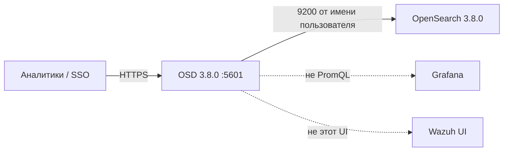
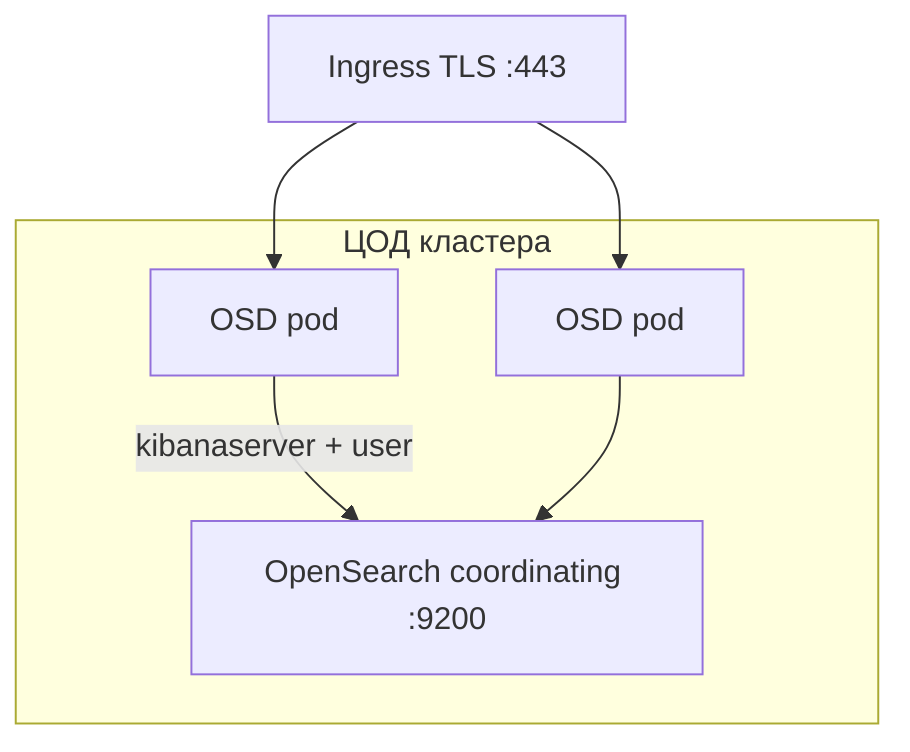
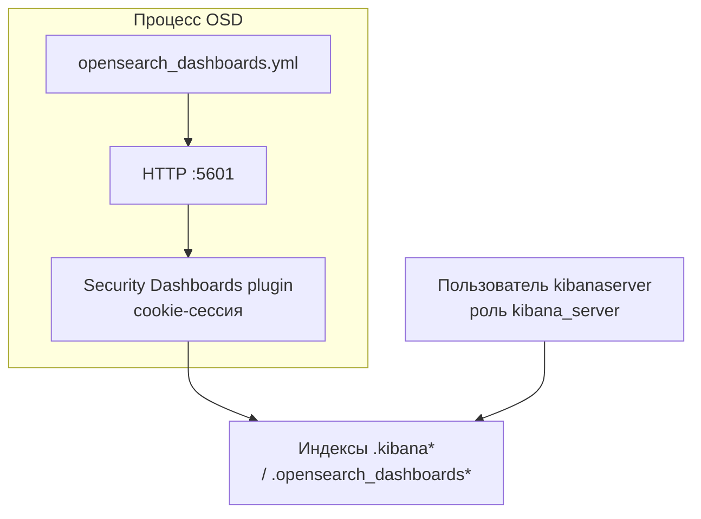
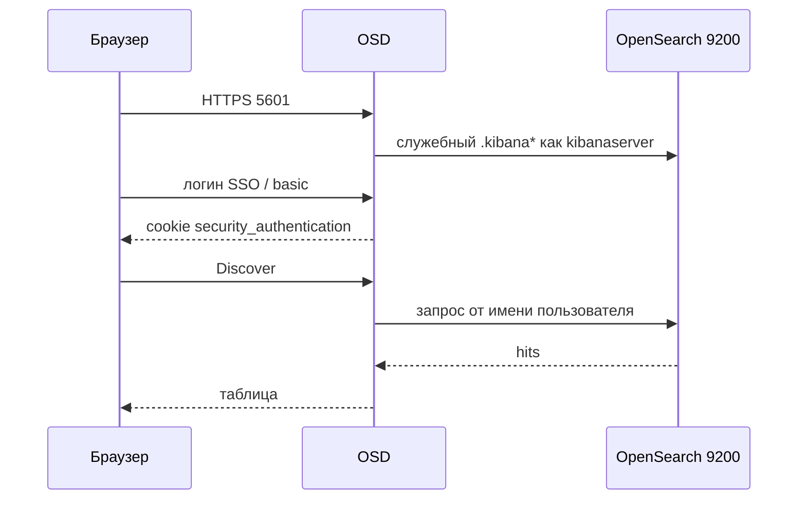
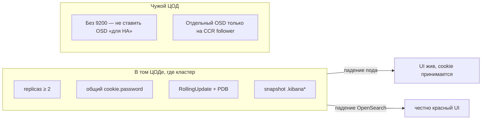
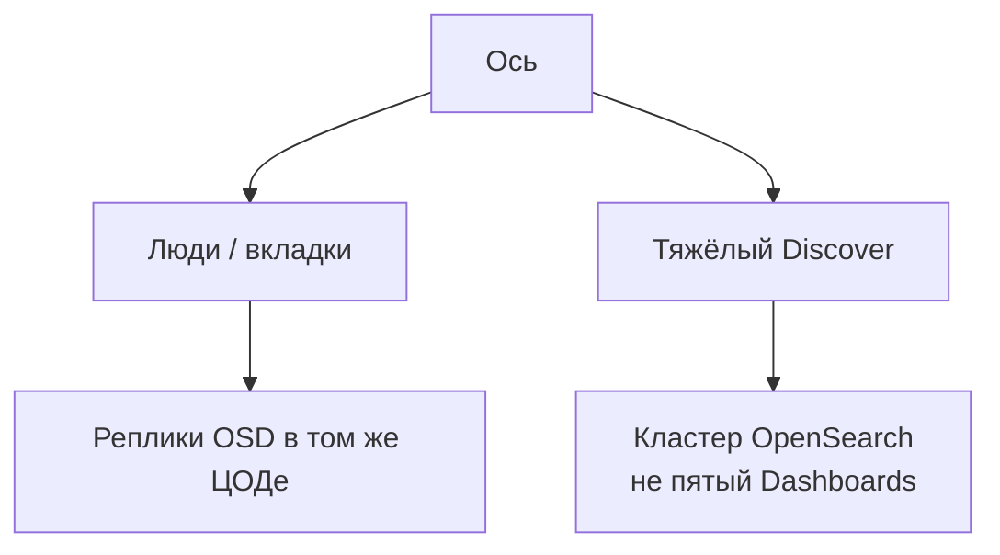
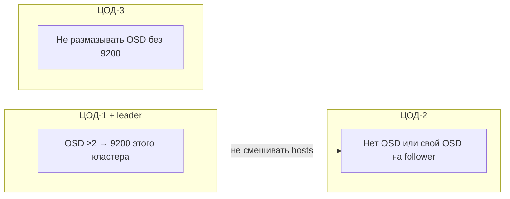

# OpenSearch Dashboards 3.8.0 — схемы устройства

Связанные документы: правила — `OpenSearch Dashboards.md`; установка — `OpenSearch Dashboards.install.md`. Кластер — `OpenSearch.md`.

C4 / «D4»: контекст → контейнеры → компоненты. Код плагинов UI не рисуем.

Допущения: OSD **рядом** с кластером своего ЦОДа; `opensearch.hosts` — ноды **одного** кластера, не leader+follower как fallback; версия = OpenSearch **3.8.0**; нагрузка (число аналитиков) не замерена.

---

## 1. Контекст

Dashboards — **Node.js UI и прокси к 9200**. Кластер живёт без UI; UI без кластера — красный экран.

Падение OSD = «не видим картинки». Запись ingest и API 9200 могут быть живы. SLO поиска ≠ SLO браузера.

---

## 2. Контейнеры (stateless рядом с кластером)

PVC поиска **не нужен**. Saved objects живут **в индексах** кластера.

Порт **5601** — UI. Исходящий **9200** — не слушает OSD. Deployment, не StatefulSet. Helm дефолт `updateStrategy: Recreate` — на выкате **ноль** подов; в проде **RollingUpdate**.

**Сильное:** убить один под — LB уводит трафик. **Слабое:** реплики OSD в «пустом» ЦОДе без 9200 дают ложное HA.

---

## 3. Компоненты состояния

| Компонент | Для чего настраивать |
|---|---|
| Saved objects | Не на диске пода. Удалили volume OSD — дашборды на месте; удалили `.kibana*` — нет |
| `cookie.password` | ≥ 32 символа, **один** Secret на Deployment. Дефолт `security_cookie_default_password` общеизвестен |
| `kibanaserver` | Служебный процесс, не учётка аналитика. Demo-пароль только в изоляции |
| Тенанты | Каждый private tenant = ещё индекс `.kibana_*` в cluster state |

Сессия **не** в Redis. Любая реплика примет cookie, если секрет одинаковый.

---

## 4. Поток: логин и Discover

Заголовок `securitytenant` должен быть в `requestHeadersAllowlist` вместе с `Authorization` — иначе OSD стартует **red** (дока).

---

## 5. Что настраивать: отказоустойчивость

| Ручка | Если забыть |
|---|---|
| Версия = 3.8.0 = кластеру | Плагины major.minor.patch; смесь 3.8 UI с 2.x — лотерея |
| `verificationMode: full` | Demo `none` в проде |
| `cookie.secure` согласовать с Ingress | HTTPS снаружи + HTTP до пода + secure cookie = логин «не работает» |
| NDJSON / snapshot | Единственная копия дашбордов — в кластере |

Пробы TCP 5601 = «порт открыт», не «`.kibana` зелёный».

---

## 6. Что настраивать: масштабируемость

Дефолт Helm **512M** не копировать. `NODE_OPTIONS=--max-old-space-size` **ниже** memory limit. HPA только после профиля: иначе реплики вырастут из-за aggregation, который лечат шардами.

Нет формулы «N аналитиков = M реплик».

---

## 7. Прод: 2 или 3 ЦОДа без stretch

`data_source.enabled` — второй Security realm в одной сессии; Timeline с этим режимом **не** поддерживается. Wazuh indexer в этот UI не подключать.

**Сильное:** короткий путь до 9200, горизонталь без Redis. **Слабое:** падение ЦОДа кластера = нет UI; утечка cookie.password = подделка любой сессии.

---

## 8. Безопасность (ручки на той же схеме)

5601 не в интернет без SSO. Людей `kibanaserver` не пускать. `admin` ежедневно запрещён. SAML ACS — стабильный URL LB, не Pod IP. Аноним на ПДн не включать. Proxy auth только если OSD недоступен в обход proxy.

Источники: `OpenSearch Dashboards.md`.
