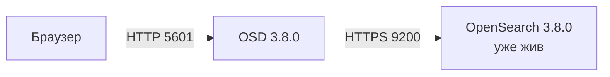

# OpenSearch Dashboards 3.8.0 — установка (учебный контур)

OpenSearch Dashboards — веб-интерфейс (процесс Node.js) к **уже запущенному** кластеру OpenSearch: Discover, визуализации, дашборды, часть админки Security. Это **не** поисковый движок и **не** второй кластер. Порт UI — **5601**. Сохранённые объекты живут в индексах `.kibana*` / `.opensearch_dashboards*` кластера, не на диске контейнера.

Версия UI **обязана** совпасть с OpenSearch: **3.8.0** ([история релизов](https://docs.opensearch.org/latest/version-history/), [совместимость плагинов](https://docs.opensearch.org/latest/install-and-configure/install-dashboards/plugins/)). Образ: `opensearchproject/opensearch-dashboards:3.8.0`. Не `latest` (так иногда пишет docker-гайд вендора — не копировать).

**Допущение:** закрытая сеть, одна машина, OpenSearch **3.8.0** уже жив по `OpenSearch.install.md`. Учебный YAML, HTTP, `verificationMode: none` и demo-пароль процесса — **только здесь**. В прод не копировать.

Официальный путь учёбы: [Docker](https://docs.opensearch.org/latest/install-and-configure/install-dashboards/docker/). **Docker** — программа, которая запускает готовый **образ** (упакованная программа с зависимостями) как контейнер.

---

## Куда ставить и сколько ресурсов (учебный контур)

**Куда.** Рядом с уже запущенным OpenSearch **3.8.0**, в той же Docker-сети. Порт **5601** только на `127.0.0.1`. Не поднимать второй OpenSearch «для UI». Не смотреть на Wazuh indexer. UI без живого **9200** — красный экран, не «устойчивость поиска».



**Сколько.** Цифр «N аналитиков» и CPU/RAM контейнера OSD в [Docker-гайде](https://docs.opensearch.org/latest/install-and-configure/install-dashboards/docker/) **нет**. Не выдумывать ядра.

| Зачем | CPU | RAM | Диск | Откуда |
|---|---|---|---|---|
| Контейнер OSD на учёбе (Docker) | в доке нет | в доке нет | почти пустой: объекты в кластере | [Docker](https://docs.opensearch.org/latest/install-and-configure/install-dashboards/docker/) |
| Дефолт официального Helm-чарта | **100m** request/limit | **512M** | как выше | [values.yaml](https://github.com/opensearch-project/helm-charts/blob/main/charts/opensearch-dashboards/values.yaml) |
| Available на ноде, иначе Helm «expected to fail» | не нормирован | рекомендуется **8 ГиБ**, минимум **4 ГиБ** | — | [README чарта](https://github.com/opensearch-project/helm-charts/blob/main/charts/opensearch-dashboards/README.md) |

На учёбе — один процесс Docker. 512M из values — дефолт чарта, не смета. 4–8 ГиБ — про available ноды Kubernetes, не про контейнер Docker. Путать нельзя.

**Сильная сторона:** официальный Docker-путь, второй кластер не нужен. **Слабая:** один процесс, demo `kibanaserver`, проверка сертификата выкл — привычка уедет в прод.

**Критично:** 5601 не в интернет. Не `latest`. Версия UI ≠ 3.8.0 = лотерея плагинов. Красный UI без 9200 — не отказ кластера.

---

## Установка для новичка

Страница шагов: https://docs.opensearch.org/latest/install-and-configure/install-dashboards/docker/

Команды — как у вендора (Linux / bash; на Windows Docker Desktop — Git Bash или WSL; в PowerShell том: `${PWD}`).

### Что должно быть до установки

**Есть:**

- Живой OpenSearch **3.8.0** (`OpenSearch.install.md`): `curl -sk -u admin:<пароль_из_OPENSEARCH_INITIAL_ADMIN_PASSWORD> https://127.0.0.1:9200` отдаёт `"number" : "3.8.0"`
- Docker; на localhost свободен **5601**
- Закрытая сеть

**Нет** (и не появится на этом стенде):

- Второй контейнер OpenSearch «под Dashboards»
- Тег `latest`
- Публикация 5601 наружу
- Wazuh indexer как `opensearch.hosts`

### Этап 1. Проверка кластера

**Что делаем:** убеждаемся, что поиск уже отвечает **3.8.0**. Без этого UI бесполезен. Второй кластер **не** ставим.

```bash
docker ps --format "{{.Names}} {{.Image}}"
curl -sk -u admin:DevAdmin_12Str0ng https://127.0.0.1:9200
```

Пароль — тот, что задали в `OPENSEARCH_INITIAL_ADMIN_PASSWORD` при старте OpenSearch (в `OpenSearch.install.md` пример `DevAdmin_12Str0ng`). Успех: в JSON версия **3.8.0**; контейнер кластера есть (часто `os-dev`).

### Этап 2. Сеть Docker `os-net`

**Что делаем:** кладём OSD в ту же сеть, что кластер, чтобы имя контейнера резолвилось. Сеть `os-net` — из [docker-гайда OSD](https://docs.opensearch.org/latest/install-and-configure/install-dashboards/docker/). Если сеть или подключение уже есть — ошибка create/connect ожидаема, не повторять.

```bash
docker network create os-net
docker network connect os-net os-dev
```

Имя `os-dev` — из `OpenSearch.install.md`. Если кластер поднимали по гайду вендора, имя может быть `opensearch-node`. Своё: `docker ps`. Успех: `docker network inspect os-net` показывает контейнер кластера.

### Этап 3. `opensearch_dashboards.yml`

**Что делаем:** пишем главный конфиг процесса (без него контейнер возьмёт дефолты образа). `verificationMode: none` и demo `kibanaserver` — **только** закрытый стенд, так в docker-гайде. Заголовок `securitytenant` вместе с `Authorization` обязателен: иначе UI стартует **red** ([тенанты](https://docs.opensearch.org/latest/security/multi-tenancy/multi-tenancy-config/)).

Имя хоста в `opensearch.hosts` = имя контейнера OpenSearch из этапа 2.

```yaml
server.name: opensearch_dashboards
server.host: "0.0.0.0"
server.customResponseHeaders : { "Access-Control-Allow-Credentials" : "true" }
server.ssl.enabled: false
opensearch.hosts: ["https://os-dev:9200"]
opensearch.ssl.verificationMode: none
opensearch.username: kibanaserver
opensearch.password: kibanaserver
opensearch.requestHeadersWhitelist: ["securitytenant","Authorization"]
opensearch_security.multitenancy.enabled: true
opensearch_security.multitenancy.tenants.preferred: ["Private", "Global"]
opensearch_security.readonly_mode.roles: ["kibana_read_only"]
opensearch_security.cookie.secure: false
```

`kibanaserver` — служебный пользователь, которым **сам процесс** ходит в OpenSearch обслуживать `.kibana*`. Это **не** учётка аналитика. Роль `kibana_server`. Demo-пароль `kibanaserver` — из [docker-гайда](https://docs.opensearch.org/latest/install-and-configure/install-dashboards/docker/). `cookie.secure: false` — UI на HTTP ([getting started](https://docs.opensearch.org/latest/security/getting-started/)).

Успех: файл лежит рядом с местом, откуда запустите `docker run`.

### Этап 4. Запуск контейнера

**Что делаем:** поднимаем OSD **3.8.0** в `os-net`, порт только localhost. Вендор пишет `-p 5601:5601` и тег `latest` — здесь **127.0.0.1** и **3.8.0**.

```bash
docker run -d --name osd-dev \
  --network os-net \
  -p 127.0.0.1:5601:5601 \
  -v "$PWD/opensearch_dashboards.yml:/usr/share/opensearch-dashboards/config/opensearch_dashboards.yml" \
  opensearchproject/opensearch-dashboards:3.8.0
```

Успех: команда без ошибки; `docker ps` — `osd-dev` Up, образ с тегом **3.8.0**.

### Этап 5. Логи процесса

**Что делаем:** ждём, пока процесс слушает 5601. Старт не мгновенный.

```bash
docker logs --tail 80 osd-dev
```

Успех: строки вида `Server running at http://...:5601` / `http server running at http://...:5601` ([getting started](https://docs.opensearch.org/latest/security/getting-started/)). Циклический рестарт или red status — нет 9200, неверное имя в `opensearch.hosts`, нет заголовка `securitytenant`, или версия UI ≠ кластеру.

Если стенд уже в Kubernetes: в объекте кластера `spec.dashboards.enable: true`, `version: "3.8.0"`, 1 реплика, HTTP ([оператор](https://docs.opensearch.org/latest/install-and-configure/install-opensearch/operator/operator-dashboards-config/)). Это не второй кластер. Дефолт Helm 100m/512M и `updateStrategy: Recreate` сюда не копировать как «готово».

**Чего этот стенд не доказывает:** отказ зала, N одновременных сессий, общий cookie на нескольких репликах, Ingress + единый вход, нагрузку Discover (бьёт кластер, не «пятый OSD»). Выборов лидера у OSD нет: процессы взаимозаменяемы. Падение UI ≠ падение поиска на 9200.

---

## Первый запуск — URL, порт, учётка, смена пароля

**URL:** `http://127.0.0.1:5601` — так в [getting started](https://docs.opensearch.org/latest/security/getting-started/) и [TLS](https://docs.opensearch.org/latest/install-and-configure/install-dashboards/tls/) (там же `https://localhost:5601`, если включили TLS на UI). Порт **5601** — контракт [установки](https://docs.opensearch.org/latest/install-and-configure/install-dashboards/). Браузеры вендора: Chrome, Firefox, Safari, Edge (Chromium); IE и Edge Legacy — нет.

Логин зависит от **Security plugin** кластера (в стандартном дистрибутиве он есть). Без плагина ключи вроде `opensearch_security.cookie.secure` **не существуют**, процесс OSD падает.

**Учётка в UI:** пользователь **`admin`**, пароль — из `OPENSEARCH_INITIAL_ADMIN_PASSWORD` кластера. С **2.12** пара `admin` / `admin` **не** работает: контейнер OpenSearch без своего пароля не стартует ([Docker OpenSearch](https://docs.opensearch.org/latest/install-and-configure/install-opensearch/docker/)). Старые примеры и комментарий Helm с `admin:admin` не копировать.

Не входить как `kibanaserver`: это пользователь **процесса**, не аналитика ([роль `kibana_server`](https://docs.opensearch.org/latest/security/access-control/users-roles/)).

**Смена пароля `admin` сразу после входа.** Пароль живёт в Security plugin на **9200**, не в контейнере OSD. Свой пароль текущего пользователя ([Change Password API](https://docs.opensearch.org/latest/api-reference/security/authentication/change-password/)):

```bash
curl -sk -u admin:DevAdmin_12Str0ng -X PUT "https://127.0.0.1:9200/_plugins/_security/api/account" \
  -H "Content-Type: application/json" \
  -d '{"current_password":"DevAdmin_12Str0ng","password":"ЗАМЕНИТЕ_СВОИМ"}'
```

Успех: `"status": "OK"`, `"message": "Password changed"`. Дальше в UI — уже новый пароль. Учебный пароль в прод не уносить.

В UI: **Security → Internal Users** — создать **отдельного** человека с ролью вроде `kibana_user` + права на ваши индексы ([users/roles](https://docs.opensearch.org/latest/security/access-control/users-roles/)). `admin` ежедневно не использовать. Если оставляете demo-пользователей — сменить пароли, иначе `securityadmin.sh` ([YAML](https://docs.opensearch.org/latest/security/configuration/yaml/)).

После входа: шаблон индекса (index pattern) на поля вашего индекса, затем Discover. Пустой Discover при живом 9200 — нет шаблона или нет документов, не «OSD сломан».

Сессия — cookie `security_authentication` (имя по умолчанию), не Redis. Срок по умолчанию **1 час** (3 600 000 мс), при активности продлевается ([TLS](https://docs.opensearch.org/latest/install-and-configure/install-dashboards/tls/)). Дефолтный секрет cookie `security_cookie_default_password` общеизвестен — на одной реплике стенда терпимо, в прод свой ≥ **32** символов.

---

## Подключение к своей системе

Люди открывают браузер на OSD. Источник данных UI — OpenSearch **этой** площадки (`opensearch.hosts`), HTTPS **9200**. Приложения платформы ходят в OpenSearch **напрямую**, не через Dashboards. Kafka, Camunda, интеграционное API ведомств в OSD не подключаются.

`opensearch.hosts` — ноды **одного** кластера (запас, если одна не отвечает), не «пишущий и ведомый как два URL в одном списке». Несколько источников в одном UI (`data_source.enabled`) по умолчанию выкл; Timeline с этим режимом не поддерживается. Wazuh indexer сюда не добавлять.

| Что | Как |
|---|---|
| Браузер → OSD | HTTP **5601** на стенде (`127.0.0.1`). В прод — Ingress HTTPS; флаг `cookie.secure` согласовать с тем, где кончается TLS |
| OSD → кластер | `https://<имя-контейнера-или-Service>:9200`, пользователь процесса `kibanaserver` |
| Проверка сертификата кластера | стенд: `none`; в прод: `full` ([TLS](https://docs.opensearch.org/latest/install-and-configure/install-dashboards/tls/)) |
| Клиенты приложений | REST **9200** OpenSearch, не 5601 |

### Секреты (не в git)

| Секрет | Где живёт | Куда не класть |
|---|---|---|
| Пароль `admin` после смены | сейф / Vault | git, чат, yml в репозитории |
| `opensearch.password` (`kibanaserver`) | `opensearch_dashboards.yml` / Secret | git |
| `opensearch_security.cookie.password` (≥ 32 символа, один на все реплики) | Secret | git; не оставлять дефолт |
| Client secret OIDC (если появится) | Secret, в yml через `${ENV}` | git. Смена Secret без рестарта подов не подхватывается ([оператор](https://docs.opensearch.org/latest/install-and-configure/install-opensearch/operator/operator-dashboards-config/)) |

В git — процедура и yml без паролей.

### Чем продукт не является

| Сосед | Чем отличается |
|---|---|
| OpenSearch | Движок: индексы, поиск, 9200. OSD — только UI и прокси |
| Grafana / Apache Superset | Другие дашборды (PromQL / SQL), не этот UI |
| Wazuh dashboard | Другой образ и другой кластер indexer |
| Эталон карточек | Discover — проекция для поиска, не источник истины |
| Сессионная БД / Redis | Сессия в cookie. Отдельного Redis вендор не требует |

---

## Ссылки на материал

| Факт | URL |
|---|---|
| Релиз **3.8.0** (4 августа 2026) | https://docs.opensearch.org/latest/version-history/ |
| Установка OSD, браузеры, Node.js 22 в 3.5+ | https://docs.opensearch.org/latest/install-and-configure/install-dashboards/ |
| Docker: yml, `kibanaserver`, `verificationMode: none`, HTTP 5601, сеть `os-net` | https://docs.opensearch.org/latest/install-and-configure/install-dashboards/docker/ |
| TLS UI/кластер, `cookie.secure`, срок сессии 1 час | https://docs.opensearch.org/latest/install-and-configure/install-dashboards/tls/ |
| Плагины: major.minor.patch = OpenSearch | https://docs.opensearch.org/latest/install-and-configure/install-dashboards/plugins/ |
| Helm (примеры страницы могут быть 3.1.0; чарт `appVersion` **3.8.0**) | https://docs.opensearch.org/latest/install-and-configure/install-dashboards/helm/ |
| README чарта: 4–8 ГиБ available | https://github.com/opensearch-project/helm-charts/blob/main/charts/opensearch-dashboards/README.md |
| values: 100m/512M, порт 5601, `updateStrategy: Recreate` | https://github.com/opensearch-project/helm-charts/blob/main/charts/opensearch-dashboards/values.yaml |
| Оператор: `spec.dashboards`, `version`, секреты, basePath | https://docs.opensearch.org/latest/install-and-configure/install-opensearch/operator/operator-dashboards-config/ |
| Тенанты, `.kibana*`, роль `kibana_server`, снимок `.kibana*` | https://docs.opensearch.org/latest/security/multi-tenancy/multi-tenancy-config/ |
| Логин `admin` + пароль из `OPENSEARCH_INITIAL_ADMIN_PASSWORD`; yml OSD | https://docs.opensearch.org/latest/security/getting-started/ |
| Docker OpenSearch: с 2.12 нет `admin`/`admin` | https://docs.opensearch.org/latest/install-and-configure/install-opensearch/docker/ |
| Смена своего пароля | https://docs.opensearch.org/latest/api-reference/security/authentication/change-password/ |
| Internal Users, роли `kibana_user` / `kibana_server` | https://docs.opensearch.org/latest/security/access-control/users-roles/ |
| Demo-пользователи, смена паролей YAML | https://docs.opensearch.org/latest/security/configuration/yaml/ |
| Кластер поиска (сначала он) | `OpenSearch.install.md` |
| Зачем продукт, порты, железо | `OpenSearch Dashboards.md` |
| Словарь | `OpenSearch Dashboards.info.md` |
| Схема стыковки | `OpenSearch Dashboards.shema.md` |
| Роль консультанта | `OpenSearch Dashboards.consultant.md` |

**В доке вендора нет (и здесь не выдумано):** CPU/RAM контейнера OSD в Docker-гайде; формула «N аналитиков = M реплик»; порог RTT OSD → 9200; готовый `admin`/`admin` с 2.12; требование Redis для сессий.
