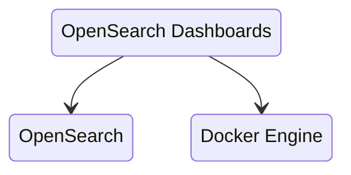

# OpenSearch Dashboards 3.8.0 — развёртывание и настройка

OpenSearch Dashboards — веб-интерфейс к кластеру OpenSearch: Discover, визуализации, дашборды, часть админки прав доступа. Этот документ про **свою установку** версии **3.8.0** (тот же релиз, что кластер OpenSearch 3.8.0 от 4 августа 2026). Кластер поиска живёт без UI; UI без живого кластера бесполезен. Документ по кластеру: `OpenSearch.md`. Здесь — только слой Dashboards.

Документация: https://docs.opensearch.org/latest/install-and-configure/install-dashboards/  
Образ: `opensearchproject/opensearch-dashboards:3.8.0`.  
На Kubernetes официальные пути: секция `spec.dashboards` в **OpenSearch Kubernetes Operator** и отдельно Helm-чарт `opensearch/opensearch-dashboards` (appVersion 3.8.0, репозиторий `https://opensearch-project.github.io/helm-charts/`). Для боя целевой путь — **оператор вместе с кластером OpenSearch**; Helm-чарт — запасной, более «ручной».

Это **другое ПО**, чем OpenSearch: процесс на Node.js, порт **5601**, прокси к REST 9200. Картинки и сохранённые объекты живут **в индексах кластера**, не на диске пода.

Этот текст — не набор команд «скопируй конфиг и запусти», а правила, без которых экземпляр не будет одновременно устойчивым к сбоям, масштабируемым и безопасным. Пошаговая установка — в `OpenSearch Dashboards.install.md`.

---

## Назначение системы

Dashboards нужен, чтобы **люди в браузере** смотрели логи и поисковую проекцию: Discover, дашборды, часть эксплуатации (политика жизни индексов, алерты плагинов). Кластер даёт API 9200; люди так не работают.

Падение Dashboards = «не видим картинки». Поиск по API и запись документов при этом могут быть живы. «Поиск 99.9%» ≠ «картинка в браузере 99.9%».

Система **не** хранит эталон клиентских карточек, **не** заменяет Grafana и Prometheus, **не** является SIEM (Wazuh — отдельный UI и отдельный кластер) и **не** ускоряет индексацию из Kafka. Без живого OpenSearch это красный экран.

---

## Перечень функций

Что умеет self-hosted OpenSearch Dashboards:

1. **Показывать Discover, визуализации и дашборды** в браузере по данным кластера OpenSearch.
2. **Хранить нарисованное** (шаблоны индексов, визуализации, дашборды, сохранённые поиски) в индексах кластера `.kibana*` / `.opensearch_dashboards*`, не на диске пода. Имя индекса должно совпасть с настройкой Security plugin (`index: '.kibana'` по умолчанию).
3. **Делить сохранённые объекты по тенантам** («папкам»): общий, личный на пользователя, именованные. Security plugin для каждого тенанта плодит **отдельный** индекс вида `.kibana_<hash>_<имя>`.
4. **Ходить в OpenSearch служебным пользователем** процесса (в учебнике — `kibanaserver`, роль `kibana_server`) — это **не** учётка аналитика. Если имя пользователя не `kibanaserver`, его **надо явно** привязать к роли.
5. **Показывать админку Security plugin**: логин, роли, тенанты, cookie-сессия. Без плагина Security в дистрибутиве ключи вроде `opensearch_security.cookie.secure` **не существуют**, процесс падает. В стандартном дистрибутиве плагин есть.
6. **Держать сессию в cookie** браузера (имя по умолчанию `security_authentication`). Отдельной базы сессий и Redis **нет**. Любая реплика примет cookie, **если** у всех одинаковый секрет шифрования cookie.
7. **Подключать единый вход** (SAML / OpenID Connect): настройка и в конфиге Security на кластере, и в конфиге Dashboards. На экране логина можно несколько кнопок; если типов больше одного — обычный пароль **обязан** быть в списке. Обход авторедиректа для админа: `?auto_login=false`.
8. **Проксировать запросы пользователя** на 9200 от его имени плюс служебные запросы процесса.
9. **Смотреть несколько источников** (фича выключена по умолчанию): тогда в UI можно добавить другие кластеры. Список адресов `opensearch.hosts` без этой фичи — ноды **одного и того же** кластера (запас, если одна не отвечает), не «два разных кластера в одном UI». Timeline-визуализации с несколькими источниками **не** поддерживаются.
10. **Шифровать канал** браузер ↔ UI (порт 5601) и UI ↔ OpenSearch (9200). По умолчанию для простоты старта UI слушает **HTTP**.
11. **Жить за reverse-proxy на подпути** (`/logs`): `server.basePath`; у оператора поле `basePath` само включает переписывание пути. Ingress должен совпадать.

Чего система **не** делает и часто путает: она не хранит логи и шарды (это OpenSearch), не озеро эталона, не Grafana, не кластерная сессионная база. Бэкап дашбордов = снимок индексов `.kibana*` **внутри OpenSearch**. Удалили индекс / нет снимка — визуализации нет, даже если поды UI живы. Порога «N одновременных аналитиков» в документации нет.

Браузеры, которые вендор **заявляет**: Chrome, Firefox, Safari, Edge (Chromium). Internet Explorer и Microsoft Edge Legacy — **нет**.

---

## Основные элементы системы и зависимости

OpenSearch Dashboards — отдельный продуктовый слой из взаимозаменяемых процессов UI. **OpenSearch не входит в OpenSearch Dashboards:** это отдельно развёрнутая обязательная зависимость. Ingress, провайдер единого входа и источники данных также разворачиваются отдельно; при этом единый вход, Ingress и показанные источники данных зависят от выбранной архитектуры и не становятся обязательными только из-за присутствия на схеме.

**Допущение схемы:** одна площадка. Реплики UI и кластер OpenSearch **3.8.0** живут в одном дата-центре. Stretch UI на 2–3 зала и смешение в `opensearch.hosts` пишущего и ведомого кластера на схеме **нет**: порога допустимого RTT у проекта нет, а UI без живого **9200** этой площадки — красный экран, не устойчивость поиска. ([установка](https://docs.opensearch.org/latest/install-and-configure/install-dashboards/), [несколько источников](https://docs.opensearch.org/latest/dashboards/management/multi-data-sources/))

**Сильная сторона** одного зала: короткий путь браузер → **5601** → **9200**, реплики взаимозаменяемы без Redis, сохранённые объекты лежат в локальном кластере. **Слабая:** падение этой площадки вместе с её OpenSearch оставляет UI красным, даже если в других ЦОДах есть машины. **Критично:** не публиковать **5601** в интернет; не копировать учебный `verificationMode: none`, demo `kibanaserver` и дефолтный секрет cookie в бой; не ставить реплики UI в чужой зал «для HA» без 9200; версия UI обязана быть **3.8.0**, как у кластера; не `latest`; дефолт Helm **512M** в бой не копировать. ([Docker](https://docs.opensearch.org/latest/install-and-configure/install-dashboards/docker/), [TLS](https://docs.opensearch.org/latest/install-and-configure/install-dashboards/tls/), [Helm README](https://github.com/opensearch-project/helm-charts/blob/main/charts/opensearch-dashboards/README.md))

### Схема инстансов и потоков

Имена внутри блоков — роли, не обязательные DNS-имена. Сплошная стрелка — рабочий поток показанной схемы одной площадки; пунктир — опциональный путь или логическая связь, а не обязательный TCP. Направление стрелки — кто открывает соединение. Рамки subgraph **без заливки**: цвет задаёт сам квадратик, подложка его не перекрашивает.

```mermaid
%%{init: {"theme": "base", "themeVariables": {"primaryColor": "#d9ead3", "primaryTextColor": "#000000", "primaryBorderColor": "#38761d", "lineColor": "#5b5b5b", "secondaryColor": "#cfe2f3", "tertiaryColor": "#fff2cc", "clusterBkg": "transparent", "clusterBorder": "#666666"}}}%%
flowchart LR
  BRW["BRW — браузер пользователя"]

  subgraph EDGE["Вход площадки 1 — отдельное ПО"]
    ING["ING — Ingress / reverse proxy"]
    IDP["IDP — провайдер единого входа<br/>SAML / OpenID Connect"]
  end

  subgraph SITE["Площадка 1 — OpenSearch Dashboards 3.8.0"]
    SVC["SVC — Service :5601"]
    OSD1["OSD-1 — инстанс 1<br/>Node.js, 5601/TCP"]
    OSD2["OSD-2 — инстанс 2<br/>Node.js, 5601/TCP"]
  end

  subgraph OS["Отдельно развёрнутый OpenSearch 3.8.0 площадки 1"]
    API["API — REST OpenSearch :9200"]
    IDX[("IDX — индексы .kibana*")]
    DATA[("DATA — прикладные индексы")]
  end

  SRC["SRC — источники данных<br/>Kafka / Data Prepper / сервисы"]

  BRW -->|"1. HTTPS :443"| ING
  ING -->|"2. HTTP(S) :5601"| SVC
  SVC -->|"2. тот же 5601"| OSD1
  SVC -->|"2. тот же 5601"| OSD2
  BRW -.->|"3. вход, если включён"| IDP
  IDP -.->|"3. результат входа"| ING
  OSD1 -->|"4. HTTPS :9200"| API
  OSD2 -->|"4. HTTPS :9200"| API
  API --> IDX
  API --> DATA
  SRC -.->|"5. пишут в OpenSearch,<br/>не в Dashboards"| API

  L_OSD["Dashboards: обязательный компонент"]
  L_OPT["Dashboards: опциональный компонент"]
  L_EXT["Внешняя система / отдельное ПО"]
  L_OS[("OpenSearch: отдельно развёрнутая зависимость")]

  style EDGE fill:none,stroke:#0b5394,color:#000000
  style SITE fill:none,stroke:#38761d,color:#000000
  style OS fill:none,stroke:#741b47,color:#000000

  style OSD1 fill:#d9ead3,stroke:#38761d,color:#000000,stroke-width:2px
  style SVC fill:#d9ead3,stroke:#38761d,color:#000000,stroke-width:2px
  style L_OSD fill:#d9ead3,stroke:#38761d,color:#000000,stroke-width:2px

  style OSD2 fill:#fff2cc,stroke:#bf9000,color:#000000,stroke-width:2px,stroke-dasharray:5 3
  style L_OPT fill:#fff2cc,stroke:#bf9000,color:#000000,stroke-width:2px,stroke-dasharray:5 3

  style BRW fill:#cfe2f3,stroke:#0b5394,color:#000000,stroke-width:2px
  style ING fill:#cfe2f3,stroke:#0b5394,color:#000000,stroke-width:2px
  style IDP fill:#cfe2f3,stroke:#0b5394,color:#000000,stroke-width:2px
  style SRC fill:#cfe2f3,stroke:#0b5394,color:#000000,stroke-width:2px
  style L_EXT fill:#cfe2f3,stroke:#0b5394,color:#000000,stroke-width:2px

  style API fill:#ead1dc,stroke:#741b47,color:#000000,stroke-width:2px
  style IDX fill:#ead1dc,stroke:#741b47,color:#000000,stroke-width:2px
  style DATA fill:#ead1dc,stroke:#741b47,color:#000000,stroke-width:2px
  style L_OS fill:#ead1dc,stroke:#741b47,color:#000000,stroke-width:2px
```

**Легенда:**

- ■ **Зелёный** — процессы и сервис OpenSearch Dashboards, без которых показанный контур UI не работает (`OSD-1`, `SVC`).
- ■ **Жёлтый, пунктирная рамка** — тот же продукт, который на одной площадке можно не включать (второй инстанс). На закрытом стенде достаточно `OSD-1`.
- ■ **Синий** — отдельно развёрнутые системы и участники. Dashboards их не кластеризует и не заменяет.
- ■ **Розовый** — отдельно развёрнутый OpenSearch этой площадки. Цилиндр — индексы (данные другого ПО); прямоугольник `API` — его REST-точка. Формат сохранённых объектов — продукт UI; хранение и поиск — нет.

### Описание блоков

#### BRW — браузер пользователя

- **Что это:** клиент на рабочем месте человека: открывает URL интерфейса и держит cookie сессии.
- **Технологии и варианты:** вендор заявляет Chrome, Firefox, Safari и Edge на Chromium; Internet Explorer и Microsoft Edge Legacy не поддерживаются. ([установка](https://docs.opensearch.org/latest/install-and-configure/install-dashboards/))
- **Назначение:** открыть Discover, визуализации, дашборды и доступные человеку административные экраны. Браузер не ходит на **9200** сам: запросы к кластеру проксирует инстанс OSD.
- **Развёртывание:** внешний участник, не входит в OpenSearch Dashboards и не является серверным компонентом.

#### ING — Ingress / reverse proxy

- **Что это:** внешняя HTTPS-точка входа площадки 1 перед репликами UI.
- **Технологии и варианты:** Kubernetes Ingress, HAProxy или иной reverse proxy / балансировщик; конкретный продукт задаёт платформа, не Dashboards. Если UI публикуют на подпути (`/logs`), у оператора поле `basePath` само включает `server.rewriteBasePath`; Ingress должен совпадать. ([оператор](https://docs.opensearch.org/latest/install-and-configure/install-opensearch/operator/operator-dashboards-config/))
- **Назначение:** завершить TLS при выбранной схеме, отдать один публичный URL на **443** и распределить запросы на **5601/TCP**. Сам объекты и индексы не хранит.
- **Развёртывание:** отдельно развёрнутая система. На закрытом Docker-стенде вход может быть `http://127.0.0.1:5601` без Ingress; для показанной многорепличной схемы с HTTPS вход обязателен. Доверять заголовкам «уже аутентифицирован» можно только если **5601** недоступен в обход proxy.

#### IDP — провайдер единого входа

- **Что это:** внешняя система идентификации (IdP), которая проверяет личность человека.
- **Технологии и варианты:** SAML либо OpenID Connect; интеграция **опциональна**. Если на экране логина больше одного типа входа, обычный пароль обязан оставаться в списке. Обход авторедиректа для админа: `?auto_login=false`. Секрет OIDC в Secret: смена значения без рестарта подов UI не подхватывается. ([SAML](https://docs.opensearch.org/latest/security/authentication-backends/saml/), [OpenID Connect](https://docs.opensearch.org/latest/security/authentication-backends/openid-connect/), [несколько способов входа](https://docs.opensearch.org/latest/security/configuration/multi-auth/), [оператор](https://docs.opensearch.org/latest/install-and-configure/install-opensearch/operator/operator-dashboards-config/))
- **Назначение:** подтвердить, кто человек, и передать результат в контур Dashboards и Security plugin OpenSearch.
- **Развёртывание:** отдельная внешняя система на этой же площадке, не часть OpenSearch Dashboards. Для запуска UI не обязательна: на стенде достаточно пароля кластера.

#### SVC — Service :5601

- **Что это:** стабильная сетевая точка перед процессами UI на **5601/TCP**.
- **Технологии и варианты:** Kubernetes Service, который создаёт оператор или Helm-чарт; на Docker-стенде ту же роль выполняет опубликованный порт контейнера. Это не отдельный процесс Node.js.
- **Назначение:** принять трафик шага 2 и направить его на доступный инстанс `OSD-1` или `OSD-2`.
- **Развёртывание:** часть развёртывания продукта OpenSearch Dashboards (в Kubernetes — объект рядом с Deployment; в Docker — публикация порта).

#### OSD-1 — инстанс 1

- **Что это:** один запущенный процесс OpenSearch Dashboards **3.8.0**: среда Node.js, которая отдаёт UI и проксирует запросы к OpenSearch.
- **Технологии и варианты:** образ `opensearchproject/opensearch-dashboards:3.8.0` (не `latest`); поды Kubernetes через секцию `spec.dashboards` оператора либо Helm-чарт `opensearch/opensearch-dashboards`. В стандартном дистрибутиве есть Security Dashboards plugin: без него ключи вроде `opensearch_security.cookie.secure` не существуют, процесс падает. Прочие экраны (Alerting, Observability, политики жизни индексов) зависят от совместимых плагинов той же `3.8.0`. Сессия — cookie браузера (имя по умолчанию `security_authentication`); отдельной базы сессий и Redis **нет**. Служебный пользователь процесса в учебнике — `kibanaserver`, роль `kibana_server`. ([Docker](https://docs.opensearch.org/latest/install-and-configure/install-dashboards/docker/), [плагины](https://docs.opensearch.org/latest/install-and-configure/install-dashboards/plugins/), [TLS](https://docs.opensearch.org/latest/install-and-configure/install-dashboards/tls/), [тенанты](https://docs.opensearch.org/latest/security/multi-tenancy/multi-tenancy-config/))
- **Назначение:** отдать веб-интерфейс, принять действия человека и сходить на **9200** от имени пользователя плюс служебными запросами процесса. Поисковые данные и дашборды на диске пода не хранит.
- **Развёртывание:** ядро продукта, ставится на этой площадке рядом с локальным OpenSearch **3.8.0**. Минимум живого UI — один такой процесс. По умолчанию UI слушает HTTP; в бою включают TLS на 5601 или завершают его на `ING`, и тогда `opensearch_security.cookie.secure` ставят **true**.

#### OSD-2 — инстанс 2

- **Что это:** второй такой же процесс OpenSearch Dashboards **3.8.0** за тем же `SVC`.
- **Технологии и варианты:** та же поставка и тот же патч, что у `OSD-1`; одинаковый секрет шифрования cookie (≥ 32 символов) на всех репликах Deployment. Своего протокола «инстанс ↔ инстанс» нет: взаимозаменяемость даёт cookie, не кворум. Пример оператора и дефолт Helm — **1** реплика. ([оператор](https://docs.opensearch.org/latest/install-and-configure/install-opensearch/operator/operator-dashboards-config/), [values Helm](https://github.com/opensearch-project/helm-charts/blob/main/charts/opensearch-dashboards/values.yaml))
- **Назначение:** горизонтально раздать UI и пережить отказ одного процесса. Это не выборы лидера и не устойчивость поиска.
- **Развёртывание:** входит в продукт; на одной площадке **опционален**. Учебный стенд обходится `OSD-1`. В бою вторая реплика имеет смысл, только если `ING`/`SVC` и **9200** локального кластера ей доступны. Helm с `updateStrategy: Recreate` на время выката даёт ноль подов — в бою это не копировать.

#### API — REST OpenSearch :9200

- **Что это:** клиентская REST-точка отдельно развёрнутого кластера OpenSearch **3.8.0** этой площадки.
- **Технологии и варианты:** HTTPS REST на **9200/TCP**, обычно Kubernetes Service перед coordinating/ingest-узлами. Список `opensearch.hosts` — ноды **одного** кластера (запас, если одна не отвечает), не «пишущий и ведомый как два источника в одном UI». Несколько источников в UI (`data_source.enabled`) выключены по умолчанию; Timeline с ними не поддерживается. Wazuh indexer в этот список не класть. ([несколько источников](https://docs.opensearch.org/latest/dashboards/management/multi-data-sources/), [TLS](https://docs.opensearch.org/latest/install-and-configure/install-dashboards/tls/))
- **Назначение:** принять пользовательские поисковые запросы и служебные запросы процесса Dashboards (индексы `.kibana*`, роли, тенанты).
- **Развёртывание:** **отдельно развёрнутая обязательная зависимость**, не часть OpenSearch Dashboards. Живёт на этой же площадке. UI без ответа 9200 — красный экран.

#### IDX — индексы `.kibana*` / `.opensearch_dashboards*`

- **Что это:** системные индексы внутри OpenSearch, где лежат сохранённые объекты UI.
- **Технологии и варианты:** базовый индекс (по умолчанию `.kibana`, имя должно совпасть с настройкой Security plugin) и отдельные индексы тенантов вида `.kibana_<hash>_<имя>` / `.kibana_<hash>_<username>`. Бэкап — снимок по шаблону `.kibana*`. ([тенанты](https://docs.opensearch.org/latest/security/multi-tenancy/multi-tenancy-config/))
- **Назначение:** хранить шаблоны индексов, визуализации, дашборды, сохранённые поиски и разделение объектов по тенантам.
- **Развёртывание:** данные отдельно развёрнутого OpenSearch, не файлы на диске пода UI. Удалили под Dashboards — объекты на месте; удалили индекс без снимка — визуализаций нет при живых подах.

#### DATA — прикладные индексы

- **Что это:** индексы OpenSearch с логами и поисковыми данными приложений.
- **Технологии и варианты:** структура и жизненный цикл зависят от источников и модели данных платформы; это не формат Dashboards.
- **Назначение:** дать человеку то, что он смотрит в Discover, визуализациях и дашбордах.
- **Развёртывание:** находятся в отдельно развёрнутом OpenSearch; не входят в OpenSearch Dashboards. Эталон клиентских карточек сюда не кладут.

#### SRC — источники данных

- **Что это:** внешние поставщики документов в OpenSearch, не клиенты порта 5601.
- **Технологии и варианты:** Kafka через Data Prepper, Kafka Connect, микросервисы или иной REST-клиент OpenSearch; все показанные варианты **опциональны**.
- **Назначение:** писать прикладные данные в `API` на **9200**. Они не отправляют документы в Dashboards и не заменяют UI.
- **Развёртывание:** отдельные внешние системы этой площадки, не часть OpenSearch Dashboards.

#### Рамки EDGE / SITE / OS и блоки легенды

- **Что это:** группировка и пояснение цветов, не runtime-процессы.
- **Технологии и варианты:** служебные блоки Mermaid; заливки у рамок нет, чтобы не перекрашивать квадратики.
- **Назначение:** `SITE` — поставка Dashboards на площадке 1; `EDGE` — чужое ПО входа той же площадки; `OS` — обязательный, но чужой кластер поиска; легенда повторяет цвета узлов.
- **Развёртывание:** на схему не ставятся.

### Как читать схему

1. **Это одна площадка.** Рамки `Вход`, `OpenSearch Dashboards` и `OpenSearch` — один дата-центр. Второго и третьего ЦОДа нет: их появление потребовало бы отдельного UI у ведомой копии (только чтение) или отсутствия UI там, а не общего `opensearch.hosts` через город. Порога RTT у проекта нет.
2. **Сначала смотрите на цвет квадратика, не на рамку.** Зелёный — ядро продукта. Жёлтый пунктир — тот же продукт, но его можно не включать. Синий — чужой жизненный цикл (браузер, вход, IdP, источники). Розовый — отдельно развёрнутый OpenSearch: `API` — процесс/точка другого ПО, цилиндры — его индексы. Рамки специально без заливки, иначе подложка перекрашивает узлы.
3. **Читайте основной путь по номерам 1–2–4.** Человек открывает HTTPS на вход; вход выбирает живой инстанс UI через `SVC` на **5601**; инстанс сам ходит на **9200** локального OpenSearch. Балансировщик поиск не выполняет.
4. **Шаг 1.** `BRW` знает одно публичное имя на **443**, не IP пода. Выдать человеку прямой **5601** в интернет = инцидент, не «витрина для руководства». На стенде публичного 443 нет: только `127.0.0.1:5601`. ([Docker](https://docs.opensearch.org/latest/install-and-configure/install-dashboards/docker/))
5. **Шаг 2.** Внутри процесс слушает **5601/TCP**. Две стрелки `SVC → OSD-1` и `SVC → OSD-2` — балансировка запросов, не репликация дашбордов между процессами. Между инстансами своей стрелки нет: каждый stateless относительно поисковых данных. ([оператор](https://docs.opensearch.org/latest/install-and-configure/install-opensearch/operator/operator-dashboards-config/))
6. **Жёлтый `OSD-2` можно снять.** На закрытом стенде достаточно `OSD-1`. Второй процесс нужен, чтобы отказ пода не глушил картинку, пока живы `ING`/`SVC` и **9200**. Один процесс в бою — точка отказа UI, не точка отказа поиска.
7. **Шаг 3 пунктирный.** Если включён единый вход, браузер ходит в `IDP` по SAML или OpenID Connect, результат возвращается на вход. Для самого запуска Dashboards этот блок не обязателен. Настройку делают и в Dashboards, и в Security plugin кластера. ([SAML](https://docs.opensearch.org/latest/security/authentication-backends/saml/), [OpenID Connect](https://docs.opensearch.org/latest/security/authentication-backends/openid-connect/))
8. **После входа сессия живёт в cookie браузера.** На схеме нет Redis и нет «базы сессий»: вендор их не требует. Любая реплика примет cookie, **если** секрет шифрования одинаковый и не короче 32 символов. Дефолт `security_cookie_default_password` общеизвестен — в бой не копировать. Если включили HTTPS у UI — `opensearch_security.cookie.secure: true`. ([TLS](https://docs.opensearch.org/latest/install-and-configure/install-dashboards/tls/))
9. **Шаг 4 обязателен.** Выбранный инстанс открывает HTTPS к **9200** этого зала. По этому TCP идут запросы от имени человека и служебные запросы `kibanaserver`. Учебный `verificationMode: none` — только стенд; в бою `full`. Стрелка к 9200 не означает, что Dashboards владеет кластером.
10. **`IDX` и `DATA` — не отдельный сетевой прыжок.** Это два вида индексов за одним `API`. `IDX` — нарисованное в UI (шаблоны, визуализации, тенанты). `DATA` — логи и поиск приложений. Падение UI не удаляет ни те ни другие; потеря `.kibana*` без снимка удаляет только сохранённые объекты. ([тенанты](https://docs.opensearch.org/latest/security/multi-tenancy/multi-tenancy-config/))
11. **Шаг 5 пунктирный.** Kafka, Data Prepper и микросервисы пишут в OpenSearch напрямую. Поток записи **не** проходит через **5601**. На схеме блок нужен, чтобы не спутать «кто рисует картинку» и «кто кладёт документы».
12. **Плагины живут внутри инстанса, отдельным квадратом не нарисованы.** Версия плагина = `3.8.0` = кластеру. Смесь minor/patch с OpenSearch — лотерея экранов. ([плагины](https://docs.opensearch.org/latest/install-and-configure/install-dashboards/plugins/))
13. **Отказ `ING` или обоих инстансов останавливает картинку этой площадки.** Отказ одного инстанса при живом входе, секрете cookie и 9200 — остальные продолжают отдавать UI. Отказ OpenSearch = красный UI при живых подах Dashboards. «Поиск 99.9%» ≠ «картинка в браузере 99.9%».
14. **На схеме нет** Redis, Grafana, Prometheus, Wazuh dashboard, Camunda и эталона карточек. Dashboards их не заменяет. Интеграции с ведомствами — через своё API платформы, не напрямую из этого UI.
15. **Эту схему нельзя дорисовать «ещё двумя ЦОДами».** Реплики UI в чужом зале без живого 9200 дают ложное HA. Ведомая копия кластера, если она есть, получает **свой** UI только на чтение или не получает UI. Смешивать URL пишущего и ведомого в одном `opensearch.hosts` нельзя.

### Специальные термины схемы

- **basePath / `server.basePath`** — префикс URL, по которому UI публикуют за reverse proxy, например `/logs`.
- **Cookie-сессия** — вход запоминается в cookie браузера; отдельного сервера сессий нет.
- **Coordinating / ingest** — роли узлов OpenSearch, которые обычно принимают клиентский **9200**; Dashboards эти роли не исполняет.
- **Data Prepper** — отдельный инструмент доставки событий в OpenSearch, не часть Dashboards.
- **Deployment** — объект Kubernetes, который держит заданное число одинаковых подов UI.
- **Discover** — экран поиска и просмотра отдельных документов.
- **Helm Recreate** — стратегия выката чарта «сначала убить все поды»: на время выката UI = ноль.
- **IdP (Identity Provider)** — внешняя система, которая подтверждает личность для единого входа.
- **Ingress / reverse proxy** — край, который принимает HTTPS снаружи и передаёт запрос на 5601.
- **`kibanaserver` / роль `kibana_server`** — служебная учётка процесса UI в OpenSearch, не логин аналитика.
- **`.kibana*` / `.opensearch_dashboards*`** — системные индексы сохранённых объектов и тенантов внутри OpenSearch.
- **Node.js** — среда, в которой работает серверный процесс Dashboards.
- **`opensearch.hosts`** — список URL нод **одного** кластера, куда UI ходит на 9200.
- **OpenSearch Kubernetes Operator** — контроллер, который по `spec.dashboards` создаёт Deployment, Service и конфиг UI рядом с кластером.
- **RollingUpdate / PDB** — выкат без обнуления всех реплик и бюджет, сколько подов можно уронить сразу; в примере чарта этого нет.
- **SAML / OpenID Connect** — протоколы единого входа; настраиваются и в UI, и в Security plugin кластера.
- **Security plugin** — плагин кластера и UI: логин, роли, тенанты, cookie.
- **Service** — стабильный DNS/IP перед подами в Kubernetes; на схеме `SVC`.
- **Saved objects / сохранённые объекты** — шаблоны, поиски, визуализации, дашборды, записанные в `IDX`.
- **Снимок / snapshot** — резервная копия индексов OpenSearch; для дашбордов снимают `.kibana*`.
- **Stretch** — растяжка живого UI или кластера на несколько дата-центров; на этой схеме запрещена.
- **Тенант** — логическая «папка» сохранённых объектов; каждый именованный и личный тенант — отдельный индекс.
- **`verificationMode`** — как UI проверяет сертификат кластера: `none` на стенде, в бою `full`.
- **Wazuh indexer / Wazuh dashboard** — другой контур и другой UI; в `opensearch.hosts` этой схемы не входят.

### Что входит в состав

| Элемент состава | Назначение | Масштабирование и состояние |
|---|---|---|
| **Сервис и процессы OpenSearch Dashboards** | Веб-интерфейс и проксирование пользовательских и служебных запросов в OpenSearch | Процессы масштабируются горизонтально как реплики Deployment. Поисковые данные на их диске не хранятся |
| **Плагины UI** | Экраны Security, политики жизни индексов, Alerting, Observability и других функций кластера | Версия плагина должна совпадать с версиями UI и OpenSearch на уровне `major.minor.patch` |
| **Пользователь процесса** | Служебное обслуживание индексов UI | Это учётная запись в OpenSearch с ролью `kibana_server`; пароль хранится в Secret, а не в Git |

Индексы `.kibana*` / `.opensearch_dashboards*` и Security plugin кластера нужны для работы UI, но являются частями **отдельного OpenSearch**, а не составными частями развёртывания Dashboards.

### Порты

| Порт | Назначение | Кому открывать |
|---|---|---|
| **5601/TCP** | UI и API самого Dashboards (браузер, иногда автоматизация сохранённых объектов) | Только внутренняя сеть / прокси единого входа. Не мир |
| **9200/TCP** | Не слушает Dashboards. Это **исходящие** запросы UI → OpenSearch | С подов UI на coordinating/ingest. Не этот процесс |

UDP нет. Порт **9600** — Performance Analyzer **ноды OpenSearch**, не Dashboards.  
Helm-чарт дополнительно описывает `metricsPort: 9601` и съём метрик на `/_prometheus/metrics` — это **опция чарта**, не строка обязательных портов в гайде установки UI. В бою включать только если реально подняли экспорт и ограничили, кто скрейпит.

---

## Краткие вводные

### Как устроена отказоустойчивость

Dashboards **не выбирает руководителя голосованием**. Отказоустойчивость — это «несколько одинаковых процессов + общие сохранённые объекты в OpenSearch + одинаковый секрет cookie».

| Что падает | Что происходит |
|---|---|
| Один под UI из двух или больше за балансировщиком | Балансировщик уводит трафик. Сессия в cookie — пользователь не обязан перелогиниваться, **если** секрет cookie одинаковый |
| Единственный под UI | Нет интерфейса. Кластер OpenSearch может быть green |
| Все поды UI в одной зоне, зона умерла | Нет интерфейса, даже если кластер в других площадках жив |
| OpenSearch yellow/red, нет главного шарда `.kibana` | UI не отрисует сохранённые объекты / не стартанёт нормально |
| OpenSearch недоступен с подов UI (сеть 9200) | UI «красный», люди думают «упал поиск», хотя data-ноды живы |
| Сменили секрет cookie на части реплик | Часть подов не принимает чужие cookie → «то логинит, то выкидывает» |
| Helm с выкатом «убить все, потом новые» | На время выката **ноль** подов — простой UI гарантирован чартом |
| Нет снимка `.kibana*` | После удаления индекса или гибели всех копий визуализации нет |

Три дата-центра **сами по себе** UI не спасают. Спасает раскладка реплик по машинам **и** то, что 9200 с этих реплик всё ещё достаёт кластер. Реплики UI в чужой площадке без живого 9200 дают ложное чувство устойчивости.

### Как устроено масштабирование

Две разные оси (их путают):

1. **Больше одновременных людей / вкладок** → больше **реплик UI** (и CPU/RAM каждой). Это горизонталь экрана.
2. **Тяжелее Discover / агрегации / больше данных** → это **data и coordinating OpenSearch**, не «добавь пятый Dashboards». UI только проксирует запрос.

HPA включать только после появления профиля: иначе реплики вырастут из-за тяжёлой агрегации, которую надо лечить шардами OpenSearch.

### Безопасность самого Dashboards

UI видит то же, что видит пользователь через Security plugin: логи интеграций, клиентский поиск, карты индексов. Украденная сессия `admin` или учебный пароль пользователя процесса = работа от чужого имени в UI.

Опасные значения «из коробки / из примера»:

| Что | Как в примере | Почему опасно |
|---|---|---|
| TLS на 5601 | HTTP, `server.ssl.enabled: false` | Старт «для простоты» |
| Проверка сертификата кластера | `verificationMode: none` в docker-гайде | Для самоподписанных на стенде; в бою запрещён |
| Секрет cookie | дефолт `security_cookie_default_password` (ровно 32 символа, общеизвестен) | Кто знает дефолт — может подделать сессию |
| Флаг «cookie только по HTTPS» | дефолт плагина **false** | Документация TLS: если включили HTTPS у UI — ставить **true** |
| Пароль пользователя процесса | demo `kibanaserver` / `kibanaserver` в docker-гайде | Первый же вход в админку индексов |
| Анонимный вход | `auth.anonymous_auth_enabled` дефолт false | Включить в бою = публичное чтение того, что разрешите роли anonymous |
| Срок сессии | `session.ttl` / `cookie.ttl` дефолт **3600000** мс (1 час); `session.keepalive` дефолт true | Продлевается при активности — это штатно, не «забыли таймаут» |

Оператор, если секрет не дали, **генерирует случайный** пароль пользователя процесса в `<cluster>-dashboards-password` — это лучше demo, но Secret всё равно надо ротировать и не светить в логи.

Для API 9200 без браузера вендор по SAML рекомендует **ещё один** способ входа (internal / LDAP / basic), иначе автоматизация разъедется с людьми.

Доверять заголовкам с reverse-proxy (человек уже аутентифицирован снаружи) можно только если 5601 **недоступен** в обход proxy. Иначе заголовки можно подделать.

Публичный 5601 без единого входа и без сети = инцидент, не «витрина для руководства». Штатный TLS — Node.js/JDK, не отдельная криптография по требованиям КИИ.

---

## Глоссарий

- **Alerting** — функция создания правил, которые проверяют данные и формируют уведомления при выполнении условий.
- **API** — программный интерфейс, через который одна система отправляет другой запросы без работы человека в графическом интерфейсе.
- **Base path (`server.basePath`)** — префикс URL, по которому Dashboards публикуется за reverse proxy, например `/logs`.
- **Basic-аутентификация** — способ входа, при котором клиент передаёт имя пользователя и пароль в HTTP-заголовке.
- **Cookie** — небольшое значение, которое браузер хранит и прикладывает к запросам для продолжения пользовательской сессии.
- **Coordinating-узел** — роль узла OpenSearch, принимающая запрос, распределяющая работу по data-узлам и собирающая ответ.
- **Data Prepper** — отдельный инструмент обработки и доставки событий в OpenSearch.
- **Data-узел** — узел OpenSearch, который хранит шарды и выполняет операции над их данными.
- **Deployment** — объект Kubernetes, который поддерживает заданное число одинаковых подов приложения.
- **Discover** — экран Dashboards для поиска, фильтрации и просмотра отдельных документов OpenSearch.
- **Git** — система версионирования файлов; секреты в её репозиторий помещать нельзя.
- **Grafana** — отдельный продукт для визуализации и мониторинга; OpenSearch Dashboards его не заменяет.
- **HAProxy** — один из вариантов внешнего reverse proxy и балансировщика.
- **Helm и Helm-чарт** — менеджер пакетов Kubernetes и пакет шаблонов, описывающий развёртывание приложения.
- **HPA (Horizontal Pod Autoscaler)** — механизм Kubernetes, автоматически изменяющий число подов по метрикам.
- **HTTP** — протокол запросов веб-клиента к серверу; без TLS содержимое канала не шифруется.
- **IdP (Identity Provider)** — отдельная система, которая проверяет личность пользователя для единого входа.
- **Ingress** — объект и контроллер Kubernetes, публикующие HTTP(S)-маршруты к сервисам кластера.
- **Ingest-узел** — роль узла OpenSearch, выполняющая конвейеры преобразования документов перед индексированием.
- **JDK** — набор Java-инструментов и среды выполнения, используемый компонентами OpenSearch.
- **Kafka** — отдельная распределённая платформа событий; сама по себе не является частью Dashboards.
- **Kubernetes** — оркестратор, который запускает контейнеры, поддерживает их число и предоставляет им сеть.
- **LDAP** — протокол доступа к каталогу пользователей, который может быть отдельным способом аутентификации.
- **Major/minor/patch** — три части номера версии вида `3.8.0`: несовместимый выпуск, функциональный выпуск и исправление.
- **Metrics port** — дополнительный сетевой порт, через который компонент может отдавать числовые показатели мониторинга.
- **Node.js** — среда выполнения JavaScript, в которой работает серверный процесс Dashboards.
- **Observability** — набор экранов и функций для анализа логов, метрик и трассировок.
- **OpenID Connect (OIDC)** — протокол аутентификации поверх OAuth 2.0, применяемый для единого входа.
- **OpenSearch** — отдельно развёрнутый поисковый движок и хранилище индексов, обязательная зависимость Dashboards.
- **OpenSearch Dashboards (OSD)** — веб-приложение для исследования и визуализации данных OpenSearch.
- **OpenSearch Kubernetes Operator** — контроллер Kubernetes, который создаёт и сопровождает ресурсы OpenSearch и Dashboards по декларативному описанию.
- **Performance Analyzer** — компонент мониторинга производительности узлов OpenSearch; его порт 9600 не принадлежит Dashboards.
- **Prometheus** — отдельная система сбора и хранения метрик.
- **Redis** — отдельное хранилище данных в памяти; для сессий Dashboards штатно не требуется.
- **Reverse proxy** — промежуточный сервер, принимающий запрос пользователя и передающий его внутреннему приложению.
- **REST API** — API, доступный по HTTP(S); OpenSearch принимает такие запросы обычно на 9200/TCP.
- **SAML** — протокол обмена утверждениями об аутентификации между приложением и IdP.
- **Secret** — объект Kubernetes для передачи приложению чувствительных значений, например пароля или ключа.
- **Security plugin** — плагин OpenSearch и Dashboards, который реализует аутентификацию, авторизацию, роли и тенанты.
- **Service** — в Kubernetes стабильный сетевой адрес перед одним или несколькими подами.
- **Shard (шард)** — часть индекса OpenSearch, распределяемая между узлами кластера.
- **SIEM** — класс систем для сбора и анализа событий информационной безопасности; Dashboards сам по себе SIEM не является.
- **Self-hosted** — вариант, при котором организация сама разворачивает и сопровождает программное обеспечение.
- **Timeline-визуализация** — представление событий на временной шкале.
- **TCP** — транспортный сетевой протокол, на котором работают порты 5601 и 9200.
- **TLS / HTTPS** — шифрование сетевого соединения; HTTPS означает HTTP поверх TLS.
- **UDP** — транспортный сетевой протокол без установления соединения; Dashboards не требует UDP-портов.
- **UI** — пользовательский интерфейс, в данном документе веб-экраны Dashboards.
- **URL** — адрес сетевого ресурса, который браузер или приложение использует для обращения к нему.
- **V8** — JavaScript-движок внутри Node.js; его куча ограничивает память, доступную процессу.
- **WAF** — внешний межсетевой экран для фильтрации веб-запросов.
- **Wazuh** — отдельная платформа безопасности со своим dashboard и поисковым контуром.
- **Балансировщик** — компонент, распределяющий запросы между несколькими доступными инстансами.
- **Визуализация** — сохранённое графическое представление данных и результатов агрегации.
- **Дашборд** — экран, объединяющий несколько визуализаций, фильтров и элементов управления.
- **Единый вход** — схема, при которой пользователь проходит аутентификацию в IdP и получает доступ к связанным приложениям.
- **Инстанс** — отдельно запущенный процесс приложения; два инстанса Dashboards выполняют одну и ту же роль.
- **Индекс** — логическая коллекция документов в OpenSearch.
- **Контейнер** — изолированный процесс приложения, запущенный из подготовленного образа с зависимостями.
- **Образ контейнера** — упакованная программа и её зависимости, из которых запускается контейнер.
- **Плагин** — устанавливаемое расширение, добавляющее функции или экраны.
- **Под** — минимальная единица запуска приложения в Kubernetes, содержащая один или несколько контейнеров.
- **Порт** — номер сетевой точки приложения на сервере, например 5601 или 9200.
- **Пользователь процесса** — служебная учётная запись, от имени которой Dashboards обслуживает свои системные индексы.
- **Реплика UI** — ещё один взаимозаменяемый инстанс Dashboards.
- **Роль** — набор разрешений, назначаемый пользователю или служебной учётной записи.
- **Сессия** — период взаимодействия после входа, в течение которого приложение узнаёт пользователя по cookie.
- **Снимок** — резервная копия индексов OpenSearch для последующего восстановления.
- **Сохранённый объект** — созданный в UI шаблон индекса, поиск, визуализация или дашборд, записанный в системный индекс OpenSearch.
- **Скрейпинг метрик** — периодическое чтение системой мониторинга показателей с HTTP-адреса приложения.
- **Тенант** — логическое пространство, разделяющее сохранённые объекты между пользователями или командами.
- **Шаблон индекса** — правило OpenSearch, которое заранее задаёт настройки и схему полей для новых индексов.

---

## Источники (чтобы не принимать на веру)

- Установка, браузеры, Node.js 22 в 3.5+: https://docs.opensearch.org/latest/install-and-configure/install-dashboards/
- Docker, учебный yml, `kibanaserver`, `verificationMode: none`, HTTP 5601: https://docs.opensearch.org/latest/install-and-configure/install-dashboards/docker/
- TLS UI (`server.ssl.*`, `opensearch.ssl.*`, флаг cookie, срок сессии): https://docs.opensearch.org/latest/install-and-configure/install-dashboards/tls/
- Совместимость плагинов UI = версия OpenSearch: https://docs.opensearch.org/latest/install-and-configure/install-dashboards/plugins/
- Helm: https://docs.opensearch.org/latest/install-and-configure/install-dashboards/helm/  
  values (1 реплика, Recreate, 100m/512M, NODE_OPTIONS, метрики 9601): https://github.com/opensearch-project/helm-charts/blob/main/charts/opensearch-dashboards/values.yaml  
  README чарта (4–8 ГиБ available): https://github.com/opensearch-project/helm-charts/blob/main/charts/opensearch-dashboards/README.md
- Оператор, TLS, basePath, секреты: https://docs.opensearch.org/latest/install-and-configure/install-opensearch/operator/operator-dashboards-config/  
  пароль пользователя процесса: https://docs.opensearch.org/latest/install-and-configure/install-opensearch/operator/operator-security/
- Тенанты, `.kibana*`, роль `kibana_server`, снимок `.kibana*`: https://docs.opensearch.org/latest/security/multi-tenancy/multi-tenancy-config/
- Несколько способов входа на одном экране: https://docs.opensearch.org/latest/security/configuration/multi-auth/
- SAML + белый список XSRF: https://docs.opensearch.org/latest/security/authentication-backends/saml/
- OpenID Connect: https://docs.opensearch.org/latest/security/authentication-backends/openid-connect/
- Несколько источников (`data_source.enabled`, ограничения): https://docs.opensearch.org/latest/dashboards/management/multi-data-sources/
- Схема секрета cookie, дефолт и minLength 32 (исходник плагина): https://github.com/opensearch-project/security-dashboards-plugin/blob/main/server/index.ts
- `opensearch.hosts` = ноды **одного** кластера, не двух (разъяснение maintainer на форуме проекта): https://forum.opensearch.org/t/connecting-two-opensearch-instances-to-one-opensearch-dashboard/18154

Утверждения вида «N реплик хватит на терабайты» или «UI переживёт падение OpenSearch» в документации проекта **отсутствуют** — поэтому в этом файле их нет. Задержку на пути UI → 9200 надо измерить у себя. Дефолты Helm (512M, Recreate, 1 реплика) **не** являются боевой нормой, даже если чарт официальный.
