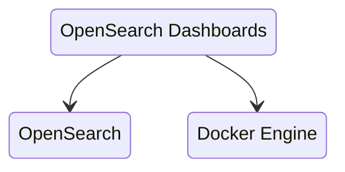
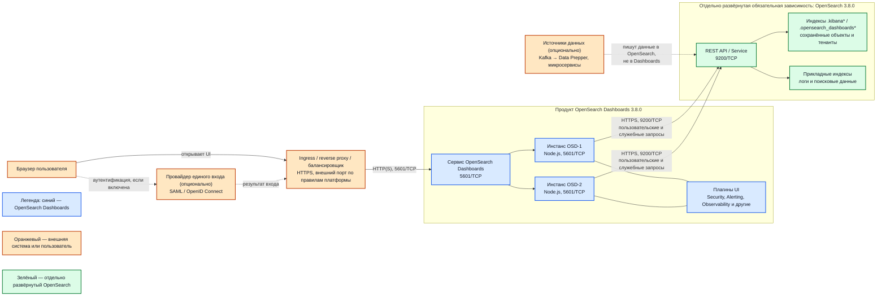

# OpenSearch Dashboards 3.8.0 — развёртывание и настройка

OpenSearch Dashboards — веб-интерфейс к кластеру OpenSearch: Discover, визуализации, дашборды, часть админки прав доступа. Этот документ про **свою установку** версии **3.8.0** (тот же релиз, что кластер OpenSearch 3.8.0 от 4 августа 2026). Кластер поиска живёт без UI; UI без живого кластера бесполезен. Документ по кластеру: `OpenSearch.md`. Здесь — только слой Dashboards.

Документация: https://docs.opensearch.org/latest/install-and-configure/install-dashboards/  
Образ: `opensearchproject/opensearch-dashboards:3.8.0`.  
На Kubernetes официальные пути: секция `spec.dashboards` в **OpenSearch Kubernetes Operator** и отдельно Helm-чарт `opensearch/opensearch-dashboards` (appVersion 3.8.0, репозиторий `https://opensearch-project.github.io/helm-charts/`). Для боя целевой путь — **оператор вместе с кластером OpenSearch**; Helm-чарт — запасной, более «ручной».

Это **другое ПО**, чем OpenSearch: процесс на Node.js, порт **5601**, прокси к REST 9200. Картинки и сохранённые объекты живут **в индексах кластера**, не на диске пода.

Этот текст — не набор команд «скопируй конфиг и запусти», а правила, без которых экземпляр не будет одновременно устойчивым к сбоям, масштабируемым и безопасным. Пошаговая установка — в `OpenSearch Dashboards.install.md`.

---

## Назначение системы

Dashboards нужен, чтобы **люди в браузере** смотрели логи и поисковую проекцию: Discover, дашборды, часть эксплуатации (политика жизни индексов, алерты плагинов). Кластер даёт API 9200; люди так не работают.

Падение Dashboards = «не видим картинки». Поиск по API и запись документов при этом могут быть живы. «Поиск 99.9%» ≠ «картинка в браузере 99.9%».

Система **не** хранит эталон клиентских карточек, **не** заменяет Grafana и Prometheus, **не** является SIEM (Wazuh — отдельный UI и отдельный кластер) и **не** ускоряет индексацию из Kafka. Без живого OpenSearch это красный экран.

---

## Перечень функций

Что умеет self-hosted OpenSearch Dashboards:

1. **Показывать Discover, визуализации и дашборды** в браузере по данным кластера OpenSearch.
2. **Хранить нарисованное** (шаблоны индексов, визуализации, дашборды, сохранённые поиски) в индексах кластера `.kibana*` / `.opensearch_dashboards*`, не на диске пода. Имя индекса должно совпасть с настройкой Security plugin (`index: '.kibana'` по умолчанию).
3. **Делить сохранённые объекты по тенантам** («папкам»): общий, личный на пользователя, именованные. Security plugin для каждого тенанта плодит **отдельный** индекс вида `.kibana_<hash>_<имя>`.
4. **Ходить в OpenSearch служебным пользователем** процесса (в учебнике — `kibanaserver`, роль `kibana_server`) — это **не** учётка аналитика. Если имя пользователя не `kibanaserver`, его **надо явно** привязать к роли.
5. **Показывать админку Security plugin**: логин, роли, тенанты, cookie-сессия. Без плагина Security в дистрибутиве ключи вроде `opensearch_security.cookie.secure` **не существуют**, процесс падает. В стандартном дистрибутиве плагин есть.
6. **Держать сессию в cookie** браузера (имя по умолчанию `security_authentication`). Отдельной базы сессий и Redis **нет**. Любая реплика примет cookie, **если** у всех одинаковый секрет шифрования cookie.
7. **Подключать единый вход** (SAML / OpenID Connect): настройка и в конфиге Security на кластере, и в конфиге Dashboards. На экране логина можно несколько кнопок; если типов больше одного — обычный пароль **обязан** быть в списке. Обход авторедиректа для админа: `?auto_login=false`.
8. **Проксировать запросы пользователя** на 9200 от его имени плюс служебные запросы процесса.
9. **Смотреть несколько источников** (фича выключена по умолчанию): тогда в UI можно добавить другие кластеры. Список адресов `opensearch.hosts` без этой фичи — ноды **одного и того же** кластера (запас, если одна не отвечает), не «два разных кластера в одном UI». Timeline-визуализации с несколькими источниками **не** поддерживаются.
10. **Шифровать канал** браузер ↔ UI (порт 5601) и UI ↔ OpenSearch (9200). По умолчанию для простоты старта UI слушает **HTTP**.
11. **Жить за reverse-proxy на подпути** (`/logs`): `server.basePath`; у оператора поле `basePath` само включает переписывание пути. Ingress должен совпадать.

Чего система **не** делает и часто путает: она не хранит логи и шарды (это OpenSearch), не озеро эталона, не Grafana, не кластерная сессионная база. Бэкап дашбордов = снимок индексов `.kibana*` **внутри OpenSearch**. Удалили индекс / нет снимка — визуализации нет, даже если поды UI живы. Порога «N одновременных аналитиков» в документации нет.

Браузеры, которые вендор **заявляет**: Chrome, Firefox, Safari, Edge (Chromium). Internet Explorer и Microsoft Edge Legacy — **нет**.

---

## Основные элементы системы и зависимости

OpenSearch Dashboards — отдельный продуктовый слой из взаимозаменяемых процессов UI. **OpenSearch не входит в OpenSearch Dashboards:** это отдельно развёрнутая обязательная зависимость. Ingress, провайдер единого входа и источники данных также разворачиваются отдельно; при этом единый вход, Ingress и показанные источники данных зависят от выбранной архитектуры и не становятся обязательными только из-за присутствия на схеме.

### Схема инстансов и потоков

### Что входит в состав

| Элемент состава | Назначение | Масштабирование и состояние |
|---|---|---|
| **Сервис и процессы OpenSearch Dashboards** | Веб-интерфейс и проксирование пользовательских и служебных запросов в OpenSearch | Процессы масштабируются горизонтально как реплики Deployment. Поисковые данные на их диске не хранятся |
| **Плагины UI** | Экраны Security, политики жизни индексов, Alerting, Observability и других функций кластера | Версия плагина должна совпадать с версиями UI и OpenSearch на уровне `major.minor.patch` |
| **Пользователь процесса** | Служебное обслуживание индексов UI | Это учётная запись в OpenSearch с ролью `kibana_server`; пароль хранится в Secret, а не в Git |

Индексы `.kibana*` / `.opensearch_dashboards*` и Security plugin нужны для работы UI, но являются частями **отдельного OpenSearch**, а не составными частями развёртывания Dashboards.

### Порты

| Порт | Назначение | Кому открывать |
|---|---|---|
| **5601/TCP** | UI и API самого Dashboards (браузер, иногда автоматизация сохранённых объектов) | Только внутренняя сеть / прокси единого входа. Не мир |
| **9200/TCP** | Не слушает Dashboards. Это **исходящие** запросы UI → OpenSearch | С подов UI на coordinating/ingest. Не этот процесс |

UDP нет. Порт **9600** — Performance Analyzer **ноды OpenSearch**, не Dashboards.  
Helm-чарт дополнительно описывает `metricsPort: 9601` и съём метрик на `/_prometheus/metrics` — это **опция чарта**, не строка обязательных портов в гайде установки UI. В бою включать только если реально подняли экспорт и ограничили, кто скрейпит.

### Описание блоков схемы

#### Браузер пользователя

- **Сущность:** клиентское приложение на рабочем месте человека.
- **Технологии и варианты:** заявлены Chrome, Firefox, Safari и Edge на Chromium; Internet Explorer и Edge Legacy не поддерживаются.
- **Назначение:** открыть Discover, визуализации, дашборды и доступные пользователю административные экраны.
- **Развёртывание:** не часть продукта и не серверный компонент; устанавливается отдельно на рабочем месте.

#### Провайдер единого входа

- **Сущность:** внешняя система идентификации, или IdP.
- **Технологии и варианты:** SAML либо OpenID Connect; интеграция **опциональна**. При нескольких способах входа обычный пароль должен оставаться одним из вариантов.
- **Назначение:** проверить личность человека и передать результат аутентификации в контур Dashboards и Security plugin.
- **Развёртывание:** отдельная внешняя система, не часть OpenSearch Dashboards.

#### Ingress, reverse proxy или балансировщик

- **Сущность:** внешняя точка входа перед репликами UI.
- **Технологии и варианты:** Kubernetes Ingress, HAProxy или иной reverse proxy / балансировщик; конкретный вариант задаёт платформа.
- **Назначение:** завершить HTTPS при выбранной схеме TLS, дать единый адрес и распределить запросы между инстансами Dashboards.
- **Развёртывание:** отдельный компонент окружения, не часть OpenSearch Dashboards. В простой изолированной установке прямой доступ к 5601 возможен, поэтому этот блок не является безусловно обязательным.

#### Сервис OpenSearch Dashboards

- **Сущность:** стабильная сетевая точка перед процессами UI.
- **Технологии и варианты:** Kubernetes Service при запуске в Kubernetes; адрес контейнера или иной балансировщик при других способах установки.
- **Назначение:** принять трафик на **5601/TCP** и направить его на доступный инстанс OSD.
- **Развёртывание:** часть развёртывания продукта OpenSearch Dashboards.

#### Инстансы OSD-1 и OSD-2

- **Сущность:** взаимозаменяемые процессы OpenSearch Dashboards 3.8.0.
- **Технологии и варианты:** процесс на Node.js; контейнер `opensearchproject/opensearch-dashboards:3.8.0`, поды Kubernetes через оператор либо Helm-чарт.
- **Назначение:** отдать веб-интерфейс, принять действия пользователя и проксировать запросы к OpenSearch. Сессия хранится в cookie браузера; отдельная сессионная база и Redis не требуются.
- **Развёртывание:** ядро продукта OpenSearch Dashboards. Число инстансов зависит от требуемой доступности и нагрузки; два блока показывают многорепличный вариант, а не обязательность ровно двух процессов во всех средах.

#### Плагины UI

- **Сущность:** серверные и клиентские расширения OpenSearch Dashboards.
- **Технологии и варианты:** Security, Alerting, Observability, управление политиками жизни индексов и другие совместимые плагины.
- **Назначение:** предоставить экраны поверх соответствующих возможностей OpenSearch.
- **Развёртывание:** часть установленного экземпляра Dashboards; доступность конкретных экранов зависит от состава и настройки плагинов. Их версия должна совпадать с версиями Dashboards и OpenSearch на уровне `major.minor.patch`.

#### REST API / Service OpenSearch

- **Сущность:** сетевая точка отдельно развёрнутого кластера OpenSearch 3.8.0.
- **Технологии и варианты:** HTTPS REST API на **9200/TCP**, обычно через Service перед coordinating/ingest-узлами. `opensearch.hosts` перечисляет узлы одного кластера; подключение нескольких источников — отдельная, выключенная по умолчанию функция.
- **Назначение:** принять пользовательские поисковые запросы и служебные запросы процесса Dashboards.
- **Развёртывание:** **отдельно развёрнутая обязательная зависимость**, не часть OpenSearch Dashboards.

#### Индексы `.kibana*` / `.opensearch_dashboards*`

- **Сущность:** системные индексы внутри OpenSearch.
- **Технологии и варианты:** базовый индекс и отдельные индексы тенантов вида `.kibana_<hash>_<имя>`; точное имя согласуется с настройкой Security plugin.
- **Назначение:** хранить шаблоны индексов, визуализации, дашборды, сохранённые поиски и разделение объектов по тенантам.
- **Развёртывание:** часть данных отдельно развёрнутого OpenSearch, не часть файловой системы инстанса Dashboards.

#### Прикладные индексы

- **Сущность:** индексы OpenSearch с логами и поисковыми данными приложений.
- **Технологии и варианты:** структура и жизненный цикл зависят от источников и модели данных платформы.
- **Назначение:** предоставить данные, которые человек исследует через Discover, визуализации и дашборды.
- **Развёртывание:** находятся в отдельно развёрнутом OpenSearch; не входят в OpenSearch Dashboards.

#### Источники данных

- **Сущность:** внешние поставщики документов.
- **Технологии и варианты:** Kafka через Data Prepper, микросервисы либо другие клиенты OpenSearch; все показанные варианты **опциональны** и зависят от архитектуры платформы.
- **Назначение:** писать прикладные данные непосредственно в OpenSearch. Они не отправляют документы в Dashboards.
- **Развёртывание:** отдельные внешние системы, не часть OpenSearch Dashboards.

### Как читать схему

1. Цвет показывает границу ответственности. Синие блоки разворачиваются как OpenSearch Dashboards. Зелёные блоки принадлежат обязательному, но отдельно развёрнутому OpenSearch. Оранжевые блоки находятся вне обоих продуктов; пунктир означает опциональный либо логический интеграционный поток.
2. Пользователь открывает адрес UI в браузере. В показанном варианте запрос сначала приходит на Ingress / reverse proxy, затем на сервис **5601/TCP**, который выбирает доступный инстанс OSD.
3. Если включён единый вход, браузер участвует в обмене с IdP по SAML или OpenID Connect. Эта интеграция не обязательна для самого запуска Dashboards. Её настраивают согласованно в Dashboards и Security plugin OpenSearch.
4. После входа сессия хранится в cookie браузера. Инстансы OSD взаимозаменяемы, если используют один секрет шифрования cookie; постоянного диска с поисковыми данными у них нет.
5. Выбранный инстанс обращается по HTTPS к **9200/TCP** отдельно развёрнутого OpenSearch. По этому пути идут запросы от имени пользователя и служебные запросы учётной записи процесса.
6. Нарисованные объекты сохраняются в `.kibana*` / `.opensearch_dashboards*` внутри OpenSearch. Поэтому удаление пода Dashboards не удаляет дашборды, а потеря соответствующего индекса без снимка удаляет сохранённые объекты.
7. Discover и визуализации читают прикладные индексы через API OpenSearch. Dashboards не хранит логи, шарды или эталонные карточки и не является промежуточным приёмником данных.
8. Опциональные Kafka, Data Prepper и микросервисы пишут в OpenSearch напрямую. На схеме они нужны для разграничения потоков: поток записи данных не проходит через порт 5601.
9. Стрелка к 9200 не означает, что Dashboards владеет кластером. Доступность поиска, копии индексов и снимки проектируются в OpenSearch отдельно от доступности UI.

---

## Краткие вводные

### Как устроена отказоустойчивость

Dashboards **не выбирает руководителя голосованием**. Отказоустойчивость — это «несколько одинаковых процессов + общие сохранённые объекты в OpenSearch + одинаковый секрет cookie».

| Что падает | Что происходит |
|---|---|
| Один под UI из двух или больше за балансировщиком | Балансировщик уводит трафик. Сессия в cookie — пользователь не обязан перелогиниваться, **если** секрет cookie одинаковый |
| Единственный под UI | Нет интерфейса. Кластер OpenSearch может быть green |
| Все поды UI в одной зоне, зона умерла | Нет интерфейса, даже если кластер в других площадках жив |
| OpenSearch yellow/red, нет главного шарда `.kibana` | UI не отрисует сохранённые объекты / не стартанёт нормально |
| OpenSearch недоступен с подов UI (сеть 9200) | UI «красный», люди думают «упал поиск», хотя data-ноды живы |
| Сменили секрет cookie на части реплик | Часть подов не принимает чужие cookie → «то логинит, то выкидывает» |
| Helm с выкатом «убить все, потом новые» | На время выката **ноль** подов — простой UI гарантирован чартом |
| Нет снимка `.kibana*` | После удаления индекса или гибели всех копий визуализации нет |

Три дата-центра **сами по себе** UI не спасают. Спасает раскладка реплик по машинам **и** то, что 9200 с этих реплик всё ещё достаёт кластер. Реплики UI в чужой площадке без живого 9200 дают ложное чувство устойчивости.

### Как устроено масштабирование

Две разные оси (их путают):

1. **Больше одновременных людей / вкладок** → больше **реплик UI** (и CPU/RAM каждой). Это горизонталь экрана.
2. **Тяжелее Discover / агрегации / больше данных** → это **data и coordinating OpenSearch**, не «добавь пятый Dashboards». UI только проксирует запрос.

HPA включать только после появления профиля: иначе реплики вырастут из-за тяжёлой агрегации, которую надо лечить шардами OpenSearch.

### Безопасность самого Dashboards

UI видит то же, что видит пользователь через Security plugin: логи интеграций, клиентский поиск, карты индексов. Украденная сессия `admin` или учебный пароль пользователя процесса = работа от чужого имени в UI.

Опасные значения «из коробки / из примера»:

| Что | Как в примере | Почему опасно |
|---|---|---|
| TLS на 5601 | HTTP, `server.ssl.enabled: false` | Старт «для простоты» |
| Проверка сертификата кластера | `verificationMode: none` в docker-гайде | Для самоподписанных на стенде; в бою запрещён |
| Секрет cookie | дефолт `security_cookie_default_password` (ровно 32 символа, общеизвестен) | Кто знает дефолт — может подделать сессию |
| Флаг «cookie только по HTTPS» | дефолт плагина **false** | Документация TLS: если включили HTTPS у UI — ставить **true** |
| Пароль пользователя процесса | demo `kibanaserver` / `kibanaserver` в docker-гайде | Первый же вход в админку индексов |
| Анонимный вход | `auth.anonymous_auth_enabled` дефолт false | Включить в бою = публичное чтение того, что разрешите роли anonymous |
| Срок сессии | `session.ttl` / `cookie.ttl` дефолт **3600000** мс (1 час); `session.keepalive` дефолт true | Продлевается при активности — это штатно, не «забыли таймаут» |

Оператор, если секрет не дали, **генерирует случайный** пароль пользователя процесса в `<cluster>-dashboards-password` — это лучше demo, но Secret всё равно надо ротировать и не светить в логи.

Для API 9200 без браузера вендор по SAML рекомендует **ещё один** способ входа (internal / LDAP / basic), иначе автоматизация разъедется с людьми.

Доверять заголовкам с reverse-proxy (человек уже аутентифицирован снаружи) можно только если 5601 **недоступен** в обход proxy. Иначе заголовки можно подделать.

Публичный 5601 без единого входа и без сети = инцидент, не «витрина для руководства». Штатный TLS — Node.js/JDK, не отдельная криптография по требованиям КИИ.

---

## Глоссарий

- **Alerting** — функция создания правил, которые проверяют данные и формируют уведомления при выполнении условий.
- **API** — программный интерфейс, через который одна система отправляет другой запросы без работы человека в графическом интерфейсе.
- **Base path (`server.basePath`)** — префикс URL, по которому Dashboards публикуется за reverse proxy, например `/logs`.
- **Basic-аутентификация** — способ входа, при котором клиент передаёт имя пользователя и пароль в HTTP-заголовке.
- **Cookie** — небольшое значение, которое браузер хранит и прикладывает к запросам для продолжения пользовательской сессии.
- **Coordinating-узел** — роль узла OpenSearch, принимающая запрос, распределяющая работу по data-узлам и собирающая ответ.
- **Data Prepper** — отдельный инструмент обработки и доставки событий в OpenSearch.
- **Data-узел** — узел OpenSearch, который хранит шарды и выполняет операции над их данными.
- **Deployment** — объект Kubernetes, который поддерживает заданное число одинаковых подов приложения.
- **Discover** — экран Dashboards для поиска, фильтрации и просмотра отдельных документов OpenSearch.
- **Git** — система версионирования файлов; секреты в её репозиторий помещать нельзя.
- **Grafana** — отдельный продукт для визуализации и мониторинга; OpenSearch Dashboards его не заменяет.
- **HAProxy** — один из вариантов внешнего reverse proxy и балансировщика.
- **Helm и Helm-чарт** — менеджер пакетов Kubernetes и пакет шаблонов, описывающий развёртывание приложения.
- **HPA (Horizontal Pod Autoscaler)** — механизм Kubernetes, автоматически изменяющий число подов по метрикам.
- **HTTP** — протокол запросов веб-клиента к серверу; без TLS содержимое канала не шифруется.
- **IdP (Identity Provider)** — отдельная система, которая проверяет личность пользователя для единого входа.
- **Ingress** — объект и контроллер Kubernetes, публикующие HTTP(S)-маршруты к сервисам кластера.
- **Ingest-узел** — роль узла OpenSearch, выполняющая конвейеры преобразования документов перед индексированием.
- **JDK** — набор Java-инструментов и среды выполнения, используемый компонентами OpenSearch.
- **Kafka** — отдельная распределённая платформа событий; сама по себе не является частью Dashboards.
- **Kubernetes** — оркестратор, который запускает контейнеры, поддерживает их число и предоставляет им сеть.
- **LDAP** — протокол доступа к каталогу пользователей, который может быть отдельным способом аутентификации.
- **Major/minor/patch** — три части номера версии вида `3.8.0`: несовместимый выпуск, функциональный выпуск и исправление.
- **Metrics port** — дополнительный сетевой порт, через который компонент может отдавать числовые показатели мониторинга.
- **Node.js** — среда выполнения JavaScript, в которой работает серверный процесс Dashboards.
- **Observability** — набор экранов и функций для анализа логов, метрик и трассировок.
- **OpenID Connect (OIDC)** — протокол аутентификации поверх OAuth 2.0, применяемый для единого входа.
- **OpenSearch** — отдельно развёрнутый поисковый движок и хранилище индексов, обязательная зависимость Dashboards.
- **OpenSearch Dashboards (OSD)** — веб-приложение для исследования и визуализации данных OpenSearch.
- **OpenSearch Kubernetes Operator** — контроллер Kubernetes, который создаёт и сопровождает ресурсы OpenSearch и Dashboards по декларативному описанию.
- **Performance Analyzer** — компонент мониторинга производительности узлов OpenSearch; его порт 9600 не принадлежит Dashboards.
- **Prometheus** — отдельная система сбора и хранения метрик.
- **Redis** — отдельное хранилище данных в памяти; для сессий Dashboards штатно не требуется.
- **Reverse proxy** — промежуточный сервер, принимающий запрос пользователя и передающий его внутреннему приложению.
- **REST API** — API, доступный по HTTP(S); OpenSearch принимает такие запросы обычно на 9200/TCP.
- **SAML** — протокол обмена утверждениями об аутентификации между приложением и IdP.
- **Secret** — объект Kubernetes для передачи приложению чувствительных значений, например пароля или ключа.
- **Security plugin** — плагин OpenSearch и Dashboards, который реализует аутентификацию, авторизацию, роли и тенанты.
- **Service** — в Kubernetes стабильный сетевой адрес перед одним или несколькими подами.
- **Shard (шард)** — часть индекса OpenSearch, распределяемая между узлами кластера.
- **SIEM** — класс систем для сбора и анализа событий информационной безопасности; Dashboards сам по себе SIEM не является.
- **Self-hosted** — вариант, при котором организация сама разворачивает и сопровождает программное обеспечение.
- **Timeline-визуализация** — представление событий на временной шкале.
- **TCP** — транспортный сетевой протокол, на котором работают порты 5601 и 9200.
- **TLS / HTTPS** — шифрование сетевого соединения; HTTPS означает HTTP поверх TLS.
- **UDP** — транспортный сетевой протокол без установления соединения; Dashboards не требует UDP-портов.
- **UI** — пользовательский интерфейс, в данном документе веб-экраны Dashboards.
- **URL** — адрес сетевого ресурса, который браузер или приложение использует для обращения к нему.
- **V8** — JavaScript-движок внутри Node.js; его куча ограничивает память, доступную процессу.
- **WAF** — внешний межсетевой экран для фильтрации веб-запросов.
- **Wazuh** — отдельная платформа безопасности со своим dashboard и поисковым контуром.
- **Балансировщик** — компонент, распределяющий запросы между несколькими доступными инстансами.
- **Визуализация** — сохранённое графическое представление данных и результатов агрегации.
- **Дашборд** — экран, объединяющий несколько визуализаций, фильтров и элементов управления.
- **Единый вход** — схема, при которой пользователь проходит аутентификацию в IdP и получает доступ к связанным приложениям.
- **Инстанс** — отдельно запущенный процесс приложения; два инстанса Dashboards выполняют одну и ту же роль.
- **Индекс** — логическая коллекция документов в OpenSearch.
- **Контейнер** — изолированный процесс приложения, запущенный из подготовленного образа с зависимостями.
- **Образ контейнера** — упакованная программа и её зависимости, из которых запускается контейнер.
- **Плагин** — устанавливаемое расширение, добавляющее функции или экраны.
- **Под** — минимальная единица запуска приложения в Kubernetes, содержащая один или несколько контейнеров.
- **Порт** — номер сетевой точки приложения на сервере, например 5601 или 9200.
- **Пользователь процесса** — служебная учётная запись, от имени которой Dashboards обслуживает свои системные индексы.
- **Реплика UI** — ещё один взаимозаменяемый инстанс Dashboards.
- **Роль** — набор разрешений, назначаемый пользователю или служебной учётной записи.
- **Сессия** — период взаимодействия после входа, в течение которого приложение узнаёт пользователя по cookie.
- **Снимок** — резервная копия индексов OpenSearch для последующего восстановления.
- **Сохранённый объект** — созданный в UI шаблон индекса, поиск, визуализация или дашборд, записанный в системный индекс OpenSearch.
- **Скрейпинг метрик** — периодическое чтение системой мониторинга показателей с HTTP-адреса приложения.
- **Тенант** — логическое пространство, разделяющее сохранённые объекты между пользователями или командами.
- **Шаблон индекса** — правило OpenSearch, которое заранее задаёт настройки и схему полей для новых индексов.

---

## Источники (чтобы не принимать на веру)

- Установка, браузеры, Node.js 22 в 3.5+: https://docs.opensearch.org/latest/install-and-configure/install-dashboards/
- Docker, учебный yml, `kibanaserver`, `verificationMode: none`, HTTP 5601: https://docs.opensearch.org/latest/install-and-configure/install-dashboards/docker/
- TLS UI (`server.ssl.*`, `opensearch.ssl.*`, флаг cookie, срок сессии): https://docs.opensearch.org/latest/install-and-configure/install-dashboards/tls/
- Совместимость плагинов UI = версия OpenSearch: https://docs.opensearch.org/latest/install-and-configure/install-dashboards/plugins/
- Helm: https://docs.opensearch.org/latest/install-and-configure/install-dashboards/helm/  
  values (1 реплика, Recreate, 100m/512M, NODE_OPTIONS, метрики 9601): https://github.com/opensearch-project/helm-charts/blob/main/charts/opensearch-dashboards/values.yaml  
  README чарта (4–8 ГиБ available): https://github.com/opensearch-project/helm-charts/blob/main/charts/opensearch-dashboards/README.md
- Оператор, TLS, basePath, секреты: https://docs.opensearch.org/latest/install-and-configure/install-opensearch/operator/operator-dashboards-config/  
  пароль пользователя процесса: https://docs.opensearch.org/latest/install-and-configure/install-opensearch/operator/operator-security/
- Тенанты, `.kibana*`, роль `kibana_server`, снимок `.kibana*`: https://docs.opensearch.org/latest/security/multi-tenancy/multi-tenancy-config/
- Несколько способов входа на одном экране: https://docs.opensearch.org/latest/security/configuration/multi-auth/
- SAML + белый список XSRF: https://docs.opensearch.org/latest/security/authentication-backends/saml/
- OpenID Connect: https://docs.opensearch.org/latest/security/authentication-backends/openid-connect/
- Несколько источников (`data_source.enabled`, ограничения): https://docs.opensearch.org/latest/dashboards/management/multi-data-sources/
- Схема секрета cookie, дефолт и minLength 32 (исходник плагина): https://github.com/opensearch-project/security-dashboards-plugin/blob/main/server/index.ts
- `opensearch.hosts` = ноды **одного** кластера, не двух (разъяснение maintainer на форуме проекта): https://forum.opensearch.org/t/connecting-two-opensearch-instances-to-one-opensearch-dashboard/18154

Утверждения вида «N реплик хватит на терабайты» или «UI переживёт падение OpenSearch» в документации проекта **отсутствуют** — поэтому в этом файле их нет. Задержку на пути UI → 9200 надо измерить у себя. Дефолты Helm (512M, Recreate, 1 реплика) **не** являются боевой нормой, даже если чарт официальный.
