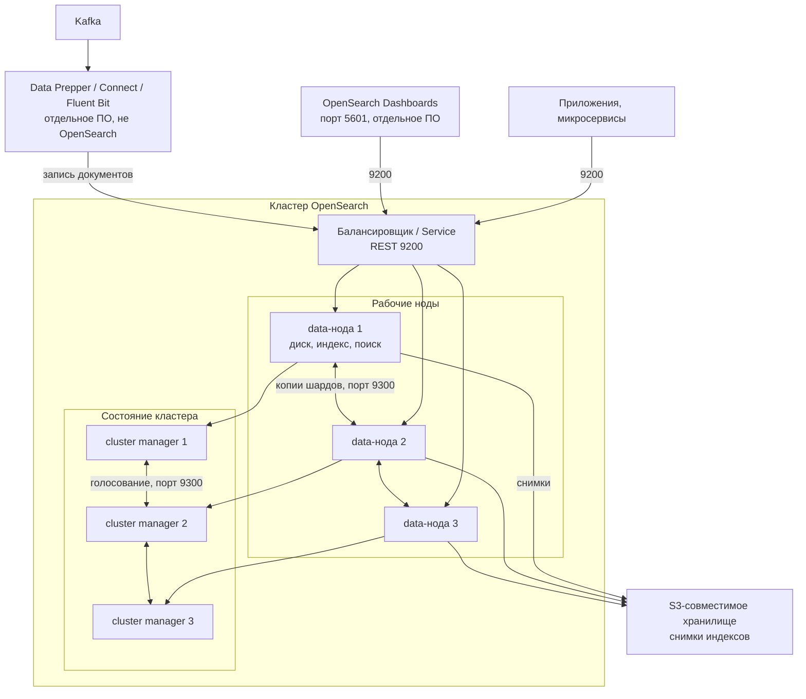

# OpenSearch 3.8.0 — развёртывание и настройка

OpenSearch — поисковый движок: хранит JSON-документы в индексах, ищет по тексту и фильтрам, считает агрегации. Этот документ про **свою установку** версии **3.8.0** (релиз 4 августа 2026, на дату подготовки — последний стабильный релиз линии 3.x). Это не облако Amazon OpenSearch Service и не тот же кластер, что Wazuh indexer: там другие манифесты и лимиты, их сюда копировать нельзя.

Документация: https://docs.opensearch.org/latest/  
Образы: `opensearchproject/opensearch:3.8.0`, `opensearchproject/opensearch-dashboards:3.8.0`.  
На Kubernetes официальные пути: **OpenSearch Kubernetes Operator** (Helm-репозиторий `https://opensearch-project.github.io/opensearch-k8s-operator/`) и отдельно Helm-чарты проекта (`opensearch` / `opensearch-dashboards`, appVersion 3.8.0). Для боя в Kubernetes целевой путь — оператор: rolling upgrade, TLS, расширение томов. Helm-чарты — запасной, более «ручной» путь.

Этот текст — не набор команд «скопируй и запусти», а правила, без которых экземпляр не будет одновременно устойчивым к сбоям, масштабируемым и безопасным. Пошаговая установка — в `OpenSearch.install.md`.

---

## Назначение системы

OpenSearch нужен, чтобы **находить и разбирать большие объёмы уже подготовленных документов**: логи сервисов, поисковая копия справочников и клиентов (по ИНН, ФИО, адресу), аудит вызовов интеграционного API.

События приходят из Kafka. Эталон карточек живёт в озере. Процессы ведёт Camunda. Интеграционное API ходит наружу. OpenSearch — **поисковая проекция**: «найди», «покажи срезы по логам», а не «дай клиента по ИНН и поправь ФИО». Запись истины остаётся в озере или СУБД; сюда — поток изменений.

Система **не** хранит эталон клиентских карточек, **не** заменяет очередь событий (Kafka), **не** исполняет бизнес-процессы (Camunda) и **не** ходит в государственные сервисы. Для SIEM используйте отдельный кластер Wazuh indexer — склеивать его с бизнес-поиском значит смешать алерты безопасности и клиентский поиск в одних правах доступа.

---

## Перечень функций

Что умеет self-hosted OpenSearch OSS:

1. **Хранить и искать JSON-документы** в именованных индексах: полнотекст, фильтры, агрегации. Схема гибче, чем у таблицы SQL, это не транзакционная СУБД.
2. **Делить индекс на шарды** (куски на разных машинах) и держать **копии шарда** (replica), чтобы падение одной машины не дырявило индекс. Число главных шардов задаётся **при создании** индекса; потом только переиндексация в новый индекс. Число копий можно менять позже.
3. **Держать кластер из нескольких процессов** с ролями: cluster manager (ведёт «кто жив, какие индексы, где шарды»; раньше это называли master), data (диск, индексация, поиск), ingest (разбор документа до записи), coordinating (принять запрос, раздать по шардам, склеить ответ).
4. **Показывать здоровье кластера**: green — все главные шарды и копии на месте; yellow — главные есть, части копий нет (поиск ещё идёт); red — не хватает главного шарда, часть данных недоступна.
5. **Раскладывать копии по зонам** (дата-центрам): стараться не класть главный шард и копию в одну зону. Жёсткий вариант: копия **никогда** не селится в ту же зону; если зона умерла, кластер остаётся yellow и **не** перекладывает копии в живые зоны (чтобы не убить их диском).
6. **Отдавать REST** (порт 9200) и свой внутренний протокол между нодами (порт 9300). Клиентов направляют на ingest / coordinating / data. На cluster manager внешний трафик не посылают.
7. **Разграничивать доступ** встроенным Security plugin: TLS, пользователи, роли, аудит. В дистрибутиве он есть.
8. **Самой сжимать, переносить или удалять старые индексы** по правилу (Index State Management: через N дней). Без этого диск съедят «терабайты» сами.
9. **Делать снимок и восстанавливаться** во внешнее хранилище (S3-совместимое, общая файловая система, HDFS). Копии шардов это **не** заменяют: команду «удали индекс» копия повторит.
10. **Тянуть индекс с другого кластера** плагином копирования между кластерами: ведомый кластер **только читает**. Это уже два кластера, не один размазанный.
11. **Писать метрики ноды** плагином Performance Analyzer (порт 9600). Это не Prometheus из коробки.

Чего система **не** делает и часто путают: она не озеро эталона, не шина событий, не BPMN, не SIEM «из коробки», не замена снимка копиями шардов. Штатный TLS — обычный JDK, не отдельная криптография по требованиям государства, если информационная безопасность её выдвинет. Порога задержки сети между дата-центрами в документации **нет**.

---

## Требования к развёртыванию

### Требования к ПО

| Что | Что ставить | Комментарий |
|---|---|---|
| **Формат поставки** | Контейнеры Docker **или** поды Kubernetes | Официальные образы `opensearchproject/opensearch:3.8.0`. Для Kubernetes в этом документе — оператор, не «голый» Deployment с данными в `emptyDir`. Helm-чарты проекта — запасной путь. |
| **ОС** | Linux x86_64 или ARM64 | Это основной контур. Сборка под Windows есть, но **боевой OpenSearch на Windows-хосте в схеме с Kubernetes не предполагается.** |
| **Оркестратор боя** | Kubernetes (свой) | Оператор линейки 3.x (таблица проекта: operator **3.0.0+** → OpenSearch до *latest 3.x*). Чарты фиксировать **тегом релиза**, не `latest`. Перед боем прогнать именно **3.8.0** на стенде: отдельного отчёта «оператор X сертифицирован под 3.8.0» нет. |
| **Java** | В комплекте Linux-дистрибутива — Adoptium JDK в каталоге `jdk` | Для линии 3.6.1+: совместимы **21, 25, 26**; в бандле на момент таблицы вендора — **25.0.4+7**. Свой JDK — через `OPENSEARCH_JAVA_HOME` / `JAVA_HOME`. Документация приводит путь вида `.../opensearch-3.8.0/jdk`. |
| **Диск ноды** | Локальный SSD на хосте, обычная файловая система | **Не сетевая папка как каталог данных ноды** (задержка и ввод-вывод). Снимок — другое: он как раз внешний. В Kubernetes — отдельный том на каждую data- и manager-ноду, класс диска с предсказуемым IOPS, режим «том можно отдать только одному поду». |
| **Ядро Linux** | `vm.max_map_count ≥ 262144`; swap лучше выключить; `bootstrap.memory_lock=true` + `memlock` unlimited; `nofile ≥ 65536` | Даже в Docker значение `vm.max_map_count` ставится **на хосте**, иначе нода падает. Оператор часто ставит его init-контейнером; в ограниченном кластере решить явно. |
| **Снимок** | S3-совместимое хранилище, доступное всем нодам | Копии шардов снимок не заменяют. Репозиторий типа «файлы» требует путь, доступный **всем** нодам, не диск одной data-ноды. |
| **Сертификаты** | Корпоративный PKI для боя | Учебные самоподписанные сертификаты Security plugin — только стенд: они общеизвестны и для боя **небезопасны**. |

Часы на всех машинах лучше синхронизировать (NTP): без этого выборы руководителя кластера и сессии ведут себя непредсказуемо.

### Требования к ресурсам

Цифр «сколько ядер на ваши терабайты» у проекта **нет** — нагрузки в исходном запросе не было. Ниже то, что есть у вендора, не смета закупки.

| Роль | CPU | RAM | Диск |
|---|---|---|---|
| **Data-нода** | Растёт вместе с объёмом и поиском; точной формулы нет | Куча Java — примерно **половина RAM** машины или пода, `Xms = Xmx`. Остальная RAM — кэш файлов ОС (поиск читает сегменты с диска через mmap). Дефолт процесса **1g/1g**, если не задать. Процентные `-XX:MaxRAMPercentage` **перебиваются** этим дефолтом — вендор просит задавать `-Xms/-Xmx` явно. Пример RPM-гайда: хост **8 ГиБ** → куча **4g**. Лимит пода Kubernetes должен быть **выше** кучи, иначе не останется RAM на mmap | SSD. Объём ≈ данные × сжатие × (1 + число копий) × запас под слияние сегментов и снимок |
| **Cluster manager** | Почти не масштабируют «от числа поисков» | RAM под состояние кластера (много индексов и шардов = толстое состояние) | Небольшой относительно data |
| **Учебный один контейнер** | Минимальные | В примерах Docker — **512m–1g** кучи | Можно маленький том; на бою так нельзя |

Дополнительно:

- Дефолт OSS: **1 главный шард + 1 копия** на индекс. Это две копии, не три. «По копии в каждый из трёх дата-центров» = **2 копии** (итого 3 экземпляра шарда) и диск ×3 относительно «только главный».
- Слишком много мелких шардов ест кучу; слишком мало крупных — плохо распределяет нагрузку. Точной «обязательной» цифры гигабайт на шард в гайде установки **нет** — размер выбирают замером (`OpenSearch Benchmark`), не слайдом.
- Data-ноды в зонах добавляют **кратно числу зон** (для трёх площадок — пачками по 3), чтобы не получить перекос. Если весь кластер в одной площадке — разносить по разным машинам этой площадки.
- «Терабайты в озере» сами по себе OpenSearch не наполняют. Наполняет то, что вы **решите туда писать**.
- На тестовой песочнице без нагрузки боевой запас RAM можно не требовать. Этот «облегчённый» стенд **нельзя** переносить в бой как официальный минимум.

---

## Основные элементы системы и зависимости

Это одно ПО из **нескольких процессов**. Ниже — те, что живут отдельными инстансами, и как они вызывают друг друга.

### Схема инстансов и потоков



Как читать схему:

1. Клиенты (люди через Dashboards, сервисы, снимок) ходят на **9200**. На cluster manager и на внутренний порт **9300** клиентов не пускают. Балансировщик HTTP перед 9200 допустим. «Один виртуальный адрес на 9300 всех нод» ломает разговор нода↔нода.
2. **Data-нода** хранит шарды, индексирует и ищет. Несколько data-нод — это копии одного шарда (отказ машины) и/или разные шарды (больше объёма и параллелизма). Роль ingest (разбор JSON, grok, enrich до записи) и coordinating (склейка ответа) по умолчанию есть у каждой ноды; выделенные ingest/coordinating имеют смысл при тяжёлом пайплайне или тяжёлом поиске.
3. Ноды пересылают друг другу состояние кластера и куски индексов по **9300**. Для Security plugin TLS на этом слое **обязателен**. TLS на 9200 в настройках plugin **по умолчанию выключен** — в бою его включают явно.
4. **Cluster manager** (обычно **три** отдельных процесса, нечётное число) помнит, кто жив и где лежат шарды, и выбирается голосованием. Без большинства eligible-нод кластер **не выбирает** руководителя: создание индексов, размещение шардов, стабильная запись под вопросом. На них **не** кладут боевые индексы.
5. Поток из Kafka лучше вести через **отдельную** программу (Data Prepper, Kafka Connect, Fluent Bit). Это другое ПО со своей отказоустойчивостью. Упал пайплайн — OpenSearch хранит старое, новое не приходит. Буфер должен быть **в Kafka**.
6. Снимки уезжают во внешнее хранилище. Копия шарда спасает от падения **машины**, не от `DELETE index` и не от шифровальщика.
7. **OpenSearch Dashboards** — отдельный процесс (порт 5601), см. `OpenSearch Dashboards.md`. Падение UI ≠ падение кластера.

Рядом, но это уже другое ПО: Data Prepper, Fluent Bit / Vector / Kafka Connect, экспорт в Prometheus. Их отказ проектируется отдельно. Плагины ставятся на **все** ноды кластера одинаковым набором.

### Что входит в состав

| Компонент | Зачем | Как масштабируется |
|---|---|---|
| **Cluster manager** | Состояние кластера, выборы, размещение шардов | Вертикаль RAM/CPU; для отказа — **нечётное** число выделенных, типично **3**. Добавлять «ещё manager от нагрузки поиска» бессмысленно |
| **Data** | Хранение, индекс, поиск | Горизонтально: ноды + шарды. Диск и куча растут вместе с данными |
| **Ingest** | Препроцесс документов до записи | Отдельный пул, если пайплайн тяжёлый; иначе совмещают с data |
| **Coordinating** | Вход клиентов, склейка ответа | Выделенные при тяжёлом поиске; иначе хватает data-нод. Пустые роли `node.roles: []` — как раз выделенный coordinating |
| **Плагины** | Security (в комплекте), ISM, снимки, копирование между кластерами, Performance Analyzer | Одинаковый набор на всех нодах |
| **OpenSearch Dashboards** | Веб-интерфейс | Несколько реплик Deployment на тот же кластер; отдельный документ |

### Официальные порты (менять можно, это контракт сети)

| Порт | Назначение | Кому открывать |
|---|---|---|
| **9200/TCP** | REST API (приложения, Dashboards, утилита заливки конфига Security `securityadmin.sh`, снимки) | Клиенты и Dashboards. Не мир |
| **9300/TCP** | Внутренний протокол: нода↔нода и копирование между кластерами | Только ноды этого кластера (плюс ведомый кластер, если копируете индекс). Не мир. Не через «один VIP на все ноды» |
| **5601/TCP** | OpenSearch Dashboards | Внутренняя сеть / единый вход. Не этот процесс |
| **9600/TCP** | Performance Analyzer | Операторы / Prometheus, не мир |

UDP нет. Порт **443** в таблице вендора относится к *Amazon OpenSearch Service*, не к своей установке.

Утилита `securityadmin.sh` ходит на **HTTPS 9200**, нужен административный сертификат из списка `plugins.security.authcz.admin_dn`. Случайный «поправили roles.yml на одной ноде» **не** разъедется сам, если выключен `allow_default_init_securityindex`.

### Зависимости окружения (что ещё должно быть)

- Стабильный DNS или IP каждой ноды на **9300**; клиентам — до coordinating/ingest на **9200**.
- В Kubernetes том с режимом «один под — один диск» на каждую data- и manager-ноду. `emptyDir` как каталог данных = потеря индекса при рестарте (у оператора при `emptyDir` для upgrade прямо требуют `general.drainDataNodes: true`, иначе потеря данных).
- Идентификация: люди — SSO (SAML/OIDC через Dashboards + роли на бэкенде), не общая учётка `admin`. Сервисы — отдельные внутренние пользователи или JWT/mTLS, минимум прав на индексы.
- Список адресов, куда нода стучится при старте (`discovery.seed_hosts`), иначе мультинодовый кластер не соберётся. Для **первого** запуска — одинаковый на всех eligible список `cluster.initial_cluster_manager_nodes`. Ошибка здесь = два кластера с разными UUID.
- С версии **2.12** при учебном конфиге нужен свой пароль `admin` (`OPENSEARCH_INITIAL_ADMIN_PASSWORD`). Слабый пароль → процесс **не стартует**.

---

## Краткие вводные

### Как устроена отказоустойчивость

Это **большинство нод, которые могут стать руководителем**, плюс **копии шардов**. Три контейнера в docker-compose — это не отказоустойчивый кластер.

**1) Cluster manager**

| Что падает | Что происходит |
|---|---|
| Один выделенный manager из трёх | Остаётся двое, большинство есть, выбирается другой. Два «простаивают», пока все живы — так и задумано |
| Два manager из трёх | Большинства нет. Кластер не выбирает руководителя. Это **не** «переживём два дата-центра на трёх нодах» |
| Все eligible совмещены с data и стоят в одной площадке | Падение площадки = падение и голосования, и данных |

Официальная формулировка: три выделенных cluster manager в трёх разных зонах — правильный подход почти для любого боя. «Never loses quorum» здесь значит «при потере **одной** зоны из трёх», не «при потере двух».

**2) Данные (data-ноды + копии)**

| Что падает | Что происходит |
|---|---|
| Одна data-нода при числе копий ≥ 1 и копиях на разных узлах | Индекс ещё доступен (часто yellow, пока копия не восстановится) |
| Нода при **0 копий** | Дырка или red. На одном узле копию **некуда** положить — поэтому на одной ноде копии ставят 0 |
| Площадка, если копия жила в другой зоне | Данные живы. Без осведомлённости о зоне OpenSearch мог сложить обе копии в одну площадку — тогда площадка уносит индекс |
| Площадка при **жёстком** запрете класть копию в ту же зону | Копии в мёртвую зону не переезжают → yellow, оставшиеся зоны не забиваются чужими копиями. Это плата за стабильность диска |
| Нет снимка, погибли все копии шарда | Данных нет. Копия не бэкап |

**3) Dashboards**

Падение UI ≠ падение кластера. Один под Dashboards — точка отказа **просмотра**. API 9200 при этом может быть жив.

**4) Пайплайн перед кластером**

Data Prepper / Connect упал — OpenSearch хранит старое, новое не приходит. Буфер должен быть **в Kafka**, не «в надежде что Prepper не умрёт».

### Как устроено масштабирование

Несколько независимых осей (их нельзя путать):

1. **Больше объёма и поиска** → больше **data-нод** + разумный размер шарда. Главные шарды нельзя «добавить на лету».
2. **Больше индексирования** → больше data/ingest, пакетная запись (bulk), не мелкие одиночные POST.
3. **Больше одновременных тяжёлых запросов** → coordinating-ноды, чтобы агрегации не душили кучу data-нод.
4. **Cluster manager** почти не масштабируют «от числа поисков в секунду». Им нужна RAM под состояние кластера.

Сначала увеличивают CPU/RAM/диск существующих data-нод; новые ноды — когда одна машина уже мала. Индекс с огромным числом мелких шардов съест кучу раньше, чем «ещё одна нода поможет».

### Безопасность самого OpenSearch

Компрометация кластера с клиентским поиском или логами интеграций = компрометация персональных данных, ответов ведомств, карты сервисов. Учётка `admin` и учебные сертификаты равносильны ключу от всего индекса.

Опасные значения «из коробки / из примера»:

| Что | Как в примере | Почему опасно |
|---|---|---|
| Учебные сертификаты | `plugins.security.allow_unsafe_democertificates: true` | Документация: общеизвестны и для боя непригодны |
| Выключить Security plugin | `DISABLE_SECURITY_PLUGIN=true` в docker-примерах | Для лаборатории. В бою plugin включают |
| HTTP без TLS | `plugins.security.ssl.http.enabled` по умолчанию **false** | 9200 может остаться открытым HTTP, пока не включите сами |
| Dual-mode SSL | `plugins.security_config.ssl_dual_mode_enabled` | Только на время миграции, не как постоянный бой |
| Учебный конфиг в контейнере | demo, пока не задать `DISABLE_INSTALL_DEMO_CONFIG=true` | Привычка уедет в бой |

С 2.12 без `OPENSEARCH_INITIAL_ADMIN_PASSWORD` (или без своего Security config) контейнер с учебным конфигом **не встанет**. Transport TLS обязателен, если Security plugin работает.

«Поднять `docker compose` из гайда и выдать 5601 в интернет» — это новая поверхность атаки, не поисковая платформа. Штатный TLS — JDK, не отдельная криптография по требованиям КИИ, если информационная безопасность её выдвинет.

---

## Допущения

Ниже то, чего не было в исходном запросе, но без чего нельзя нарисовать конкретную схему. Если допущение неверно — схему надо пересмотреть.

1. Берём **свою установку OpenSearch 3.8.0**, не Amazon OpenSearch Service и не Wazuh indexer.
2. Бой крутится в Kubernetes, установщик — **OpenSearch Kubernetes Operator** линейки 3.x. Чарты фиксировать тегом релиза, не `latest`. Перед боем — прогон именно **3.8.0** на стенде.
3. Три дата-центра = три независимых отказа (питание, сеть). Три зала с общим питанием эту схему не спасают.
4. Один кластер, размазанный на три площадки, принимается **только если** сеть на порту 9300 достаточно быстрая и стабильная. Порога задержки у проекта **нет**. Пока её не измерили — это гипотеза. В инструкции установки живой кластер держат **в одной площадке**.
5. Цель отказа: пережить **1** дата-центр, не 2 из 3. Три cluster manager по одному на площадку это переживают; два мёртвых дата-центра — нет.
6. Нагрузки нет — поэтому **нет** цифры «N data-нод и M терабайт тома». Есть сигналы (куча, очередь, отказ в записи, yellow/red, порог диска, лаг ingest из Kafka) и рычаги (ноды, шарды, ISM, что писать).
7. Формального обещания «ни один лог не потерян, если Prepper отстал» нет. Green-кластер при живой копии ≠ юридический круглосуточный режим.
8. Корпоративные сертификаты есть или будут. Учебные — для теста.
9. Люди в бою входят через единый вход. Сервисы — отдельные учётки, минимум прав.
10. Шифрование канала — TLS JDK. Требования отдельной криптографии государством не озвучены; обычный OpenSearch их не закрывает.
11. Учебный стенд изолирован. На нём допустимы одна нода, учебные сертификаты и слабые лимиты. В бой их не копируем.
12. Kafka, Camunda, озеро, интеграционное API — источники и потребители, не часть этого ПО. Контракт: пакетная запись, повторяемый `_id` где нужно, схема полей, политика жизни индексов.
13. **Отдельный кластер от Wazuh indexer.** Смешивать алерты безопасности и бизнес-поиск в одном контуре прав — плохая идея, даже если «оба OpenSearch».
14. Лицензия Apache 2.0. Отдельного license-server нет. Следить нужно за составом плагинов (не все сторонние — Apache 2.0).

---

## Критически важные условия, которых нет в исходном контексте

Их нужно закрыть **до** «поставили оператор и забыли».

| Пробел | Почему это ломает решение |
|---|---|
| **Задержка и потери между дата-центрами** на порту 9300 (типичная, 95-й и 99-й процентиль, все пары) | Состояние кластера и копии шардов ходят по внутреннему протоколу. Высокая или плавающая задержка → медленные выборы, отложенное назначение шардов, ложные отказы нод, yellow. Размазанный кластер станет источником аварий |
| **Один Kubernetes на три площадки или три изолированных** | Размазанный кластер требует прямого под↔под (или host) на 9300. Иначе — один кластер в одном дата-центре + восстановление из снимка или копирование на второй кластер, не один экземпляр |
| **Что именно кладёте в OpenSearch** (логи? проекция клиентов? аудит интеграций? всё сразу?) | Разный размер шарда, число копий, политика жизни индексов, права и класс диска. «Терабайты» без состава — не смета |
| **Срок хранения и персональные данные** | Политика жизни индексов, шифрование томов, что можно класть в полнотекст, куда уезжает снимок |
| **Где живёт бакет снимков** | Если только в одном дата-центре — падение этой площадки убивает бэкап |
| **Профиль запросов** (индексация МБ/с vs тяжёлые агрегации vs векторный поиск 3.8) | Иначе купите data-ноды «под логи», а получите кучу на фасетах по клиентам |
| **Куда смотрит Dashboards** (только внутренняя сеть? единый вход?) | Публичный 5601 с учебным `admin` — инцидент |
| **Класс диска: локальный SSD vs сеть** | Вендор прямо против NFS как *диска ноды*. Медленный том = очередь индексации, отказ в записи, отставание от Kafka при «живом» кластере |
| **Совместимость оператора с 3.8.0 на вашей версии Kubernetes** | Таблица «latest 3.x» не заменяет проверку в вашем контуре |
| **Нужно ли копирование на второй кластер** или один кластер в одной площадке | Пока сеть не замерена, выбор «размазать 9300» — лотерея |

---

## Краткое описание ключевых этапов и элементов развертывания

Общий каркас (и тест, и бой):

1. Зафиксировать **OpenSearch 3.8.0** и **тот же** тег Dashboards. Не смешивать major. Оператор/Helm — совместимый релиз.
2. Выставить хостовые лимиты (`vm.max_map_count`, swap, `nofile`, memory lock) **до** первого пода.
3. Поднять ноды: сначала тройка cluster manager, затем data. Задать имя кластера, имя ноды, список seed-адресов, при первом старте — список `cluster.initial_cluster_manager_nodes`.
4. Выпустить **свои** сертификаты и пользователей **до** боевых клиентов. Не оставлять учебные.
5. Зарегистрировать **репозиторий снимков** и сделать первый снимок пустого/тестового индекса (проверка, что репозиторий вообще работает).
6. Задать **шаблоны индексов** (шарды, копии, mapping, refresh) и **политику жизни индексов до** боевого потока. Главные шарды потом дёшево не поменять.
7. Включить метрики: здоровье кластера, шарды, куча, отказы в записи, диск; лаг консьюмера Kafka, если он питает индекс.
8. Прогнать контролируемую запись и поиск. Убедиться, что документ **виден** и что падение одной data-ноды оставляет индекс читаемым.
9. Только потом — единый вход, тонкие права, hot-warm, векторные индексы 3.8, если они вообще нужны.

Боевая схема на несколько дата-центров, порядок включения и проверки — в `OpenSearch.install.md`. Ниже — только тестовый стенд.

---

### 1 инстанс: тестовый стенд, 1 площадка, без нагрузки

**Цель стенда:** чтобы разработчики писали и искали документы, отлаживали mapping, подключали Dashboards и пайплайн из Kafka. **Не** цель: доказать отказ дата-центра и ёмкость.

Два официальных минимальных пути (выберите один):

**Путь A — один контейнер** (быстрее понять продукт):

```text
docker run -d -p 9200:9200 -p 9600:9600 \
  -e "discovery.type=single-node" \
  -e "OPENSEARCH_INITIAL_ADMIN_PASSWORD=<strong-password>" \
  opensearchproject/opensearch:3.8.0
```

Проверка: `curl https://localhost:9200 -ku admin:"<strong-password>"`.  
`discovery.type=single-node` **обходит** нормальный поиск соседей — только разработка и тест.

**Путь B — docker compose из гайда установки** (2 ноды OpenSearch + Dashboards на bridge-сети). Вендор прямо пишет: примеры compose **не для боя**. Учебный конфиг (самоподписанные сертификаты, внутренние пользователи) ставится, если не задать `DISABLE_INSTALL_DEMO_CONFIG=true`.

На Kubernetes: один объект кластера с одним пулом нод, 1 реплика, маленький том; либо Helm `singleNode: true`. Этот YAML в бой не копировать.

#### Что сознательно упрощаем

| Параметр | На тесте | Почему можно |
|---|---|---|
| Число нод | 1 (или 2 в compose) | Нет требования пережить выкат |
| Копии шарда | 0 на одной ноде | Иначе вечный yellow: копию некуда положить |
| Роли | все в одном процессе | Выделенный manager на ноутбуке не учит продукт |
| Сертификаты | учебные / самоподписанные | Иначе команда утонет в PKI раньше, чем в mapping |
| Пароль | свой сильный `OPENSEARCH_INITIAL_ADMIN_PASSWORD`, сеть изолирована | С 2.12 без пароля учебный конфиг не встанет; в интернет всё равно не открываем |
| Security plugin | включён (как в образе) | Выключать имеет смысл только если сознательно тестируете «голое» API; привычка выключать уедет в бой |
| CPU / куча | 512m–1g как в примерах Docker | Не цель — ёмкость |
| Снимок | можно отложить на день | Нельзя «забыть навсегда» — на препроде репозиторий обязателен |
| Политика жизни индексов | минимум | Сначала увидеть реальный объём тестовых логов |

#### Чего на тесте **не** стоит упрощать

- Версия **3.8.0** на нодах и Dashboards.
- Клиентский код с явным индексом и `_id` (повтор той же пачки из Kafka не плодит документы).
- Понимание, что **главные шарды** задаются при создании. Поиграть с шаблоном на тесте дешевле, чем переиндексировать терабайты.
- Запомнить: compose с учебными сертификатами **не** есть «почти бой».

#### Сильные стороны такой схемы

- Поднимается за часы, совпадает с официальным Docker-гайдом.
- Дешево показывает mapping и шум запросов на *ваших* JSON из интеграций и Camunda.
- Одна нода официально предназначена для разработки и теста.

#### Слабые стороны (обязательно понимать)

- Нет модели отказа площадки, нет доказанной ёмкости, нет 9300 между площадками.
- Успешный поиск на одном узле **не** доказывает, что состояние кластера переживёт задержку сети и что копии разложатся по зонам.
- Учебные сертификаты и открытый 9200 приучают «зайти как admin».

Практическая рекомендация: препрод = маленькая **копия боевой топологии** (3 manager + data, свои сертификаты, копии ≥ 1, политика жизни индексов, снимок), даже без боевого трафика. Всё это **в одном** дата-центре.

---

## Сводка: что считать «экземпляр готов»

| Требование | Тест (1 площадка) | Бой |
|---|---|---|
| Отказоустойчивость | Не требуется | 3 выделенных cluster manager; data на разных машинах; копии ≥ 1; снимок с прогнанным восстановлением. Схема на 2–3 дата-центра — в `OpenSearch.install.md` |
| Производительность / масштаб | Не требуется | Шарды как единица масштаба; куча ~½ RAM, `Xms=Xmx`; SSD не NFS; политика жизни индексов; клиенты не на manager |
| Безопасность | Учебные сертификаты только в изоляции; свой admin-пароль | Нет учебных сертификатов; TLS на 9300 и 9200; права на индексы; 5601 не в интернет; секреты не в git; шифрование томов |

**Не готов к бою**, если: режим одной ноды в бою; 0 копий на нескольких нодах; учебные сертификаты; Security plugin выключен; данные на NFS или в `emptyDir`; все ноды в одной зоне без копий; нет снимка; задержку сети не мерили, а схему уже размазали на несколько площадок; кластер общий с Wazuh indexer; OpenSearch назначен эталоном клиентских данных.

---

## Источники (чтобы не принимать на веру)

- Релиз 3.8.0 (4 Aug 2026): https://docs.opensearch.org/latest/version-history/ и https://opensearch.org/artifacts/by-version/
- Установка, порты, Java, `vm.max_map_count`, куча ~½ RAM, `nofile`, не NFS для диска ноды: https://docs.opensearch.org/latest/install-and-configure/install-opensearch/
- Docker, одна нода, `OPENSEARCH_INITIAL_ADMIN_PASSWORD`, учебный compose не для боя: https://docs.opensearch.org/latest/install-and-configure/install-opensearch/docker/
- Роли нод, 3 manager в 3 зонах, осведомлённость о зоне, куда слать трафик: https://docs.opensearch.org/latest/tuning-your-cluster/
- Поиск соседей, `initial_cluster_manager_nodes`, режим одной ноды: https://docs.opensearch.org/latest/tuning-your-cluster/discovery-cluster-formation/
- Дефолты шардов и копий: https://docs.opensearch.org/latest/install-and-configure/configuring-opensearch/index-settings/
- Security, учебные сертификаты, HTTP TLS по умолчанию выкл: https://docs.opensearch.org/latest/security/configuration/ и https://docs.opensearch.org/latest/install-and-configure/configuring-opensearch/security-settings/
- Kubernetes Operator: https://docs.opensearch.org/latest/install-and-configure/install-opensearch/operator/ и https://github.com/opensearch-project/opensearch-k8s-operator
- Копирование между кластерами (ведомый только читает): https://docs.opensearch.org/latest/tuning-your-cluster/replication-plugin/
- Снимки: https://docs.opensearch.org/latest/tuning-your-cluster/availability-and-recovery/snapshots/snapshot-management/
- Data Prepper — отдельный компонент: https://docs.opensearch.org/latest/data-prepper/getting-started/
- `bootstrap.memory_lock`: https://docs.opensearch.org/latest/install-and-configure/configuring-opensearch/configuration-system/

Утверждения вида «OpenSearch переживёт два дата-центра» или «N миллисекунд — можно размазать кластер» в документации проекта **отсутствуют** — поэтому в этом файле их нет. Задержку на 9300 надо измерить у себя. Ориентиры размера шарда из блогов и из Amazon OpenSearch Service **не** подставлены сюда как нормы OSS 3.8.0.
