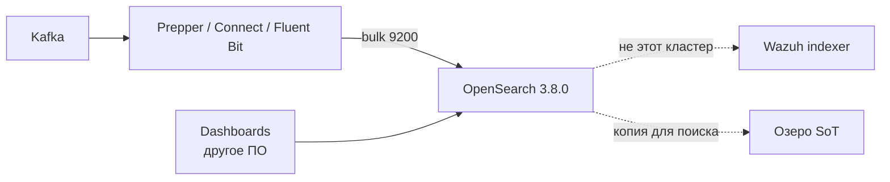
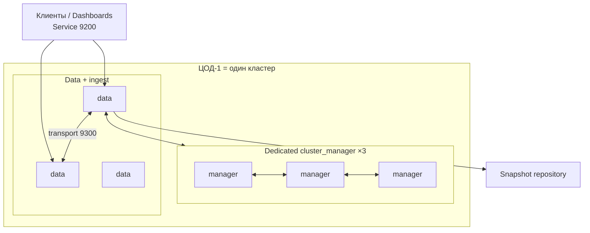
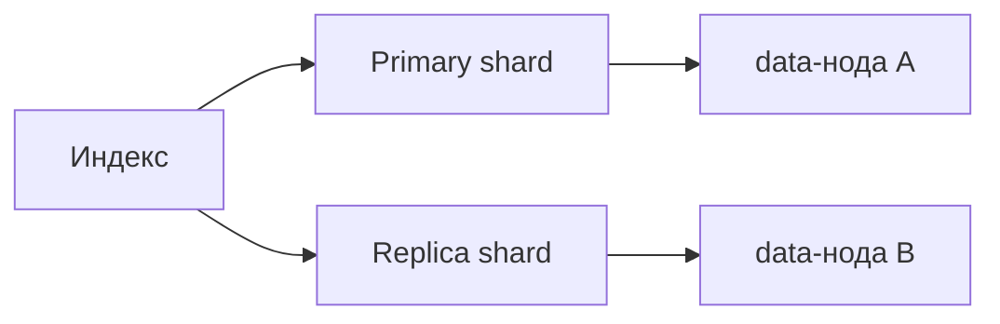
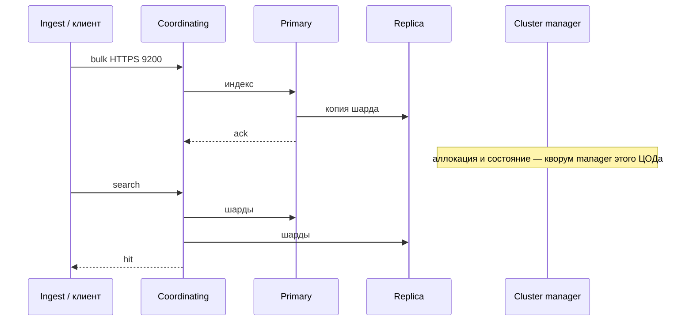
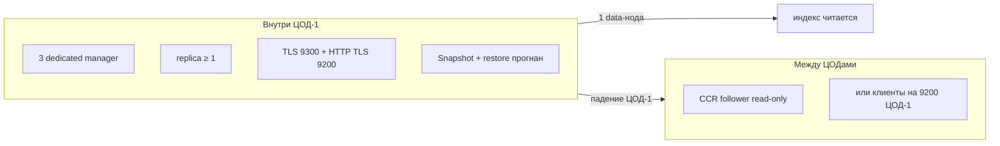
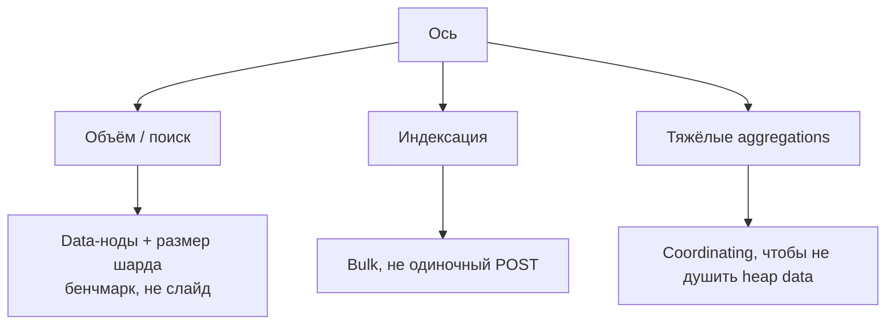
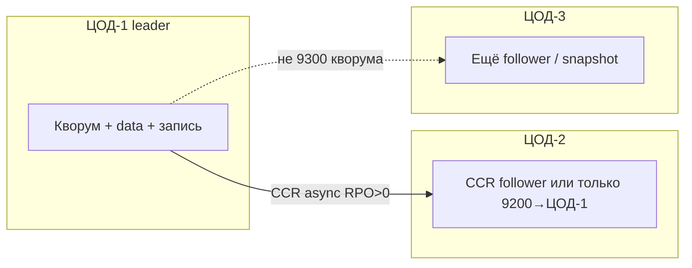

# OpenSearch 3.8.0 — схемы устройства

Связанные документы: правила — `OpenSearch.md`; установка — `OpenSearch.install.md`.

C4 / «D4»: контекст → контейнеры → компоненты. Код ingest-пайплайна не рисуем.

Допущения: stretch transport **9300** на 2–3 ЦОДа **нет**; self-hosted 3.8.0, **не** Amazon OpenSearch Service и **не** Wazuh indexer; нагрузка не замерена.

---

## 1. Контекст

OpenSearch — **поиск и документная аналитика**. Near-real-time, не ACID-карточка, не Kafka.

Склеить SIEM и клиентский поиск в одном Security realm — смешать роли. Буфер новых документов — **в Kafka**, не «Prepper не умрёт».

---

## 2. Контейнеры (кворум + data в одном ЦОДе)

«Три ноды в compose» ≠ HA. Кворум — **большинство cluster-manager-eligible**.

**9200** REST (клиенты). **9300** нода↔нода и CCR. На dedicated manager внешний трафик **не** посылают. LB HTTP перед 9200 допустим; VIP «на все 9300» ломает transport.

Диск ноды — SSD POSIX, **не NFS**. PVC RWO на каждую ноду, не `emptyDir`.

**Сильное:** 3 manager переживают падение **одной** ноды. **Слабое:** два manager из трёх мертвы — кластер не выбирает manager. «Never loses quorum» в доке = одна зона из трёх, не две.

---

## 3. Компоненты индекса

Primary задаётся **при создании**; потом только reindex. Дефолт OSS: **1 primary + 1 replica**. На single-node replica **0**, иначе вечный yellow. Replica **не** бэкап: `DELETE index` повторится.

ISM — горячий → delete/snapshot, иначе диск съедят «терабайты» сами. Куча ~**½ RAM**, `Xms = Xmx`; лимит пода **выше** кучи (Lucene mmap). `vm.max_map_count ≥ 262144`.

---

## 4. Поток: bulk и поиск

Green — все primary и replica на месте. Yellow — поиск ещё идёт без части replica. Red — нет primary.

---

## 5. Что настраивать: отказоустойчивость

| Ручка | Если забыть |
|---|---|
| `initial_cluster_manager_nodes` один раз | Два UUID = split при старте |
| Demo certs выкл | *well known and therefore unsafe* |
| `plugins.security.ssl.http.enabled: true` | Дефолт plugin **false** — 9200 HTTP |
| Snapshot вне ЦОД-1 | Бэкап умер вместе с кластером |

CCR: плагин на **обоих**; follower **не** становится writer сам. Security включён на обоих или выключен на обоих.

---

## 6. Что настраивать: масштабируемость

Manager почти не масштабируют «от QPS»: им RAM под cluster state (много мелких индексов = толстый state).

---

## 7. Прод: 2 или 3 ЦОДа без stretch

**Сильное:** cluster state не ходит по WAN. **Слабое:** падение ЦОД-1 = нет записи; без follower нет и поиска; промоушен CCR — runbook.

---

## 8. Безопасность (ручки на той же схеме)

С 2.12 без `OPENSEARCH_INITIAL_ADMIN_PASSWORD` demo-конфиг не стартует. `DISABLE_SECURITY_PLUGIN` — лаборатория. Transport TLS обязателен при Security plugin. Dual-mode SSL — только миграция. `enforce_hostname_verification: true`. В 3.8.0 дефолт snapshot SSE **AES256** — шлюз может отвергнуть, тогда явно `bucket_default`.

Источники: `OpenSearch.md`. Порога RTT на 9300 у проекта **нет**.
