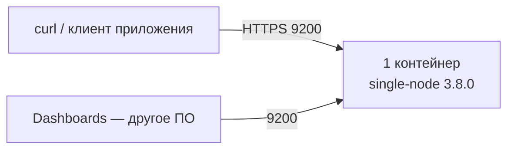

# OpenSearch 3.8.0 — установка (учебный контур)

OpenSearch — поисковый движок: JSON-документы в индексах, полнотекст, фильтры, агрегации. Ставите **свою** копию **3.8.0** (релиз 4 августа 2026), не облако Amazon OpenSearch Service и не кластер Wazuh indexer.

**Допущение:** закрытая сеть, одна машина, Docker. Это не бой: настройки и пароль сюда не копировать. Живой кластер **не** растягивать на 2–3 дата-центра: состояние и копии шардов ходят по порту **9300**; порога задержки (RTT) у вендора **нет**.

Официальный путь учёбы: Docker (программа, которая запускает **образ** — упакованную программу с зависимостями — как **контейнер**). Образ: `opensearchproject/opensearch:3.8.0`. Страница: https://docs.opensearch.org/latest/install-and-configure/install-opensearch/docker/  
Tarball — запасной путь без Docker: https://docs.opensearch.org/latest/install-and-configure/install-opensearch/tar/  
Не `latest` и не тег `:3`: гайд вендора их показывает, здесь пин **3.8.0**.

---

## Куда ставить и сколько ресурсов (учебный контур)

**Куда.** Одна Linux-машина **или** Docker Desktop (Windows: WSL). Порт **9200** (REST) только на `127.0.0.1`. Режим `discovery.type=single-node` (обход поиска соседей) — **только** учёба. Каталог данных контейнера — локальный том Docker, не NFS (NFS как диск ноды вендор не рекомендует даже в бою).



**Сколько.** Цифр «хватит N ядер под ваши терабайты» в мануале **нет**. Не путать минимум процесса со сметой боя.

| Зачем | CPU | RAM | Диск | Откуда |
|---|---|---|---|---|
| Docker Desktop, хост | — | **≥ 4 ГБ** памяти Docker | локальный | [Docker](https://docs.opensearch.org/latest/install-and-configure/install-opensearch/docker/) |
| Куча Java учебного контейнера | — | **512m–1g**, `Xms = Xmx` | том data | compose-пример на той же странице; куча ≈ **половина RAM**, дефолт процесса **1g** перебивает процентные флаги |
| Ядро Linux | — | `vm.max_map_count` **≥ 262144** | — | [Installing OpenSearch](https://docs.opensearch.org/latest/install-and-configure/install-opensearch/index/) — даже для Docker значение ставится **на хосте** |

Для учёбы: Docker Desktop ≥ 4 ГБ; кучу не трогать, пока не упрётесь в OOM. Сметы боя здесь нет.

**Сильная сторона:** один контейнер — официальный путь «проверить, что Docker жив». **Слабая:** нет выборов cluster manager, нет 9300 между машинами, падение VM = нет поиска.

**Критично:** 9200 в интернет не публиковать. Не `DISABLE_SECURITY_PLUGIN=true`. Не `latest`. На одной ноде копии шарда = **0**, иначе вечный yellow (копию некуда положить). Порт **9300** между дата-центрами не открывать.

---

## Установка для новичка

Команды — в bash (Linux или WSL). Страница шагов: https://docs.opensearch.org/latest/install-and-configure/install-opensearch/docker/

### Что должно быть до установки

**Есть:**

- Docker Engine (Linux) или Docker Desktop; Compose не обязателен
- свободный **9200** на localhost
- закрытая сеть; вход с этой машины / VPN, не из интернета
- на Linux (и в VM Docker Desktop) можно выставить `vm.max_map_count`

**Нет** (и не должно появиться на этом стенде):

- публикация 9200/9300/9600 в интернет
- `DISABLE_SECURITY_PLUGIN=true`
- образ `latest`
- второй процесс OpenSearch с тем же `cluster.name` на 9300
- общий кластер с Wazuh indexer

### Этап 1. `vm.max_map_count`

**Что делаем:** поднимаем лимит mmap ядра Linux. Без этого нода часто падает. Даже если OpenSearch в Docker — правка **на хосте**.

Linux:

```bash
cat /proc/sys/vm/max_map_count
sudo sysctl -w vm.max_map_count=262144
echo 'vm.max_map_count=262144' | sudo tee -a /etc/sysctl.conf
sudo sysctl -p
cat /proc/sys/vm/max_map_count
```

Docker Desktop на Windows:

```bash
wsl -d docker-desktop
sysctl -w vm.max_map_count=262144
```

Успех: `cat /proc/sys/vm/max_map_count` → **262144** или больше. Страница: https://docs.opensearch.org/latest/install-and-configure/install-opensearch/index/

Вендор также предлагает `swapoff -a` (меньше свопа — стабильнее куча). На учебном ноутбуке это не блокер старта.

### Этап 2. Docker

**Что делаем:** проверяем, что Docker запущен. Если нет — поставьте Docker Engine / Desktop сами (гайд вендора отсылает на Get Docker).

```bash
docker version
```

Успех: клиент и сервер отвечают. Docker Desktop: **Settings → Resources** — памяти **не меньше 4 ГБ**.

### Этап 3. Образ 3.8.0 и контейнер

**Что делаем:** скачиваем **зафиксированный** тег и запускаем **одну** ноду. С версии **2.12** без своего пароля `admin` учебный Security-конфиг **не стартует**; слабый пароль → процесс пишет ошибку в лог и **выходит**.

Пароль: минимум 8 символов, заглавная, строчная, цифра, спецсимвол, оценка **strong** (библиотека zxcvbn). Пример ниже — **только закрытый стенд**, не в git и не в бой.

```bash
docker pull opensearchproject/opensearch:3.8.0

docker run -d --name os-dev \
  -p 127.0.0.1:9200:9200 \
  -e "discovery.type=single-node" \
  -e "OPENSEARCH_INITIAL_ADMIN_PASSWORD=DevAdmin_12Str0ng" \
  -v os-dev-data:/usr/share/opensearch/data \
  opensearchproject/opensearch:3.8.0
```

Привязка к `127.0.0.1` обязательна: порт слушает только эта машина (гайд вендора мапит `9200:9200` на все интерфейсы — так не делайте). Том `os-dev-data` — каталог индексов на диске хоста через Docker; без тома рестарт контейнера обнуляет индекс.

Успех: `docker ps` — контейнер `os-dev` в статусе `Up`. Если сразу `Exited` — `docker logs os-dev`: чаще слабый пароль или `vm.max_map_count`.

### Этап 4. Ждём старт и проверяем версию

**Что делаем:** даём JVM минуту-две (так пишет вендор), затем HTTPS на **9200**. Демо-сертификаты самоподписанные — флаг `-k`.

```bash
docker logs --tail 50 os-dev

curl -sk -u admin:DevAdmin_12Str0ng https://127.0.0.1:9200
```

Успех: JSON, `"distribution" : "opensearch"`, `"number"` = **3.8.0**, `"tagline"` про OpenSearch Project. Пример ответа: https://docs.opensearch.org/latest/install-and-configure/install-opensearch/docker/

### Этап 5. Индекс без копии и документ

**Что делаем:** дефолт OSS — **1** primary + **1** replica. На одной ноде replica некуда положить → yellow. Ставим replica **0**, пишем документ с явным `_id`, ищем.

```bash
curl -sk -u admin:DevAdmin_12Str0ng -H 'Content-Type: application/json' \
  -X PUT https://127.0.0.1:9200/lab \
  -d '{"settings":{"index.number_of_replicas":0}}'

curl -sk -u admin:DevAdmin_12Str0ng -H 'Content-Type: application/json' \
  -X PUT https://127.0.0.1:9200/lab/_doc/1 \
  -d '{"hello":"stand"}'

curl -sk -u admin:DevAdmin_12Str0ng https://127.0.0.1:9200/_cluster/health?pretty
curl -sk -u admin:DevAdmin_12Str0ng https://127.0.0.1:9200/lab/_doc/1?pretty
```

Успех: health **green** (или yellow только если забыли replica 0); документ с `"hello":"stand"` читается. Настройки replica: https://docs.opensearch.org/latest/install-and-configure/configuring-opensearch/index-settings/

**Чего этот стенд не доказывает:** отказ машины/зала, выборы cluster manager, 9300 между нодами, раскладка копий по зонам, нагрузка, снимок и восстановление, TLS своими сертификатами, пайплайн из Kafka. Успешный поиск на одной ноде **не** есть боевой кластер.

---

## Первый запуск — URL, порт, учётка, смена пароля

**URL:** `https://127.0.0.1:9200/` — REST, порт **9200**. На учебном Docker Security plugin отдаёт **HTTPS** (самоподписанный сертификат). Браузерное предупреждение / `curl -k` на стенде ожидаемы. В настройках plugin без демо `plugins.security.ssl.http.enabled` по умолчанию **false** (обычный HTTP) — это не ваш текущий контейнер с demo-конфигом.

**Учётка.** Логин: **`admin`**. Готового пароля «из коробки» с 2.12 **нет**: его задаёт `OPENSEARCH_INITIAL_ADMIN_PASSWORD` при **первом** старте с demo-конфигом. Для версий **до** 2.12 вендор писал логин/пароль `admin`/`admin` — к **3.8.0** это не относится. Слабый пароль → контейнер не живёт.

Другие внутренние пользователи demo-конфига (имена и пароли **известны**) — не использовать из приложений.

**Смена пароля** (текущий пользователь, нужны и старый, и новый): https://docs.opensearch.org/latest/api-reference/security/authentication/change-password/

```bash
curl -sk -u admin:DevAdmin_12Str0ng -H 'Content-Type: application/json' \
  -X PUT https://127.0.0.1:9200/_plugins/_security/api/account \
  -d '{"current_password":"DevAdmin_12Str0ng","password":"ЗАМЕНИТЕ_СВОИМ_СИЛЬНЫМ"}'
```

Успех: `"status": "OK"`, `"message": "Password changed"`. Дальше `curl` — уже с новым паролем. Учебный пароль в бой не копировать; хранить вне git (сейф / Vault). Пересоздали контейнер **без** тома — снова начальный пароль из `-e`.

**Демо-сертификаты.** Пока demo-конфиг не выключен (`DISABLE_INSTALL_DEMO_CONFIG=true`), ставятся самоподписанные сертификаты. Вендор: они **общеизвестны и поэтому непригодны для боя**; `plugins.security.allow_unsafe_democertificates: true` — только частная сеть. На этом стенде оставляем; в бой — свои сертификаты, demo выкл. https://docs.opensearch.org/latest/install-and-configure/configuring-opensearch/security-settings/

UI: OpenSearch Dashboards — **другое ПО**, порт **5601**, тот же тег **3.8.0**. См. `OpenSearch Dashboards.install.md`. Кластер без Dashboards уже отвечает на 9200.

---

## Подключение к своей системе

Приложения ходят в OpenSearch по **REST HTTPS на 9200** (basic auth на стенде; в бою — отдельные пользователи / JWT / mTLS). Это не JDBC и не SQL-клиент ClickHouse. Клиенты вендора: Java, Python, JavaScript, Go и др. — https://docs.opensearch.org/latest/clients/  
Клиенты Elasticsearch **не** считать совместимыми с OpenSearch 2.x/3.x.

| Кто | Как |
|---|---|
| Сервис / микросервис | HTTPS **9200**, клиент OpenSearch, пользователь **не** `admin` |
| Пайплайн из Kafka | свой потребитель / Connect / Data Prepper пишет **bulk** на 9200; Kafka сама индекс не создаёт. Bulk: https://docs.opensearch.org/latest/api-reference/document-apis/bulk/ |
| Люди | OpenSearch Dashboards **5601** → тот же кластер 9200. Падение UI ≠ падение поиска |
| Camunda 8.9 | может использовать **этот** OpenSearch 3.8.0 как вторичное хранилище — не смешивать с Wazuh indexer |
| Интеграции с ведомствами | через **своё** интеграционное API, не напрямую из OpenSearch |

Пользователь приложения (после смены пароля `admin` подставьте его):

```bash
curl -sk -u admin:ПАРОЛЬ_ADMIN -H 'Content-Type: application/json' \
  -X PUT https://127.0.0.1:9200/_plugins/_security/api/roles/app_lab \
  -d '{"cluster_permissions":["cluster_composite_ops"],"index_permissions":[{"index_patterns":["lab*"],"allowed_actions":["crud","create_index"]}]}'

curl -sk -u admin:ПАРОЛЬ_ADMIN -H 'Content-Type: application/json' \
  -X PUT https://127.0.0.1:9200/_plugins/_security/api/internalusers/app \
  -d '{"password":"ЗАМЕНИТЕ_СИЛЬНЫМ_APP","opendistro_security_roles":["app_lab"]}'
```

API: https://docs.opensearch.org/latest/security/access-control/api/  
Проверка: `curl -sk -u app:... https://127.0.0.1:9200/lab/_doc/1` — документ виден; чужой индекс — отказ.

Буфер новых документов — **в Kafka**, не «контейнер OpenSearch не умрёт». Явный `_id` из события: повтор пачки не плодит дубликаты.

### Секреты (не в git)

| Секрет | Где живёт | Куда не класть |
|---|---|---|
| `OPENSEARCH_INITIAL_ADMIN_PASSWORD` / пароль `admin` после смены | переменная запуска, затем сейф / Vault | git, образ, чат |
| Пароль пользователя `app` | Vault / секрет оркестратора | git, манифест в репозитории |
| Демо-сертификаты стенда | внутри образа | считать общеизвестными; в бой не переносить |
| Боевые TLS и DN admin | PKI + keystore | публичный репозиторий ключа |

В git — процедура и имена переменных без значений.

### Чем продукт не является

| Сосед | Чем отличается |
|---|---|
| ClickHouse | SQL-аналитика по колонкам; OpenSearch — полнотекст и документный поиск, не склад отчётов |
| PostgreSQL / озеро | Эталон карточек (SoT). OpenSearch — **поисковая проекция**, near-real-time, не ACID-OLTP |
| Kafka | Шина событий. Сюда пишут потребители, не брокер |
| Camunda | Исполнение процессов; этот кластер может быть лишь вторичным хранилищем |
| Wazuh indexer | Другой контур прав и образы `wazuh/*` |
| Elasticsearch GeoData 8.6.2 | Базовое ПО GeoData, не этот кластер |
| Amazon OpenSearch Service | Облако AWS, порт 443 в таблице вендора — про него, не про self-hosted |
| OpenSearch Dashboards | UI на 5601, не сам движок |

На учебном стенде ходить `admin` с curl допустимо. Из сервисов платформы — нет.

---

## Ссылки на материал

| Факт | URL |
|---|---|
| Релиз **3.8.0** (4 августа 2026) | https://docs.opensearch.org/latest/version-history/ |
| Docker, одна нода, `OPENSEARCH_INITIAL_ADMIN_PASSWORD`, compose не для боя, куча 512m в примере, Docker Desktop ≥ 4 ГБ | https://docs.opensearch.org/latest/install-and-configure/install-opensearch/docker/ |
| Порты 9200/9300/9600/5601; `vm.max_map_count` ≥ 262144 на хосте; куча ≈ ½ RAM, дефолт 1g; Java 21/25/26, бандл **25.0.4+7**; не NFS как диск ноды | https://docs.opensearch.org/latest/install-and-configure/install-opensearch/index/ |
| Tarball без Docker | https://docs.opensearch.org/latest/install-and-configure/install-opensearch/tar/ |
| Demo-конфиг с 2.12: без своего admin-пароля кластер не стартует | https://docs.opensearch.org/latest/security/configuration/demo-configuration/ |
| Демо-сертификаты «well known and therefore unsafe»; HTTP TLS plugin default **false** | https://docs.opensearch.org/latest/install-and-configure/configuring-opensearch/security-settings/ |
| Смена пароля текущего пользователя | https://docs.opensearch.org/latest/api-reference/security/authentication/change-password/ |
| Пользователи и роли REST | https://docs.opensearch.org/latest/security/access-control/api/ |
| `index.number_of_replicas`, дефолт replica **1** | https://docs.opensearch.org/latest/install-and-configure/configuring-opensearch/index-settings/ |
| `discovery.type=single-node`, выборы manager | https://docs.opensearch.org/latest/tuning-your-cluster/discovery-cluster-formation/ |
| Клиенты языков | https://docs.opensearch.org/latest/clients/ |
| Bulk | https://docs.opensearch.org/latest/api-reference/document-apis/bulk/ |
| Dashboards (другое ПО) | https://docs.opensearch.org/latest/install-and-configure/install-dashboards/ |
| Зачем продукт, порты, железо | `OpenSearch.md` |
| Словарь | `OpenSearch.info.md` |
| Схема стыковки с платформой | `OpenSearch.shema.md` |
| Роль консультанта | `OpenSearch.consultant.md` |
| UI к этому кластеру | `OpenSearch Dashboards.install.md` |

**В доке вендора нет (и здесь не выдумано):** порог RTT на 9300 между дата-центрами; «хватит N data-нод / ядер»; готовый пароль `admin` для 3.8.0 без переменной; сертификация конкретного релиза Operator именно под 3.8.0.
