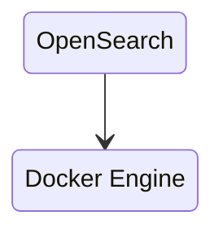

# OpenSearch 3.8.0 — назначение и архитектура

OpenSearch — поисковый движок, который хранит JSON-документы в индексах, ищет по тексту и фильтрам и считает агрегации. Здесь описана собственная установка **OpenSearch 3.8.0**, а не Amazon OpenSearch Service и не Wazuh indexer.

Документация: https://docs.opensearch.org/latest/  
Образы: `opensearchproject/opensearch:3.8.0`; для опционального интерфейса — `opensearchproject/opensearch-dashboards:3.8.0`.

## Назначение системы

OpenSearch нужен, чтобы **находить и анализировать большие объёмы уже подготовленных документов**: логи сервисов, поисковую копию справочников и клиентов (по ИНН, ФИО, адресу), аудит вызовов интеграционного API.

События приходят из Kafka. Эталон карточек живёт в озере или СУБД. Процессы ведёт Camunda. Интеграционное API взаимодействует с внешними ведомственными системами. OpenSearch — **поисковая проекция**: он отвечает на запросы «найди» и «покажи срезы», но не является местом изменения эталонной клиентской карточки. В OpenSearch поступает поток изменений, а запись истины остаётся в озере или СУБД.

Система **не** заменяет Kafka, Camunda, транзакционную СУБД или озеро данных и сама не обращается в государственные сервисы. Для SIEM используется отдельный кластер Wazuh indexer: объединять его с бизнес-поиском нельзя из-за различающихся контуров доступа и назначения данных.

## Перечень функций

Self-hosted OpenSearch OSS:

1. **Хранит и ищет JSON-документы** в именованных индексах: выполняет полнотекстовый поиск, фильтрацию и агрегации. Это не транзакционная СУБД.
2. **Делит индекс на шарды** и размещает их на разных узлах. Для главного шарда можно хранить реплики на других узлах. Число главных шардов задаётся при создании индекса; для его изменения данные переиндексируют в новый индекс. Число реплик можно менять.
3. **Объединяет несколько процессов в кластер** и поддерживает роли cluster manager, data, ingest и coordinating. Роли могут быть выделены в отдельные пулы или совмещены в одном процессе.
4. **Показывает здоровье кластера**: `green` — доступны все главные шарды и реплики; `yellow` — доступны все главные шарды, но не все реплики; `red` — недоступен хотя бы один главный шард.
5. **Учитывает зоны размещения**, чтобы главный шард и его реплика не оказались в одной зоне отказа.
6. **Предоставляет REST API** на порту 9200/TCP и использует внутренний транспорт между узлами на 9300/TCP. Пользовательский трафик не направляют на выделенные cluster-manager-узлы.
7. **Разграничивает доступ** с помощью встроенного Security plugin: TLS, пользователей, ролей и аудита.
8. **Управляет жизненным циклом индексов**: по политике сжимает, перемещает или удаляет старые индексы.
9. **Создаёт и восстанавливает снимки** во внешнем хранилище. Реплика шарда не заменяет снимок: логическое удаление индекса применяется ко всем репликам.
10. **Копирует индексы между отдельными кластерами** с помощью плагина репликации; ведомый индекс доступен только для чтения.
11. **Публикует метрики узла** через Performance Analyzer на порту 9600/TCP.

## Основные элементы системы и зависимости

OpenSearch — несколько отдельных процессов-узлов с общим именем кластера. На схеме одна площадка и боевой ориентир вендора: три выделенных cluster manager и три data-узла; роль ingest совмещена с data. Выделенный coordinating-узел **опционален**. OpenSearch Dashboards, ingest-клиенты, Kafka, балансировщик, СУБД/озеро и репозиторий снимков — чужое ПО. ([Creating a cluster](https://docs.opensearch.org/latest/tuning-your-cluster/))

**Допущение схемы:** одна площадка. Живые процессы OpenSearch **3.8.0**, их тома и клиентский вход живут в одном дата-центре. Stretch одного кластера по **9300/TCP** на 2–3 зала на рисунке **нет**: порога допустимой задержки (RTT) у вендора нет. Межплощадочная копия индекса (CCR) на этой схеме не рисуется. ([Creating a cluster](https://docs.opensearch.org/latest/tuning-your-cluster/), [replication plugin](https://docs.opensearch.org/latest/tuning-your-cluster/replication-plugin/))

**Сильная сторона** одного зала: выборы cluster manager и копии шардов не едут через город, отказ одной data-ноды переживается репликой в этом же зале. **Слабая:** падение этой площадки вместе с её дисками останавливает поиск; реплика шарда не является бэкапом. **Критично:** **9200** и **9300** не публиковать в интернет; клиентский трафик не направлять на выделенные cluster manager; VIP вместо адресов узлов на **9300** ломает transport; диск ноды — локальный SSD POSIX, не NFS; учебный `discovery.type=single-node` и демо-пароль `admin` в бой не копировать; снимки класть во внешний бакет, который не умрёт вместе с дисками этого зала.

### Схема инстансов и потоков

Имена внутри блоков — роли, не обязательные DNS-имена. Сплошная стрелка — рабочий поток показанной схемы одной площадки; пунктир — опциональный путь или логическая связь, а не обязательный TCP. Направление стрелки — кто открывает соединение. Рамки subgraph **без заливки**: цвет задаёт сам квадратик, подложка его не перекрашивает.

```mermaid
%%{init: {"theme": "base", "themeVariables": {"primaryColor": "#d9ead3", "primaryTextColor": "#000000", "primaryBorderColor": "#38761d", "lineColor": "#5b5b5b", "secondaryColor": "#cfe2f3", "tertiaryColor": "#fff2cc", "clusterBkg": "transparent", "clusterBorder": "#666666"}}}%%
flowchart LR
  APP["APP — приложения и API"]
  DASH["DASH — OpenSearch Dashboards<br/>:5601, опционально"]
  PIPE["PIPE — ingest-клиенты<br/>Prepper / Connect / Vector"]
  KAFKA["KAFKA — Kafka"]
  SOT["SOT — СУБД / озеро"]

  subgraph EDGE["Вход площадки 1 — отдельное ПО"]
    LB["LB — Service / Ingress / HAProxy<br/>клиенты :9200"]
  end

  subgraph SITE["Площадка 1 — OpenSearch 3.8.0"]
    C1["C1 — coordinating<br/>опционально выделенный"]
    D1["D1 — data 1<br/>data + ingest"]
    D2["D2 — data 2<br/>data + ingest"]
    D3["D3 — data 3<br/>data + ingest"]
    CM1["CM-1 — cluster manager 1"]
    CM2["CM-2 — cluster manager 2"]
    CM3["CM-3 — cluster manager 3"]
  end

  subgraph STORE["Хранилища площадки 1"]
    VOL[("VOL — тома данных нод<br/>локальный SSD, не NFS")]
    SNAP[("SNAP — репозиторий снимков<br/>S3 / fs / HDFS / Azure")]
  end

  MON["MON — мониторинг"]

  APP -->|"1. REST HTTPS :9200"| LB
  DASH -->|"1. REST HTTPS :9200"| LB
  PIPE -->|"1. Bulk HTTPS :9200"| LB
  KAFKA -->|"события"| PIPE
  APP -.->|"эталон не в OpenSearch"| SOT
  LB -->|"2. :9200, не на CM"| C1
  LB -.->|"2. если C1 не выделен"| D1
  C1 -->|"3. scatter/gather :9300"| D1
  C1 -->|"3. scatter/gather :9300"| D2
  C1 -->|"3. scatter/gather :9300"| D3
  D1 <-->|"4. transport :9300<br/>копии шардов"| D2
  D2 <-->|"4. transport :9300<br/>копии шардов"| D3
  CM1 <-->|"5. выборы / cluster state :9300"| CM2
  CM2 <-->|"5. выборы / cluster state :9300"| CM3
  CM3 <-->|"5. выборы / cluster state :9300"| CM1
  D1 <-->|"5. состояние кластера :9300"| CM1
  D1 --> VOL
  D2 --> VOL
  D3 --> VOL
  D1 -->|"6. снимок / restore"| SNAP
  MON -.->|"7. Performance Analyzer :9600"| D1
  MON -.->|"7. :9600"| CM1

  L_OS["OpenSearch: обязательный компонент"]
  L_OPT["OpenSearch: опциональный компонент"]
  L_EXT["Внешняя система / отдельное ПО"]
  L_DATA[("Хранилище / том другого ПО")]

  style EDGE fill:none,stroke:#0b5394,color:#000000
  style SITE fill:none,stroke:#38761d,color:#000000
  style STORE fill:none,stroke:#741b47,color:#000000

  style CM1 fill:#d9ead3,stroke:#38761d,color:#000000,stroke-width:2px
  style CM2 fill:#d9ead3,stroke:#38761d,color:#000000,stroke-width:2px
  style CM3 fill:#d9ead3,stroke:#38761d,color:#000000,stroke-width:2px
  style D1 fill:#d9ead3,stroke:#38761d,color:#000000,stroke-width:2px
  style D2 fill:#d9ead3,stroke:#38761d,color:#000000,stroke-width:2px
  style D3 fill:#d9ead3,stroke:#38761d,color:#000000,stroke-width:2px
  style L_OS fill:#d9ead3,stroke:#38761d,color:#000000,stroke-width:2px

  style C1 fill:#fff2cc,stroke:#bf9000,color:#000000,stroke-width:2px,stroke-dasharray:5 3
  style L_OPT fill:#fff2cc,stroke:#bf9000,color:#000000,stroke-width:2px,stroke-dasharray:5 3

  style APP fill:#cfe2f3,stroke:#0b5394,color:#000000,stroke-width:2px
  style DASH fill:#cfe2f3,stroke:#0b5394,color:#000000,stroke-width:2px
  style PIPE fill:#cfe2f3,stroke:#0b5394,color:#000000,stroke-width:2px
  style KAFKA fill:#cfe2f3,stroke:#0b5394,color:#000000,stroke-width:2px
  style SOT fill:#cfe2f3,stroke:#0b5394,color:#000000,stroke-width:2px
  style LB fill:#cfe2f3,stroke:#0b5394,color:#000000,stroke-width:2px
  style MON fill:#cfe2f3,stroke:#0b5394,color:#000000,stroke-width:2px
  style L_EXT fill:#cfe2f3,stroke:#0b5394,color:#000000,stroke-width:2px

  style VOL fill:#ead1dc,stroke:#741b47,color:#000000,stroke-width:2px
  style SNAP fill:#ead1dc,stroke:#741b47,color:#000000,stroke-width:2px
  style L_DATA fill:#ead1dc,stroke:#741b47,color:#000000,stroke-width:2px
```

**Легенда:**

- ■ **Зелёный** — процессы OpenSearch, без которых показанный контур поиска и записи одной площадки не работает (три cluster manager и три data-узла).
- ■ **Жёлтый, пунктирная рамка** — тот же продукт, который на одной площадке можно не выделять (dedicated coordinating). На закрытом стенде достаточно одного совмещённого процесса.
- ■ **Синий** — отдельно развёрнутые системы и участники. OpenSearch их не кластеризует и не заменяет.
- ■ **Розовый цилиндр** — том или объектное хранилище другого ПО. Формат индекса — продукт; диск и бакет — нет.

### Описание блоков

#### APP — приложения и API

- **Что это:** микросервисы платформы, интеграционное API, воркеры Camunda и прочие клиенты, которые ищут документы или пишут поисковую проекцию.
- **Технологии и варианты:** официальный клиент OpenSearch (Java, Python, JavaScript, Go и др.) либо любой HTTP-клиент REST; одиночная запись документа или Bulk API. Учётка сервиса — не `admin`. ([Clients](https://docs.opensearch.org/latest/clients/), [Bulk](https://docs.opensearch.org/latest/api-reference/document-apis/bulk/))
- **Назначение:** поиск, фильтрация, агрегации и запись уже подготовленных JSON-документов через `LB` на **9200/TCP**. Клиент не ходит на **9300** и не читает тома нод.
- **Развёртывание:** внешние системы, не входят в OpenSearch.

#### DASH — OpenSearch Dashboards

- **Что это:** веб-интерфейс к кластеру: Discover, визуализации, часть админки. Это **другое ПО**, не узел OpenSearch.
- **Технологии и варианты:** образ `opensearchproject/opensearch-dashboards:3.8.0`; процесс Node.js, пользовательский порт **5601/TCP**. К кластеру ходит тем же REST на **9200**, что и приложения. ([Install Dashboards](https://docs.opensearch.org/latest/install-and-configure/install-dashboards/))
- **Назначение:** дать людям браузерный доступ к поиску и картинкам. Падение UI не останавливает API и индексацию.
- **Развёртывание:** отдельно развёрнутый продукт; на одной площадке **опционален**. Кластер без Dashboards уже отвечает на 9200.

#### PIPE — ingest-клиенты

- **Что это:** отдельные программы, которые читают события и доставляют документы в OpenSearch по REST.
- **Технологии и варианты:** Data Prepper, Kafka Connect с подходящим коннектором, Fluent Bit, Vector или собственный consumer. Это не роль `ingest` внутри OpenSearch. ([Data Prepper](https://docs.opensearch.org/latest/data-prepper/getting-started/), [Bulk](https://docs.opensearch.org/latest/api-reference/document-apis/bulk/))
- **Назначение:** забрать события из Kafka, сгруппировать, проставить `_id` и записать Bulk на **9200**. Повтор, ошибка и отставание чтения — ответственность этого ПО, не брокера и не кластера.
- **Развёртывание:** отдельно развёрнутое ПО; **опционально**, если приложения `APP` сами пишут документы.

#### KAFKA — Kafka

- **Что это:** шина событий платформы; входной буфер новых документов.
- **Технологии и варианты:** существующий кластер Kafka платформы; темы и consumer group задаёт интеграция, не OpenSearch.
- **Назначение:** держать поток, пока потребитель не запишет документ в индекс. Kafka сама индекс не создаёт и не вызывает 9200.
- **Развёртывание:** внешняя система, не входит в OpenSearch.

#### SOT — СУБД / озеро

- **Что это:** источник истины карточек и долговечных данных.
- **Технологии и варианты:** транзакционная СУБД или озеро платформы; конкретный продукт задаёт карточка хранилища, не OpenSearch.
- **Назначение:** хранить эталон. OpenSearch держит поисковую проекцию, которую можно пересоздать. Пунктир на схеме — логическая зависимость, не протокол OpenSearch.
- **Развёртывание:** отдельно развёрнутая система. OpenSearch её не заменяет и не реплицирует как свою БД.

#### LB — Service / Ingress / HAProxy

- **Что это:** единая клиентская точка входа площадки 1 на REST **9200/TCP**.
- **Технологии и варианты:** Kubernetes Service, Ingress или внешний HTTP(S)/TCP-балансировщик (в том числе HAProxy). Конкретный продукт задаёт платформа. TLS может завершаться здесь или на узле; до OpenSearch должен остаться защищённый контракт Security plugin. ([Installing OpenSearch](https://docs.opensearch.org/latest/install-and-configure/install-opensearch/index/), [Creating a cluster](https://docs.opensearch.org/latest/tuning-your-cluster/))
- **Назначение:** отдать стабильный адрес API и распределить запросы по coordinating- или data-узлам. Не направлять этот вход на выделенные cluster manager. Не использовать этот же VIP как единственный адрес для **9300**.
- **Развёртывание:** отдельно развёрнутая инфраструктура. На закрытом Docker-стенде вход может быть `127.0.0.1:9200` без балансировщика.

#### C1 — coordinating

- **Что это:** узел OpenSearch, который принимает клиентский запрос, рассылает его по нужным шардам и собирает один ответ. Сам шарды с данными не хранит, если роль выделенная.
- **Технологии и варианты:** любой узел по умолчанию умеет координировать. Выделенный coordinating: `node.roles: []`. Вендор считает пару таких узлов уместной при тяжёлом поиске. ([Creating a cluster](https://docs.opensearch.org/latest/tuning-your-cluster/))
- **Назначение:** не дать поисковому scatter/gather съесть CPU и кучу data-узлов. Порядок предпочтения клиентского трафика у вендора: ingest → coordinating → data; на cluster manager — нет.
- **Развёртывание:** входит в продукт; на одной площадке **опционален**. Без `C1` запрос принимает data-узел (пунктир `LB → D1`).

#### D1 / D2 / D3 — data-узлы

- **Что это:** рабочие процессы OpenSearch: хранят шарды, индексируют, ищут, считают агрегации. На схеме у каждого также роль `ingest` (серверный pipeline перед записью).
- **Технологии и варианты:** образ `opensearchproject/opensearch:3.8.0`; `node.roles: [ data, ingest ]`. По умолчанию узел совмещает ещё и `cluster_manager` — на этой схеме роль управления вынесена в `CM-*`. Выделенный ingest-пул вендор предлагает при тяжёлых pipeline; здесь он не нарисован отдельными квадратами. Диск — SSD на хосте; NFS как диск ноды вендор не рекомендует. Java линии 3.6.1+: 21/25/26, в бандле **25.0.4+7**. Куча ≈ половина RAM, `Xms = Xmx`. На Linux `vm.max_map_count ≥ 262144`. ([Creating a cluster](https://docs.opensearch.org/latest/tuning-your-cluster/), [Installing OpenSearch](https://docs.opensearch.org/latest/install-and-configure/install-opensearch/index/))
- **Назначение:** держать главные шарды и реплики, выполнять поиск по локальным сегментам, копировать шард на соседнюю data-ноду, писать и читать снимки. Три узла иллюстрируют совет вендора добавлять data кратно числу зон (здесь зоны одной площадки). Это не смета «хватит на терабайты»: нагрузки в запросе нет.
- **Развёртывание:** входят в продукт, ставятся на этой площадке. Учебный стенд — один процесс `discovery.type=single-node` со всеми ролями; на одной ноде число реплик шарда = **0**, иначе вечный `yellow`.

#### CM-1 / CM-2 / CM-3 — cluster manager

- **Что это:** выделенные узлы с ролью `cluster_manager`: выбирают лидера, ведут состояние кластера, создают индексы и назначают шарды. Данных поисковых индексов не хранят.
- **Технологии и варианты:** тот же образ **3.8.0**, `node.roles: [ cluster_manager ]`. Для боя вендор почти всегда рекомендует **три** dedicated manager в **трёх зонах**. Два из трёх большую часть времени простаивают и нужны, чтобы не потерять кворум при отказе одного. ([Creating a cluster](https://docs.opensearch.org/latest/tuning-your-cluster/))
- **Назначение:** сохранить возможность выбирать лидера, пока живо большинство eligible-узлов (2 из 3). Поисковую нагрузку добавлением manager не масштабируют.
- **Развёртывание:** входят в продукт. На показанной боевой схеме одной площадки обязательны как тройка. На учебном single-node отдельного manager нет. Клиентский **9200** на них не направляют.

#### VOL — тома данных нод

- **Что это:** постоянный диск каждого процесса OpenSearch: сегменты индекса и служебные файлы узла.
- **Технологии и варианты:** локальный SSD POSIX; в Kubernetes — отдельный PVC с режимом ReadWriteOnce на каждую ноду, не `emptyDir` и не общий NFS на всех. ([Installing OpenSearch](https://docs.opensearch.org/latest/install-and-configure/install-opensearch/index/))
- **Назначение:** пережить пересоздание контейнера или пода без потери шардов этой ноды. Один цилиндр на схеме — тип носителя; физически у `D1`, `D2` и `D3` **свои** тома.
- **Развёртывание:** элемент выбранного хранения площадки, не процесс OpenSearch. В бою обязателен. Общий каталог на несколько нод не является частью схемы.

#### SNAP — репозиторий снимков

- **Что это:** зарегистрированное внешнее хранилище, куда кластер пишет снимки индексов и откуда восстанавливает.
- **Технологии и варианты:** общая файловая система (`type: fs`), Amazon S3 или S3-совместимый бакет (плагин `repository-s3`; на платформе это может быть OpenStack Swift), HDFS, Azure Blob. Снимок инкрементальный; удалять файлы руками в бакете нельзя — только API. ([Take and restore snapshots](https://docs.opensearch.org/latest/tuning-your-cluster/availability-and-recovery/snapshots/snapshot-restore/), [Snapshot management](https://docs.opensearch.org/latest/tuning-your-cluster/availability-and-recovery/snapshots/snapshot-management/))
- **Назначение:** независимая копия состояния индексов. Реплика шарда внутри `D1`–`D3` бэкап не заменяет: `DELETE` индекса уходит на все копии.
- **Развёртывание:** отдельно развёрнутое хранилище. Клиент снимка — процессы OpenSearch; сам бакет в поставку не входит. На схеме цилиндр стоит у площадки 1 как точка монтирования доступа; чтобы падение зала не убило и поиск, и бэкап, бакет не должен жить только на дисках этого же зала.

#### MON — мониторинг

- **Что это:** внешняя система наблюдения; не участник поиска и записи.
- **Технологии и варианты:** плагин Performance Analyzer на каждом узле отдаёт метрики на **9600/TCP**; потребителем может быть адаптер, экспортёр или система метрик площадки. Это не встроенный Prometheus-сервер. ([Installing OpenSearch](https://docs.opensearch.org/latest/install-and-configure/install-opensearch/index/))
- **Назначение:** видеть кучу, диск, задержку, здоровье узлов. Оповещения строит внешняя система.
- **Развёртывание:** отдельно развёрнутое ПО. Для рабочего REST **опционален**. Порт 9600 в интернет не публиковать.

#### Рамки EDGE / SITE / STORE и блоки легенды

- **Что это:** группировка и пояснение цветов, не runtime-процессы.
- **Технологии и варианты:** служебные блоки Mermaid; заливки у рамок нет, чтобы не перекрашивать квадратики.
- **Назначение:** `SITE` — поставка OpenSearch на площадке 1; `EDGE` и `STORE` — чужое ПО той же площадки; легенда повторяет цвета узлов.
- **Развёртывание:** на схему не ставятся.

### Как читать схему

1. **Это одна площадка.** Рамки `Вход`, `OpenSearch` и `Хранилища` — один дата-центр. Второго и третьего ЦОДа нет: их появление потребовало бы отдельного кластера (CCR только на чтение) или похода клиентов на 9200 первой площадки, а не общего **9300** через город.
2. **Сначала смотрите на цвет квадратика, не на рамку.** Зелёный — ядро продукта этой схемы. Жёлтый пунктир — тот же продукт, но его можно не выделять. Синий — чужой жизненный цикл (клиент, брокер, UI, вход, мониторинг, эталон). Розовый цилиндр — диск или бакет. Рамки специально без заливки, иначе подложка перекрашивает узлы.
3. **Читайте основной путь по номерам 1–2–3.** Приложение, Dashboards или ingest-клиент открывает HTTPS на вход; вход выбирает coordinating- или data-узел; этот узел рассылает запрос по шардам data-нод и собирает ответ. Cluster manager в этот путь не входит.
4. **Шаг 1.** `APP`, `DASH` и `PIPE` знают одно имя на **9200**, не адрес пода. Порт **5601** — только браузер к Dashboards; кластер его не слушает. Kafka к 9200 не подключается: события забирает `PIPE`. ([Network requirements](https://docs.opensearch.org/latest/install-and-configure/install-opensearch/index/))
5. **Шаг 2.** Вендор просит слать внешний трафик в порядке ingest → coordinating → data и **не** слать его на cluster manager. Сплошная `LB → C1` — вариант с выделенным coordinating. Пунктир `LB → D1` — учебный или компактный бой, где координацию берёт data-узел. ([Creating a cluster](https://docs.opensearch.org/latest/tuning-your-cluster/))
6. **Жёлтый `C1` можно снять.** На закрытом стенде и в небольшой конфигурации coordinating выполняет тот узел, который принял 9200. Выделение нужно, когда тяжёлый поиск (особенно агрегации) душит кучу data-нод.
7. **Шаг 3 — scatter/gather.** Coordinating (или data, принявший запрос) находит, на каких узлах лежат нужные шарды, спрашивает их по **9300** и склеивает частичные ответы. Клиент этого не видит: для него есть только 9200.
8. **Шаг 4 — данные живут на data-нодах.** `D1`–`D3` держат главные шарды и реплики. Стрелки между ними — копирование шарда и внутренние запросы, не клиентский REST. Дефолт OSS: 1 replica; на одной ноде replica должна быть **0**, иначе статус вечно `yellow` (копию некуда положить). Replica не бэкап: удаление индекса повторится на всех копиях. ([Index settings](https://docs.opensearch.org/latest/install-and-configure/configuring-opensearch/index-settings/))
9. **Шаг 5 — управление кластером отдельно от данных.** Три `CM-*` голосуют и публикуют cluster state по **9300**. Стрелка `D1 ↔ CM-1` означает, что **все** data-узлы общаются со **всеми** manager; на схеме не рисуется полный граф, чтобы не закрыть квадратики. Пока живо большинство eligible (2 из 3), кластер выбирает лидера. Два мёртвых manager из трёх — выборов нет. «Never loses quorum» у вендора = одна зона из трёх, не две. ([Creating a cluster](https://docs.opensearch.org/latest/tuning-your-cluster/))
10. **`VOL` — носитель, не четвёртая нода.** У каждой data-ноды свой каталог. Общий NFS на всех нодах на этой схеме не используется. Потеря тома `D1` — потеря шардов, которые не имели реплики на `D2`/`D3`.
11. **Шаг 6 — снимок уходит за границу процесса.** Data-узлы пишут в `SNAP`. Это другая правда, чем реплика внутри кластера. Если бакет стоит на тех же дисках зала, падение площадки убивает и индекс, и бэкап.
12. **Шаг 7 пунктирный.** Мониторинг опрашивает **9600** у конкретных процессов. Падение `MON` поиск не останавливает. Performance Analyzer не заменяет Zabbix/Prometheus.
13. **Синие `DASH` и `PIPE` необязательны для API.** Без Dashboards сервисы продолжают ходить в 9200. Без ingest-клиентов документы могут писать сами приложения. Отказ Dashboards = нет картинки; отказ `PIPE` = нет новых документов из Kafka; уже проиндексированное остаётся.
14. **`SOT` и `KAFKA` не часть кластера.** Эталон карточки правится в СУБД/озере. Событие едет в Kafka. OpenSearch отвечает «найди» и «покажи срез». Camunda может использовать этот же кластер как вторичное хранилище — это клиент `APP`, не отдельный квадрат.
15. **На схеме нет Wazuh indexer, Elasticsearch GeoData и второго кластера CCR.** SIEM — другой контур прав и другие образы. Stretch **9300** на соседний ЦОД сюда нельзя дорисовать: порога RTT нет. Ведомый кластер другой площадки, если появится, только читает копию или клиенты ходят на 9200 первой.
16. **Учебный стенд — не эта схема.** Один контейнер `discovery.type=single-node` на `127.0.0.1:9200` доказывает, что образ жив. Он не доказывает выборы manager, 9300 между машинами, раскладку реплик по зонам и снимок. ([Docker](https://docs.opensearch.org/latest/install-and-configure/install-opensearch/docker/), [Discovery](https://docs.opensearch.org/latest/tuning-your-cluster/discovery-cluster-formation/))

### Специальные термины схемы

- **Bulk API** — REST-операция: несколько действий с документами одним HTTP-запросом; так пишут ingest-клиенты.
- **CCR (cross-cluster replication)** — плагин копирования индекса в **другой** кластер; ведомый индекс только для чтения. На схеме одной площадки его нет.
- **Cluster manager** — выбранный узел, который ведёт состояние кластера и размещение шардов; старое имя роли — master.
- **Cluster state** — метаданные об узлах, индексах и шардах, которые публикует cluster manager.
- **Coordinating-узел** — кто принял клиентский запрос, разослал его по шардам и собрал ответ.
- **Discovery** — как узлы находят друг друга и собираются в кластер; `single-node` этот поиск отключает и годится только для учёбы.
- **Eligible-узел** — процесс с ролью `cluster_manager`, который может голосовать на выборах лидера.
- **Ingest pipeline** — цепочка процессоров **внутри** OpenSearch, которая меняет документ перед записью в индекс. Не путать с внешним ingest-клиентом `PIPE`.
- **Ingest-клиент** — отдельная программа снаружи кластера, которая доставляет документы на 9200.
- **Кворум** — большинство eligible-узлов (для трёх manager это двое), без которого кластер не выбирает лидера.
- **Поисковая проекция** — производная копия эталона, удобная для поиска; источник истины остаётся в `SOT`.
- **Performance Analyzer** — плагин OpenSearch, который отдаёт метрики узла на 9600/TCP.
- **PVC / RWO** — том Kubernetes, который в каждый момент монтируется к одному поду; у каждой ноды свой.
- **Реплика шарда** — дополнительная копия главного шарда на другом data-узле; даёт доступность, не заменяет снимок.
- **REST API** — HTTP-интерфейс OpenSearch на 9200: поиск, запись, админка.
- **Scatter/gather** — разослать запрос частям данных, затем склеить частичные ответы.
- **Security plugin** — встроенный модуль TLS, пользователей, ролей и аудита; в бою его не выключают.
- **Снимок (snapshot)** — резервная копия индексов во внешнем репозитории; инкрементальная, удаляется только через API.
- **Состояние здоровья** — `green` (все главные шарды и реплики на месте), `yellow` (главные есть, части реплик нет), `red` (нет хотя бы одного главного шарда).
- **Transport protocol** — внутренний протокол узлов на 9300/TCP; не для пользовательских REST-клиентов.
- **Узел (node)** — один запущенный процесс OpenSearch.
- **Шард** — часть индекса на одном data-узле; бывает главным или репликой.
- **Зона размещения** — признак отказа (стойка, зал внутри площадки), чтобы главная копия и реплика не сели в одну корзину. Три зоны на этой схеме — внутри одного дата-центра, не три города.

### Состав OpenSearch и связанных компонентов

| Компонент | Зачем | Как масштабируется | Принадлежность |
|---|---|---|---|
| **Cluster manager** | Состояние кластера, выборы, размещение шардов | Для отказоустойчивости — нечётное число eligible-инстансов, обычно три; поисковая нагрузка не является причиной добавлять manager-узлы | OpenSearch |
| **Data** | Хранение, индексирование и поиск | Горизонтально: узлы и шарды; вертикально: CPU, RAM и диск | OpenSearch |
| **Ingest** | Серверная обработка документов перед записью | Отдельный пул при тяжёлых pipeline; иначе совмещается с data | OpenSearch, выделение опционально |
| **Coordinating** | Приём запросов и объединение частичных ответов | Отдельный пул при тяжёлых поисковых запросах; иначе функцию выполняют другие узлы | OpenSearch, выделение опционально |
| **Плагины** | Security, ISM, снимки, репликация между кластерами, Performance Analyzer | Совместимый набор устанавливается на всех узлах, для которых это требует плагин | Часть/расширение OpenSearch |
| **OpenSearch Dashboards** | Веб-интерфейс | Несколько независимых реплик на один кластер | Отдельное ПО, опционально |
| **Ingest-клиенты** | Доставка событий и документов | Несколько consumers/инстансов с собственной моделью отказа | Отдельное ПО, опционально |

### Порты

| Порт | Назначение | Кому открывать |
|---|---|---|
| **9200/TCP** | REST API: приложения, Dashboards, ingest-клиенты и административные вызовы | Только доверенным клиентам и Dashboards; не публиковать в интернет |
| **9300/TCP** | Внутренний transport: узел ↔ узел; также соединения репликации между кластерами | Только узлам кластера и явно настроенному ведомому кластеру; не клиентам и не в интернет |
| **5601/TCP** | Пользовательский интерфейс OpenSearch Dashboards | Внутренней сети или корпоративной точке входа; это порт отдельного ПО |
| **9600/TCP** | Endpoint Performance Analyzer | Системе мониторинга и операторам; не в интернет |

UDP не используется. Порт 443, встречающийся в документации Amazon OpenSearch Service, не является отдельным стандартным портом self-hosted OpenSearch.

## Глоссарий

- **Агрегация** — вычисление сводного результата по набору документов, например количества или распределения по значениям поля.
- **API (Application Programming Interface)** — программный интерфейс, через который одна система вызывает функции другой.
- **Bulk API** — REST-операция OpenSearch для пакетной отправки нескольких действий с документами одним запросом.
- **Ведомый индекс** — доступная только для чтения копия индекса, которую отдельный кластер получает от ведущего.
- **Выделенная роль** — конфигурация, при которой процесс OpenSearch выполняет ограниченный набор функций вместо совмещения всех ролей.
- **Дата-нода (data node)** — узел OpenSearch, который хранит шарды и выполняет операции над данными.
- **Eligible-узел** — узел с ролью `cluster_manager`, который может участвовать в выборах руководителя кластера.
- **Endpoint** — сетевой адрес и порт, на котором процесс принимает запросы.
- **Индекс** — именованный логический набор JSON-документов в OpenSearch.
- **Индексирование** — преобразование и запись документа в структуры, по которым OpenSearch выполняет поиск.
- **Инстанс** — отдельно запущенный экземпляр процесса или сервиса.
- **Ingest-клиент** — отдельная программа, доставляющая данные в OpenSearch через REST API.
- **Ingest pipeline** — заданная в OpenSearch последовательность процессоров, изменяющих документ перед индексированием.
- **Ingest-узел** — узел OpenSearch с ролью `ingest`, который выполняет ingest pipeline.
- **JSON-документ** — запись из полей и значений в формате JSON, являющаяся единицей поиска и индексирования.
- **Кворум** — большинство eligible-узлов, без которого кластер не выбирает cluster manager; для трёх manager это двое.
- **Кластер** — группа узлов OpenSearch с общим именем и состоянием, совместно обслуживающая индексы.
- **Cluster manager** — выбранный узел, который управляет состоянием кластера и размещением шардов; прежнее название роли — master.
- **CCR (cross-cluster replication)** — плагин копирования индекса в отдельный кластер; ведомый индекс доступен только для чтения.
- **Consumer group** — группа потребителей Kafka, совместно распределяющих чтение разделов темы.
- **Coordinating-узел** — узел, принимающий запрос, распределяющий его по нужным шардам и объединяющий ответы.
- **Discovery** — механизм, которым узлы находят соседей и собираются в кластер; режим `single-node` его отключает и годится только для учёбы.
- **Mapping** — описание типов и правил индексирования полей документа.
- **OSS (Open Source Software)** — программное обеспечение с открытым исходным кодом; здесь — самостоятельно развёртываемая поставка OpenSearch.
- **Плагин** — устанавливаемый модуль, расширяющий функции OpenSearch.
- **Полнотекстовый поиск** — поиск по проанализированному тексту с учётом токенов и релевантности.
- **Поисковая проекция** — производная копия эталонных данных, оптимизированная для поиска и восстанавливаемая из источника истины.
- **Пул** — группа однотипно настроенных инстансов, выполняющих одну роль.
- **REST API** — HTTP-интерфейс OpenSearch для операций с кластером, индексами и документами.
- **Роль узла** — набор функций, разрешённых конкретному процессу OpenSearch его настройкой `node.roles`.
- **Реплика шарда** — дополнительная копия главного шарда на другом узле; обеспечивает доступность, но не является резервной копией.
- **Репозиторий снимков** — зарегистрированное внешнее хранилище, куда OpenSearch записывает снимки.
- **Scatter/gather** — схема выполнения запроса: разослать его частям данных, затем собрать частичные ответы в один.
- **Security plugin** — встроенный модуль OpenSearch для TLS, аутентификации, авторизации и аудита.
- **SIEM** — отдельный класс систем для сбора и анализа событий информационной безопасности.
- **Сегмент** — неизменяемая внутренняя часть поискового индекса на диске.
- **Снимок (snapshot)** — резервное состояние индексов и метаданных, сохранённое во внешнем репозитории.
- **Состояние кластера** — метаданные об узлах, индексах, настройках и размещении шардов, публикуемые cluster manager.
- **Том данных** — постоянное дисковое хранилище конкретного узла OpenSearch.
- **Transport mesh** — совокупность прямых внутренних соединений OpenSearch-узлов по transport protocol.
- **Transport protocol** — внутренний протокол OpenSearch для связи узлов на 9300/TCP; он не предназначен для пользовательских REST-клиентов.
- **TLS** — протокол шифрования и проверки подлинности сетевого соединения.
- **TCP** — транспортный сетевой протокол, поверх которого работают перечисленные в документе порты.
- **Self-hosted** — развёрнутый и управляемый в собственной инфраструктуре, а не предоставляемый как облачный сервис.
- **Узел (node)** — один запущенный процесс OpenSearch, входящий в кластер.
- **Шард** — часть индекса, физически размещаемая на одном data-узле; бывает главным или репликой.
- **ISM (Index State Management)** — механизм политик, который меняет состояние индекса по условиям времени, размера или другим событиям.
- **Performance Analyzer** — плагин OpenSearch, публикующий метрики производительности узлов.
- **S3-совместимое хранилище** — объектное хранилище с API, совместимым с Amazon S3.
- **VIP** — виртуальный IP-адрес балансировщика, предоставляющий клиентам одну точку входа.
- **Зона размещения** — признак отказа (стойка или зал внутри площадки), чтобы главный шард и реплика не оказались в одной корзине.

## Источники

- Версия OpenSearch: https://docs.opensearch.org/latest/version-history/
- Общая установка и сетевые порты: https://docs.opensearch.org/latest/install-and-configure/install-opensearch/
- Роли узлов и настройка кластера: https://docs.opensearch.org/latest/tuning-your-cluster/
- Обнаружение и формирование кластера: https://docs.opensearch.org/latest/tuning-your-cluster/discovery-cluster-formation/
- Настройки индексов и реплик: https://docs.opensearch.org/latest/install-and-configure/configuring-opensearch/index-settings/
- Security plugin: https://docs.opensearch.org/latest/security/configuration/
- Снимки: https://docs.opensearch.org/latest/tuning-your-cluster/availability-and-recovery/snapshots/snapshot-management/
- Типы репозитория снимков (fs, S3, HDFS, Azure): https://docs.opensearch.org/latest/tuning-your-cluster/availability-and-recovery/snapshots/snapshot-restore/
- Репликация между кластерами: https://docs.opensearch.org/latest/tuning-your-cluster/replication-plugin/
- Data Prepper как отдельный компонент: https://docs.opensearch.org/latest/data-prepper/getting-started/
