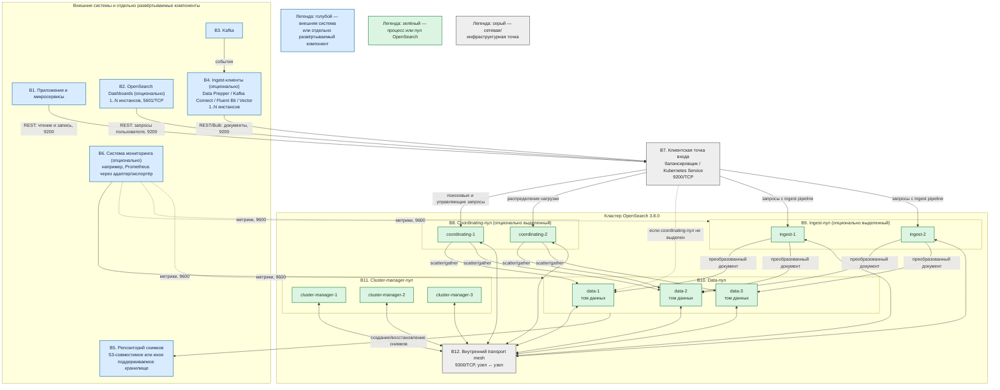

# OpenSearch 3.8.0 — назначение и архитектура

OpenSearch — поисковый движок, который хранит JSON-документы в индексах, ищет по тексту и фильтрам и считает агрегации. Здесь описана собственная установка **OpenSearch 3.8.0**, а не Amazon OpenSearch Service и не Wazuh indexer.

Документация: https://docs.opensearch.org/latest/  
Образы: `opensearchproject/opensearch:3.8.0`; для опционального интерфейса — `opensearchproject/opensearch-dashboards:3.8.0`.

## Назначение системы

OpenSearch нужен, чтобы **находить и анализировать большие объёмы уже подготовленных документов**: логи сервисов, поисковую копию справочников и клиентов (по ИНН, ФИО, адресу), аудит вызовов интеграционного API.

События приходят из Kafka. Эталон карточек живёт в озере или СУБД. Процессы ведёт Camunda. Интеграционное API взаимодействует с внешними ведомственными системами. OpenSearch — **поисковая проекция**: он отвечает на запросы «найди» и «покажи срезы», но не является местом изменения эталонной клиентской карточки. В OpenSearch поступает поток изменений, а запись истины остаётся в озере или СУБД.

Система **не** заменяет Kafka, Camunda, транзакционную СУБД или озеро данных и сама не обращается в государственные сервисы. Для SIEM используется отдельный кластер Wazuh indexer: объединять его с бизнес-поиском нельзя из-за различающихся контуров доступа и назначения данных.

## Перечень функций

Self-hosted OpenSearch OSS:

1. **Хранит и ищет JSON-документы** в именованных индексах: выполняет полнотекстовый поиск, фильтрацию и агрегации. Это не транзакционная СУБД.
2. **Делит индекс на шарды** и размещает их на разных узлах. Для главного шарда можно хранить реплики на других узлах. Число главных шардов задаётся при создании индекса; для его изменения данные переиндексируют в новый индекс. Число реплик можно менять.
3. **Объединяет несколько процессов в кластер** и поддерживает роли cluster manager, data, ingest и coordinating. Роли могут быть выделены в отдельные пулы или совмещены в одном процессе.
4. **Показывает здоровье кластера**: `green` — доступны все главные шарды и реплики; `yellow` — доступны все главные шарды, но не все реплики; `red` — недоступен хотя бы один главный шард.
5. **Учитывает зоны размещения**, чтобы главный шард и его реплика не оказались в одной зоне отказа.
6. **Предоставляет REST API** на порту 9200/TCP и использует внутренний транспорт между узлами на 9300/TCP. Пользовательский трафик не направляют на выделенные cluster-manager-узлы.
7. **Разграничивает доступ** с помощью встроенного Security plugin: TLS, пользователей, ролей и аудита.
8. **Управляет жизненным циклом индексов**: по политике сжимает, перемещает или удаляет старые индексы.
9. **Создаёт и восстанавливает снимки** во внешнем хранилище. Реплика шарда не заменяет снимок: логическое удаление индекса применяется ко всем репликам.
10. **Копирует индексы между отдельными кластерами** с помощью плагина репликации; ведомый индекс доступен только для чтения.
11. **Публикует метрики узла** через Performance Analyzer на порту 9600/TCP.

## Основные элементы системы и зависимости

OpenSearch — кластер из отдельных процессов-узлов. На схеме показана развёрнутая топология, в которой роли разделены для ясности. Выделенные coordinating- и ingest-узлы **опциональны**: в небольшой конфигурации их функции могут выполнять data-узлы. OpenSearch Dashboards и ingest-клиенты также **опциональны** и всегда развёртываются отдельно от OpenSearch.

### Схема инстансов и потоков

### Как читать схему

1. **Цвет показывает границу поставки.** Зелёные инстансы являются процессами OpenSearch. Голубые блоки — внешние системы либо отдельное ПО с собственным жизненным циклом и отказоустойчивостью. Серые блоки обозначают сетевую или инфраструктурную функцию, а не роль OpenSearch.
2. **Основной клиентский путь идёт сверху вниз.** Приложение B1, опциональный Dashboards B2 или опциональный ingest-клиент B4 обращается к единой точке B7 по REST на 9200/TCP. Порт 9200 не ведёт прямо к cluster-manager-пулу.
3. **Чтение распределяется coordinating-узлом.** B8 принимает поисковый запрос, отправляет его части нужным data-узлам B10 и объединяет частичные ответы. Сплошные стрелки показывают вариант с выделенным coordinating-пулом; пунктир B7 → B10 — вариант без него.
4. **Запись имеет два независимых уровня подготовки.** Отдельный ingest-клиент B4 получает события Kafka, формирует запросы и управляет доставкой. Если в запросе указан ingest pipeline OpenSearch, выделенный ingest-пул B9 дополнительно преобразует документ внутри кластера. Можно использовать любой из уровней или оба; они не являются взаимозаменяемыми автоматически.
5. **Данные находятся в B10.** Data-узлы индексируют документы, выполняют поиск по локальным шардам и хранят сегменты на своих томах. Стрелки через B12 означают обмен запросами, состоянием и копиями шардов между OpenSearch-узлами.
6. **B12 — не балансировщик.** Это логическое изображение полносвязного внутреннего обмена узлов по 9300/TCP. Каждый узел должен обращаться к реальным transport-адресам других узлов; один клиентский VIP вместо адресов узлов для этого трафика не используется.
7. **B11 управляет кластером.** Три выделенных cluster-manager-инстанса участвуют в выборах и публикуют состояние кластера. Data- и клиентский трафик на них не направляется. Для принятия решений требуется большинство eligible-узлов.
8. **Снимок уходит за границу кластера.** Data-пул B10 читает или записывает данные репозитория B5. Это независимая копия состояния индексов, в отличие от реплик внутри B10.
9. **Мониторинг не входит в OpenSearch.** B6 опрашивает endpoint Performance Analyzer на 9600/TCP непосредственно у нужных узлов. Performance Analyzer не превращает OpenSearch в Prometheus-сервер; для конкретной системы мониторинга может понадобиться отдельный адаптер.
10. **Dashboards и ingest-клиенты необязательны.** Без B2 приложения продолжают работать через REST API. Без B4 документы могут записывать сами приложения. Отказ B2 нарушает только пользовательский интерфейс; отказ B4 останавливает поступление новых документов из соответствующего потока, но не удаляет уже проиндексированные данные.

### Описание блоков

#### B1. Приложения и микросервисы

- **Технологии и варианты:** официальный клиент OpenSearch либо HTTP-клиент, который вызывает REST API; одиночная и пакетная запись.
- **Назначение и интеграции:** поиск, фильтрация, агрегации и запись подготовленных документов через B7.
- **Граница:** отдельные системы; не входят в OpenSearch.

#### B2. OpenSearch Dashboards — опционально

- **Технологии и варианты:** `opensearchproject/opensearch-dashboards:3.8.0`, один или несколько инстансов за собственной точкой входа; пользовательский порт 5601/TCP.
- **Назначение и интеграции:** веб-интерфейс для поиска, визуализаций и администрирования; к кластеру обращается через B7 на 9200/TCP.
- **Граница:** отдельное ПО и отдельный процесс; не является узлом OpenSearch. Установка Dashboards не обязательна.

#### B3. Kafka

- **Технологии и варианты:** существующий Kafka-кластер платформы; темы событий и consumer groups определяются интеграцией.
- **Назначение и интеграции:** надёжный входной буфер событий для B4. Kafka сама не индексирует документы.
- **Граница:** внешняя система; не входит в OpenSearch.

#### B4. Ingest-клиенты — опционально

- **Технологии и варианты:** Data Prepper, Kafka Connect с подходящим коннектором, Fluent Bit, Vector или собственный consumer.
- **Назначение и интеграции:** читают B3, преобразуют или группируют события и записывают документы через B7; должны отдельно обрабатывать повтор, ошибку и отставание чтения.
- **Граница:** отдельное ПО; не входит в OpenSearch. Если приложения B1 сами записывают документы, этот блок не обязателен.

#### B5. Репозиторий снимков

- **Технологии и варианты:** S3-совместимое хранилище, общая файловая система или HDFS из поддерживаемых типов репозитория.
- **Назначение и интеграции:** долговременное хранение снимков для восстановления индексов; доступ настраивается у кластера.
- **Граница:** внешнее хранилище; плагины и клиент репозитория работают в OpenSearch, но само хранилище в него не входит.

#### B6. Система мониторинга — опционально

- **Технологии и варианты:** Performance Analyzer предоставляет данные на 9600/TCP; потребителем может быть отдельный адаптер, экспортёр или система наблюдаемости.
- **Назначение и интеграции:** сбор метрик процессов OpenSearch и построение оповещений.
- **Граница:** система мониторинга развёртывается отдельно; Performance Analyzer является плагином OpenSearch.

#### B7. Клиентская точка входа

- **Технологии и варианты:** Kubernetes Service, ingress/proxy с TCP/HTTP-маршрутизацией или внешний балансировщик. TLS может завершаться по выбранной модели безопасности, но до OpenSearch должен сохраняться защищённый контракт.
- **Назначение и интеграции:** предоставляет стабильный адрес 9200/TCP и распределяет клиентские запросы по coordinating-, ingest- или совмещённым data-узлам.
- **Граница:** инфраструктурный объект; не роль и не отдельный процесс OpenSearch.

#### B8. Coordinating-пул — опционально выделенный

- **Технологии и варианты ролей:** OpenSearch-узлы с `node.roles: []`; при отсутствии выделенного пула координацию выполняет любой узел, получивший запрос, обычно data-узел.
- **Назначение и интеграции:** разбивает поисковый запрос на обращения к шардам, собирает ответы, сортирует и возвращает итог клиенту.
- **Граница:** при выделении это отдельные инстансы OpenSearch; функция coordinating входит в каждый узел OpenSearch.

#### B9. Ingest-пул — опционально выделенный

- **Технологии и варианты ролей:** OpenSearch-узлы с ролью `ingest`; роль можно совместить с `data` или выделить при тяжёлых ingest pipeline.
- **Назначение и интеграции:** выполняет серверные pipeline-преобразования документа перед индексированием и передаёт результат data-узлам.
- **Граница:** при выделении это отдельные инстансы OpenSearch; не следует путать их с внешними ingest-клиентами B4.

#### B10. Data-пул

- **Технологии и варианты ролей:** OpenSearch-узлы с ролью `data`; в простой топологии тот же процесс может одновременно иметь роли `cluster_manager` и `ingest` и выполнять coordinating-функцию. В показанной развёрнутой топологии управление кластером и ingest вынесены в отдельные пулы.
- **Назначение и интеграции:** хранение шардов на томах, индексирование, локальное выполнение поиска, агрегаций, репликация и работа со снимками.
- **Граница:** основные инстансы OpenSearch. Каждый инстанс имеет собственный каталог данных и transport-адрес.

#### B11. Cluster-manager-пул

- **Технологии и варианты ролей:** выделенные OpenSearch-узлы с ролью `cluster_manager`; в малом небоевом стенде роль может совмещаться с data, но на схеме показаны три выделенных инстанса.
- **Назначение и интеграции:** выбор активного cluster manager, ведение состояния кластера, создание индексов и назначение шардов.
- **Граница:** инстансы OpenSearch. Выделенный manager-пул не предназначен для хранения боевых данных или приёма клиентских запросов.

#### B12. Внутренний transport mesh

- **Технологии и варианты:** transport protocol OpenSearch поверх 9300/TCP с TLS при включённом Security plugin; физически это прямые сетевые соединения между узлами.
- **Назначение и интеграции:** обнаружение узлов, публикация состояния кластера, межузловое выполнение запросов и передача шардов.
- **Граница:** часть OpenSearch-протокола и сетевой связности кластера, а не отдельный сервер.

### Состав OpenSearch и связанных компонентов

| Компонент | Зачем | Как масштабируется | Принадлежность |
|---|---|---|---|
| **Cluster manager** | Состояние кластера, выборы, размещение шардов | Для отказоустойчивости — нечётное число eligible-инстансов, обычно три; поисковая нагрузка не является причиной добавлять manager-узлы | OpenSearch |
| **Data** | Хранение, индексирование и поиск | Горизонтально: узлы и шарды; вертикально: CPU, RAM и диск | OpenSearch |
| **Ingest** | Серверная обработка документов перед записью | Отдельный пул при тяжёлых pipeline; иначе совмещается с data | OpenSearch, выделение опционально |
| **Coordinating** | Приём запросов и объединение частичных ответов | Отдельный пул при тяжёлых поисковых запросах; иначе функцию выполняют другие узлы | OpenSearch, выделение опционально |
| **Плагины** | Security, ISM, снимки, репликация между кластерами, Performance Analyzer | Совместимый набор устанавливается на всех узлах, для которых это требует плагин | Часть/расширение OpenSearch |
| **OpenSearch Dashboards** | Веб-интерфейс | Несколько независимых реплик на один кластер | Отдельное ПО, опционально |
| **Ingest-клиенты** | Доставка событий и документов | Несколько consumers/инстансов с собственной моделью отказа | Отдельное ПО, опционально |

### Порты

| Порт | Назначение | Кому открывать |
|---|---|---|
| **9200/TCP** | REST API: приложения, Dashboards, ingest-клиенты и административные вызовы | Только доверенным клиентам и Dashboards; не публиковать в интернет |
| **9300/TCP** | Внутренний transport: узел ↔ узел; также соединения репликации между кластерами | Только узлам кластера и явно настроенному ведомому кластеру; не клиентам и не в интернет |
| **5601/TCP** | Пользовательский интерфейс OpenSearch Dashboards | Внутренней сети или корпоративной точке входа; это порт отдельного ПО |
| **9600/TCP** | Endpoint Performance Analyzer | Системе мониторинга и операторам; не в интернет |

UDP не используется. Порт 443, встречающийся в документации Amazon OpenSearch Service, не является отдельным стандартным портом self-hosted OpenSearch.

## Глоссарий

- **Агрегация** — вычисление сводного результата по набору документов, например количества или распределения по значениям поля.
- **API (Application Programming Interface)** — программный интерфейс, через который одна система вызывает функции другой.
- **Bulk API** — REST-операция OpenSearch для пакетной отправки нескольких действий с документами одним запросом.
- **Ведомый индекс** — доступная только для чтения копия индекса, которую отдельный кластер получает от ведущего.
- **Выделенная роль** — конфигурация, при которой процесс OpenSearch выполняет ограниченный набор функций вместо совмещения всех ролей.
- **Дата-нода (data node)** — узел OpenSearch, который хранит шарды и выполняет операции над данными.
- **Eligible-узел** — узел с ролью `cluster_manager`, который может участвовать в выборах руководителя кластера.
- **Endpoint** — сетевой адрес и порт, на котором процесс принимает запросы.
- **Индекс** — именованный логический набор JSON-документов в OpenSearch.
- **Индексирование** — преобразование и запись документа в структуры, по которым OpenSearch выполняет поиск.
- **Инстанс** — отдельно запущенный экземпляр процесса или сервиса.
- **Ingest-клиент** — отдельная программа, доставляющая данные в OpenSearch через REST API.
- **Ingest pipeline** — заданная в OpenSearch последовательность процессоров, изменяющих документ перед индексированием.
- **Ingest-узел** — узел OpenSearch с ролью `ingest`, который выполняет ingest pipeline.
- **JSON-документ** — запись из полей и значений в формате JSON, являющаяся единицей поиска и индексирования.
- **Кластер** — группа узлов OpenSearch с общим именем и состоянием, совместно обслуживающая индексы.
- **Cluster manager** — выбранный узел, который управляет состоянием кластера и размещением шардов; прежнее название роли — master.
- **Consumer group** — группа потребителей Kafka, совместно распределяющих чтение разделов темы.
- **Coordinating-узел** — узел, принимающий запрос, распределяющий его по нужным шардам и объединяющий ответы.
- **Mapping** — описание типов и правил индексирования полей документа.
- **OSS (Open Source Software)** — программное обеспечение с открытым исходным кодом; здесь — самостоятельно развёртываемая поставка OpenSearch.
- **Плагин** — устанавливаемый модуль, расширяющий функции OpenSearch.
- **Полнотекстовый поиск** — поиск по проанализированному тексту с учётом токенов и релевантности.
- **Поисковая проекция** — производная копия эталонных данных, оптимизированная для поиска и восстанавливаемая из источника истины.
- **Пул** — группа однотипно настроенных инстансов, выполняющих одну роль.
- **REST API** — HTTP-интерфейс OpenSearch для операций с кластером, индексами и документами.
- **Роль узла** — набор функций, разрешённых конкретному процессу OpenSearch его настройкой `node.roles`.
- **Реплика шарда** — дополнительная копия главного шарда на другом узле; обеспечивает доступность, но не является резервной копией.
- **Репозиторий снимков** — зарегистрированное внешнее хранилище, куда OpenSearch записывает снимки.
- **Scatter/gather** — схема выполнения запроса: разослать его частям данных, затем собрать частичные ответы в один.
- **Security plugin** — встроенный модуль OpenSearch для TLS, аутентификации, авторизации и аудита.
- **SIEM** — отдельный класс систем для сбора и анализа событий информационной безопасности.
- **Сегмент** — неизменяемая внутренняя часть поискового индекса на диске.
- **Снимок (snapshot)** — резервное состояние индексов и метаданных, сохранённое во внешнем репозитории.
- **Состояние кластера** — метаданные об узлах, индексах, настройках и размещении шардов, публикуемые cluster manager.
- **Том данных** — постоянное дисковое хранилище конкретного узла OpenSearch.
- **Transport mesh** — совокупность прямых внутренних соединений OpenSearch-узлов по transport protocol.
- **Transport protocol** — внутренний протокол OpenSearch для связи узлов на 9300/TCP; он не предназначен для пользовательских REST-клиентов.
- **TLS** — протокол шифрования и проверки подлинности сетевого соединения.
- **TCP** — транспортный сетевой протокол, поверх которого работают перечисленные в документе порты.
- **Self-hosted** — развёрнутый и управляемый в собственной инфраструктуре, а не предоставляемый как облачный сервис.
- **Узел (node)** — один запущенный процесс OpenSearch, входящий в кластер.
- **Шард** — часть индекса, физически размещаемая на одном data-узле; бывает главным или репликой.
- **ISM (Index State Management)** — механизм политик, который меняет состояние индекса по условиям времени, размера или другим событиям.
- **Performance Analyzer** — плагин OpenSearch, публикующий метрики производительности узлов.
- **S3-совместимое хранилище** — объектное хранилище с API, совместимым с Amazon S3.
- **VIP** — виртуальный IP-адрес балансировщика, предоставляющий клиентам одну точку входа.

## Источники

- Версия OpenSearch: https://docs.opensearch.org/latest/version-history/
- Общая установка и сетевые порты: https://docs.opensearch.org/latest/install-and-configure/install-opensearch/
- Роли узлов и настройка кластера: https://docs.opensearch.org/latest/tuning-your-cluster/
- Обнаружение и формирование кластера: https://docs.opensearch.org/latest/tuning-your-cluster/discovery-cluster-formation/
- Настройки индексов и реплик: https://docs.opensearch.org/latest/install-and-configure/configuring-opensearch/index-settings/
- Security plugin: https://docs.opensearch.org/latest/security/configuration/
- Снимки: https://docs.opensearch.org/latest/tuning-your-cluster/availability-and-recovery/snapshots/snapshot-management/
- Репликация между кластерами: https://docs.opensearch.org/latest/tuning-your-cluster/replication-plugin/
- Data Prepper как отдельный компонент: https://docs.opensearch.org/latest/data-prepper/getting-started/
