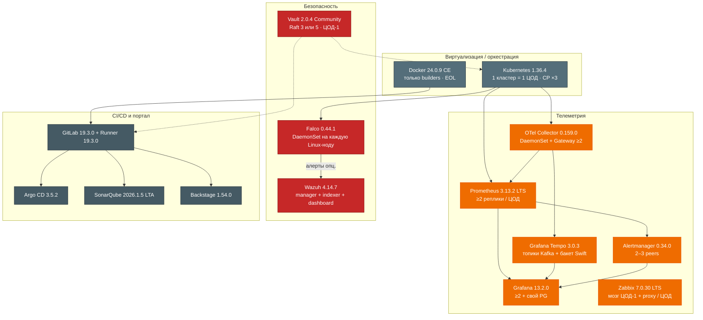
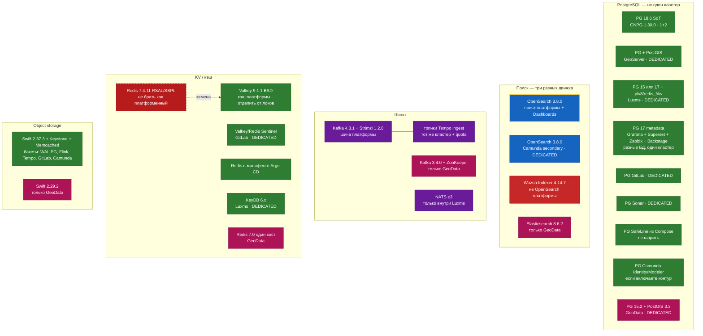
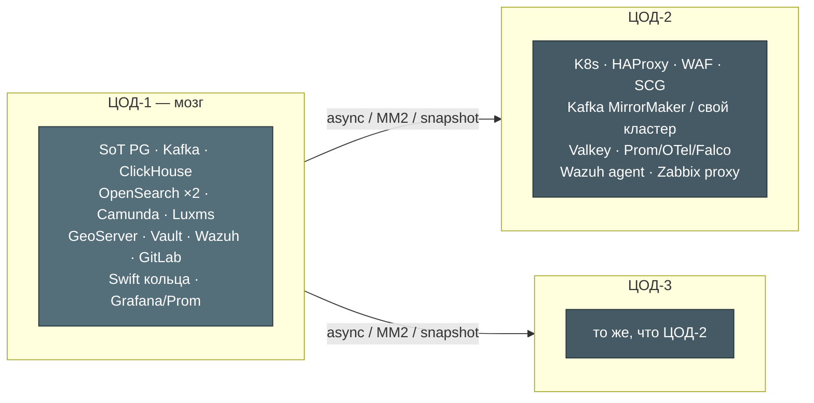

# ИТ-ландшафт платформы

Сводка по карточкам `Out/**/*.md` и `Out/**/*.shema.md`. Цель — **в одном месте** увидеть, какие инстансы ПО нужно развернуть, какие версии зафиксированы и что можно переиспользовать.

**Рамка.** 3 ЦОДа в одном городе, Kubernetes, stretch stateful-кластеров на 2–3 площадки **нет** (так в схемах систем). Цифры ниже — **на одну активную площадку (мозг = ЦОД-1)**, если не сказано иное. Нагрузка не замерена — это состав, не смета ядер.

**Кастомный код** (микросервисы, интеграционный API на 30+ ведомств) в `Out/` нет — на схемах показан как логический контур, не продукт.

---

## Легенда цветов

| Цвет | Назначение |
|---|---|
| серый | виртуализация / оркестрация |
| жёлтый | край / балансировка |
| красный | безопасность |
| фиолетовый | коммуникация (шины, очереди) |
| бирюзовый | процессные движки |
| зелёный | БД и объектные хранилища |
| синий | поиск и аналитика / BI |
| оливковый | ГИС |
| оранжевый | телеметрия / мониторинг |
| графит | CI/CD, портал разработки |
| розовый | коммерческое РФ-ПО / остров вендора |
| пунктир | опционально или конфликт ролей |

---

## Решения по переиспользованию

Это ответы на вопрос «общий инстанс или свой».

| Технология | Решение | Почему |
|---|---|---|
| **ClickHouse 26.7.5** | **Один** аналитический кластер на площадку | Уже в ландшафте; Luxms и Superset читают витрины, не ядро |
| **Kafka 4.3.1** | **Одна** шина платформы; Tempo — **свои топики + quota**, не отдельный кластер в первом проде | GeoData Kafka **3.4+ZK** с этой шиной **не сливать** |
| **OpenSearch 3.8.0** | **Два** кластера: поиск платформы и secondary Camunda | Плюс **Wazuh Indexer** — третий, это не OpenSearch платформы |
| **PostgreSQL** | **Не один** кластер на всех | SoT 18.6, PostGIS GeoServer, ядро Luxms 15/17, GitLab, SafeLine — разные версии/расширения/blast radius |
| **Valkey 9.1.1** | Платформенный кэш (вместо Redis 7.4) | Redis 7.4 — RSALv2/SSPL; Valkey — BSD-3. Luxms всё равно **свой KeyDB 6.x** |
| **Swift 2.37.3** | **Один** object store, **разные бакеты/префиксы** | GeoData Swift **2.29.2** не мешать в те же кольца |
| **GeoData 4.0** | **Остров**, не шарит Kafka/Camunda/K8s-версию | Конфликт ролей; K8s 1.24 vs платформа 1.36 — блокер до вендора |
| **RabbitMQ** | Ставить **только** если есть AMQP-клиенты | Не замена Kafka |

---

## 1. Боевой контур: данные, процессы, интеграции

Не каждый под процесса: нет Zeebe-брокеров по одному, нет Keeper/Sentinel, нет Filebeat. Это **продукты и выделенные инстансы**, без которых контур не живёт.

```mermaid
flowchart TB
  USERS(["Клиенты / операторы / ведомства"])

  subgraph EDGE["Край площадки"]
    direction LR
    WAF["SafeLine WAF 9.4.0<br/>1 стек / ЦОД + свой PG"]
    HAP["HAProxy 3.4.3<br/>пара + Keepalived"]
    SCG["Spring Cloud Gateway 5.0.3<br/>≥2 реплики / ЦОД"]
  end

  subgraph APP["Прикладной контур"]
    MS["Микросервисы<br/>+ интеграционный API"]
  end

  subgraph COMM["Коммуникация"]
    KF["Kafka 4.3.1 KRaft<br/>3 controller + ≥3 broker"]
    FL["Flink 2.2.1<br/>JM + TM / ЦОД"]
    RMQ["RabbitMQ 4.3.5<br/>3 ноды · опционально"]
  end

  subgraph BPM["Процессный движок"]
    CAM["Camunda 8.9.17<br/>RF=3 в ЦОД-1"]
    OSC["OpenSearch 3.8.0<br/>secondary Camunda · DEDICATED"]
  end

  subgraph DATA["БД и хранилища"]
    PG["PostgreSQL 18.6 SoT<br/>1 primary + 2 standby"]
    VAL["Valkey 9.1.1<br/>кэш платформы"]
    SW["Swift 2.37.3<br/>S3 · replica=3"]
    MG["MongoDB 7.0.40<br/>PSS ×3 · по роли SoT"]
  end

  subgraph AN["Поиск и аналитика"]
    CH["ClickHouse 26.7.5<br/>1 шард × 3 реплики · ОБЩИЙ"]
    OS["OpenSearch 3.8.0<br/>поиск платформы"]
    OSD["OpenSearch Dashboards 3.8.0"]
    SUP["Apache Superset 6.1.0"]
    LUX["Luxms BI 12.x"]
  end

  subgraph GIS["ГИС-платформа"]
    GS["GeoServer 2.24.4 EOL<br/>≥2 JVM + общий data dir"]
    PGG["PostgreSQL + PostGIS<br/>DEDICATED под GeoServer"]
  end

  subgraph ISLAND["Остров GeoData — не шарить с платформой"]
    GD["GeoData 4.0.1 / wf 4.0.2<br/>своя Kafka 3.4 + ES 8.6 + PG 15.2"]
  end

  USERS --> WAF --> HAP --> SCG --> MS
  MS --> KF
  MS --> PG
  MS --> VAL
  MS --> SW
  MS --> CAM
  PG -->|"outbox после COMMIT"| KF
  KF --> FL
  KF --> CH
  KF --> OS
  FL --> CH
  FL --> SW
  CAM --> OSC
  CAM --> MS
  CH --> LUX
  CH --> SUP
  OS --> OSD
  OS --> SUP
  GS --> PGG
  MS --> GS
  LUX -.->|"не ядро, только витрины"| KF
  GD -.->|"конфликт BPMN / шины / СМЭВ"| CAM
  GD -.->|"Kafka 3.4+ZK ≠ 4.3"| KF
  MS -.-> RMQ

  classDef ha fill:#F9A825,color:#111,stroke:#F57F17,stroke-width:1px
  classDef be fill:#283593,color:#fff,stroke:#1A237E
  classDef comm fill:#6A1B9A,color:#fff,stroke:#4A148C
  classDef stream fill:#00695C,color:#fff,stroke:#004D40
  classDef bpm fill:#00838F,color:#fff,stroke:#004D40
  classDef db fill:#2E7D32,color:#fff,stroke:#1B5E20
  classDef analytics fill:#1565C0,color:#fff,stroke:#0D47A1
  classDef gis fill:#9E9D24,color:#111,stroke:#827717
  classDef rf fill:#AD1457,color:#fff,stroke:#880E4F
  classDef opt fill:#CE93D8,color:#111,stroke:#6A1B9A,stroke-dasharray:5 5

  class WAF,HAP,SCG ha
  class MS be
  class KF comm
  class FL stream
  class RMQ opt
  class CAM,OSC bpm
  class PG,VAL,SW,MG db
  class CH,OS,OSD,SUP,LUX analytics
  class GS,PGG gis
  class GD rf
```

**Luxms внутри себя (не на общей схеме):** PostgreSQL **15 или 17** + Patroni, **KeyDB 6.x**, **NATS ≥3**, **Consul 1.16.1 ×3**. Это не Kafka и не платформенный Valkey.

**Camunda** ходит в озеро/SoT и интеграционный API **через job workers** (микросервисы), не напрямую в ведомства.

---

## 2. Платформа: оркестрация, телеметрия, безопасность, CI

OpenTelemetry **SDK** — библиотеки в процессах приложений, отдельных серверов нет (карточка `Open Telemetry`).

---

## 3. Карта инстансов общих технологий

Именно здесь видно, **сколько** PostgreSQL / OpenSearch / Kafka / KV / object store нужно и какие **нельзя** склеить из‑за версий, лицензии и санкционного контура.

Жёлтая обводка у **OpenSearch поиска** — кандидат на шаринг с Backstage search (отдельный индекс, не озеро ПДн). Camunda и Wazuh туда **не** подключать.

**Superset** в документации вендора — PostgreSQL **10–17**. Поэтому metadata-кластер — **17**, не SoT **18.6**.

---

## Каталог инстансов

Состав, который нужно заказать/развернуть. Операторы (CNPG, Strimzi, …) входят в поставку соответствующей системы, отдельной карточкой не плодим.

### Площадка и край

| Инстанс | Версия | Сколько | Share | Заметка |
|---|---|---|---|---|
| Kubernetes | **1.36.4** | 1 кластер / ЦОД: CP **×3** + workers | оркестратор общий | Stretch etcd **нет** |
| HAProxy | **3.4.3** LTS | **пара** / ЦОД + Keepalived | много frontend на пару | Не VIP на 3 ЦОДа |
| SafeLine WAF | **9.4.0** | 1 Compose-стек / периметр ЦОД | нет | Свой PG; Pro = egress license server (Китай) |
| Spring Cloud Gateway | **5.0.3** | **≥2** реплики / ЦОД | нет | После WAF/HAProxy; исходящие в ведомства **не** сюда |
| Docker Engine | **24.0.9 CE** | ≥1 builder | только CI | **EOL**; не runtime K8s (там containerd) |

### Коммуникация и обработка

| Инстанс | Версия | Сколько | Share | Заметка |
|---|---|---|---|---|
| Apache Kafka | **4.3.1** + Strimzi **1.2.0** | 3 controller + **≥3** broker / ЦОД | шина платформы | KRaft, без ZK. Tempo — топики с quota |
| Apache Flink | **2.2.1** + Operator **1.15.0** | 1 JM (+standby) + TM | нет | Чекпоинты в Swift. Connector Kafka **5.0.0** |
| RabbitMQ | **4.3.5** + Operator **v2.22.5** | **3** ноды | нет | Ставить только при AMQP-клиентах |

### Данные

| Инстанс | Версия | Сколько | Share | Заметка |
|---|---|---|---|---|
| PostgreSQL SoT | **18.6** + CNPG **1.30.0** | 1 primary + **2** standby | **нет** (OLTP) | BI/метаданные — другие кластеры |
| PostgreSQL + PostGIS | под GeoServer | 1 кластер площадки | **нет** | Версия PG связана с GeoServer/JDBC |
| PostgreSQL Luxms | **15 или 17** | Patroni + Consul **1.16.1 ×3** | **нет** | Расширения вендора: plv8, redis_fdw, … |
| PostgreSQL metadata | **17** | 1 кластер, **несколько БД** | Grafana, Superset, Zabbix, Backstage | Не SoT, не GitLab, не Sonar |
| PostgreSQL GitLab | внешний writer | 1 | **нет** | Bundled из Helm — не прод |
| PostgreSQL SonarQube | **14–18** | 1 | **нет** | Лицензия SQ на инстанс/LOC |
| PostgreSQL SafeLine | из релиза WAF | 1 на стек | **нет** | Продукт так устроен |
| PostgreSQL Camunda | внешний | 1, если Modeler/Identity | **нет** | Не secondary Zeebe |
| Valkey | **9.1.1** Helm **0.11.0** | primary+replica; Sentinel **≥3** | кэш платформы | Кэш с eviction и локи — **разные** наборы |
| MongoDB | Community **7.0.40** + MCK **1.10.0** | PSS **×3** | нет | **SSPL** — юристы до установки. Шарды этим CR нельзя |
| OpenStack Swift | **2.37.3** (OS **2026.1**) | proxy **≥2** + object replica **3** | бакеты платформы | Нужны **Keystone**, **Memcached :11211**, **SQLite** (account/container на дисках нод — не отдельный инстанс) |
| Redis 7 | **7.4.11** | — | **не использовать как платформенный** | RSALv2/SSPL; брать Valkey |

### Поиск, аналитика, BI

| Инстанс | Версия | Сколько | Share | Заметка |
|---|---|---|---|---|
| ClickHouse | **26.7.5.10** + Keeper **×3** | 1 шард × **3** реплики | **да**: Luxms, Superset, платформа | Линию 26.3 LTS не мешать с 26.7 |
| OpenSearch поиск | **3.8.0** | manager **×3** + data **×3** | Dashboards, опц. Backstage | Не Camunda, не Wazuh |
| OpenSearch Dashboards | **3.8.0** | **≥2** | к кластеру поиска | Версия = кластеру |
| OpenSearch Camunda | **3.8.0** | отдельный кластер | **нет** | Secondary storage Zeebe |
| Apache Superset | **6.1.0** Helm **0.21.1** | web + worker + beat **×1** | читает CH/витрины | Metadata PG **≤17** |
| Luxms BI | линейка **12.x** (портал ~12.1.0) | web **≥2**, appserver **≥2**, KeyDB, NATS **≥3** | CH общий; PG/KeyDB/NATS свои | Коммерция, реестр РФ **3366**. ФСТЭК — только **11.0.x** |

### ГИС и процессы

| Инстанс | Версия | Сколько | Share | Заметка |
|---|---|---|---|---|
| GeoServer | **2.24.4** (Java 11, Tomcat 8.5/9) | **≥2** JVM, один `DATA_DIR` | PostGIS свой | **EOL авг 2024**, дальше не патчится. GPL |
| Camunda 8 | **8.9.17** chart **14.8.5** | Gateway + brokers **×3** | OS secondary свой | Нужен **`CAMUNDA_LICENSE_KEY`**. Optimize в 1-м проде выкл. |
| GeoData | ППО **4.0.1**, workflow **4.0.2** | свой стек ОПО в `dc0` | **ничего** с платформой | Cassandra 4.1, Kafka 3.4+ZK, ES 8.6.2, PG 15.2+PostGIS 3.3, Redis 7.0, Swift 2.29.2, Keycloak 21.1.2. K8s **1.24** vs **1.36** |

### Телеметрия

| Инстанс | Версия | Сколько | Share | Заметка |
|---|---|---|---|---|
| OpenTelemetry Collector | **0.159.0** | agent DS + gateway **≥2** / ЦОД | приёмник общий | SDK — в приложениях |
| Prometheus | **3.13.2** LTS | **≥2** / ЦОД | scrape контура | kube-prom-stack **88.3.0** |
| Alertmanager | **0.34.0** | **2–3** peers / ЦОД | с Prometheus | В чарте kube-prom может быть **0.33.1** — сверить матрицу |
| Grafana | **13.2.0** Helm **12.11.2** | **≥2** | UI общий | AGPLv3; свой PG (в metadata-17) |
| Grafana Tempo | **3.0.3** chart **3.0.6** | microservices | бакет Swift | Ingest через Kafka-топики |
| Zabbix | **7.0.30** LTS | server ЦОД-1 + proxy / ЦОД + Agent2 | железо/SNMP | Свой PG (в metadata-17). Не дублировать алерты Prometheus |

### Безопасность

| Инстанс | Версия | Сколько | Share | Заметка |
|---|---|---|---|---|
| HashiCorp Vault | **2.0.4** Helm **0.34.1** | Raft **3 или 5** в ЦОД-1 | SoT секретов | Community без PR на 3 живых SoT. Санкционный контур HashiCorp |
| Falco | **0.44.1** Operator **v0.4.1** | 1 под / Linux-нода | нет | modern_ebpf |
| Wazuh | **4.14.7** | 1 master + **≥2** worker + indexer **≥3** + dashboard | агенты везде | Indexer **≠** OpenSearch 3.8 |

### CI/CD

| Инстанс | Версия | Сколько | Share | Заметка |
|---|---|---|---|---|
| GitLab | **19.3.0** Helm **10.3.0** | CN Hybrid + Gitaly Cluster | нет | Свои PG и Valkey+Sentinel. Geo = **Premium** |
| GitLab Runner | **19.3.0** | managers + job pods | нет | |
| Argo CD | **3.5.2** | HA ≥3 ноды | свой Redis | GitOps, не CI |
| SonarQube Server | **2026.1.5 LTA** | 1 процесс без DCE | свой PG | Второй процесс без DCE = вторая лицензия. Search встроенный, не OS платформы |
| Backstage | **1.54.0** Helm **2.8.2** | app **≥2** :7007 | PG в metadata-17 | Свой образ, не demo-чарт |

---

## Зависимые компоненты без карточки в Out

Их всё равно нужно развернуть, иначе соответствующие системы не стартуют в заявленном виде.

| Компонент | Зачем | Версия / ограничение |
|---|---|---|
| Keepalived / VRRP | VIP пары HAProxy | не HAProxy |
| **Keystone** | Swift в бою (s3token) | нет карточки — пробел ландшафта |
| **Memcached :11211** | токены Swift | нет карточки |
| rsync :873 | догон копий Swift | на storage-нодах |
| **SQLite** | метаданные account/container в Swift; опц. БД Zabbix proxy | встроено, не отдельный инстанс. Grafana/Backstage/Superset — только стенд |
| Consul **1.16.1 ×3** | DCS Patroni Luxms | только контур Luxms |
| Patroni **3.2.x** | HA Postgres Luxms | |
| KeyDB **6.x** | сессии Luxms | не Valkey платформы |
| NATS (пакет Luxms) | внутренняя шина BI | **≥3**, порты 4222/6222/8222 |
| IdP / Keycloak | SSO Grafana, GitLab, Camunda, OSD, Luxms | GeoData тащит **свой** Keycloak 21.1.2 |
| CSI / СХД + RWX | PVC K8s; data dir GeoServer | |
| OCI-реестр | образы K8s / CI | часто GitLab Registry |
| КриптоПро | ЭП в контуре GeoData | отдельная лицензия СКЗИ |

---

## Лицензии, санкции, EOL — что нельзя «просто поставить»

| Риск | Что | Следствие |
|---|---|---|
| Коммерческий ключ | Camunda 8 Self-Managed | без `CAMUNDA_LICENSE_KEY` прод нелегален |
| Коммерция РФ | Luxms BI, GeoData | договор, репозиторий вендора |
| SSPL | MongoDB 7 Community | блокер до юристов |
| RSALv2 / SSPL | Redis **7.4** | платформенный кэш = **Valkey 9.1.1** |
| AGPLv3 | Grafana OSS | юридическая оценка контура |
| HashiCorp | Vault Community | санкции / альтернативы секретов |
| Chaitin | SafeLine Pro | license server в облаке КНР |
| EOL / CVE | GeoServer **2.24.4** | линия не патчится после авг 2024 |
| EOL | Docker **24.0.9** | Unmaintained с 2024-06 |
| GitLab Geo | DR на вторую площадку | **Premium/Ultimate** |
| SonarQube | HA | только **Data Center Edition** |
| ФСТЭК | Luxms | сертификат на **11.0.x**, не на 12.x |
| Совместимость | GeoData ↔ K8s 1.36 | манифесты под **1.24.1** |

---

## Расклад по трём ЦОДам (без stretch)

Между площадками: **MirrorMaker 2** (Kafka), async replica / PITR (Postgres), snapshot Vault/OpenSearch, Cold Recovery Camunda. Общего Raft «на город» ни у одной системы из карточек нет.

---

## Источники

Карточки в `Out/` по доменам: **БД и хранилища**, **Бэкенд**, **Обработка данных**, **Поиск и аналитика**, **ГИС-платформа**, **Платформенная инфра**, **Безопасность**, **Отказоустойчивость**. Версии и «dedicated vs share» — из `.md` + `.shema.md` (у Alertmanager, Argo CD, OTel Collector схемы нет — взято из `.md`).
