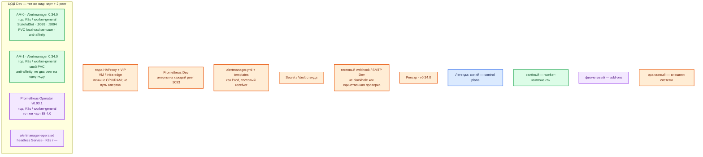

# Prometheus Alertmanager 0.34.0 — Dev

Упрощение Prod: **тот же** вид инсталляции и та же роль-модель. Уменьшаем CPU/RAM/диск, не меняем схему «kube-prometheus-stack + CR Alertmanager + 2 gossip-peer». Не один процесс `docker run`, не Compose, не quickstart с `replicas: 1`.

Маршрутизация алертов Prometheus. Официальное имя — **Alertmanager**. Образ: `quay.io/prometheus/alertmanager:v0.34.0`. Контур: **Dev**, 1 ЦОД.

## Допущения

1. Контур **Dev**: 1 ЦОД. Stretch не применим. ЦОДа бэкапов нет: конфиг в GitOps, секреты в Secret/Vault стенда.
2. Паритет с Prod: Helm **kube-prometheus-stack 88.4.0**, Operator **v0.93.1**, CR `Alertmanager`, StatefulSet, **2 peers**, headless `alertmanager-operated`, PVC `local-ssd`, hard anti-affinity. Дефолт чарта `replicas: 1` на Dev **не** оставляем: это другой класс (нет gossip, нет выката «сосед жив», Prometheus бьёт в один адрес).
3. Кворума у Alertmanager **нет**. Правило платформы «на Dev три голосующих» сюда **не** переносим: 3 мелких peer «чтобы как etcd» — уже другой размер mesh, не уменьшенный Prod. Prod стартует с **2**; Dev тоже **2**.
4. Та же пара HAProxy **3.4.3** + Keepalived + VIP, меньше CPU/RAM. Kafka `:9092` и путь Prometheus→AM через этот VIP **не** публикуем.
5. Те же имена StorageClass: `local-ssd` / `shared-fs`. Тома меньше (ориентир **1–2 ГиБ** на peer вместо ~5 ГиБ). NFS / emptyDir как «чтобы быстрее» — не этот контур: не воспроизводится потеря снимка silences после рестарта.
6. DNS: CoreDNS / `cluster.local`; снаружи зона `dev.…`. Prometheus — на Endpoints каждого peer, не Pod IP в конфиге руками и не один Service ClusterIP.
7. Нагрузка не замерена. Ориентир процесса: **меньше Prod**, порядка **0.5–1 vCPU / 256–512 МиБ RAM**, уточняется замером. Официального минимума нет.
8. Источник состава — `sample/Alertmanager.md`. Карточки `Out/Платформенная инфра/AlterManager/` (`.install.md` нет). `IT-landscape.md` не использовался.
9. Учебный `docker run quay.io/prometheus/alertmanager:v0.34.0` из README — закрытый ноутбук, **не** Dev-контур платформы.
10. Секреты и webhook URL в git не кладём. 9093/9094 не в интернет. Grafana Alerting не подменяем этим контуром.

## Схема инстансов

Тот же вид, что Prod на **одном** ЦОДе: два маленьких peer на двух нодах `worker-general`. Потоков нет.

ОС — свойство платформы, не пода. Один стандарт Linux на всех нодах контура.

Тот же стандарт, что Prod. Отдельного ОС-исключения у Alertmanager нет.

### Пулы нод

| Имя пула | Роль | Зачем выделен |
|---|---|---|
| `worker-general` | general | ≥2 ноды: два peer с anti-affinity и Operator. Одна worker-нода = другой класс стенда (оба peer на одной машине, отказ ноды = оба мертвы). |
| `infra-edge` | edge-VM | Та же пара HAProxy + VIP. Не схлопывать в один контейнер HAProxy «потому что Dev». |
| `control-plane` | control-plane | На схеме AM нет. Peers на control-plane с taint не сажаем. |

## Комментарии к схеме

### Почему не один процесс

- **Функционал.** Dev должен воспроизвести ошибку вида инсталляции и ошибку «два peer / gossip / Prometheus шлёт всем».
- **Критично.** `docker run` одного контейнера на 9093 доказывает UI, но не: Memberlist, `--cluster.advertise-address`, fail-open при потере 9094, rolling update StatefulSet, headless Endpoints, PVC `local-ssd`. Схема «на Prod кубер, на Dev один процесс» — прямой запрет паритета Task_6.

### AM-0 / AM-1 — те же 2 peers

- **Функционал.** Тот же бинарь 0.34.0, те же порты, тот же gossip в одном ЦОДе.
- **Критично.** `replicas: 2`, `podAntiAffinity: "hard"`, образ **v0.34.0**. Не резать CPU limit «чтобы не мешал» до дропа notify, которого в Prod нет. `--cluster.advertise-address` должен быть Pod IP:9094; hostname вендор не принимает. Проверка: `alertmanager_cluster_members == 2` на **обоих** подах. Drain одной ноды: второй peer продолжает слать.

### Prometheus Operator и headless Service

- **Функционал.** Тот же чарт 88.4.0, тот же CR. Prometheus Dev указывает на `alertmanager-operated`, не на Ingress.
- **Критично.** Не ставить отдельный «простой» манифест Deployment AM «для отладки» рядом со стеком: два механизма = два поведения. Не подмешивать 0.33.1 из 88.3.0. `amtool check-config` перед выкатом — как в Prod.

### Пара HAProxy + VIP

- **Функционал.** Тот же вход `:6443` и HTTP(S). UI AM — только если нужен оператору, с auth внутри сети.
- **Критично.** Не использовать VIP как единственный `alertmanagers.targets` у Prometheus.

### Prometheus и тестовый receiver

- **Функционал.** Тестовое правило + реальный тестовый webhook/email Dev (не прод-канал).
- **Критично.** Готовность Dev: firing в Prometheus → алерт на **обоих** AM → выбранный route → письмо/webhook дошло → resolved, если включено. Открытый UI и blackhole не считаются.

## Путь роста

Совпадает с Prod, только цифры меньше: сначала замер RAM/CPU на 2 peers; затем третий peer **в том же Dev-ЦОДе**, если проверяете именно выкат/двойной отказ. Не включать stretch и не раздувать mesh «на вырост». Шум — правилами и grouping, не десятым peer.

## Сильные и слабые места

**Сильная сторона.** Тот же чарт, те же 2 peers и тот же anti-pattern-запрет LB, что Prod: ошибка gossip/выката/Endpoints воспроизводится.

**Слабая сторона.** Две маленькие ноды всё ещё нужны; соблазн схлопнуть в `docker run` ломает паритет. Тестовый receiver, случайно нацеленный в бой, шлёт шум дежурным.

**Критичные условия**

- Не `replicas: 1`, не Compose, не один `docker run`.
- Не LB между Prometheus и peers.
- Не три peer «ради кворума» (кворума нет).
- Не `latest`. Не 9093 в интернет. Не прод-секреты в Git Dev.

## Источники

- HA: https://prometheus.io/docs/alerting/latest/high_availability/
- Релиз 0.34.0: https://github.com/prometheus/alertmanager/releases/tag/v0.34.0
- README образа: https://github.com/prometheus/alertmanager/blob/v0.34.0/README.md
- Конфигурация: https://prometheus.io/docs/alerting/latest/configuration/
- kube-prometheus-stack **88.4.0** (дефолт `replicas: 1`, tag `v0.34.0`): https://github.com/prometheus-community/helm-charts/tree/kube-prometheus-stack-88.4.0/charts/kube-prometheus-stack
- sample: `sample/Alertmanager.md`
- Карточки: `Out/Платформенная инфра/AlterManager/AlterManager.md`, `AlterManager.consultant.md`
- Парный Prod: `sample2/Alertmanager.prod.md`

**В доке вендора нет (не угадано):** точные millicores Dev; порог RTT; обещание, что один контейнер на ноутбуке эквивалентен HA.
