# Prometheus Alertmanager 0.34.0 — Prod

Маршрутизация уже вычисленных алертов: grouping, silence, inhibition, receivers. **Не** считает alerting rules и **не** хранит метрики — это Prometheus. Контур: **Prod**. Два прикладных ЦОДа — **два независимых gossip-кластера**. ЦОД-бэкапы — копии конфигурации/секретов, **без** живого peer.

Официальное имя — **Alertmanager** (не «AlterManager»). Образ: `quay.io/prometheus/alertmanager:v0.34.0`, не `latest`. Релиз: 16 августа 2026.

**Gossip** — обмен silences и notification log между peers по **9094/TCP+UDP** без Raft-кворума. **Peer** — один полный процесс Alertmanager. **Fail-open** — при partition возможны дубли уведомлений, чтобы не потерять критическое сообщение. Exactly-once вендор не обещает.

## Допущения

1. Контур **Prod**: 2 прикладных ЦОДа + 1 ЦОД под бэкапы (постановка Task_6). Stretch одного gossip на 2–3 ЦОДа **нет**: probe gossip **1s**, порога RTT у проекта нет, RTT между залами не измерен.
2. На каждом прикладном ЦОДе: свой Kubernetes **1.36.4**, своя пара HAProxy **3.4.3** + Keepalived + VIP. VIP = ControlPlaneEndpoint (`:6443`, TCP passthrough) и край HTTP(S). **Kafka :9092 через этот HAProxy не публикуем.** 9093/9094 Alertmanager на этот VIP **не** вешаем как путь Prometheus.
3. StorageClass: `local-ssd` (RWO) для PVC peers; `shared-fs` (RWX) **не** берём. NFS — не диск silences/nflog. Диск не хранит терабайты метрик: на нём снимки silences и notification log (`retention` чарта по умолчанию **120h**).
4. DNS: внутри CoreDNS / `cluster.local`. Снаружи зона `prod.…`. Клиенты (оператор UI, amtool) — по FQDN Service/Ingress, не Pod IP. Prometheus ходит на **Pod IP / headless Endpoints каждого peer**, не на один ClusterIP/VIP.
5. Механизм установки: **kube-prometheus-stack 88.4.0** (Prometheus Operator **v0.93.1**, Kubernetes чарта ≥ 1.25) → CR `Alertmanager` → StatefulSet. Чарт **88.3.0** из карточки Prometheus поставляет AM **0.33.1** — в этот контур его дефолт **не** берём и **не** подменяем только контейнер «на глаз». Пин образа 0.34.0 совпадает с values 88.4.0.
6. Минимальная HA одного ЦОДа: **2 peers** в одном зале (официальный ориентир 2–3). Третий peer — путь роста, не старт. Кворума нет: чёт/нечет не меняет класс системы; один живой peer продолжает отправку.
7. Нагрузка не замерена. Официального минимума CPU/RAM/HDD нет. Ориентир `sample/Alertmanager.md`: **1 vCPU, 1 ГиБ RAM, 5 ГиБ SSD** на peer — порядок величины, уточняется замером. Не включаем «все тумблеры» (4–5 peers, multi-DC gossip, все интеграции сразу).
8. Источник состава — `sample/Alertmanager.md`. Карточки `Out/Платформенная инфра/AlterManager/` — факты по **этому** продукту (`AlterManager.install.md` в папке **нет**). `integrations/IT-landscape.md` **не** использовался.
9. 9093 и 9094 в интернет не публикуем. Секреты receivers — Secret/Vault, параметры `*_file` где поддерживаются; webhook URL и SMTP password в git и в этой инструкции не печатаем.
10. Grafana Alerting / встроенный Alertmanager Grafana — **другой** механизм. Zabbix actions — тоже. Сюда не смешиваем.

## Схема инстансов

Без потоков данных. ЦОД-1 и ЦОД-2 — две копии одной роль-модели, разные Kubernetes, разные gossip-mesh, разные Prometheus этой площадки.

```mermaid
flowchart TB
  subgraph DC1["ЦОД-1 — свой Kubernetes, свой gossip AM"]
    AM10["AM-1-0 · Alertmanager 0.34.0<br/>под, K8s / worker-general<br/>StatefulSet · :9093 API/UI · :9094 gossip<br/>PVC local-ssd · anti-affinity"]
    AM11["AM-1-1 · Alertmanager 0.34.0<br/>под, K8s / worker-general<br/>тот же процесс, свой PVC<br/>anti-affinity: не два peer на одну ноду"]
    OP1["Prometheus Operator v0.93.1<br/>под, K8s / worker-general<br/>CR Alertmanager, не путь алертов"]
    HS1["alertmanager-operated<br/>headless Service · K8s / —<br/>Endpoints всех peers :9093/:9094"]
  end

  subgraph DC2["ЦОД-2 — независимый контур, не stretch"]
    AM20["AM-2-0 · Alertmanager 0.34.0<br/>под, K8s / worker-general<br/>anti-affinity"]
    AM21["AM-2-1 · Alertmanager 0.34.0<br/>под, K8s / worker-general<br/>anti-affinity"]
    OP2["Prometheus Operator v0.93.1<br/>под, K8s / worker-general"]
    HS2["alertmanager-operated ЦОД-2<br/>headless Service · K8s / —"]
  end

  subgraph DCB["ЦОД-бэкапы"]
    BK["снимки Secret / GitOps YAML<br/>не третий gossip-peer"]
  end

  VIP1["пара HAProxy + VIP ЦОД-1<br/>VM / infra-edge<br/>UI :9093 на VIP не как путь Prometheus"]
  VIP2["пара HAProxy + VIP ЦОД-2<br/>VM / infra-edge"]
  P1["Prometheus площадки ЦОД-1<br/>алерты на каждый peer :9093"]
  P2["Prometheus площадки ЦОД-2<br/>алерты на каждый peer :9093"]
  CFG["alertmanager.yml + templates<br/>одинаковые на peers одного ЦОДа"]
  SEC["Secret / Vault<br/>SMTP / webhook / tokens"]
  RX["SMTP / webhook / on-call / ITSM<br/>внешние receivers"]
  REG["Реестр · quay.io/prometheus/alertmanager:v0.34.0"]

  LEGCORE["Легенда: синий — control plane"]
  LEGWORK["зелёный — worker-компоненты"]
  LEGADD["фиолетовый — add-ons"]
  LEGEXT["оранжевый — внешняя система"]

  classDef core fill:#dbeafe,stroke:#2563eb,color:#172554,stroke-width:2px;
  classDef worker fill:#dcfce7,stroke:#16a34a,color:#14532d,stroke-width:2px;
  classDef addon fill:#f3e8ff,stroke:#9333ea,color:#581c87,stroke-width:2px;
  classDef external fill:#ffedd5,stroke:#ea580c,color:#7c2d12,stroke-width:2px;

  class LEGCORE core;
  class AM10,AM11,AM20,AM21,LEGWORK worker;
  class OP1,OP2,HS1,HS2,LEGADD addon;
  class VIP1,VIP2,P1,P2,CFG,SEC,RX,REG,BK,LEGEXT external;
```

ОС — свойство платформы, не пода. Один стандарт Linux на всех нодах контура.

У Alertmanager нет отдельного требования к дистрибутиву ноды сверх Linux-хоста под Kubernetes/containerd.

### Пулы нод

| Имя пула | Роль | Зачем выделен |
|---|---|---|
| `worker-general` | general | Поды Alertmanager и Prometheus Operator. Anti-affinity: два peer не на одну ноду. Локальный SSD под PVC — через CSI `local-ssd`, без выделенного `worker-data`: объём silences/nflog не терабайты. |
| `infra-edge` | edge-VM | Пара HAProxy + Keepalived + VIP. Не ноды Kubernetes и не gossip-peers. |
| `control-plane` | control-plane | На схеме Alertmanager нет: taint `NoSchedule`, peers сюда не сажаем. |

Пул `worker-data` на этой схеме не занят. Если PVC `local-ssd` на площадке живёт только на data-нодах — тогда peers планировать туда же и не оставлять их на `worker-general` без диска; имя класса всё равно `local-ssd`.

## Комментарии к схеме

### ЦОД-1 и ЦОД-2 — два кластера, не один mesh

- **Функционал.** На каждой площадке свой StatefulSet из 2 peers и свой Prometheus, который шлёт алерты **всем** локальным peers. Отказ ЦОД-1 не останавливает уведомления ЦОД-2.
- **Критично.** Не склеивать `--cluster.peer` между залами. Не делать «глобальный VIP алертов» на оба ЦОДа. Независимый внешний канал до дежурного — на **каждой** площадке (свой SMTP/webhook), иначе смерть канала ЦОД-1 = тишина этой площадки при живом AM.

### AM-*-0 / AM-*-1 — peers 0.34.0 (`worker-general`)

- **Функционал.** Полный процесс: Alerts API v2 на **9093/TCP**, UI, `/metrics`, дерево `route`, grouping, silence, inhibition, шаблоны, вызов receivers. Между собой — gossip **9094/TCP+UDP** (при TLS-транспорте gossip — TCP). `--cluster.advertise-address` — маршрутизируемый **IP:port**, не hostname.
- **Критично.** Чарт 88.4.0: `alertmanager.alertmanagerSpec.image.tag: v0.34.0`, дефолт **`replicas: 1`** — в бою ставить **2**. `podAntiAffinity: "hard"` (дефолт чарта `"soft"` — предпочтение, не запрет). Один под ≠ кластер: нет дедупа с соседом и нет переживания выката. PVC на peer: `storageClassName: local-ssd`, RWO, ориентир **5 ГиБ** (в комментарии чарта пример `50Gi`/`gluster` — не копировать). Без PVC рестарт теряет локальный снимок silences/nflog; после join состояние дотягивается с живого peer, но окно пустое. `listenLocal: false`. Ёмкость: **1 vCPU / 1 ГиБ RAM** на peer как порядок величины (`resources` в values пустой). Rollout — **по одному peer**; смотреть `alertmanager_cluster_members` и ошибки notify. Не `latest`.

### Headless `alertmanager-operated` (add-on сети Operator)

- **Функционал.** Operator выставляет Endpoints всех peers. Prometheus CR указывает на этот headless Service: клиент видит **каждый** под, а не один случайный за ClusterIP.
- **Критично.** ClusterIP/Ingress/HAProxy **между Prometheus и peers — официальный anti-pattern**: ломает «отправить всем» и дедуп. UI для человека может идти через Ingress → VIP края; это **не** путь алертов.

### Prometheus Operator v0.93.1 (add-on)

- **Функционал.** Переводит CR `Alertmanager` / `AlertmanagerConfig` в StatefulSet, Secret конфигурации, Service. На пути алертов и gossip **не** стоит: падение Operator не останавливает уже запущенные peers, ломается смена CR.
- **Критично.** Один оператор **на кластер площадки**, не один на два ЦОДа. Не обновлять только контейнер AM внутри чужого релиза 88.3.0 без проверки CRD/flags. Совместимость: чарт 88.4.0 + Operator v0.93.1 + образ v0.34.0. Перед выкатом `amtool check-config`. Конфиг всех peers одного ЦОДа — **одинаковый**.

### Пара HAProxy + VIP (`infra-edge`)

- **Функционал.** Вход Kubernetes API и HTTP(S) края. Опционально — TLS/auth к UI AM для оператора.
- **Критично.** Не публиковать 9093/9094 в интернет. Не балансировать сюда gossip и не подменять headless для Prometheus. Kafka `:9092` сюда не вешать.

### Prometheus площадки (внешний отправитель)

- **Функционал.** Считает alerting rules и регулярно шлёт firing на **каждый** peer `:9093`.
- **Критично.** Проверка HA — не «UI открылся», а: правило pending/firing → алерт на **обоих** peers → выбранный receiver → уведомление (и resolved, если включено). Blackhole receiver и открытый UI готовность не доказывают.

### Конфиг, секреты, receivers

- **Функционал.** `alertmanager.yml` + Go templates: корневой `route` и явные дочерние по `team` / `severity` / `environment`. Silence — ручное временное подавление. Inhibition — автоматическое. Receiver — именованная интеграция, не человек.
- **Критично.** Интервалы (`group_wait`, `group_interval`, `repeat_interval`) — по SLA и шуму, не универсальные «как в чужом YAML». Labels/annotations в шаблонах — недоверенные данные. Секреты не в git. Alert storm лечат у источника и grouping, не вечным silence.

### ЦОД-бэкапы

- **Функционал.** GitOps-манифесты, Secret/Vault, при политике площадки — снимок PVC silences. Это **не** член mesh ЦОД-1.
- **Критично.** Не поднимать «третий peer в бэкап-ЦОДе» в `--cluster.peer` прикладных залов. Алерты на диск не пишутся: их заново присылает Prometheus.

## Путь роста

Не включать сразу.

1. Сначала 2 peers на площадку, hard anti-affinity, PVC `local-ssd`, Prometheus → все Endpoints.
2. Потом третий peer **в том же ЦОДе**, если одновременный отказ/выкат двух процессов неприемлем. Больше 3 и multi-DC gossip — только после замера RTT/потерь; иначе дубли и нестабильный membership.
3. Рычаг шума — labels, `group_by`, inhibition, правила Prometheus — не «ещё 10 peers» (растёт gossip и задержка согласования).
4. Отдельный канал on-call на площадку, если один SMTP стал SPOF доставки.

Добавление peer не увеличивает «ёмкость терабайт»: терабайты живут в Prometheus TSDB, не здесь.

## Сильные и слабые места

**Сильная сторона.** Официальный Operator/чарт с пином **0.34.0**; 2 peers переживают отказ одной ноды и выкат; fail-open не глушит уведомления при split; отказ ЦОД-1 не гасит gossip ЦОД-2.

**Слабая сторона.** Нет кворума и нет exactly-once: partition = дубли. Дефолт чарта `replicas: 1` легко унести в бой. UI на 9093 показывает инфраструктуру и умеет создавать silences. Конфиг/секреты, разъехавшиеся между peers, дают разную маршрутизацию.

**Критичные условия**

- Не LB/VIP между Prometheus и peers.
- Не один под и не `docker run` / Compose как бой.
- Не stretch gossip на 2–3 ЦОДа без измерений.
- Не `latest` и не подмена образа в 88.3.0 без проверки стека.
- Не открывать 9093/9094 в интернет.
- Не обещать отсутствие дублей.
- Не лечить шум бесконечным silence.

## Источники

- Обзор: https://prometheus.io/docs/alerting/latest/alertmanager/
- Релиз 0.34.0: https://github.com/prometheus/alertmanager/releases/tag/v0.34.0
- README / образ `quay.io/prometheus/alertmanager:v0.34.0`: https://github.com/prometheus/alertmanager/blob/v0.34.0/README.md
- Конфигурация: https://prometheus.io/docs/alerting/latest/configuration/
- HA, fail-open, 2–3 peers, запрет LB, advertise-address IP:port: https://prometheus.io/docs/alerting/latest/high_availability/
- HTTPS/auth: https://prometheus.io/docs/alerting/latest/https/
- Alerts API v2: https://prometheus.io/docs/alerting/latest/alerts_api/
- Шаблоны: https://prometheus.io/docs/alerting/latest/notifications/
- Prometheus `alertmanager_config`: https://prometheus.io/docs/prometheus/latest/configuration/configuration/#alertmanager_config
- kube-prometheus-stack **88.4.0** (AM `tag: v0.34.0`, `replicas: 1`, Operator v0.93.1): https://github.com/prometheus-community/helm-charts/tree/kube-prometheus-stack-88.4.0/charts/kube-prometheus-stack
- AlertmanagerSpec Operator (storage, replicas): https://github.com/prometheus-operator/prometheus-operator/blob/main/Documentation/api-reference/api.md
- sample: `sample/Alertmanager.md`
- Карточки: `Out/Платформенная инфра/AlterManager/AlterManager.md`, `AlterManager.consultant.md` (файла `.install.md` нет; учебный `docker run` из README — не этот контур)

**В доке вендора нет (не угадано):** жёсткий минимум CPU/RAM сверх ориентира стенда; порог RTT между ЦОД в мс; размер PVC «под терабайты»; заводской пароль UI; обещание exactly-once.
