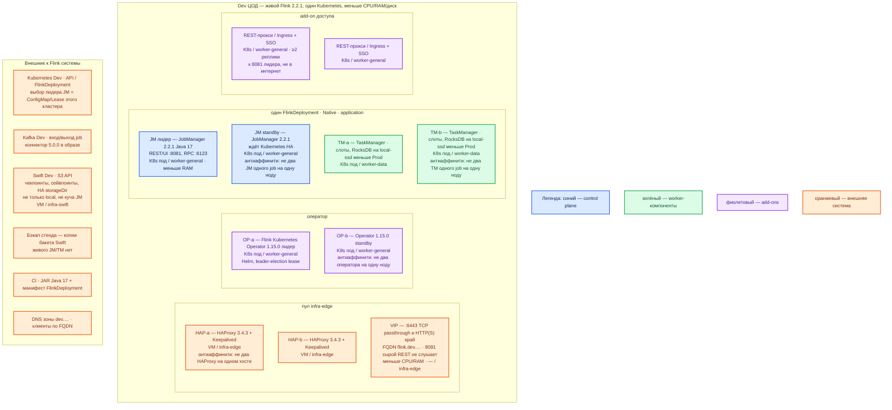

# Apache Flink 2.2.1 — Dev

Контур: **Dev** (1 ЦОД). Это **уменьшенный Prod**, не другой вид инсталляции: тот же Helm-оператор **1.15.0**, тот же Native `FlinkDeployment`, тот же JM+standby, те же чекпоинты в Swift. Не Docker Compose JM+TM, не quickstart с одной машины, не `flink:latest`.

**JobManager** — планировщик (граф, чекпоинты, REST **8081**). **TaskManager** — рабочий (слоты, RocksDB, Kafka). **Чекпоинт** — автоснимок состояния. **FlinkDeployment** — декларация для оператора.

## Допущения

1. Механизм и роль-модель как в `Apache Flink.prod.md`. Уменьшают CPU/RAM/тома, не число ролей: оператор **2** реплики с leader election, JM **2** (лидер+standby), TM **≥2** на **2** нодах. Схема «1 контейнер JM + 1 контейнер TM в Docker-сети» из `Apache Flink.install.md` — учебный стенд, **не** этот контур: на нём не воспроизводятся выборы лидера, выгрузка снимка в Swift и отказ одной ноды.
2. Один прикладной ЦОД. Stretch нет. Отдельного ЦОДа бэкапов нет: снимки бакетов — внешнее к стенду, не третий TM.
3. Версии те же: Flink **2.2.1**, образ **`flink:2.2.1-java17`**, оператор **1.15.0**, Kafka Connector **5.0.0** (`5.0.0-2.2`). Не 2.3.0. Java 21 экспериментальна — не брать. ([релиз оператора](https://flink.apache.org/2026/05/26/apache-flink-kubernetes-operator-1.15.0-release-announcement/), [Java](https://nightlies.apache.org/flink/flink-docs-release-2.2/docs/deployment/java_compatibility/))
4. Чекпоинты и `high-availability.storageDir` — Swift Dev по S3 (`s3p://`), не куча JM и не только local. RocksDB — `local-ssd` (тома меньше). `shared-fs` для снимков не берём. ([checkpoints](https://nightlies.apache.org/flink/flink-docs-release-2.2/docs/ops/state/checkpoints/), [S3](https://nightlies.apache.org/flink/flink-docs-release-2.2/docs/deployment/filesystems/s3/))
5. Пара HAProxy 3.4.3 + Keepalived + VIP та же по роли, меньше CPU/RAM. Сырой **8081** на VIP и в интернет не публикуем: REST без auth клиента. ([SSL](https://nightlies.apache.org/flink/flink-docs-release-2.2/docs/deployment/security/security-ssl/))
6. DNS: CoreDNS / `cluster.local`; снаружи зона `dev.…`. Клиенты по FQDN.
7. Ёмкость: в мануале минимума для боя нет. Заводские JM **1600m** / TM **1728m** — пол, чтобы процессы стартовали. Dev может держаться около этого порядка (плюс оператор и прокси); не «одна VM Compose вместо оператора». Уточняется замером. ([config.yaml](https://github.com/apache/flink/blob/release-2.2.1/flink-dist/src/main/resources/config.yaml))
8. Kafka — стенд **этой** площадки. Тот же запрет двух job с одним `transactionalIdPrefix`.

## Схема инстансов

Вид тот же, что Prod, в одном ЦОДе. Нет потоков данных. Нет второго живого Flink «через город».

ОС — свойство платформы, не пода. Один стандарт Linux на всех нодах контура.

Исключение вендора по ОС ноды Flink **не** заявлено: тот же контейнер `flink:2.2.1-java17`, что Prod. Не Docker Desktop как «кластер Dev». ([Docker Hub](https://hub.docker.com/_/flink))

| Имя пула | Роль | Зачем выделен |
|---|---|---|
| `infra-edge` | edge-VM | Та же пара HAProxy + Keepalived + VIP, меньше CPU/RAM. Сырой `:8081` и Kafka `:9092` не публикуем. |
| `worker-general` | general | Оператор (2 реплики), JM лидер+standby, REST-прокси (≥2). Не одна нода «всё в одном». |
| `worker-data` | data-localdisk | Два TM на двух нодах, `local-ssd` меньшего размера. Не Compose-контейнер на laptop. |
| `infra-swift` | vendor | Swift Dev для чекпоинтов. Не emptyDir как единственный снимок. |
| `control-plane` | control-plane | Kubernetes Dev (кворум etcd — карточка Kubernetes). Flink его не ставит. |

Что уменьшили относительно Prod (вид инсталляции тот же):

| Параметр | Prod | Dev |
|---|---|---|
| ЦОДы со своим Flink | 2 независимых | 1 |
| Оператор | 2 реплики, election | **те же 2**, меньше CPU/RAM |
| JobManager | лидер + standby | **те же 2 роли** |
| TaskManager | ≥2 на worker-data | **те же ≥2**, меньше RAM и SSD |
| Чекпоинт | Swift S3 `s3p://` | **тот же механизм**, бакет меньше |
| REST 8081 | прокси + SSO, не интернет | **то же**; не `127.0.0.1` Docker-проброс «вместо» прокси в кластере |
| Память процессов | порядок выше заводских 1600m/1728m | около заводских + запас ОС/оператора |

Схема «2 JM без HA / 1 TM» на Dev **запрещена**: это другой класс системы, не уменьшенный Prod. JM HA — не кворум из трёх голосующих; третий JM на Dev не требуется (вендорный пример «три JM» — путь роста, не минимум). ([HA overview](https://nightlies.apache.org/flink/flink-docs-release-2.2/docs/deployment/ha/overview/))

## Комментарии к схеме

### HAP-a / HAP-b / VIP

**Функционал.** Вход Kubernetes `:6443` и HTTPS края Dev. UI Flink — FQDN `flink-job.dev.…` на VIP → REST-прокси → лидер JM.

**Критично.** Не публиковать `0.0.0.0:8081`. Учебный проброс `127.0.0.1:8081` из Docker-стенда сюда не копировать: здесь кластер и прокси, как на Prod. ([SSL](https://nightlies.apache.org/flink/flink-docs-release-2.2/docs/deployment/security/security-ssl/), [install учебный стенд](Out/Обработка данных/Apache Flink/Apache Flink.install.md))

### OP-a / OP-b — оператор 1.15.0

**Функционал.** Тот же контроллер, что Prod. Падение оператора бегущий job не роняет.

**Критично.** Helm **1.15.0**, `image.tag=1.15.0` (chart default `latest`). Leader election + `replicas: 2`. Не один под оператора «на Dev хватит». Native, не standalone. Не 2.3.0. ([Helm](https://nightlies.apache.org/flink/flink-kubernetes-operator-docs-release-1.15/docs/operations/helm/), [конфиг](https://nightlies.apache.org/flink/flink-kubernetes-operator-docs-release-1.15/docs/operations/configuration/))

### JM лидер / standby

**Функционал.** Планирование, чекпоинты, REST **8081**, RPC **6123**. Standby для смены лидера внутри **этого** Kubernetes.

**Критично.** `high-availability.type: kubernetes` + `storageDir` на Swift Dev. Без этого standby бесполезен, а падение JM теряет running job. Задание при смене лидера перезапускается. Память — одно поле process.size **или** flink.size; на Dev допустим порядок заводских **1600m**. Антиаффинити двух JM. ([Kubernetes HA](https://nightlies.apache.org/flink/flink-docs-release-2.2/docs/deployment/ha/kubernetes_ha/))

### TM-a / TM-b

**Функционал.** Слоты, RocksDB, Kafka Connector **5.0.0**, выгрузка чекпоинта в Swift.

**Критично.** Два TM на двух нодах `worker-data`: иначе ошибка shuffle/антиаффинити с Prod не воспроизведётся. `local-ssd` меньше, не NFS. Плагин S3 в образе до старта. PDB не снимать оба TM разом. Стабильные `uid` операторов.

### REST-прокси

**Функционал.** SSO/TLS к UI. Минимум 2 реплики (stateless).

**Критично.** Закрытый стенд ≠ «открыть 8081 отделу». Учебной учётки UI нет — менять нечего; защита = сеть + прокси.

### Kafka / Swift / CI

**Функционал.** Как Prod: шина этой площадки; бакет снимков; JAR из CI.

**Критично.** Чекпоинт на Dev **не** оставлять в куче JM «потому что стенд»: HA и restore тогда другой класс, чем Prod. Секреты брокера и Swift не в git. Два job — два префикса транзакций.

## Путь роста

Не включать сразу.

1. Вертикаль TM / диск RocksDB после замера, не третий ЦОД.
2. Добавить TM в том же Dev-кластере, когда слотов не хватает.
3. Autoscaler — после стабильного чекпоинта.
4. Не переключать Dev на Compose, «чтобы быстрее».

## Сильные и слабые места

**Сильная:** тот же оператор, те же роли JM/TM, тот же Swift-снимок — ошибка наката/HA/коннектора воспроизводится. Два TM и два оператора переживают отказ одной ноды как класс.

**Слабая:** меньше ёмкость — раньше упрётесь в RocksDB/память, чем на Prod; один ЦОД, нет независимого зала обработки; REST без прокси так же опасен, как в бою.

## Критичные условия

- Docker Compose / `docker run` JM+TM вместо оператора.
- Один TM или два JM на одной ноде «на Dev так проще».
- Чекпоинт только local / куча JM.
- **8081** в интернет.
- `latest` / 2.3.0 / Java 21.
- Stretch на несуществующий второй ЦОД Dev.
- Два job с одним `transactionalIdPrefix`.

## Источники

Те же URL, что в `Apache Flink.prod.md`. Кратко:

- Оператор 1.15.0 / матрица 2.2.x: https://flink.apache.org/2026/05/26/apache-flink-kubernetes-operator-1.15.0-release-announcement/
- Helm, `image.tag`, `replicas`: https://nightlies.apache.org/flink/flink-kubernetes-operator-docs-release-1.15/docs/operations/helm/
- Leader election: https://nightlies.apache.org/flink/flink-kubernetes-operator-docs-release-1.15/docs/operations/configuration/
- Kubernetes HA: https://nightlies.apache.org/flink/flink-docs-release-2.2/docs/deployment/ha/kubernetes_ha/
- Чекпоинты: https://nightlies.apache.org/flink/flink-docs-release-2.2/docs/ops/state/checkpoints/
- S3-compatible: https://nightlies.apache.org/flink/flink-docs-release-2.2/docs/deployment/filesystems/s3/
- REST без auth: https://nightlies.apache.org/flink/flink-docs-release-2.2/docs/deployment/security/security-ssl/
- Kafka Connector 5.0.0: https://nightlies.apache.org/flink/flink-docs-release-2.2/docs/connectors/datastream/kafka/
- Образ Java 17: https://hub.docker.com/_/flink
- Учебный Docker (не этот контур): https://nightlies.apache.org/flink/flink-docs-release-2.2/docs/deployment/resource-providers/standalone/docker/
- Карточка / install / схемы: `Out/Обработка данных/Apache Flink/`, `sample/Apache Flink.md`

**В доке вендора нет:** CPU/RAM «хватит для Dev-нагрузки»; порог RTT; заводской пароль UI.
