# Apache Flink 2.2.1 — Prod

Контур: **Prod** (2 прикладных ЦОДа + 1 ЦОД под бэкапы). Роль продукта: **потоковый движок** в Kubernetes площадки. Читает и пишет **Kafka**, хранит рабочие окна в TaskManager, снимает чекпоинты в **Swift**. Не шина, не эталон карточек, не Camunda, не интеграционное API.

**JobManager (JM)** — процесс-планировщик: принимает задание, строит граф, координирует чекпоинты, отдаёт REST/Web UI на порту **8081**. **TaskManager (TM)** — процесс-рабочий: читает события, считает окна, пишет результат. **Чекпоинт** — автоматический согласованный снимок состояния и позиций Kafka для восстановления после сбоя. **Сейвпоинт** — снимок, который снимают люди перед сменой версии или графа. **FlinkDeployment** — объект Kubernetes, в котором оператору описывают кластер и задание. **Режим приложения** — один живой кластер Flink на одно приложение.

## Допущения

1. На каждом прикладном ЦОДе — **свой** Kubernetes и **свой** живой Flink. Stretch одного JM/TM на 2–3 ЦОДа **нет**: shuffle, RPC и чекпоинт чувствительны к сети, порога RTT в документации Flink **нет**. ([HA overview](https://nightlies.apache.org/flink/flink-docs-release-2.2/docs/deployment/ha/overview/), карточка `Apache Flink.md`)
2. ЦОД-бэкапы **не** получает живой JobManager. Туда копируют бакеты Swift (чекпоинты, сейвпоинты, `high-availability.storageDir`). Падение ЦОДа Flink = остановка обработки, пока job не поднимут в другом зале из чекпоинта и не переиграют **локальный** топик Kafka той площадки. ([схемы](Out/Обработка данных/Apache Flink/Apache Flink.shema.md))
3. Установка: **Helm Apache Flink Kubernetes Operator 1.15.0**, режим **Native**, `FlinkDeployment` в **режиме приложения**. Образ задания: **`flink:2.2.1-java17`**. Java **17** рекомендуется; Java 21 в 2.2 экспериментальна — в бой не брать. Не Docker Compose, не quickstart JM+TM на одной VM, не тег `latest` (на Docker Hub это **2.3.0**; матрица оператора 1.15.0 линейку 2.3 **не** перечисляет). ([релиз оператора](https://flink.apache.org/2026/05/26/apache-flink-kubernetes-operator-1.15.0-release-announcement/), [Java](https://nightlies.apache.org/flink/flink-docs-release-2.2/docs/deployment/java_compatibility/), [Docker Hub](https://hub.docker.com/_/flink))
4. Выбор лидера JM — **Kubernetes HA Services** этого кластера (`high-availability.type: kubernetes`). ZooKeeper для HA **не** ставим. Для HA обязателен внешний каталог: `high-availability.storageDir` на объектном хранилище, не куча JobManager. Standby JM ускоряет смену лидера; задание **всё равно перезапускается**. ([Kubernetes HA](https://nightlies.apache.org/flink/flink-docs-release-2.2/docs/deployment/ha/kubernetes_ha/), [overview оператора](https://nightlies.apache.org/flink/flink-kubernetes-operator-docs-release-1.15/docs/concepts/overview/))
5. Чекпоинты — **FileSystemCheckpointStorage** в Swift по S3 API (`s3p://` / плагин Presto). `JobManagerCheckpointStorage` (куча JM) — development / крошечное состояние, для HA вендор его **не** рекомендует. ForSt в 2.2 experimental — в бой не брать. RocksDB — локальный backend на SSD ноды (`local-ssd`), не NFS и не единственный диск чекпоинтов. ([checkpoints](https://nightlies.apache.org/flink/flink-docs-release-2.2/docs/ops/state/checkpoints/), [S3](https://nightlies.apache.org/flink/flink-docs-release-2.2/docs/deployment/filesystems/s3/))
6. Kafka Connector **5.0.0** (`flink-connector-kafka:5.0.0-2.2`) кладётся в JAR/образ **до** сдачи, в дистрибутив не входит. Шина — Kafka **этой** площадки. Два живых job с одним `transactionalIdPrefix` на одном кластере брокеров — конфликт. ([Kafka connector](https://nightlies.apache.org/flink/flink-docs-release-2.2/docs/connectors/datastream/kafka/))
7. Нагрузка **не замерена**. Ниже — минимальная отказоустойчивая топология (JM+standby, ≥2 TM), не «все ручки масштаба». Цифр «хватит для терабайтов» в мануале **нет**. Заводские `jobmanager.memory.process.size` **1600m** и `taskmanager.memory.process.size` **1728m** — чтобы процесс с заводским конфигом стартовал, не смета боя. ([config.yaml 2.2.1](https://github.com/apache/flink/blob/release-2.2.1/flink-dist/src/main/resources/config.yaml), [память](https://nightlies.apache.org/flink/flink-docs-release-2.2/docs/deployment/memory/mem_setup/))
8. Сеть в деталях вне рамок. Пара **HAProxy 3.4.3 + Keepalived + VIP** на каждый прикладной ЦОД: ControlPlaneEndpoint Kubernetes `:6443` (TCP passthrough) и край HTTP(S). Kafka `:9092` через этот HAProxy **не** публикуем. REST Flink **8081** на VIP «как есть» **не** вешаем: штатный REST клиента не аутентифицирует. ([SSL / REST](https://nightlies.apache.org/flink/flink-docs-release-2.2/docs/deployment/security/security-ssl/))
9. DNS: внутри CoreDNS / `cluster.local`; снаружи зона `prod.…`. Клиенты (люди, CI, Kafka advertised) — по FQDN, не Pod IP.
10. StorageClass: `local-ssd` (RWO) для локального RocksDB TM; `shared-fs` (RWX) для чекпоинтов Flink **не** берём. Swift — на своих дисках, не CSI. На схеме показан **один** типичный `FlinkDeployment`; каждое следующее приложение — свой объект, свой JM+standby, свои TM.

## Схема инстансов

На схеме нет потоков данных. ЦОД-1 и ЦОД-2 — две копии одной роль-модели, разные Kubernetes, разная Kafka, разные бакеты Swift. Синий — управляющие роли Flink (JM лидер и standby). Зелёный — рабочие TM. Фиолетовый — оператор и REST-прокси. Оранжевый — внешнее (VIP, Kubernetes, Kafka, Swift, ЦОД-бэкапы).

```mermaid
flowchart TB
  subgraph DC1["ЦОД-1 — живой Flink 2.2.1, один Kubernetes"]
    subgraph EDGE1["пул infra-edge"]
      HAP1A["HAP-1a — HAProxy 3.4.3 + Keepalived<br/>VM / infra-edge<br/>антиаффинити: не два HAProxy на одном хосте"]
      HAP1B["HAP-1b — HAProxy 3.4.3 + Keepalived<br/>VM / infra-edge"]
      VIP1["VIP-1 — :6443 TCP passthrough и HTTP(S) край<br/>FQDN flink.prod.… · 8081 сырой REST не слушает<br/>— / infra-edge"]
    end
    subgraph OP1["оператор"]
      OP1A["OP-1a — Flink Kubernetes Operator 1.15.0 лидер<br/>K8s под / worker-general<br/>Helm, leader-election lease"]
      OP1B["OP-1b — Operator 1.15.0 standby<br/>K8s под / worker-general<br/>антиаффинити: не два оператора на одну ноду"]
    end
    subgraph FL1["один FlinkDeployment · Native · application"]
      JM1A["JM-1 лидер — JobManager 2.2.1 Java 17<br/>REST/UI :8081, RPC :6123<br/>K8s под / worker-general"]
      JM1B["JM-1 standby — JobManager 2.2.1<br/>ждёт Kubernetes HA<br/>K8s под / worker-general<br/>антиаффинити: не два JM одного job на одну ноду"]
      TM1A["TM-1a — TaskManager · слоты, RocksDB на local-ssd<br/>K8s под / worker-data"]
      TM1B["TM-1b — TaskManager · слоты, RocksDB на local-ssd<br/>K8s под / worker-data<br/>антиаффинити: не два TM одного job на одну ноду"]
    end
    subgraph ADD1["add-on доступа"]
      PRX1A["REST-прокси / Ingress + SSO<br/>K8s / worker-general · ≥2 реплики<br/>к 8081 лидера, не в интернет"]
      PRX1B["REST-прокси / Ingress + SSO<br/>K8s / worker-general"]
    end
  end

  subgraph DC2["ЦОД-2 — независимый живой кластер, та же роль-модель"]
    subgraph EDGE2["пул infra-edge"]
      HAP2A["HAP-2a — HAProxy 3.4.3 + Keepalived<br/>VM / infra-edge"]
      HAP2B["HAP-2b — HAProxy 3.4.3 + Keepalived<br/>VM / infra-edge"]
      VIP2["VIP-2 — свой FQDN зоны prod.…<br/>— / infra-edge"]
    end
    subgraph OP2["оператор"]
      OP2A["OP-2a — Operator 1.15.0 лидер<br/>K8s под / worker-general"]
      OP2B["OP-2b — Operator 1.15.0 standby<br/>K8s под / worker-general"]
    end
    subgraph FL2["свой FlinkDeployment"]
      JM2A["JM-2 лидер — JobManager 2.2.1<br/>K8s под / worker-general"]
      JM2B["JM-2 standby — JobManager 2.2.1<br/>K8s под / worker-general"]
      TM2A["TM-2a — TaskManager · local-ssd<br/>K8s под / worker-data"]
      TM2B["TM-2b — TaskManager · local-ssd<br/>K8s под / worker-data"]
    end
    subgraph ADD2["add-on доступа"]
      PRX2["REST-прокси / Ingress + SSO<br/>K8s / worker-general · ≥2 реплики"]
    end
  end

  subgraph EXT["Внешние к Flink системы"]
    K8S["Kubernetes площадки · API / FlinkDeployment<br/>выбор лидера JM = ConfigMap/Lease этого кластера"]
    KF1["Kafka ЦОД-1 · вход/выход job<br/>коннектор 5.0.0 в образе, не под Flink"]
    KF2["Kafka ЦОД-2 · свой кластер брокеров"]
    SW1["Swift ЦОД-1 · S3 API<br/>чекпоинты, сейвпоинты, HA storageDir<br/>VM / infra-swift · не CSI"]
    SW2["Swift ЦОД-2 · свой бакет"]
    BAK["ЦОД-бэкапы — копии бакетов Swift<br/>живого JM/TM нет"]
    CI["CI · JAR Java 17 + манифест FlinkDeployment"]
    DNS["DNS зоны prod.… · клиенты по FQDN"]
  end

  LEGCORE["Легенда: синий — control plane"]
  LEGWORK["зелёный — worker-компоненты"]
  LEGADD["фиолетовый — add-ons"]
  LEGEXT["оранжевый — внешняя система"]

  classDef core fill:#dbeafe,stroke:#2563eb,color:#172554,stroke-width:2px;
  classDef worker fill:#dcfce7,stroke:#16a34a,color:#14532d,stroke-width:2px;
  classDef addon fill:#f3e8ff,stroke:#9333ea,color:#581c87,stroke-width:2px;
  classDef external fill:#ffedd5,stroke:#ea580c,color:#7c2d12,stroke-width:2px;

  class JM1A,JM1B,JM2A,JM2B,LEGCORE core;
  class TM1A,TM1B,TM2A,TM2B,LEGWORK worker;
  class OP1A,OP1B,OP2A,OP2B,PRX1A,PRX1B,PRX2,LEGADD addon;
  class HAP1A,HAP1B,VIP1,HAP2A,HAP2B,VIP2,K8S,KF1,KF2,SW1,SW2,BAK,CI,DNS,LEGEXT external;
```

ОС — свойство платформы, не пода. Один стандарт Linux на всех нодах контура.

Исключение вендора по ОС ноды Flink **не** заявлено: рантайм — контейнер `flink:2.2.1-java17` (Linux/amd64 или arm64). Windows как сервер Flink в этой установке не используется. ([Docker Hub](https://hub.docker.com/_/flink))

| Имя пула | Роль | Зачем выделен |
|---|---|---|
| `infra-edge` | edge-VM | Пара HAProxy 3.4.3 + Keepalived + VIP площадки: `:6443` Kubernetes и HTTP(S) край. Kafka `:9092` и сырой Flink `:8081` сюда не публикуем. |
| `worker-general` | general | Оператор, JobManager (лидер и standby), REST-прокси. Без ставки на локальный SSD под RocksDB. |
| `worker-data` | data-localdisk | TaskManager с RocksDB на StorageClass `local-ssd` (RWO, CSI). Не NFS, не `shared-fs` как диск состояния. |
| `infra-swift` | vendor | Кольцо Swift площадки (отдельный продукт). Чекпоинты Flink пишутся в него по S3, не через PVC. |
| `control-plane` | control-plane | Ноды kube-apiserver/etcd площадки. На схеме как внешнее: Flink их не ставит, но JM HA живёт в API этого кластера. |

## Комментарии к схеме

### HAP-* / VIP — `infra-edge` (каждый прикладной ЦОД)

**Функционал.** Стабильный вход площадки: Kubernetes API и HTTPS. Люди к UI Flink ходят на FQDN зоны `prod.…` (например `flink-job.prod.…`), не на Pod IP JobManager.

**Критично.** TCP `:6443` — passthrough до kube-apiserver, TLS API не терминировать на HAProxy. Kafka `:9092` через этот HAProxy не публиковать. **Не** балансировать `8081` JobManager «как HTTP без auth на VIP»: REST принимает любого клиента. Вендор советует REST на loopback/интерфейс пода + прокси с нормальной аутентификацией (Envoy / NGINX). mTLS REST есть, но рекомендация всё равно прокси. ([SSL Setup](https://nightlies.apache.org/flink/flink-docs-release-2.2/docs/deployment/security/security-ssl/), [REST](https://nightlies.apache.org/flink/flink-docs-release-2.2/docs/ops/rest_api/))

### OP-* — Apache Flink Kubernetes Operator 1.15.0

**Функционал.** Контроллер: смотрит `FlinkDeployment`, создаёт и обновляет JM/TM, сейвпоинты, жизненный цикл. Сам поток событий не считает. Падение оператора **не** роняет уже бегущие job.

**Критично.**

- Helm-репозиторий **1.15.0**, не `latest`. Пример: `helm repo add … https://archive.apache.org/dist/flink/flink-kubernetes-operator-1.15.0/` и `--set image.tag=1.15.0`. В chart `image.tag` по умолчанию **`latest`**. ([Helm](https://nightlies.apache.org/flink/flink-kubernetes-operator-docs-release-1.15/docs/operations/helm/), [архив 1.15.0](https://archive.apache.org/dist/flink/flink-kubernetes-operator-1.15.0/), [релиз](https://flink.apache.org/2026/05/26/apache-flink-kubernetes-operator-1.15.0-release-announcement/))
- `replicas` оператора по умолчанию **1**; больше 1 — только после `kubernetes.operator.leader-election.enabled: true` и уникального `lease-name`. Два активных контроллера без election — конфликт. На Prod: **2** реплики на **2** нодах `worker-general`. ([конфиг оператора](https://nightlies.apache.org/flink/flink-kubernetes-operator-docs-release-1.15/docs/operations/configuration/))
- Матрица: **2.2.x**, 2.1.x, 2.0.x, 1.20.x, 1.19.x. Flink **2.3.0** с этим оператором в бой на Kubernetes не брать.
- Режим кластера: **`native`** (по умолчанию). Standalone `--host` IP пода ломает leader election. ([CR overview](https://nightlies.apache.org/flink/flink-kubernetes-operator-docs-release-1.15/docs/custom-resource/overview/))
- Секреты не класть открытым текстом в CR: оператор логирует diff. ([схемы / FLINK-30306](https://nightlies.apache.org/flink/flink-kubernetes-operator-docs-release-1.15/docs/concepts/overview/))
- Webhook по умолчанию включён и требует cert-manager; без него — `--set webhook.create=false`, как в анонсе 1.15.0. Цифр CPU/RAM оператора «хватит для боя» в мануале нет.

### JM лидер и JM standby — `worker-general`

**Функционал.** Лидер принимает задание, планирует слоты, координирует чекпоинты, отдаёт REST/UI **8081** и внутренний RPC **6123**. Standby ждёт роль лидера.

**Критично.**

- `jobManager.replicas: 2` (1 лидер + 1 standby). Без HA вендор требует replicas = 1. Нужны `high-availability.type: kubernetes`, `high-availability.storageDir` на Swift и `kubernetes.cluster-id`. Указатель на метаданные — в Kubernetes; сами JobGraph/JAR/завершённые чекпоинты — в `storageDir`. ([Kubernetes HA](https://nightlies.apache.org/flink/flink-docs-release-2.2/docs/deployment/ha/kubernetes_ha/), [JobManagerSpec](https://nightlies.apache.org/flink/flink-kubernetes-operator-docs-release-1.15/docs/custom-resource/reference/))
- Антиаффинити: два JM одного `FlinkDeployment` не сажать на одну ноду.
- Режим приложения: один `FlinkDeployment` на приложение, если нужен запас лидера. Session-кластер на старте не берём.
- Память: одно из `jobmanager.memory.process.size` **или** `jobmanager.memory.flink.size`, не оба. Заводские **1600m** — пол процесса, не смета. Prod: порядок величины **выше** заводского после замера; в мануале «N ядер на терабайт» нет. ([память](https://nightlies.apache.org/flink/flink-docs-release-2.2/docs/deployment/memory/mem_setup/))
- `8081` слушать на интерфейсе пода / loopback; наружу — только через REST-прокси с SSO. Встроенного логина/пароля UI в документации 2.2 как заводского режима нет.
- RPC **6123** клиентам платформы не открывать. NetworkPolicy «только 6123» внутренний обмен TM не закрывает: blob и data-порты часто динамические. ([config / network](https://nightlies.apache.org/flink/flink-docs-release-2.2/docs/deployment/config/))

### TM-a / TM-b — `worker-data`

**Функционал.** Слоты, операторы задания, локальное состояние (RocksDB), чтение/запись Kafka, выгрузка чекпоинта в Swift. Плагин S3 (`flink-s3-fs-presto`, схема `s3p://`) и Kafka Connector **5.0.0** загружаются в процесс из образа/JAR.

**Критично.**

- Минимум **2** TM на **2** нодах: отказ одной ноды не снимает все слоты сразу; shuffle между подами воспроизводится. Пустые TM без слотов job не ускоряют. Параллелизм ограничен партициями входного топика.
- RocksDB — локальный SSD (`local-ssd` RWO). NFS как рабочий диск TM не описываем и не берём. Локальное состояние **не** заменяет чекпоинт в Swift: падение пода = восстановление из последнего успешного снимка.
- Память TM: `taskmanager.memory.process.size` **или** `flink.size`, не оба. Заводские **1728m** — старт процесса. Prod: вертикаль TM и размер RocksDB сначала, параллелизм — после замера потока. ([память](https://nightlies.apache.org/flink/flink-docs-release-2.2/docs/deployment/memory/mem_setup/))
- PDB: не выселять все TM одного job разом.
- `uid` операторов со состоянием — стабильные, иначе сейвпоинт после смены кода не встанет.
- Ключи Swift / SASL Kafka — Secret/Vault, не git и не текст CR.

### REST-прокси / Ingress

**Функционал.** TLS, SSO, ограничение круга людей и CI к UI/REST. Две реплики на двух нодах `worker-general`.

**Критично.** Без прокси открытый `8081` = панель управления кластером (остановить job, снять сейвпоинт, сдать JAR). Артефакт в Prod — из CI, не «с ноутбука в открытый 8081».

### Kafka площадки

**Функционал.** Вход и типичный выход job. Flink лог «навсегда» не хранит.

**Критично.** Bootstrap — брокеры **этого** ЦОДа, advertised listeners — FQDN зоны `prod.…`. Заводской `KafkaSink` — `DeliveryGuarantee.NONE`. «Поставили Flink, значит ровно один раз» — неверно. EXACTLY_ONCE = чекпоинт + транзакции Kafka + уникальный `transactionalIdPrefix` + `read_committed` у потребителей. Retention топика короче дыры без чекпоинта — offset указывает в вычищенный лог. ([Kafka connector](https://nightlies.apache.org/flink/flink-docs-release-2.2/docs/connectors/datastream/kafka/))

### Swift площадки — `infra-swift`

**Функционал.** Долговечные чекпоинты, сейвпоинты и `high-availability.storageDir`. Клиент Flink — S3-совместимый endpoint Swift (`s3.endpoint`, при необходимости `s3.path.style.access: true`). Плагин кладётся в **образ до** старта. Presto (`s3p://`) вендор рекомендует именно для checkpointing. ([S3](https://nightlies.apache.org/flink/flink-docs-release-2.2/docs/deployment/filesystems/s3/))

**Критично.** Не PVC `shared-fs` и не куча JM как единственное хранилище снимков. Бакет должен переживать смерть зала job: иначе restore не из Flink. Топология самого Swift — инструкция Swift, не этого файла.

### ЦОД-бэкапы

**Функционал.** Холодные копии бакетов (чекпоинты, сейвпоинты, HA-метаданные).

**Критично.** Живой JM сюда не ставить и не добавлять TM «третьей площадкой shuffle». Stretch нет. Два независимых Flink на ЦОД-1 и ЦОД-2 не дают единую exactly-once картинку на город.

### CI

**Функционал.** Сборка JAR на Java **17**, публикация образа с коннектором и S3-плагином, `kubectl`/`GitOps` объекта `FlinkDeployment`.

**Критично.** Не `flink:latest`. Не Java 21 как рантайм этого контура.

## Путь роста

Не включать в день 1.

1. Добавить TaskManager (и слоты) в **том же** ЦОДе, когда CPU операторов упёрся; параллелизм не больше партиций входа.
2. Увеличить `taskmanager.memory.process.size` и локальный SSD под RocksDB после замера размера state (окна/join, не «терабайты озера»).
3. Новый поток — **новый** `FlinkDeployment` (свой JM+standby), не второй job с тем же `transactionalIdPrefix`.
4. Autoscaler оператора — после стабильного чекпоинта, не в день первого деплоя.
5. Между ЦОДами: холодный restore из бакета + replay Kafka площадки, не stretch TM.

## Сильные и слабые места

**Сильная:** официальный оператор под наш Kubernetes; Native HA без ZooKeeper; отказ одного JM не SPOF при standby и `storageDir` на Swift; shuffle внутри одного ЦОДа; Dev может повторить тот же вид инсталляции.

**Слабая:** падение ЦОДа останавливает обработку до ручного restore; смена лидера JM всё равно рестартует job; RTO restore нужно измерить на вашем RocksDB; REST без прокси беззащитен; цифр ёмкости под нагрузку в мануале нет.

## Критичные условия

- **8081** в интернет или сырой на VIP.
- Чекпоинт только локально / в куче JM при HA.
- `flink:latest` / Flink **2.3.0** на операторе **1.15.0**.
- Docker Compose JM+TM «как Prod».
- Один живой кластер Flink на три ЦОДа.
- Два job с одним `transactionalIdPrefix` на одну Kafka.
- NFS как диск RocksDB / etcd-подобных данных TM.
- Секреты в тексте `FlinkDeployment`.
- ForSt и Java 21 как боевой рантайм 2.2.

## Источники

- Релиз Flink **2.2.1**: https://flink.apache.org/2026/05/15/apache-flink-2.2.1-release-announcement/
- Оператор **1.15.0**, матрица **2.2.x**: https://flink.apache.org/2026/05/26/apache-flink-kubernetes-operator-1.15.0-release-announcement/
- Helm 1.15.0: https://archive.apache.org/dist/flink/flink-kubernetes-operator-1.15.0/
- Helm-параметры, `replicas`, `image.tag=latest`: https://nightlies.apache.org/flink/flink-kubernetes-operator-docs-release-1.15/docs/operations/helm/
- Leader election оператора: https://nightlies.apache.org/flink/flink-kubernetes-operator-docs-release-1.15/docs/operations/configuration/
- Native vs standalone, application: https://nightlies.apache.org/flink/flink-kubernetes-operator-docs-release-1.15/docs/custom-resource/overview/
- JobManager replicas / HA: https://nightlies.apache.org/flink/flink-kubernetes-operator-docs-release-1.15/docs/custom-resource/reference/
- Standby не бесшовный failover: https://nightlies.apache.org/flink/flink-kubernetes-operator-docs-release-1.15/docs/concepts/overview/
- Kubernetes HA, `storageDir`: https://nightlies.apache.org/flink/flink-docs-release-2.2/docs/deployment/ha/kubernetes_ha/
- HA overview: https://nightlies.apache.org/flink/flink-docs-release-2.2/docs/deployment/ha/overview/
- Чекпоинты, FileSystem vs JobManager storage: https://nightlies.apache.org/flink/flink-docs-release-2.2/docs/ops/state/checkpoints/
- S3 / S3-compatible, Presto `s3p://`, `s3.endpoint`: https://nightlies.apache.org/flink/flink-docs-release-2.2/docs/deployment/filesystems/s3/
- REST 8081: https://nightlies.apache.org/flink/flink-docs-release-2.2/docs/ops/rest_api/
- REST без auth клиента, прокси: https://nightlies.apache.org/flink/flink-docs-release-2.2/docs/deployment/security/security-ssl/
- Kafka Connector 5.0.0-2.2: https://nightlies.apache.org/flink/flink-docs-release-2.2/docs/connectors/datastream/kafka/
- Загрузки коннектора: https://flink.apache.org/downloads/
- Java 17 / Java 21 experimental: https://nightlies.apache.org/flink/flink-docs-release-2.2/docs/deployment/java_compatibility/
- Образ `flink:2.2.1-java17`: https://hub.docker.com/_/flink
- Память process.size: https://nightlies.apache.org/flink/flink-docs-release-2.2/docs/deployment/memory/mem_setup/
- Заводские 1600m / 1728m: https://github.com/apache/flink/blob/release-2.2.1/flink-dist/src/main/resources/config.yaml
- Карточка, установка, схемы: `Out/Обработка данных/Apache Flink/Apache Flink.md`, `Apache Flink.install.md`, `Apache Flink.shema.md`, `sample/Apache Flink.md`

**В доке вендора нет:** CPU/RAM «хватит для терабайтов»; порог RTT stretch JM/TM; заводской логин/пароль Web UI; число TM «для боя».
