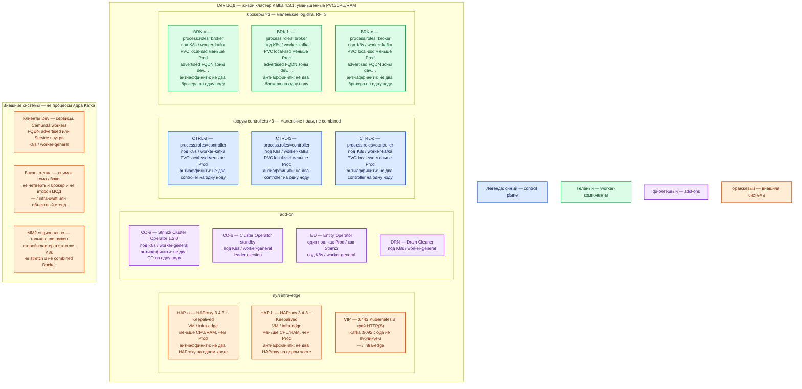

# Apache Kafka 4.3.1 + Strimzi 1.2.0 — развёртывание Dev

Dev — **уменьшенный Prod**, не другой вид инсталляции. Тот же механизм: **Kubernetes + Strimzi 1.2.0**, Kafka **4.3.1**, **KRaft isolated**: `KafkaNodePool` controllers ×3 и brokers ×3, RF=3. Не учебный `docker run apache/kafka:4.3.1` combined mode, не Docker Compose, не один брокер на одной ноде «по quickstart».

## Допущения

1. Контур Dev: **1 ЦОД**. Второго прикладного зала и отдельного ЦОД-бэкапов **нет**. Живого MirrorMaker 2 на чужой ЦОД нет. Снимок стенда — внешний бакет/том, не третий voter этого кластера.
2. Роль-модель **как в Prod**: оператор + 3 контроллера + 3 брокера + пара HAProxy+Keepalived+VIP. Уменьшают **CPU/RAM/размер PVC**, не число голосующих и не вид инсталляции. Схема «1 combined контейнер, RF=1» из `Apache Kafka.install.md` / `sample/Apache Kafka.md` **не** воспроизводит выборы контроллера, ISR, `acks=all` при `min.ISR=2` и накат Strimzi — для Task_6 она **запрещена**.
3. Кворум на Dev остаётся **нечётным: 3 маленьких controller**. Два контроллера — другой класс системы (нет большинства; отказ одного = тупик). Брокеров тоже **три** (иначе RF=3 и min.ISR=2 не те же, что в Prod). Не резать до одной replica «чтобы влезло».
4. Isolated mode тот же (`roles: [controller]` и `roles: [broker]` отдельно). На Dev **допустимо** посадить одну пару «controller + broker» на одну ноду `worker-kafka` (3 ноды вместо ~6 Prod) — это уменьшение числа машин, не combined-процесс и не смена оператора. Двух контроллеров или двух брокеров на одну ноду — нет.
5. StorageClass **те же имена**: `local-ssd` (RWO) для контроллеров и брокеров; `shared-fs` для Kafka **не** используем. Тома **меньше** Prod (порядок **десятков ГиБ**, не ТиБ). NFS / `emptyDir` — нет.
6. Версии: Kafka **4.3.1**, Strimzi **1.2.0**. Не `latest`. Не образ `apache/kafka:4.3.1` вместо оператора. Java 17/21/25 — внутри образа Strimzi.
7. Цифр ядер «для Dev-кластера» в мануале **нет**. Ориентир Apache ~5 ГиБ на типичный контроллер — для Dev можно меньше, но не «128 МиБ лишь бы встал». Кучу 6 ГиБ LinkedIn на маленький стенд не копировать. Ёмкость уточняется замером. ([KRaft](https://kafka.apache.org/43/operations/kraft/), [Java](https://kafka.apache.org/43/operations/java-version/))
8. Клиенты — по FQDN зоны `dev.…` (advertised listeners) или Service `*.svc.cluster.local`. **Kafka `:9092` через HAProxy площадки не публикуем.** Stretch нет (один ЦОД).
9. Боевой SASL/SCRAM-SHA-512 поверх TLS **тот же класс**, что Prod (чтобы ловить ошибки сертификатов и ACL). Учебный PLAINTEXT из `docker run` не считать «Dev платформы». Пароли примеров вендора (`admin` / `admin-secret`) **не** копировать; свои секреты стенда, не git. ([SASL](https://kafka.apache.org/43/security/authentication-using-sasl/))
10. Чтобы воспроизвести ошибку MM2 — поднять **второй** маленький кластер в том же Dev-K8s (другой namespace) и `KafkaMirrorMaker2`. Это опция, не день 1. Пока второго кластера нет, MM2 не разворачиваем «в пустоту».

## Схема инстансов

Синий — управляющие/голосующие роли (KRaft controllers). Зелёный — data-инстансы (брокеры). Фиолетовый — оператор/add-on. Оранжевый — внешнее (VIP, клиенты, бакет). На схеме **нет** потоков данных.

ОС — свойство платформы, не пода. Один стандарт Linux на всех нодах контура.

Исключение вендора: то же, что Prod — Linux-контейнеры; нативная Windows не well supported. ([Hardware and OS](https://kafka.apache.org/43/operations/hardware-and-os/))

| Имя пула | Роль | Зачем выделен |
|---|---|---|
| `infra-edge` | edge-VM | Та же пара HAProxy 3.4.3 + Keepalived + VIP, меньше CPU/RAM. Не Kafka `:9092`. |
| `worker-general` | general | Оператор, Entity Operator, Drain Cleaner, клиенты. Без дисков Kafka. |
| `worker-kafka` | data-localdisk | **3 ноды**: на каждой не более одного controller и не более одного broker. **`local-ssd`**, тома меньше Prod. |
| `infra-swift` | vendor / object | Снимок стенда. Не PVC брокера. |

## Комментарии к схеме

### HAP-a / HAP-b и VIP

- **Функционал.** Как Prod: VIP = `:6443` Kubernetes и край HTTP(S). Клиентский протокол Kafka на VIP не публиковать.
- **Критично.** Пара на **двух** VM, не один HAProxy «для экономии» — иначе отказ входа не воспроизведётся. Клиенты Kafka — FQDN `dev.…` advertised брокеров или `cluster.local`, не Pod IP и не VIP `:9092`. ([listeners](https://kafka.apache.org/43/security/listener-configuration/))

### CO-a / CO-b — Cluster Operator 1.2.0

- **Функционал.** Тот же контроллер, что Prod: `Kafka` + два `KafkaNodePool`. Накат образа, PDB, rolling брокеров должны работать как в Prod — это класс ошибок, который Docker-quickstart **не** ловит. ([Cluster Operator](https://strimzi.io/docs/operators/1.2.0/deploying.html))
- **Критично.** Пин **1.2.0**. Не ставить оператор «только в Prod». Не копировать YAML одной replica из этапа 5 `.install.md`. Две реплики CO с leader election — как Prod (stateless standby). Свой оператор в этом единственном K8s.

### EO — Entity Operator

- **Функционал.** Topic Operator + User Operator в **одном** поде, как описывает Strimzi. Топики создавать явно (`KafkaTopic` или CLI), `auto.create.topics.enable=false` как в Prod — иначе Dev «сам создал RF=1» и баг боя не ловится.
- **Критично.** Не раздувать EO до двух реплик без страницы вендора. Секреты стенда не из примера `admin-secret`.

### DRN — Drain Cleaner

- **Функционал.** Как Prod: webhook на drain ноды `worker-kafka`. Нужен, чтобы отладка «вывели ноду» вела себя как в бою.

### CTRL-a / CTRL-b / CTRL-c

- **Функционал.** Три маленьких контроллера **isolated**. Кворум Raft метаданных. Controller listener наружу не публикуем.
- **Критично.** Именно **три**, не combined `broker,controller` и не два. Свои PVC `local-ssd`. Антиаффинити контроллеров. Strimzi 1.2.0 — **статический** quorum: не планировать «потом добавим контроллер на Dev». Два мёртвых из трёх — тот же отказ, что в Prod: нет активного контроллера, нет смены лидеров партиций. Ориентир диска/RAM — единицы ГиБ, меньше Prod, не «как у брокера с терабайтами». ([KRaft](https://kafka.apache.org/43/operations/kraft/))

### BRK-a / BRK-b / BRK-c

- **Функционал.** Три маленьких брокера, **RF=3**, `min.insync.replicas=2`. Produce/fetch, репликация ISR **внутри** этого ЦОДа.
- **Критично.**
  - Не заменять тройку одним контейнером `apache/kafka:4.3.1`: другая модель отказа, другой advertised listener, другой накат обновлений.
  - Те же ручки, что Prod: offsets.topic RF=3, unclean election off, топики явно. Клиентский код: `acks=all`, ключ партиции.
  - Advertised listeners — FQDN зоны **`dev.…`**, не `localhost:9092` из Docker-гайда и не Pod IP. Внутренние клиенты могут использовать bootstrap Service `*-kafka-bootstrap`.
  - PLAINTEXT только если явно помечено «закрытый мини-стенд внутри уже закрытого Dev»; для паритета с Prod предпочтителен SCRAM-SHA-512 + TLS.
  - Антиаффинити брокеров. На Dev колокация 1 controller + 1 broker на ноде **допустима**; тогда отказ одной ноды снимает и голос, и реплику — слабее dedicated Prod, но кворум 2/3 и ISR 2/3 ещё живы. Это не combined-процесс.
  - Кучу 6 ГиБ не копировать. RAM request > heap, остаток page cache, тома меньше.

### Клиенты / снимок / опциональный MM2

- Клиенты — FQDN, не VIP HAProxy.
- Снимок стенда не заменяет тройку брокеров.
- MM2 — только со вторым кластером в этом K8s; асинхронно, свои offsets. Не stretch.

## Ёмкость Dev (порядок, не смета вендора)

| Роль | Prod (порядок) | Dev |
|---|---|---|
| Controller | десятки ГиБ диска, единицы vCPU, RAM около оценки Apache 5 ГиБ с запасом | **меньше**: единицы ГиБ RAM и диск метаданных, тот же `local-ssd` |
| Broker | сотни ГиБ…ТиБ, RAM с запасом под page cache | **десятки ГиБ** диска, меньше CPU/RAM; куча не 6 ГиБ «как LinkedIn» |
| Ноды `worker-kafka` | ~6 (dedicated controller vs broker) | **3** (пара ролей на ноде, разные поды) |
| HAProxy | пара VM | та же пара, меньше CPU/RAM |

Уточняется замером. Учебные **2 vCPU / 8 ГБ / 30 ГБ** из `sample/Apache Kafka.md` — ориентир **одного** Docker-стенда, не «на весь Dev-кластер из шести подов».

## Путь роста

Как Prod, только позже и меньше: сначала вертикаль PVC/RAM, потом добавить брокер **внутри этого кластера** и переложить партиции. Второй Kafka-кластер + MM2 — когда нужно ловить ошибки зеркалирования. Не включать combined Docker «на время». Контроллеры не резать до двух.

## Сильные и слабые места; критичные условия

**Сильное:** тот же Strimzi, isolated KRaft, RF=3 и advertised FQDN — можно воспроизвести отказ ноды, выборы контроллера, ISR и ошибку «клиент пошёл не туда» после bootstrap. Не quickstart.

**Слабое:** колокация controller+broker на трёх нодах сильнее связывает отказ машины, чем dedicated Prod; нет второго ЦОДа — MM2 и failover площадки сами не проверятся; маленькие диски не доказывают терабайты и page cache под нагрузкой.

**Критично:**

- Не combined Docker / не Compose / не 1 replica Strimzi из `.install.md`.
- Не 2 контроллера. Не RF=1 как «Dev по умолчанию».
- Не NFS / не `shared-fs`. Не `:9092` на VIP HAProxy.
- Advertised = FQDN `dev.…`, не `127.0.0.1` и не Pod IP.
- Не `latest`. Не ZooKeeper.
- Пароли примеров SASL — не в этот контур.

## Источники

- Kafka 4.3.1: https://kafka.apache.org/43/
- KRaft (isolated vs combined; combined не для critical): https://kafka.apache.org/43/operations/kraft/
- Docker-стенд (что **не** копировать в этот Dev): https://kafka.apache.org/43/getting-started/docker/
- Listeners / advertised: https://kafka.apache.org/43/security/listener-configuration/
- Hardware and OS: https://kafka.apache.org/43/operations/hardware-and-os/
- Java / куча 6 ГиБ как чужой пример: https://kafka.apache.org/43/operations/java-version/
- SASL/SCRAM: https://kafka.apache.org/43/security/authentication-using-sasl/
- Strimzi 1.2.0, Kafka 4.3.1: https://strimzi.io/downloads/
- Configuring: https://strimzi.io/docs/operators/1.2.0/configuring
- Deploying (NodePool roles, static quorum, anti-affinity, MM2): https://strimzi.io/docs/operators/1.2.0/deploying.html
- Карточка: `Out/Бэкенд/Apache Kafka/Apache Kafka.md`; учебный install: `Apache Kafka.install.md`; Prod этого контура: `sample2/Apache Kafka.prod.md`

**В доке вендора нет (не выдумано):** минимум CPU/RAM «чтобы Strimzi-кластер из 3+3 подов встал»; порог RTT; разрешение заменить тройку контроллеров одним combined «для Dev платформы».
