# Apache Kafka 4.3.1 + Strimzi 1.2.0 — развёртывание Prod

**Apache Kafka** — распределённый журнал событий (топики и партиции на дисках брокеров), не эталон карточки и не Camunda. **KRaft** — встроенный механизм метаданных на Raft: контроллеры голосуют большинством; ZooKeeper в 4.3.1 нет. **Брокер** — процесс, который принимает produce/fetch и хранит сегменты лога. **Strimzi** — оператор Kubernetes: приводит ресурсы `Kafka` и `KafkaNodePool` к описанному состоянию; сам сообщения не обрабатывает. Это self-hosted Apache Kafka, не Confluent Platform и не облако вендора.

## Допущения

1. Контур Prod: **2 прикладных ЦОДа** (каждый со своим Kubernetes **1.36.4** и своим входом HAProxy) **+ 1 ЦОД под бэкапы**. Задержка между площадками **не измерена**. Stretch одного KRaft-кворума / одного живого кластера на 2–3 ЦОДа **нет**: порога допустимого RTT у Apache **нет**; `acks=all` не быстрее реплики в чужом дата-центре. ([KRaft](https://kafka.apache.org/43/operations/kraft/), карточка `Apache Kafka.md`)
2. На каждом прикладном ЦОДе — **свой** живой кластер Kafka **4.3.1** (KRaft isolated: тройка контроллеров отдельно от брокеров, RF=3). ЦОД-2 — не «третий контроллер» и не «четвёртая реплика партиции» кворума ЦОД-1. Между площадками — **MirrorMaker 2** (асинхронное копирование топиков) или **снимок**. Единого `bootstrap.servers` «на страну» нет.
3. ЦОД-бэкапы **не** входит в KRaft-кворум и **не** принимает клиентский `:9092` боя. Туда — снимки томов / отдельный sink-кластер. Репликация партиций **не** заменяет бэкап: `DeleteTopics` уедет на все ISR.
4. Способ установки — **Kubernetes + Strimzi 1.2.0** (матрица: Kafka **4.3.1**, проверенные Kubernetes **1.30–1.36**). Не пакеты на VM «вместо» оператора, не Docker Compose, не учебный `docker run apache/kafka:4.3.1` combined mode из `Apache Kafka.install.md`. В `.install.md` сейчас описан **только** учебный контейнер; боевой путь — роль консультанта, карточка, схемы и официальные страницы Apache/Strimzi.
5. Образы оператора и Kafka — из релиза Strimzi **1.2.0** (в т.ч. `quay.io/strimzi/kafka:1.2.0-kafka-4.3.1` как значение по умолчанию линейки). Не тег `latest`. Версия в `Kafka` CR: **4.3.1**. Java на брокерах **17 / 21 / 25** (внутри образа оператора; на ноды хостовую JDK не ставим). ([downloads](https://strimzi.io/downloads/), [Java](https://kafka.apache.org/43/operations/java-version/), [configuring](https://strimzi.io/docs/operators/1.2.0/configuring))
6. Нагрузка **не замерена**. Ниже — **минимальная отказоустойчивая** топология (кворум 3 контроллера, 3 брокера, RF=3), не «все возможности масштабирования вендора под терабайты». Цифр «хватит N брокеров на ваши терабайты» в мануале **нет**. Ёмкость — **порядок величины**, уточняется замером.
7. Официальный оператор под наш K8s есть, данные не требуют сырых дисков вне CSI → размещение **в Kubernetes**. Тома `log.dirs` брокера и `metadata.log.dir` контроллера — StorageClass **`local-ssd`** (RWO, локальный SSD, CSI). **`shared-fs` (RWX) для Kafka не используем.** NFS как единственный диск лога на этой платформе **не** ставят: в [Hardware and OS](https://kafka.apache.org/43/operations/hardware-and-os/) NFS **не назван**; там локальные POSIX (ориентиры XFS/ext4) и page cache.
8. Сеть в деталях (VLAN, IP-план) **вне рамок**. VIP HAProxy 3.4.3 + Keepalived = ControlPlaneEndpoint Kubernetes `:6443` (TCP passthrough) и край **HTTP(S)**. **Kafka `:9092` через этот HAProxy не публикуем**: клиент после bootstrap идёт **напрямую к лидеру партиции** по адресам из `advertised.listeners`. Advertised listeners — **FQDN зоны `prod.…`**, не Pod IP. Внутри кластера — CoreDNS / `cluster.local`.
9. Клиенты платформы (микросервисы, воркеры Camunda, интеграционное API, Flink, Connect) — **клиенты Kafka**, не часть брокера. Camunda / озеро / PostgreSQL — эталон и процессы живут отдельно.
10. Strimzi **1.2.0 для всех установок использует статический controller quorum** (динамический KIP-853 в этом операторе не включён). Число контроллеров на старте = 3 и **не** масштабируется штатно без ограничений оператора. ([KRaft limitations](https://strimzi.io/docs/operators/1.2.0/deploying.html))

## Схема инстансов

Синий — управляющие/голосующие роли продукта (KRaft controllers). Зелёный — рабочие/data-инстансы (брокеры). Фиолетовый — оператор/add-on. Оранжевый — внешнее (VIP, HAProxy, ЦОД-бэкапы, клиенты). На схеме **нет** потоков данных.

**Партиция** — упорядоченная часть топика и единица репликации. **RF (replication factor)** — число копий партиции. **ISR** — набор достаточно актуальных реплик. **Isolated mode** — у процесса только роль `controller` или только `broker`, не оба сразу.

```mermaid
flowchart TB
  subgraph DC1["ЦОД-1 — живой кластер Kafka 4.3.1 KRaft"]
    subgraph EDGE1["пул infra-edge"]
      HAP1A["HAP-1a — HAProxy 3.4.3 + Keepalived<br/>VM / infra-edge<br/>антиаффинити: не два HAProxy на одном хосте"]
      HAP1B["HAP-1b — HAProxy 3.4.3 + Keepalived<br/>VM / infra-edge<br/>антиаффинити: не два HAProxy на одном хосте"]
      VIP1["VIP-1 — :6443 Kubernetes и край HTTP(S)<br/>Kafka :9092 сюда не публикуем<br/>— / infra-edge"]
    end
    subgraph ADD1["add-on ЦОД-1"]
      CO1A["CO-1a — Strimzi Cluster Operator 1.2.0<br/>под K8s / worker-general<br/>антиаффинити: не два CO на одну ноду"]
      CO1B["CO-1b — Cluster Operator standby<br/>под K8s / worker-general<br/>leader election"]
      EO1["EO-1 — Entity Operator<br/>Topic Operator + User Operator<br/>под K8s / worker-general<br/>один под — как у Strimzi"]
      DRN1["DRN-1 — Drain Cleaner<br/>под K8s / worker-general"]
      MM1["MM2-1 — KafkaMirrorMaker2<br/>Connect workers ≥2<br/>под K8s / worker-general<br/>антиаффинити: не два worker на одну ноду"]
    end
    subgraph CTRL1["кворум KRaft controllers ×3 — isolated"]
      C1A["CTRL-1a — process.roles=controller<br/>под K8s / worker-kafka<br/>PVC local-ssd RWO<br/>антиаффинити: не два controller на одну ноду;<br/>не сажать с брокером"]
      C1B["CTRL-1b — process.roles=controller<br/>под K8s / worker-kafka<br/>PVC local-ssd RWO<br/>антиаффинити: не два controller на одну ноду;<br/>не сажать с брокером"]
      C1C["CTRL-1c — process.roles=controller<br/>под K8s / worker-kafka<br/>PVC local-ssd RWO<br/>антиаффинити: не два controller на одну ноду;<br/>не сажать с брокером"]
    end
    subgraph BRK1["брокеры ×3 — log.dirs"]
      B1A["BRK-1a — process.roles=broker<br/>под K8s / worker-kafka<br/>PVC local-ssd RWO<br/>advertised FQDN зоны prod.…<br/>антиаффинити: не два брокера на одну ноду"]
      B1B["BRK-1b — process.roles=broker<br/>под K8s / worker-kafka<br/>PVC local-ssd RWO<br/>advertised FQDN зоны prod.…<br/>антиаффинити: не два брокера на одну ноду"]
      B1C["BRK-1c — process.roles=broker<br/>под K8s / worker-kafka<br/>PVC local-ssd RWO<br/>advertised FQDN зоны prod.…<br/>антиаффинити: не два брокера на одну ноду"]
    end
  end

  subgraph DC2["ЦОД-2 — независимый живой кластер, тот же вид"]
    subgraph EDGE2["пул infra-edge"]
      HAP2A["HAP-2a — HAProxy 3.4.3 + Keepalived<br/>VM / infra-edge"]
      HAP2B["HAP-2b — HAProxy 3.4.3 + Keepalived<br/>VM / infra-edge"]
      VIP2["VIP-2 — :6443 и HTTP(S)<br/>Kafka :9092 сюда не публикуем<br/>— / infra-edge"]
    end
    subgraph ADD2["add-on ЦОД-2"]
      CO2["CO-2 — свой Cluster Operator 1.2.0<br/>под K8s / worker-general"]
      EO2["EO-2 — Entity Operator<br/>под K8s / worker-general"]
      MM2["MM2-2 — KafkaMirrorMaker2<br/>читает ЦОД-1, пишет в этот кластер<br/>под K8s / worker-general"]
    end
    subgraph CTRL2["свой кворум controllers ×3 — не член кворума ЦОД-1"]
      C2A["CTRL-2a — controller<br/>под K8s / worker-kafka<br/>PVC local-ssd"]
      C2B["CTRL-2b — controller<br/>под K8s / worker-kafka<br/>PVC local-ssd"]
      C2C["CTRL-2c — controller<br/>под K8s / worker-kafka<br/>PVC local-ssd"]
    end
    subgraph BRK2["свои брокеры ×3"]
      B2A["BRK-2a — broker<br/>под K8s / worker-kafka<br/>advertised FQDN этой площадки"]
      B2B["BRK-2b — broker<br/>под K8s / worker-kafka"]
      B2C["BRK-2c — broker<br/>под K8s / worker-kafka"]
    end
  end

  subgraph EXT["Внешние системы — не процессы ядра Kafka"]
    CLI["Клиенты — микросервисы, Camunda,<br/>интеграционное API, Flink<br/>FQDN advertised brokers, не VIP :9092<br/>K8s / worker-general"]
    BAK["ЦОД-бэкапы — снимок томов / sink<br/>не третий voter и не RF=4 этого кластера<br/>VM / infra-swift или отдельный K8s"]
  end

  LEGCORE["Легенда: синий — control plane"]
  LEGWORK["зелёный — worker-компоненты"]
  LEGADD["фиолетовый — add-ons"]
  LEGEXT["оранжевый — внешняя система"]

  classDef core fill:#dbeafe,stroke:#2563eb,color:#172554,stroke-width:2px;
  classDef worker fill:#dcfce7,stroke:#16a34a,color:#14532d,stroke-width:2px;
  classDef addon fill:#f3e8ff,stroke:#9333ea,color:#581c87,stroke-width:2px;
  classDef external fill:#ffedd5,stroke:#ea580c,color:#7c2d12,stroke-width:2px;

  class C1A,C1B,C1C,C2A,C2B,C2C,LEGCORE core;
  class B1A,B1B,B1C,B2A,B2B,B2C,LEGWORK worker;
  class CO1A,CO1B,EO1,DRN1,MM1,CO2,EO2,MM2,LEGADD addon;
  class HAP1A,HAP1B,VIP1,HAP2A,HAP2B,VIP2,CLI,BAK,LEGEXT external;
```

ОС — свойство платформы, не пода. Один стандарт Linux на всех нодах контура.

Исключение вендора: нативная Windows у Apache «not currently a well supported platform»; брокеры работают в Linux-контейнерах на Linux-нодах. Отдельного «ставьте Windows» нет. ([Hardware and OS](https://kafka.apache.org/43/operations/hardware-and-os/))

| Имя пула | Роль | Зачем выделен |
|---|---|---|
| `infra-edge` | edge-VM | Пара HAProxy 3.4.3 + Keepalived + VIP площадки: край HTTP(S) и ControlPlaneEndpoint Kubernetes. **Не** брокер Kafka `:9092`. |
| `worker-general` | general | Cluster Operator, Entity Operator, Drain Cleaner, MirrorMaker 2, клиентские сервисы. Без локальных дисков `log.dirs`. |
| `worker-kafka` | data-localdisk | Поды контроллеров и брокеров: CSI **`local-ssd`** RWO. В Prod контроллер и брокер **на разных нодах** пула (dedicated nodes). |
| `infra-swift` | vendor / object | Снимки / объектное хранилище ЦОДа бэкапов. Свои диски, не PVC Kafka. |

## Комментарии к схеме

### HAP-1a / HAP-1b и VIP-1 (то же на ЦОД-2: HAP-2*, VIP-2)

- **Функционал.** Пара балансировщиков площадки. VIP — имя, которое видят kubectl и HTTP(S)-клиенты края: **6443/TCP** passthrough к kube-apiserver и **80/443**. Данные топиков, реплики партиций и голоса KRaft HAProxy не хранит.
- **Критично.** Две VM, не один хост. На VIP **не** вешать клиентский протокол Kafka. «Один HAProxy `:9092` перед всеми брокерами» ломает модель: после bootstrap клиент подключается к **advertised** адресу лидера партиции, а не к общему HTTP-подобному входу. ([listener configuration](https://kafka.apache.org/43/security/listener-configuration/), `HAProxy.install.md`) Клиентам только FQDN зоны `prod.…`, не Pod IP.

### CO-1a / CO-1b (то же CO-2 — свой оператор этого Kubernetes)

- **Функционал.** Cluster Operator — контроллер: смотрит `Kafka`, `KafkaNodePool`, `KafkaMirrorMaker2` и создаёт поды/сервисы/тома. SQL/produce через него **не** идёт. Отказ оператора не стирает лог на PVC, но останавливает согласование (добавить брокер, сменить listener). ([Deploying the Cluster Operator](https://strimzi.io/docs/operators/1.2.0/deploying.html))
- **Критично.** Пин **1.2.0** (`strimzi-cluster-operator-1.2.0.yaml` / каталог `install/cluster-operator` релиза), не `latest`. Свой оператор в **каждом** K8s, не один контроллер на два ЦОДа. Завод манифеста — **1** реплика; для боя включаем **2** с leader election (`STRIMZI_LEADER_ELECTION_ENABLED` и Lease) — вторая в standby. ([multiple replicas](https://strimzi.io/docs/operators/1.2.0/deploying.html)) Не копировать YAML «1 replica / dual-role» из учебного раздела `.install.md`.

### EO-1 / EO-2 — Entity Operator

- **Функционал.** Один под Strimzi: контейнеры **Topic Operator** (объекты `KafkaTopic`) и **User Operator** (учётки/ACL `KafkaUser`). Не брокер и не кворум. ([Entity Operator](https://strimzi.io/docs/operators/1.2.0/deploying.html))
- **Критично.** Вендор описывает Entity Operator как **один под** на кластер Kafka. Вторую реплику EO не выдумываем. Отказ пода = пауза управления топиками/пользователями через CR, не останов produce. Секреты SCRAM — в Secret/Vault, не в git.

### DRN-1 — Drain Cleaner

- **Функционал.** Admission webhook: при cordon/drain ноды не даёт Kubernetes сразу убить брокер/контроллер в обход rolling и PDB. ([Drain Cleaner](https://strimzi.io/docs/operators/1.2.0/deploying.html))
- **Критично.** Без него «вежливый» drain K8s может снять лидеров партиций пачкой. Не заменяет anti-affinity и PDB.

### CTRL-1a / CTRL-1b / CTRL-1c (то же CTRL-2* — отдельный кворум)

- **Функционал.** Три пода `process.roles=controller` = нечётный кворум метаданных. Один активен, остальные горячий резерв. Клиентские записи **не** проходят через контроллеры. Controller listener (в примерах Apache часто **9093**) — только брокеры и контроллеры, наружу не публикуем. ([KRaft](https://kafka.apache.org/43/operations/kraft/))
- **Критично.**
  - Ресурс **`KafkaNodePool`** с `roles: [controller]`, `replicas: 3`. Не `broker,controller` (combined). Apache: combined «not recommended in critical deployment environments». Strimzi: в типичном production — dedicated broker и controller nodes. ([KRaft](https://kafka.apache.org/43/operations/kraft/), [deploying KRaft](https://strimzi.io/docs/operators/1.2.0/deploying.html))
  - Формула отказов: для переживания `N` одновременных отказов нужно `2N+1` контроллеров. Три → отказ **одного**. Два контроллера — другой класс системы (нет большинства).
  - Свой PVC **`local-ssd`** на каждый под (`persistent-claim`; журнал метаданных, не терабайты топиков). `emptyDir` / NFS / `shared-fs` — нет.
  - Антиаффинити **required**, `topologyKey: kubernetes.io/hostname`: не два controller на одну ноду; не колоцировать с брокером в Prod. PDB: не вытеснять двух сразу.
  - Strimzi 1.2.0 = **статический** quorum: нельзя штатно добавить/убрать controller pool, переименовать его или сменить non-JBOD storage через scale. Стартовать сразу с тройки. Не обещать «потом добавим пятый контроллер без простоя».
  - Потеря диска контроллера: не форматровать замену, пока большинство не догнало committed offset (`kafka-metadata-quorum.sh describe --replication`). ([Replace KRaft Controller Disk](https://kafka.apache.org/43/operations/hardware-and-os/))
  - Ориентир Apache для **типичного** кластера: порядка **5 ГиБ RAM и 5 ГиБ диска** метаданных контроллера — не смета «хватит терабайтам» и не combined-стенд. ([KRaft deploying considerations](https://kafka.apache.org/43/operations/kraft/))

### BRK-1a / BRK-1b / BRK-1c (то же BRK-2*)

- **Функционал.** Три пода `process.roles=broker`: клиентские listener'ы, хранение партиций, репликация между брокерами. После bootstrap клиент идёт к **лидеру нужной партиции** по `advertised.listeners`.
- **Критично.**
  - `KafkaNodePool` с `roles: [broker]`, `replicas: 3`. RF=3 требует **не меньше трёх** брокеров. Не одноузловой YAML из `.install.md`.
  - Конфиг кластера (пример Strimzi для боя): `default.replication.factor: 3`, `min.insync.replicas: 2`, `offsets.topic.replication.factor: 3`, `transaction.state.log.replication.factor: 3`, `transaction.state.log.min.isr: 2`. `min.insync.replicas=3` при RF=3 остановит запись при падении одного брокера. `auto.create.topics.enable=false` (иначе топики с RF=1). `unclean.leader.election.enable=false`. ([minimal Kafka CR](https://strimzi.io/docs/operators/1.2.0/deploying.html), схема `Apache Kafka.shema.md`)
  - Продюсеры приложений: **`acks=all`**, явные имена топиков, ключ партиции продуман **до** боя.
  - Диск: `persistent-claim` или `jbod` (Strimzi рекомендует JBOD для production) с `class: local-ssd`. Старт — **один** том на брокер, не пачка дисков «на всякий случай». Репликация Kafka **не** требует реплицированной СХД. ([storage](https://strimzi.io/docs/operators/1.2.0/deploying.html))
  - Антиаффинити брокеров по hostname. Если в K8s есть метки зала/стойки — `spec.kafka.rack` (broker.rack), иначе не выдумывать `topology.kubernetes.io/zone`. ([pod scheduling](https://strimzi.io/docs/operators/1.2.0/deploying.html))
  - Listener'ы: внутренний для подов (`type: internal`, DNS `*.svc.cluster.local`); внешний — **не** VIP HAProxy. Advertised host каждого брокера — FQDN зоны `prod.…` (`advertisedHost` / `advertisedHostTemplate` в listener). Тип внешнего listener Strimzi (`cluster-ip` / `loadbalancer` / `nodeport`) выбирается по тому, как сеть ЦОДа доводит эти FQDN до **per-broker** Service. Тип `ingress` в 1.2.0 **deprecated**. ([listeners](https://strimzi.io/docs/operators/1.2.0/configuring), [advertised override](https://strimzi.io/docs/operators/1.2.0/configuring))
  - Бой: **SASL/SCRAM-SHA-512 поверх TLS** (SCRAM без TLS вендор считает опасным). PLAINTEXT учебного стенда не копировать. Учётки в Vault/Secret. StandardAuthorizer: нет ACL → нет доступа. ([SASL](https://kafka.apache.org/43/security/authentication-using-sasl/))
  - Куча JVM: ориентир Apache `-Xmx6g -Xms6g` — пример **нагруженного** кластера LinkedIn (60 брокеров, 300 МБ/с inbound), не наша смета. Остальная RAM ноды — **page cache**, не раздувать кучу до десятков ГиБ. Strimzi: memory request брокера должен быть **заметно выше** кучи. ([Java](https://kafka.apache.org/43/operations/java-version/), [resources](https://strimzi.io/docs/operators/1.2.0/configuring))
  - Overlay с большим jitter и `hostNetwork` — **по замеру**, не по моде. В доке порога jitter нет.

### MM2-1 / MM2-2 — MirrorMaker 2

- **Функционал.** Набор коннекторов на Kafka Connect: читает исходный кластер и пишет в **другой независимый** кластер. Не склеивает кворумы. RPO ≠ 0, offsets и consumer groups **не** те же. ([MirrorMaker 2](https://kafka.apache.org/43/operations/mirrormaker2/), [Strimzi MM2](https://strimzi.io/docs/operators/1.2.0/deploying.html))
- **Критично.** Ресурс `KafkaMirrorMaker2`, не «stretch RF». Старт — **однонаправленное** зеркало (например ЦОД-1 → ЦОД-2). Двунаправленное — отдельное решение (дубли, политика репликации). Несколько MM2-кластеров — **разные namespace** (предупреждение Strimzi). Workers ≥2 на разных нодах: MM2 сам должен переживать отказ одного пода. Bootstrap обоих кластеров — FQDN advertised брокеров, не VIP HAProxy. REST Connect (**8083** по умолчанию Apache) наружу не светить без нужды.

### Клиенты

- **Функционал.** Producer / Consumer / AdminClient. Bootstrap — список FQDN брокеров (или внутренний Service `*-kafka-bootstrap` для подов того же K8s).
- **Критично.** Не ходить по Pod IP. Не один VIP `:9092`. Camunda, озеро, интеграционное API **не** часть Kafka. GeoData Kafka 3.4 не подменять этой шиной без отдельного решения.

### ЦОД-бэкапы

- **Функционал.** Снимки PVC `local-ssd` средствами платформы и/или отдельный sink-кластер + MM2. Переживает `DROP` топика и падение зала.
- **Критично.** Не третий voter чужого KRaft. Не обещать нулевой RPO: порога RTT и «официального backup-продукта Apache» нет. Restore репетировать.

## Ёмкость (порядок величины, не обещание «хватит терабайтов»)

В мануале **нет** сметы «N брокеров на терабайты платформы». Есть ориентиры:

| Роль | Что есть у вендора | Что фиксирует платформа на старте |
|---|---|---|
| Controller | ~**5 ГиБ RAM и ~5 ГиБ** диска метаданных для *типичного* кластера | Тройка isolated. PVC `local-ssd` порядка **десятков ГиБ** (запас к 5 ГиБ), не ТиБ топиков. CPU — единицы vCPU, уточняется замером |
| Broker | Dual Xeon / 24 ГиБ — машины авторов Hardware and OS, не требование; куча **6 ГиБ** — пример LinkedIn 60 брокеров / 300 МБ/с; диск = поток × retention × RF / брокеры | Три брокера. Куча **не** копировать 6 ГиБ слепо и **не** раздувать до 32 ГиБ. RAM ноды **больше** кучи (page cache). Диск `local-ssd` — **сотни ГиБ…ТиБ** по retention; формула пустая, пока нет MB/s |
| MM2 | Отдельные Connect workers | ≥2 маленьких worker относительно брокеров |

Уточняется замером (входящий поток, retention, CPU TLS). Не обещать, что стартовый PVC «закроет все терабайты».

## Путь роста

Не включать в день 1.

1. **Вертикаль брокера:** CPU / RAM (page cache) / размер PVC той же ноды `worker-kafka`. Не переезжать на NFS/`shared-fs`.
2. **Добавить брокер** в `KafkaNodePool` brokers **внутри той же площадки**, затем перекладка партиций (Cruise Control / `KafkaRebalance` — отдельный проект, не ядро; без него — штатный reassignment). Новые брокеры **пусты**, пока партиции не переложены. ([scaling](https://strimzi.io/docs/operators/1.2.0/deploying.html))
3. **Больше партиций** топика — параллелизм потребителей; лишние воркеры без партиций простаивают.
4. **Retention / compaction**; tiered storage — отдельное решение со своим плагином, не день 1. ([tiered storage](https://strimzi.io/docs/operators/1.2.0/deploying.html))
5. **Контроллеры:** тройку не трогать без процедуры вендора. Пять контроллеров = переживание двух отказов, но у Strimzi 1.2.0 scale controller pool **не** штатный путь.
6. **Между ЦОДами:** MM2 и/или снимок — **не** stretch ISR и не общий bootstrap.

## Сильные и слабые места; критичные условия

**Сильное:** isolated KRaft и RF=3 локальны в ЦОДе — `acks=all` не ждёт чужой зал; отказ одного брокера и одного контроллера при `min.ISR=2` оставляет запись; тот же Strimzi, что на Dev; MM2/снимок переживает падение площадки без растяжки кворума.

**Слабое:** падение ЦОДа останавливает **его** шину, пока failover runbook / MM2; RPO > 0, offsets на зеркале другие; статический quorum Strimzi 1.2.0 не даёт добавить контроллер без ограничений; Entity Operator — одна реплика; нагрузка не замерена — стартовый диск может оказаться мал.

**Критично:**

- Не stretch: ISR, controller listener и Raft только внутри ЦОДа.
- Не ZooKeeper. Не combined mode. Не RF=1 как образец боя.
- Не `latest`, не прыжок minor в обход пина **4.3.1** / Strimzi **1.2.0**.
- Не NFS / не `shared-fs` / не `emptyDir` для `log.dirs` и метаданных контроллера.
- Не публиковать `:9092` на VIP HAProxy. Advertised = FQDN `prod.…`.
- Не копировать учебный PLAINTEXT и `auto.create.topics`.
- ЦОД-бэкапы ≠ третий voter.
- Overlay/hostNetwork — только после замера.

## Источники

- Линейка Kafka **4.3**, релиз **4.3.1**: https://kafka.apache.org/43/
- Релиз 4.3.1 (25 июня 2026): https://kafka.apache.org/blog/2026/06/25/apache-kafka-4.3.1-release-announcement/
- KRaft (isolated/combined, кворум 2N+1, ~5 ГиБ контроллера, не combined в critical): https://kafka.apache.org/43/operations/kraft/
- Java 17/21/25, пример кучи 6 ГиБ (LinkedIn): https://kafka.apache.org/43/operations/java-version/
- Hardware and OS (локальные диски, XFS/ext4, page cache, Windows not well supported, замена диска контроллера): https://kafka.apache.org/43/operations/hardware-and-os/
- Listeners / advertised: https://kafka.apache.org/43/security/listener-configuration/
- SASL/SCRAM, TLS для SCRAM: https://kafka.apache.org/43/security/authentication-using-sasl/
- MirrorMaker 2: https://kafka.apache.org/43/operations/mirrormaker2/
- Конфигурация брокера: https://kafka.apache.org/43/configuration/broker-configs/
- Upgrade, ZooKeeper удалён: https://kafka.apache.org/43/getting-started/upgrade/
- Strimzi **1.2.0**, матрица Kafka **4.3.1**, K8s 1.30–1.36: https://strimzi.io/downloads/
- Configuring Strimzi 1.2.0 (Kafka CR, listeners, resources, NodePool): https://strimzi.io/docs/operators/1.2.0/configuring
- Deploying: Cluster Operator, KRaft limitations / static quorum, storage, scheduling, MM2, Drain Cleaner, scaling: https://strimzi.io/docs/operators/1.2.0/deploying.html
- Карточка платформы: `Out/Бэкенд/Apache Kafka/Apache Kafka.md`; установка стенда (не бой): `Apache Kafka.install.md`; схемы: `Apache Kafka.shema.md`

**В доке вендора нет (не выдумано):** порог RTT для stretch ISR/KRaft на 2–3 ЦОДа; «N брокеров / M ядер на терабайты платформы»; NFS как `log.dirs`; единственно правильный тип внешнего listener Strimzi под эту сеть; обещание, что стартовый PVC закроет все терабайты; динамический controller quorum в Strimzi 1.2.0.
