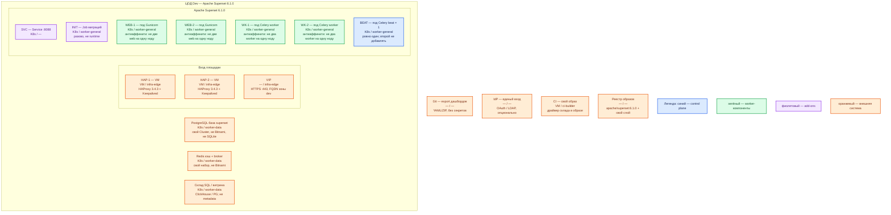

# Apache Superset 6.1.0 — Dev

Веб-приложение бизнес-аналитики: чарты и дашборды поверх SQL. Само **терабайты не хранит**. Тот же механизм, что Prod: Helm **`superset/superset` 0.21.1**, образ **`apache/superset:6.1.0`**, web + worker + beat + своя PostgreSQL + Redis. Dev уменьшает CPU/RAM/диск, не меняет вид инсталляции. Лицензия **Apache License 2.0**.

## Допущения

- Контур: **1 ЦОД**. Stretch между залами нет.
- Живая PostgreSQL метаданных (отдельная база `superset`, диапазон вендора **10.X–16.X**, HA базы — тот же класс, что Prod: оператор CNPG, не один контейнер SQLite и не сабчарт Bitnami). Redis этой площадки — кэш и broker, не Bitnami в чарте.
- Паритет с Prod: тот же Helm, та же роль-модель (две web, два worker, один beat, Service :8088, край HAProxy+VIP), не quickstart Compose на одной VM. Учебный стенд из `.install.md` этот контур **не** описывает.
- Stateless: **минимум 2 реплики web на 2 нодах** `worker-general`, антиаффинити. Одна web на Dev запрещена правилом паритета (иначе не воспроизвести отказ ноды и балансировку). Worker тоже **≥ 2** на 2 нодах — иначе ошибка очереди Celery на Prod не воспроизведётся.
- На ЦОДе: пара HAProxy **3.4.3** + Keepalived + VIP (меньше CPU/RAM, чем Prod); те же имена StorageClass `local-ssd` / `shared-fs` (подам web/worker/beat PVC не нужны); DNS внутри `cluster.local`, снаружи зона `dev.…`.
- Нагрузка не замерена. Ёмкость — меньше Prod, порядок величины, уточняется замером.
- Склад SQL (ClickHouse / витрина) в этом же ЦОДе. Superset **не ходит** в ведомства.
- SSO опционален; на Dev достаточно локального входа, но не заводских `admin`/`admin` в git. Flower, WebSocket и PNG-отчёты на старте не обязательны.

## Схема инстансов

Имена — роли, не обязательные DNS. Потоков и стрелок нет. Пул нод — класс машин для планировщика, не «под на ноде 3».

ОС — свойство платформы, не пода. Один стандарт Linux на всех нодах контура.

Исключение вендора: Windows как целевая ОС сервера Superset официально не поддерживается (дока Compose). Ноды этого кластера — Linux.

| Пул | Роль | Зачем выделен |
|---|---|---|
| `infra-edge` | edge-VM | Та же пара HAProxy + Keepalived + VIP, что на Prod; меньше CPU/RAM |
| `worker-general` | general | Поды web / worker / beat; две ноды, чтобы антиаффинити было куда сработать |
| `worker-data` | data-localdisk | PostgreSQL метаданных, Redis и склад (чужие на этой схеме); тома меньше Prod, те же имена StorageClass |
| `ci-builder` | vendor | Та же сборка образа с драйвером, что Prod; не «apt на старте, потому что Dev» |

Синий — **Celery beat** (управляющая роль расписаний, не кворум). Helm — инсталлятор, не runtime-под.

## Комментарии к схеме

### HAP-1, HAP-2, VIP — вход площадки

- **Функционал.** Та же роль-модель, что Prod: пара VM, Keepalived, VIP. Снаружи FQDN зоны `dev.…` на **443**. VIP также ControlPlaneEndpoint (`:6443`, TCP passthrough).
- **Критично.** Не публиковать **8088** на `0.0.0.0` «потому что стенд». Не заменять пару одним HAProxy: иначе не воспроизвести отказ края. `ENABLE_PROXY_FIX` — как на Prod. Клиенты по FQDN, не по Pod IP.

### SVC — Service :8088

- **Функционал.** Имя в `cluster.local` перед двумя web.
- **Критично.** Нужен, чтобы балансировка была того же типа, что на Prod. Один опубликованный порт Compose эту роль не выполняет. Проба `/health` = процесс, не Postgres/Redis/склад.

### INIT — Job миграций

- **Функционал.** Тот же разовый Job, что Prod.
- **Критично.** Не подменять его ручным `superset db upgrade` в Compose. `loadExamples` можно включить только на изолированном учебном стенде, не в этом Dev, если Dev должен быть уменьшенным Prod. Пароль admin — не заводской `admin` в git.

### WEB-1, WEB-2 — реплики Gunicorn

- **Функционал.** Два одинаковых процесса **6.1.0**. Состояние в Postgres, не в файле пода. Ставит тот же чарт **0.21.1**, образ `apache/superset:6.1.0` (свой слой с драйвером).
- **Критично.**
  - Минимум **2** реплики, **2** ноды, антиаффинити. Сокращать до одного пода нельзя: это уже не уменьшенный Prod, а другой класс (нет балансировки и отказа ноды). Дефолт чарта — **1**, не «норма Dev».
  - Не `docker compose -f docker-compose-image-tag.yml` «для отладки рядом»: это другой вид инсталляции (Bitnami-подобные контейнеры Postgres/Redis на одном хосте, том `db_home` без бэкапа). Ошибка выката Helm на Prod так не воспроизведётся.
  - PostgreSQL, не SQLite. `postgresql.enabled: false`. PVC / `shared-fs` подам UI не заказывать.
  - Свой `SECRET_KEY` контура Dev **до** источников; не копировать `thisISaSECRET_1234`, `TEST_NON_DEV_SECRET` и не шарить ключ Prod. `admin`/`admin` из учебного стенда — только закрытый Compose, не этот Dev.
  - Выкат + PDB `minAvailable: 1`, как Prod. NullCache на Dev как раз покажет шторм SQL × 2 web — не «облегчать» выключением кэша, если Prod идёт через Redis.
  - Ёмкость меньше Prod: ориентир sample (2 vCPU / 4 ГиБ / 30 ГБ SSD) — про учебную **VM с Compose**, не requests пода. Точные millicpu/MiB — замер. `resources: {}` чарта не копировать. Диск БД — меньше тома Postgres, не PVC web.
  - Закрытый контур: Scarf выкл, как на Prod. Иначе «на Dev сойдёт» не поймает утечку наружу.
  - Свой образ с драйвером, не `runAsUser: 0` + apt «на время».

### WK-1, WK-2 — Celery worker

- **Функционал.** Тот же фон, что Prod: очередь в Redis, общая metadata DB.
- **Критично.** Не схлопывать до одного worker: на Prod их два, и result backend общий. Не диск пода. Антиаффинити. PNG/Chrome на Dev не ставить «на всякий случай», если Prod их не включает.

### BEAT — Celery beat × 1

- **Функционал.** Тот же единственный планировщик.
- **Критично.** На Dev тоже **один**, не ноль «чтобы легче» и не два «для надёжности». Без beat не поймаете двойные письма, которые взорвутся на Prod, если кто-то поднимет вторую реплику.

### PostgreSQL база superset

- **Функционал.** Единственная БД состояния этого Superset.
- **Критично.** Не встроенная SQLite «на время». Не сабчарт Bitnami. Не один под Postgres: HA базы — кворумный продукт, его не схлопывают до файла в volume. Не общая БД с карточками даже на Dev. **5432 на VIP не публикуем.** Не PostgreSQL **18** платформы, пока таблица вендора — **10.X–16.X**.

### Redis кэш + broker

- **Функционал.** Единственный broker/кэш этого стека.
- **Критично.** Не Bitnami в чарте и не «без Redis, потому что Dev синхронный»: Prod с worker+beat без Redis не бьётся. **6379 на VIP не публикуем.**

### Склад SQL / витрина

- **Функционал.** Единственный источник фактов для этого UI.
- **Критично.** UI без живого источника бесполезен. Не подключать операционные БД Camunda. Учётка SELECT.

### Git — export дашбордов

- **Функционал.** Тот же класс доставки определений, что Prod.
- **Критично.** Без export клики в UI умрут вместе с БД. Секреты в git не класть.

### IdP

- **Функционал.** Опционально. Если включают — тот же тип, что планируют на Prod, иначе ошибка `redirect_uri` на Prod не воспроизведётся.
- **Критично.** Секрет в Secret; redirect — FQDN VIP зоны `dev.…`.

### CI / реестр

- **Функционал.** Тот же образ, что уйдёт в Prod, меньшие ресурсы у подов.
- **Критично.** Не собирать «учебный» образ без драйвера и потом удивляться, что Test Connection падает только в бою.

## Путь роста (не включать сразу)

Тот же, что Prod, в одном ЦОДе: больше людей → ещё web; тяжелее SQL → worker и витрина, не пятый web; терабайты → озеро. HPA только после профиля. Не «добавить Compose рядом». Не включать Flower/WebSocket/PNG «чтобы Dev был богаче Prod».

## Сильные и слабые места

**Сильные.** Тот же Helm и те же 2 web на 2 нодах, что Prod: можно поймать ошибку выката, `SECRET_KEY`, двух beat и отказа ноды. Падение UI не уничтожает факты на складе.

**Слабые.** Один ЦОД: падение зала = нет и UI, и БД метаданных. Меньше CPU/RAM — раньше упрётесь в SQL × 2 web, чем на Prod; это не доказывает смету боя.

**Критичные условия**

- Не один Docker и не Compose вместо Helm.
- Не одна web «на время» и не SQLite и не сабчарты Bitnami.
- **6.1.0**, чарт **0.21.1**; не `latest`.
- Не публиковать **8088** в интернет; не уносить `admin`/`admin` и дефолтный `SECRET_KEY`.
- Не stretch (на Dev и некуда); beat только один внутри этого ЦОДа.
- Не root + apt bootstrap «потому что Dev».

## Источники

- Релиз **6.1.0**: https://github.com/apache/superset/releases/tag/6.1.0
- Настройка, Postgres **10.X–16.X**, `/health`, `SECRET_KEY`: https://superset.apache.org/docs/configuration/configuring-superset
- Kubernetes + Helm: https://superset.apache.org/docs/installation/kubernetes
- Helm **0.21.1**: https://artifacthub.io/packages/helm/superset/superset/0.21.1
- Docker Compose (не этот контур): https://superset.apache.org/docs/installation/docker-compose
- Celery, один beat: https://superset.apache.org/docs/configuration/async-queries-celery
- Роли: https://superset.apache.org/docs/security/
- Драйверы: https://superset.apache.org/docs/databases/
- Карточка: `Out/Поиск и аналитика/Apache Superset/Apache Superset.md`
- Установка: `Out/Поиск и аналитика/Apache Superset/Apache Superset.install.md`
- Схемы: `Out/Поиск и аналитика/Apache Superset/Apache Superset.shema.md`
- Sample: `sample/Apache Superset.md`
- Prod этого контура: `sample2/Apache Superset.prod.md`

**В доке вендора нет:** порог RTT; формула «N зрителей = M реплик»; готовая смета Dev в millicore; разрешение SQLite при `replicas ≥ 2`; разрешение Compose как уменьшенного Helm.
