# Apache Superset 6.1.0 — Prod

Веб-приложение бизнес-аналитики: люди строят чарты и дашборды **SQL-запросами** к подключённым складам. Само **терабайты не хранит**. UI/API — **8088/TCP**. Лицензия **Apache License 2.0**. Не Grafana, не Luxms BI, не Preset Cloud.

## Допущения

- Контур: 2 прикладных ЦОДа + 1 ЦОД под бэкапы. Stretch metadata PostgreSQL, Redis и Celery beat между ЦОДами **нет**: порога RTT у проекта нет.
- Живой стек — в **ЦОД-1**: Helm-релиз (web + worker + beat) + своя база метаданных + Redis этой площадки. ЦОД-2: отдельного UI «для HA» без своей Postgres **нет**. ЦОД-3: копии БД метаданных, не поды UI.
- Механизм: Helm-чарт **`superset/superset` 0.21.1** (`appVersion` **6.1.0**), образ **`apache/superset:6.1.0`**. Operator **0.2.0** — другой инсталлятор, не этот файл. Не Docker Compose и не один контейнер на VM.
- Kubernetes площадки уже есть (vanilla 1.36.4). На каждом прикладном ЦОДе: пара HAProxy **3.4.3** + Keepalived + VIP (ControlPlaneEndpoint `:6443` и край HTTP(S)); StorageClass `local-ssd` (RWO) и `shared-fs` (RWX, только по исключению); DNS внутри `cluster.local`, снаружи зона `prod.…`.
- Metadata DB — **своя PostgreSQL**, отдельная база `superset` (не карточки, не Grafana, не Camunda). Сабчарт Bitnami в чарте — стенд: в бою `postgresql.enabled: false`. HA этой БД — отдельный продукт (оператор CNPG), не SQLite и не `postgres:latest` рядом с подом. Версия — из таблицы вендора на [Configuring](https://superset.apache.org/docs/configuration/configuring-superset) (**10.X–16.X**). Compose 6.1.0 поднимает `postgres:17`; PostgreSQL **18** платформы в эту таблицу **не** входит — для `superset` не брать 18 «потому что так карточки».
- Redis — кэш, broker и result backend Celery. Сабчарт Bitnami — стенд: в бою `redis.enabled: false`. HA Redis — отдельный продукт контура, не один контейнер чарта. **6379** на VIP HAProxy не публикуем.
- Нагрузка (зрители, refresh, SQL Lab, отчёты) **не замерена**. Ниже — минимальная отказоустойчивая топология, не «все ручки масштабирования вендора».
- Склад фактов (ClickHouse / PostgreSQL-витрина) будет на площадке. Этот файл его не проектирует. Superset **не ходит** в ведомства и не читает Kafka как таблицу.
- SSO (OAuth / LDAP через Flask-AppBuilder) **опционален** на схеме; `admin`/`admin` в бою — не ежедневный вход. Flower, WebSocket server и PNG-отчёты (Chromium) на старте **не** обязательны.
- Закрытый контур: Scarf (gateway образов и analytics pixel) выключить. Свой образ с драйвером склада собирается в CI (`uv pip` с 6.1.0), не `apt` от root на каждом старте.

## Схема инстансов

Имена — роли, не обязательные DNS. Потоков и стрелок нет. Пул нод — класс машин для планировщика, не «под на ноде 3».

```mermaid
flowchart TB
  subgraph DC1["ЦОД-1 — живой Apache Superset 6.1.0"]
    subgraph EDGE["Вход площадки"]
      HAP1["HAP-1 — VM<br/>VM / infra-edge<br/>HAProxy 3.4.3 + Keepalived"]
      HAP2["HAP-2 — VM<br/>VM / infra-edge<br/>HAProxy 3.4.3 + Keepalived"]
      VIP["VIP<br/>— / infra-edge<br/>HTTPS :443, FQDN зоны prod"]
    end
    subgraph SS["Apache Superset 6.1.0"]
      SVC["SVC — Service :8088<br/>K8s / —"]
      INIT["INIT — Job миграций<br/>K8s / worker-general<br/>разово, не runtime"]
      W1["WEB-1 — под Gunicorn<br/>K8s / worker-general<br/>антиаффинити: не две web на одну ноду"]
      W2["WEB-2 — под Gunicorn<br/>K8s / worker-general<br/>антиаффинити: не две web на одну ноду"]
      WK1["WK-1 — под Celery worker<br/>K8s / worker-general<br/>антиаффинити: не два worker на одну ноду"]
      WK2["WK-2 — под Celery worker<br/>K8s / worker-general<br/>антиаффинити: не два worker на одну ноду"]
      BT["BEAT — под Celery beat × 1<br/>K8s / worker-general<br/>ровно один; второй не добавлять"]
    end
    PG["PostgreSQL база superset<br/>K8s / worker-data<br/>свой Cluster, не Bitnami, не SQLite"]
    RD["Redis кэш + broker<br/>K8s / worker-data<br/>свой набор, не Bitnami"]
    LAKE["Склад SQL / витрина<br/>K8s / worker-data<br/>ClickHouse / PG; не metadata"]
  end

  subgraph DC2["ЦОД-2 — прикладной"]
    NO["Superset здесь нет<br/>— / —<br/>без локальной Postgres UI не ставить"]
  end

  subgraph DC3["ЦОД-3 — бэкапы"]
    SNAP["Копии БД superset<br/>— / —<br/>бэкап PostgreSQL, не поды UI"]
  end

  GIT["Git — export дашбордов<br/>— / —<br/>YAML/ZIP, без секретов"]
  IDP["IdP — единый вход<br/>— / —<br/>OAuth / LDAP, опционально"]
  CI["CI — свой образ<br/>VM / ci-builder<br/>драйвер склада в образе"]
  REG["Реестр образов<br/>— / —<br/>apache/superset:6.1.0 + свой слой"]

  LEGCORE["Легенда: синий — control plane"]
  LEGWORK["зелёный — worker-компоненты"]
  LEGADD["фиолетовый — add-ons"]
  LEGEXT["оранжевый — внешняя система"]

  classDef core fill:#dbeafe,stroke:#2563eb,color:#172554,stroke-width:2px;
  classDef worker fill:#dcfce7,stroke:#16a34a,color:#14532d,stroke-width:2px;
  classDef addon fill:#f3e8ff,stroke:#9333ea,color:#581c87,stroke-width:2px;
  classDef external fill:#ffedd5,stroke:#ea580c,color:#7c2d12,stroke-width:2px;

  class BT,LEGCORE core;
  class W1,W2,WK1,WK2,LEGWORK worker;
  class SVC,INIT,LEGADD addon;
  class HAP1,HAP2,VIP,PG,RD,LAKE,NO,SNAP,GIT,IDP,CI,REG,LEGEXT external;
```

ОС — свойство платформы, не пода. Один стандарт Linux на всех нодах контура.

Исключение вендора: Windows как целевая ОС сервера Superset официально не поддерживается (дока Compose). Ноды этого кластера — Linux.

| Пул | Роль | Зачем выделен |
|---|---|---|
| `infra-edge` | edge-VM | Пара HAProxy + Keepalived + VIP: край HTTP(S) и ControlPlaneEndpoint Kubernetes |
| `worker-general` | general | Поды web / worker / beat и Init Job; локальный диск под состояние UI не нужен |
| `worker-data` | data-localdisk | PostgreSQL метаданных, Redis и склад (чужие на этой схеме): тома на `local-ssd`, не NFS |
| `ci-builder` | vendor | Сборка образа с драйвером склада; не runtime-пул |

Синий на схеме — **Celery beat** (управляющая роль расписаний). Кворума (Raft) у Superset нет: два beat — не HA, а двойные письма. Helm — инсталлятор, не runtime-под.

## Комментарии к схеме

### HAP-1, HAP-2, VIP — вход площадки

- **Функционал.** Пара VM с HAProxy **3.4.3** и Keepalived держит VIP. Снаружи одно имя зоны `prod.…` на **443/TCP**. VIP также ControlPlaneEndpoint Kubernetes (`:6443`, TCP passthrough). Kafka `:9092` через этот HAProxy не публикуем.
- **Критично.** **8088** в интернет не публиковать: снаружи только HTTPS на VIP. TLS заканчивается на краю. `ENABLE_PROXY_FIX = True` — чтобы `redirect_uri` и cookie считались за SSL-offload ([Kubernetes](https://superset.apache.org/docs/installation/kubernetes), [Configuring](https://superset.apache.org/docs/configuration/configuring-superset)). Клиенты — по FQDN, не по Pod IP. Sticky session **не** обязательна: состояние в metadata DB, cookie подписывает `SECRET_KEY`.

### SVC — Service :8088

- **Функционал.** Стабильное имя внутри `cluster.local` перед подами web. Это не процесс Superset. Дефолт чарта: `service.port` **8088**, `type: ClusterIP` ([Artifact Hub 0.21.1](https://artifacthub.io/packages/helm/superset/superset/0.21.1)).
- **Критично.** Порт **8088/TCP** (UI, API, `/health`). Наружу — через VIP, не NodePort в мир. Проба `/health` = процесс web, тело `OK`; это **не** проверка Postgres, Redis и склада ([Configuring](https://superset.apache.org/docs/configuration/configuring-superset)).

### INIT — Job миграций

- **Функционал.** Разовый Job: `db upgrade` и `superset init` (права встроенных ролей). В чарте хук post-install/post-upgrade, не постоянно работающий сервис.
- **Критично.** Не запускать `db upgrade` с трёх подов сразу. `superset init` **перезаписывает** права встроенных ролей. Дефолт init: пользователь **`admin` / `admin`** ([Kubernetes](https://superset.apache.org/docs/installation/kubernetes)) — в бой не оставлять. `init.loadExamples` оставить **false**.

### WEB-1, WEB-2 — реплики Gunicorn

- **Функционал.** Два одинаковых процесса **6.1.0**: UI/API, Explore, синхронный SQL. Выборов лидера нет: жив хотя бы один web **и** жива Postgres — UI есть. Ставит чарт **`superset/superset` 0.21.1**, образ `apache/superset:6.1.0` (свой слой с драйвером), не `latest`. Пример страницы Kubernetes как раз показывает **два** web-пода.
- **Критично.**
  - **2 реплики** (дефолт чарта web — **1**, в бой не копировать; ключ в values — `supersetNode.replicaCount` / `supersetNode.replicas.replicaCount`, как в **0.21.1**). Антиаффинити: не две web на одну ноду `worker-general`. Отказ одной ноды не глушит UI, пока живы VIP, Service и Postgres.
  - Общая PostgreSQL, не SQLite. PVC/`shared-fs` подам web **не** исключение: состояние не на диске пода. NFS как диск метаданных не используем.
  - Свой `SECRET_KEY` **до** заведения источников: `openssl rand -base64 42`. С 2.1.0 дефолт на не-debug **запрещает старт**. Дефолт Helm `thisISaSECRET_1234` не оставлять ([Kubernetes](https://superset.apache.org/docs/installation/kubernetes), [Configuring](https://superset.apache.org/docs/configuration/configuring-superset)). Смена ключа после источников: `PREVIOUS_SECRET_KEY` + `superset re-encrypt-secrets`, иначе пароли складов в метаданных не читаются. Ключ — Vault, не git.
  - Не `admin`/`admin`. Admin = ключ к зашифрованным URI складов и к SQL Lab. SSO + break-glass. Gamma на данные, не все Admin. Public/anonymous на персональных данных не включать.
  - `runAsUser: 0` и `apt` в `command` на старте — не бой. Драйвер склада (`clickhouse-connect`, `psycopg2`) — в образе из CI. Scarf: `repository: apache/superset`, `SCARF_ANALYTICS: false`.
  - NullCache (дефолт `CACHE_CONFIG` / `DATA_CACHE_CONFIG`) + автообновление дашборда = шторм SQL на склад. Кэш — в общем Redis, не диск пода. `DATASET_IMPORT_ALLOWED_DATA_URLS` сузить (дефолт `.*` = SSRF). `PREVENT_UNSAFE_DB_CONNECTIONS` не выключать.
  - PDB чарта дефолт **выкл** — в бою включить для web (`minAvailable: 1`), чтобы выкат не обнулил обе реплики. HPA чарта на старте выключен — не включать без замера.
  - Ёмкость: цифр «хватит N ядер» у вендора **нет**. Пример Gunicorn `-w 10` на Configuring — пример, не смета. Ориентир sample (2 vCPU / 4 ГиБ / 30 ГБ SSD) — про учебную **одну VM с Compose**, не requests пода. Порядок величины на под web — **уточняется замером**. `resources: {}` чарта в бой не копировать. Диск метаданных — у **хоста Postgres**, не PVC web. Формулы «хватит для терабайтов» нет: терабайты — у склада.
  - SQL Lab — учётка склада только SELECT, лучше реплика витрины, не primary эталона и не superuser озера.

### WK-1, WK-2 — Celery worker

- **Функционал.** Фоновые задачи: асинхронный SQL Lab, прогрев кэша, Alerts & Reports (если включены). Забирают задания из Redis, результат кладут в общий backend. Масштабируются независимо от web ([Async Queries](https://superset.apache.org/docs/configuration/async-queries-celery)).
- **Критично.** Минимум **2** реплики на **2** нодах, антиаффинити. Дефолт чарта worker — **1**. Без общего Redis web-A не заберёт результат worker-B (result backend не на диске пода). Все web и worker смотрят на **одну** metadata DB: SQLite здесь ловушка. `CELERY_CONFIG` одинаковый у web и worker. PNG/Chromium в первом бою не обязательны: не ставить `apt-get chrome` в `command` пода.

### BEAT — Celery beat × 1

- **Функционал.** Планировщик расписаний: сам SQL и письма не делает, только ставит задачи worker. В чарте `supersetCeleryBeat.enabled` дефолт **false** — для этой топологии включить.
- **Критично.** Активный beat — **ровно один** на весь стек. Два beat = двойные письма и лишняя нагрузка ([Async Queries](https://superset.apache.org/docs/configuration/async-queries-celery)). Это не кворум: отказ ноды с beat — пауза расписаний до пересоздания пода, не split-brain. Реплики beat «для HA» не добавлять.

### PostgreSQL база superset

- **Функционал.** Обязательная чужая зависимость: пользователи, роли, дашборды, datasets, расписания, зашифрованные реквизиты источников. Факты озера здесь не живут.
- **Критично.** SQLite в бою запрещён. Сабчарт Bitnami (`postgresql.enabled: true`, пароль `superset`) — не бой. Отдельный Cluster (CNPG), не общая БД с карточками. Клиенты Superset → FQDN сервиса Postgres (`cluster.local`), не Pod IP, **5432 на VIP не публикуем**. Падение Postgres = нет логина, даже если поды web зелёные. Три web без HA БД — нарисованная отказоустойчивость. Версия — **10.X–16.X** по таблице Configuring; 18 платформы не подставлять.

### Redis кэш + broker

- **Функционал.** Очередь Celery (логически db 0 в чарте), кэш (db 1), общий result backend. Нужен этой топологии, потому что включены worker и beat.
- **Критично.** Сабчарт Bitnami (`redis.enabled: true`) — не бой. Свой Redis площадки; **6379 на VIP не публикуем**. Без Redis прекращаются фон и общий кэш; синхронный UI может остаться, пока жива Postgres. NullCache вместо Redis на старте «чтобы проще» съест склад при refresh.

### Склад SQL / витрина

- **Функционал.** Источник фактов для чартов. Без живого источника UI — пустая рамка.
- **Критично.** Драйвер в образе. URI — SQLAlchemy (`clickhousedb://…`, `postgresql://…`), не Kafka. Падение склада = пустые чарты при зелёном `/health`. Добавлять реплики web «для HA UI» умножает соединения к складу (`max_connections`). Читать реплику витрины, не primary SoT.

### ЦОД-2 — Superset нет

- **Функционал.** Прикладной зал без локальной БД `superset` **этой** установки.
- **Критично.** Реплики web/worker/beat сюда «для HA» не ставить: получится stretch Postgres/Redis/beat (запрещено) или второй writer в ту же БД, или вторая правда дашбордов. Люди ходят на FQDN ЦОД-1. Свой экземпляр с той же git-выгрузкой — путь роста/DR, не старт.

### ЦОД-3 — копии БД

- **Функционал.** Бэкап PostgreSQL базы `superset` (снимки/WAL по процедуре Postgres), чтобы падение ЦОД-1 не убило единственную копию дашбордов и зашифрованных URI.
- **Критично.** Это не поды Superset и не CSI-том UI. Клики только в UI без git-export = единственная копия в БД.

### Git — export дашбордов

- **Функционал.** YAML/ZIP дашбордов и datasets ([функция импорта/экспорта](https://superset.apache.org/docs/configuration/configuring-superset) / UI export).
- **Критично.** В git — без секретов. Пароли источников — в metadata DB (шифр `SECRET_KEY`) / Vault. Без git два зала = две правды.

### IdP

- **Функционал.** Опциональный единый вход (OAuth / LDAP Flask-AppBuilder).
- **Критично.** Client secret — в Secret. Redirect — FQDN VIP, не Pod IP. `ENABLE_PROXY_FIX` обязателен за TLS. Саморегистрацию в роль Admin не включать. Локальный admin оставить аварийным.

### CI / реестр — свой образ

- **Функционал.** Сборка `apache/superset:6.1.0` + драйверы склада (`uv pip` с 6.1.0) в CI, публикация в свой registry.
- **Критично.** Страница Kubernetes: для боя собирать образ в CI, не bootstrap `apt` на старте. Не `latest`. Закрытый контур — не Scarf Gateway (`apachesuperset.docker.scarf.sh`).

## Путь роста (не включать сразу)

1. Больше зрителей / refresh → ещё реплики **web в ЦОД-1** на `worker-general` (та же Postgres, тот же Redis) + рабочий кэш. Помнить: N web × gunicorn × чарты × (1 − cache hit) = нагрузка на склад.
2. Тяжёлый / долгий SQL Lab → ещё **worker**, не пятый web; таймауты SQL Lab / Gunicorn — на стороне склада и запросов.
3. Терабайты → масштаб озера/витрины, не `replicaCount` Superset. Metadata DB остаётся маленькой.
4. DR UI: независимый стек в ЦОД-2 + **своя** Postgres + свой Redis + тот же git-export, **без** beat/Postgres через город.
5. Alerts & Reports с PNG: отдельный образ с Chromium (~гигабайты на worker), SMTP/Slack — по факту потребности, не со старта.
6. Flower (`:5555`) и WebSocket (`:8080`, community-образ) — не в интернет и не в первый бой.
7. HPA чарта — только после профиля нагрузки.

## Сильные и слабые места

**Сильные.** Официальный Helm под 6.1.0; web active-active без sticky; отказ одного web/одной ноды не роняет UI при живой Postgres; факты переживают падение UI (живут на складе).

**Слабые.** Падение ЦОД-1 вместе с Postgres оставляет BI мёртвым, даже если в ЦОД-2 есть машины. Нет кворума Superset: «2 из 3 web» ничего не выбирают. Один beat — единая точка паузы расписаний. Нагрузка не замерена. Компрометация Admin / дефолтного `SECRET_KEY` = пароли всех источников и SQL Lab.

**Критичные условия**

- **6.1.0**, чарт **0.21.1**; не `latest`; не учебный Docker Compose + том `db_home`.
- Не меньше **двух** web на **двух** нодах; worker ≥ 2; beat **ровно 1**; не SQLite; не сабчарты Bitnami.
- Не stretch Postgres / Redis / beat на 2–3 ЦОДа.
- Не публиковать **8088** в интернет; не `admin`/`admin`; не `thisISaSECRET_1234` / `TEST_NON_DEV_SECRET` / `CHANGE_ME_TO_A_COMPLEX_RANDOM_SECRET`.
- Не root + apt bootstrap; не NullCache + автоrefresh «как есть».
- Superset не замена Grafana, не склад и не SIEM.

## Источники

- Релиз Apache Superset **6.1.0** (13 мая 2026): https://github.com/apache/superset/releases/tag/6.1.0
- Лицензия Apache 2.0: https://github.com/apache/superset/blob/6.1.0/LICENSE.txt
- Настройка: `SECRET_KEY` / `openssl rand -base64 42`, Postgres метаданных **10.X–16.X**, `/health` = `OK`, `ENABLE_PROXY_FIX`, `re-encrypt-secrets`, пример Gunicorn `-w 10`: https://superset.apache.org/docs/configuration/configuring-superset
- Kubernetes + Helm, `thisISaSECRET_1234`, init `admin`/`admin`, драйверы в образе (не apt на старте), Scarf, `ENABLE_PROXY_FIX`: https://superset.apache.org/docs/installation/kubernetes
- Helm-чарт **0.21.1**, `appVersion` 6.1.0: https://artifacthub.io/packages/helm/superset/superset/0.21.1
- Репозиторий чарта: https://apache.github.io/superset — перед `helm install` сверить, что **0.21.1** есть в `helm search repo superset --versions` (index на дату этой работы показывает **0.21.0** затем **0.22.0**, оба `appVersion` 6.1.0; на 0.22.x не прыгать «на глаз»).
- Асинхронный SQL Lab / Celery, один beat, общая metadata DB, Redis/RabbitMQ как broker: https://superset.apache.org/docs/configuration/async-queries-celery
- Роли и безопасность: https://superset.apache.org/docs/security/
- Драйверы и URI складов: https://superset.apache.org/docs/databases/
- Docker Compose (не этот контур): https://superset.apache.org/docs/installation/docker-compose
- Operator 0.2.0 (не этот файл): https://github.com/apache/superset-kubernetes-operator
- Карточка платформы: `Out/Поиск и аналитика/Apache Superset/Apache Superset.md`
- Установка (учебный Compose vs бой): `Out/Поиск и аналитика/Apache Superset/Apache Superset.install.md`
- Схемы: `Out/Поиск и аналитика/Apache Superset/Apache Superset.shema.md`
- Состав из sample: `sample/Apache Superset.md`

**В доке вендора нет (здесь не выдумано):** порог RTT между залами; «хватит N ядер под вашу нагрузку»; готовая смета «хватит для терабайтов»; PostgreSQL **17/18** в таблице Configuring (там **10.X–16.X**); обязательность sticky; разрешение SQLite при нескольких репликах; CPU/RAM requests в values чарта (там `resources: {}`).
