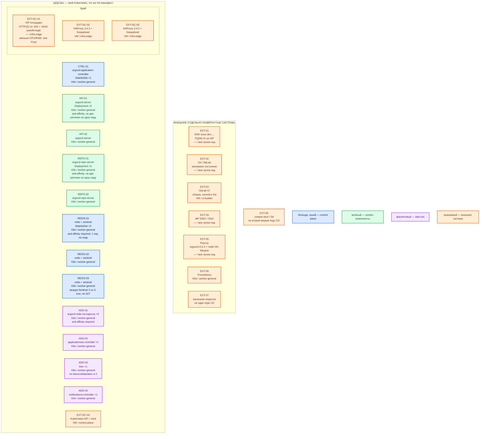

# Argo CD 3.5.2 — Dev

Тот же механизм, что Prod: self-managed **Argo CD 3.5.2**, образ `quay.io/argoproj/argocd:v3.5.2`, официальный **HA-манифест** тега `v3.5.2` в Kubernetes. Dev **уменьшает CPU/RAM/диск нод**, не меняет вид инсталляции.

Это **не** getting-started `kubectl apply …/stable/manifests/install.yaml` (один Redis, по одной реплике server/repo-server). Иначе ошибка «на Prod anti-affinity и Sentinel, на Dev — non-HA» на Dev не воспроизводится.

**GitOps** — желаемое состояние в Git. **HA-манифест** — `manifests/ha/install.yaml`: server×2, repo-server×2, Redis+Sentinel×3, минимум **три** Kubernetes-ноды. Redis — **кэш**, не эталон (эталон — Git и etcd).

## Допущения

- Dev: **1 ЦОД**. Stretch не применим.
- Уже есть: VM, Kubernetes этого ЦОДа (тот же stacked HA, не kind/minikube), пара HAProxy 3.4.3 + Keepalived + VIP (меньше CPU/RAM, чем Prod), те же имена StorageClass `local-ssd` / `shared-fs` (Argo CD PVC на старте не берёт), зона `dev.…`.
- Паритет с Prod: тот же URL манифеста **v3.5.2 HA**, те же роли пулов, те же 2+2+3, тот же отказ от центрального multi-cluster. Не Docker Compose, не `port-forward` как постоянный вход.
- GitLab CI пишет Git; не параллельный `kubectl apply`. Секреты в открытом Git запрещены. SSO — как в Prod (после проверки `admin` выключить); на Dev тот же класс входа (TLS + IdP), не «оставим admin потому что стенд».
- Нагрузка не замерена. Цифр «хватит» у вендора нет; ниже — меньший порядок величины, уточняется замером.
- IPv6-only кластеры HA не поддерживает — как в Prod.
- Source Hydrator на старте выключен — как в Prod.

## Схема инстансов

Без потоков данных. Роль-модель совпадает с Prod: HA, не 1 Redis и не 1 server.

ОС — свойство платформы, не пода. Один стандарт Linux на всех нодах контура.

Исключения вендора по ОС ноды нет: те же Linux-контейнеры, что в Prod (`nodeSelector: kubernetes.io/os: linux`). Не подменять ноду кластера kind-кластером на ноутбуке. Образы Redis/HAProxy бандла — `*-alpine` **внутри контейнера**.

| Имя пула | Роль | Зачем выделен |
|---|---|---|
| `infra-edge` | edge-VM | Та же пара HAProxy 3.4.3 + Keepalived + VIP, что в Prod; меньше CPU/RAM |
| `worker-general` | general | Все поды Argo CD. Минимум **3 маленьких ноды**: required anti-affinity Redis HA и redis-ha-haproxy. Схема «1–2 ноды» HA-манифест не примет |
| `control-plane` | control-plane | Три маленьких stacked-ноды Kubernetes. Поды Argo CD сюда не кладём |
| `ci-builder` | ci | Та же сборка образов, что в Prod; не замена GitOps командой `kubectl apply` с ноутбука |

Смысл цветов: синий — controller и Redis+Sentinel; зелёный — server и repo-server; фиолетовый — внутренний HAProxy Redis и прочие add-on поставки; оранжевый — VIP, городской HAProxy, Git, CI, IdP, реестр, Prometheus, секреты, Kubernetes API.

От Prod схема отличается так: один ЦОД, нет второго зала и нет блока «живой экземпляр на ЦОД-2»; **те же** 2 server, 2 repo-server, 3 Redis+Sentinel (не «урезать до getting-started»).

## Комментарии к схеме

### EXT-01 — DNS зоны `dev.…`

- **Функционал.** FQDN UI на VIP этого ЦОДа, не Pod IP.
- **Критично.** Имя другое, чем `prod.…`; механизм тот же. Тесты и CLI — по FQDN, не `localhost` после `port-forward` как «постоянный Dev-вход».

### EXT-02 / EXT-03 — Git и GitLab CI

- **Функционал.** Тот же контракт, что Prod: CI пишет Git, Argo CD применяет.
- **Критично.** Не «на Dev пусть CI ещё и kubectl» — это другой класс ошибок. Репозиторий может быть отдельным (`dev`-overlay), вид инсталляции контроллера — тот же.

### EXT-DC-01…03 — VIP и пара HAProxy

- **Функционал.** Край HTTPS/gRPC UI и `:6443` passthrough. Меньше CPU/RAM у VM входа, чем Prod.
- **Критично.** Тот же класс публикации (TLS, gRPC CLI). Не оставлять UI на HTTP. Redis `:6379` на VIP не публиковать.

### CTRL-01 — application-controller ×1

- **Функционал.** Тот же StatefulSet, что Prod: **1** реплика в HA-манифесте.
- **Критично.** Не резать до «вообще без controller в HA-бандле». Не включать шардирование «на всякий случай» — это рост Prod после замера, не отличие Dev.

### API-01 / API-02 и REPO-01 / REPO-02

- **Функционал.** Stateless ×2 с required anti-affinity по hostname — как Prod.
- **Критично.** **Не** `replicas: 1`. Правило паритета: stateless на Dev минимум 2 реплики на 2 нодах. Иначе отказ одной ноды и балансировка UI/генерации на Dev не похожи на Prod.

### REDIS-01…03 — redis + sentinel ×3

- **Функционал.** Тот же StatefulSet `argocd-redis-ha-server`: 3 пода, в каждом redis + sentinel, `emptyDir`, required anti-affinity.
- **Критично.** Не одиночный `argocd-redis` из non-HA `install.yaml`. Не 2 пода Sentinel: нет большинства. Ёмкость нод меньше, **число голосующих то же**. Кэш можно потерять и пересобрать; Git и etcd не в Redis. Не подменять бандл платформенным Redis 7.

### ADD-01 — redis-ha-haproxy ×3

- **Функционал.** Как Prod: 3 пода, required anti-affinity. Образ бандла `haproxy:3.0.8-alpine`, не городской 3.4.3.
- **Критично.** Третья причина, почему worker-general на Dev тоже **≥3 ноды**.

### ADD-02…04 — ApplicationSet, Dex, Notifications

- **Функционал.** Те же объекты HA-поставки, что Prod (по одному).
- **Критично.** Dex по-прежнему не масштабировать до 2: in-memory. Не выкидывать их «чтобы Dev был проще», если Prod их ставит тем же `install.yaml`.

### EXT-DC-04 / EXT-08

- **Функционал.** Live state — etcd этого кластера. Снимок etcd — файл, не второй Argo CD.
- **Критично.** Учебный сценарий getting started (namespace + non-HA + `port-forward`) — **не** этот контур.

## Путь роста

Как в Prod, только на одном ЦОДе и после замера Dev-нагрузки (обычно меньше Application):

1. Не плодить реплики server/repo-server «как в бою после роста», пока замер не показал очередь/OOM.
2. PVC для repo-server — только если `/tmp` реально упирается; тома меньше, имя класса то же (`local-ssd`), не hostPath «потому что Dev».
3. Шардирование controller — не для Dev-старта.
4. Redis HA **остаётся тройкой**.

Ориентир `sample/` (+2 vCPU / +4 ГБ / +10 ГБ) на Dev — ещё меньший порядок на ноду; вендор «хватит» не обещает.

## Сильные и слабые места; критичные условия

**Сильная сторона.** Ошибка вида инсталляции (HA vs quickstart, 3 Sentinel vs 1 Redis, 2 UI vs 1) воспроизводится: механизм тот же, ёмкость меньше.

**Слабая сторона.** Три маленьких worker стоят дороже одной VM с non-HA. Один ЦОД: нет проверки «второй независимый экземпляр».

**Критичные условия**

- Не `https://raw.githubusercontent.com/argoproj/argo-cd/stable/manifests/install.yaml`.
- Не kind/minikube/Compose как «Dev Argo CD».
- Не 1 нода и не 2 ноды под HA-манифест (anti-affinity Redis HA не сядет).
- Не `replicas: 1` у server/repo-server. Не одиночный Redis.
- Не `port-forward` как штатный вход. Не `latest`. Не секреты в Git. Не auto-sync+prune «чтобы быстрее поиграть» без того же риска, что на Prod.

## Источники

| Факт | URL / файл |
|---|---|
| Релиз 3.5.2 | https://github.com/argoproj/argo-cd/releases/tag/v3.5.2 |
| HA: ≥3 ноды, Redis кэш, 3 sentinel | https://argo-cd.readthedocs.io/en/stable/operator-manual/high_availability/ |
| HA-манифест v3.5.2 | https://raw.githubusercontent.com/argoproj/argo-cd/v3.5.2/manifests/ha/install.yaml |
| Getting started non-HA (не этот контур) | https://argo-cd.readthedocs.io/en/stable/getting_started/ |
| Ingress | https://argo-cd.readthedocs.io/en/stable/operator-manual/ingress/ |
| CI automation | https://argo-cd.readthedocs.io/en/stable/user-guide/ci_automation/ |
| Карточка / консультант | `Out/Платформенная инфра/Argo CD/Argo CD.md`, `Argo CD.consultant.md` |
| Prod-инструкция (эталон роль-модели) | `sample2/Argo CD.prod.md` |
| Ресурсы sample (не норма) | `sample/Argo CD.md` |

В документации вендора **нет**: отдельного «dev-манифеста» с двумя Redis; CPU/RAM «хватит на Dev»; разрешения ставить getting-started как паритет боя.
