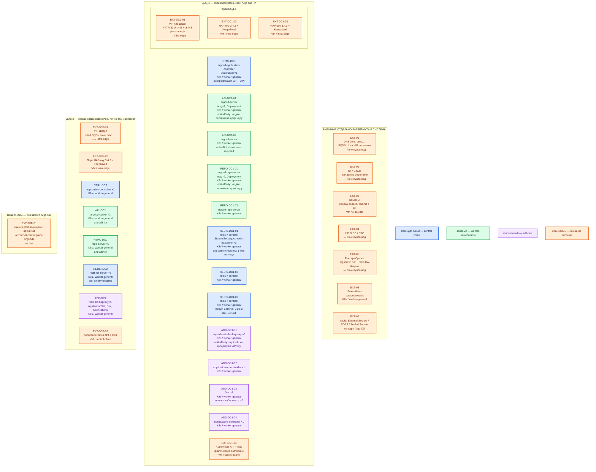

# Argo CD 3.5.2 — Prod

Self-managed **Argo CD 3.5.2** (**GitOps CD**: контроллер приводит Kubernetes к состоянию из Git; не CI). Образ `quay.io/argoproj/argocd:v3.5.2`, не `latest`. Механизм: официальный **HA-манифест** тега `v3.5.2` в Kubernetes **каждого** прикладного ЦОДа. Не getting-started `manifests/install.yaml`, не ветка `stable`, не Docker Compose.

**GitOps** — желаемое состояние в Git, контроллер сам сверяет и применяет. **Application** — CR (custom resource) Argo CD: источник манифестов + кластер/namespace назначения. **AppProject** — граница: какие репозитории, кластеры, виды ресурсов разрешены. Redis в поставке — **кэш**, не эталон.

## Допущения

- Prod: **2 прикладных ЦОДа** + **1 ЦОД под бэкапы**. Stretch одного Argo CD / одного Redis Sentinel между ЦОДами **нет**: RTT не измерен; порога RTT у Argo CD нет.
- На площадку — **свой** экземпляр Argo CD в **своём** Kubernetes. Центральный Argo CD на оба кластера не берём: общие cluster credentials и межплощадочный API — другой blast radius (**область отказа**).
- ЦОД-бэкапов живой Argo CD **не** размещает: эталон желаемого — Git; live state — etcd площадки.
- Уже есть: виртуализация (VM), Kubernetes площадки, пара **HAProxy 3.4.3** + **Keepalived** + **VIP**, CoreDNS / `cluster.local`, зона `prod.…`. VLAN/IP-план вне рамок.
- VIP = ControlPlaneEndpoint `:6443` (TCP passthrough) и край HTTP(S). UI/API Argo CD публикуем на VIP **443/TCP** (HTTPS + gRPC CLI). Kafka `:9092` через этот HAProxy не публикуем. Порт Redis **6379** и Sentinel **26379** на городской VIP **не** выводим.
- StorageClass `local-ssd` (RWO) и `shared-fs` (RWX только по исключению) на площадке есть. Стартовый HA-манифест Argo CD **не** заказывает PVC: Redis — `emptyDir`. NFS как диск Argo CD / Redis / etcd не используем.
- Источник состава — `sample/Argo CD.md`. Карточки `Out/Платформенная инфра/Argo CD/` (`.md`, `.consultant.md`). Файла `.install.md` у продукта нет. `integrations/IT-landscape.md` не использовался.
- Git — GitLab (или иной Git контура) с GitOps-репозиториями. GitLab CI собирает образ и пишет Git; **не** делает `kubectl apply` тех же объектов параллельно Argo CD.
- Секреты приложений в открытом YAML Git **запрещены**. Механизм (External Secrets + Vault / SOPS / Sealed Secrets) — отдельный продукт, не ядро Argo CD.
- SSO через корпоративный IdP. После проверки встроенного `admin` отключают.
- Нагрузка (число Application, частота refresh, стоимость Helm/Kustomize) **не** замерена. Ниже — минимальная отказоустойчивая топология HA-манифеста, не «все тумблеры масштабирования». Цифр CPU/RAM «хватит» у вендора **нет**.
- IPv6-only кластеры официальный HA **не** поддерживает.
- Source Hydrator / commit-server (beta в 3.5, выключен по умолчанию) на старте **не** включаем.

## Схема инстансов

Без потоков данных. ЦОД-1 и ЦОД-2 — две копии одной роль-модели, разные кластеры, разные VIP, разные Secrets.

ОС — свойство платформы, не пода. Один стандарт Linux на всех нодах контура.

Исключения вендора по ОС ноды нет: поды Argo CD — Linux-контейнеры (`nodeSelector: kubernetes.io/os: linux` в HA-манифесте). Redis/HAProxy бандла — образы `*-alpine`; это ОС **контейнера**, не ОС ноды. Windows-ноды этой установкой не покрываются.

| Имя пула | Роль | Зачем выделен |
|---|---|---|
| `infra-edge` | edge-VM | Пара HAProxy 3.4.3 + Keepalived + VIP. Край HTTPS UI и `:6443`. Не ноды Kubernetes: поды Argo CD сюда не садятся |
| `worker-general` | general | Все поды Argo CD (server, repo-server, controller, Redis HA, add-on). Stateless и кэш на `emptyDir`. Минимум **3 ноды**: required anti-affinity Redis HA и redis-ha-haproxy |
| `control-plane` | control-plane | kube-apiserver + etcd площадки (live state). Taint `NoSchedule`. Поды Argo CD сюда **не** кладём |
| `ci-builder` | ci | Сборка прикладных образов в GitLab CI. Не рантайм Argo CD |

Смысл цветов на этой схеме: синий — application-controller и Redis+Sentinel (голос кэша, 3 члена); зелёный — UI/API и repo-server; фиолетовый — add-on поставки (внутренний HAProxy Redis, ApplicationSet, Dex, Notifications); оранжевый — VIP, городской HAProxy, Git, CI, IdP, реестр, Prometheus, секреты, Kubernetes API, ЦОД-бэкапов.

## Комментарии к схеме

### EXT-01 — DNS зоны `prod.…`

- **Функционал.** Имена UI (`argocd.prod.…` и аналоги **на площадку**) указывают на **VIP** этого ЦОДа, не на Pod IP.
- **Критично.** Два ЦОДа — два FQDN (или городской выбор зала снаружи). Клиенты и CLI — по FQDN. Рекламировать под `argocd-server` наружу нельзя.

### EXT-02 — Git / GitLab

- **Функционал.** Источник **желаемого** состояния (plain YAML, Helm, Kustomize, Jsonnet). Repo-server клонирует **read-only**.
- **Критично.** Git — desired state; Kubernetes/etcd — live state; Redis — кэш. Открытые Secret, токены репозитория и kubeconfig кластеров в Git запрещены. Write в Git нужен только Source Hydrator (на старте выключен).

### EXT-03 — GitLab CI

- **Функционал.** Сборка, сканы, неизменяемый digest или фиксированный tag, merge request / commit в GitOps-репозиторий.
- **Критично.** Argo CD — не CI. CI не вызывает `kubectl apply` для тех же ресурсов: два владельца = drift. Поток: CI пишет Git → Argo CD синхронизирует.

### EXT-04 — IdP

- **Функционал.** OIDC/SSO и группы для RBAC Argo CD (это не Kubernetes RBAC: два разных слоя).
- **Критично.** После проверки SSO встроенного `admin` отключают. Не оставлять UI с паролем `admin` из Secret `argocd-initial-admin-secret` как боевой вход.

### EXT-05 — реестр

- **Функционал.** Образ `quay.io/argoproj/argocd:v3.5.2` и образы бандла HA: `public.ecr.aws/docker/library/redis:8.2.3-alpine`, `public.ecr.aws/docker/library/haproxy:3.0.8-alpine` (из манифеста тега `v3.5.2`).
- **Критично.** Пинить тег манифеста **v3.5.2**, не `stable` и не `latest`. Бандловый Redis **8.2.3** — кэш Argo CD, **не** платформенный Redis 7.4.x. Не подменять его «нашим Redis 7». Бандловый HAProxy **3.0.8** — только перед Redis HA; городской край — HAProxy **3.4.3**.

### EXT-06 / EXT-07 — Prometheus и секреты

- **Функционал.** Сбор `/metrics` компонентов; доставка секретов в Kubernetes без открытого YAML в Git.
- **Критично.** Метрики и profiling наружу не публиковать (profiling в Argo CD по умолчанию выключен). Выбор Vault vs SOPS vs Sealed Secrets — trade-off отдельного продукта.

### EXT-DC*-01…03 — VIP и пара HAProxy 3.4.3

- **Функционал.** Единый адрес края площадки. UI/CLI → FQDN → VIP `:443` → backend Service `argocd-server` (или Ingress площадки за тем же VIP). `:6443` — только Kubernetes API, TCP passthrough.
- **Критично.** Схема публикации должна пропускать **HTTPS и gRPC** (CLI). `kubectl port-forward` — стенд/диагностика, не бой. Kafka `:9092`, Redis `:6379`, Sentinel `:26379` сюда не публиковать. TLS на UI обязателен.

### CTRL-DC* — `argocd-application-controller`

- **Функционал.** Читает `Application`, просит манифесты у repo-server, сравнивает desired/live, считает health, делает sync / hooks / prune. StatefulSet в HA-манифесте: **`replicas: 1`**.
- **Критично.** Шардирование (несколько реплик + `ARGOCD_CONTROLLER_REPLICAS`) — **путь роста после замера**, не старт. Права к API — минимально достаточные, не безусловный `cluster-admin`. Откат манифеста **не** откатывает данные БД. Auto-sync, prune и self-heal включают **по отдельности**; для prod начинать с ручного sync или auto-sync **без** prune.

### API-DC* — `argocd-server` (×2)

- **Функционал.** Web UI, REST/gRPC API, CLI, auth/RBAC, приём Git webhook. Stateless Deployment, в HA-манифесте **`replicas: 2`**, `ARGOCD_API_SERVER_REPLICAS=2`.
- **Критично.** Required anti-affinity по `kubernetes.io/hostname`: **не две реплики на одну ноду**. Документация предлагает 3 реплики «чтобы не было простоя на upgrade» — это рост, не обязательный старт манифеста. Внутренний listener **8080**; снаружи **443**. Webhook защищать secret.

### REPO-DC* — `argocd-repo-server` (×2)

- **Функционал.** Clone/fetch Git/Helm/OCI и генерация манифестов (Helm, Kustomize, Jsonnet). Сам в кластер **не** применяет. Порт **8081/TCP** (внутренний gRPC). Deployment **`replicas: 2`**, required anti-affinity по hostname.
- **Критично.** Непроверенный Config Management Plugin с произвольным кодом из репозитория не включать. Клоны в `/tmp` (или `TMPDIR`); PVC на старте нет (`emptyDir`). Монорепозиторий 50+ приложений может сериализовать генерацию — это нагрузка, не другая топология. Не путать с платформенным GitLab.

### REDIS-DC* — `argocd-redis-ha-server` (×3)

- **Функционал.** В каждом поде: **redis-server :6379** + **redis-sentinel :26379**. StatefulSet **`replicas: 3`**. Кэш UI и reconciliation. Документация: Redis можно пересобрать без потери сервиса GitOps.
- **Критично.**
  - Required anti-affinity по hostname → **минимум 3 разные worker-ноды**. «2 узла» для этого комплекта — не уменьшенный Prod, а другой класс: нет места третьему Sentinel.
  - Манифест рассчитан на **ровно три** redis/sentinel. Не раздувать до 5 «для надёжности» без смены схемы вендора. Redis Cluster официальная HA-схема Argo CD **не** описывает.
  - Данные — **`emptyDir`**, не `local-ssd` и не `shared-fs`. Потеря пода = потеря локального кэша, не потеря Git/etcd.
  - Это **не** источник истины и **не** платформенный Redis 7. HA Redis сам по себе не делает HA всего Argo CD (нужны ещё реплики server/repo-server и живой Kubernetes).

### ADD — `argocd-redis-ha-haproxy` (×3)

- **Функционал.** Внутренний прокси к Redis HA (образ `haproxy:3.0.8-alpine`). Deployment **`replicas: 3`**, required anti-affinity по hostname.
- **Критично.** Не путать с парой HAProxy **3.4.3** на `infra-edge`. Компоненты Argo CD ходят в кэш через этот Service, не на городской VIP.

### ADD — ApplicationSet, Dex, Notifications

- **Функционал.** Входят в HA `install.yaml`. ApplicationSet размножает `Application` (в манифесте нет `spec.replicas` → в Kubernetes это **1**). Dex — опциональный OIDC broker (**1** реплика: in-memory, две реплики расходятся). Notifications — события наружу, стратегия Recreate (**1**).
- **Критично.** Без ApplicationSet обычные `Application` работают. Dex не нужен при прямом OIDC в `argocd-server`. Notifications не участвует в sync. Commit-server в стартовую схему не ставим.

### EXT-DC* — Kubernetes API + etcd

- **Функционал.** Live state: CRD/CR `Application`/`AppProject`/`ApplicationSet`, Secrets репозиториев, объекты приложений.
- **Критично.** Argo CD etcd **не** бэкапит. Потеря Argo CD не должна останавливать уже запущенные приложения. Экземпляр управляет **своим** кластером; credentials чужого ЦОДа в Secret не кладём.

### EXT-BKP-01 — ЦОД-бэкапов

- **Функционал.** Снимки etcd площадок и история Git. Живого третьего Argo CD нет.
- **Критично.** Не строить «stretch control plane на бэкап-зал» и не вводить четвёртый Sentinel.

## Путь роста

Не включать сразу. После замера числа Application, длительности Helm/Kustomize, refresh и памяти controller:

1. Увеличить `replicas` `argocd-server` (и `ARGOCD_API_SERVER_REPLICAS`) — документация предлагает **3+** против простоя на upgrade. Anti-affinity сохранить.
2. Увеличить `replicas` `argocd-repo-server`; при нехватке `/tmp` — PVC (тогда осмыслен `local-ssd` RWO), не `shared-fs` «на всех».
3. Шардирование `argocd-application-controller`: поднять replicas StatefulSet и `ARGOCD_CONTROLLER_REPLICAS`. Алгоритмы `round-robin` / `consistent-hashing` в доке — experimental.
4. Тюнинг очередей controller (`--status-processors` / `--operation-processors`) — по числу приложений, не «на терабайты».
5. Второй прикладной ЦОД уже есть как **независимый** экземпляр. «Добавить кластер в этот же Argo CD» — отдельное решение про сеть и credentials, не старт.

Цифр «хватит N CPU» у проекта нет. Ориентир `sample/`: **+2 vCPU, +4 ГБ RAM, +10 ГБ SSD** на прирост кластера — **не** норматив боя; уточняется замером.

## Сильные и слабые места; критичные условия

**Сильная сторона.** Официальный HA: несколько UI/repo-server, Redis с Sentinel на трёх нодах, кэш пересобираем. Отказ площадки не требует чужого API. Уже запущенные приложения переживают падение Argo CD. Тот же манифест потом на Dev.

**Слабая сторона.** Controller на старте один: простой контроллера = нет новых sync (приложения живут). Ошибка в Git при включённом auto-sync+prune быстро разъезжает кластер. Два экземпляра (два ЦОДа) — две конфигурации RBAC/SSO. Нет вендорской сметы CPU/RAM.

**Критичные условия**

- Не getting-started `manifests/install.yaml` и не URL с ветки `stable`. Только `manifests/ha/install.yaml` тега **v3.5.2**.
- Не один под server/repo-server и не одиночный Redis «потому что кэш». Не 2 ноды под Redis HA.
- Не stretch одного Argo CD на 2 ЦОДа. Не cluster-admin «по умолчанию». Не открытый UI без TLS.
- Не auto-sync+prune+self-heal глобально без теста удаления. Не секреты в Git. Не CI и Argo CD как два владельца одних объектов.
- Не считать Redis SoT. Не публиковать `:6379` на VIP. Не IPv6-only. Не `latest`.

## Источники

| Факт | URL / файл |
|---|---|
| Релиз 3.5.2, образ `v3.5.2` | https://github.com/argoproj/argo-cd/releases/tag/v3.5.2 |
| Документация | https://argo-cd.readthedocs.io/en/stable/ |
| Архитектура | https://argo-cd.readthedocs.io/en/stable/operator-manual/architecture/ |
| HA: кэш Redis, ≥3 ноды, не IPv6-only; ровно 3 redis/sentinel | https://argo-cd.readthedocs.io/en/stable/operator-manual/high_availability/ |
| HA-манифест тега v3.5.2 | https://raw.githubusercontent.com/argoproj/argo-cd/v3.5.2/manifests/ha/install.yaml |
| Getting started (non-HA, не этот контур) | https://argo-cd.readthedocs.io/en/stable/getting_started/ |
| Ingress HTTPS+gRPC | https://argo-cd.readthedocs.io/en/stable/operator-manual/ingress/ |
| Security | https://argo-cd.readthedocs.io/en/stable/operator-manual/security/ |
| AppProject / RBAC | https://argo-cd.readthedocs.io/en/stable/user-guide/projects/ · https://argo-cd.readthedocs.io/en/stable/operator-manual/rbac/ |
| Auto-sync | https://argo-cd.readthedocs.io/en/stable/user-guide/auto_sync/ |
| CI automation | https://argo-cd.readthedocs.io/en/stable/user-guide/ci_automation/ |
| SSO | https://argo-cd.readthedocs.io/en/stable/operator-manual/user-management/ |
| Upgrades | https://argo-cd.readthedocs.io/en/stable/operator-manual/upgrading/overview/ |
| Карточка и роль консультанта | `Out/Платформенная инфра/Argo CD/Argo CD.md`, `Argo CD.consultant.md` |
| Ресурсы sample (не норма боя) | `sample/Argo CD.md` |

В документации вендора **нет**: ядер и гигабайт «хватит на Prod», порога RTT для stretch, Redis Cluster как официальной HA-схемы Argo CD, требования PVC на старте, готового CPU-запроса в HA-манифесте как сметы боя.
