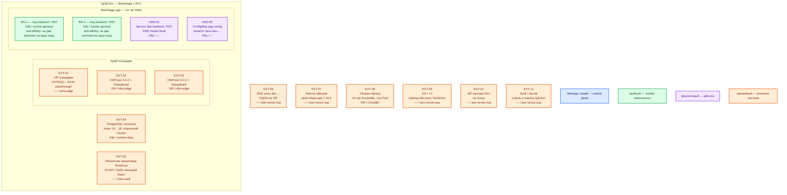

# Backstage 1.54.0 — Dev

Внутренний портал: карта сервисов, шаблоны, документация рядом с кодом. Тот же механизм, что Prod: **свой** образ app **1.54.0** + Helm **`backstage/backstage` 2.8.2** + **внешняя** PostgreSQL + **≥ 2** реплики Deployment. Dev уменьшает CPU/RAM/диск, не меняет вид инсталляции. Учебный `yarn start` / SQLite / Guest этот контур **не** описывает.

## Допущения

- Контур: **1 ЦОД**. Stretch между залами нет.
- Живая PostgreSQL major **14…18** (отдельный Cluster каталога, HA базы — тот же класс, что Prod: оператор CNPG с нечётным кворумом, не один контейнер SQLite и не `postgresql.enabled` чарта Backstage). Портал смотрит только на **её** 5432.
- Паритет с Prod: тот же Helm, тот же свой образ (тег контура Dev), та же роль-модель (две реплики :7007, Service `http-backend`, край HAProxy+VIP, поиск PG, TechDocs external). Не quickstart Getting Started и не Docker Compose.
- Stateless: **минимум 2 реплики на 2 нодах** `worker-general`, антиаффинити. Одна реплика на Dev запрещена правилом паритета (иначе не воспроизвести отказ ноды, балансировку Service и rolling update).
- На ЦОДе: пара HAProxy **3.4.3** + Keepalived + VIP (меньше CPU/RAM, чем Prod); те же имена StorageClass `local-ssd` / `shared-fs` (подам Backstage PVC не нужны); DNS внутри `cluster.local`, снаружи зона `dev.…`.
- Нагрузка не замерена. Ёмкость — меньше Prod, порядок величины, уточняется замером.
- Git и IdP — того же **типа**, что Prod (иначе ошибка OAuth/locations на Prod не воспроизведётся). Секреты — Secret/Vault контура Dev, не копия Prod и не git.
- Redis, split backend, frontend на CDN, отдельный OpenSearch поиска — на старте нет, как на Prod.

## Схема инстансов

Имена — роли, не обязательные DNS. Потоков и стрелок нет. Пул нод — класс машин для планировщика, не «под на ноде 3».

ОС — свойство платформы, не пода. Один стандарт Linux на всех нодах контура.

Исключение вендора: runtime — Linux `node:24-trixie-slim`. macOS/WSL из Getting Started — учебный хост `yarn start`, не нода этого Dev.

| Имя пула | Роль | Зачем выделен |
|---|---|---|
| `infra-edge` | edge-VM | Та же пара HAProxy + Keepalived + VIP, что на Prod; меньше CPU/RAM |
| `worker-general` | general | Поды Backstage; две ноды, чтобы антиаффинити было куда сработать |
| `worker-data` | data-localdisk | PostgreSQL каталога (чужая на этой схеме); тома меньше Prod, те же имена StorageClass |
| `infra-swift` | object storage | Бакет TechDocs; меньше Prod, не CSI-том пода |
| `ci-builder` | ci | Та же сборка образа, что Prod; не `yarn start` на этой VM как замена кластера |

У Backstage **нет** своей голосующей роли: синий control plane продукта на схеме не рисуется, только легенда. Helm — инсталлятор, не runtime-под. Кворум Postgres (обычно 3 маленьких инстанса) — свойство **базы**, его не схлопывают до «одного контейнера рядом с порталом».

## Комментарии к схеме

### EXT-01 / EXT-02 / EXT-03 — VIP и пара HAProxy

- **Функционал.** Та же роль-модель, что Prod: пара VM, Keepalived, VIP. Снаружи FQDN зоны `dev.…` на **443**. VIP также ControlPlaneEndpoint (`:6443`, TCP passthrough).
- **Критично.** Не публиковать **7007** на `0.0.0.0` «потому что стенд». Не заменять пару одним HAProxy: иначе не воспроизвести отказ края. `app.baseUrl` / `backend.baseUrl` = URL за VIP, не `http://localhost:3000`. Клиенты по FQDN, не по Pod IP. Kafka `:9092` через этот HAProxy не публикуем.

### ADD-01 — Service `http-backend`

- **Функционал.** Имя в `cluster.local` перед двумя подами, порт **7007**.
- **Критично.** Нужен, чтобы балансировка была того же типа, что на Prod. Один `docker run -p 7007:7007` эту роль не выполняет. Пробы `/.backstage/health/v1/liveness` и `…/readiness`.

### ADD-02 — ConfigMap app-config

- **Функционал.** Тот же класс конфигурации, что Prod, с URL зоны `dev.…`.
- **Критично.** Не копировать `app-config` Prod с секретами. Redirect OAuth — FQDN Dev. В 1.54.0 allowlist redirect ужесточили — `localhost` с учебного стенда сюда не переносится.

### BS-1, BS-2 — реплики backend

- **Функционал.** Два одинаковых процесса своего app **1.54.0**. Состояние в Postgres, не в SQLite `:memory:`. Ставит тот же чарт **2.8.2**, **свой** образ, не `ghcr.io/backstage/backstage:latest`.
- **Критично.**
  - Минимум **2** реплики, **2** ноды, антиаффинити. Сокращать до одного пода нельзя: это уже не уменьшенный Prod, а другой класс (нет балансировки, отказа ноды, PDB, гонки миграций). Дефолт чарта `replicas: 1` — не «норма Dev».
  - Не `yarn start` «для отладки рядом»: другой вид инсталляции (порты 3000+7007, часто SQLite и Guest). Ошибка выката Helm / образа на Prod так не воспроизведётся.
  - Не `docker run` demo-образа чарта. Guest в контейнере проект не предназначен ([Docker](https://backstage.io/docs/deployment/docker)).
  - PostgreSQL, не SQLite. PVC / `shared-fs` подам не заказывать. Lunr не включать «на время»: на двух репликах получите два разных индекса в RAM — баг, который на Prod ждут от PG-поиска.
  - TechDocs `external` + бакет, не `builder: local` «потому что Dev маленький»: гонка двух подов за локальный диск — как раз то, что надо поймать до боя.
  - PDB `minAvailable: 1`. Учесть concurrent migrations (values чарта: `Recreate` / `maxSurge: 0`) — на Dev это проверка выката, не упрощение.
  - `auth.keyStore.provider: static`; SSO, не Guest. `permission.enabled: true` — иначе Dev не покажет, что allow-all опасен.
  - Ёмкость меньше Prod: не ориентироваться на ≥ 6 ГиБ / 20 ГиБ Getting Started как на **под** (это хост учебного standalone). Порядок величины — **меньше единиц vCPU и меньше нескольких ГиБ RAM** на реплику, чем Prod; диск БД — меньше тома Postgres. Точные millicpu/MiB — замер. `resources: {}` чарта не копировать.
  - HPA не включать «чтобы Dev сам догнал Prod».

### EXT-04 — PostgreSQL каталога

- **Функционал.** Единственная БД состояния этого портала и индекс PG-поиска.
- **Критично.** Не встроенная SQLite «на время». Не один под Postgres: HA базы — кворумный продукт (на Dev обычно **3** маленьких голосующих), его не схлопывают до файла в volume Backstage. Не общая БД с карточками даже на Dev. **5432 на VIP не публикуем.** Не учебный `postgres:13.2-alpine` + `hostPath`.

### EXT-05 — объектное хранилище TechDocs

- **Функционал.** Тот же класс, что Prod; бакет меньше.
- **Критично.** Не подменять local-диском пода. Credentials — Secret контура Dev.

### EXT-07 / EXT-08 — реестр и ci-builder

- **Функционал.** Тот же Dockerfile и пин **1.54.0**. Образ Dev может отличаться тегом/конфигом, но не видом сборки.
- **Критично.** Node 22 или 24 = major runtime-образа. Не собирать «на ноутбуке yarn» и выкатывать в кластер другой артефакт без того же pipeline.

### EXT-09 / EXT-10 / EXT-11 — Git, IdP, Vault

- **Функционал.** Тот же класс интеграций, что Prod, в зоне `dev.…`.
- **Критично.** Токены Prod в Dev не копировать. Если на Dev оставить `type: file` examples — не поймаете integration/Git rate limit. IdP: тот же протокол, что планируют на Prod.

## Путь роста

Тот же, что Prod, в одном ЦОДе: больше людей → ещё реплики; каталог не успевает → Postgres/Git, затем split; поиск тяжелее → OpenSearch портала. Не «добавить `yarn start` рядом». Не включать Lunr или Guest «чтобы Dev был легче» — на Prod их нет.

## Сильные и слабые места; критичные условия

**Сильная сторона.** Тот же Helm, тот же свой образ и те же 2 реплики на 2 нодах, что Prod: можно поймать ошибку выката, миграций БД, SSO, TechDocs external и отказа ноды.

**Слабая сторона.** Один ЦОД: падение зала = нет и UI, и БД каталога. Меньше CPU/RAM — раньше упрётесь в processing каталога × 2, чем на Prod; это не доказывает смету боя.

**Критичные условия**

- Не `yarn start`, не один Docker, не Compose вместо Helm.
- Не одна реплика «на время», не SQLite, не Guest, не Lunr, не demo `latest`.
- App **1.54.0**, чарт **2.8.2**; свой образ.
- Не публиковать **7007** в интернет.
- Не stretch (на Dev и некуда); Postgres каталога — отдельный HA-Cluster, не sidecar.

## Источники

| Факт | URL / файл |
|---|---|
| Релиз **1.54.0** | https://github.com/backstage/backstage/releases/tag/v1.54.0 |
| Getting Started (учебный `yarn start`, не этот контур) | https://backstage.io/docs/getting-started/ |
| Kubernetes: stateless + Postgres | https://backstage.io/docs/deployment/k8s/ |
| Docker, Guest не для контейнеров | https://backstage.io/docs/deployment/docker |
| Scaling | https://backstage.io/docs/golden-path/deployment/scaling |
| Lunr не для prod | https://backstage.io/docs/features/search/search-engines |
| TechDocs | https://backstage.io/docs/features/techdocs/configuration |
| Guest только development | https://backstage.io/docs/auth/guest/provider |
| Helm **2.8.2** | https://github.com/backstage/charts |
| values 2.8.2 | https://raw.githubusercontent.com/backstage/charts/backstage-2.8.2/charts/backstage/values.yaml |
| Карточка и установка | `Out/Платформенная инфра/Backstage/` (`.md`, `.install.md`, `.shema.md`) |
| Sample | `sample/Backstage.md` |
| Prod этого контура | `sample2/Backstage.prod.md` |

**В доке вендора нет:** порог RTT; формула «N пользователей = M реплик»; готовая смета Dev в millicore; разрешение SQLite или Guest при `replicas ≥ 2` в контейнерах.
