# Backstage 1.54.0 — Prod

Внутренний портал: карта сервисов организации, шаблоны, документация рядом с кодом. Это **фреймворк** (основа, из которой собирают своё приложение): свой app через `create-app`, **свой** OCI-образ, не готовый бинарь. Не Red Hat Developer Hub, не SaaS, не demo-образ чарта.

Рантайм — **stateless** Deployment (контроллер Kubernetes, который держит заданное число одинаковых подов) в Kubernetes **ЦОД-1** + **внешняя** PostgreSQL каталога. Поды **не** выбирают лидера: состояние в базе. Порт backend **7007/TCP** (и UI, если frontend раздаёт тот же процесс). Учебный `yarn start` и порт **3000** в этом контуре нет.

## Допущения

- Уже есть: виртуализация (VM), Kubernetes площадки (**1.36.4**), пара **HAProxy 3.4.3** + **Keepalived** + **VIP** на каждый прикладной ЦОД, CoreDNS / `cluster.local`, внешняя зона `prod.…`. Сеть (VLAN, IP-план) вне рамок.
- Prod: **2 прикладных ЦОДа** + **1 ЦОД под бэкапы**. Stretch PostgreSQL каталога и «одного Backstage» между ЦОДами **нет**: порога RTT у проекта нет; каждый клик каталога бьёт в SQL.
- Пишущая установка — в **ЦОД-1**: Helm-релиз + своя PostgreSQL каталога. ЦОД-2: отдельного UI «для HA» без своей Postgres **нет**. ЦОД-бэкапов: копии БД каталога, не поды портала. Пользователи других залов ходят на FQDN ЦОД-1.
- Механизм: свой образ app **1.54.0** + Helm **`backstage/backstage` 2.8.2** (`https://backstage.github.io/charts`, OCI `ghcr.io/backstage/charts/backstage`). Чарт **прямо пишет**: vanilla demo image для боя скорее всего не подходит. Не Docker Compose, не `yarn start`, не один процесс на VM, не пакет «как Kafka».
- Внешняя PostgreSQL — отдельный продукт (на платформе — CloudNativePG, major **14…18**, ориентир контура **18.x**). Не учебный `postgres:13.2-alpine` из k8s-гайда, не SQLite, не `postgresql.enabled: true` чарта Backstage (встроенный Bitnami — не боевая HA). Отдельный `Cluster` от карточек / Grafana / Camunda.
- Поиск — модуль **PostgreSQL**, не Lunr (индекс в RAM процесса; для нескольких реплик официально крайне не рекомендован) и не отдельный OpenSearch портала на старте. Модуль PG-поиска требует Postgres **≥ 12**.
- TechDocs: **recommended** — `builder: external` + объектное хранилище. Вендор перечисляет GCS / AWS S3 / Azure / local; S3-совместимый endpoint (MinIO и аналоги, `s3ForcePathStyle`) тоже поддерживается. На платформе бакет — **Swift** через S3 API (свои диски, не CSI). `builder: local` на нескольких репликах не стартовая схема.
- Redis/Valkey, split backend (catalog/auth/scaffolder в разных Deployment), frontend на CDN — **не** стартовая топология.
- Нагрузка (пользователи, плагины, размер каталога) **не замерена**. Цифр «хватит N реплик / M ядер» у проекта **нет**. `replicas: 3` в golden-path — пример. Ниже — минимум HA: **2 пода** + живая Postgres. Терабайты озера к каталогу метаданных ПО не относятся.
- Git (каталог `catalog-info.yaml`) и корпоративный IdP есть или будут. Вход — SSO, не Guest. Секреты — Vault / Kubernetes Secret, не git.
- Закрытый контур: портал не в публичный интернет. Kafka, Camunda, озеро, интеграционное API — карточки каталога, не рантайм Backstage.

## Схема инстансов

Имена — роли, не обязательные DNS. Потоков и стрелок нет. Пул нод — класс машин для планировщика, не «под на ноде 3».

```mermaid
flowchart TB
  subgraph CITY["КОНТУР PROD"]
    DNS["EXT-01<br/>DNS зоны prod.…<br/>FQDN на VIP ЦОД-1<br/>— / вне пулов нод"]
    REG["EXT-02<br/>Реестр образов<br/>свой образ app 1.54.0<br/>— / вне пулов нод"]
    CIB["EXT-03<br/>Сборка образа<br/>yarn + Dockerfile backend<br/>VM / ci-builder"]
  end

  subgraph DC1["ЦОД-1 — пишущий Backstage 1.54.0"]
    subgraph EDGE["Край ЦОД-1"]
      VIP["EXT-DC1-01<br/>VIP площадки<br/>HTTP(S) + :6443 passthrough<br/>— / infra-edge"]
      HAP1["EXT-DC1-02<br/>HAProxy 3.4.3 + Keepalived<br/>VM / infra-edge"]
      HAP2["EXT-DC1-03<br/>HAProxy 3.4.3 + Keepalived<br/>VM / infra-edge"]
    end
    subgraph BS["Backstage app — Deployment"]
      B1["BS-1 — под backend :7007<br/>K8s / worker-general<br/>anti-affinity: не две реплики на одну ноду"]
      B2["BS-2 — под backend :7007<br/>K8s / worker-general<br/>anti-affinity: не две реплики на одну ноду"]
      SVC["ADD-01<br/>Service http-backend :7007<br/>DNS cluster.local<br/>K8s / —"]
      CM["ADD-02<br/>ConfigMap app-config<br/>baseUrl / catalog.locations<br/>K8s / —"]
    end
    PG["EXT-DC1-04<br/>PostgreSQL каталога<br/>major 14…18, отдельный Cluster<br/>K8s / worker-data"]
    SWIFT["EXT-DC1-05<br/>Объектное хранилище TechDocs<br/>S3 API / Swift на своих дисках<br/>— / infra-swift"]
  end

  subgraph DC2["ЦОД-2 — прикладной"]
    NO["EXT-DC2-01<br/>Backstage здесь нет<br/>— / —<br/>без локальной Postgres UI не ставить"]
  end

  subgraph BKP["ЦОД-бэкапов — не прикладной вход"]
    SNAP["EXT-BKP-01<br/>копии БД каталога<br/>— / —<br/>бэкап PostgreSQL, не поды UI"]
  end

  GIT["EXT-04<br/>Git + CI<br/>catalog-info.yaml, сборка TechDocs<br/>— / вне пулов нод"]
  IDP["EXT-05<br/>Корпоративный IdP<br/>OIDC / OAuth / SAML / proxy<br/>— / вне пулов нод"]
  VAULT["EXT-06<br/>Vault / Secret<br/>токены Git, OAuth, пароль БД<br/>— / вне пулов нод"]

  LEGCORE["Легенда: синий — control plane"]
  LEGWORK["зелёный — worker-компоненты"]
  LEGADD["фиолетовый — add-ons"]
  LEGEXT["оранжевый — внешняя система"]

  classDef core fill:#dbeafe,stroke:#2563eb,color:#172554,stroke-width:2px;
  classDef worker fill:#dcfce7,stroke:#16a34a,color:#14532d,stroke-width:2px;
  classDef addon fill:#f3e8ff,stroke:#9333ea,color:#581c87,stroke-width:2px;
  classDef external fill:#ffedd5,stroke:#ea580c,color:#7c2d12,stroke-width:2px;

  class LEGCORE core;
  class B1,B2,LEGWORK worker;
  class SVC,CM,LEGADD addon;
  class DNS,REG,CIB,VIP,HAP1,HAP2,PG,SWIFT,NO,SNAP,GIT,IDP,VAULT,LEGEXT external;
```

ОС — свойство платформы, не пода. Один стандарт Linux на всех нодах контура.

Исключение вендора: runtime образа шаблона 1.54 — Linux `node:24-trixie-slim`. Windows как нода этого Deployment не ставится. Getting Started допускает macOS/WSL только для учебного `yarn start`, не для этого контура.

| Имя пула | Роль | Зачем выделен |
|---|---|---|
| `infra-edge` | edge-VM | Пара HAProxy + Keepalived и VIP (край HTTP(S) и `:6443`) |
| `worker-general` | general | Поды Backstage (stateless, без PVC); планировщик двигает поды по пулу |
| `worker-data` | data-localdisk | PostgreSQL каталога (чужая на этой схеме): тома на `local-ssd`, не NFS |
| `infra-swift` | object storage | Кольцо/диски объектного хранилища TechDocs; не CSI, не диск Postgres |
| `ci-builder` | ci | Сборка своего образа (`yarn tsc` / `yarn build:backend` + Dockerfile); не рантайм боя |

Смысл цветов на этой схеме: синий — управляющие/голосующие роли продукта (у Backstage их нет: нет Raft/лидера); зелёный — рабочие инстансы портала (поды); фиолетовый — add-on Kubernetes этого приложения (Service, ConfigMap), не вендорский оператор; оранжевый — внешнее (VIP, HAProxy, Postgres, Swift, Git, IdP, Vault, реестр, CI, ЦОД-2/бэкапы). Helm — инсталлятор, не runtime-под.

## Комментарии к схеме

### EXT-01 — DNS зоны `prod.…`

- **Функционал.** Имя входа (`backstage.prod.…` или принятое в зоне) указывает на **VIP ЦОД-1**, не на Pod IP. Выбор зала при отказе ЦОД-1 — DNS / городской вход после restore, не функция Backstage.
- **Критично.** Клиенты ходят по FQDN. `app.baseUrl` и `backend.baseUrl` должны совпадать с тем, что видит браузер (иначе логин и CORS ломаются). В **1.54.0** allowlist OAuth redirect ужесточили (breaking): шаблон `http://localhost:*` больше не покрывает любой путь.

### EXT-02 — реестр образов

- **Функционал.** Хранит **ваш** образ app 1.54.0. Дефолт чарта `ghcr.io/backstage/backstage:latest` — vanilla demo, не портал организации.
- **Критично.** Тег пинить (релиз **1.54.0**), не `latest`. Релиз содержит **critical security fixes** плагина Kubernetes — линейку без этого патча в бой не брать, если плагин включён.

### EXT-03 — сборка на `ci-builder`

- **Функционал.** Официальный host-build: `yarn install --immutable`, `yarn tsc`, `yarn build:backend`, затем `docker image build . -f packages/backend/Dockerfile` ([Docker](https://backstage.io/docs/deployment/docker)). App фиксируют `yarn backstage-cli versions:bump --release 1.54.0`.
- **Критично.** Node сборки = major образа (`node:24-trixie-slim`; вендор допускает **22 или 24**). Yarn **4.4.1**. Сборка ≠ рантайм: в ЦОДе **не** `yarn start`. До образа: Postgres + **не-Guest** auth (Docker-гайд: Guest не для контейнеров). `*.local.yaml` в образ не класть (`.dockerignore`).

### EXT-DC1-01 / EXT-DC1-02 / EXT-DC1-03 — VIP и пара HAProxy

- **Функционал.** Единый адрес края: HTTPS клиентов и ControlPlaneEndpoint Kubernetes (`:6443`, TCP passthrough). Keepalived назначает VIP одному из двух HAProxy. Backend HTTP — **Service Backstage этой площадки**, не Pod IP.
- **Критично.** **7007** в интернет не публиковать: снаружи только HTTPS на VIP. Kafka `:9092` через этот HAProxy не публикуем. TLS заканчивается на краю (встроенного HTTPS у backend нет). Один VIP на три ЦОДа HAProxy не склеивает.

### BS-1, BS-2 — реплики backend

- **Функционал.** Два одинаковых процесса Node.js своего app **1.54.0**: UI (если frontend в том же процессе), Catalog, Auth, Scaffolder, TechDocs-чтение, Search (PG), Permission, Proxy. Экземпляры равноправны. Ставит Helm **2.8.2** со **своим** `backstage.image`, не demo `latest`.
- **Критично.**
  - **2 реплики** (дефолт чарта `backstage.replicas: 1` в бой не копировать). Антиаффинити / topology spread: **не две реплики на одну ноду** `worker-general`. Отказ одной ноды не глушит UI, пока живы VIP, Service и Postgres.
  - Deployment, не StatefulSet. PVC и StorageClass `local-ssd` / `shared-fs` подам портала **не** заказывать. `shared-fs` под Backstage **не** исключение. NFS как диск состояния не используем.
  - Пробы с 1.29: `/.backstage/health/v1/liveness` и `…/readiness` ([observability](https://backstage.io/docs/plugins/observability)). Закомментированный `/healthcheck` из k8s-гайда не копировать как норму 1.54.
  - **PodDisruptionBudget**: дефолт чарта `pdb.create: false` — в бою включить (`minAvailable: 1`), иначе drain одной ноды = нет UI.
  - Миграции плагинов при старте: комментарий values чарта рекомендует `Recreate` или `RollingUpdate` с `maxSurge: 0`, чтобы два пода не гоняли миграции БД одновременно. RollingUpdate «как есть» при `replicas ≥ 2` без учёта этого — риск порчи схемы.
  - HPA чарта (`maxReplicas: 100`, CPU 80%) — **дефолт, не расчёт**. На старте `autoscaling.enabled: false`.
  - `auth.keyStore.provider: static` — иначе ключи JWT теряются при рестарте, после rolling update «неизвестный kid».
  - Не Guest. Не `dangerouslyDisableDefaultAuthPolicy`. `permission.enabled: true` + своя политика: по умолчанию залогиненный видит почти всё. Allow-all create-app в бой не оставлять.
  - Lunr выключить. Search — `@backstage/plugin-search-backend-module-pg`.
  - TechDocs: `builder: external`, publisher S3-совместимый; не `local` на диске пода. Scaffolder исполняет действия **на хосте** пода — не org-admin PAT на все шаблоны.
  - `/metrics` в свежем app **нет**, пока сами не настроите OpenTelemetry (это отмечает Helm README) — не считать это ошибкой выката.
  - Ёмкость: в доке вендора ядер «хватит» **нет**. Минимум Getting Started **≥ 6 ГиБ RAM / ≥ 20 ГиБ диска** — про учебный standalone-хост, **не** норматив пода. Порядок величины на реплику — **единицы vCPU и несколько ГиБ RAM** (процесс Node + processing каталога); диск пода — эфемерный overlay. Уточняется замером (latency API, `catalog.processing.duration`, очередь scaffolder, heap). Формулы «хватит для терабайтов» нет: каталог — метаданные ПО.
  - `resources: {}` чарта в бой не копировать как «норму».

### ADD-01 — Service `http-backend`

- **Функционал.** Стабильное DNS-имя `*.svc.cluster.local`, порт **7007** (`service.ports.name: http-backend`). Край балансирует на Service; `sessionAffinity: None` (дефолт чарта) нормален: sticky не нужен, состояние в Postgres.
- **Критично.** Тип ClusterIP + доступ с edge-VM (или принятый на площадке NodePort). Не LoadBalancer «на весь город» вместо VIP HAProxy. Не публиковать 7007 в мир.

### ADD-02 — ConfigMap app-config

- **Функционал.** `app.baseUrl`, `backend.baseUrl`, `catalog.locations` (`type: url`), `catalog.rules`, TechDocs publisher. Согласованность подов — Git/Helm values, не Raft.
- **Критично.** Секреты (пароль Postgres, OAuth, PAT Git) — в Secret/Vault, не в `appConfig` чарта (README: DO NOT USE для чувствительных данных). `catalog.readonly: true`, если источник — Git и UI-регистрация локаций запрещена. `User`/`Group`/`Template` — не из произвольного merge request.

### EXT-DC1-04 — PostgreSQL каталога

- **Функционал.** Состояние плагинов, координация реплик, индекс поиска PG. Без HA базы «HA Backstage» — табличка. Падение Postgres = портал глухой, даже если поды зелёные.
- **Критично.** Отдельный Cluster, не общая БД с карточками. Клиенты → FQDN сервиса `-rw` / пулера (`cluster.local`), **5432 на VIP HAProxy не публикуем**. Том PGDATA — `local-ssd` (RWO), не NFS, не `shared-fs`. Учебный манифест k8s-гайда (1 replica Postgres + `hostPath`, `postgres:13.2-alpine`) — minikube, не этот контур. Stretch writer на ЦОД-2 запрещён.

### EXT-DC1-05 — объектное хранилище TechDocs

- **Функционал.** CI собирает MkDocs и кладёт статику; backend только читает. Переживает рестарт и смену реплики.
- **Критично.** Credentials бакета — Secret. `publisher.type: local` + несколько реплик = гонки и пустые доки на соседнем поде. Swift — на своих дисках, не CSI-том пода Backstage.

### EXT-DC2-01 — ЦОД-2 без портала

- **Функционал.** Прикладной зал без локальной Postgres каталога **этой** установки.
- **Критично.** Реплики Backstage сюда «для HA» не ставить: получится stretch SQL, второй writer или вторая карта сервисов. Независимый экземпляр с **своей** Postgres + тем же Git — путь роста/DR, не старт ([схема 2–3 ЦОДа](https://backstage.io/docs/deployment/k8s/) проекта порога RTT не даёт; решение зафиксировано в `Backstage.shema.md`).

### EXT-BKP-01 — ЦОД-бэкапов

- **Функционал.** Бэкап PostgreSQL каталога (снимки/WAL по процедуре Postgres). Образ — в реестре, YAML сущностей — в Git.
- **Критично.** Это не поды Backstage и не третий writer. Клики только в UI без Git = дыра в RPO (обработанное catalog ещё не в Git). RPO портала ≈ RPO Postgres + то, что processing не успел взять из Git.

### EXT-04 — Git и CI

- **Функционал.** Источник правды каталога: `catalog-info.yaml` в репозиториях сервисов. CI публикует TechDocs в бакет. Scaffolder при разрешённой конфигурации пишет в Git.
- **Критично.** `url` locations без `integrations.*` не читаются. Упал Git — UI может показывать старое, новые сущности не появятся. Три независимых Backstage без общего Git и без общей БД = три карты.

### EXT-05 — IdP

- **Функционал.** Вход людей (OIDC / OAuth GitLab / SAML / аутентифицирующий reverse proxy). После входа backend выдаёт Backstage JWT.
- **Критично.** Callback — публичный FQDN VIP, не Pod IP и не `localhost`. Guest и `dangerouslyAllowOutsideDevelopment` запрещены. Упал IdP — нельзя войти (уже выданные сессии зависят от keystore).

### EXT-06 — Vault / Secret

- **Функционал.** Пароль Postgres, client secret IdP, токены Git, ключи keystore, credentials бакета.
- **Критично.** Secret в API Kubernetes — base64, не шифрование. Org-admin токен на все шаблоны — лишний радиус взлома.

## Путь роста

Не включать сразу. После замера latency API, `catalog.processing.duration`, очереди scaffolder и heap Node:

1. Увеличить `replicas` Deployment в **ЦОД-1** (пример golden-path — 3; не смета). Антиаффинити и PDB сохранить.
2. Поднять request/limit CPU/RAM пода.
3. Каталог не успевает → processingInterval, rate limit Git, мощность Postgres, затем **вынести catalog** в отдельный Deployment (нужен свой DiscoveryService; «из коробки» документация этого не обещает).
4. Очередь Scaffolder → отдельный backend только со scaffolder.
5. Поиск «десятков тысяч документов» (формулировка вендора) → остаться на PG или вынести на OpenSearch портала, не индекс озера ПДн.
6. Медленный UI → frontend на NGINX/CDN (конфиг frontend **запекается на сборке**).
7. Общий кэш — Redis/Valkey со своей HA; `backend.cache.store: memory` — не общий индекс нескольких реплик.
8. DR UI: restore Postgres в ЦОД-2 + тот же образ/Helm **или** независимый экземпляр со своей БД и тем же Git, **без** SQL через город.

HPA чарта — только после профиля. Split auth в отдельный сервис со своей БД — требование threat model для high-security, не старт.

## Сильные и слабые места; критичные условия

**Сильная сторона.** Процесс stateless: отказ пода переживается репликой при живой Postgres. Нет межЦОДового SQL на каждый клик. Один артефакт образа. Тот же вид инсталляции, что на Dev.

**Слабая сторона.** Падение ЦОД-1 вместе с Postgres оставляет портал мёртвым, пока restore. Нет кворума Backstage: «2 из 3 подов» ничего не выбирают. Нагрузка не замерена. Компрометация портала = карта сервисов, токены Git, исполнение шаблонов на хосте.

**Критичные условия**

- Свой образ **1.54.0**, Helm **2.8.2**; не `latest`; не demo-образ; не `yarn start`; не Docker Compose.
- Не меньше **двух** реплик на **двух** нодах; не SQLite; не Guest; не Lunr; не TechDocs `local` как общий диск.
- Не stretch Postgres / подов на 2–3 ЦОДа. Не третий writer каталога.
- Не публиковать **7007** в интернет; не `postgresql.enabled` чарта как боевая БД.
- Не `skipTLSVerify: true` плагина Kubernetes на постоянку.
- Не копировать учебные YAML k8s-гайда (`hostPath`, `postgres:13.2-alpine`, `replicas: 1`) в бой.

## Источники

| Факт | URL / файл |
|---|---|
| Релиз **1.54.0** (18 Aug 2026), critical fixes Kubernetes plugin, breaking OAuth redirect | https://github.com/backstage/backstage/releases/tag/v1.54.0 |
| Kubernetes: stateless + внешний Postgres | https://backstage.io/docs/deployment/k8s/ |
| Docker, Guest не для контейнеров, `node:24-trixie-slim` | https://backstage.io/docs/deployment/docker |
| Scaling, `replicas: 3` как пример, сначала горизонталь | https://backstage.io/docs/golden-path/deployment/scaling |
| Node 22/24 с 1.46.0; PostgreSQL last 5 major (14…18) | https://backstage.io/docs/overview/versioning-policy |
| Lunr не для prod; PG-поиск ≥ Postgres 12 | https://backstage.io/docs/features/search/search-engines |
| TechDocs `builder` local/external, publisher S3/GCS/Azure/local | https://backstage.io/docs/features/techdocs/configuration |
| Health `/.backstage/health/v1/*` с 1.29 | https://backstage.io/docs/plugins/observability |
| Guest только development | https://backstage.io/docs/auth/guest/provider |
| Auth, Guest не для prod UI, static keyStore | https://backstage.io/docs/auth/ |
| SQLite → Postgres | https://backstage.io/docs/tutorials/switching-sqlite-postgres/ |
| Threat model | https://backstage.io/docs/overview/threat-model |
| Permissions | https://backstage.io/docs/permissions/overview |
| Helm **2.8.2**, demo не для prod, порт 7007, `replicas: 1`, `postgresql.enabled: false` | https://github.com/backstage/charts |
| Artifact Hub чарта | https://artifacthub.io/packages/helm/backstage/backstage |
| values 2.8.2 (`replicas`, image `latest`, PDB, HPA, миграции) | https://raw.githubusercontent.com/backstage/charts/backstage-2.8.2/charts/backstage/values.yaml |
| Карточка, установка, схема стыковки | `Out/Платформенная инфра/Backstage/` (`.md`, `.install.md`, `.shema.md`) |
| Ресурсы sample (учебный хост, не норма боя) | `sample/Backstage.md` |

**В доке вендора нет (здесь не выдумано):** число ядер CPU «хватит для портала»; порог RTT между залами; смета реплик (golden-path `3` — пример); сертификация Helm 2.8.2 именно на Kubernetes 1.36.4 (чарт: Kubernetes `>= 1.19.0-0`, README prerequisites 1.25+); готовый пароль учётки; Swift как именованный publisher (есть S3-совместимый endpoint).
