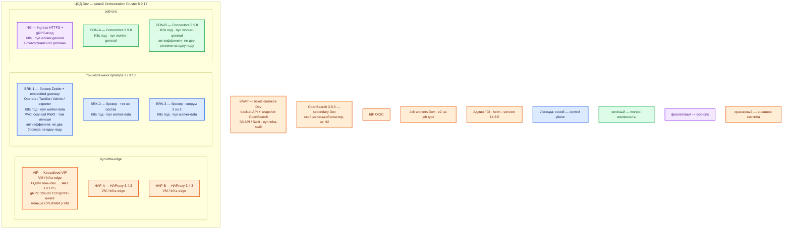

# Camunda 8.9.17 — Dev

Контур: **Dev**. Это **уменьшенный Prod**, не другой вид инсталляции: тот же Helm **`camunda-platform` 14.8.5**, тот же образ **`camunda/camunda:8.9.17`**, те же **3 / 3 / 3** брокеры/партиции/RF, тот же OpenSearch **3.8.0** как secondary. Не Camunda 8 Run, не Docker Compose, не H2, не один брокер «на VM по квикстарту».

Термины — как в Prod: брокер, партиция, RF, gateway, secondary storage, job worker, `CAMUNDA_LICENSE_KEY`.

## Допущения

- Один прикладной ЦОД. Stretch нет.
- Kubernetes, пара HAProxy 3.4.3 + Keepalived + VIP, имена StorageClass `local-ssd` / `shared-fs`, CoreDNS / `cluster.local`, зона `dev.…` — уже есть; меньше CPU/RAM/тома.
- Способ установки и роль-модель **как в Prod**. Схема «C8 Run / Compose / clusterSize=1» — другой класс системы: нет Raft между подами, нет кворума 2 из 3, обновление Helm отрабатывает иначе.
- Кворум на Dev: **3 маленьких брокера**, не 2 и не 1. Stateless (Connectors, Ingress): минимум **2** реплики на 2 нодах.
- Secondary — Dev-кластер OpenSearch 3.8.0 (тот же продукт, уменьшенная ёмкость). Bitnami Elasticsearch/PostgreSQL из чарта выкл. `orchestration.data.secondaryStorage.type: opensearch` обязателен.
- Optimize выкл. Web Modeler / Management Identity / Console в первый Dev не входят.
- Лицензия нужна: с 8.6 compiled Self-Managed без ключа не тот контур, что Prod. Для Dev допустим Non-Production key, но тот же механизм `global.license.secret` / **`CAMUNDA_LICENSE_KEY`**. Учебный `inlineSecret` в git не класть. C8 Run лицензию боя не моделирует.
- Нагрузка не боевая. Уменьшаем CPU/RAM/PVC, не число голосующих и не вид инсталляции.

## Схема инстансов

Потоков нет. Состав ролей совпадает с Prod; меньше ресурсы и диски.

ОС — свойство платформы, не пода. Один стандарт Linux на всех нодах контура.

Исключение вендора для серверных подов нет (тот же образ с OpenJDK 21–25). Не подменять ноду кластера ноутбуком с C8 Run.

| Имя пула | Роль | Зачем выделен |
|---|---|---|
| `infra-edge` | edge-VM | Та же пара HAProxy + VIP, что в Prod; меньше CPU/RAM у VM |
| `worker-general` | general | Ingress и две реплики Connectors; пул ≥ 2 нод (лучше 3, как Prod) |
| `worker-data` | data-localdisk | Три маленьких брокера на `local-ssd`; пул ≥ 3 нод |
| `infra-swift` | vendor / object | Бакет снимков; чтобы backup/restore отрабатывал, как в Prod |

## Комментарии к схеме

### Чем Dev упрощает Prod (и чем не упрощает)

| Меняем | Не меняем |
|---|---|
| CPU/RAM/PVC меньше | Helm 14.8.5, тег **8.9.17**, `--version` |
| Один ЦОД, нет Cold Recovery-зала | Роли: 3 брокера, RF=3, partitionCount=3 |
| Тома меньше, те же имена StorageClass | `local-ssd` RWO, не NFS, не `emptyDir` «потому что Dev» |
| Non-Production license key допустим | Механизм `CAMUNDA_LICENSE_KEY` / `global.license.secret` |
| Меньше Connectors CPU | 2 реплики Connectors, не 1 |

Так воспроизводятся ошибки вида инсталляции (накат чарта, выборы лидера, 26502 между подами, anti-affinity, экспорт в OpenSearch, backup ID), которые C8 Run **не** показывает.

### VIP, HAP-A/B — вход

- **Функционал.** Как в Prod: FQDN `dev.…` на VIP. HTTPS на UI/REST, **26500** — TCP или gRPC-aware.
- **Критично.** Пара HAProxy остаётся парой. Не публиковать 26501/26502/9600. Не HTTP L7 на 26500. Не подменять VIP одним `kubectl port-forward` как «единственный вход контура».

### BRK-1..3 — маленькие брокеры

- **Функционал.** Те же поды Orchestration Cluster, что в Prod: Raft, журнал, embedded gateway, Operate/Tasklist/Admin, exporter в OS 3.8.0.
- **Критично.** Три штуки, не одна и не две. Схема «2 брокера» — нет большинства при отказе одного (или split-brain-класс), это не уменьшенный Prod. Anti-affinity required; в пуле `worker-data` реально **≥ 3 нод**, иначе все брокеры сядут на один хост и Dev снова станет «как C8 Run, только в поде». PVC `local-ssd`, порядок **30–50 ГиБ**. Ресурсы порядка **1–2 vCPU, 4–8 ГиБ RAM** на под; CPULimit не ставить ниже того, что реально ест JVM. Уточняется замером. Тройка values та же: `clusterSize` / `partitionCount` / `replicationFactor` = 3/3/3.
- Учебные `demo`/`demo` и открытый API из `Camunda 8.install.md` (C8 Run) **не** копировать. OIDC как в Prod, пусть IdP будет стендовый.

### ING и CON-A/B

- **Функционал.** Тот же Ingress и Connectors 8.9.8.
- **Критично.** Connectors **не** схлопывать в 1 реплику: на Dev нужна балансировка нужного типа и отказ одной ноды (правило stateless). Секреты — Secret, не values в git.

### SNAP и OpenSearch

- **Функционал.** Тот же backup API + snapshot OS, меньший бакет. Нужен, чтобы на Dev гоняли restore, а не только «под живой».
- **Критично.** Не считать реплику Raft бэкапом. Не H2. Не общий индекс с учебным Docker OpenSearch `single-node`.

### Job workers

- Те же клиенты 8.9.x, те же порты 8080/26500 на FQDN Dev. ≥2 реплики воркера на job type — иначе не поймать «движок жив, работа стоит».

## Путь роста

На Dev рост не планируем как боевой. Если не хватает места — увеличить PVC/RAM **этих же** трёх брокеров, не переходить на C8 Run. Добавление брокеров и смена `partitionCount` — только как сознательная копия Prod-эксперимента (`partitionCount` всё равно не dynamic).

## Сильные и слабые места

**Сильная сторона.** Тот же Helm и те же 3 голосующих, что Prod: можно поймать сбой наката, выборов, anti-affinity, экспорта в OS и backup. Отказ одного маленького брокера остаётся переживаемым.

**Слабая сторона.** Малая ёмкость: OOM и диск наступят раньше. Один ЦОД: падение зала = нет оркестрации. Без трёх нод `worker-data` anti-affinity некуда исполнить.

**Критичные условия**

- Не C8 Run, не Compose, не H2, не `clusterSize: 1`.
- Не 2 брокера «чтобы сэкономить».
- Не NFS как диск журнала. Не `latest`.
- `CAMUNDA_LICENSE_KEY` задан (Secret). 26501/26502 не в интернет.
- Учебные пароли и открытый API из раздела «Учебный стенд» `Camunda 8.install.md` сюда не переносить.

## Источники

Те же, что у Prod:

- Матрица 14.8.5 / 8.9.17: https://helm.camunda.io/camunda-platform/version-matrix/camunda-8.9/
- Production Helm 3/3/3 (этот контур копирует механизм, не «dev quick-install» с одним брокером): https://docs.camunda.io/docs/self-managed/deployment/helm/install/production/
- Secondary `type: opensearch`: https://docs.camunda.io/docs/self-managed/deployment/helm/configure/database/using-external-opensearch/
- `global.license.secret`; `inlineSecret` только как вендорский non-prod пример: https://docs.camunda.io/docs/self-managed/deployment/helm/configure/secret-management/
- Лицензии SM с 8.6: https://docs.camunda.io/docs/reference/licenses/
- Диск, JDK, OpenSearch: https://docs.camunda.io/docs/reference/supported-environments/
- RF=3 / кворум: https://docs.camunda.io/docs/components/zeebe/technical-concepts/clustering/
- Порты: https://docs.camunda.io/docs/self-managed/components/orchestration-cluster/zeebe/operations/network-ports/
- Backup: https://docs.camunda.io/docs/self-managed/operational-guides/backup-restore/backup-and-restore/
- C8 Run **не** этот контур: https://docs.camunda.io/docs/self-managed/quickstart/developer-quickstart/c8run/
- Карточка / учебный install: `Out/Платформенная инфра/Camunda 8/Camunda 8.md`, `Camunda 8.shema.md`, `Camunda 8.install.md`

**В доке вендора нет:** готовая смета ядер под Dev; порог RTT; обещание, что Non-Production key покрывает конкретный стенд без договора с Camunda.
