# Camunda 8.9.17 — Prod

Контур: **Prod**. Self-Managed, Helm-чарт **`camunda-platform` 14.8.5**, образ Orchestration Cluster **`camunda/camunda:8.9.17`**. Не Camunda 8 Run, не Docker Compose, не линейка 7, не 8.10 Alpha.

**Orchestration Cluster** — ядро 8.9: брокеры Zeebe, встроенный gateway, Operate, Tasklist, Admin и экспортёр в одном StatefulSet. **Брокер** — под, который хранит журнал партиций и голосует в Raft. **Партиция** — осколок журнала со своим лидером. **Replication factor (RF)** — число копий каждой партиции. **Gateway** — вход клиентов: REST **8080**, gRPC **26500**; с 8.8 обычно встроен в под брокера. **Secondary storage** — поисковое представление для Operate/Tasklist/Admin; исполнение процесса живёт в журнале брокеров, не там. **Job worker** — ваш микросервис снаружи JVM движка: забирает сервисную задачу и возвращает id/статус.

## Допущения

- Два прикладных ЦОДа + один ЦОД под бэкапы. RTT между залами **не измерен**. Stretch одного Raft (порты **26501/26502**) на 2–3 ЦОДа **нет**. Официальный dual-region (минимум 4 брокера, RF=4, OpenSearch **не** поддерживается) **не выбран**.
- Живой кластер брокеров — **один ЦОД** (ЦОД-1): `clusterSize` / `partitionCount` / `replicationFactor` = **3 / 3 / 3**. ЦОД-2 — Cold Recovery (restore из согласованного backup), не второй живой кворум. ЦОД-бэкапы — бакеты снимков, не член Raft.
- На каждом прикладном ЦОДе уже есть Kubernetes 1.36.4, пара HAProxy 3.4.3 + Keepalived + VIP, StorageClass `local-ssd` (RWO) и `shared-fs` (RWX), CoreDNS / `cluster.local`, зона `prod.…`.
- Вторичное хранилище — отдельно развёрнутый **OpenSearch 3.8.0** той же площадки (свой продукт, свой кластер). Bitnami Elasticsearch/PostgreSQL из чарта **выключены**. С 8.9 без явного `orchestration.data.secondaryStorage.type` чарт **не ставится**; тип — `opensearch`. H2 в Helm-бою нет.
- **Optimize в первом бою выкл** (вендор: порядка ×3–4 к CPU/диску поиска). Web Modeler, Management Identity, Console и их PostgreSQL — опциональный контур, не на пути исполнения; в первый бой не входят. Desktop Modeler 5.46+ — на машине аналитика, не серверный инстанс.
- Connectors runtime **8.9.8** (матрица чарта) — 2 реплики. В ведомства коннекторы не плодить: интеграции — через интеграционное API платформы.
- С 8.6 compiled Self-Managed в production требует лицензию Enterprise; ключ — секрет `global.license.secret` (в приложениях это **`CAMUNDA_LICENSE_KEY`**). Без ключа бой нелегален.
- Нагрузка **не замерена**. Ниже — минимальная отказоустойчивая топология и порядок величины, не смета «хватит на терабайты». Терабайты карточек — в озере/СУБД, не в Zeebe.
- Kafka `:9092` через HAProxy площадки не публикуем. Клиенты и воркеры — по FQDN зоны `prod.…`, не по Pod IP.

## Схема инстансов

Потоков данных нет. ЦОД-2 не держит живых брокеров. Синий — голосующие брокеры Raft. Зелёный — Connectors. Фиолетовый — Ingress/gRPC-вход в кластере. Оранжевый — VIP, OpenSearch, бэкапы, IdP, воркеры.

```mermaid
flowchart TB
  subgraph DC1["ЦОД-1 — живой Orchestration Cluster 8.9.17"]
    subgraph EDGE1["пул infra-edge"]
      VIP1["VIP-1 — Keepalived VIP<br/>VM / infra-edge<br/>FQDN зоны prod.… :443 HTTPS<br/>gRPC :26500 TCP/gRPC-aware"]
      HAP1A["HAP-1A — HAProxy 3.4.3<br/>VM / infra-edge"]
      HAP1B["HAP-1B — HAProxy 3.4.3<br/>VM / infra-edge"]
    end
    subgraph CORE1["брокеры 3 / 3 / 3 · один Raft"]
      B11["BRK-1 — брокер Zeebe + embedded gateway<br/>Operate / Tasklist / Admin / exporter<br/>K8s под · пул worker-data<br/>PVC local-ssd RWO<br/>антиаффинити: не два брокера на одну ноду"]
      B12["BRK-2 — брокер · тот же состав<br/>K8s под · пул worker-data"]
      B13["BRK-3 — брокер · кворум записи 2 из 3<br/>K8s под · пул worker-data"]
    end
    subgraph ADD1["add-ons Camunda"]
      ING1["ING — Ingress HTTPS + gRPC-вход<br/>K8s · пул worker-general<br/>антиаффинити ≥2 реплики"]
      CON1A["CON-A — Connectors 8.9.8<br/>K8s под · пул worker-general"]
      CON1B["CON-B — Connectors 8.9.8<br/>K8s под · пул worker-general<br/>антиаффинити: не две реплики на одну ноду"]
    end
  end

  subgraph DC2["ЦОД-2 — Cold Recovery, без живого Raft"]
    subgraph EDGE2["пул infra-edge площадки"]
      VIP2["VIP-2 — свой FQDN зоны prod.…<br/>VM / infra-edge · K8s API и HTTP(S) площадки<br/>не advertised 26502 брокеров ЦОД-1"]
      HAP2A["HAP-2A — HAProxy 3.4.3<br/>VM / infra-edge"]
      HAP2B["HAP-2B — HAProxy 3.4.3<br/>VM / infra-edge"]
    end
    RST["RST — стенд restore<br/>Helm 14.8.5 + values как в ЦОД-1<br/>поды брокеров не в кворуме, пока не restore<br/>K8s / worker-data"]
  end

  subgraph BAK["ЦОД-бэкапы"]
    SNAP["SNAP — бакеты снимков<br/>backup API брокеров :9600 + snapshot OpenSearch<br/>один backup ID · S3 API / Swift<br/>VM / infra-swift"]
  end

  OS["OpenSearch 3.8.0 — secondary Camunda<br/>свой кластер ЦОД-1, не бизнес-поиск"]
  IDP["IdP OIDC"]
  WRK["Job workers — микросервисы платформы<br/>не поды Camunda · ≥2 на job type"]
  ADM["Админ / GitOps<br/>helm install --version 14.8.5"]

  LEGCORE["Легенда: синий — control plane"]
  LEGWORK["зелёный — worker-компоненты"]
  LEGADD["фиолетовый — add-ons"]
  LEGEXT["оранжевый — внешняя система"]

  classDef core fill:#dbeafe,stroke:#2563eb,color:#172554,stroke-width:2px;
  classDef worker fill:#dcfce7,stroke:#16a34a,color:#14532d,stroke-width:2px;
  classDef addon fill:#f3e8ff,stroke:#9333ea,color:#581c87,stroke-width:2px;
  classDef external fill:#ffedd5,stroke:#ea580c,color:#7c2d12,stroke-width:2px;

  class B11,B12,B13,LEGCORE core;
  class CON1A,CON1B,LEGWORK worker;
  class ING1,LEGADD addon;
  class VIP1,HAP1A,HAP1B,VIP2,HAP2A,HAP2B,RST,SNAP,OS,IDP,WRK,ADM,LEGEXT external;
```

ОС — свойство платформы, не пода. Один стандарт Linux на всех нодах контура.

Исключение вендора для серверных подов нет: образ брокера несёт OpenJDK **21–25**. Ubuntu 22.04+ относится к учебному C8 Run на VM, не к этому контуру.

| Имя пула | Роль | Зачем выделен |
|---|---|---|
| `infra-edge` | edge-VM | Пара HAProxy + Keepalived + VIP: HTTPS край и TCP/gRPC `:26500`. Не Raft `:26502` |
| `worker-general` | general | Ingress и Connectors. Без ставки на локальный SSD журнала |
| `worker-data` | data-localdisk | Три брокера: журнал и snapshot на `local-ssd` (RWO). Пул ≥ 3 нод |
| `infra-swift` | vendor / object | Бакеты backup в ЦОДе бэкапов; не CSI-диск брокера |

## Комментарии к схеме

### VIP-1 / HAP-1A/B — вход живой площадки

- **Функционал.** Одно имя зоны `prod.…` для людей (Operate/Tasklist/Admin) и для REST. Отдельное имя (или тот же VIP другим портом) для gRPC воркеров **26500**. HAProxy 3.4.3 — край; TLS снаружи.
- **Критично.** На **26500** — L4 или gRPC-aware: обычный HTTP L7 рвёт долгие стримы воркеров. Порты **26501** (команды gateway→брокер) и **26502** (Gossip + Raft) на VIP **не** публиковать и между ЦОДами как один кластер не открывать. **9600** (метрики, Backup API) — служебная сеть, не интернет. Kafka `:9092` сюда не публиковать. Клиенты не ходят на Pod IP брокера.

### BRK-1..3 — брокеры Orchestration Cluster

- **Функционал.** Исполняют BPMN/DMN, хранят primary state (журнал + snapshot), выбирают лидера партиции по Raft, подтверждают commit кворумом копий (при RF=3 достаточно большинства). В том же поде — embedded gateway (8080/26500), Operate, Tasklist, Admin, Camunda Exporter в OpenSearch 3.8.0.
- **Критично.** Тройка **одинаковая на всех брокерах**: `orchestration.clusterSize: "3"`, `partitionCount: "3"`, `replicationFactor: "3"`. RF не больше числа брокеров. Два мёртвых брокера из трёх снимают кворум. Чарт: `camunda/camunda-platform` **`--version 14.8.5`**, образ **не** `latest`. Пин компонентов — матрица чарта, патчи вручную не выравнивать.
- **Диск.** PVC **`local-ssd`**, RWO, свой на под. SSD, ≥ **1000 IOPS**, p99 записи < **300 мс**; HDD вендор не поддерживает. `shared-fs` / NFS как диск журнала не берём (платформа: stateful-операторы на `local-ssd`). ReclaimPolicy StorageClass в бою — **Retain**: Delete + удаление PVC = безвозвратная потеря журнала.
- **Размещение.** Пул `worker-data` ≥ 3 нод. Anti-affinity **required** (в чарте дефолт для компонента `zeebe` — не два пода на `kubernetes.io/hostname`). PDB: не снимать 2 из 3 при drain; ориентир `maxUnavailable: 1`. Пример вендора `podDisruptionBudget.enabled: false` в бой как «рекомендация выключить» не копировать.
- **Лицензия и secondary.** До `helm install`: Secret лицензии (`global.license.secret`, не `inlineSecret` в values) и Secret пароля OpenSearch (`orchestration.data.secondaryStorage.opensearch.auth.secret.existingSecret`). `orchestration.data.secondaryStorage.type: opensearch` и URL FQDN кластера OS 3.8.0. `elasticsearch.enabled: false`. Индексы Camunda — **свой** OpenSearch, не бизнес-поиск и не Wazuh indexer: падение общего кластера душит и поиск, и процессы (backpressure экспортёра).
- **Ёмкость.** Цифр «хватит N партиций / ядер под терабайты» в мануале **нет**. Ориентир старых замеров поставщика ~**3,5 ядра на брокер** — намёк **не душить CPULimit**, не смета. Пример limits в production-гайде Helm (`cpu: 2000m`) ниже этого ориентира — не принимать за расчёт боя. Порядок величины на под: **4 vCPU, 8–16 ГиБ RAM**, PVC сотни ГиБ; **уточняется замером**. Партиция тянет порядка ~**1 ГиБ** суммарного payload — эвристика вендора. Переменные процесса — id/статус, не досье (потолок порядка **~3 МБ** на экземпляр).
- **Аутентификация.** Бой — OIDC корпоративного IdP, не `demo`/`demo` и не открытый API C8 Run. Admin Orchestration Cluster ≠ Management Identity.

### ING — Ingress / gRPC-вход

- **Функционал.** Сводит HTTPS `:443` на REST/UI `:8080` и (если не один HAProxy TCP) gRPC-хост на `:26500`. ≥2 реплики контроллера — свойство площадки Kubernetes.
- **Критично.** Продукт контроллера в карточке Camunda не фиксируем. Self-signed в бой не рекомендует вендор. Helm `values-tls` **не** закрывает весь pod-to-pod gRPC — mesh отдельно, если нужен.

### CON-A/B — Connectors

- **Функционал.** Runtime готовых connector tasks (HTTP, Kafka-шаблоны и т.п.). Stateless Deployment, образ `camunda/connectors-bundle:8.9.8`.
- **Критично.** Минимум **2** реплики на разных нодах `worker-general`. Не заменяет интеграционное API. Секреты коннекторов — Kubernetes Secret / Vault, не git и не переменные BPMN.

### RST — ЦОД-2 Cold Recovery

- **Функционал.** Готовность поднять тот же Helm 14.8.5 и восстановить backup. Пока ЦОД-1 жив, RST **не** голосует в Raft и не принимает commit.
- **Критично.** Не склеивать 26502 ЦОД-1 и ЦОД-2. Два независимых живых 3/3/3 — два движка и развилка процессов, не HA. Падение ЦОД-1 = нет оркестрации, пока не прогнан restore (RPO/RTO = частота backup и скорость прогона). Воркеры второй площадки в штате ходят на FQDN gateway ЦОД-1; порога RTT у вендора для «воркер в другом зале» нет — если замер покажет плохо, воркеры держать в ЦОД-1.

### SNAP — бэкапы

- **Функционал.** Согласованная копия: Backup API Orchestration Cluster (**9600**) + snapshot-репозиторий OpenSearch, **один backup ID** (для ES/OS-пути вендор советует Unix timestamp). Обычный disk snapshot PVC брокера ≠ согласованный backup кластера.
- **Критично.** Бакет **не** на дисках того же зала, что журнал. Restore без прогона на стенде — риск. Реплики Raft не спасают от `DELETE` PVC.

### OpenSearch 3.8.0 и job workers

- OS — внешний продукт: HA и диски — в его инструкции. Для Camunda он обязателен как secondary: без него UI процессов пустой; длительный простой OS приводит к backpressure на весь кластер.
- Воркеры — Deployment платформы, не Camunda. Клиент 8.9.x, gRPC `https://…:26500` / REST `https://…:443`. На job type — ≥2 реплики: «Zeebe зелёный, воркеры лежат» = процессы стоят на jobs. Встроенной метрики backlog у вендора **нет**.

### Чего на схеме нет специально

- C8 Run, Docker Compose, H2, учётка `demo`.
- Dual-region (8 брокеров, RF=4).
- Optimize, Web Modeler, Management Identity, Console, Bitnami-субчарты.
- Stretch 26502.

## Путь роста

Не включать сразу.

1. Замер: CPU throttling, commit latency, отставание Operate, диск OS, backlog воркеров.
2. Снять душирующий CPULimit брокера; вырастить PVC `local-ssd` (нужен `allowVolumeExpansion`).
3. Добавить **брокеры** (`clusterSize`) в **том же** ЦОДе, не второй зал.
4. `partitionCount` **нельзя** менять на живую (вендор: dynamic partitioning ещё нет). Больше партиций — заранее заложить или миграция, не «ещё шард кнопкой». Параллелизм ≈ число партиций, не «ещё Operate».
5. Включить Optimize только после отдельного бюджета OS (×3–4) или выделенного поискового кластера.
6. Контур Web Modeler / Identity — внешний PostgreSQL, не путь исполнения.

Upgrade: 8.9 только с **8.8.x**; не прыгать minor. Чарт пинить **14.8.5**, пока платформа не сменит патч.

## Сильные и слабые места

**Сильная сторона.** Официальный Helm, та же роль-модель, что Dev. Commit не ждёт чужой ЦОД. Отказ одного брокера переживается (RF=3). Secondary — поддержанный OpenSearch 3.8.0. Blast radius живого Raft = ЦОД-1.

**Слабая сторона.** Смерть ЦОД-1 останавливает оркестрацию до restore. HA брокеров без HA OpenSearch дырявая. Ёмкость без замера неизвестна. `partitionCount` на старте фиксируется.

**Критичные условия**

- Не C8 Run / Compose / H2 «чуть подкрученный» в бой.
- Не stretch 26501/26502 и не dual-region с OpenSearch.
- Нужен **`CAMUNDA_LICENSE_KEY`** (Enterprise). Не `inlineSecret` в git.
- Не `latest`, не чарт без `--version 14.8.5`.
- Не NFS/`shared-fs` как диск журнала; не HDD.
- Не общий OpenSearch с бизнес-поиском/Wazuh.
- 26501/26502/9600 не в интернет; 26500 не HTTP L7.
- XML-досье не класть в переменные процесса.

## Источники

- Матрица чарта 14.8.5 / `camunda/camunda:8.9.17`, Connectors 8.9.8, Optimize 8.9.17, Identity 8.9.8, Web Modeler 8.9.7, Console 8.9.88: https://helm.camunda.io/camunda-platform/version-matrix/camunda-8.9/
- Production Helm, 3/3/3, Bitnami в бою выкл, PVC Retain, anti-affinity: https://docs.camunda.io/docs/self-managed/deployment/helm/install/production/
- `orchestration.data.secondaryStorage.type: opensearch`, без типа с 8.9 нет дефолта: https://docs.camunda.io/docs/self-managed/deployment/helm/configure/database/using-external-opensearch/
- Лицензия compiled SM с 8.6; бой = Enterprise: https://docs.camunda.io/docs/reference/licenses/
- Секрет лицензии `global.license.secret`: https://docs.camunda.io/docs/self-managed/deployment/helm/configure/secret-management/
- Поддерживаемые среды: OpenJDK 21–25, OpenSearch 3.4+/2.19+, диск ≥1000 IOPS, SSD, p99 < 300 мс, Desktop Modeler 5.46+, Helm CLI матрицы: https://docs.camunda.io/docs/reference/supported-environments/
- Кластеризация, RF=3, кворум, dual-region как исключение RF=4: https://docs.camunda.io/docs/components/zeebe/technical-concepts/clustering/
- Dual-region: OpenSearch не поддерживается; порты 26500/26501/26502 между регионами: https://docs.camunda.io/docs/self-managed/concepts/multi-region/dual-region/
- Порты 8080 / 26500 / 26501 / 26502 / 9600: https://docs.camunda.io/docs/self-managed/components/orchestration-cluster/zeebe/operations/network-ports/
- Backup API, не disk snapshot; общий backup ID для OS-пути: https://docs.camunda.io/docs/self-managed/operational-guides/backup-restore/backup-and-restore/
- Sizing: ~3,5 ядра/брокер как выравнивание, ~3 МБ/экземпляр, ~1 ГиБ payload на партицию, Optimize ×3–4, нет метрики backlog: https://docs.camunda.io/docs/components/best-practices/architecture/sizing-your-environment/
- C8 Run **не** production: https://docs.camunda.io/docs/self-managed/quickstart/developer-quickstart/c8run/
- Карточка / схемы платформы (не копировать учебный install в бой): `Out/Платформенная инфра/Camunda 8/Camunda 8.md`, `Camunda 8.shema.md`, `Camunda 8.install.md`

**В доке вендора нет (не выдумано):** порог RTT на 26502 между ЦОДами; смета ядер/дисков «хватит для терабайтов»; готовый RTO Cold Recovery без прогона restore.
