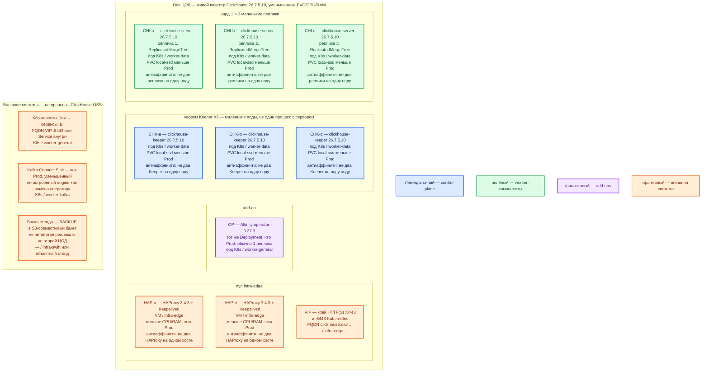

# ClickHouse OSS 26.7.5.10 + Altinity Operator 0.27.3 — развёртывание Dev

Dev — **уменьшенный Prod**, не другой вид инсталляции. Тот же механизм: **Kubernetes + оператор Altinity 0.27.3**, объекты **CHK ×3** и **CHI 1 шард × 3 реплики**, образы **26.7.5.10**. Не учебный `docker run` одного `clickhouse-server`, не Docker Compose, не встроенный Keeper в том же процессе, не «один под на одной ноде».

## Допущения

1. Контур Dev: **1 ЦОД**. Второго прикладного зала и отдельного ЦОД-бэкапов **нет** — бакет снимков на схеме как внешнее (S3 API / Swift стенда или выделенный бакет), не как третий Keeper и не как четвёртая реплика этого кластера.
2. Роль-модель **как в Prod**: оператор + 3 Keeper + 3 реплики сервера + пара HAProxy+Keepalived+VIP. Уменьшают **CPU/RAM/размер PVC**, не число голосующих и не вид инсталляции. Схема «1 docker clickhouse-server» из `ClickHouse.install.md` / `sample/ClickHouse.md` **не** воспроизводит отказ ноды, выборы лидера Keeper, `ON CLUSTER` и накат оператора — для Task_6 она **запрещена**.
3. Кворум на Dev остаётся **нечётным: 3 маленьких Keeper**. Два Keeper — другой класс системы (нет большинства; отказ одного = тупик или split-brain). Реплик сервера тоже **три** (как Prod / вендор on-prem ≥3), только меньше диск и requests. Не резать до одной копии «чтобы влезло».
4. Dedicated-процессы те же (CHK отдельно от CHI). На Dev **допустимо** посадить одну пару «Keeper + реплика» на одну ноду `worker-data` (3 ноды вместо ~6 Prod) — это уменьшение ёмкости нод, не смена механизма. Двух Keeper или двух реплик на одну ноду — нет.
5. StorageClass **те же имена**: `local-ssd` (RWO) для CHI/CHK; `shared-fs` для ClickHouse **не** используем. Тома **меньше** Prod (порядок **десятков ГиБ**, не ТиБ). NFS / `emptyDir` — нет.
6. Версии: сервер и Keeper **26.7.5.10**, оператор **0.27.3**. Не смешивать с **26.3**. Не `latest`. Не образы Altinity **25.8** из quickstart.
7. Цифр ядер «для Dev-кластера» в мануале **нет**. Нижние ориентиры вендора: сервер **не ниже 8 ГиБ** RAM; Keeper «**4GB RAM** is generally enough…». Меньше 8 ГиБ на учебном одном контейнере — решение карточки стенда, **не** этот контур (здесь три сервера как в Prod). Ёмкость уточняется замером. ([sizing](https://clickhouse.com/docs/guides/oss/best-practices/sizing-and-hardware-recommendations), [репликация](https://clickhouse.com/docs/architecture/replication))
8. Клиенты — по FQDN зоны `dev.…` на VIP (**8443**) или Service внутри `cluster.local`. Stretch нет (один ЦОД). Kafka `:9092` через HAProxy площадки не публиковать. Interserver **9009/9010** и Raft **9234** наружу не открывать.
9. Поток из Kafka: чтобы ловить те же классы ошибок, что Prod, **предпочесть Connect Sink**, не встроенный Kafka engine как единственный путь. На совсем закрытом мини-стенде engine допустим — это **слабее** паритета (дубли at-least-once). Явно помечать, какой режим включён.
10. Учебные пароли `dev` / `dev-app` из `ClickHouse.install.md` **не** копировать даже в Dev-кластер как «боевые»; задать свои секреты стенда. Приложения — пользователь `app`, база `analytics`, не `default`.

## Схема инстансов

Синий — управляющие/голосующие роли (Keeper). Зелёный — data-инстансы (`clickhouse-server`). Фиолетовый — оператор. Оранжевый — внешнее (VIP, клиенты, бакет, Connect). На схеме **нет** потоков данных.

ОС — свойство платформы, не пода. Один стандарт Linux на всех нодах контура.

Исключение вендора: тот же образ OSS на `ubuntu:22.04`, CPU **x86-64-v3** или ARMv8.2-A. Отдельной Windows-сборки сервера нет. ([Docker](https://clickhouse.com/docs/get-started/setup/self-managed/docker))

| Имя пула | Роль | Зачем выделен |
|---|---|---|
| `infra-edge` | edge-VM | Та же пара HAProxy 3.4.3 + Keepalived + VIP, меньше CPU/RAM. Не Kafka `:9092`. |
| `worker-general` | general | Оператор и клиенты. Без дисков CHI/CHK. |
| `worker-data` | data-localdisk | 3 ноды: на каждой не более одного Keeper и не более одной реплики. **`local-ssd`**, тома меньше Prod. |
| `worker-kafka` | kafka | Connect, если включён. |
| `infra-swift` | vendor / object | Бакет `BACKUP` стенда. Не PVC ClickHouse. |

## Комментарии к схеме

### HAP-a / HAP-b и VIP

- **Функционал.** Как Prod: VIP = `:6443` Kubernetes и край HTTP(S) **8443** к Service CHI. Native **9440/9000** и порты Keeper/interserver на VIP не публиковать.
- **Критично.** Пара на **двух** VM, не один HAProxy «для экономии». Иначе отказ входа не воспроизведётся. Health-check `/ping` сервера данных. Клиенты — FQDN `dev.…`, не Pod IP. ([порты](https://clickhouse.com/docs/concepts/features/security/network-ports), [HTTP](https://clickhouse.com/docs/concepts/features/interfaces/http))

### OP — оператор 0.27.3

- **Функционал.** Тот же контроллер: CHI + CHK. Накат образа, PDB-логика 0.27.3 (не ронять последнюю здоровую реплику шарда) должна работать как в Prod — это как раз класс ошибок, который Docker-quickstart **не** ловит. ([0.27.3](https://github.com/Altinity/clickhouse-operator/releases/tag/release-0.27.3), [CHK](https://docs.altinity.com/altinitykubernetesoperator/kubernetesquickstartguide/quickzookeeper/))
- **Критично.** Пин **0.27.3**. Не ставить оператор «только в Prod». Не копировать YAML туториала с образом 25.8 и `replicasCount: 2`. `storageClassName: local-ssd`. Вендорский Deployment оператора в гайде — **1/1**; вторую реплику контроллера не добавляем без страницы вендора про HA оператора.

### CHK-a / CHK-b / CHK-c

- **Функционал.** Три маленьких `clickhouse-keeper` **26.7.5.10**. Кворум Raft, метаданные репликации, `ON CLUSTER`. Порты карточки: клиент **9181** (TLS **9281**), Raft **9234**.
- **Критично.** Именно **три**, не один «Keeper в clickhouse-server» и не два. Свои PVC `local-ssd`. Антиаффинити Keeper. PDB: maxUnavailable 1. Порт в CHI = порт CHK (не слепо 2181 из примера Altinity, если образ слушает 9181). `server_id` не тасовать. Версия не 26.3. Два мёртвых Keeper — тот же отказ, что в Prod: реплицируемые таблицы без координации.

### CHI-a / CHI-b / CHI-c

- **Функционал.** Три маленьких `clickhouse-server` **26.7.5.10**, **ReplicatedMergeTree**, один шард. SQL, части, обмен **9009/9010**.
- **Критично.**
  - Не заменять тройку одним контейнером с MergeTree: это другая модель отказа и другой накат обновлений.
  - `ulimit nofile=262144`. PVC Retain, не `emptyDir`.
  - Антиаффинити реплик. На Dev реплика **может** делить ноду с **одним** Keeper — не с другой репликой.
  - `ON CLUSTER` + макросы `{shard}`/`{replica}`. `insert_quorum=2` (или `'auto'`) — иначе Dev «всегда пишет», а Prod с кворумом начнёт отказывать, и ошибку не поймаете.
  - `SELECT version()` = **26.7.5.10**. Пользователь `app`, не `default`. TLS как в Prod (8443/9440/9010/9281), если Prod так включает: иначе расхождение «на Dev без TLS завелось».
  - Эмуляции 9004/9005/9100 выключены.

### Клиенты, Connect, бэкап

- Клиенты по FQDN. JDBC = HTTP, не `:9000` как HTTP. ([JDBC](https://clickhouse.com/docs/integrations/language-clients/java/jdbc))
- Connect — уменьшенный, тот же класс, что Prod. Встроенный Kafka engine — только если явно приняли слабый паритет.
- `BACKUP` в бакет **нужен** и на Dev: иначе не отрепетируете restore и не увидите, что реплики повторяют `DROP`. Бакет не обязан быть отдельным ЦОДом, но не должен жить только на тех же трёх `local-ssd`.

## Ёмкость Dev

Порядок величины, меньше Prod, не другие роли:

| Роль | Ориентир | Откуда |
|---|---|---|
| Реплика server | RAM **≥ 8 ГиБ** (пол вендора); диск PVC — **десятки ГиБ** `local-ssd`, не ТиБ Prod; CPU requests меньше, цель утилизации ad-hoc **10–20%** не нормировать на стенде | [sizing](https://clickhouse.com/docs/guides/oss/best-practices/sizing-and-hardware-recommendations) |
| Keeper | RAM порядка **4 ГиБ** (формулировка вендора «generally enough»); PVC журнал — единицы–десятки ГиБ | [репликация](https://clickhouse.com/docs/architecture/replication) |
| HAProxy | меньше CPU/RAM, **два** инстанса | платформа |

Не обещать «хватит для терабайтов»: на Dev терабайтов нет, паритет — **вид** кластера.

## Путь роста

Как Prod, только цифры меньше. На Dev **не** плодить шарды «чтобы было как потом в бою»: вендор — сначала вертикаль одной копии. Когда понадобится проверить решардинг — отдельный эксперимент, не стартовая схема.

1. Поднять CPU/RAM/диск реплики.
2. Расширить PVC `local-ssd`.
3. Развести Keeper и сервер на разные ноды (приближение к Prod dedicated hosts).
4. Шард — позже, отдельным проектом.
5. Репетировать `RESTORE` из бакета.

## Сильные и слабые места; критичные условия

**Сильное:** тот же оператор, тот же кворум из трёх, три копии шарда — можно поймать ошибку наката, антиаффинити, `insert_quorum`, `ON CLUSTER`, отказ одной ноды.

**Слабое:** колокация Keeper с репликой на одной ноде Dev не показывает «merge убил fsync Raft» так же, как Prod на раздельных хостах; нет второго ЦОДа — не проверяется restore после потери зала, только restore с бакета на этом же кластере/запасных PVC; маленький диск не проявит TTL/слияния на терабайтах.

**Критично:**

- Не `docker run clickhouse-server` вместо CHI/CHK.
- Не 1 и не 2 Keeper.
- Не смесь 26.7 / 26.3, не `latest`.
- Не NFS / не `shared-fs` / не `emptyDir`.
- Не публиковать 9009/9181/9234 на VIP.
- Не считать успешный `SELECT version()` на одном поде доказательством кластера.

## Источники

Те же официальные URL, что в `ClickHouse.prod.md`. Кратко:

- Релиз 26.7.5.10: https://github.com/ClickHouse/ClickHouse/releases/tag/v26.7.5.10-stable
- Keeper: https://clickhouse.com/docs/guides/oss/deployment-and-scaling/keeper
- Репликация / dedicated Keeper / 4GB: https://clickhouse.com/docs/architecture/replication
- Sizing: https://clickhouse.com/docs/guides/oss/best-practices/sizing-and-hardware-recommendations
- Порты: https://clickhouse.com/docs/concepts/features/security/network-ports
- Docker (стенд, не этот контур): https://clickhouse.com/docs/get-started/setup/self-managed/docker
- BACKUP: https://clickhouse.com/docs/concepts/features/backup-restore/overview
- Оператор 0.27.3: https://github.com/Altinity/clickhouse-operator/releases/tag/release-0.27.3
- CHK: https://docs.altinity.com/altinitykubernetesoperator/kubernetesquickstartguide/quickzookeeper/
- Карточка: `Out/Поиск и аналитика/ClickHouse/ClickHouse.md`; стендовый Docker: `ClickHouse.install.md` (не копировать в Dev Task_6)

**В доке вендора нет (не выдумано):** порог RTT; смета ядер «для Dev»; разрешение заменить тройку Keeper одним контейнером; NFS как data dir.
