# ClickHouse OSS 26.7.5.10 + Altinity Operator 0.27.3 — развёртывание Prod

**ClickHouse** — колоночная аналитическая СУБД (сканы и агрегаты по большим таблицам, не точечный `UPDATE` карточки). **Keeper** — отдельный процесс координации реплицируемых таблиц и распределённого DDL (команд `CREATE`/`ALTER`/`DROP` по кластеру): голосует протоколом Raft. **Оператор Altinity** — контроллер Kubernetes: приводит объекты `ClickHouseInstallation` (CHI, кластер серверов) и `ClickHouseKeeperInstallation` (CHK, кворум Keeper) к описанному состоянию. Это не часть ClickHouse OSS.

## Допущения

1. Контур Prod: **2 прикладных ЦОДа** (каждый со своим Kubernetes **1.36.4** и своим входом HAProxy) **+ 1 ЦОД под бэкапы**. Задержка между площадками **не измерена**. Stretch одного кворума Keeper / одного живого кластера на 2–3 ЦОДа **нет**: порога допустимого RTT в документации ClickHouse **нет**. ([Keeper](https://clickhouse.com/docs/guides/oss/deployment-and-scaling/keeper), карточка `ClickHouse.md`)
2. На каждом прикладном ЦОДе — **свой** живой кластер: **1 шард × 3 реплики** `clickhouse-server` **26.7.5.10** + **3** выделенных `clickhouse-keeper` **той же** сборки. ЦОД-2 — не «третья реплика» и не «третий Keeper» кворума ЦОД-1. Единого `SELECT` по двум кластерам без прикладного слоя **нет**.
3. ЦОД-бэкапы **не** входит в Raft Keeper и **не** принимает interserver **9009/9010**. Туда кладут снимки `BACKUP` в S3-совместимое хранилище (на платформе — **OpenStack Swift** на своих дисках, не CSI). Реплики **не** заменяют бэкап: `DROP` уедет на все копии. ([BACKUP / RESTORE](https://clickhouse.com/docs/concepts/features/backup-restore/overview), [репликация](https://clickhouse.com/docs/architecture/replication))
4. Способ установки — **Kubernetes + оператор Altinity 0.27.3** (CHI + CHK), не пакеты на VM «вместо» оператора, не Docker Compose, не учебный `docker run` из `ClickHouse.install.md`. В `.install.md` сейчас описан **только** учебный контейнер; боевой путь — карточка, роль консультанта и официальные страницы вендора/оператора.
5. Образы: `clickhouse/clickhouse-server:26.7.5.10` и `clickhouse/clickhouse-keeper:26.7.5.10`. Не `latest`, не ветка `26.7` без патча. **Не** копировать теги из quickstart Altinity (`altinity/clickhouse-*:25.8…`). **Не** смешивать сервер 26.7 с Keeper 26.3 (и наоборот). Если политика потребует LTS — **весь** кластер на **26.3.21.7-lts**, отдельным решением, не «половина». ([релиз 26.7.5.10](https://github.com/ClickHouse/ClickHouse/releases/tag/v26.7.5.10-stable), [оператор 0.27.3](https://github.com/Altinity/clickhouse-operator/releases/tag/release-0.27.3))
6. Нагрузка **не замерена**. Ниже — **минимальная отказоустойчивая** топология (кворум 3, три копии шарда), не «все шарды вендора под терабайты». Цифр «хватит N ядер / N шардов на ваши терабайты» в мануале **нет**. Ёмкость — **порядок величины**, уточняется замером. ([sizing](https://clickhouse.com/docs/guides/oss/best-practices/sizing-and-hardware-recommendations))
7. Официальный оператор под наш K8s есть, данные не требуют сырых дисков вне CSI → размещение **в Kubernetes**. Тома данных и журналов Keeper — StorageClass **`local-ssd`** (RWO, локальный SSD). **`shared-fs` (RWX) для ClickHouse не используем.** NFS как каталог данных вендор не описывает; `emptyDir` не переживает пересоздание пода.
8. Сеть в деталях (VLAN, IP-план) **вне рамок**. VIP HAProxy 3.4.3 + Keepalived = ControlPlaneEndpoint Kubernetes `:6443` (TCP passthrough) и край **HTTP(S)**. Клиенты ClickHouse снаружи — по **FQDN** зоны `prod.…` на VIP (**8443** HTTPS). Native **9440/9000**, Keeper **9181/9281**, Raft **9234**, interserver **9009/9010** через этот HAProxy **не** публикуем. Kafka `:9092` через него же **не** публикуем. Внутри кластера — CoreDNS / `cluster.local`. Клиенты не ходят по Pod IP.
9. Поток из Kafka в бою — отдельно развёрнутый **ClickHouse Kafka Connect Sink** (exactly-once при корректном конвейере). Встроенный Kafka table engine на Prod **не** основной путь (at-least-once, возможны дубли). Connect — не процесс `clickhouse-server`. ([Kafka engine](https://clickhouse.com/docs/integrations/kafka/kafka-table-engine), [Connect Sink](https://clickhouse.com/docs/integrations/kafka/clickhouse-kafka-connect-sink))
10. Вендор для боя: Keeper на **выделенных** хостах, не в одном процессе с `clickhouse-server`. Для Keeper «4GB RAM is generally enough until your ClickHouse Servers grow large». Для сервера данных RAM **не ниже 8 ГиБ**. On-prem: **не меньше трёх реплик на шард**. Сначала вертикаль копии, шарды — когда одна машина мала. ([репликация / dedicated Keeper](https://clickhouse.com/docs/architecture/replication), [sizing](https://clickhouse.com/docs/guides/oss/best-practices/sizing-and-hardware-recommendations))

## Схема инстансов

Синий — управляющие/голосующие роли продукта (кворум Keeper). Зелёный — рабочие/data-инстансы (`clickhouse-server`). Фиолетовый — оператор/add-on. Оранжевый — внешнее (VIP, HAProxy, Kubernetes-клиенты, Swift, Kafka Connect, ЦОД-бэкапы). На схеме **нет** потоков данных.

**Шард** — горизонтальная часть набора данных; на старте шард один, каждая реплика хранит полную копию. **Реплика** — самостоятельный `clickhouse-server` со своим диском. **CHI / CHK** — декларации оператора, не сами данные.

```mermaid
flowchart TB
  subgraph DC1["ЦОД-1 — живой кластер ClickHouse 26.7.5.10"]
    subgraph EDGE1["пул infra-edge"]
      HAP1A["HAP-1a — HAProxy 3.4.3 + Keepalived<br/>VM / infra-edge<br/>антиаффинити: не два HAProxy на одном хосте"]
      HAP1B["HAP-1b — HAProxy 3.4.3 + Keepalived<br/>VM / infra-edge<br/>антиаффинити: не два HAProxy на одном хосте"]
      VIP1["VIP-1 — край HTTP(S) :8443 ClickHouse<br/>и :6443 Kubernetes<br/>FQDN clickhouse.prod.…<br/>— / infra-edge"]
    end
    subgraph ADD1["add-on ЦОД-1"]
      OP1["OP-1 — Altinity operator 0.27.3<br/>Deployment, как у вендора обычно 1 реплика<br/>под K8s / worker-general"]
    end
    subgraph KEP1["кворум Keeper ×3 — выделенные ноды"]
      K1A["CHK-1a — clickhouse-keeper 26.7.5.10<br/>под K8s / worker-data<br/>PVC local-ssd RWO<br/>антиаффинити: не два Keeper на одну ноду;<br/>не сажать с clickhouse-server"]
      K1B["CHK-1b — clickhouse-keeper 26.7.5.10<br/>под K8s / worker-data<br/>PVC local-ssd RWO<br/>антиаффинити: не два Keeper на одну ноду;<br/>не сажать с clickhouse-server"]
      K1C["CHK-1c — clickhouse-keeper 26.7.5.10<br/>под K8s / worker-data<br/>PVC local-ssd RWO<br/>антиаффинити: не два Keeper на одну ноду;<br/>не сажать с clickhouse-server"]
    end
    subgraph SH1["шард 1 × 3 реплики"]
      R1A["CHI-1a — clickhouse-server 26.7.5.10<br/>реплика 1, ReplicatedMergeTree<br/>под K8s / worker-data<br/>PVC local-ssd RWO<br/>антиаффинити: не две реплики на одну ноду"]
      R1B["CHI-1b — clickhouse-server 26.7.5.10<br/>реплика 2, ReplicatedMergeTree<br/>под K8s / worker-data<br/>PVC local-ssd RWO<br/>антиаффинити: не две реплики на одну ноду"]
      R1C["CHI-1c — clickhouse-server 26.7.5.10<br/>реплика 3, ReplicatedMergeTree<br/>под K8s / worker-data<br/>PVC local-ssd RWO<br/>антиаффинити: не две реплики на одну ноду"]
    end
  end

  subgraph DC2["ЦОД-2 — независимый живой кластер, тот же вид"]
    subgraph EDGE2["пул infra-edge"]
      HAP2A["HAP-2a — HAProxy 3.4.3 + Keepalived<br/>VM / infra-edge<br/>антиаффинити: не два HAProxy на одном хосте"]
      HAP2B["HAP-2b — HAProxy 3.4.3 + Keepalived<br/>VM / infra-edge<br/>антиаффинити: не два HAProxy на одном хосте"]
      VIP2["VIP-2 — край HTTP(S) :8443<br/>FQDN зоны prod.… этой площадки<br/>— / infra-edge"]
    end
    subgraph ADD2["add-on ЦОД-2"]
      OP2["OP-2 — Altinity operator 0.27.3<br/>свой контроллер этого K8s<br/>под K8s / worker-general"]
    end
    subgraph KEP2["кворум Keeper ×3 — свой, не член кворума ЦОД-1"]
      K2A["CHK-2a — clickhouse-keeper 26.7.5.10<br/>под K8s / worker-data<br/>PVC local-ssd RWO"]
      K2B["CHK-2b — clickhouse-keeper 26.7.5.10<br/>под K8s / worker-data<br/>PVC local-ssd RWO"]
      K2C["CHK-2c — clickhouse-keeper 26.7.5.10<br/>под K8s / worker-data<br/>PVC local-ssd RWO"]
    end
    subgraph SH2["шард 1 × 3 реплики — своя правда таблиц"]
      R2A["CHI-2a — clickhouse-server 26.7.5.10<br/>под K8s / worker-data<br/>PVC local-ssd RWO"]
      R2B["CHI-2b — clickhouse-server 26.7.5.10<br/>под K8s / worker-data<br/>PVC local-ssd RWO"]
      R2C["CHI-2c — clickhouse-server 26.7.5.10<br/>под K8s / worker-data<br/>PVC local-ssd RWO"]
    end
  end

  subgraph EXT["Внешние системы — не процессы ClickHouse OSS"]
    K8S["K8s-клиенты — сервисы, BI, Grafana<br/>FQDN VIP :8443 или Service :9440 внутри<br/>K8s / worker-general"]
    KC["Kafka Connect Sink — exactly-once в бою<br/>отдельный продукт, не под CHI<br/>K8s / worker-kafka или как велит карточка Kafka"]
    BAK["ЦОД-бэкапы — бакет BACKUP S3 API / Swift<br/>не третий Keeper и не четвёртая реплика<br/>VM / infra-swift"]
  end

  LEGCORE["Легенда: синий — control plane"]
  LEGWORK["зелёный — worker-компоненты"]
  LEGADD["фиолетовый — add-ons"]
  LEGEXT["оранжевый — внешняя система"]

  classDef core fill:#dbeafe,stroke:#2563eb,color:#172554,stroke-width:2px;
  classDef worker fill:#dcfce7,stroke:#16a34a,color:#14532d,stroke-width:2px;
  classDef addon fill:#f3e8ff,stroke:#9333ea,color:#581c87,stroke-width:2px;
  classDef external fill:#ffedd5,stroke:#ea580c,color:#7c2d12,stroke-width:2px;

  class K1A,K1B,K1C,K2A,K2B,K2C,LEGCORE core;
  class R1A,R1B,R1C,R2A,R2B,R2C,LEGWORK worker;
  class OP1,OP2,LEGADD addon;
  class HAP1A,HAP1B,VIP1,HAP2A,HAP2B,VIP2,K8S,KC,BAK,LEGEXT external;
```

ОС — свойство платформы, не пода. Один стандарт Linux на всех нодах контура.

Исключение вендора: образ `clickhouse/clickhouse-server` с 24.11 собран на `ubuntu:22.04`; нужна совместимость CPU **x86-64-v3** (или ARMv8.2-A) и runtime контейнеров не старше требований образа (Docker-гайд: Docker ≥ 20.10.10 — это про движок контейнеров, на worker CRI = containerd платформы). Отдельного «ставьте Windows» у OSS-сервера нет. ([Docker](https://clickhouse.com/docs/get-started/setup/self-managed/docker))

| Имя пула | Роль | Зачем выделен |
|---|---|---|
| `infra-edge` | edge-VM | Пара HAProxy 3.4.3 + Keepalived + VIP площадки: край HTTP(S) и ControlPlaneEndpoint Kubernetes. Не брокер Kafka `:9092`, не interserver ClickHouse. |
| `worker-general` | general | Оператор Altinity и клиентские сервисы. Без локальных дисков CHI/CHK. |
| `worker-data` | data-localdisk | Поды Keeper и `clickhouse-server`: CSI **`local-ssd`** RWO. В Prod Keeper и сервер **на разных нодах** пула (dedicated hosts). |
| `worker-kafka` | data-localdisk / kafka | Только если Connect живёт рядом с шиной; сам ClickHouse сюда не сажаем. |
| `infra-swift` | vendor / object | Бакет снимков. Свои диски Swift, не PVC ClickHouse. |

## Комментарии к схеме

### HAP-1a / HAP-1b и VIP-1 (то же на ЦОД-2: HAP-2*, VIP-2)

- **Функционал.** Пара балансировщиков площадки. VIP — имя, которое видят внешние HTTP(S)-клиенты: **8443/TCP** → Service CHI (поды `clickhouse-server`). Тот же VIP в платформе обслуживает Kubernetes `:6443`. Данные, части MergeTree и голоса Raft HAProxy не хранит.
- **Критично.** Две VM, не один хост. На VIP **не** вешать **9009/9010** (копии частей между репликами), **9234** (Raft Keeper), **9181/9281** (клиент Keeper). «VIP на все 9009» ломает копирование частей: реплики должны видеть **прямые** стабильные имена друг друга (headless Service / FQDN пода), не общий вход. Kafka `:9092` через этот HAProxy не публиковать. Клиентам только FQDN зоны `prod.…`, не Pod IP. Health-check — HTTP `/ping` на сервере данных, не на Keeper. ([порты](https://clickhouse.com/docs/concepts/features/security/network-ports), [HTTP](https://clickhouse.com/docs/concepts/features/interfaces/http))

### OP-1 / OP-2 — оператор Altinity 0.27.3

- **Функционал.** Контроллер: CRD `ClickHouseInstallation`, `ClickHouseKeeperInstallation`, `ClickHouseInstallationTemplate`, `ClickHouseOperatorConfiguration`. Создаёт StatefulSet/Service/конфиг, катает обновления образа. SQL-трафик через него **не** идёт. Отказ оператора не стирает данные на PVC, но останавливает согласование изменений (добавить реплику, сменить конфиг). ([релиз 0.27.3](https://github.com/Altinity/clickhouse-operator/releases/tag/release-0.27.3), [установка](https://docs.altinity.com/altinitykubernetesoperator/quickstartinstallation/), [CHK](https://docs.altinity.com/altinitykubernetesoperator/kubernetesquickstartguide/quickzookeeper/))
- **Критично.** Пин **0.27.3**, не `latest` и не `master`. В quickstart вендора Deployment оператора показан как **1/1**; требования «две реплики контроллера» и leader election в просмотренных страницах **нет** — вторую реплику оператора не выдумываем (риск двух reconcile без описанного кворума). Ставить **свой** оператор в **каждом** K8s (ЦОД-1 и ЦОД-2), не один контроллер на два кластера. Не копировать из гайда Altinity образы **25.8** и `replicasCount: 2` — у нас **26.7.5.10** и **3** реплики шарда. `storageClassName: local-ssd`, не `standard` из примера. В 0.27.3 оператор умеет откладывать disruptive roll последней здоровой реплики шарда (`HostReconcileDeferredShardSafety`) — не отключать это без причины.

### CHK-1a / CHK-1b / CHK-1c (то же CHK-2* — отдельный кворум)

- **Функционал.** Три пода `clickhouse-keeper` = нечётный кворум Raft. Хранят метаданные репликации и задачи `ON CLUSTER`, не таблицы аналитики. Клиентский порт карточки: **9181** без TLS, **9281** с TLS. Raft: **9234**. Серверы данных ходят ко **всем** членам списка, не «реплика 1 только к Keeper 1». ([Keeper](https://clickhouse.com/docs/guides/oss/deployment-and-scaling/keeper), [порты](https://clickhouse.com/docs/concepts/features/security/network-ports))
- **Критично.**
  - Объект **`ClickHouseKeeperInstallation`**, `layout.replicasCount: 3`. Не встроенный Keeper в `clickhouse-server`. Не ZooKeeper рядом с этим кворумом (смешанный кластер ZooKeeper/Keeper **невозможен**).
  - Версия **ровно 26.7.5.10**, как у серверов.
  - Свой PVC **`local-ssd`** на каждый под; журнал координации (`log_storage_path`) — не на том же занятом диске, что тяжёлые merge сервера (отсюда dedicated-ноды). `emptyDir` / NFS — нет.
  - Антиаффинити **required**: не два Keeper на одну ноду. PDB: не вытеснять двух сразу. Два мёртвых из трёх — нет лидера, ReplicatedMergeTree в ограниченном режиме (чтение без координации / read-only для реплицируемых операций).
  - `server_id` не переиспользовать и не тасовать при замене пода. Hostname стабильный, не сырой Pod IP в `raft_configuration`.
  - Heartbeat по умолчанию **500 мс**; `election_timeout` порядка 1–2 с. Если p99 RTT между ЦОДами сопоставим — ложные выборы. Поэтому **9234 между ЦОДами не открываем**. Порога RTT у вендора **нет**.
  - Порт в CHI `zookeeper.nodes.port` = порт, который **реально слушает** CHK. Вендор рекомендует **9181**; в примерах Altinity часто **2181** (дефолт ZooKeeper-совместимый `tcp_port`). Не смешивать. Для боя — TLS **9281**, если включён `tcp_port_secure`.
  - Внешний трафик на 9181/9234 не пускать. Четырёхбуквенные команды (`mntr`, `ruok`) — только внутренняя диагностика.

### CHI-1a / CHI-1b / CHI-1c (то же CHI-2*)

- **Функционал.** Три пода `clickhouse-server`: SQL, хранение частей MergeTree, обмен частями, клиенты HTTP(S)/native. Каждая реплика **активна** (не «горячий + два холодных»). Таблицы боя — **ReplicatedMergeTree**; голый MergeTree на трёх подах = три разные базы, не HA. Таблица `Distributed` сама данные не хранит — на старте при одном шарде не обязательна. ([репликация](https://clickhouse.com/docs/architecture/replication), [Distributed](https://clickhouse.com/docs/reference/engines/table-engines/special/distributed))
- **Критично.**
  - CHI: `shardsCount: 1`, `replicasCount: 3`. Не копировать `replicasCount: 2` из туториала Altinity: вендор для on-prem пишет **не меньше трёх** реплик на шард (два — сценарий с облачными дисками EBS, у нас `local-ssd`). ([sizing](https://clickhouse.com/docs/guides/oss/best-practices/sizing-and-hardware-recommendations))
  - Образ **26.7.5.10**. `ulimit nofile=262144` в pod spec (цифра из Docker-гайда вендора). Каталог `/var/lib/clickhouse` — PVC `local-ssd`, `reclaimPolicy: Retain`.
  - Антиаффинити: не две реплики шарда на одну ноду. Не колоцировать с Keeper в Prod.
  - Interserver **9009** без TLS / **9010** с TLS — напрямую между подами. В бою — **9010**. Не через VIP.
  - Клиентам: **8443** HTTPS (через VIP) и/или **9440** native внутри кластера (Service + FQDN `cluster.local` или зоны контура). **8123/9000** без TLS — только если площадка явно оставляет доверенную сеть; карточка боя ориентирует на TLS. Эмуляции **9004/9005/9100** выключить.
  - Макросы `{shard}` / `{replica}` и DDL с **`ON CLUSTER`**, иначе `CREATE` только на том сервере, куда подключились.
  - Порог подтверждения `INSERT` **не** включается сам: без `insert_quorum` клиент может получить OK **до** копирования блока на другие реплики. Для трёх копий рабочий старт — `insert_quorum=2` (или `'auto'`). `insert_quorum=3` остановит запись при падении одной реплики. ([insert_quorum](https://clickhouse.com/docs/reference/settings/session-settings/insert-quorum), [ReplicatedMergeTree](https://clickhouse.com/docs/reference/engines/table-engines/mergetree-family/replication))
  - Когда появится `Distributed`: `internal_replication=true` — пишет в одну здоровую реплику, дальше копирует ReplicatedMergeTree. Иначе Distributed сам пишет во все — расхождения.
  - Пользователи — SQL (`CREATE USER` / `GRANT`), не `default` из приложений. XML-учётки **не** входят в SQL-бэкап. `CLICKHOUSE_SKIP_USER_SETUP` не включать. Секреты — Vault/Secret, не git. В 26.7 пользовательский SQL по умолчанию **не** берёт server-side S3 credentials — креды бэкапа проектировать явно (named collection / секрет).
  - `ORDER BY` (ключ сортировки на диске) задать под запросы с первого дня: дёшево не поменять. Вставки **пакетами**.
  - Проверка после наката: `SELECT version()` = **26.7.5.10** на каждой реплике.

### K8s-клиенты

- **Функционал.** Сервисы, BI, Grafana, `clickhouse-client`. Пишут агрегаты/события аналитики, не юридическую карточку (карточка — PostgreSQL/озеро). JDBC официальный — **HTTP**, не native `:9000`. ([JDBC](https://clickhouse.com/docs/integrations/language-clients/java/jdbc))
- **Критично.** Учётка приложения, не `default`. Endpoint = FQDN. Не ходить на 9009/9181/9234.

### Kafka Connect Sink

- **Функционал.** Отдельный коннектор: читает Kafka, пакетный `INSERT` в ClickHouse. Для подходящего конвейера — `exactlyOnce` (состояние в KeeperMap). Java живёт у Connect, не у ClickHouse.
- **Критично.** Не включать одновременно встроенный Kafka engine и Connect на один поток — дубли. Не считать Connect частью CHI. Топология Connect — карточка Kafka/Connect, не этот файл.

### ЦОД-бэкапы (Swift / S3 API)

- **Функционал.** `BACKUP` / `RESTORE` (полный и инкрементальный) в S3-совместимый endpoint. Репликация защищает от отказа **диска/ноды**, не от человеческой ошибки и не от `DROP` по кластеру. Restore надо **репетировать** на запасном кластере. ([BACKUP](https://clickhouse.com/docs/concepts/features/backup-restore/overview))
- **Критично.** Бакет должен **переживать** падение ЦОД-1. Не класть снимки только на `local-ssd` того же зала. Не добавлять диски backup-ЦОДа как Keeper или реплику. XML-пользователи из бэкапа не восстановятся — SQL-driven обязателен. Креды бакета не в git и не в тексте SQL в логах.

## Ёмкость (порядок величины, не обещание «хватит терабайтов»)

В мануале **нет** сметы «N шардов на терабайты платформы». Есть ориентиры:

| Роль | Что есть у вендора | Что фиксирует платформа на старте |
|---|---|---|
| `clickhouse-server` | RAM **не ниже 8 ГиБ**; для ad-hoc CPU-утилизация порядка **10–20%**, не «загрузить на 90%»; длинное хранение RAM:диск ~**1:100–1:130**; частое чтение ~**1:30–1:50**; сначала вертикаль | Один шард, три копии. Объём данных боя — **терабайты** (формулировка задачи, не замер): диск реплики — **порядок ТиБ** `local-ssd`. RAM — **десятки ГиБ и выше**, считается от отношения RAM:диск и замера запросов, не с потолка |
| Keeper | «**4GB RAM** is generally enough until your ClickHouse Servers grow large»; логи на неперегруженном диске | Отдельные маленькие PVC `local-ssd` (порядок **десятков ГиБ**, не ТиБ таблиц). CPU/RAM **меньше** сервера данных |
| Шарды | Решардинг дорогой, автоматического нет | **Не** включать в день 1 |

Уточняется замером (профиль запросов, сжатие, TTL). Не обещать, что стартовый диск «закроет все терабайты».

## Путь роста

Не включать в день 1.

1. **Вертикаль копии:** CPU / RAM / диск PVC той же реплики (и ноды `worker-data`). Вендор: масштабировать реплики вертикально **до** добавления новых реплик и **до** шардов.
2. **Диск:** расширить `local-ssd` (или сменить ноду с большим локальным SSD) — не переезжать на `shared-fs`/NFS.
3. **Четвёртая реплика шарда** — только после вертикали и если нужны чтение/HA сверх трёх; это не замена бэкапа.
4. **Новый шард** — когда одна машина мала по объёму/скану. Данные сами не переедут: отдельный проект (новые таблицы / `Distributed` / перенос). `internal_replication=true`.
5. **Между ЦОДами:** регулярный `BACKUP` в бакет, переживший зал, и `RESTORE` на кластер ЦОД-2 — **не** stretch 9009/9234 и не «единый SELECT».
6. Kafka Connect масштабировать отдельно от CHI.

## Сильные и слабые места; критичные условия

**Сильное:** кворум и копии локальны в ЦОДе — нет зависимости Raft от межгородского RTT; отказ **одной** реплики и **одного** Keeper при живом большинстве оставляет чтение (и запись при `insert_quorum=2`); оператор того же вида, что Dev; бэкап в другой зал переживает `DROP`.

**Слабое:** падение прикладного ЦОДа останавливает **его** аналитику, пока restore; RPO > 0; два кластера = две правды таблиц без прикладного слоя; дефолтный INSERT без кворума подтверждает одну реплику; оператор 1 реплика — простой управления (не данных) при падении пода контроллера.

**Критично:**

- Не stretch: **9009/9010** и **9234** только внутри ЦОДа.
- Не смешивать **26.7** и **26.3**. Не `latest`. Не образы 25.8 из туториала Altinity.
- Не один контейнер / не Compose / не встроенный Keeper «для упрощения».
- Не NFS / не `shared-fs` / не `emptyDir` для `/var/lib/clickhouse` и журналов Keeper.
- Не публиковать 9009/9181/9234 на VIP. Клиенты по FQDN.
- Бакет снимков обязателен; реплика ≠ backup.
- Приложения не ходят как `default`.
- ЦОД-бэкапы ≠ третий Keeper чужого голосования.

## Источники

- Релиз **26.7.5.10-stable**: https://github.com/ClickHouse/ClickHouse/releases/tag/v26.7.5.10-stable
- Keeper (Raft, standalone, не смешивать с ZooKeeper, heartbeat 500 мс): https://clickhouse.com/docs/guides/oss/deployment-and-scaling/keeper
- Репликация; dedicated hosts для Keeper; 4GB RAM Keeper: https://clickhouse.com/docs/architecture/replication
- ReplicatedMergeTree: https://clickhouse.com/docs/reference/engines/table-engines/mergetree-family/replication
- `insert_quorum`: https://clickhouse.com/docs/reference/settings/session-settings/insert-quorum
- Distributed: https://clickhouse.com/docs/reference/engines/table-engines/special/distributed
- Sizing (8 ГиБ; RAM:диск; CPU 10–20%; ≥3 реплики on-prem; не шардировать рано): https://clickhouse.com/docs/guides/oss/best-practices/sizing-and-hardware-recommendations
- Порты: https://clickhouse.com/docs/concepts/features/security/network-ports
- HTTP `/ping`: https://clickhouse.com/docs/concepts/features/interfaces/http
- Native TCP: https://clickhouse.com/docs/concepts/features/interfaces/tcp
- Docker-образ, `ulimit nofile=262144`, x86-64-v3, не `latest`: https://clickhouse.com/docs/get-started/setup/self-managed/docker
- `BACKUP` / `RESTORE` (реплика не защищает от DROP; XML-учётки не в бэкапе): https://clickhouse.com/docs/concepts/features/backup-restore/overview
- Kafka table engine (at-least-once): https://clickhouse.com/docs/integrations/kafka/kafka-table-engine
- Kafka Connect Sink: https://clickhouse.com/docs/integrations/kafka/clickhouse-kafka-connect-sink
- JDBC = HTTP: https://clickhouse.com/docs/integrations/language-clients/java/jdbc
- Access rights / `CREATE USER`: https://clickhouse.com/docs/concepts/features/security/access-rights · https://clickhouse.com/docs/reference/statements/create/user
- Оператор **0.27.3**: https://github.com/Altinity/clickhouse-operator/releases/tag/release-0.27.3
- Установка оператора: https://docs.altinity.com/altinitykubernetesoperator/quickstartinstallation/
- CHK + CHI, `replicasCount` в примере (не копировать 2 и образ 25.8): https://docs.altinity.com/altinitykubernetesoperator/kubernetesquickstartguide/quickzookeeper/
- Карточка платформы: `Out/Поиск и аналитика/ClickHouse/ClickHouse.md`; установка стенда (не бой): `ClickHouse.install.md`; схемы: `ClickHouse.shema.md`

**В доке вендора нет (не выдумано):** порог RTT для растяжки Keeper/9009 на 2–3 ЦОДа; «N шардов / M ядер на терабайты платформы»; NFS как data dir; обязанность двух реплик Deployment оператора; обещание, что стартовый PVC закроет все терабайты.
