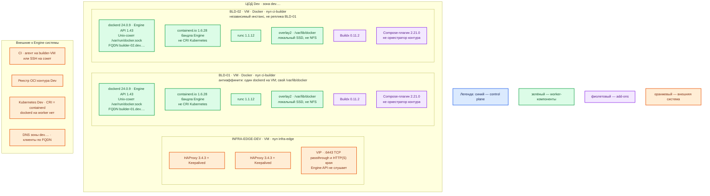

# Docker Engine 24.0.9 CE — Dev

Контур: **Dev** (1 ЦОД). Роль продукта та же, что на Prod: **сборочные Linux-VM для CI**, не Docker Desktop и не runtime Kubernetes.

Это упрощение Prod по ёмкости (CPU/RAM/диск), не смена вида инсталляции. **Docker Desktop** — другой продукт (VM + UI на рабочей станции разработчика); стенд контура им **не** заменяют. CRI Kubernetes на Dev — по-прежнему **containerd**.

## Допущения

1. Механизм установки и роль-модель как в `Docker 24.prod.md`: пакеты Docker Inc. **24.0.9** на Linux-VM, systemd, Unix-сокет, без Swarm, без 2375. Compose на хосте разработчика / Desktop **не** считается тем же стендом.
2. Один прикладной ЦОД. ЦОДа бэкапов в Dev нет. Stretch Engine не проектируется (у standalone-демона нет кворума).
3. Два независимых builder в одном ЦОДе — паритет с Prod «CI переживает отказ одной VM», не кворум. Это не два голосующих узла: состояния `/var/lib/docker` не общее.
4. Линия 24.0 Unmaintained, EOL security **8 июня 2024**, CVE BuildKit в 24.0.9 не закрыты. На Dev это тот же риск поверхности, не «учебная линия безопаснее». [ветки Moby](https://github.com/moby/moby/blob/master/project/BRANCHES-AND-TAGS.md), [релиз-ноты 24.0](https://docs.docker.com/engine/release-notes/24.0/).
5. Пара HAProxy 3.4.3 + Keepalived + VIP на Dev та же по роли, меньше CPU/RAM. Engine API на VIP не публикуем.
6. Ёмкость builder: учебный ориентир **2 vCPU / 4 ГиБ RAM / 30 ГБ** локального SSD на VM (`sample/Docker 24.md`). В мануале Docker Inc. минимума нет. Это не Desktop и не «одна VM с Compose вместо двух builder».
7. Имена StorageClass Kubernetes те же (`local-ssd`, `shared-fs`), тома меньше. Диск Engine — локальный SSD VM, не CSI.
8. DNS — зона `dev.…`. Клиенты CI по FQDN builder-VM, не по Pod IP.
9. Состав пакетов тот же: `docker-ce` / `docker-ce-cli` **24.0.9**, `containerd.io` **1.6.28**, Buildx **0.11.2**, Compose-плагин **2.21.0**. Плагин Compose ставится для паритета состава; оркестрация контура — Kubernetes, не `docker compose up` платформы.
10. Реестр и CI на Dev — отдельные продукты того же класса, что на Prod (свой registry/зеркало, агент на builder или SSH). Не Docker Hub как единственный реестр боя.

## Схема инстансов

Вид тот же, что Prod: две Linux-VM с `dockerd`, не Desktop. Нет потоков данных. Нет ЦОДа бэкапов.

ОС — свойство платформы, не пода. Один стандарт Linux на всех нодах контура.

Исключение вендора: пул `ci-builder` — **Ubuntu 22.04 LTS (Jammy), amd64**, как на Prod: в официальном pool есть `.deb` **24.0.9**. Не Desktop (Windows/macOS). https://docs.docker.com/engine/install/ubuntu/

У Engine 24 **нет** control plane и **нет** кворума: синий цвет на схеме не занят инстансами. Схема «2 узла Swarm» на Dev **запрещена** — это другой класс системы, не уменьшенный Prod.

| Имя пула | Роль | Зачем выделен |
|---|---|---|
| `ci-builder` | vendor | Те же Linux-VM с Docker CE 24.0.9, что на Prod. Меньше CPU/RAM/диск. Не Desktop, не Compose-хост «вместо кубера», не worker Kubernetes. |
| `infra-edge` | edge-VM | Та же пара HAProxy + Keepalived + VIP, меньше ёмкость. Engine API сюда не публикуем. |

## Комментарии к схеме

### BLD-01 / BLD-02 — builder-VM

**Функционал.** Та же роль, что Prod: сборка OCI, push в реестр Dev, локальные проверки CI. Нужны **две** VM, чтобы воспроизвести отказ одного builder и переключение очереди CI — ошибка «на Dev один Desktop, на Prod два dockerd» как раз из запрещённого класса.

**Критичные детали.**

- Тот же путь пакетов, hold, `daemon.json`, overlay2, live-restore, запрет 2375 и Swarm, что в Prod и в разделе установки: https://docs.docker.com/engine/install/ubuntu/#install-from-a-package
- Не ставить второй `dockerd` на ту же VM и не шарить `/var/lib/docker` (в том числе NFS): https://docs.docker.com/engine/daemon/
- Ёмкость **меньше Prod**: ориентир 2 vCPU / 4 ГиБ / 30 ГБ локального SSD на каждую VM. Это не минимум вендора. Параллелизм сборок режут очередью CI, а не слиянием двух builder в одну машину.
- `containerd.io` бандла Engine на этих VM ≠ CRI кластера Dev.
- Сокет = root. Группу `docker` не раздавать всей команде. Не монтировать сокет в CI-под «как на ноутбуке»: https://docs.docker.com/engine/security/
- Desktop на ноутбуке разработчика допустим как личный инструмент; **контур Dev** — эти две VM. Иначе обновление/iptables/сокет на Prod и «у меня в Desktop» разъедутся.
- Публикация портов тестовых контейнеров — на `127.0.0.1` этой VM, не `-p` на все интерфейсы: https://docs.docker.com/engine/network/packet-filtering-firewalls/
- Проверка «стенд живой» та же: Server 24.0.9, API 1.43, нет слушателя `:2375`, `hello-world` с `--network none` не заменяет проверку CI→реестр→Kubernetes.

### INFRA-EDGE-DEV

**Функционал.** VIP для Kubernetes Dev и HTTP(S) края. Меньше CPU/RAM, та же роль.

**Критичные детали.** Не выводить Engine API за VIP «чтобы с ноутбука было удобно». Удалённо — SSH на FQDN builder, не 2375: https://docs.docker.com/engine/security/protect-access/

### CI, реестр, Kubernetes, DNS

**Функционал.** Тот же конвейер, зона `dev.…` (`builder-01.dev.…`, `builder-02.dev.…`).

**Критичные детали.** Kubernetes Dev запускает поды через containerd. Образы собирает Engine на `ci-builder`. Не ставить `dockerd` на worker «для простоты Dev».

## Путь роста

Как на Prod, только внутри одного ЦОДа: добавить третью независимую builder-VM или увеличить диск/CPU после замера. Не «включить Swarm на трёх маленьких VM» и не «переехать на Desktop».

## Сильные и слабые места

**Сильная:** тот же systemd-пакетный Engine 24.0.9, те же запреты и тот же сокет, что Prod — ошибка вида инсталляции воспроизводится.

**Слабая:** линия всё ещё EOL; две маленькие VM в одном ЦОДе не спасают от отказа зала; кэш слоёв не общий; Desktop рядом провоцирует «собрал у себя — на builder иначе».

## Критичные условия

- Dev ≠ Docker Desktop и ≠ один `docker compose` на ноутбуке вместо двух builder-VM.
- Тот же запрет **2375**, Swarm, cri-dockerd, NFS data-root, сокета в поде, `latest`.
- Не схлопывать два builder в один «на Dev и так сойдёт»: пропадёт класс отказа, который на Prod есть.
- 24.0.9 на Dev не становится поддерживаемой линией.

## Источники

Те же URL, что у Prod:

- https://docs.docker.com/engine/release-notes/24.0/
- https://github.com/moby/moby/blob/master/project/BRANCHES-AND-TAGS.md
- https://endoflife.date/docker-engine
- https://docs.docker.com/engine/install/ubuntu/
- https://docs.docker.com/engine/daemon/
- https://docs.docker.com/engine/daemon/live-restore/
- https://docs.docker.com/engine/security/
- https://docs.docker.com/engine/security/protect-access/
- https://kubernetes.io/blog/2022/02/17/dockershim-faq/
- `sample2/Docker 24.prod.md`, `sample/Docker 24.md`, `Out/Платформенная инфра/Docker 24/Docker 24.md`, `Docker 24.install.md`

**В доке вендора нет:** CPU/RAM минимума Engine; размер `/var/lib/docker`; порог RTT Swarm; пакет 24.0.9 под Ubuntu 24.04 noble.
