# Docker Engine 24.0.9 CE — Prod

Контур: **Prod** (2 прикладных ЦОДа + 1 ЦОД под бэкапы). Роль продукта: **сборочные Linux-VM для CI**, не runtime Kubernetes.

**Docker Engine** — демон `dockerd` на одной Linux-машине: собирает **образы** (упакованная программа с зависимостями) и умеет запускать их как контейнеры. Один `dockerd` = один хост, это не кластер. **CRI** (интерфейс, через который kubelet запускает контейнеры) в боевом Kubernetes — **containerd**, не этот Engine.

## Допущения

1. Линию **24.0.9** фиксируют осознанно как совместимый builder. Ветка `24.0` — Unmaintained; security-поддержка линии закончилась **8 июня 2024**. В 2026 это не безопасный runtime. Источники: [ветки Moby](https://github.com/moby/moby/blob/master/project/BRANCHES-AND-TAGS.md), [endoflife.date/docker-engine](https://endoflife.date/docker-engine).
2. Боевые приложения живут в **Kubernetes** каждой площадки отдельно. CRI worker-нод — containerd. Engine 24 **не** ставится на worker и **не** подключается через cri-dockerd. Dockershim убран в Kubernetes 1.24: https://kubernetes.io/blog/2022/02/17/dockershim-faq/
3. Оркестратор контура — Kubernetes, не **Swarm** (встроенный режим Docker со своими manager/worker и Raft). Stretch Swarm на 2–3 ЦОДа нет: RTT не измерен, порога в документации Docker нет.
4. Минимальная отказоустойчивость **сборки**: по одному независимому builder в каждом прикладном ЦОДе. Общего `/var/lib/docker` между ними нет. Эталон образов — внешний **реестр OCI**, не диск builder.
5. ЦОД бэкапов **не** получает `dockerd`. Бэкапить data-root Engine как эталон приложений нельзя: слои на builder — кэш сборки.
6. Числа CPU/RAM/диска в документации Docker Inc. **нет**. Учебный ориентир «чтобы завелось» — **2 vCPU / 4 ГиБ / 30 ГБ** локального SSD (`sample/Docker 24.md`). Для Prod ёмкость **больше этого ориентира**; точные цифры — замер очереди CI и размера слоёв, не «терабайты озера».
7. Сеть (VLAN, IP-план) вне рамок. На каждый прикладной ЦОД уже есть пара HAProxy 3.4.3 + Keepalived + VIP (ControlPlaneEndpoint Kubernetes `:6443` и край HTTP(S)). Engine API на VIP **не** публикуем.
8. Агент CI (GitLab Runner или эквивалент) ходит к `dockerd` **этой** VM через Unix-сокет или SSH на сокет. Конкретный продукт CI проектом Docker не зафиксирован.
9. Реестр OCI обязателен для доставки образа в Kubernetes; сам Engine реестром не является. Выбор Harbor/иного — отдельный продукт.
10. Состав пакетов пинится: `docker-ce` / `docker-ce-cli` **24.0.9**, `containerd.io` **1.6.28**, Buildx **0.11.2**, Compose-плагин **2.21.0** из [jammy pool](https://download.docker.com/linux/ubuntu/dists/jammy/pool/stable/amd64/). Compose-плагин входит в зафиксированный набор, но **не** является способом развёртывания контура.

## Схема инстансов

На схеме нет потоков данных. Два builder — два автономных `dockerd`, не реплики одного состояния.

```mermaid
flowchart TB
  subgraph DC1["ЦОД-1 прикладной · зона prod.…"]
    subgraph EDGE1["INFRA-EDGE-DC1 · VM · пул infra-edge"]
      HAP1A["HAProxy 3.4.3 + Keepalived"]
      HAP1B["HAProxy 3.4.3 + Keepalived"]
      VIP1["VIP · :6443 TCP passthrough и HTTP(S) края<br/>Engine API не слушает"]
    end
    subgraph BLD1["BLD-01 · VM · Docker · пул ci-builder<br/>антиаффинити: один dockerd на VM; свой /var/lib/docker"]
      D1["dockerd 24.0.9 · Engine API 1.43<br/>Unix-сокет /var/run/docker.sock<br/>FQDN builder-01.prod.…"]
      CTD1["containerd.io 1.6.28 бандла Engine<br/>не CRI Kubernetes"]
      RUNC1["runc 1.1.12"]
      DISK1["overlay2 · /var/lib/docker<br/>локальный SSD, не NFS"]
      BX1["Buildx 0.11.2"]
      CMP1["Compose-плагин 2.21.0<br/>не оркестратор контура"]
    end
  end

  subgraph DC2["ЦОД-2 прикладной · зона prod.…"]
    subgraph EDGE2["INFRA-EDGE-DC2 · VM · пул infra-edge"]
      HAP2A["HAProxy 3.4.3 + Keepalived"]
      HAP2B["HAProxy 3.4.3 + Keepalived"]
      VIP2["VIP · :6443 TCP passthrough и HTTP(S) края<br/>Engine API не слушает"]
    end
    subgraph BLD2["BLD-02 · VM · Docker · пул ci-builder<br/>независимый инстанс, не реплика BLD-01"]
      D2["dockerd 24.0.9 · Engine API 1.43<br/>Unix-сокет /var/run/docker.sock<br/>FQDN builder-02.prod.…"]
      CTD2["containerd.io 1.6.28 бандла Engine<br/>не CRI Kubernetes"]
      RUNC2["runc 1.1.12"]
      DISK2["overlay2 · /var/lib/docker<br/>локальный SSD, не NFS"]
      BX2["Buildx 0.11.2"]
      CMP2["Compose-плагин 2.21.0<br/>не оркестратор контура"]
    end
  end

  subgraph DCB["ЦОД под бэкапы"]
    BAK["Бэкапы реестра OCI и артефактов CI<br/>dockerd не ставится<br/>/var/lib/docker не эталон"]
  end

  subgraph EXT["Внешние к Engine системы"]
    CI["CI · агент на builder-VM или SSH на сокет"]
    REG["Реестр OCI · push/pull по HTTPS"]
    K8S["Kubernetes · CRI = containerd<br/>dockerd на worker нет"]
    DNS["DNS зоны prod.… · клиенты по FQDN"]
  end

  LEGCORE["Легенда: синий — control plane"]
  LEGWORK["зелёный — worker-компоненты"]
  LEGADD["фиолетовый — add-ons"]
  LEGEXT["оранжевый — внешняя система"]

  classDef core fill:#dbeafe,stroke:#2563eb,color:#172554,stroke-width:2px;
  classDef worker fill:#dcfce7,stroke:#16a34a,color:#14532d,stroke-width:2px;
  classDef addon fill:#f3e8ff,stroke:#9333ea,color:#581c87,stroke-width:2px;
  classDef external fill:#ffedd5,stroke:#ea580c,color:#7c2d12,stroke-width:2px;

  class LEGCORE core;
  class D1,CTD1,RUNC1,DISK1,D2,CTD2,RUNC2,DISK2,LEGWORK worker;
  class BX1,CMP1,BX2,CMP2,LEGADD addon;
  class HAP1A,HAP1B,VIP1,HAP2A,HAP2B,VIP2,BAK,CI,REG,K8S,DNS,LEGEXT external;
```

ОС — свойство платформы, не пода. Один стандарт Linux на всех нодах контура.

Исключение вендора: пул `ci-builder` ставится с **Ubuntu 22.04 LTS (Jammy), amd64** — это ОС, для которой в официальном pool лежат `.deb` **24.0.9**. Пакета 24.0.9 под Ubuntu 24.04 noble в документации вендора нет. https://docs.docker.com/engine/install/ubuntu/ и https://download.docker.com/linux/ubuntu/dists/jammy/pool/stable/amd64/

У Engine 24 **нет** control plane и **нет** кворума: синий цвет на схеме не занят инстансами. Это не Swarm и не etcd.

| Имя пула | Роль | Зачем выделен |
|---|---|---|
| `ci-builder` | vendor | Отдельные Linux-VM с Docker CE 24.0.9 для сборки образов. Локальный диск под `/var/lib/docker`. Не worker Kubernetes: iptables Docker конфликтует с CNI, CRI кластера — containerd. |
| `infra-edge` | edge-VM | Пара HAProxy 3.4.3 + Keepalived + VIP площадки. Нужна Kubernetes и HTTP(S) краю. К Docker Engine не относится: `:2375` на VIP не вешаем, Kafka `:9092` через этот HAProxy не публикуем. |

Пулы `control-plane`, `worker-general`, `worker-data` на этой схеме **не** появляются: Engine туда не ставят.

## Комментарии к схеме

### BLD-01 / BLD-02 — builder-VM

**Функционал.** Сборка OCI-образов (`docker build` / BuildKit), локальная проверка, `docker push` в реестр. По желанию CI — запуск тестовых контейнеров **на этой** VM. Приложения Prod в этих контейнерах не живут.

**Критичные детали.**

- Установка: официальные пакеты Docker Inc., не `docker.io` дистрибутива, не static tarball, не скрипт `get.docker.com` (он ставит текущий stable, сейчас 29.x). Путь «Install from a package» и пин версии: https://docs.docker.com/engine/install/ubuntu/#install-from-a-package
- После установки: `apt-mark hold` на пять пакетов, иначе `apt upgrade` уедет с 24.0.9. Проверка: `docker version` → Server **24.0.9**, API **1.43**, runc **1.1.12**, драйвер **overlay2**. Релиз-ноты: https://docs.docker.com/engine/release-notes/24.0/
- `containerd.io` **1.6.28** в пакетах CE ≠ containerd на worker Kubernetes. Это зависимость Engine на builder-VM.
- Data-root `/var/lib/docker` — **локальный** SSD этой VM. Два демона на одном каталоге (в том числе NFS) вендор описывает как трудноотлаживаемые ошибки: https://docs.docker.com/engine/daemon/
- StorageClass `local-ssd` / `shared-fs` — про тома Kubernetes, не про этот диск. CSI сюда не подключаем.
- API только Unix-сокет `/var/run/docker.sock`. **2375/TCP не слушать** (TCP без TLS = удалённый root). 2376/TCP по умолчанию закрыт. Удалённо — SSH-контекст, не открытый API: https://docs.docker.com/engine/security/protect-access/
- Порты Swarm **2377/TCP, 7946/TCP+UDP, 4789/UDP** не открывать. Swarm не включать: https://docs.docker.com/engine/swarm/swarm-tutorial/
- `daemon.json`: `live-restore: true` (рестарт демона не убивает standalone-контейнеры; **несовместим со Swarm services**), `storage-driver: overlay2`, ротация `json-file` 10m × 3, `icc: false`, `no-new-privileges: true`. Ключ `hosts` не добавлять — конфликт с systemd и путь к 2375. https://docs.docker.com/engine/daemon/live-restore/
- Группа `docker` = root-эквивалент на хосте. Не раздавать отделу. Сокет **не** монтировать в контейнеры приложений и в CI-поды: https://docs.docker.com/engine/security/
- Образы в реестр по digest, не `:latest` с Docker Hub. На закрытом контуре Hub с builder — канал утечки.
- В **24.0.9** известные CVE BuildKit **не закрыты**; фикс — Engine 25.0.2+. Компенсации (нет 2375, свой реестр, запрет privileged) **не заменяют** патчи.
- Ёмкость VM: в мануале нет. Prod — **порядок величины выше** учебного 2 vCPU / 4 ГиБ / 30 ГБ; диск под слои и параллельные сборки. Уточняется замером очереди CI, не сметой «терабайт».
- BLD-02 не разделяет состояние с BLD-01. Упал один builder — очередь CI берёт другой; уже запушенные образы живут в реестре. Живые поды Kubernetes от падения builder не зависят.

### INFRA-EDGE-DC1 / DC2 — VIP площадки

**Функционал.** Вход в Kubernetes (`:6443`) и HTTP(S) край. Платформенное требование контура, не компонент Docker.

**Критичные детали.** Engine API на VIP не публиковать. Не балансировать `dockerd` как сервис за HAProxy — это и есть путь к 2375/2376 в сеть.

### ЦОД бэкапов

**Функционал.** Хранение копий реестра/артефактов по политике площадки.

**Критичные детали.** `dockerd` не ставится. Копия `/var/lib/docker` не заменяет реестр и не даёт «кластер Docker на трёх ЦОДах». Stretch одного Engine между ЦОДами не проектируется: у standalone-демона нет кворума.

### CI, реестр, Kubernetes, DNS

**Функционал.** CI назначает сборку builder; реестр хранит OCI; Kubernetes забирает образ containerd; DNS отдаёт FQDN `builder-01.prod.…` / `builder-02.prod.…`.

**Критичные детали.** Клиенты ходят по FQDN, не по Pod IP (подов Engine нет). В git — Dockerfile без паролей. В секрет — учётка реестра, не содержимое сокета. Runtime боя — containerd на worker, не этот `dockerd`.

## Путь роста

Не включать сразу.

1. Добавить ещё одну независимую builder-VM в том же прикладном ЦОДе (свой диск, свой сокет), когда очередь CI или размер слоёв не умещается на существующие.
2. Увеличить локальный диск `/var/lib/docker` и CPU/RAM **одной** VM после замера contention.
3. Не включать Swarm, не ставить `dockerd` на worker Kubernetes, не растягивать «кластер Docker» на ЦОД бэкапов.

## Сильные и слабые места

**Сильная:** официальные пакеты, тот же OCI-формат, что потом запускает containerd; отказ одной builder-VM не роняет Kubernetes; два ЦОДа дают независимый запас сборки без Raft.

**Слабая:** линия 24.0 без vendor-security; один `dockerd` сам по себе HA не даёт; кэш слоёв не общий (после отказа builder холодный кэш); BuildKit CVE в 24.0.9 не закрыты.

## Критичные условия

- **2375** в интернет или на VIP = удалённый root.
- Engine 24 как CRI Kubernetes (cri-dockerd) — запрещённый вид инсталляции.
- Swarm рядом с Kubernetes — второй оркестратор, не «настройка Docker».
- NFS / общий диск как `/var/lib/docker`.
- `latest`, convenience script, Docker Desktop «как тот же Prod».
- Сокет хоста в job-поде / `--privileged` «чтобы сборка завелась».
- Обещание безопасности 24.0.9 в 2026: патчей вендора нет с 8 июня 2024.

## Источники

- Релиз 24.0.9, runc 1.1.12, BuildKit CVE не закрыты: https://docs.docker.com/engine/release-notes/24.0/
- Ветка `24.0` Unmaintained: https://github.com/moby/moby/blob/master/project/BRANCHES-AND-TAGS.md
- EOL security 24.0 — 8 июня 2024: https://endoflife.date/docker-engine
- Установка Ubuntu, пакеты, не convenience script: https://docs.docker.com/engine/install/ubuntu/
- Static tarball не для боя: https://docs.docker.com/engine/install/binaries/
- `daemon.json`, data-root, overlay2, не шарить каталог: https://docs.docker.com/engine/daemon/
- live-restore, не для Swarm: https://docs.docker.com/engine/daemon/live-restore/
- json-file max-size: https://docs.docker.com/engine/logging/drivers/json-file/
- Сокет = root; TCP без TLS нельзя: https://docs.docker.com/engine/security/
- SSH или TLS 2376, не 2375: https://docs.docker.com/engine/security/protect-access/
- Порты Swarm: https://docs.docker.com/engine/swarm/swarm-tutorial/
- Docker не CRI после удаления dockershim: https://kubernetes.io/blog/2022/02/17/dockershim-faq/
- `.deb` 24.0.9 jammy amd64: https://download.docker.com/linux/ubuntu/dists/jammy/pool/stable/amd64/
- Карточка, установка, роль: `Out/Платформенная инфра/Docker 24/Docker 24.md`, `Docker 24.install.md`, `sample/Docker 24.md`

**В доке вендора нет:** CPU/RAM «хватит для Engine»; размер `/var/lib/docker`; порог RTT для Swarm Raft; пакет 24.0.9 под Ubuntu 24.04 noble.
