# GeoData 4.0.1 / workflow 4.0.2 — развёртывание Dev

Dev — **уменьшенный Prod**, не другой вид инсталляции. Тот же механизм: остров на **Ubuntu 22.04**, свой Kubernetes **1.24.1**, `docker load` → **Nexus 3.49.0** → `kubectl apply`, то же ОПО тех же версий. **Не** учебный стенд «реплики ППО = 1 и Elasticsearch ×1». **Не** «в наш Kubernetes 1.36». Не Docker Compose.

**ОПО** — базовое ПО контура GeoData. **ППО** — прикладные модули. **dc0** — один логический дата-центр инсталлятора.

## Допущения

1. Контур Dev: **1 ЦОД**. Второго прикладного зала и отдельного ЦОД-бэкапов **нет** — снимки на схеме как внешнее, не как второй `dc0` и не как stretch.
2. Роль-модель **как в Prod**: пара HAProxy **2.4** + Keepalived **2.2.4** + VIP острова; Kubernetes **1.24.1** с etcd ×3; Cassandra ×3; Kafka **3.4.0** + ZooKeeper ×3; Elasticsearch **8.6.2** ×3; Swift **2.29.2** ×3; Postgres+PostGIS ×1; Redis ×1; Keycloak ×1; Nexus **3.49.0**. Уменьшают **CPU/RAM/диски**, не вид инсталляции и не мажорные версии.
3. Кворум на Dev остаётся **нечётным: 3** маленьких голосующих (etcd острова, ZooKeeper, Cassandra, master Elasticsearch). Схема «2 узла» или «1 узел RF=1 как в песочнице» — другой класс системы, ошибку отказа ноды / выборов **не** воспроизведёт.
4. Stateless ППО: минимум **2** реплики на **2** нодах `vendor-geodata-worker` (балансировка и отказ одной ноды). Не реплика **1** из главы «Учебный стенд». Не 3 как Prod — это уменьшение ёмкости реплик UI/workflow, не смена механизма (`kubectl apply` тех же Deployment).
5. **Не** переносить ППО в платформенный Kubernetes **1.36.4**: совместимость манифестов 1.24.1 с 1.36 не заявлена. Dev на 1.36 — другой вид инсталляции относительно Prod. (`GeoData.consultant.md`, `sample/GeoData.md`)
6. ОПО — те же пины: Kafka 3.4+ZK, ES 8.6.2, PG 15.2+PostGIS 3.3, Redis 7.0.8, Swift 2.29.2, Cassandra 4.1.0. Не подставлять платформенные Kafka 4.x / OpenSearch / Swift 2.37 «чтобы не плодить кластеры».
7. Диски: локальные на VM острова. Имена StorageClass `local-ssd` / `shared-fs` на Dev у **платформенного** K8s те же, но остров GeoData их **не** использует для ОПО. Тома **меньше** Prod. NFS / `emptyDir` — нет.
8. DNS: CoreDNS / `cluster.local` внутри острова; снаружи зона `dev.…`. Advertised listeners внутренней Kafka — FQDN `dev.…`. Клиенты не по Pod IP.
9. Цифр «ядер для Dev-острова» в мануале нет. Минимумы вендора (Cassandra от 8 ГиБ, Kafka 4/8/100, ES 8/100, …) — нижняя граница «кластер», не смета. Dev — **меньше Prod по дискам и requests**, без нарушения этих порогов, если вендор иначе процесс не поднимает. Уточняется замером.
10. Учебные пароли мануала, `xpack.security.enabled: false`, Redis `protected-mode no` — даже на Dev лучше сразу свои секреты стенда (иначе привычка уедет в Prod). `docker commit` конфига — тот же долг, что в Prod.
11. VIP острова **не** смешивать с парой платформы HAProxy **3.4.3** (она есть на Dev-ЦОДе для K8s 1.36). Kafka `:9092` через любой HAProxy не публиковать. AI Network не входит. Сеть в деталях вне рамок.

## Схема инстансов

Синий — управляющие/голосующие роли (control plane K8s 1.24.1, ZooKeeper). Зелёный — data и ППО. Фиолетовый — CoreDNS, Keycloak, Nexus. Оранжевый — VIP/HAProxy острова, платформенный K8s 1.36, соседи, бэкап стенда. На схеме **нет** потоков данных.

```mermaid
flowchart TB
  subgraph DCDEV["Dev ЦОД — живой остров GeoData dc0, уменьшенные VM/диски"]
    subgraph EDGE["пул vendor-geodata-edge"]
      HAPA["HAP-a — HAProxy 2.4 + Keepalived 2.2.4<br/>VM / vendor-geodata-edge<br/>меньше CPU/RAM, чем Prod<br/>антиаффинити: не два HAProxy на одном хосте"]
      HAPB["HAP-b — HAProxy 2.4 + Keepalived 2.2.4<br/>VM / vendor-geodata-edge<br/>антиаффинити: не два HAProxy на одном хосте"]
      VIP["VIP острова<br/>K8s 1.24.1 :6443 TCP passthrough<br/>HTTPS UI :443 · FQDN geodata.dev.…<br/>— / vendor-geodata-edge"]
    end
    subgraph CP["control plane Kubernetes 1.24.1 ×3 маленьких"]
      CPA["GD-CP-a — kube-apiserver, etcd member<br/>VM / vendor-geodata-cp<br/>антиаффинити: 1 член etcd на 1 VM"]
      CPB["GD-CP-b — свой etcd member<br/>VM / vendor-geodata-cp"]
      CPC["GD-CP-c — кворум 2 из 3, не etcd×1<br/>VM / vendor-geodata-cp"]
    end
    subgraph WRK["worker Kubernetes 1.24.1"]
      WG["Пул vendor-geodata-worker<br/>VM · минимум 2 ноды · меньше CPU/RAM<br/>не worker-general платформы 1.36"]
      PPO["ППО namespace geodata<br/>те же модули 4.0.1 / workflow 4.0.2<br/>Под: K8s 1.24.1 / vendor-geodata-worker<br/>реплики 2, не 1 с учёбы<br/>антиаффинити: не две реплики на одну ноду"]
      DNS["CoreDNS cluster.local острова<br/>Под: K8s 1.24.1 / vendor-geodata-worker"]
    end
    subgraph OPO["ОПО — Ubuntu 22.04, локальные диски меньше Prod"]
      KFA["ZK/KF-a — Kafka 3.4.0 + ZooKeeper<br/>VM / vendor-geodata-data"]
      KFB["ZK/KF-b — Kafka 3.4.0 + ZooKeeper<br/>VM / vendor-geodata-data"]
      KFC["ZK/KF-c — Kafka 3.4.0 + ZooKeeper<br/>3 брокера, не один RF=1<br/>VM / vendor-geodata-data"]
      CSA["CS-a — Cassandra 4.1.0<br/>RF=2, не один узел RF=1<br/>VM / vendor-geodata-data"]
      CSB["CS-b — Cassandra 4.1.0<br/>VM / vendor-geodata-data"]
      CSC["CS-c — Cassandra 4.1.0<br/>VM / vendor-geodata-data"]
      ESA["ES-a — Elasticsearch 8.6.2<br/>VM / vendor-geodata-data"]
      ESB["ES-b — Elasticsearch 8.6.2<br/>VM / vendor-geodata-data"]
      ESC["ES-c — Elasticsearch 8.6.2<br/>3 master+data, не один как на учёбе<br/>VM / vendor-geodata-data"]
      PG["PG — PostgreSQL 15.2 + PostGIS 3.3<br/>один сервер как Prod, меньше диск<br/>VM / vendor-geodata-data"]
      RD["RD — Redis 7.0.8<br/>один хост как Prod, меньше RAM<br/>VM / vendor-geodata-data"]
    end
    subgraph SW["Swift 2.29.2"]
      SWA["SW-a — object node, свои диски, не CSI<br/>VM / vendor-geodata-swift"]
      SWB["SW-b — object node<br/>VM / vendor-geodata-swift"]
      SWC["SW-c — object node · RF=3, не один узел<br/>не Swift 2.37 платформы<br/>VM / vendor-geodata-swift"]
    end
    subgraph ADD["add-on"]
      KC["KC — Keycloak 21.1.2<br/>один сервер как Prod<br/>VM / vendor-geodata-data"]
      NX["NX — Nexus 3.49.0<br/>теги 4.0.1 / 4.0.2, не latest<br/>VM / vendor-island"]
    end
  end

  subgraph EXT["Соседи — не ОПО GeoData"]
    PLHAP["HAProxy 3.4.3 + VIP платформы Dev<br/>K8s 1.36 :6443 · не HAProxy 2.4 острова<br/>VM / infra-edge"]
    PLK8S["Платформенный Kubernetes 1.36.4 Dev<br/>сюда yaml GeoData не накатывать"]
    NEI["Kafka 4.x · OpenSearch · Swift 2.37 · Camunda Dev<br/>соседи, не backend GeoData"]
    BAK["Бэкап стенда — снимки ОПО<br/>не четвёртый узел Cassandra и не stretch<br/>—"]
    USR["Браузер + WebGL<br/>HTTPS на FQDN VIP острова"]
  end

  LEGCORE["Легенда: синий — control plane"]
  LEGWORK["зелёный — worker-компоненты"]
  LEGADD["фиолетовый — add-ons"]
  LEGEXT["оранжевый — внешняя система"]

  classDef core fill:#dbeafe,stroke:#2563eb,color:#172554,stroke-width:2px;
  classDef worker fill:#dcfce7,stroke:#16a34a,color:#14532d,stroke-width:2px;
  classDef addon fill:#f3e8ff,stroke:#9333ea,color:#581c87,stroke-width:2px;
  classDef external fill:#ffedd5,stroke:#ea580c,color:#7c2d12,stroke-width:2px;

  class CPA,CPB,CPC,KFA,KFB,KFC,LEGCORE core;
  class WG,PPO,CSA,CSB,CSC,ESA,ESB,ESC,PG,RD,SWA,SWB,SWC,LEGWORK worker;
  class DNS,KC,NX,LEGADD addon;
  class HAPA,HAPB,VIP,PLHAP,PLK8S,NEI,BAK,USR,LEGEXT external;
```

ОС — свойство платформы, не пода. Один стандарт Linux на всех нодах контура.

Исключение вендора: машины острова GeoData — **Ubuntu 22.04 LTS** (тот же стандарт, что Prod). Windows-сервер не заявлен. Не ставить ОПО на образ платформенных нод «потому что Dev». ([руководство](https://docs.datageo.ru/), `sample/GeoData.md`)

| Имя пула | Роль | Зачем выделен |
|---|---|---|
| `vendor-geodata-edge` | vendor / edge-VM | Та же пара HAProxy **2.4** + Keepalived + VIP, меньше CPU/RAM. Не один Ingress «вместо пары». |
| `vendor-geodata-cp` | vendor / control-plane | Три маленьких control-plane **1.24.1**. Не stacked etcd×1 и не control plane 1.36. |
| `vendor-geodata-worker` | vendor / general | Минимум **2** ноды под 2 реплики ППО. Не пул платформенного K8s. |
| `vendor-geodata-data` | vendor / data-localdisk | То же ОПО, меньшие локальные диски. Не PVC `local-ssd` платформы. |
| `vendor-geodata-swift` | vendor / object | Три узла Swift **2.29.2**, не loopback и не MinIO. |
| `vendor-island` | vendor | Nexus **3.49.0** стенда. |
| `infra-edge` | edge-VM | HAProxy **3.4.3** Dev-ЦОДа для платформы; не вход GeoData. |

Что уменьшили относительно Prod (вид инсталляции тот же):

| Параметр | Prod | Dev |
|---|---|---|
| ЦОДы с живым `dc0` | 1 актив (ЦОД-1); ЦОД-2 = restore | 1 ЦОД |
| Kubernetes | свой **1.24.1**, etcd ×3 | тот же **1.24.1**, etcd ×3 маленьких |
| Worker ППО | ≥ 3 ноды, реплики **3** | ≥ 2 ноды, реплики **2** |
| Cassandra / Kafka+ZK / ES / Swift | по 3 VM, диски боя | по 3 маленьких VM, диски меньше |
| Postgres / Redis / Keycloak | ×1 | ×1, меньше CPU/RAM/диск |
| HAProxy острова | 2.4 ×2 + VIP | 2.4 ×2 + VIP, меньше VM |
| Версии ОПО / теги ППО | 4.0.1 / workflow 4.0.2 | те же |
| Куда **не** ставим | не K8s 1.36 | **тоже не** K8s 1.36 |

## Комментарии к схеме

### HAP-a / HAP-b и VIP

Та же роль, что Prod: `:443` UI и `:6443` API **острова**. Меньше CPU/RAM. Две VM. Не заменить парой платформенного HAProxy 3.4.3. Kafka **9092** не публиковать. FQDN зоны **`dev.…`**.

### GD-CP-a / b / c

Три маленьких control-plane **1.24.1**. Кворум etcd **3**, не «один kubeadm на VM рядом с ППО». Не члены кластера 1.36.

### ППО (реплики 2)

Те же образы и yaml, что Prod: `adminui` / `clientui` / `workflow` **4.0.2** / `geometry` / прочие **4.0.1**. **Две** реплики на **двух** нодах — чтобы ловить балансировку и отказ ноды; реплика 1 с учёбы это **не** делает. Антиаффинити обязательна. Критерий «жива» тот же: `adminui` после логина Keycloak. Браузер с WebGL.

Не `latest`. Не `kubectl apply` в платформенный namespace.

### Kafka 3.4 + ZooKeeper ×3

Три маленьких узла, не один брокер RF=1. Служебные топики те же имена (в инсталляторе суффикс `prod` в именах топиков — **не** менять самовольно без главы; это имена поставки, не контур платформы). Advertised listeners — FQDN `dev.…`. Не платформенный Kafka 4.x.

### Cassandra ×3, Elasticsearch ×3, Swift ×3

Три узла каждого, меньший диск. Cassandra RF=2 (не RF=1 песочницы). ES не один master+data «как на учёбе». Swift RF=3, три адреса одной зоны, не один диск. Локальные диски, не CSI платформы.

### PostgreSQL+PostGIS, Redis, Keycloak

По **одному** серверу, как Prod (инструкция вендора). Меньше ёмкость. Это сознательный SPOF паритета, не «добавим Patroni только на Dev». Минимумы вендора не резать ниже порога, если процесс иначе не стартует (Postgres от 4 ГиБ, Redis 4/4/20, Keycloak 2/4/250 — ориентир главы; Dev может быть ближе к этому минимуму, Prod — выше по замеру).

### Nexus 3.49.0

Тот же реестр дистрибутива. Harbor Dev без письма — другой путь доставки, ошибка `imagePull` с Prod может не воспроизвестись.

### Платформенный Kubernetes 1.36 и HAProxy 3.4.3

Соседи на том же Dev-ЦОДе. Yaml GeoData туда **не** накатывать. Ошибка «на Prod остров 1.24, на Dev — наш 1.36» — как раз то, что Task_6 запрещает.

## Путь роста

Как в Prod, только сначала вертикаль маленьких VM/дисков. Не превращать Dev в «один docker compose», чтобы «быстрее отладить». Не схлопывать кворум до 2 или 1.

## Сильные и слабые места; критичные условия

**Сильное:** тот же остров и те же версии, что Prod; отказ одной worker-ноды и выборы ZK/etcd/Cassandra воспроизводятся; UI ходит через пару HAProxy, не через Pod IP.

**Слабое:** Postgres/Redis/Keycloak по-прежнему одиночки; реплик ППО меньше, чем в примере вендора (3→2) — часть ошибок «третья реплика» не всплывёт; учебные выключения security в ES/Redis, если их оставить, спрячут боевые сбои TLS.

**Критично:**

- Dev ≠ quickstart (реплики 1, ES×1, Cassandra×1).
- Dev ≠ платформенный Kubernetes **1.36**.
- Не Compose. Не подмена ОПО соседями платформы.
- Не stretch (один ЦОД и так). Не `latest`. Не NFS.
- ОС острова — **Ubuntu 22.04**, исключение относительно стандарта платформенных нод.

## Источники

- Руководство: https://docs.datageo.ru/
- Продукт: https://datageo.ru/ · https://datageo.ru/platform.html
- `Out/Платформенная инфра/GeoData/GeoData.md`, `GeoData.install.md`, `GeoData.shema.md`, `GeoData.consultant.md`
- `sample/GeoData.md`
- Prod-инструкция: `sample2/GeoData.prod.md`

**В доке вендора нет (не выдумано):** отдельная глава «Dev как уменьшенный Prod»; разрешение ставить ППО на Kubernetes 1.36; нормы CPU/RAM подов; порог, на сколько урезать 8 ГиБ Cassandra «для стенда», если нужен именно кластер из 3 узлов.
