# GeoData 4.0.1 / workflow 4.0.2 — развёртывание Prod

Платная low-code платформа ООО «АйТи Гео»: процессы своим модулем `workflow`, формы, пространственные расчёты. **ОПО** — отдельно работающее базовое ПО контура GeoData (Cassandra, Kafka, Elasticsearch и т.д.). **ППО** — прикладные модули (`adminui`, `clientui`, `workflow`, `geometry`, …). **dc0** — один логический дата-центр инсталлятора вендора, не «три зала платформы».

Путь поставщика: `docker load` из tar.gz дистрибутива → реестр **Nexus 3.49.0** → `kubectl apply` в **свой** Kubernetes **1.24.1**. Официального Helm «на любой кластер» нет. Docker Hub образов не отдаёт. ([руководство](https://docs.datageo.ru/), [продукт](https://datageo.ru/))

## Допущения

1. Контур Prod: **2 прикладных ЦОДа** + **1 ЦОД под бэкапы**. Задержка между площадками **не измерена**. Живой GeoData — **один** `dc0` на **ЦОД-1**. Stretch Cassandra / ZooKeeper / etcd острова / колец Swift на 2–3 ЦОДа **нет**: порога RTT в доке GeoData нет, инсталлятор вокруг одного `dc0`. ([установка](https://docs.datageo.ru/), `GeoData.install.md`, `GeoData.shema.md`)
2. ЦОД-2 **не** поднимает второй живой `dc0`: это была бы вторая правда процессов (своя Cassandra `workflow_schema`, свой Keycloak). На схеме ЦОД-2 — площадка **restore** по вендору, не член кольца и не третий голос. ЦОД-бэкапы **не** входит в RF Cassandra и не в кольцо Swift острова: туда кладут снимки ОПО и офлайн-копии. Глава «Аварийные ситуации» с портала **не загружена** — RPO/RTO вендора здесь нет.
3. Это **остров вендора**, не поды в платформенном Kubernetes **1.36.4**. В руководстве Kubernetes **1.24.1**. Совместимость манифестов с 1.36 **не заявлена** — до письма поставщика yaml на платформенный кластер **не** накатывать. (`GeoData.consultant.md`, `sample/GeoData.md`)
4. Базовое ПО — **пин вендора**, не соседи платформы: Kafka **3.4.0** + ZooKeeper (не KRaft, не платформенный 4.x); Elasticsearch **8.6.2** (не OpenSearch); PostgreSQL **15.2** + PostGIS **3.3**; Redis **7.0.8**; OpenStack Swift **2.29.2** (не Swift 2.37 / MinIO платформы); Cassandra **4.1.0**. Подмена без письма поставщика запрещена.
5. ОС острова — **Ubuntu 22.04 LTS** (см. исключение после схемы). Windows-сервер не заявлен.
6. Вход острова: пара **HAProxy 2.4** + **Keepalived 2.2.4** + VIP (матрица ОПО вендора). VIP острова = ControlPlaneEndpoint **этого** Kubernetes 1.24.1 (`:6443`, TCP passthrough) и HTTPS UI GeoData (`:443`). Это **не** пара платформы **HAProxy 3.4.3** (она обслуживает Kubernetes 1.36 и край других продуктов). Kafka GeoData `:9092` ни через HAProxy острова, ни через платформенный **не** публикуем. (`sample/GeoData.md`, требование платформы на ЦОД)
7. Диски ОПО — **локальные** на VM Ubuntu, не CSI платформы. StorageClass `local-ssd` / `shared-fs` относятся к **платформенному** Kubernetes 1.36; остров их не монтирует под Cassandra / Kafka / Elasticsearch / Postgres / Swift. NFS как диск этих каталогов вендор не описывает. Swift острова — на своих дисках, не через CSI. ППО: не `emptyDir`. (`GeoData.install.md`)
8. DNS: внутри острова Kubernetes — CoreDNS / `cluster.local`. Снаружи — зона `prod.…`: FQDN на VIP острова (UI, Keycloak) и advertised listeners **внутренней** Kafka 3.4. Клиенты по FQDN, не по Pod IP и не по IP брокера.
9. Нагрузка **не замерена**. Ниже — минимальная отказоустойчивая топология по руководству («чтобы кластер ОПО считался кластером»), не все ручки масштаба. CPU/RAM прикладных подов в загруженных главах **не нормированы**. Ёмкость — порядок величины, уточняется замером. Не обещать «хватит для терабайт контуров». ([platform](https://datageo.ru/platform.html) без этой таблицы; PDF без ядер)
10. В инструкции вендора Redis, PostgreSQL/PostGIS и Keycloak — **по одному серверу**. Patroni / CNPG / Redis Sentinel для острова **не** выдумываем: в загруженных главах этого нет. Это известные точки отказа, не «уменьшенный кворум».
11. ППО в примере вендора — реплики **3** и отдельные Service `*-lb`. На учёбе реплики 1 — в Prod **не** копировать. AI Network в первый боевой контур **не** входит. КриптоПро — отдельное СКЗИ, не модуль GeoData. Конфиг в образе (`docker commit`) — слабое место поставки, не норма секретов боя.
12. Сеть в деталях (VLAN, IP-план) вне рамок. Без каталога `Distr/Apps/` шаги и имена yaml не выдумывать. Версия Keycloak: в главе дерево **`keycloak-21.1.2`**, в сводной таблице «3.4» — расхождение, закрывать с поставщиком.

## Схема инстансов

Синий — управляющие/голосующие роли острова (control plane Kubernetes 1.24.1, ансамбль ZooKeeper у Kafka 3.4). Зелёный — рабочие/data-инстансы (Cassandra, брокеры Kafka, Elasticsearch, PostGIS, Redis, Swift, поды ППО). Фиолетовый — add-on острова (CoreDNS, Keycloak, Nexus). Оранжевый — внешнее (VIP/HAProxy, платформенный Kubernetes 1.36 и его HAProxy 3.4.3, соседи платформы, ЦОД-2 / бэкапы). На схеме **нет** потоков данных.

**ZooKeeper** — сервис координации выпуска Kafka **3.4** (выбор контроллера брокеров); это не KRaft. **PostGIS** — расширение PostgreSQL для геометрии. **SimpleStrategy RF=2** — фактор копирования Cassandra **внутри одной** логической зоны; стратегия **не знает** про ЦОДы платформы.

```mermaid
flowchart TB
  subgraph DC1["ЦОД-1 — живой остров GeoData dc0"]
    subgraph EDGE1["пул vendor-geodata-edge"]
      HAP1A["HAP-1a — HAProxy 2.4 + Keepalived 2.2.4<br/>VM / vendor-geodata-edge<br/>антиаффинити: не два HAProxy на одном хосте"]
      HAP1B["HAP-1b — HAProxy 2.4 + Keepalived 2.2.4<br/>VM / vendor-geodata-edge<br/>антиаффинити: не два HAProxy на одном хосте"]
      VIP1["VIP-1 острова<br/>K8s 1.24.1 :6443 TCP passthrough<br/>HTTPS UI :443 · FQDN geodata.prod.…<br/>— / vendor-geodata-edge"]
    end
    subgraph CP1["control plane Kubernetes 1.24.1 ×3"]
      CP11["GD-CP-1 — kube-apiserver, etcd member<br/>scheduler, controller-manager<br/>VM / vendor-geodata-cp<br/>антиаффинити: 1 член etcd на 1 VM"]
      CP12["GD-CP-2 — те же процессы, свой etcd<br/>VM / vendor-geodata-cp"]
      CP13["GD-CP-3 — кворум записи 2 из 3<br/>VM / vendor-geodata-cp"]
    end
    subgraph WRK1["worker Kubernetes 1.24.1"]
      WG1["Пул vendor-geodata-worker<br/>VM · минимум 3 ноды<br/>kubelet; не платформенный worker-general 1.36"]
      PPO1["ППО namespace geodata<br/>adminui / clientui / workflow 4.0.2<br/>geometry / bpmncryptopro<br/>timejobexecutor / timeeventhandler / statistic 4.0.1<br/>Под: K8s 1.24.1 / vendor-geodata-worker<br/>реплики 3, антиаффинити: не две реплики на одну ноду"]
      DNS1["CoreDNS cluster.local острова<br/>Под: K8s 1.24.1 / vendor-geodata-worker"]
    end
    subgraph OPO1["ОПО — Ubuntu 22.04 VM, локальные диски, не CSI"]
      ZK1A["ZK/KF-1a — Kafka 3.4.0 + ZooKeeper<br/>:9092 брокер; ZK — голос ансамбля<br/>VM / vendor-geodata-data"]
      ZK1B["ZK/KF-1b — Kafka 3.4.0 + ZooKeeper<br/>VM / vendor-geodata-data<br/>антиаффинити: не два брокера на одном хосте"]
      ZK1C["ZK/KF-1c — Kafka 3.4.0 + ZooKeeper<br/>топики RF=2, offsets RF=3<br/>VM / vendor-geodata-data"]
      CS1A["CS-1a — Cassandra 4.1.0<br/>:9042 · keyspace workflow_schema<br/>SimpleStrategy RF=2 · от 8 ГиБ / 100 ГиБ<br/>VM / vendor-geodata-data"]
      CS1B["CS-1b — Cassandra 4.1.0<br/>VM / vendor-geodata-data"]
      CS1C["CS-1c — Cassandra 4.1.0<br/>минимум 3 узла на площадку<br/>VM / vendor-geodata-data"]
      ES1A["ES-1a — Elasticsearch 8.6.2<br/>:9200 master+data<br/>VM / vendor-geodata-data"]
      ES1B["ES-1b — Elasticsearch 8.6.2<br/>VM / vendor-geodata-data"]
      ES1C["ES-1c — Elasticsearch 8.6.2<br/>рекомендовано 3; не OpenSearch<br/>VM / vendor-geodata-data"]
      PG1["PG-1 — PostgreSQL 15.2 + PostGIS 3.3<br/>:5432 · один сервер как в инструкции<br/>VM / vendor-geodata-data"]
      RD1["RD-1 — Redis 7.0.8<br/>:6379 · один хост как в инструкции<br/>VM / vendor-geodata-data"]
    end
    subgraph SW1["Swift 2.29.2 острова"]
      SW1A["SW-1a — object node, один region/zone<br/>свои диски, не CSI, не Swift 2.37<br/>VM / vendor-geodata-swift"]
      SW1B["SW-1b — object node<br/>VM / vendor-geodata-swift"]
      SW1C["SW-1c — object node · RF=3 в примере<br/>копий не больше числа узлов<br/>VM / vendor-geodata-swift"]
    end
    subgraph ADD1["add-on острова"]
      KC1["KC-1 — Keycloak 21.1.2 + OpenJDK 11<br/>OAuth, клиент в примере workflowprod<br/>один сервер · VM / vendor-geodata-data"]
      NX1["NX-1 — Nexus 3.49.0<br/>реестр образов ППО 4.0.1 / 4.0.2<br/>VM / vendor-island"]
    end
  end

  subgraph DC2["ЦОД-2 — без живого dc0 GeoData"]
    RST["Restore по вендору после аварии ЦОД-1<br/>не второй Cassandra-кольцо и не stretch etcd<br/>—"]
  end

  subgraph BKP["ЦОД-бэкапы"]
    SNAP["Снимки Cassandra / PG / Swift / etcd острова<br/>не устройство RF=2 и не zone кольца Swift<br/>—"]
  end

  subgraph EXT["Соседи — не ОПО GeoData"]
    PLHAP["HAProxy 3.4.3 + VIP платформы<br/>K8s 1.36 :6443 и край других продуктов<br/>не подмена HAProxy 2.4 острова<br/>VM / infra-edge"]
    PLK8S["Платформенный Kubernetes 1.36.4<br/>не кластер ППО GeoData<br/>K8s / control-plane + worker-*"]
    NEI["Kafka 4.x · OpenSearch · Swift 2.37 · Camunda<br/>соседи, не backend этого продукта"]
    CPRO["КриптоПро — отдельное СКЗИ<br/>не модуль bpmncryptopro"]
    USR["Браузер аналитика / исполнителя<br/>WebGL · HTTPS на FQDN VIP острова"]
  end

  LEGCORE["Легенда: синий — control plane"]
  LEGWORK["зелёный — worker-компоненты"]
  LEGADD["фиолетовый — add-ons"]
  LEGEXT["оранжевый — внешняя система"]

  classDef core fill:#dbeafe,stroke:#2563eb,color:#172554,stroke-width:2px;
  classDef worker fill:#dcfce7,stroke:#16a34a,color:#14532d,stroke-width:2px;
  classDef addon fill:#f3e8ff,stroke:#9333ea,color:#581c87,stroke-width:2px;
  classDef external fill:#ffedd5,stroke:#ea580c,color:#7c2d12,stroke-width:2px;

  class CP11,CP12,CP13,ZK1A,ZK1B,ZK1C,LEGCORE core;
  class WG1,PPO1,CS1A,CS1B,CS1C,ES1A,ES1B,ES1C,PG1,RD1,SW1A,SW1B,SW1C,LEGWORK worker;
  class DNS1,KC1,NX1,LEGADD addon;
  class HAP1A,HAP1B,VIP1,RST,SNAP,PLHAP,PLK8S,NEI,CPRO,USR,LEGEXT external;
```

ОС — свойство платформы, не пода. Один стандарт Linux на всех нодах контура.

Исключение вендора: машины **острова GeoData** (ОПО, Kubernetes **1.24.1**, HAProxy **2.4**, Nexus) — **Ubuntu 22.04 LTS**. Windows-сервер не заявлен. Совместимость с иным релизом Ubuntu в загруженных главах **не заявлена**. Это не ОС платформенного Kubernetes 1.36 и не «любой Debian» без оговорки поставщика. ([руководство](https://docs.datageo.ru/), `sample/GeoData.md`)

| Имя пула | Роль | Зачем выделен |
|---|---|---|
| `vendor-geodata-edge` | vendor / edge-VM | Пара HAProxy **2.4** + Keepalived **2.2.4** + VIP **острова**: API K8s 1.24.1 и HTTPS UI. Не платформенный `infra-edge` с HAProxy 3.4.3. Kafka `:9092` сюда не вешать. |
| `vendor-geodata-cp` | vendor / control-plane | Три VM control plane **только** Kubernetes 1.24.1 острова. Не control plane платформы 1.36. |
| `vendor-geodata-worker` | vendor / general | Ноды под ППО. Планировщик двигает поды; на схеме не «под на ноде 3». Не `worker-general` кластера 1.36. |
| `vendor-geodata-data` | vendor / data-localdisk | Cassandra, Kafka+ZK, Elasticsearch, Postgres+PostGIS, Redis, Keycloak: локальные диски Ubuntu, не PVC `local-ssd` платформы. |
| `vendor-geodata-swift` | vendor / object | Swift **2.29.2** на своих дисках, один region/zone. Не `infra-swift` платформенного Swift 2.37. |
| `vendor-island` | vendor | Nexus **3.49.0** — реестр образов дистрибутива. Harbor платформы без письма не подставлять. |
| `infra-edge` | edge-VM | Пара HAProxy **3.4.3** площадки для **платформенного** K8s 1.36. На схеме как сосед, не балансировщик GeoData. |

## Комментарии к схеме

### HAP-1a / HAP-1b и VIP-1

- **Функционал.** Вход **острова**: HTTPS **443/TCP** к Service/LB `adminui` / `clientui` (и Keycloak, если yaml вендора так завязан) и TCP passthrough **6443** к kube-apiserver **1.24.1**. Keepalived держит VIP. Не хранит процессы и не является Ingress платформы.
- **Критично.** Две VM, не один хост. Версия **2.4**, как в матрице ОПО; не подменять молча на платформенный **3.4.3** (другой пин, другой кластер на `:6443`). Адреса вида `192.168.10.20x` в примере вендора — **их** сеть, не ваша. Kafka **9092**, Cassandra **9042**, ES **9200**, Postgres **5432**, Redis **6379**, Swift API на этот VIP клиентам **не** отдавать. 443 / Keycloak в интернет не публиковать.

### GD-CP-1 / GD-CP-2 / GD-CP-3

- **Функционал.** Control plane **отдельного** Kubernetes **1.24.1** для ППО. etcd — кворум **2 из 3**, stacked на этих VM. Это не etcd платформенного 1.36.
- **Критично.** Не вступать членами в кластер 1.36 и не растягивать etcd на ЦОД-2. Официального Helm на «любой Kubernetes» нет — только манифесты **вашей** поставки. Совместимость с 1.36 в доке **не заявлена**.

### Пул vendor-geodata-worker и поды ППО

- **Функционал.** Namespace в примере — `geodata`. Модули: `adminui` **4.0.1** (аналитик), `clientui` **4.0.1** (исполнитель), `workflow` **4.0.2** (движок BPMN), `geometry` **4.0.1** (контуры через PostGIS), `bpmncryptopro` **4.0.1**, `timejobexecutor` / `timeeventhandler` / `statistic` **4.0.1**. Образы из Nexus, теги **4.0.1** / **4.0.2**, не `latest`. Критерий вендора «жива»: стартовая страница модуля аналитика **после** логина Keycloak. ([docs](https://docs.datageo.ru/))
- **Критично.** Реплики **3** (пример вендора), антиаффинити: не две реплики одного Deployment на одну ноду; пул ≥ 3 нод. Не реплики **1** с учебного стенда. `kubectl apply` yaml из `Distr/Apps/`, не «на глаз» на чужой кластер. Секреты: вендор вшивает `application-dit.properties` через `docker commit` — слой образа хранит пароль; в бою цель — Secret/Vault, иначе зафиксировать долг. Не оба сразу «процессы в GeoData и в Camunda на те же заявки» без решения архитектуры. Браузер с **WebGL 1.0** (Chrome ≥ 81 и др., `sample/GeoData.md`).

### ZK/KF-1a / 1b / 1c — Kafka 3.4.0 + ZooKeeper

- **Функционал.** Внутренняя шина **этого** GeoData: служебные топики (`jobtimeeventtopicprod`, `tokentoexecute`, `workflowlogs`, …) — не `client.updated` платформы. Брокер **9092/TCP**. ZooKeeper координирует **этот** выпуск; KRaft в таблице ОПО **нет**.
- **Критично.** Три узла (кворум ZK). Инсталлятор: RF топиков **2**, 50 партиций; `offsets.topic.replication.factor=3`. Advertised listeners — **FQDN** зоны `prod.…`, не Pod IP. Не класть эти топики на платформенный Kafka 4.x. Не публиковать 9092 через HAProxy. Минимум вендора: **4 CPU / 8 ГиБ / 100 ГиБ** на узел — порог «кластер», не смета терабайт. Каталог данных — локальный диск, не NFS.

### CS-1a / 1b / 1c — Cassandra 4.1.0

- **Функционал.** Состояние экземпляров процессов, keyspace `workflow_schema`. Клиентский порт **9042/TCP**.
- **Критично.** ≥ **3** узла на площадку. SimpleStrategy **RF=2** переживает отказ **узла**, не ЦОДа. Один узел RF=1 — песочница, не Prod. Минимум: от **8 ГиБ RAM / 100 ГиБ** диска на узел. Не подменять платформенной СУБД. Не stretch NetworkTopologyStrategy на 3 ЦОДа — инсталлятор этого не собирает (`GeoData.shema.md`).

### ES-1a / 1b / 1c — Elasticsearch 8.6.2

- **Функционал.** Индексы продукта (в примере statistic — `jobinstance`), не OpenSearch платформы. Порт **9200/TCP**.
- **Критично.** Три узла master+data (рекомендация вендора). Пример `xpack.security.enabled: false` — **только** лаборатория, не Prod. Не подменять OpenSearch. Локальные диски, не NFS. Минимум: **8 ГиБ / 100 ГиБ** на узел.

### PG-1 — PostgreSQL 15.2 + PostGIS 3.3

- **Функционал.** Пространственные данные модуля `geometry`. Порт **5432/TCP**. Cassandra и PostGIS на схеме — **разные** роли.
- **Критично.** В инструкции — **один** сервер. Отказ этой VM = нет геометрии. HA (Patroni/CNPG) в загруженных главах **нет** — не выдумывать. Минимум «чтобы поставилось»: от **4 ГиБ / 2 ГиБ** — это **не** ёмкость терабайт контуров; боевой диск уточняется замером. Не платформенный Postgres другой мажорной линии.

### RD-1 — Redis 7.0.8

- **Функционал.** Кэш GeoData, порт **6379/TCP**. Не эталон карточек.
- **Критично.** Один хост в инструкции = точка отказа кэша. Пример `protected-mode no` — только изолированный стенд. Минимум: **4 CPU / 4 ГиБ / 20 ГиБ**.

### SW-1a / 1b / 1c — Swift 2.29.2

- **Функционал.** Файлы документов. В примере колец — **3** адреса в **одном** region/zone; RF=**3**; «рекомендуется **5** узлов», копий не больше числа узлов. Порт API в таблице портов **не зафиксирован**.
- **Критично.** Не CSI, не NFS, не платформенный Swift **2.37**. Не склеивать кольца с `infra-swift` платформы. Три машины одной зоны ≠ три ЦОДа.

### KC-1 — Keycloak

- **Функционал.** OAuth-вход UI. Глава установки: каталог **`keycloak-21.1.2`**, OpenJDK **11**. Пример клиента `oauth.clientid` = **`workflowprod`**. HTTPS-порт — из главы **вашей** поставки.
- **Критично.** Один сервер = точка отказа входа. Расхождение со сводной таблицей «3.4» закрывать письмом. Пароли из мануала — не бой. Заводской вход «без Keycloak навсегда» ломает перенос процессов.

### NX-1 — Nexus 3.49.0

- **Функционал.** Реестр, из которого kubelet острова тянет образы ППО. Допустимость Harbor/иного реестра **не подтверждена**.
- **Критично.** Не учебный `storepass password`. Теги **4.0.1** / **4.0.2**, не `latest`.

### ЦОД-2 и ЦОД-бэкапы

- **Функционал.** Снимки ОПО и etcd острова; restore на ЦОД-2 **после** потери ЦОД-1. Не живой второй GeoData.
- **Критично.** Потеря активного зала = простой GeoData, пока restore. Три реплики ППО в одном ЦОДе ≠ три ЦОДа. Не добавлять третий `dc` в Cassandra сами.

### Соседи платформы

Платформенные Kafka 4.x, OpenSearch, Swift 2.37, Camunda, Kubernetes 1.36 — **соседи**. Госинтеграции: коннекторы GeoData **или** интеграционное API платформы, не оба молча. ([platform](https://datageo.ru/platform.html))

## Ёмкость (порядок величины)

Цифры вендора — «процесс/кластер поднялся», не смета боя. Нагрузка не замерена. Уточняется замером.

| Роль | Ориентир вендора | Старт Prod |
|---|---|---|
| Cassandra 4.1.0 | ≥3 узла; от **8 ГиБ / 100 ГиБ** | 3 VM; диск — порядок **сотен ГиБ…ТиБ** по замеру, не обещание «закроет терабайты» |
| Kafka 3.4 + ZK | 3 узла; **4 CPU / 8 ГиБ / 100 ГиБ** | 3 VM; топики служебные, не шина платформы |
| Elasticsearch 8.6.2 | рекомендуется 3; **8 ГиБ / 100 ГиБ** | 3 VM |
| PostgreSQL + PostGIS | от **4 ГиБ / 2 ГиБ** «чтобы поставилось» | 1 VM; боевой объём геометрии **не** равен 2 ГиБ |
| Redis 7.0.8 | **4 CPU / 4 ГиБ / 20 ГиБ** | 1 VM |
| Keycloak | **2 CPU / 4 ГиБ / 250 ГиБ** | 1 VM |
| Swift 2.29.2 | RF=3; в примере 3 узла; рекомендуется 5 | 3 VM, путь роста — узлы кольца |
| ППО | в главах **не нормированы** | 3 реплики; requests/limits — замер |

NTP на всех машинах острова.

## Путь роста

Не включать в день 1.

1. Вертикаль VM ОПО (CPU/RAM/локальный диск) после замера.
2. Добавить узел Cassandra **в том же** `dc0` (вендор просит считать узлы «по ЦОДам» — это sizing, не схема 3 площадок).
3. Добавить брокер Kafka 3.4 (и сохранить нечётный ZK).
4. Добавить узел Elasticsearch.
5. Расширить диск PostGIS; отдельный HA Postgres — только если появится глава/письмо поставщика.
6. Добавить узлы Swift в **той же** зоне (ориентир вендора — до 5), не Global Cluster.
7. Увеличить реплики ППО (упираются в `workflow` и ОПО, не в UI).
8. Между ЦОДами: регулярный backup + прогнанный restore — **не** stretch.

## Сильные и слабые места; критичные условия

**Сильное:** совпадает с публичным инсталлятором (`dc0`, свои версии ОПО, Kubernetes 1.24.1); кворумы Cassandra/ZK/etcd/ES локальны в одном зале — нет зависимости от неизвестного RTT; отказ одного узла Cassandra/Kafka/ES при живых копиях не равен отказу ЦОДа.

**Слабое:** потеря ЦОД-1 = простой продукта до restore; Postgres / Redis / Keycloak ×1; SimpleStrategy RF=2 не знает площадки; секреты в слое образа; остров 1.24.1 рядом с платформой 1.36 — два Kubernetes; глава аварий не загружена.

**Критично:**

- Не накатывать yaml GeoData на Kubernetes **1.36**.
- Не подставлять платформенные Kafka 4.x / OpenSearch / Postgres иной линии / Swift 2.37 / Harbor без письма.
- Не stretch `dc0` на 2–3 ЦОДа.
- Не Docker Compose и не учебные реплики **1** в Prod.
- Не `latest`. Не NFS как диск ОПО. Не публиковать 443/9092/9042/9200/5432/6379 в интернет.
- Не смешивать VIP HAProxy **2.4** острова с HAProxy **3.4.3** платформы на одном `:6443`.
- Пароли мануала и `xpack.security.enabled: false` — не бой.

## Источники

- Руководство администратора (оглавление; тела ряда глав на сверке не отданы): https://docs.datageo.ru/
- Продукт, onPremise, адаптеры: https://datageo.ru/ · https://datageo.ru/platform.html
- Кейсы: https://datageo.ru/cases.html
- Маркетинговый PDF (без таблицы CPU/RAM): https://datageo.ru/GeoData_2025.pdf
- Вендор: https://www.it-geo.ru/
- Карточка, установка, схемы, роль: `Out/Платформенная инфра/GeoData/GeoData.md`, `GeoData.install.md`, `GeoData.shema.md`, `GeoData.consultant.md`
- Состав из sample: `sample/GeoData.md`

**В доке вендора нет (не выдумано):** тела глав «Среда развертывания ППО» и «Аварийные ситуации»; порог RTT; Helm на любой Kubernetes; совместимость манифестов 1.24.1 с Kubernetes 1.36; нормы CPU/RAM подов ППО; разрешение заменить ОПО платформенными кластерами; Patroni/CNPG/Redis HA; страница `https://datageo.ru/hardware.html` (на сверке 404).
