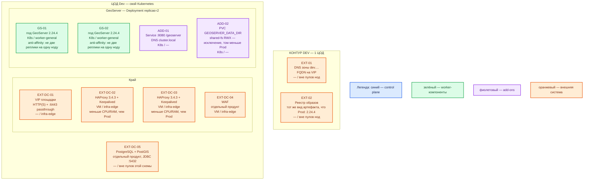

# GeoServer 2.24.4 — Dev

Тот же механизм, что Prod: классический **WAR/Docker OSGeo 2.24.4** (не GeoServer Cloud), **Deployment** в Kubernetes, **≥ 2 JVM** на 2 нодах, общий `GEOSERVER_DATA_DIR` на StorageClass **`shared-fs` (RWX) как исключение**, JDBC к **PostGIS отдельного продукта** той же площадки, край — пара **HAProxy 3.4.3** + **Keepalived** + **VIP**. Dev **уменьшает CPU/RAM/диск**, не меняет вид инсталляции.

Это **не** учебный `docker run` одного контейнера на localhost и не один под. Иначе ошибка «на Prod две JVM и общий каталог, на Dev — один Docker» на Dev не воспроизводится.

**Критично по версии.** Линия **2.24.x** закончила жизнь в **августе 2024**. Патчей после июня 2024 нет. Закрытый Dev не отменяет решение ИБ, если с контура ходят в гособмен или светят **8080**.

## Допущения

- Dev: **1 ЦОД**. Stretch каталога не применим (и через город его всё равно нельзя).
- Уже есть: VM, Kubernetes этого ЦОДа, пара HAProxy + Keepalived + VIP (меньше CPU/RAM, чем Prod), те же имена StorageClass `local-ssd` / `shared-fs` (каталог — снова **исключение** `shared-fs`), зона `dev.…`.
- Паритет с Prod: тот же образ **2.24.4**, тот же Deployment, те же роли пулов, тот же общий DATA_DIR на RWX, PostGIS **отдельно**, WFS-T выкл в том же смысле, что бой (стендовые пароли — не заводской `geoserver` на VIP).
- Не Docker Compose, не quickstart одной машины из `.install.md` как рантайм контура, не `replicas: 1`.
- Нагрузка не замерена. Цифр «хватит» у вендора нет; ниже — меньший порядок величины, уточняется замером.
- Те же запреты тега: не `2.24.x`, не `latest`. Не Cloud.

## Схема инстансов

ОС — свойство платформы, не пода. Один стандарт Linux на всех нодах контура.

Исключения вендора по ОС нет: тот же JVM-контейнер, что в Prod (Java 11 как опорный runtime линии 2.24).

| Имя пула | Роль | Зачем выделен |
|---|---|---|
| `infra-edge` | edge-VM | Та же пара HAProxy + Keepalived и VIP, что в Prod; меньше CPU/RAM |
| `worker-general` | general | Два пода GeoServer на разных нодах пула; геометрия не на локальном SSD пода |

Смысл цветов: синий — control plane продукта (у GeoServer нет); зелёный — поды JVM; фиолетовый — Service и PVC каталога; оранжевый — VIP, HAProxy, WAF, PostGIS, DNS, реестр.

От Prod схема отличается так: один ЦОД, нет второго зала и нет блока ЦОД-бэкапов, те же **2** рабочих пода (не «урезать до 1 Docker»).

## Комментарии к схеме

### EXT-01 — DNS зоны `dev.…`

- **Функционал.** FQDN карты на VIP этого ЦОДа, не Pod IP.
- **Критично.** Имена другие, чем `prod.…`; механизм тот же. Proxy base URL — внешнее имя Dev. Клиенты и проверки GetMap/GetFeature — по FQDN, не `127.0.0.1:8080` пода.

### EXT-02 — реестр образов

- **Функционал.** Тот же патч **2.24.4**, что Prod (можно отдельный реестр/тег `dev`, не другой способ поставки).
- **Критично.** Не подменять контур «контейнером на ноутбуке». Не nightly `2.24.x`.

### EXT-DC-01 — VIP

- **Функционал.** Край HTTP(S) и `:6443` passthrough. Keepalived держит VIP на одном из двух HAProxy.
- **Критично.** Та же роль-модель, что Prod. Kafka `:9092` сюда не публикуем. **8080** даже на Dev в интернет не публиковать.

### EXT-DC-02 / EXT-DC-03 — пара HAProxy 3.4.3 + Keepalived

- **Функционал.** Балансировка на Service GeoServer. Две VM, чтобы отказ одного края и раздача запросов на **две** JVM совпадали с Prod.
- **Критично.** Меньше CPU/RAM, чем Prod, не «один контейнер Compose». Backend — Service, не прямой Pod и не PostGIS. Админку `/geoserver/web` по-прежнему имеет смысл слать на одного писателя — иначе на Dev не поймаете гонку XML.

### EXT-DC-04 — WAF

- **Функционал.** Тот же слой, что Prod.
- **Критично.** Не выкидывать WAF на Dev «для простоты», если Prod им пользуется: CSRF, заголовки и блокировки UI иначе не воспроизвести.

### GS-01, GS-02 — поды GeoServer

- **Функционал.** Два независимых процесса 2.24.4 за одним Service и **одним** каталогом. Отказ одной ноды пула `worker-general` оставляет OGC живым; край видит балансировку.
- **Критично.**
  - `replicas: 2` — пол. **Anti-affinity: не две реплики на одну ноду.** Если в Dev всего одна worker-нода — это **другой класс** стенда, не уменьшенный Prod; нужна вторая нода пула.
  - PDB и здесь: drain единственной «живой» реплики без PDB = нет карты.
  - Каталог — тот же класс `shared-fs` RWX, **меньший том**, не замена на emptyDir и не «каталог только у одного пода». `GEOSERVER_REQUIRE_FILE` — как в Prod.
  - Учебный запуск из `GeoServer.install.md` (`docker run -p 127.0.0.1:8080:8080`, один процесс, том Docker) остаётся **локальной** отладкой разработчика. Контур Dev его **не** использует.
  - Пароль `admin` сменить; заводской `geoserver` на VIP Dev не оставлять. Демо-слои образа в контур не уносить (как в бой). JDBC — к PostGIS **этого** Dev, не к Prod-БД «чтобы были данные».
  - Ёмкость пода: тот же порядок «единицы vCPU / единицы ГиБ», **меньше Prod** (ориентир sample **2 vCPU / 4 ГиБ / 10 ГиБ** как потолок Dev-пода, не SLA). Куча `-Xmx756M` из мануала — не норматив. Уточняется замером. Том `shared-fs` меньше, чем в Prod.
  - control-flow той же 2.24.4, если стоит в Prod: иначе лимиты GetMap на Dev не те.

### ADD-01 — Service

- **Функционал.** DNS `cluster.local` для подов и цель backend HAProxy.
- **Критично.** Не ходить на `localhost:8080` с машины разработчика как на «вход контура».

### ADD-02 — PVC каталога

- **Функционал.** Общий DATA_DIR двух реплик. Исключение RWX — то же, что Prod.
- **Критично.** Не подменять `shared-fs` диском `local-ssd` «на Dev и так сойдёт»: тогда вторая реплика не стартует или получите два каталога — другую ошибку, чем в бою.

### EXT-DC-05 — PostgreSQL + PostGIS

- **Функционал.** Store геометрии Dev-контура. JDBC с каждого пода.
- **Критично.** Не встраивать PostGIS в под GeoServer. Не проксировать Dev-карту на Prod-PostGIS: другой RTT и другие права. Упал store — пустая карта при живом Tomcat (это ожидаемо и должно быть видно на Dev).

## Путь роста

Как в Prod, только с меньшим потолком: две реплики на двух нодах уже стоят; затем больше реплик **после** замера; затем тайлы. Не «сначала один Docker, потом как Prod». Второй ЦОД на Dev не добавляем. Бэкап каталога на Dev — по процедуре площадки, не отдельный зал.

## Сильные и слабые места; критичные условия

**Сильная сторона.** Тот же Deployment, тот же край, две JVM, общий RWX: воспроизводятся выкат образа, anti-affinity, PDB, гонка каталога, Proxy base URL, JDBC к чужому PostGIS.

**Слабая сторона.** Меньше ёмкость — не поймать все деградации GetMap под боевым растром. Один ЦОД — не доказывает отказ зала и переключение DNS. EOL 2.24 на Dev тот же.

**Критичные условия**

- Dev ≥ 2 реплики на **2 нодах**. Один контейнер Docker или `replicas: 1` — нарушение паритета.
- Не Compose вместо Kubernetes. Не пропускать пару HAProxy+VIP. Не свой DATA_DIR на каждый под вместо `shared-fs`.
- Те же запреты тега, пароля, 8080, WFS-T, Cloud, что в Prod.
- Не монтировать каталог Prod в Dev и наоборот.

## Источники

Те же, что `GeoServer.prod.md` (вендор не разделяет «Dev-топологию»). Дополнительно:

| Факт | URL / файл |
|---|---|
| Учебный Docker / localhost:8080 — не этот контур | https://docs-archive.geoserver.org/2.24.x/en/user/installation/docker.html · `Out/ГИС-платформа/GeoServer/GeoServer.install.md` |
| Бой = несколько JVM за прокси, одна правда каталога | https://docs-archive.geoserver.org/2.24.x/en/user/production/misc.html · `.consultant.md` · `.shema.md` |
| Паритет и файл Prod | `sample2/GeoServer.prod.md` |
| Ресурсы sample (не норма боя) | `sample/GeoServer.md` |

В документации вендора **нет** отдельной схемы «Dev из одного docker run». Паритет — требование этой платформы, не страница GeoServer.
