# GeoServer 2.24.4 — Prod

Классический **WAR/Docker OSGeo** (одно Java-приложение в контейнере сервлетов Tomcat), не **GeoServer Cloud** (другой дистрибутив и Helm) и не платформа GeoData. Релиз **2.24.4** (18 июня 2024). Официального оператора Kubernetes под WAR 2.24 **нет**: в каждом прикладном ЦОДе — **Deployment** образа `docker.osgeo.org/geoserver:2.24.4` (не тег `2.24.x`: в руководстве 2.24 это nightly). В ядре **нет** выборов лидера и кворума: «кластер» вендора — несколько JVM за прокси и **одна** правда каталога данных.

**Критично по версии.** Линия **2.24.x** закончила жизнь в **августе 2024**. 2.24.4 закрывал **CVE-2024-36401** (удалённый запуск кода, Critical). Всё, что нашли после июня 2024, в 2.24.x проект **не чинит**. Считать готовым к бою с гособменом без отдельного решения ИБ **нельзя**.

## Допущения

- Уже есть: виртуализация (VM), Kubernetes площадки, пара **HAProxy 3.4.3** + **Keepalived** + **VIP** на каждый прикладной ЦОД, StorageClass `local-ssd` (RWO) и `shared-fs` (RWX), CoreDNS / `cluster.local`, внешняя зона `prod.…`. Сеть (VLAN, IP-план) вне рамок.
- Prod: **2 прикладных ЦОДа** + **1 ЦОД под бэкапы**. Stretch каталога (`GEOSERVER_DATA_DIR` — файловая конфигурация слоёв, стилей, прав) и общего диска на 2–3 зала **нет**: порога RTT в доке вендора нет, общая папка через город даёт порчу XML.
- Живые JVM, каталог этой публикации и **PostGIS** (расширение PostgreSQL для геометрии) — **в одном ЦОДе**. PostGIS — **отдельный продукт**, не этот файл и не процесс GeoServer. JDBC **5432/TCP** на VIP HAProxy **не** публикуем.
- На площадку — **≥ 2 JVM** (поды Deployment). Общий каталог на эти поды — **явное исключение** StorageClass `shared-fs` (RWX). `local-ssd` (RWO) на две реплики каталога не отдаётся. Не три реплики с каталогом «только одному поду».
- ЦОД-2 — **та же** роль-модель (Deployment, 2 пода, свой `shared-fs` **этого** зала), каталог доставляется **копией/выкатом**, не общим томом через город. Не второй писатель тех же XML по сети.
- ЦОД-бэкапов живые поды GeoServer **не** размещает: там копии каталога (и бэкапы PostGIS ведёт продукт PostgreSQL).
- Механизм боя: образ OSGeo **2.24.4** (или свой образ из WAR **2.24.4** на Tomcat **9**, если реестр недоступен) + Deployment Kubernetes. Не Docker Compose, не `docker run` с ноутбука, не Helm GeoServer Cloud, не Windows installer.
- Запись через **WFS-T** (транзакционная запись объектов) в бою **выключена**; геометрию пишут ваши сервисы в PostGIS. Админка/REST — один писатель конфигурации.
- Нагрузка GetMap (картинка карты) не замерена. Цифр CPU/RAM «хватит» у проекта **нет**. Ниже — порядок величины, уточняется замером. Терабайты живут в PostGIS, не в куче GeoServer.
- Заказчик сознательно остаётся на линейке с закончившейся жизнью. Иначе целевая поддерживаемая линия — другой документ.

## Схема инстансов

Имена — роли, не обязательные DNS. Потоков и стрелок нет. Пул нод — класс машин для планировщика, не «под на ноде 3».

```mermaid
flowchart TB
  subgraph CITY["КОНТУР PROD"]
    DNS["EXT-01<br/>DNS зоны prod.…<br/>FQDN карты на VIP активной площадки<br/>— / вне пулов нод"]
    REG["EXT-02<br/>Реестр образов<br/>docker.osgeo.org/geoserver:2.24.4<br/>— / вне пулов нод"]
  end

  subgraph DC1["ЦОД-1 — прикладной, свой Kubernetes, активная публикация"]
    subgraph EDGE1["Край ЦОД-1"]
      VIP1["EXT-DC1-01<br/>VIP площадки<br/>HTTP(S) + :6443 passthrough<br/>— / infra-edge"]
      HAP1A["EXT-DC1-02<br/>HAProxy 3.4.3 + Keepalived<br/>VM / infra-edge"]
      HAP1B["EXT-DC1-03<br/>HAProxy 3.4.3 + Keepalived<br/>VM / infra-edge"]
      WAF1["EXT-DC1-04<br/>WAF<br/>отдельный продукт<br/>VM / infra-edge"]
    end
    subgraph GS1["GeoServer ЦОД-1 — Deployment ≥2"]
      G1A["GS-DC1-01<br/>под GeoServer 2.24.4<br/>K8s / worker-general<br/>anti-affinity: не две реплики на одну ноду"]
      G1B["GS-DC1-02<br/>под GeoServer 2.24.4<br/>K8s / worker-general<br/>anti-affinity: не две реплики на одну ноду"]
      SVC1["ADD-DC1-01<br/>Service :8080 /geoserver<br/>DNS cluster.local<br/>K8s / —"]
      PVC1["ADD-DC1-02<br/>PVC GEOSERVER_DATA_DIR<br/>shared-fs RWX — исключение<br/>K8s / —"]
    end
    PG1["EXT-DC1-05<br/>PostgreSQL + PostGIS<br/>отдельный продукт, JDBC :5432<br/>— / вне пулов этой схемы"]
  end

  subgraph DC2["ЦОД-2 — прикладной, свой Kubernetes, не stretch каталога"]
    subgraph EDGE2["Край ЦОД-2"]
      VIP2["EXT-DC2-01<br/>VIP площадки<br/>HTTP(S) + :6443 passthrough<br/>— / infra-edge"]
      HAP2A["EXT-DC2-02<br/>HAProxy 3.4.3 + Keepalived<br/>VM / infra-edge"]
      HAP2B["EXT-DC2-03<br/>HAProxy 3.4.3 + Keepalived<br/>VM / infra-edge"]
      WAF2["EXT-DC2-04<br/>WAF<br/>отдельный продукт<br/>VM / infra-edge"]
    end
    subgraph GS2["GeoServer ЦОД-2 — тот же вид, каталог-копия"]
      G2A["GS-DC2-01<br/>под GeoServer 2.24.4<br/>K8s / worker-general<br/>anti-affinity: не две реплики на одну ноду"]
      G2B["GS-DC2-02<br/>под GeoServer 2.24.4<br/>K8s / worker-general<br/>anti-affinity: не две реплики на одну ноду"]
      SVC2["ADD-DC2-01<br/>Service :8080 /geoserver<br/>DNS cluster.local<br/>K8s / —"]
      PVC2["ADD-DC2-02<br/>PVC GEOSERVER_DATA_DIR<br/>свой shared-fs этого зала, не том ЦОД-1<br/>K8s / —"]
    end
    PG2["EXT-DC2-05<br/>PostgreSQL + PostGIS этой площадки<br/>отдельный продукт<br/>— / вне пулов этой схемы"]
  end

  subgraph BKP["ЦОД-бэкапов — не прикладной вход"]
    BK["EXT-BKP-01<br/>копии каталога DATA_DIR<br/>живых JVM нет<br/>— / —"]
  end

  LEGCORE["Легенда: синий — control plane"]
  LEGWORK["зелёный — worker-компоненты"]
  LEGADD["фиолетовый — add-ons"]
  LEGEXT["оранжевый — внешняя система"]

  classDef core fill:#dbeafe,stroke:#2563eb,color:#172554,stroke-width:2px;
  classDef worker fill:#dcfce7,stroke:#16a34a,color:#14532d,stroke-width:2px;
  classDef addon fill:#f3e8ff,stroke:#9333ea,color:#581c87,stroke-width:2px;
  classDef external fill:#ffedd5,stroke:#ea580c,color:#7c2d12,stroke-width:2px;

  class LEGCORE core;
  class G1A,G1B,G2A,G2B,LEGWORK worker;
  class SVC1,PVC1,SVC2,PVC2,LEGADD addon;
  class DNS,REG,VIP1,HAP1A,HAP1B,WAF1,PG1,VIP2,HAP2A,HAP2B,WAF2,PG2,BK,LEGEXT external;
```

ОС — свойство платформы, не пода. Один стандарт Linux на всех нодах контура.

У классического GeoServer 2.24 нет требования иной ОС: это JVM в контейнере. Опорный runtime линии 2.24 — **Java 11**; Java 17 в руководстве 2.24 экспериментальна. Tomcat **8.5 или 9** (Tomcat 10 — другое пространство имён Jakarta, не тот WAR). Отдельной «ОС вендора» для нод нет.

| Имя пула | Роль | Зачем выделен |
|---|---|---|
| `infra-edge` | edge-VM | Пара HAProxy + Keepalived и VIP (край HTTP(S) и `:6443`); WAF как отдельный продукт того же края |
| `worker-general` | general | Поды GeoServer (JVM, без локального SSD под геометрию); планировщик двигает поды по пулу |

Смысл цветов на этой схеме: синий — управляющие/голосующие роли продукта (у классического GeoServer их нет: нет Raft/лидера); зелёный — рабочие инстансы (поды JVM); фиолетовый — add-on Kubernetes этого приложения (Service, PVC), не вендорский оператор; оранжевый — внешнее (VIP, HAProxy, WAF, PostGIS, DNS, реестр, ЦОД-бэкапов).

## Комментарии к схеме

### EXT-01 — DNS зоны `prod.…`

- **Функционал.** Имя карты (`geoserver.prod.…` и аналоги) указывает на **VIP** живой прикладной площадки, не на Pod IP. Между двумя ЦОДами выбор зала — DNS / городской вход (это не функция GeoServer).
- **Критично.** Клиенты ходят по FQDN. В Capabilities (XML «куда ходить» OGC-сервиса) должен попасть **Proxy base URL** внешнего имени, не `http://pod:8080`.

### EXT-02 — реестр образов

- **Функционал.** Хранит пин **`docker.osgeo.org/geoserver:2.24.4`** (или свой образ из WAR 2.24.4 на Tomcat 9). Оба кластера тянут один и тот же патч.
- **Критично.** Не тег `2.24.x` (nightly), не `latest`. Расширения — zip **той же** 2.24.4, одинаковый набор JAR в каждый под.

### EXT-DC1-01 / EXT-DC2-01 — VIP площадки

- **Функционал.** Единый адрес края этого ЦОДа: HTTP(S) клиентов и ControlPlaneEndpoint Kubernetes (`:6443`, TCP passthrough). Keepalived назначает VIP одному из двух HAProxy.
- **Критично.** Kafka `:9092` через этот HAProxy не публикуем. **8080** и Web UI в интернет не публиковать: снаружи **443**. Один VIP на три ЦОДа HAProxy не склеивает.

### EXT-DC*-02 / EXT-DC*-03 — пара HAProxy 3.4.3 + Keepalived

- **Функционал.** Завершение TLS и балансировка HTTP на **Service GeoServer этой площадки**, не Pod IP и не JVM соседнего ЦОДа.
- **Критично.** Две VM пула `infra-edge`. Health check — живость `/geoserver`, не «пинг PostGIS». Типовой приём доки: публичный OGC на все ноды, путь админки `/geoserver/web` — на **одного** писателя каталога.

### EXT-DC*-04 — WAF

- **Функционал.** Фильтр прикладного HTTP перед WAR. GeoServer WAF не заменяет.
- **Критично.** Отдельный продукт. Линейка без патчей + история RCE: край и WAF не «опция для красоты».

### GS-DC1-01, GS-DC1-02 (и зеркало GS-DC2-*) — поды GeoServer

- **Функционал.** Два равноправных процесса классического GeoServer **2.24.4**: OGC (WMS/WFS/WCS/WMTS), REST, Web UI. Порт в официальном Docker — **8080/TCP**, контекст `/geoserver`. Между JVM своего протокола нет: отказ одной переживается второй, пока живы каталог и PostGIS **этого** зала.
- **Критично.**
  - Deployment, не StatefulSet «с своим диском на под» как единственная правда каталога. **≥ 2 реплики**, `podAntiAffinity`: не две на одну ноду `worker-general`. **PodDisruptionBudget**, иначе drain одной ноды = нет карты.
  - Каталог — общий PVC `shared-fs` (RWX) **внутри ЦОДа**. Это **исключение** из правила «RWX не по умолчанию». `local-ssd` RWO на две реплики не подходит. NFS как диск etcd/Kafka/Postgres/Prometheus сюда не при чём; для XML GeoServer вендор прямо называет сложность *management of changes to the data directory* — замерить блокировки, не тащить том через город.
  - Точка монтирования образа 2.24: `/opt/geoserver_data`. На сетевой ФС — `GEOSERVER_REQUIRE_FILE`, чтобы пустой mount не поднял учебный незащищённый каталог.
  - Заводские `admin` / `geoserver` в бой не копировать. Сменить до любого входа с VIP. Файл `security/masterpw.info` в каталоге — прочитать, сменить master password, **удалить файл**.
  - Демо-слои образа (`topp:states` и т.п.) снять. WFS Service Level = Basic (без транзакций). Учётка JDBC — только чтение, если геометрию пишут ваши сервисы.
  - CSRF не выключать «чтобы UI заработал за прокси»; задать белый список доменов. Cookie сессии: флаг **Secure**. Разбор XML: внешние http/https ограничить белым списком.
  - **GeoWebCache** (встроенный кэш тайлов) опционален. Локальные кэши двух подов независимы → «мигание» картинки, пока нет общего blob. Тайлы не заменяют бэкап каталога и PostGIS.
  - Расширение **control-flow** (лимит параллельных запросов) — ориентир модуля: порядка **2× ядер** параллельных GetMap **на инстанс**. Это лимит запросов, не смета закупки ядер.
  - Ёмкость: в доке вендора ядер и гигабайт «хватит» **нет**. Пример кучи `-Xmx756M` — иллюстрация синтаксиса, не норматив боя. Ориентир sample (не смета): **2 vCPU, 4 ГиБ RAM, 10 ГиБ** под каталог на реплику-процесс; для боя — **единицы vCPU и единицы–десятки ГиБ RAM** на под, том каталога — порядок **десятков ГиБ** (XML и стили, не терабайты геометрии). Уточняется замером GetMap/GetFeature. Не обещать «хватит для терабайтов».
  - AJP **8009** наружу не открывать. **8443** — только если HTTPS включили *внутри* контейнера; в этой схеме TLS на крае.

### ADD-DC*-01 — Service

- **Функционал.** Стабильное DNS-имя `*.svc.cluster.local` и порт **8080** для подов Deployment. Край балансирует на Service.
- **Критично.** Не LoadBalancer «на весь город» вместо VIP HAProxy. Не ходить на Pod IP.

### ADD-DC*-02 — PVC каталога (`shared-fs`, исключение RWX)

- **Функционал.** Постоянный том файлов `GEOSERVER_DATA_DIR`. Формат XML — продукт; диск — платформа.
- **Критично.** Один том на **все** реплики **этого** ЦОДа. Том ЦОД-1 ≠ том ЦОД-2. Потеря тома = потеря публикации слоёв при живой геометрии в PostGIS. Бэкап каталога обязателен и **не** заменяется репликами подов.

### EXT-DC*-05 — PostgreSQL + PostGIS

- **Функционал.** Эталон векторной геометрии этой публикации. Каждый инстанс GeoServer открывает JDBC **сам**. Порт задаёт СУБД, часто **5432/TCP**.
- **Критично.** Упал PostGIS — карта пустая при живом UI. Реплики GeoServer PostGIS не кластеризуют и не бэкапят. Stretch JDBC на PostGIS другого ЦОДа как «HA карты» — другой RTT, порога в доке GeoServer нет. Пароль JDBC — в Secret/Vault и в каталоге (keystore), не в git и не в Capabilities.

### EXT-BKP-01 — ЦОД-бэкапов

- **Функционал.** Копии каталога данных (и снимки PostGIS — зона продукта PostgreSQL). Живых JVM GeoServer нет.
- **Критично.** Не строить «третий зал писателя XML» и не монтировать `shared-fs` боя на бэкап-площадку как общий диск трёх городов.

## Путь роста

Не включать сразу. После замера GetMap/GetFeature и размера растра:

1. Увеличить `replicas` Deployment **внутри ЦОДа** (антиаффинити и PDB сохранить). Каталог по-прежнему один `shared-fs` этого зала.
2. Поднять request/limit CPU/RAM пода и лимиты control-flow (иначе нехватка памяти на GetMap).
3. Включить/вынести кэш тайлов (предрасчёт WMTS, общий blob в пределах зала или расширение `gwc-s3` из стабильного списка **2.24.4**). Главный рычаг подложки карты — тайлы, не «ещё 64 ГиБ кучи».
4. Больше объектов WFS — лимиты числа объектов и индексы PostGIS, не раздувание кучи.
5. Второй прикладной ЦОД уже есть как **независимый** выкат; «добавить ЦОД» ≠ stretch каталога.

Цифр RPS у проекта GeoServer нет. Десятки тысяч слоёв: XML-каталог на диске уже некомфортен; экспериментальный каталог в СУБД после EOL 2.24 штатной устойчивостью не считается.

## Сильные и слабые места; критичные условия

**Сильная сторона.** Отказ одной JVM переживается второй за тем же VIP, если каталог и PostGIS зала живы. Один патч-образ на обе площадки. Тот же вид инсталляции, что на Dev.

**Слабая сторона.** Нет кворума: расхождение каталога = разные серверы. Общий RWX даёт блокировки файлов и риск «кто последний записал». Отказ ЦОДа вместе с его PostGIS останавливает карту этого зала. Линейка **два года без патчей**. Вендор не даёт смету железа и порог RTT.

**Критичные условия**

- Не GeoServer Cloud, не один под, не Docker Compose, не учебный `docker run -p 8080:8080`.
- Не один PVC/`shared-fs` на два ЦОДа и не NFS каталога «через город».
- Не `local-ssd` RWO на ≥2 реплик каталога. Не объявлять три реплики без одной правды DATA_DIR кластером.
- Не тег `2.24.x` / `latest`. Не обещать актуальные патчи линии 2.24.
- Не заводской `admin`/`geoserver`, не 8080 в интернет, не WFS-T в бою, не демо-слои.
- Не считать UI = карту: падение админки при уже выкатанном каталоге карту не обязано глушить; падение PostGIS — обязано.

## Источники

| Факт | URL / файл |
|---|---|
| Релиз 2.24.4, CVE-2024-36401 | https://geoserver.org/release/2.24.4/ |
| Анонс 2.24.4, CVE | https://geoserver.org/announcements/vulnerability/2024/06/18/geoserver-2-24-4-released.html |
| EOL 2.24.x = август 2024; Java 11; Tomcat 8.5 или 9 | https://github.com/geoserver/geoserver/wiki/Release-Schedule |
| Docker 2.24: порт 8080, `/geoserver`, `/opt/geoserver_data`, тег `2.24.x` = nightly | https://docs-archive.geoserver.org/2.24.x/en/user/installation/docker.html |
| `GEOSERVER_DATA_DIR`, `GEOSERVER_REQUIRE_FILE` | https://docs-archive.geoserver.org/2.24.x/en/user/datadirectory/setting.html |
| Кластер = ноды за прокси; Proxy | https://docs-archive.geoserver.org/2.24.x/en/user/production/misc.html |
| Java 11 vs 17 experimental | https://docs-archive.geoserver.org/2.24.x/en/user/production/java.html |
| Пример `-Xmx756M`, куча ¼ RAM | https://docs-archive.geoserver.org/2.24.x/en/user/production/container.html |
| WFS Basic, демо-слои, XML, админка | https://docs-archive.geoserver.org/2.24.x/en/user/production/config.html |
| Дефолт `admin` / `geoserver` | https://docs-archive.geoserver.org/2.24.x/en/user/gettingstarted/web-admin-quickstart/index.html |
| Control-flow, ориентир 2× CPU | https://docs-archive.geoserver.org/2.24.x/en/user/extensions/controlflow/index.html |
| PostGIS store | https://docs-archive.geoserver.org/2.24.x/en/user/data/database/postgis.html |
| Proxy Base URL | https://docs-archive.geoserver.org/2.24.x/en/user/configuration/globalsettings.html |
| GeoServer Cloud — другой продукт | https://geoserver.org/geoserver-cloud/deploy/kubernetes/ |
| Deployment / PDB / anti-affinity | https://kubernetes.io/docs/concepts/workloads/controllers/deployment/ · https://kubernetes.io/docs/concepts/workloads/controllers/disruption/ · https://kubernetes.io/docs/concepts/scheduling-eviction/assign-pod-node/#affinity-and-anti-affinity |
| Карточка, установка, схема стыковки | `Out/ГИС-платформа/GeoServer/` (`.md`, `.install.md`, `.shema.md`, `.consultant.md`) |
| Ресурсы sample (не норма боя) | `sample/GeoServer.md` |

В документации вендора **нет**: CPU/RAM «хватит на Prod», порога RTT для общего каталога, официального оператора Kubernetes для WAR 2.24, обещания переживать два дата-центра одним DATA_DIR.
