# GitLab CI 19.3.0 — Dev

Контур: **Dev** (1 ЦОД). Упрощение Prod: тот же **Cloud Native Hybrid** — Helm `gitlab/gitlab` **10.3.0** (GitLab **19.3.0**) в Kubernetes, **Gitaly Cluster / Praefect на Linux-VM**, внешние PostgreSQL **17.x** и Redis/Valkey **7.2** + Sentinel, объектное хранилище, Runner **19.3.0** с kubernetes-executor. Уменьшены CPU/RAM/диск, не вид инсталляции.

Это **не** Omnibus all-in-one на одну VM из `GitLab CI.install.md` и **не** дефолтный Helm со встроенными Postgres/Redis/MinIO. Такой стенд не воспроизводит отказы Praefect, двух Webservice, job-подов на двух нодах и выкат Hybrid.

## Допущения

1. Один ЦОД, один Kubernetes **1.36.4**, зона `dev.…`. Второго прикладного ЦОДа и отдельного ЦОДа бэкапов нет: Runner «во втором зале» и Geo secondary **не** повторяем. Бакеты и Rake-бэкап — в **этом** ЦОДе, меньше тома, тот же класс восстановления.
2. Вход: та же пара HAProxy **3.4.3** + Keepalived + VIP, меньше CPU/RAM. `:6443` и HTTP(S). Kafka `:9092` не публикуем. **8075 / 2305 / 5432 / 6379** на VIP края не публикуем.
3. Те же имена StorageClass: `local-ssd` / `shared-fs`. Gitaly — диски VM, не CSI, тома меньше. NFS нет.
4. DNS: CoreDNS / `cluster.local`; снаружи `dev.…`. Клиенты и Runner по FQDN `external_url`, не Pod IP.
5. Паритет ролей с Prod: **2** Webservice, **2** Sidekiq, **2** Shell, **2** Runner manager на **2** нодах. Кворум Praefect **3**, Gitaly **3** (RF=3), Sentinel **3**. Схема «2 Praefect» или «1 Gitaly» — другой класс системы (нет большинства / нет копии репо).
6. PostgreSQL GitLab 19.x — **только 17.x**, не 18.6 платформы. Redis Cluster нет. Redis/Valkey **7.2** + Sentinel. Incremental logging вкл.
7. Чарт: внешние PG/Redis/object storage; `global.gitaly.enabled=false`; вложенный Runner выкл.; отдельный чарт Runner по **APP VERSION 19.3.0**. Токен `glrt-`. `privileged: false`. BuildKit rootless.
8. Учебные пароли `GITLAB_ROOT_PASSWORD` / стенда Omnibus в общие секреты Dev **не** копировать. Свои Secret контура, не git.
9. Ёмкость — порядок величины меньше Prod, уточняется замером. Без RPS не обещать «хватит N ядер». Zero-downtime Hybrid нет и на Dev: то же окно выката, иначе ошибка upgrade на Prod не воспроизвести.
10. Geo на Dev не ставим (Premium и другая площадка). KAS — не на старте.

## Схема инстансов

Без потоков данных. Это уменьшенный Prod **одного** ЦОДа, не пакет на одну VM.

```mermaid
flowchart TB
  subgraph DC["Dev — один ЦОД, Cloud Native Hybrid"]
    subgraph EDGE["Пул infra-edge"]
      HAPA["EXT-01a<br/>HAProxy 3.4.3 + Keepalived<br/>VM / infra-edge<br/>меньше CPU/RAM чем Prod"]
      HAPB["EXT-01b<br/>HAProxy 3.4.3 + Keepalived<br/>VM / infra-edge"]
      VIP["EXT-02<br/>VIP · FQDN зоны dev.…<br/>:6443 TCP и HTTP(S) :443<br/>8075 / 2305 / 5432 / 6379 сюда не публикуем"]
    end

    subgraph GEN["Пул worker-general — Helm gitlab 10.3.0"]
      WEB1["CORE-01a<br/>Webservice / Puma + Workhorse<br/>Под / K8s / worker-general<br/>anti-affinity: не два Webservice на одну ноду"]
      WEB2["CORE-01b<br/>Webservice / Puma + Workhorse<br/>Под / K8s / worker-general"]
      SID1["WRK-01a<br/>Sidekiq маленький<br/>Под / K8s / worker-general<br/>anti-affinity: не два Sidekiq на одну ноду"]
      SID2["WRK-01b<br/>Sidekiq маленький<br/>Под / K8s / worker-general"]
      SHL1["ADD-01a<br/>GitLab Shell<br/>Под / K8s / worker-general"]
      SHL2["ADD-01b<br/>GitLab Shell<br/>Под / K8s / worker-general"]
      TBX["ADD-02<br/>Toolbox / migrations<br/>Под / K8s / worker-general"]
      GW["ADD-03<br/>Gateway API / Envoy Gateway<br/>K8s / worker-general"]
    end

    subgraph CI["Пул ci-builder"]
      RM1["ADD-11a<br/>Runner manager 19.3.0<br/>Под / K8s / ci-builder"]
      RM2["ADD-11b<br/>Runner manager 19.3.0<br/>Под / K8s / ci-builder<br/>anti-affinity: не два manager на одну ноду"]
      JOB["WRK-11<br/>Эфемерные job-поды<br/>Под / K8s / ci-builder<br/>BuildKit rootless · privileged: false"]
    end

    subgraph GIT["Пул vendor-island — Gitaly Cluster на VM"]
      PRA1["CORE-11<br/>Praefect-1 маленький<br/>VM / vendor-island"]
      PRA2["CORE-12<br/>Praefect-2 маленький<br/>VM / vendor-island<br/>кворум 3, не 2"]
      PRA3["CORE-13<br/>Praefect-3 маленький<br/>VM / vendor-island"]
      G1["WRK-21<br/>Gitaly-1 SSD меньше Prod<br/>VM / vendor-island · не CSI"]
      G2["WRK-22<br/>Gitaly-2<br/>VM / vendor-island"]
      G3["WRK-23<br/>Gitaly-3<br/>VM / vendor-island"]
    end
  end

  subgraph STORE["Хранилища этого же ЦОДа"]
    PG["EXT-31<br/>PostgreSQL 17.x main · меньше том<br/>не PG 18.6 платформы"]
    PGP["EXT-32<br/>PostgreSQL 17.x Praefect"]
    RD["EXT-33<br/>Redis/Valkey 7.2 + Sentinel x3"]
    OBJ["EXT-41<br/>S3-бакеты меньше Prod<br/>артефакты / логи / backup · свои диски"]
  end

  REG["EXT-51<br/>Реестр образов контура"]

  LEGCORE["Легенда: синий — control plane"]
  LEGWORK["зелёный — worker-компоненты"]
  LEGADD["фиолетовый — add-ons"]
  LEGEXT["оранжевый — внешняя система"]

  classDef core fill:#dbeafe,stroke:#2563eb,color:#172554,stroke-width:2px;
  classDef worker fill:#dcfce7,stroke:#16a34a,color:#14532d,stroke-width:2px;
  classDef addon fill:#f3e8ff,stroke:#9333ea,color:#581c87,stroke-width:2px;
  classDef external fill:#ffedd5,stroke:#ea580c,color:#7c2d12,stroke-width:2px;

  class WEB1,WEB2,PRA1,PRA2,PRA3,LEGCORE core;
  class SID1,SID2,G1,G2,G3,JOB,LEGWORK worker;
  class SHL1,SHL2,TBX,GW,RM1,RM2,LEGADD addon;
  class HAPA,HAPB,VIP,PG,PGP,RD,OBJ,REG,LEGEXT external;
```

ОС — свойство платформы, не пода. Один стандарт Linux на всех нодах контура.

Исключение вендора: хост Gitaly / Praefect — Linux из таблицы пакета GitLab. Windows не берём.

| Имя пула | Роль | Зачем выделен |
|---|---|---|
| `infra-edge` | edge-VM | Та же пара HAProxy + VIP, что в Prod; меньше CPU/RAM. Не путь к Gitaly/PG/Redis |
| `worker-general` | general | Два Webservice, два Sidekiq, Shell, Toolbox, Gateway. Не схлопывать в 1 под |
| `ci-builder` | ci-builder | Два Runner manager и job-поды. Не Docker executor на той же VM, что координатор |
| `vendor-island` | vendor | Три маленьких Praefect + три маленьких Gitaly на VM. Не один Omnibus-диск |
| `infra-swift` | object storage | Меньшие бакеты в этом ЦОДе. Не CSI, не MinIO из чарта |

Смысл цветов: **синий** — Webservice и Praefect; **зелёный** — Gitaly, Sidekiq, job-поды; **фиолетовый** — Shell / Toolbox / Gateway / Runner manager; **оранжевый** — VIP, HAProxy, PG, Redis, бакеты, реестр.

## Комментарии к схеме

### EXT-01 / EXT-02 — пара HAProxy + VIP

- **Функционал.** ControlPlaneEndpoint `:6443` и край HTTPS `external_url` зоны `dev.…`.
- **Критично.** Не один контейнер HAProxy «для экономии»: нужна та же пара+VIP, что Prod. Внутренний TCP к Praefect `:2305` — не VIP края.

### CORE-01a/b, WRK-01a/b — Webservice и Sidekiq

- **Функционал.** Тот же Helm 10.3.0: UI/API и фоновые очереди.
- **Критично.** Минимум **2+2** на разных нодах. Один Webservice на Dev — другой класс: нет балансировки и отказа ноды, ошибка rolling update на Prod не повторится. Ресурсы пода меньше Prod (порядок величины, замер), состав контейнеров тот же. Incremental logging обязателен: иначе «лог принял один Rails, Sidekiq на другом» на Dev не проверить.

Ёмкость (порядок величины, не из RPS-таблицы): меньше Prod; не копировать 8 vCPU/16 ГиБ all-in-one из sample как «Dev Hybrid». Не учебные **≥ 8 ГиБ на одну VM** Omnibus как смета этого контура.

### ADD-01…03 — Shell, Toolbox, Gateway

- **Функционал.** Как в Prod: SSH-Git, rake/migrations, Gateway API чарта 10.x.
- **Критично.** Shell ≥2. CRD Envoy Gateway перед выкатом 10.3.x — тот же шаг, что Prod. Toolbox один под — нормально.

### CORE-11…13, WRK-21…23 — Gitaly Cluster

- **Функционал.** Тот же Praefect + 3 Gitaly, RF=3, пакет **19.3.0** на VM.
- **Критично.** Не уменьшать до 1–2 VM и не переносить Gitaly в StatefulSet «потому что Dev». Диски меньше, роли те же. `global.gitaly.enabled=false`, hostname Praefect в values. Бэкап — Rake в меньший бакет, не snapshot одной VM. Не член кластера «на ноутбуке».

### ADD-11a/b, WRK-11 — Runner

- **Функционал.** Два manager 19.3.0, kubernetes-executor, job-поды на `ci-builder`.
- **Критично.** Не shell/docker-executor на машине координатора из учебной инструкции. Не один manager: нужны 2 реплики на 2 нодах (stateless-паритет). `glrt-`, `privileged: false`, BuildKit rootless. Второй ЦОД Prod здесь заменён вторым manager **в том же** Kubernetes — чтобы остались два независимых опроса API, без stretch.

### EXT-31…41 — PG 17.x, Redis 7.2, бакеты

- **Функционал.** Те же три внешних контура, меньшие тома/`local-ssd`.
- **Критично.** Не bundled chart DB. Не PostgreSQL 18.6. Sentinel **3**, не 2. Object storage обязателен (чарт 10.x без MinIO).

## Путь роста

Не включать сразу. Когда Dev упрётся — те же оси, что Prod, меньшими шагами:

1. Requests job-подов и ещё ноды `ci-builder`.
2. Реплики Webservice/Sidekiq к ориентиру Hybrid 3k — только после замера, не копировать S Cloud Native.
3. Диск Gitaly по фактическому объёму репо.
4. Патчи 19.3.x + чарт 10.3.x; выкат с окном, как в Prod.

Не «добавить Omnibus рядом, чтобы быстрее встало».

## Сильные и слабые места

**Сильное.** Тот же Hybrid и те же кворумы, что Prod: ошибка Helm-values, Praefect, двух Webservice и job-подов воспроизводится. Меньше железо.

**Слабое.** Нет второго зала исполнения и нет Geo: отказ всего Dev-ЦОДа = простой CI контура. Маленькие диски Gitaly быстрее упрутся в монорепу. ZDU Hybrid нет.

**Критичные условия**

- Не Omnibus all-in-one vs Helm Prod.
- Не дефолтный chart с bundled PG (в 10.x bundled уже нет — внешние хранилища обязательны).
- Не 2 Praefect / 1 Gitaly / 1 Webservice / 1 Runner «для экономии».
- Не PostgreSQL 18, не Redis Cluster, не privileged DinD, не `latest`, не учебный пароль стенда.
- Не stretch и не обещать, что Dev переживёт смерть координатора живым Runner.

## Источники

Те же страницы, что `GitLab CI.prod.md`. Ключевые:

| Факт | Страница |
|---|---|
| Релиз 19.3.0 | https://docs.gitlab.com/releases/19/gitlab-19-3-released/ |
| Чарт 10.3.0 → 19.3.0 | https://docs.gitlab.com/charts/installation/version_mappings/ |
| Hybrid: WS/Sidekiq в K8s, Gitaly на VM | https://docs.gitlab.com/administration/reference_architectures/3k_users/ |
| Praefect: нечётное ≥3, одна location | https://docs.gitlab.com/administration/gitaly/praefect/ |
| Внешний Gitaly в чарте | https://docs.gitlab.com/charts/advanced/external-gitaly/ |
| PG 17.x для GitLab 19.x; Redis 7.2; не Cluster | https://docs.gitlab.com/install/requirements/ |
| ZDU Hybrid не поддерживается | https://docs.gitlab.com/administration/reference_architectures/ |
| Учебный Linux package (не этот контур) | `Out/Платформенная инфра/GitLab CI/GitLab CI.install.md` |
| sample (Omnibus-ресурсы стенда) | `sample/GitLab CI.md` |

В доке вендора **нет** сметы «Dev Hybrid в N ядер». Поэтому цифры ниже Prod — порядок величины платформы, не обещание вендора.
