# GitLab CI 19.3.0 — Prod

Self-managed **GitLab 19.3.0** (координатор: репозитории, UI/API, очередь pipeline) и **GitLab Runner 19.3.0** (агент, который опрашивает API и запускает job). Отдельного продукта «только CI» нет. Контур: **Prod**. Вид инсталляции — **Cloud Native Hybrid**, не дефолтный Helm со встроенными Postgres/Redis/MinIO и не Omnibus all-in-one.

**Helm-чарт** — пакет шаблонов Kubernetes. Чарт `gitlab/gitlab` **10.3.0** → GitLab **19.3.0**. Чарт Runner пинить по колонке **APP VERSION = 19.3.0**, не по «последнему тегу чарта». **Gitaly** — процесс, который хранит Git на диске и выполняет серверные Git-операции. **Praefect** — прокси и голосование Gitaly Cluster: маршрутизация, репликация репозиториев, автоfailover ноды. **Webservice** — Rails/Puma (UI и API). **Sidekiq** — фоновые задачи (архив логов, webhooks). **kubernetes-executor** — способ Runner создавать временный job-под на одну работу.

## Допущения

1. Два прикладных ЦОДа + один ЦОД под бэкапы. RTT между залами **не измерен**. Stretch одного Praefect / PostgreSQL / Redis Sentinel на 2–3 ЦОДа **нет**: синхронный HA вендора просит **< 5 мс**; Praefect — *single location*, *ideally single-digit milliseconds*. Один GitLab environment **между регионами** вендор не поддерживает.
2. На каждом прикладном ЦОДе: Kubernetes **1.36.4** (чарт GitLab 19.3 поддерживает Kubernetes **1.36**), пара HAProxy **3.4.3** + Keepalived + VIP (`:6443` TCP passthrough и край HTTP(S)). Kafka `:9092` через этот HAProxy не публикуем. Порты Gitaly **8075**, Praefect **2305**, PostgreSQL **5432**, Redis **6379** / Sentinel **26379** на VIP края **не** публикуем.
3. StorageClass: `local-ssd` (RWO) и `shared-fs` (RWX, только по исключению). Gitaly — **свои диски VM**, не CSI и не NFS. NFS не диск Gitaly/Postgres/Redis. Swift — свои диски, не CSI.
4. DNS: внутри CoreDNS / `cluster.local`; снаружи зона `prod.…`. Клиенты и Runner — по FQDN, не Pod IP. Unified `external_url` (https://gitlab.prod.…) закладываем сразу.
5. Нагрузки RPS нет. Сайз координатора вендор считает по RPS, не по терабайтам озера. Ниже — **минимальная отказоустойчивая** Hybrid-топология, не размер S Cloud Native (у S уже 6–9 Webservice) и не «все рычаги вендора сразу». Ёмкость — порядок величины, уточняется замером.
6. Редакция на старте — **Free** (пакет EE без лицензии = функции Free). **Geo** (реплика целого инстанса на другую площадку, failover ручной) — Premium/Ultimate, на старте **не** включаем. Без Premium межплощадочный DR координатора = официальный backup + прогон restore.
7. PostgreSQL для GitLab 19.x: **минимум и максимум 17.x**. Кластер платформы PostgreSQL **18.6** как main DB GitLab **не** подходит. Отдельный внешний PostgreSQL **17.x** (latest minor) + отдельный экземпляр под Praefect. Redis Cluster **не поддерживается** (в т.ч. incremental logging). Таблица GitLab 19: Redis **7.2** (рекоменд.) / **7.0** (минимум), Valkey **7.2**. Redis 7.4 / Valkey 9 платформы в этой таблице нет — не подставлять без сверки; для GitLab — standalone + Sentinel линии **7.2**.
8. Чарт 10.x **убрал** bundled PostgreSQL/Redis/MinIO. Дефолтный `helm install` без внешних хранилищ — не бой. Флаги (и эквиваленты values): `postgresql.install=false` где ещё есть; Redis/MinIO/вложенный Runner **выкл.**; `global.gitaly.enabled=false` — Gitaly не в кластере.
9. Praefect в Kubernetes — **beta**, в референс Hybrid не входит. Gitaly Cluster — **Linux-VM** той же площадки, пакет GitLab. Windows как хост Gitaly не предполагается.
10. Runner — отдельный чарт `gitlab/gitlab-runner`, kubernetes-executor, токен **`glrt-`**. Вложенный `gitlab-runner` чарта GitLab в бою выключаем. Сборка образов — **BuildKit rootless**, не privileged DinD на общем пуле, не Kaniko (архив 3 июня 2025).
11. Incremental logging включён: куски лога в Redis → объектное хранилище. Иначе мультинодовый Rails теряет трейс.
12. Zero-downtime upgrade Cloud Native Hybrid вендор **не поддерживает**. Закладываем окно выката координатора. Патчи **19.3.x** ставить с парным чартом **10.3.x** (на дату сверки есть 10.3.1 → 19.3.1); не `latest`, не прыжок на 19.4.
13. Сеть (VLAN, IP-план) вне рамок. SonarQube, Vault, целевые кластеры приложений — соседи, не HA-зависимости GitLab.

## Схема инстансов

Без потоков данных. Один environment GitLab — **ЦОД-1**. ЦОД-2 — Runner (опрос FQDN координатора). ЦОД-бэкапы — копии, не член Praefect.

```mermaid
flowchart TB
  subgraph DC1["ЦОД-1 — активный Cloud Native Hybrid"]
    subgraph E1["Пул infra-edge"]
      HAP1A["EXT-01a<br/>HAProxy 3.4.3 + Keepalived<br/>VM / infra-edge"]
      HAP1B["EXT-01b<br/>HAProxy 3.4.3 + Keepalived<br/>VM / infra-edge"]
      VIP1["EXT-02<br/>VIP края · FQDN зоны prod.…<br/>:6443 TCP и HTTP(S) :443<br/>Git SSH :22 опционально TCP<br/>8075 / 2305 / 5432 / 6379 сюда не публикуем"]
    end

    subgraph GEN1["Пул worker-general — stateless GitLab Helm 10.3.0"]
      WEB1["CORE-01a<br/>Webservice / Puma + Workhorse<br/>Под / K8s / worker-general<br/>anti-affinity: не два Webservice на одну ноду"]
      WEB2["CORE-01b<br/>Webservice / Puma + Workhorse<br/>Под / K8s / worker-general"]
      SID1["WRK-01a<br/>Sidekiq<br/>Под / K8s / worker-general<br/>anti-affinity: не два Sidekiq на одну ноду"]
      SID2["WRK-01b<br/>Sidekiq<br/>Под / K8s / worker-general"]
      SHL1["ADD-01a<br/>GitLab Shell :22<br/>Под / K8s / worker-general<br/>anti-affinity ≥2"]
      SHL2["ADD-01b<br/>GitLab Shell<br/>Под / K8s / worker-general"]
      TBX["ADD-02<br/>Toolbox / migrations<br/>Под / K8s / worker-general"]
      GW["ADD-03<br/>Gateway API / Envoy Gateway<br/>K8s / worker-general<br/>чарт 10.x: не bundled NGINX Ingress"]
    end

    subgraph CI1["Пул ci-builder"]
      RM1["ADD-11<br/>Runner manager 19.3.0<br/>Под / K8s / ci-builder<br/>чарт gitlab-runner · kubernetes-executor"]
      JOB1["WRK-11<br/>Эфемерные job-поды<br/>Под / K8s / ci-builder<br/>BuildKit rootless в job · privileged: false"]
    end

    subgraph GIT1["Пул vendor-island — Gitaly Cluster на VM"]
      PRA1["CORE-11<br/>Praefect-1 :2305 / TLS :3305<br/>VM / vendor-island · пакет GitLab"]
      PRA2["CORE-12<br/>Praefect-2<br/>VM / vendor-island<br/>кворум: нечётное ≥3"]
      PRA3["CORE-13<br/>Praefect-3<br/>VM / vendor-island"]
      G1["WRK-21<br/>Gitaly-1 :8075 / TLS :9999<br/>VM / vendor-island · SSD репозиториев<br/>RF=3 · не CSI"]
      G2["WRK-22<br/>Gitaly-2<br/>VM / vendor-island"]
      G3["WRK-23<br/>Gitaly-3<br/>VM / vendor-island"]
    end
  end

  subgraph DC2["ЦОД-2 — не stretch координатора"]
    subgraph E2["Пул infra-edge"]
      HAP2A["EXT-21a<br/>HAProxy 3.4.3 + Keepalived<br/>VM / infra-edge"]
      HAP2B["EXT-21b<br/>HAProxy 3.4.3 + Keepalived<br/>VM / infra-edge"]
      VIP2["EXT-22<br/>VIP ЦОД-2 · свой FQDN prod.…<br/>:6443 и HTTP(S)"]
    end
    subgraph CI2["Пул ci-builder ЦОД-2"]
      RM2["ADD-21<br/>Runner manager 19.3.0<br/>Под / K8s / ci-builder<br/>опрос FQDN GitLab ЦОД-1 :443"]
      JOB2["WRK-31<br/>Эфемерные job-поды<br/>Под / K8s / ci-builder"]
    end
    GEO["ADD-22<br/>Geo secondary — не на старте<br/>Premium/Ultimate · ручной failover"]
  end

  subgraph EXTDB["Внешние хранилища той же площадки ЦОД-1"]
    PG["EXT-31<br/>PostgreSQL 17.x main GitLab<br/>отдельный Cluster · не PG 18.6 платформы"]
    PGP["EXT-32<br/>PostgreSQL 17.x Praefect<br/>отдельный экземпляр"]
    RD["EXT-33<br/>Redis/Valkey 7.2 + Sentinel x3<br/>standalone HA · не Redis Cluster"]
  end

  subgraph BKP["ЦОД-бэкапы — не член Praefect"]
    OBJ["EXT-41<br/>S3-совместимые бакеты<br/>артефакты / логи / LFS / Registry / backup<br/>свои диски, не CSI"]
    SNAP["EXT-42<br/>Официальный backup Rake<br/>Gitaly+PG+бакет · не snapshot одной VM Praefect"]
  end

  REG["EXT-51<br/>Реестр образов контура / опционально GitLab Registry"]
  IDP["EXT-52<br/>IdP"]

  LEGCORE["Легенда: синий — control plane"]
  LEGWORK["зелёный — worker-компоненты"]
  LEGADD["фиолетовый — add-ons"]
  LEGEXT["оранжевый — внешняя система"]

  classDef core fill:#dbeafe,stroke:#2563eb,color:#172554,stroke-width:2px;
  classDef worker fill:#dcfce7,stroke:#16a34a,color:#14532d,stroke-width:2px;
  classDef addon fill:#f3e8ff,stroke:#9333ea,color:#581c87,stroke-width:2px;
  classDef external fill:#ffedd5,stroke:#ea580c,color:#7c2d12,stroke-width:2px;

  class WEB1,WEB2,PRA1,PRA2,PRA3,LEGCORE core;
  class SID1,SID2,G1,G2,G3,JOB1,JOB2,LEGWORK worker;
  class SHL1,SHL2,TBX,GW,RM1,RM2,GEO,LEGADD addon;
  class HAP1A,HAP1B,VIP1,HAP2A,HAP2B,VIP2,PG,PGP,RD,OBJ,SNAP,REG,IDP,LEGEXT external;
```

ОС — свойство платформы, не пода. Один стандарт Linux на всех нодах контура.

Исключение вендора: хост Gitaly / Praefect — Linux x86_64 из таблицы пакета GitLab (в т.ч. Ubuntu 24.04). Windows как хост Gitaly не предполагается.

| Имя пула | Роль | Зачем выделен |
|---|---|---|
| `infra-edge` | edge-VM | Пара HAProxy + Keepalived + VIP входа Kubernetes и HTTP(S). Не публикация Gitaly/Praefect/PG/Redis |
| `worker-general` | general | Stateless Helm: Webservice, Sidekiq, Shell, Toolbox, Gateway. Без локального SSD под Git |
| `ci-builder` | ci-builder | Runner manager и эфемерные job-поды. Изоляция сборок от приложений и от Gitaly-VM |
| `vendor-island` | vendor | Gitaly Cluster + Praefect на Linux-VM, пакет GitLab. Не шарды Gitaly в Kubernetes |
| `infra-swift` | object storage | Бакеты артефактов/логов/LFS/бэкапов. Свои диски, не CSI |

Смысл цветов для GitLab CI: **синий** — Webservice (координатор) и Praefect (голосующий кворум); **зелёный** — Gitaly (данные Git), Sidekiq, job-поды; **фиолетовый** — Shell / Toolbox / Gateway / Runner manager / Geo; **оранжевый** — VIP, HAProxy, PostgreSQL, Redis, бакеты, реестр, IdP.

## Комментарии к схеме

### EXT-01 / EXT-02 — пара HAProxy + VIP (каждый прикладной ЦОД)

- **Функционал.** Стабильный вход площадки. Клиенты и Runner ходят на FQDN зоны `prod.…` (`external_url`), не на Pod IP и не на одну Gitaly-VM.
- **Критично.** `:6443` — TCP passthrough к kube-apiserver. `:443` — край HTTPS к Gateway/Ingress GitLab. Git по HTTPS — этот же `:443`. Git SSH `:22` — только если нужен отдельный TCP frontend на **той же** паре; в обязательный VIP Task_6 (`:6443` + HTTP(S)) он не входит. **Не** публиковать `:8075` / `:2305` / `:5432` / `:6379` на край. Kafka `:9092` сюда не класть. Внутренний TCP к Praefect `:2305` — отдельный frontend/внутренний VIP **внутри** ЦОД-1 (вендор рекомендует TCP LB к Praefect), не VIP края.

### CORE-01a/b — Webservice (минимум 2 пода)

- **Функционал.** UI, API, планирование pipeline. Workhorse принимает HTTP и большие тела, Puma — Rails. Порт снаружи — **443**.
- **Критично.** Stateless: **≥2** реплики на **2** нодах `worker-general`, anti-affinity. Вендор для scaled-down HA: двум реплик Rails достаточно для redundancy; Hybrid 3k (60 RPS) уже рекомендует **4** пода Webservice (по 4 Puma worker, 4 vCPU / 5–7 ГиБ на под) — это путь роста, не старт без замера RPS. Не обещать «хватит N Webservice». Чарт **10.3.0**, не `latest`. Secrets чарта синхронизировать с бэкендом Gitaly/Praefect.

Ёмкость (порядок величины, **не** смета без RPS, уточняется замером): ориентир вендора на под Webservice — **4 vCPU, 5 ГиБ request / 7 ГиБ limit**. Итого на минимум 2 пода — не размер S Cloud Native и не 8 vCPU/16 ГиБ all-in-one из `sample/GitLab CI.md` (это Linux package на одну VM).

### WRK-01a/b — Sidekiq

- **Функционал.** Очереди: архив job-логов, артефакты, webhooks, фоновые задачи CI.
- **Критично.** Минимум **2** пода на 2 нодах. Без Sidekiq UI может быть жив, а архив логов — нет. Отдельные очереди CI — путь роста, не включать все классы сразу. HPA — после замера, не «все возможности вендора».

### ADD-01 — GitLab Shell; ADD-02 Toolbox; ADD-03 Gateway

- **Функционал.** Shell — Git по SSH. Toolbox — rake/backup/migrations (обычно 1 под). Gateway API + Envoy Gateway — вход в поды чарта **10.x** (bundled NGINX Ingress по умолчанию **выключен**).
- **Критично.** Shell ≥2 реплики. Миграции БД — один designated Job чарта, не «все поды Webservice одновременно». Перед upgrade чарта 10.3.x применять CRD Envoy Gateway той версии, которую требует релиз (для 10.3.0 вендор указывает 1.9.0). Совместимость чарта с Kubernetes 1.36.4 на дату карточки: таблица чарта — **1.36 Supported с GitLab 19.3**.

### CORE-11…13, WRK-21…23 — Gitaly Cluster на VM

- **Функционал.** Praefect — кворум маршрутизации (**нечётное ≥3**). Три Gitaly — копии репозиториев, **replication factor 3**. Клиенты GitLab (Webservice/Shell) ходят в Praefect **2305** (TLS **3305**), не напрямую в Gitaly **8075** (TLS **9999**) как в «один шард».
- **Критично.**
  - Пакет Linux той же линии **19.3.0** (`gitlab-ee=19.3.0-ee.0` или патч 19.3.x). Не Gitaly StatefulSet в Kubernetes: шарды = SPOF своих репо; Praefect в K8s — beta.
  - Одна **location** = ЦОД-1. Не член Praefect в ЦОД-2/бэкапах.
  - Диски Gitaly — локальный SSD VM, объём **не меньше суммы репозиториев** (при RF=3 место ×3). Не NFS, не `shared-fs`, не CSI `local-ssd` пода.
  - Свой PostgreSQL 17.x у Praefect (EXT-32). HA этой БД — стороннее решение (у нас: отдельный CNPG 17.x с 3 инстансами), не bundled single-node «для знакомства».
  - Бэкап: официальные **Rake**, не snapshot одной VM в живом кластере (вендор: рассинхрон Praefect DB и дисков).
  - Техподдержка Praefect у GitLab Support ограничена на Free.
  - RPO при отказе одной ноды Gitaly: вендор — менее 1 минуты (асинхронная репликация; strong consistency снижает потерю в части сценариев). RTO — менее 10 секунд (10 неудачных health check). Гибель всех копий + бакета = нужен DR из бэкапа, не «ещё Runner».

Ёмкость VM (порядок величины, ориентир Hybrid 3k, не «хватит терабайтам озера»): Gitaly — **4 vCPU / 15 ГиБ RAM** + SSD под Git; Praefect — **2 vCPU / ~2 ГиБ**. Монорепозиторий и сотни параллельных clone — отдельная нагрузка сверх таблиц RPS; замер потом.

### ADD-11 / ADD-21, WRK-11 / WRK-31 — Runner

- **Функционал.** Manager опрашивает API GitLab **443** (токен `glrt-`) и создаёт job-поды через API Kubernetes **6443**. Job клонирует код через `external_url`, не через Gitaly 8075 напрямую.
- **Критично.** Чарт `gitlab/gitlab-runner` пинить по **APP VERSION 19.3.0**. `gitlab-runner.install=false` у чарта GitLab. `privileged: false`. BuildKit **rootless** в job. Не shell-executor на общей VM в бою. Не legacy registration token (снятие в **20.0**). `concurrent` дефолт чарта **20** — не ёмкость кластера. Requests у job-подов обязательны. Пул `ci-builder` не смешивать с `worker-data` чужих операторов. Падение ЦОД-2 убивает jobs **в полёте там**; новые может взять ЦОД-1, **если** координатор жив. Падение ЦОД-1 = все Runner в `pending`, сколько ни плодь менеджеров.

### EXT-31 / EXT-32 / EXT-33 — PostgreSQL 17.x и Redis 7.2

- **Функционал.** Main PG — метаданные проектов и pipeline. Praefect PG — состояние Gitaly Cluster. Redis/Valkey — сессии, очереди Sidekiq, куски incremental log.
- **Критично.** GitLab 19.x: PostgreSQL **только 17.x**. Не 16, не 18.6 платформы. Redis Cluster **запрещён**. Sentinel: **3** маленьких голосующих, не 2. Writer PG / Redis primary живут в **ЦОД-1** с координатором. Падение writer = «глухой» GitLab. Incremental logging требует объектное хранилище артефактов/логов **до** включения.

### EXT-41 / EXT-42 — бакеты и ЦОД-бэкапы

- **Функционал.** Артефакты, архивированные логи, LFS, пакеты, слои Registry, бэкапы. ЦОД-3 не голосует в Praefect.
- **Критично.** Мультинодовый GitLab без object storage не класть. Geo на старте нет — DR = restore в ЦОД-1 или на заранее подготовленную площадку. Прогон restore обязателен; наличие файлов в бакете — не доказательство.

### ADD-22 — Geo (не на старте)

- Только Premium/Ultimate, несколько location, латентность до минуты, failover **ручной**, eventual consistency. Не замена Gitaly Cluster. Не Active/Active.

## Путь роста

Не включать сразу.

1. Замер RPS / pending jobs / CPU Gitaly / latency 443 / размер clone.
2. Больше параллельных pipeline → ещё Runner managers + `concurrent` + ноды `ci-builder` + Quota. Главная ось CI.
3. Webservice/Sidekiq → replicа к ориентиру Hybrid 3k (4 Webservice / ~8 Sidekiq workers) и выше; HPA после Metrics.
4. Большие репозитории → вертикаль Gitaly (CPU/диск/сеть), shallow clone; не «ещё один шард вместо замера».
5. Второй virtual storage Praefect — только после замера и понимания RF.
6. Geo secondary в ЦОД-2 — если появилась лицензия Premium; иначе остаёмся на backup+restore.
7. Патч 19.3.x + чарт 10.3.x; minor не прыгать. Окно downtime Hybrid.

Добавление job-пода не увеличивает живучесть координатора.

## Сильные и слабые места

**Сильное.** Официальный Hybrid: отказ пода Webservice переживается LB; отказ одной Gitaly-VM — автоfailover Praefect в одной площадке; Runner в ЦОД-2 переживает смерть зала исполнения; тот же вид инсталляции можно уменьшить на Dev; Kubernetes 1.36 в матрице чарта 19.3.

**Слабое.** Смерть ЦОД-1 = нет Git и очереди, пока restore (или ручной Geo при Premium). Zero-downtime upgrade Hybrid нет. Free: ограниченная поддержка Praefect. Без RPS нельзя честно выбрать S/M/L. RF=3 умножает диск Git.

**Критичные условия**

- Не дефолтный Helm с bundled PG/Redis/MinIO и не Omnibus all-in-one в бой.
- Не Gitaly/Praefect в Kubernetes как HA (шарды / beta).
- Не stretch Praefect/PG/Redis на 2–3 ЦОДа и не «Praefect-член в ЦОД-бэкапах».
- Не PostgreSQL 18.6 как main DB GitLab 19.x (нужен **17.x**).
- Не Redis Cluster; не Valkey 9 / Redis 7.4 без сверки с таблицей 7.2.
- Не privileged DinD на общем пуле; не Kaniko как стратегия; не `latest`; не legacy registration token.
- Не snapshot одной ноды Praefect вместо Rake.
- Не обещать переживание двух ЦОДов и не путать Runner с живучестью Git.
- 443 не в интернет без TLS и IdP; 8075/2305/5432/6379 не с мира.

## Источники

| Факт | Страница |
|---|---|
| Релиз GitLab 19.3 / Runner 19.3 | https://docs.gitlab.com/releases/19/gitlab-19-3-released/ |
| Чарт 10.3.0 → 19.3.0; 10.3.1 → 19.3.1 | https://docs.gitlab.com/charts/installation/version_mappings/ |
| Чарт: внешние PG/Redis/object storage; Hybrid для боя | https://docs.gitlab.com/charts/installation/ |
| Чарт 10.0: убраны bundled PG/Redis/MinIO; PG 17; Gateway вместо NGINX Ingress | https://docs.gitlab.com/charts/releases/10_0/ |
| Kubernetes 1.36 Supported с GitLab 19.3 | https://docs.gitlab.com/charts/installation/cloud/ |
| Референс: Hybrid, < 5 мс, не cross-region, ZDU Hybrid не поддерживается | https://docs.gitlab.com/administration/reference_architectures/ |
| Cloud Native: Gitaly в K8s только шарды; Praefect в K8s beta | https://docs.gitlab.com/administration/reference_architectures/cloud_native/ |
| Hybrid 3k: WS/Sidekiq в K8s; Gitaly/Praefect на VM; 3+3; PG Praefect | https://docs.gitlab.com/administration/reference_architectures/3k_users/ |
| Praefect: кворум нечётный ≥3, single location, RPO/RTO, не snapshot ноды | https://docs.gitlab.com/administration/gitaly/praefect/ |
| Gitaly on Kubernetes: GA шарды; Praefect в K8s beta | https://docs.gitlab.com/administration/gitaly/kubernetes/ |
| Внешний Gitaly: `global.gitaly.enabled=false` | https://docs.gitlab.com/charts/advanced/external-gitaly/ |
| Требования: 8 vCPU/16 ГиБ baseline package; HA < 5 мс; PG 17.x min=max для 19.x; Redis 7.2 / не Cluster | https://docs.gitlab.com/install/requirements/ |
| Incremental logging; Redis Cluster unsupported | https://docs.gitlab.com/administration/cicd/job_logs/ |
| `gitlab-runner.install`, `concurrent` default 20 | https://docs.gitlab.com/charts/installation/command-line-options/ |
| Kubernetes executor | https://docs.gitlab.com/runner/executors/kubernetes/ |
| Токен `glrt-`, снятие registration token в 20.0 | https://docs.gitlab.com/ci/runners/new_creation_workflow/ |
| Privileged = снять изоляцию | https://docs.gitlab.com/runner/security/ |
| BuildKit rootless | https://docs.gitlab.com/ci/docker/using_buildkit/ |
| Порты пакета | https://docs.gitlab.com/administration/package_information/defaults/ |
| Geo | https://docs.gitlab.com/charts/advanced/geo/ |
| Правила и Hybrid-допущения платформы | `Out/Платформенная инфра/GitLab CI/GitLab CI.md` |
| Учебный Omnibus (не этот контур) | `Out/Платформенная инфра/GitLab CI/GitLab CI.install.md` |
| Схемы 2–3 ЦОД без stretch | `Out/Платформенная инфра/GitLab CI/GitLab CI.shema.md` |
| Ресурсы sample (Omnibus-стенд, не Hybrid-смета) | `sample/GitLab CI.md` |

В доке вендора **нет**: RPS этой платформы; порога RTT между вашими ЦОДами; обещания, что Runner переживёт мёртвый GitLab; совместимости GitLab 19 с PostgreSQL 18 и Redis 7.4 / Valkey 9. Поэтому в этом файле их нет как фактов.
