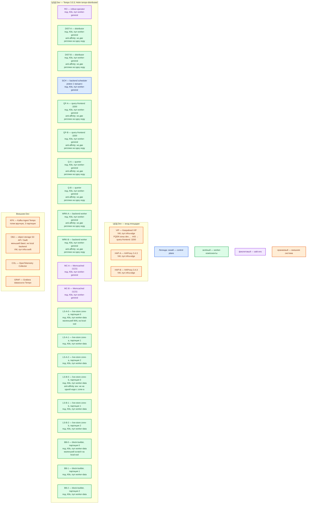

# Grafana Tempo 3.0.3 — развёртывание, контур Dev

Хранилище **трейсов**. Это **уменьшенный Prod**, не учебный Docker-монолит. Версия **3.0.3**, тот же Helm-чарт **`tempo-distributed`**, тот же образ `grafana/tempo:3.0.3`, те же роли, **object storage** и **Kafka ingest**. Не контейнер `-target=all`, не `backend: local`, не Docker Compose.

## Допущения

1. Один прикладной ЦОД. Kubernetes, пара HAProxy 3.4.3 + Keepalived + VIP, StorageClass с теми же именами (`local-ssd`, `shared-fs`), CoreDNS / `cluster.local`, зона `dev.…` — уже есть, меньше CPU/RAM/тома.
2. Способ установки и роль-модель **как в Prod**: Helm `grafana-community/tempo-distributed`, пинить чарт и `tempo.image.tag: "3.0.3"`. Не `docker run grafana/tempo:3.0.3 --target=all` из `Grafana Tempo.install.md` и не чарт-монолит `tempo`.
3. История — S3 API / Swift **этого** ЦОДа, не local filesystem чарта. Ingest — Kafka-топик контура Dev (отдельный или изолированный), не in-process запись distributor→live-store.
4. Кворум/HA не ломаем сменой класса системы: **2** зоны live-store, **ровно 1** scheduler, stateless **≥2** реплики на **≥2** нодах. Схема «один контейнер all» или «один live-store без зон» — другой класс отказа (нет zone-aware свежего окна; нет раздельных `-target`).
5. Нагрузка не боевая. Уменьшаем CPU/RAM/PVC, не число голосующих ролей и не вид инсталляции. Стартовые **3** Kafka-партиции оставляем, чтобы осталась та же привязка builder/live-store, что в Prod.
6. Grafana / Collector / Kafka / Swift — другое ПО. Учебные insecure OTLP и пароли из раздела «Учебный стенд» `.install.md` сюда **не** переносить как «почти бой».

## Схема инстансов

Потоков данных на схеме нет. Состав ролей совпадает с Prod; меньше ресурсы и диски.

ОС — свойство платформы, не пода. Один стандарт Linux на всех нодах контура.

| Имя пула | Роль | Зачем выделен |
|---|---|---|
| `infra-edge` | edge-VM | Та же пара HAProxy + VIP, что в Prod; меньше CPU/RAM у VM |
| `worker-general` | general | Stateless Tempo, scheduler ×1, Memcached, rollout-operator; пул ≥ 2 нод (лучше ≥ 3 под anti-affinity) |
| `worker-data` | data-localdisk | Маленькие live-store и block-builder на `local-ssd`; нод достаточно, чтобы зоны a/b не сели на один хост |
| `infra-swift` | vendor / object | Меньший бакет истории; не CSI-диск пода Tempo |

## Комментарии к схеме

### Чем Dev упрощает Prod (и чем не упрощает)

| Меняем | Не меняем |
|---|---|
| CPU/RAM/PVC меньше | Чарт `tempo-distributed`, тег образа **3.0.3** |
| Один ЦОД, один кластер | Микросервисы: distributor, live-store 2 зоны, block-builder, query-frontend, querier, scheduler ×1, worker |
| Меньший бакет и топик | Object storage + Kafka ingest, не `backend: local` и не монолит |
| Тома меньше, те же имена StorageClass | `local-ssd` RWO для WAL/scratch, не NFS, не Compose |

Так воспроизводятся ошибки вида инсталляции (накат чарта, memberlist, привязка партиций, zone-aware, «ровно один scheduler»), которые Docker `-target=all` **не** показывает.

### VIP, HAP-A/B — вход

- **Функционал.** Как в Prod: FQDN зоны `dev.…` на VIP, HAProxy на **:3200**. OTLP Collector → ClusterIP distributor.
- **Критично.** Не публиковать 3200/4317/4318/9095/7946 с VIP в интернет. Пара HAProxy остаётся парой. Kafka `:9092` сюда не публиковать.

### RO — rollout-operator

- **Функционал.** Тот же add-on, что в Prod: без него zone-aware live-store чарт не рендерит.
- **Критично.** Не выключать зоны «чтобы на Dev было проще» — тогда у партиции один владелец, и отказ одного пода live-store даёт другой класс дырки, чем Prod.

### DIST-A/B, QF-A/B, Q-A/B, WRK-A/B

- **Функционал.** Те же stateless-роли. На Dev минимум **2** реплики на **2** нодах — балансировка Service и отказ одной ноды.
- **Критично.** Не схлопывать query-frontend в 1: вендор для HA держит 2, Prod тоже 2. OTLP на `0.0.0.0`, gRPC в values включить. Порядок: distributor **0.5–1 vCPU / 0.5–1 ГБ**, query-frontend/querier **1 vCPU / 1–2 ГБ**, worker **0.25–0.5 vCPU / 0.5–1 ГБ**; **уточняется замером**. Это не цифры Size the cluster «на 10 MB/s», а ужатие ёмкости.

### SCH — backend scheduler

- **Функционал.** Тот же singleton: compaction/retention.
- **Критично.** Оставить **один**. Не ставить два «для HA на Dev» — вендор: only one scheduler. Не убирать: иначе Dev не покажет останов компакции при падении этого пода.

### LS-A-* / LS-B-* — маленькие live-store

- **Функционал.** Две зоны × 3 партиции = **6** маленьких подов, WAL на `local-ssd`.
- **Критично.** Не одна зона и не один под `-target=all`. В пуле `worker-data` реально разные ноды для zone-a и zone-b (`topologyKey: kubernetes.io/hostname`, если AZ-меток нет). PVC порядка **10–20 ГиБ** (вендор гигабайты WAL не нормирует). RAM порядка **1–2 ГиБ** на под; **уточняется замером**. `emptyDir` не использовать: рестарт без WAL ломает свежее окно иначе, чем в Prod.

### BB-0..2 — маленькие block-builder

- **Функционал.** Три ordinal'а = три партиции. Пишут в **бакет**, не в local backend.
- **Критично.** Не 1 builder на все партиции «чтобы сэкономить» без смены `partitions_per_instance` и числа партиций — это уже другая привязка, чем Prod. Scratch PVC порядка **10–20 ГиБ**.

### MC-A/B, KFK, OBJ

- **Функционал.** Два маленьких Memcached — тот же класс кэша. Kafka-топик на **3** партиции, созданный вручную. Бакет Swift Dev — тот же механизм S3, что Prod.
- **Критично.** Не подменять бакет директорией в поде. Не auto-create 1000 партиций на общем Dev-Kafka. Секреты не из учебного стенда и не в git.

### Чего этот Dev не доказывает

Отказ второго прикладного ЦОДа; stretch; нагрузка в MB/s; «хватит 14 дней retention на терабайты». Доказывает: накат того же чарта, memberlist, ack Kafka, zone-aware, один scheduler, RF1 в бакете.

## Путь роста

На Dev боевой рост не планируем. Если не хватает места — увеличить CPU/RAM/PVC **этих же** ролей, не переходить на монолит. Добавление партиций — только если сознательно копируем Prod-эксперимент (сначала топик, потом replicas live-store и block-builder).

## Сильные и слабые места

- **Сильная сторона.** Тот же чарт и те же `-target`, что Prod: можно поймать сбой наката, memberlist, партиций, zone-aware и единственного scheduler. Stateless ≥2.
- **Слабая сторона.** Малая ёмкость: OOM и заполнение WAL/scratch наступят раньше. Один Dev-ЦОД: падение зала = нет трейсов. Если нод мало, планировщик посадит обе зоны live-store на один хост — HA свежего окна станет бумажной.
- **Критичные условия.** Не `-target=all`. Не `backend: local`. Не 1 live-store-зона. Не 2 scheduler. Не `latest` / не образ 3.0.2. Не NFS как WAL. Не 3200/4317 в интернет. Не учебный `tls.insecure` как норма контура.

## Источники

Те же, что у Prod:

- Релиз 3.0.3: https://github.com/grafana/tempo/releases/tag/v3.0.3
- Микросервисы vs монолит: https://grafana.com/docs/tempo/latest/reference-tempo-architecture/deployment-modes/
- Plan (Kafka + object storage в микросервисах; local — monolithic/dev): https://grafana.com/docs/tempo/latest/set-up-for-tracing/setup-tempo/plan/
- Live-store zone-aware: https://grafana.com/docs/tempo/latest/reference-tempo-architecture/components/live-store/
- Object storage / local = test: https://grafana.com/docs/tempo/latest/reference-tempo-architecture/object-storage/
- Size the cluster: https://grafana.com/docs/tempo/latest/set-up-for-tracing/setup-tempo/plan/size/
- Auth нет: https://grafana.com/docs/tempo/latest/operations/authentication/
- Artifact Hub `tempo-distributed`: https://artifacthub.io/packages/helm/grafana-community/tempo-distributed
- Учебный Docker-монолит (именно **не** этот контур): https://grafana.com/docs/tempo/latest/set-up-for-tracing/setup-tempo/deploy/locally/linux/
- Карточка / install: `Out/Платформенная инфра/Grafana Tempo/Grafana Tempo.md`, `Grafana Tempo.install.md`

**В доке вендора нет:** порог RTT; готовая смета ядер под Dev; гигабайты WAL без профиля ingest.
