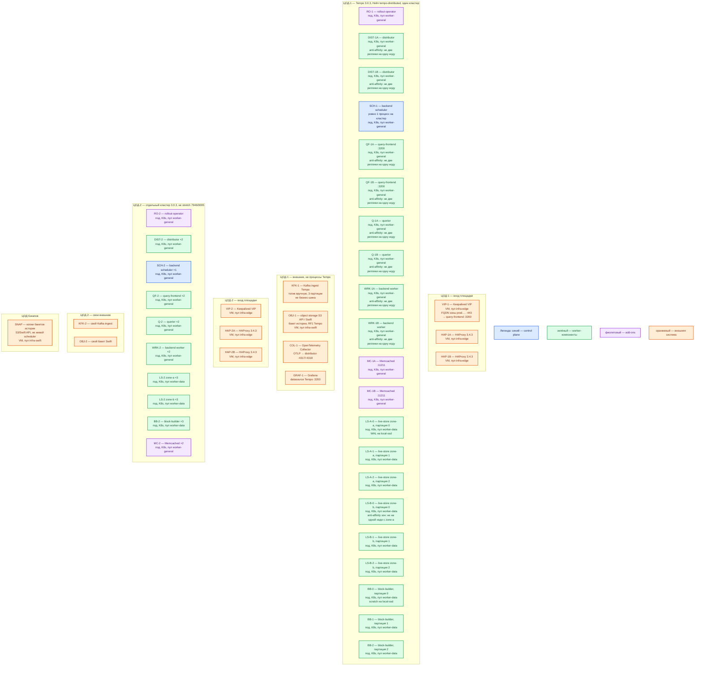

# Grafana Tempo 3.0.3 — развёртывание, контур Prod

Хранилище **трейсов** (цепочка вызовов одного запроса: API → Kafka → Camunda). Своего UI нет — смотрят в **Grafana**. Это **своя** установка **3.0.3**, образ `grafana/tempo:3.0.3`, не Grafana Cloud Traces и не Grafana Enterprise Traces. Линия 3.0: **ingester и compactor удалены**. Бой — **микросервисы** Helm-чарта `tempo-distributed` (пакет манифестов Kubernetes: каждый процесс Tempo со своим `-target`), не монолит `-target=all`.

**Helm** — программа, которая ставит готовый набор объектов Kubernetes из чарта. **Чарт** `tempo-distributed` — официальный путь микросервисов. После 30 января 2026 репозиторий чартов Grafana — `grafana-community/helm-charts`, не старый `grafana/helm-charts`.

## Допущения

1. Площадки: два прикладных ЦОДа + один ЦОД под бэкапы. RTT между залами **не измерен**. Живой memberlist Tempo (**7946/TCP+UDP**), внутренний gRPC (**9095**) и Kafka ingest **не** растягиваем на 2–3 ЦОДа: порога допустимой задержки у вендора нет.
2. На каждом прикладном ЦОДе уже есть Kubernetes 1.36.4, пара HAProxy 3.4.3 + Keepalived + VIP, StorageClass `local-ssd` (RWO) и `shared-fs` (RWX), CoreDNS / `cluster.local`, внешняя зона `prod.…`.
3. Один живой кластер Tempo = **один ЦОД**. ЦОД-2 — **второй** такой же кластер (свой Kafka ingest, свой бакет, свой единственный scheduler), не stretch одного ring.
4. Способ установки: Helm `grafana-community/tempo-distributed`. Образ **всегда** пинить `grafana/tempo:3.0.3` (`tempo.image.tag: "3.0.3"`), даже если `appVersion` чарта уже 3.0.3. На дату карточки Artifact Hub: чарт **3.5.1** → appVersion **3.0.3**; более старый **3.0.6** по умолчанию тянет **3.0.2** — его без переопределения тега не брать. Версию **чарта** тоже пинить, не `latest`.
5. Хранение истории — **object storage** с S3 API (на платформе — Swift этой площадки). Дефолт чарта `backend: local` и docker-MinIO — test/eval, **не** этот контур. Community MinIO: upstream archived.
6. Ingest-буфер — **Kafka-совместимый брокер**, отдельный кластер или жёстко изолированный топик, **не** бизнес-шина. Топик создаём **вручную**. `auto_create_topic_enabled` вендора по умолчанию `true`, `auto_create_topic_default_partitions: 1000` — на боевом брокере это меняет дефолт **всех** auto-create топиков; не включать.
7. Нагрузка не замерена. Ниже — минимальная отказоустойчивая топология и порядок величины ресурсов со страницы Size the cluster, не смета «хватит на терабайты». Стартовое число Kafka-партиций — **3** (пример чарта; ориентир вендора ≈ 10 MB/s на партицию — **уточняется замером**).
8. Grafana, OpenTelemetry Collector, Kafka, Swift — **другое ПО**. На схему — как внешние. Metrics-generator в день 1 **не** включаем (путь роста).
9. Встроенной аутентификации у Tempo **нет**. Край HTTP(S) — VIP HAProxy. OTLP **4317/4318** в интернет не публикуем: Collector → ClusterIP distributor.
10. Один тенант на контур; `multitenancy_enabled: true` даже для одного OrgID. Заголовок `X-Scope-OrgID` выставляет доверенный прокси/Collector, не клиент приложения.

## Схема инстансов

Имена — роли, не обязательные DNS. Потоков данных на схеме нет. ЦОД-2 — такой же состав, **другой** кластер. **Партиция** — единица параллелизма write path (Kafka-топик Tempo режется на N кусков; live-store и block-builder привязаны к ним). **Зона live-store** — два набора подов **внутри одного ЦОДа** (не два города): у каждой партиции по одному владельцу в зоне; чтение с кворумом **1**.

ОС — свойство платформы, не пода. Один стандарт Linux на всех нодах контура.

| Имя пула | Роль | Зачем выделен |
|---|---|---|
| `infra-edge` | edge-VM | Пара HAProxy + Keepalived + VIP: край HTTP(S) и ControlPlaneEndpoint Kubernetes. Не Kafka `:9092` |
| `worker-general` | general | Stateless-роли Tempo (distributor, query-frontend, querier, backend-worker), единственный scheduler, Memcached, rollout-operator |
| `worker-data` | data-localdisk | Live-store (WAL) и block-builder (scratch) на `local-ssd` RWO, не NFS |
| `infra-swift` | vendor / object | Бакет истории (S3 API). Свои диски Swift, не CSI Tempo |

## Комментарии к схеме

### VIP-1 / VIP-2, HAP-* — вход площадки

- **Функционал.** VIP — виртуальный IP Keepalived: одно имя `prod.…` для Grafana и API. HAProxy 3.4.3 — TLS-край. Вендор: встроенной аутентификации нет, нужен reverse proxy; HAProxy в списке. Клиенты чтения — FQDN VIP **:443 → query-frontend :3200**, не Pod IP. Collector внутри кластера ходит в Service distributor **4317/4318**, не через интернет-VIP.
- **Критично.** **3200 / 4317 / 4318 / 9095 / 7946** в интернет не публиковать. Kafka `:9092` через этот HAProxy не публикуем. `X-Scope-OrgID` выставляет прокси/Collector **сам**. Прямой Grafana → `:3200` — только доверенный контур.

### RO-1 / RO-2 — rollout-operator

- **Функционал.** Add-on чарта. Нужен для **zone-aware** live-store: чарт при включённых зонах ставит `OnDelete` и **отказывается рендериться** без rollout-operator. Он двигает зоны по очереди и держит `ZoneAwarePodDisruptionBudget`.
- **Критично.** Не выключать, пока `liveStore.zoneAwareReplication.enabled: true`. Если оператор уже есть в namespace — `rolloutOperatorManagedExternally: true`, не ставить второй. `global.clusterDomain` должен совпадать с доменом оператора (`cluster.local`).

### DIST-1A / DIST-1B — distributor

- **Функционал.** Точка приёма спанов. Протокол боя — **OTLP** (gRPC **4317**, HTTP **4318**). Пишет в Kafka; успех клиенту — только после **ack** брокера. Stateless, масштабируется репликами.
- **Критично.** Минимум **2** реплики, anti-affinity, Service. С Tempo **2.7** OTLP по умолчанию слушает **localhost** — в поде биндить `0.0.0.0`. В чарте gRPC OTLP по умолчанию **выключен** — явно `traces.otlp.grpc.enabled: true` (и HTTP). Не монолит: distributor **не** отдаёт данные live-store in-process. Образ **3.0.3**, не тег чарта 3.0.2. Порядок CPU/RAM: ориентир вендора **2 ядра / 2 ГБ на ~10 MB/s**; старт без замера — **2 реплики**, **уточняется замером**.

### SCH-1 — backend scheduler

- **Функционал.** Единственный координатор работ над историей: compaction (склейка мелких Parquet-блоков), retention (удаление старше срока), redaction. Work cache сбрасывает в object storage. HTTP `GET /status/backendscheduler`.
- **Критично.** **Ровно один** инстанс на кластер. Автовыбора второго нет. Второй scheduler «в другом ЦОДе» — второй кластер, не HA этого. Падение scheduler **не** останавливает ingest, но **встанавливает** компакцию и retention. Не путать с удалённым compactor 2.x. Порядок: **0.5 CPU / 1–2 ГБ** (Size the cluster). Дефолт хранения блоков: **`block_retention: 336h` (14 дней)**.

### QF-1A / QF-1B — query-frontend

- **Функционал.** HTTP API Tempo **:3200** (`/ready`, `/api/...`, `/metrics`). Режет запрос на jobs, собирает ответы. Grafana ходит сюда (через VIP).
- **Критично.** Вендор: **2 реплики для HA**; дальше масштабировать **CPU/RAM**, не плодить реплики. Anti-affinity. `/api/status/buildinfo` должен показать **3.0.3**. Порядок RAM: **4–20 ГБ**, зависит от запросов; **уточняется замером**.

### Q-1A / Q-1B — querier

- **Функционал.** Исполняет jobs: свежее — gRPC к live-store **:9095**, история — object storage, опционально Memcached **:11211**.
- **Критично.** Минимум **2** реплики. `:9095` только внутри кластера. Ориентир вендора: 1 реплика на ~1–2 MB/s ingest при «типичном» поиске; широкая TraceQL бьёт сильнее. Старт **2**, **уточняется замером**.

### WRK-1A / WRK-1B — backend worker

- **Функционал.** Stateless-исполнители jobs scheduler. Компакция, retention, redaction в бакете.
- **Критично.** Минимум **2** (отказ одного worker не снимает единственный scheduler). Порядок: **0.5 CPU / 1–2 ГБ**; точных правил сайзинга у вендора «to be determined».

### LS-A-* / LS-B-* — live-store (две зоны × 3 партиции)

- **Функционал.** Свежие трейсы: память + локальный **WAL** (write-ahead log) в Parquet. Читает Kafka. Пока block-builder не положил блок в бакет — поиск «только что принятого» идёт отсюда. В каждой зоне **ровно один** владелец партиции.
- **Критично.**
  - `liveStore.replicas` = число **Kafka-партиций** (здесь **3**), это размер **одной** зоны, не сумма. Две зоны → **6** подов. Меньше **2** зон чарт не принимает.
  - Без zone-aware у партиции один владелец: падение пода = дырка свежего окна до возврата (история в бакете может ещё искаться).
  - PVC — StorageClass **`local-ssd`**, RWO; **не** `shared-fs`, **не** NFS. `emptyDir` в бою не использовать.
  - Зоны — **внутри ЦОДа** (`topology.kubernetes.io/zone` или консервативно `kubernetes.io/hostname`). Это не ЦОД-2.
  - `live_store.fail_on_high_lag` с 3.0.2+ по умолчанию `true`: большой лаг Kafka → **ошибка**, не тихий неполный ответ.
  - Резкий scale-down без перевода партиции в inactive опасен. Чартовые `noDownscale` / `prepareDownscale` — по мере надобности.
  - StatefulSet: стабильные ordinal'ы. Имеет смысл `tempo.useHeadlessGoverningService: true` (иначе в части StatefulSet чарта short `serviceName` не резолвится; поле immutable — закладывать на **первом** install).
  - Порядок: **1 CPU / 4–20 ГБ**; диск WAL — зависит от окна свежих данных; **уточняется замером**.

### BB-0..2 — block-builder

- **Функционал.** Write-path истории: цикл чтения Kafka → Parquet на scratch → upload в object storage → commit offset. Обычно **1** инстанс на партицию. Статическая привязка (`partitions_per_instance` / ordinal StatefulSet).
- **Критично.** Число реплик = число партиций (**3**). Autoscaling «как HTTP Deployment» **ломает** привязку. Scratch — `local-ssd`, размер ≥ один цикл потребления. Если builder стоит, а retention Kafka истекла — **потеря истории** этой партиции. Ориентир: **0.5 CPU / 5–10 ГБ**.

### MC-1A / MC-1B — Memcached

- **Функционал.** Кэш bloom filters / страниц Parquet / frontend search. Не источник истины: потеря = медленнее поиск, трейсы остаются в live-store и бакете. Redis для кэша Tempo — experimental, не берём.
- **Критично.** Две реплики, не один под. **11211** наружу не публиковать. Отдельные пулы bloom/footer/search — путь роста, не день 1.

### KFK-1 / KFK-2 — Kafka ingest

- **Функционал.** Долговечный журнал приёма. Distributor шардирует по hash(Trace ID). Live-store, block-builder (и опционально metrics-generator) — независимые потребители.
- **Критично.** Не бизнес-топики. Создать топик вручную, **3** партиции на старт, `auto_create_topic_enabled: false`. RF/min.ISR — карточка Kafka; Tempo после ack работает **RF1** и брокер не страхует. Секреты SASL — Vault/Secret, не ConfigMap.

### OBJ-1 / OBJ-2 — object storage

- **Функционал.** Долгое хранилище блоков и служебного состояния backend. Tempo 3.0 пишет блок **один раз** (**RF1**). S3-совместимый API Swift этой площадки.
- **Критично.** Падение бакета = потеря **исторической** трассировки этой площадки. Ключи — Secret/Vault, не values в git. `backend: local` запрещён. Дефолт чарта (local для CI) перекрыть `storage.trace.backend: s3`.

### COL-1, GRAF-1

- **Функционал.** Collector: батч, сэмпл, срез ПДн, tenant-заголовок, OTLP в distributor. Grafana: UI, URL источника — FQDN VIP (с хоста) или `http://<release>-query-frontend.<ns>.svc.cluster.local:3200` (из кластера), **без** хвоста `/tempo`.
- **Критично.** `tls.insecure` только стенд из `.install.md`, не этот контур. Тела SOAP/карточки клиента в атрибуты спана не класть. Tempo сам не сэмплирует.

### ЦОД-2 и ЦОД бэкапов

- **Функционал.** ЦОД-2 — независимый Tempo той же роль-модели. Бэкап-ЦОД хранит **копии бакетов** (Swift API / снимки объектов), не член memberlist и не второй scheduler живого кластера.
- **Критично.** Не открывать **7946 / 9095 / 4317** «как один кластер» между залами. Tempo историю сам на три ЦОДа не копирует.

### Чего на схеме нет специально

- Монолит `-target=all`, чарт `tempo` (single binary), Docker Compose, `backend: local`.
- Несколько монолитов как кластер (из документации 3.0.3 **убрали**).
- Tempo Operator / `TempoStack` (официальный альтернативный путь; здесь выбран Helm, как в задании).
- Metrics-generator и Prometheus remote_write.
- Gateway-под чарта (край — платформенный HAProxy).
- Ingester / compactor 2.x.

## Путь роста

Не включать сразу. Когда замер даст MB/s и профиль TraceQL:

1. Сначала **добавить партиции Kafka**, затем поднять `liveStore.replicas` и `blockBuilder.replicas` (они равны числу партиций). Не наоборот.
2. Добавить **querier** под широкие TraceQL; query-frontend — вертикально (вендор: держать **2** реплики).
3. Добавить **distributor** (~1 реплика / 10 MB/s).
4. Добавить **backend-worker** при росте `tempodb_compaction_outstanding_blocks`.
5. Выделенные Memcached на роль (bloom / footer / search).
6. Metrics-generator + remote_write — отдельное решение.
7. Межплощадочно: свой Tempo во втором ЦОДе или OTLP в Collector первой площадки — выбрать явно, не stretch ring.

## Сильные и слабые места

- **Сильная сторона.** Официальный микросервисный режим и тот же чарт, что на Dev. Отказ одного distributor/querier/worker переживается репликой. Zone-aware live-store переживает отказ **одной** зоны свежего окна (кворум чтения 1). После ack Kafka ingest жив, даже если все поды Tempo рестартнулись (пока retention топика держит).
- **Слабая сторона.** Падение прикладного ЦОДа останавливает **этот** кластер. RF1: вторую копию истории Tempo не делает. Один scheduler — SPOF компакции. Ёмкость без замера неизвестна. Чартовый дефолт storage = local, его легко забыть перекрыть.
- **Критичные условия.** Не `-target=all` и не `backend: local` в бою. Не stretch 7946/9095. Не `latest`, не образ **3.0.2**. Не auto-create на 1000 партиций. Не NFS/`shared-fs` как WAL/scratch. Не второй scheduler. Не публиковать 3200/4317 в интернет. Секреты S3/Kafka не в git. ПДн в спанах — allowlist. Прогнать отказ **бакета**, не только подов.

## Источники

- Релиз v3.0.3 (13 Aug 2026), CVE через Go 1.26.5 / gRPC / `x/net` / `x/text` / OTel; убраны несколько монолитов как кластер: https://github.com/grafana/tempo/releases/tag/v3.0.3
- Архитектура 3.0 (RF1, scheduler/worker, ingester/compactor удалены): https://grafana.com/docs/tempo/latest/release-notes/v3-0/
- Планирование; Kafka обязателен в микросервисах; object storage обязателен в микросервисах; local — monolithic/dev: https://grafana.com/docs/tempo/latest/set-up-for-tracing/setup-tempo/plan/
- Режимы: микросервисы = бой; монолит `-target=all` без Kafka; SSB убран в 3.0; query-frontend держать 2 реплики: https://grafana.com/docs/tempo/latest/reference-tempo-architecture/deployment-modes/
- Live-store, zone-aware, quorum 1: https://grafana.com/docs/tempo/latest/reference-tempo-architecture/components/live-store/
- Block-builder, 1 инстанс на партицию: https://grafana.com/docs/tempo/latest/reference-tempo-architecture/components/block-builder/
- Scheduler singleton, worker горизонтально: https://grafana.com/docs/tempo/latest/reference-tempo-architecture/components/compaction/
- «Only one scheduler»: https://grafana.com/docs/tempo/latest/configuration/
- Object storage; local — development/testing; S3/GCS/Azure: https://grafana.com/docs/tempo/latest/reference-tempo-architecture/object-storage/
- Size the cluster (цифры живут от релиза к релизу): https://grafana.com/docs/tempo/latest/set-up-for-tracing/setup-tempo/plan/size/
- Auth отсутствует; `X-Scope-OrgID` выставляет прокси; HAProxy в списке: https://grafana.com/docs/tempo/latest/operations/authentication/
- Манифест (`block_retention: 336h`, auto-create 1000 партиций, порты): https://grafana.com/docs/tempo/latest/configuration/manifest/
- Kafka topic: вручную vs auto-create (warning про broker-wide `num.partitions`); ≈10 MB/s на партицию: https://grafana.com/docs/tempo/latest/set-up-for-tracing/setup-tempo/migrate-to-3/
- Helm на Kubernetes; два чарта (`tempo-distributed` vs монолит `tempo`): https://grafana.com/docs/tempo/latest/set-up-for-tracing/setup-tempo/deploy/kubernetes/
- Artifact Hub `tempo-distributed` 3.5.1 → appVersion **3.0.3**, K8s `^1.25`; дефолт storage local не production; S3+Kafka example; zone-aware ≥2 зон; `useHeadlessGoverningService`: https://artifacthub.io/packages/helm/grafana-community/tempo-distributed
- Репозиторий чартов: https://grafana-community.github.io/helm-charts
- Grafana datasource Tempo, порт 3200, без `/tempo` на self-hosted: https://grafana.com/docs/grafana/latest/datasources/tempo/configure-tempo-data-source/
- Карточка и учебный монолит (**не** копировать в бой): `Out/Платформенная инфра/Grafana Tempo/Grafana Tempo.md`, `Grafana Tempo.install.md`

**В доке вендора нет (не выдумано):** порог RTT memberlist/Kafka/S3 между ЦОДами; «хватит N партиций / ядер под терабайты»; гигабайты PVC WAL под ваш ingest без замера.
