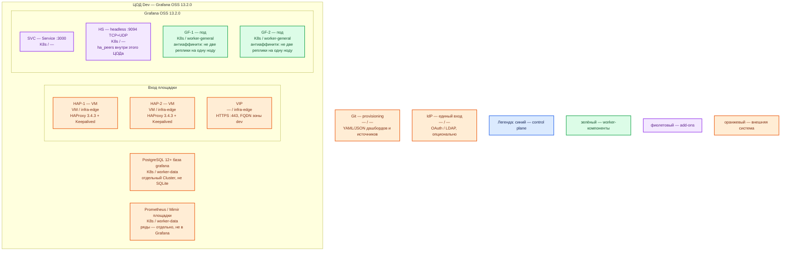

# Grafana OSS 13.2.0 — Dev

Веб-приложение: рисует дашборды и считает unified alerting. Само **ряды не хранит**. Тот же механизм, что Prod: Helm **`grafana-community/grafana` 12.11.2**, образ **`grafana/grafana:13.2.0`**, реплики + внешняя PostgreSQL. Dev уменьшает CPU/RAM/диск, не меняет вид инсталляции. Лицензия OSS — **AGPLv3**.

## Допущения

- Контур: **1 ЦОД**. Stretch между залами нет.
- Живая PostgreSQL **12+** (отдельная база `grafana`, HA базы — тот же класс, что Prod: оператор CNPG, не один контейнер SQLite). Grafana смотрит только на **её** 5432.
- Паритет с Prod: тот же Helm, та же роль-модель (две реплики UI, Service :3000, headless :9094, край HAProxy+VIP), не quickstart `docker run` на одной VM и не Docker Compose. Учебный стенд из `.install.md` этот контур **не** описывает.
- Stateless: **минимум 2 реплики на 2 нодах** `worker-general`, антиаффинити. Одна реплика на Dev запрещена правилом паритета (иначе не воспроизвести отказ ноды, балансировку и gossip).
- На ЦОДе: пара HAProxy **3.4.3** + Keepalived + VIP (меньше CPU/RAM, чем Prod); те же имена StorageClass `local-ssd` / `shared-fs` (подам Grafana PVC не нужны); DNS внутри `cluster.local`, снаружи зона `dev.…`.
- Нагрузка не замерена. Ёмкость — меньше Prod, порядок величины, уточняется замером.
- Источник метрик (Prometheus) в этом же ЦОДе. Grafana **не ходит** в ведомства.
- SSO опционален; на Dev достаточно локального входа, но не заводских `admin`/`admin` в git. Image Renderer и Redis на старте не обязательны.

## Схема инстансов

Имена — роли, не обязательные DNS. Потоков и стрелок нет. Пул нод — класс машин для планировщика, не «под на ноде 3».

ОС — свойство платформы, не пода. Один стандарт Linux на всех нодах контура.

Исключение вендора: Windows как сервер Grafana в схеме с Kubernetes не ставим. Вендор Windows поддерживает как ОС пакетной установки, не как ноду этого кластера.

| Пул | Роль | Зачем выделен |
|---|---|---|
| `infra-edge` | edge-VM | Та же пара HAProxy + Keepalived + VIP, что на Prod; меньше CPU/RAM |
| `worker-general` | general | Поды Grafana; две ноды, чтобы антиаффинити было куда сработать |
| `worker-data` | data-localdisk | PostgreSQL базы `grafana` и Prometheus (чужие на этой схеме); тома меньше Prod, те же имена StorageClass |

У Grafana **нет** своей голосующей роли: синий control plane продукта на схеме не рисуется, только легенда. Helm — инсталлятор, не runtime-под.

## Комментарии к схеме

### HAP-1, HAP-2, VIP — вход площадки

- **Функционал.** Та же роль-модель, что Prod: пара VM, Keepalived, VIP. Снаружи FQDN зоны `dev.…` на **443**. VIP также ControlPlaneEndpoint (`:6443`, TCP passthrough).
- **Критично.** Не публиковать **3000** на `0.0.0.0` «потому что стенд». Не заменять пару одним HAProxy: иначе не воспроизвести отказ края. `root_url` = URL за VIP ([HA](https://grafana.com/docs/grafana/latest/setup-grafana/set-up-for-high-availability/)). Клиенты по FQDN, не по Pod IP.

### SVC — Service :3000

- **Функционал.** Имя в `cluster.local` перед двумя подами.
- **Критично.** Нужен, чтобы балансировка была того же типа, что на Prod. Один опубликованный порт контейнера Docker эту роль не выполняет. Проба `/api/health`.

### HS — headless Service :9094

- **Функционал.** Тот же gossip встроенных Alertmanager, что Prod: **9094/TCP+UDP**, `ha_peers` на headless DNS.
- **Критично.** Дефолт чарта `headlessService: false` не оставлять. Без 9094 на Dev не поймаете дубли писем, которые взорвутся на Prod. Redis на Dev «вместо gossip» не ставить, если Prod идёт через Memberlist.

### GF-1, GF-2 — реплики Grafana

- **Функционал.** Два одинаковых процесса **OSS 13.2.0**. Состояние в Postgres, не в файле пода. Ставит тот же чарт **12.11.2**, образ `grafana/grafana:13.2.0`.
- **Критично.**
  - Минимум **2** реплики, **2** ноды, антиаффинити. Сокращать до одного пода нельзя: это уже не уменьшенный Prod, а другой класс (нет балансировки, отказа ноды и проверки `ha_peers`). Дефолт чарта `replicas: 1` — не «норма Dev».
  - Не `docker run grafana/grafana:13.2.0` «для отладки рядом»: это другой вид инсталляции (SQLite, нет gossip). Ошибка выката Helm на Prod так не воспроизведётся.
  - PostgreSQL, не SQLite. `persistence.enabled: false`. PVC / `shared-fs` подам UI не заказывать.
  - Свой `secret_key` контура Dev **до** источников; не копировать завод `SW2YcwTIb9zpOOhoPsMm` и не шарить ключ Prod. `admin`/`admin` из учебного стенда — только закрытый Docker-стенд, не этот Dev.
  - Выкат RollingUpdate + PDB `minAvailable: 1`. Каждый под по-прежнему считает все правила — на Dev это как раз нужно увидеть (нагрузка на учебный Prometheus × 2).
  - Ёмкость меньше Prod: не ниже минимума вендора 1 ядро / 512 МиБ; удобный потолок — тир Small (2 ядра / 2–4 ГиБ) на процесс ([установка](https://grafana.com/docs/grafana/latest/setup-grafana/installation/)). Ориентир sample (2 CPU / 2–4 ГиБ / 10–20 ГБ SSD) — про учебную **VM с Docker**, не про requests пода. Диск БД — меньше тома Postgres, не PVC Grafana. Точные millicpu/MiB — замер. `resources: {}` чарта не копировать.
  - Закрытый контур: reporting / updates / Gravatar / внешние snapshots — выкл, как на Prod. Иначе «на Dev сойдёт» не поймает утечку наружу.
  - AGPLv3 действует и на Dev: тот же бинарь OSS.

### PostgreSQL 12+ база grafana

- **Функционал.** Единственная БД состояния этого Grafana.
- **Критично.** Не встроенная SQLite «на время». Не один под Postgres: HA базы — кворумный продукт, его не схлопывают до «файла в volume Grafana». Не общая БД с карточками даже на Dev. **5432 на VIP не публикуем.**

### Prometheus / Mimir площадки

- **Функционал.** Единственный источник рядов для этого UI.
- **Критично.** UI без живого источника бесполезен. Не поднимать второй Prometheus «под Grafana». Приложения в Grafana не встраиваются как библиотека.

### Git — provisioning

- **Функционал.** Тот же класс доставки дашбордов, что Prod.
- **Критично.** Без provisioning клики в UI умрут вместе с БД. Секреты в git не класть.

### IdP

- **Функционал.** Опционально. Если включают — тот же тип, что планируют на Prod, иначе ошибка входа на Prod не воспроизведётся.
- **Критично.** Секрет в Secret; redirect — FQDN VIP зоны `dev.…`.

## Путь роста (не включать сразу)

Тот же, что Prod, в одном ЦОДе: больше людей → ещё реплики UI; тяжелее алерты → источник, не пятый Grafana; терабайты → Prometheus/Mimir. HPA только после профиля. Не «добавить Compose рядом». Не включать preview `ha_single_node_evaluation` «чтобы Dev был легче» — на Prod его нет.

## Сильные и слабые места

**Сильные.** Тот же Helm и те же 2 реплики на 2 нодах, что Prod: можно поймать ошибку выката, `ha_peers`, `secret_key` и отказа ноды. Падение UI не уничтожает ряды в Prometheus.

**Слабые.** Один ЦОД: падение зала = нет и UI, и БД Grafana. Меньше CPU/RAM — раньше упрётесь в оценку алертов × 2, чем на Prod; это не доказывает смету боя.

**Критичные условия**

- Не один Docker и не Compose вместо Helm.
- Не одна реплика «на время» и не SQLite.
- OSS **13.2.0**, чарт **12.11.2**; не `latest`.
- Не публиковать **3000** в интернет; не уносить `admin`/`admin` и дефолтный `secret_key`.
- Не stretch (на Dev и некуда); `ha_peers` только внутри этого ЦОДа.
- AGPLv3 — тот же вопрос юротдела, что Prod.

## Источники

- Релиз Grafana **13.2.0**: https://github.com/grafana/grafana/releases/tag/v13.2.0
- Лицензия AGPLv3: https://github.com/grafana/grafana/blob/v13.2.0/LICENSE
- Установка, SQLite vs PostgreSQL 12+, тиры: https://grafana.com/docs/grafana/latest/setup-grafana/installation/
- Docker-quickstart (не этот контур): https://grafana.com/docs/grafana/latest/setup-grafana/installation/docker/
- HA, общая Postgres: https://grafana.com/docs/grafana/latest/setup-grafana/set-up-for-high-availability/
- Alerting HA, 9094 TCP+UDP: https://grafana.com/docs/grafana/latest/alerting/set-up/configure-high-availability/
- Helm **12.11.2**: https://github.com/grafana-community/helm-charts/releases/tag/grafana-12.11.2
- values чарта: https://github.com/grafana-community/helm-charts/blob/grafana-12.11.2/charts/grafana/values.yaml
- `defaults.ini` 13.2.0: https://raw.githubusercontent.com/grafana/grafana/v13.2.0/conf/defaults.ini
- Шифрование БД / `secret_key`: https://grafana.com/docs/grafana/latest/setup-grafana/configure-security/configure-database-encryption/
- Provisioning: https://grafana.com/docs/grafana/latest/administration/provisioning/
- Карточка: `Out/Платформенная инфра/Grafana/Grafana.md`
- Установка: `Out/Платформенная инфра/Grafana/Grafana.install.md`
- Sample: `sample/Grafana.md`
- Prod этого контура: `sample2/Grafana.prod.md`

**В доке вендора нет:** порог RTT; формула «N зрителей = M реплик»; готовая смета Dev в millicore; разрешение SQLite при `replicas ≥ 2`.
