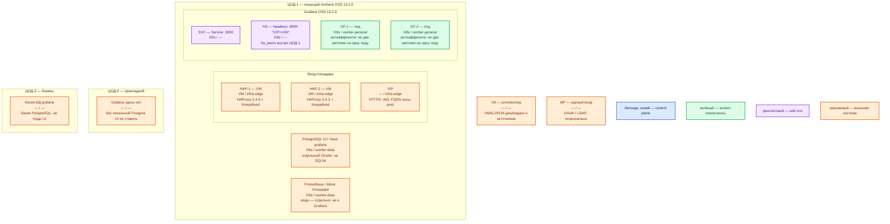

# Grafana OSS 13.2.0 — Prod

Веб-приложение: рисует дашборды и считает unified alerting. Само **ряды не хранит** — спрашивает Prometheus (и другие источники). UI/API — **3000/TCP**. Лицензия OSS — **AGPLv3**; это юридическое решение, не параметр Helm. Не Grafana Cloud и не Grafana Enterprise.

## Допущения

- Контур: 2 прикладных ЦОДа + 1 ЦОД под бэкапы. Stretch одной PostgreSQL и gossip `ha_peers` между ЦОДами **нет**: порога RTT у Grafana нет.
- Пишущая установка Grafana — в **ЦОД-1**: Helm-релиз + общая БД `grafana` + `ha_peers` только внутри этой площадки. ЦОД-2: отдельного UI «для HA» без своей Postgres **нет**. ЦОД-3: копии БД Grafana, не поды UI.
- Механизм: Helm-чарт **`grafana-community/grafana` 12.11.2** (`appVersion` **13.2.0**), образ **`grafana/grafana:13.2.0`**. Grafana Operator — другой инсталлятор, не этот файл. Не Docker Compose и не один контейнер на VM.
- Kubernetes площадки уже есть (vanilla 1.36.4). На каждом прикладном ЦОДе: пара HAProxy **3.4.3** + Keepalived + VIP (ControlPlaneEndpoint `:6443` и край HTTP(S)); StorageClass `local-ssd` (RWO) и `shared-fs` (RWX, только по исключению); DNS внутри `cluster.local`, снаружи зона `prod.…`.
- Общая БД — **PostgreSQL 12+**, отдельная база `grafana` (не та же, что карточки / Camunda). HA этой БД — отдельный продукт (оператор CNPG), не SQLite и не `postgres:latest` рядом с подом Grafana.
- Нагрузка (зрители, refresh, число правил алертов) **не замерена**. Ниже — минимальная отказоустойчивая топология, не тир Large вендора и не «все ручки масштабирования».
- Источник метрик (Prometheus / Mimir) будет на площадке. Этот файл его не проектирует. Grafana **не ходит** в ведомства.
- SSO (OAuth / LDAP) **опционален** на схеме; локальный `admin` в бою — break-glass (аварийный вход), не ежедневный. Image Renderer и Redis на старте **не** обязательны.
- Закрытый контур: reporting, проверки обновлений, Gravatar, внешние snapshots — выключить. Плагины — из своего registry. Unsigned plugins нет.

## Схема инстансов

Имена — роли, не обязательные DNS. Потоков и стрелок нет. Пул нод — класс машин для планировщика, не «под на ноде 3».

ОС — свойство платформы, не пода. Один стандарт Linux на всех нодах контура.

Исключение вендора: Windows как сервер Grafana в схеме с Kubernetes не ставим. Вендор Windows поддерживает как ОС пакетной установки, не как ноду этого кластера.

| Пул | Роль | Зачем выделен |
|---|---|---|
| `infra-edge` | edge-VM | Пара HAProxy + Keepalived + VIP: край HTTP(S) и ControlPlaneEndpoint Kubernetes |
| `worker-general` | general | Поды Grafana; локальный диск под состояние UI не нужен |
| `worker-data` | data-localdisk | PostgreSQL базы `grafana` и Prometheus (чужие на этой схеме): тома на `local-ssd`, не NFS |

У Grafana **нет** своей голосующей роли (это не Raft): синий control plane продукта на схеме не рисуется, только легенда. Helm — инсталлятор, не runtime-под.

## Комментарии к схеме

### HAP-1, HAP-2, VIP — вход площадки

- **Функционал.** Пара VM с HAProxy **3.4.3** и Keepalived держит VIP. Снаружи одно имя зоны `prod.…` на **443/TCP**. VIP также ControlPlaneEndpoint Kubernetes (`:6443`, TCP passthrough). Kafka `:9092` через этот HAProxy не публикуем.
- **Критично.** **3000** в интернет не публиковать: снаружи только HTTPS на VIP. TLS заканчивается на краю. `root_url` = публичный URL за прокси ([HA](https://grafana.com/docs/grafana/latest/setup-grafana/set-up-for-high-availability/)). Клиенты — по FQDN, не по Pod IP. Sticky session **не** обязательна: сессии в общей БД (страница HA). Страница sizing для тиров Medium/Large упоминает sticky или Redis session store — на старте не включать Redis «на всякий случай».

### SVC — Service :3000

- **Функционал.** Стабильное имя внутри `cluster.local` перед подами Grafana. Это не процесс Grafana.
- **Критично.** Порт **3000/TCP** (UI, API, `/api/health`, `/metrics`, WebSocket Live). Наружу — через VIP, не NodePort в мир. Проба `/api/health` = процесс и его БД, не «Prometheus зелёный» ([Health API](https://grafana.com/docs/grafana/latest/developer-resources/api-reference/http-api/api-legacy/other/)). `/metrics` без basic auth в бою не оставлять.

### HS — headless Service :9094

- **Функционал.** Headless Service (без cluster IP: DNS отдаёт IP подов). Нужен `ha_peers`: встроенные Alertmanager сплетничают, чтобы не слать одно письмо N раз. Порты **9094/TCP и 9094/UDP** — оба ([Alerting HA](https://grafana.com/docs/grafana/latest/alerting/set-up/configure-high-availability/)).
- **Критично.** Дефолт чарта `headlessService: false` — в бою включить. `ha_peers` — DNS этого сервиса **внутри ЦОД-1**, не адреса ЦОД-2. Без 9094 UI может быть «HA», письма **дублируются**. Redis вместо Memberlist — только если TCP/UDP между подами закрыт; на старте не брать.

### GF-1, GF-2 — реплики Grafana

- **Функционал.** Два одинаковых процесса **OSS 13.2.0**: UI/API, запросы к источникам, оценка правил алертинга, встроенный Alertmanager. Выборов лидера нет: жив хотя бы один под **и** жива Postgres — UI есть. Ставит Helm-чарт **`grafana-community/grafana` 12.11.2**, образ `grafana/grafana:13.2.0`, не `grafana/grafana-enterprise` и не `latest`. Тег чарта пустой → `appVersion` 13.2.0 ([релиз чарта](https://github.com/grafana-community/helm-charts/releases/tag/grafana-12.11.2)).
- **Критично.**
  - **2 реплики** (дефолт чарта `replicas: 1` в бой не копировать). Антиаффинити: не две на одну ноду `worker-general`. Отказ одной ноды не глушит UI, пока живы VIP, Service и Postgres.
  - Общая PostgreSQL, не SQLite. `persistence.enabled` чарта оставить **false**: PVC/RWO на несколько реплик не даёт общей БД; `shared-fs` под Grafana **не** исключение. NFS как диск состояния Grafana не используем.
  - Свой `secret_key` **до** заведения источников. Дефолт `SW2YcwTIb9zpOOhoPsMm` известен всем ([defaults.ini 13.2.0](https://raw.githubusercontent.com/grafana/grafana/v13.2.0/conf/defaults.ini)). Пароли БД и ключ — Vault, не git.
  - Не `admin`/`admin`. Admin Grafana = ключ к паролям источников в БД. SSO + break-glass.
  - По умолчанию **каждый** под считает **все** правила → нагрузка на Prometheus × N. `ha_single_node_evaluation` — public preview, в первый бой не включать.
  - Выкат: RollingUpdate (дефолт чарта) + PodDisruptionBudget, чтобы не обнулить обе реплики. `autoscaling` чарта на старте выключен — не включать без замера.
  - Ёмкость: минимум вендора 1 ядро / 512 МиБ «чтобы процесс поднялся»; Small — 2 ядра / 2–4 ГиБ / 1 инстанс; Medium — 4–8 / 8–16 ГиБ и **2** инстанса ([установка](https://grafana.com/docs/grafana/latest/setup-grafana/installation/)). Это ориентир на **процесс Grafana**, не на Prometheus и не смета. Нагрузка не замерена — порядок величины **Small…низ Medium** на под, **уточняется замером**. Дефолт чарта `resources: {}` в бой не копировать как «норму». Диск 10–20 ГБ SSD — у **хоста БД**, не PVC пода Grafana. Формулы «хватит для терабайтов» у вендора нет: терабайты рядов — у Prometheus/Mimir.
  - Закрытый контур: `reporting_enabled`, `check_for_updates`, Gravatar, `snapshots.external_enabled` — выкл. `cookie_secure` согласовать с HTTPS. `data_source_proxy_whitelist` — Grafana с сервера ходит во внутреннюю сеть (SSRF).
  - Лицензия **AGPLv3**. Если юротдел запрещает AGPL — не патчить бинарь, решать Enterprise / коммерческую лицензию отдельно.

### PostgreSQL 12+ база grafana

- **Функционал.** Обязательная чужая зависимость HA: пользователи, дашборды, источники, состояние алертинга. Ряды метрик здесь не живут. Вендор: сначала сделайте Postgres высокодоступным, это **вне** гайда Grafana ([HA](https://grafana.com/docs/grafana/latest/setup-grafana/set-up-for-high-availability/)).
- **Критично.** SQLite в бою запрещён. Отдельный Cluster (на платформе — CNPG), не общая БД с карточками. Клиенты Grafana → FQDN сервиса Postgres (`cluster.local`), не Pod IP, **5432 на VIP HAProxy не публикуем**. Падение Postgres = нет логина, даже если поды Grafana зелёные. Три реплики Grafana без HA БД — нарисованная отказоустойчивость.

### Prometheus / Mimir площадки

- **Функционал.** Источник рядов. Без живого источника дашборд — пустая рамка.
- **Критично.** Grafana не владеет TSDB. Падение Prometheus = пустые панели и failed evaluation алертов. Добавлять реплики Grafana «для надёжности UI» умножает запросы алертов к источнику.

### ЦОД-2 — Grafana нет

- **Функционал.** Прикладной зал без локальной БД `grafana` **этой** установки.
- **Критично.** Реплики Grafana сюда «для HA» не ставить: получится либо stretch `ha_peers`/Postgres (запрещено), либо второй writer в ту же БД, либо вторая правда дашбордов. Люди ходят на FQDN ЦОД-1. Свой экземпляр с тем же git — путь роста/DR, не старт.

### ЦОД-3 — копии БД

- **Функционал.** Бэкап PostgreSQL базы `grafana` (снимки/WAL по процедуре Postgres), чтобы падение ЦОД-1 не убило единственную копию дашбордов.
- **Критично.** Это не поды Grafana и не CSI-том UI. Клики только в UI без git = единственная копия в БД.

### Git — provisioning

- **Функционал.** YAML/JSON источников, дашбордов и правил при старте пода ([provisioning](https://grafana.com/docs/grafana/latest/administration/provisioning/)).
- **Критично.** В git — без секретов. Пароли источников — в БД Grafana (шифр `secret_key`) / Vault. Без git два зала = две правды.

### IdP

- **Функционал.** Опциональный единый вход (Generic OAuth / LDAP).
- **Критично.** Client secret — в Secret. Redirect — FQDN VIP, не Pod IP. Локальный admin оставить аварийным.

## Путь роста (не включать сразу)

1. Больше зрителей / refresh → ещё реплики Grafana **в ЦОД-1** на `worker-general` (та же Postgres, тот же `ha_peers`). Помнить: N реплик = N одинаковых запросов алертов в Prometheus.
2. Много правил / interval короче 1 мин → нагрузка на **источник** и CPU Grafana; вынос оценки на отдельные инстансы, не «replicas: 5 на том же Prometheus». Preview `ha_single_node_evaluation` — не GA.
3. Терабайты рядов → масштаб Prometheus/Mimir/Loki, не `replicas` Grafana. БД Grafana остаётся маленькой.
4. DR UI: независимый Grafana в ЦОД-2 + **своя** Postgres + тот же git, **без** `ha_peers` через город.
5. Image Renderer (отдельный Chromium, ~1 ГиБ на worker) и Redis (Live HA или запасной alerting HA) — по факту потребности, не со старта.
6. HPA чарта — только после профиля нагрузки.

## Сильные и слабые места

**Сильные.** Официальный Helm сообщества под OSS 13.2.0; active-active без sticky; отказ одного пода/одной ноды не роняет UI при живой Postgres; ряды переживают падение Grafana.

**Слабые.** Падение ЦОД-1 вместе с Postgres оставляет UI мёртвым, даже если в ЦОД-2 есть машины. Нет кворума Grafana: «2 из 3 подов» ничего не выбирают. Нагрузка не замерена. Компрометация Admin / дефолтного `secret_key` = пароли всех источников.

**Критичные условия**

- OSS **13.2.0**, чарт **12.11.2**; не `latest`; не учебный Docker+SQLite.
- Не меньше **двух** реплик на **двух** нодах; не SQLite; `ha_peers` + 9094 TCP+UDP в том же ЦОДе.
- Не stretch Postgres / gossip на 2–3 ЦОДа.
- Не публиковать **3000** в интернет; не `admin`/`admin`; не дефолтный `secret_key`.
- AGPLv3 — закрыть с юротделом, не «поправить лицензию в values».
- Grafana не замена Prometheus, Superset/Luxms и не SIEM.

## Источники

- Релиз Grafana **13.2.0** (18 августа 2026): https://github.com/grafana/grafana/releases/tag/v13.2.0
- Лицензия AGPLv3: https://github.com/grafana/grafana/blob/v13.2.0/LICENSE
- Установка, SQLite vs PostgreSQL 12+ / MySQL 8.0+, тиры Small/Medium/Large, минимум 512 МиБ / 1 ядро: https://grafana.com/docs/grafana/latest/setup-grafana/installation/
- HA: общая MySQL/Postgres, active-active, sticky не обязателен: https://grafana.com/docs/grafana/latest/setup-grafana/set-up-for-high-availability/
- Alerting HA, 9094 TCP+UDP, Memberlist vs Redis, Kubernetes headless, preview single-node evaluation: https://grafana.com/docs/grafana/latest/alerting/set-up/configure-high-availability/
- Helm **12.11.2**, `appVersion` 13.2.0: https://github.com/grafana-community/helm-charts/releases/tag/grafana-12.11.2
- values чарта (replicas 1, headlessService false, persistence false, resources {}): https://github.com/grafana-community/helm-charts/blob/grafana-12.11.2/charts/grafana/values.yaml
- Artifact Hub: Kubernetes `^1.25.0-0`: https://artifacthub.io/packages/helm/grafana-community/grafana/12.11.2
- `defaults.ini` 13.2.0 (`admin`/`admin`, `secret_key`, порт 3000): https://raw.githubusercontent.com/grafana/grafana/v13.2.0/conf/defaults.ini
- Шифрование БД / `secret_key`: https://grafana.com/docs/grafana/latest/setup-grafana/configure-security/configure-database-encryption/
- Provisioning YAML/JSON: https://grafana.com/docs/grafana/latest/administration/provisioning/
- `GET /api/health`: https://grafana.com/docs/grafana/latest/developer-resources/api-reference/http-api/api-legacy/other/
- Live HA (Redis, не этот старт): https://grafana.com/docs/grafana/latest/setup-grafana/set-up-grafana-live/
- Карточка платформы: `Out/Платформенная инфра/Grafana/Grafana.md`
- Установка (учебный Docker vs бой): `Out/Платформенная инфра/Grafana/Grafana.install.md`
- Состав из sample: `sample/Grafana.md`

**В доке вендора нет (здесь не выдумано):** порог RTT между залами; «хватит N ядер под вашу нагрузку»; готовая смета «хватит для терабайтов»; NFS как диск Grafana; требование Redis на старте при рабочей общей Postgres и открытом 9094.
