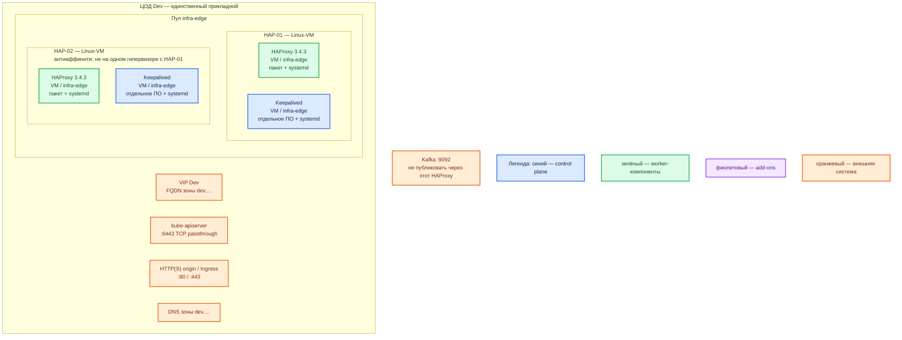

# HAProxy Community 3.4.3 — Dev

Упрощение Prod: **тот же** вид инсталляции и та же роль-модель. Уменьшаем CPU/RAM/диск, не меняем схему «пакет + systemd на двух Linux-VM». Не один контейнер, не Docker Compose, не quickstart с Docker Hub как «дев вместо боя».

Балансировщик TCP/HTTP на входе единственного Dev-ЦОДа. **Frontend** — точка приёма. **Backend** — ферма и **health check**. Пин: community **3.4.3** (линия 3.4 LTS до Q2 2031). На haproxy.org на дату сверки latest патч линии 3.4 — **3.4.4**; в контуре остаёмся на **3.4.3**. [Релизы](https://www.haproxy.org/)

## Допущения

1. Контур Dev: **1 ЦОД**. ЦОДа бэкапов нет. Stretch не применим.
2. На этом ЦОДе — **та же пара**, что в Prod: две Linux-VM + Keepalived + VIP. Stateless-шлюз: минимум **2** реплики на **2** нодах, чтобы была балансировка нужного типа и отказ одной VM. Схема «один контейнер на ноутбуке» — другой класс системы, ошибки VIP/reload/двух процессов на Prod на ней не воспроизвести.
3. VIP внутри зала возможен. [intro: keepalived](https://docs.haproxy.org/3.4/intro.html)
4. DNS — зона `dev.…`: FQDN на VIP (и на сервисы платформы). Клиенты по FQDN, не по Pod IP.
5. VIP = ControlPlaneEndpoint Kubernetes (`:6443`, TCP passthrough) и край HTTP(S) `:80`/`:443`. Kafka `:9092` не публикуем.
6. Оператора HAProxy 3.4.3 под Kubernetes нет. Ingress 3.2 — другой продукт, не ставится. [Ingress releases](https://github.com/haproxytech/kubernetes-ingress/releases)
7. Боевой запасной путь платформы = пакеты/systemd. На Dev **он же**. Учебный `docker run haproxy:3.4.3` из `HAProxy.install.md` — стенд изучения синтаксиса, не этот контур.
8. Keepalived — отдельное ПО, свой systemd-юнит. Версию вендор HAProxy не пинит.
9. Ёмкость меньше Prod. Нагрузка не замерена. В мануале нет «хватит N ядер». [sizing](https://docs.haproxy.org/3.4/intro.html)
10. peers на старте не включаем (как в Prod).
11. StorageClass `local-ssd` / `shared-fs` к HAProxy не относятся.

## Схема инстансов

ОС — свойство платформы, не пода. Один стандарт Linux на всех нодах контура. Тот же стандарт, что Prod, если вендор не требует иное (для HAProxy не требует).

| Имя пула | Роль | Зачем выделен |
|---|---|---|
| `infra-edge` | edge-VM | Та же роль, что в Prod: две Linux-VM входа. Не схлопывать в одну VM и не переносить в `worker-general` как Deployment из двух подов: вид инсталляции (пакет/systemd/VIP) должен совпадать с Prod. |

## Комментарии к схеме

Цвета: **синий** — Keepalived (VRRP); **зелёный** — процесс HAProxy; **фиолетовый** — оператора нет; **оранжевый** — VIP, DNS, Kubernetes, origin, Kafka.

От Prod эта схема отличается **числом залов** (один, не два) и **ёмкостью** VM. Число процессов, Keepalived, VIP, порты, пакет, systemd — те же.

### HAP-01, HAP-02 — процесс HAProxy 3.4.3

**Функционал.** Два независимых процесса 3.4.3, склеенные VIP. Тот же контракт bind, что Prod:

| Bind | Режим | Назначение |
|---|---|---|
| **80 / 443 TCP** | HTTP или TCP+TLS | край HTTP(S) Dev |
| **6443 TCP** | `mode tcp`, passthrough | kube-apiserver Dev |
| stats | внутренний | не в интернет |
| **9092** | — | не публиковать |

**Способ установки.** Как Prod: пакет линии 3.4, пин **3.4.3**, systemd, `haproxy -c`, reload через SIGUSR2 / `systemctl reload`. Debian/Ubuntu: [haproxy.debian.net](https://haproxy.debian.net/). Master-worker `-W` / `-Ws` для systemd. [management](https://docs.haproxy.org/3.4/management.html)

Не заменять пару пакетов одним `docker run -p 8080:8080 haproxy:3.4.3`: это учебный стенд `HAProxy.install.md`, он **не** доказывает VIP, Keepalived, отказ VM и два держателя адреса.

**Критично.** Те же условия, что Prod, в уменьшенном размере:

- Ядро **≥ 3.9**. [management](https://docs.haproxy.org/3.4/management.html)
- После bind — не root. Не swap. Не душить CPU долей ядра: даже на Dev вендор против sub-CPU allocation. [intro](https://docs.haproxy.org/3.4/intro.html)
- Учебный `maxconn 256` и `stats auth stand:stand-only` **не** копировать «потому что Dev». Stats не с мира. Секрет не в git.
- Reload не ноль обрывов. [management](https://docs.haproxy.org/3.4/management.html)
- Origin только с IP этой пары. 6443 только админсеть Dev.

**Ёмкость (порядок, уточняется замером).** Меньше Prod, не ниже «процесс живёт без удушения CPU». Ориентир карточки для закрытого стенда: **1 vCPU, 1 ГБ RAM, 5 ГБ диска** — это минимум «машина не пустая», не доказательство TLS. На Dev-паре: порядка **1–2 vCPU и 1–2 ГБ RAM** на каждую VM, локальный диск порядка **10 ГБ** под конфиг и журналы (меньше тома, те же имена классов к HAProxy не относятся). Не ставить «0.2 CPU на контейнер». В мануале этой сметы нет. [intro](https://docs.haproxy.org/3.4/intro.html), [sample/HAProxy.md](../sample/HAProxy.md)

Антиаффинити: две VM **не** на одном гипервизоре. Иначе отказ хоста = отказ всего входа, и паритет с Prod ломается.

### Keepalived на HAP-01, HAP-02

**Функционал.** Тот же, что Prod: VRRP таскает VIP. Отдельный пакет и systemd-юнит.

**Критично.** Track процесса HAProxy. Не схлопывать Keepalived «на Dev не нужен»: без него нет VIP, kubeconfig и FQDN `dev.…` смотрят в разные адреса двух VM — это уже не уменьшенный Prod.

### VIP Dev

**Функционал.** Единый адрес. FQDN зоны `dev.…` → этот VIP.

**Критично.** Один VIP на один Dev-ЦОД. Общего VIP с Prod нет.

### kube-apiserver / HTTP origin

Как Prod, но только этот зал. Один api-сервер за входом на Dev по-прежнему **не** запас control plane Kubernetes (кворум API — в карточке Kubernetes, не здесь). У HAProxy задача — два процесса перед тем, что control plane уже даёт.

### Kafka :9092

Не публиковать. Как Prod.

## Путь роста

Dev не масштабируем «как бой». Если не хватает CPU TLS — слегка поднять vCPU **обеих** VM (вертикально), не добавлять третий узел «потому что в статье вендора так можно» и не схлопывать обратно в один контейнер. Горизонтальный рост — путь Prod, не Dev.

## Сильные и слабые места

**Сильная сторона.** Тот же пакет, systemd, пара, VIP, порты и Keepalived, что Prod: ошибка reload, health check и отказ одной VM воспроизводятся. Отказ одной Dev-VM не обязан ронять вход.

**Слабая сторона.** Один ЦОД: отказа зала нет чем крыть (для Dev это приемлемо). Маленькие VM не доказывают CPU TLS боя. Без антиаффинити две VM на одном гипервизоре = скрытая одиночка.

## Критичные условия

- Не один контейнер и не Compose «чтобы быстрее».
- Не уменьшать пару до **одного** процесса: это не паритет, а другой класс (нет второго держателя VIP).
- Не открывать 6443 и stats в интернет, даже на Dev.
- Не публиковать Kafka `:9092`.
- Не копировать учебный пароль stats в этот контур.
- Keepalived обязателен, как в Prod.
- Не душить CPU долей ядра «Dev же маленький». [intro](https://docs.haproxy.org/3.4/intro.html)

## Источники

| Факт | URL |
|---|---|
| Релиз 3.4.3; LTS 3.4 до Q2 2031 | https://www.haproxy.org/ |
| Sizing, keepalived, не swap | https://docs.haproxy.org/3.4/intro.html |
| `-c`, `-W`/`-Ws`, SIGUSR2, ядро ≥ 3.9 | https://docs.haproxy.org/3.4/management.html |
| `bind`, stats, `mode tcp` | https://docs.haproxy.org/3.4/configuration.html |
| Пакеты Debian/Ubuntu 3.4 | https://haproxy.debian.net/ |
| Учебный Docker — не этот контур | https://hub.docker.com/_/haproxy |
| Ingress 3.2 ≠ 3.4.3 | https://github.com/haproxytech/kubernetes-ingress/releases |
| Карточка / учебный стенд | `Out/Отказоустойчивость/HAProxy/HAProxy.md`, `HAProxy.install.md` |
| Prod (эталон, который упрощаем) | `sample2/HAProxy.prod.md` |

**В доке вендора нет:** минимум RAM; заводской stats; смета ядер Dev; порог RTT; версия Keepalived.
