# HAProxy Community 3.4.3 — Prod

Балансировщик TCP/HTTP на входе каждого прикладного ЦОДа. **Frontend** — точка приёма (IP:порт, HTTP или сырой TCP). **Backend** — ферма серверов и **health check** (проверка живости; мёртвый сервер вычёркивается). Это не WAF, не Ingress-контроллер Kubernetes и не шина Kafka.

Пин платформы: community **3.4.3** (линия 3.4 LTS до Q2 2031). На haproxy.org на дату сверки (таблица релизов) последний патч линии 3.4 — **3.4.4** (2026-08-27). В этом контуре **не** прыгаем: ставим **3.4.3**, как зафиксировано карточкой. [Релизы](https://www.haproxy.org/)

## Допущения

1. Контур Prod: **2 прикладных ЦОДа** + **1 ЦОД под бэкапы**. Stretch одного «кластера HAProxy» между ЦОДами нет: у продукта нет голосования как у etcd, RTT между залами не измерен. [Что HAProxy не является; VRRP](https://docs.haproxy.org/3.4/intro.html)
2. На **каждом прикладном** ЦОДе — своя пара Linux-VM + Keepalived + VIP. ЦОД бэкапов пару HAProxy **не** получает: это не прикладной вход.
3. **VIP** (плавающий IP, который сеть/Keepalived вешает на живой узел) внутри зала возможен (широковещательный домен или unicast VRRP). Если VIP в сети зала нельзя — эта схема не работает; BGP/внешний вход в документации HAProxy как замена Keepalived не описаны численно. [Интеграция с keepalived](https://docs.haproxy.org/3.4/intro.html)
4. Выбор живой **площадки** (город) — DNS зоны `prod.…` / Anycast / внешний балансировщик. Это не функция HAProxy. Какой именно городской механизм — в исходных данных нет.
5. Kubernetes на площадке уже есть (или появится) со своим control plane. HAProxy — **ControlPlaneEndpoint**: TCP **6443**, passthrough (байтовый тоннель, TLS не снимаем). HTTP(S) **80/443** — край площадки. Kafka **:9092** через этот HAProxy **не** публикуем.
6. Официального оператора HAProxy **3.4.3** под наш Kubernetes нет. Ingress `haproxytech/kubernetes-ingress` — **другой** продукт (движок **3.2**, не 3.4.3) и в этом контуре **не** ставится. [Релизы Ingress](https://github.com/haproxytech/kubernetes-ingress/releases)
7. Боевой путь: **пакеты + systemd на Linux-VM**. Не Docker Compose, не один контейнер, не «чуть подкрученный» учебный `docker run`. Образ `haproxy:3.4.3` — учебный стенд, не Prod. [Образ](https://hub.docker.com/_/haproxy)
8. **Keepalived** — отдельное ПО (VRRP-демон). Версию Keepalived документация HAProxy не пинит. Ставим пакет дистрибутива, юнит systemd свой. [intro: keepalived](https://docs.haproxy.org/3.4/intro.html)
9. Нагрузки HTTP/TLS нет. Цифры CPU/RAM ниже — **порядок величины**, не смета вендора. В мануале нет «хватит N ядер на наш периметр». [Sizing](https://docs.haproxy.org/3.4/intro.html)
10. Липкость клиента и лимит частоты на периметре **не** заказаны → протокол **peers** (копирование stick-table между процессами) на старте **не** включаем. Если позже понадобятся — без peers у каждого узла своя память.
11. ГОСТ-криптография не озвучена. TLS — обычная сборка OpenSSL пакета.
12. Диски StorageClass `local-ssd` / `shared-fs` к HAProxy не относятся: у балансировщика нет прикладных томов в Kubernetes.

## Схема инстансов

```mermaid
flowchart TB
  subgraph DC1["ЦОД-1 — прикладной"]
    subgraph POOL1["Пул infra-edge"]
      subgraph VM11["HAP-01 — Linux-VM"]
        HAP11["HAProxy 3.4.3<br/>VM / infra-edge<br/>пакет + systemd"]
        KEE11["Keepalived<br/>VM / infra-edge<br/>отдельное ПО + systemd"]
      end
      subgraph VM12["HAP-02 — Linux-VM<br/>антиаффинити: не на одном гипервизоре с HAP-01"]
        HAP12["HAProxy 3.4.3<br/>VM / infra-edge<br/>пакет + systemd"]
        KEE12["Keepalived<br/>VM / infra-edge<br/>отдельное ПО + systemd"]
      end
    end
    VIP1["VIP ЦОД-1<br/>FQDN зоны prod.…"]
    K8S1["kube-apiserver<br/>:6443 TCP passthrough"]
    HTTP1["HTTP(S) origin / Ingress<br/>:80 / :443"]
    DNS1["DNS зоны prod.…"]
  end

  subgraph DC2["ЦОД-2 — прикладной"]
    subgraph POOL2["Пул infra-edge"]
      subgraph VM21["HAP-03 — Linux-VM"]
        HAP21["HAProxy 3.4.3<br/>VM / infra-edge<br/>пакет + systemd"]
        KEE21["Keepalived<br/>VM / infra-edge<br/>отдельное ПО + systemd"]
      end
      subgraph VM22["HAP-04 — Linux-VM<br/>антиаффинити: не на одном гипервизоре с HAP-03"]
        HAP22["HAProxy 3.4.3<br/>VM / infra-edge<br/>пакет + systemd"]
        KEE22["Keepalived<br/>VM / infra-edge<br/>отдельное ПО + systemd"]
      end
    end
    VIP2["VIP ЦОД-2<br/>FQDN зоны prod.…"]
    K8S2["kube-apiserver<br/>:6443 TCP passthrough"]
    HTTP2["HTTP(S) origin / Ingress<br/>:80 / :443"]
    DNS2["DNS зоны prod.…"]
  end

  subgraph DCB["ЦОД бэкапов"]
    BAK["Пара HAProxy не ставится"]
  end

  KAFKA["Kafka :9092<br/>не публиковать через этот HAProxy"]
  CITY["Городской выбор площадки<br/>DNS / Anycast / внешний LB"]

  LEGCORE["Легенда: синий — control plane"]
  LEGWORK["зелёный — worker-компоненты"]
  LEGADD["фиолетовый — add-ons"]
  LEGEXT["оранжевый — внешняя система"]

  classDef core fill:#dbeafe,stroke:#2563eb,color:#172554,stroke-width:2px;
  classDef worker fill:#dcfce7,stroke:#16a34a,color:#14532d,stroke-width:2px;
  classDef addon fill:#f3e8ff,stroke:#9333ea,color:#581c87,stroke-width:2px;
  classDef external fill:#ffedd5,stroke:#ea580c,color:#7c2d12,stroke-width:2px;

  class KEE11,KEE12,KEE21,KEE22,LEGCORE core;
  class HAP11,HAP12,HAP21,HAP22,LEGWORK worker;
  class LEGADD addon;
  class VIP1,VIP2,K8S1,K8S2,HTTP1,HTTP2,DNS1,DNS2,BAK,KAFKA,CITY,LEGEXT external;
```

ОС — свойство платформы, не пода. Один стандарт Linux на всех нодах контура.

| Имя пула | Роль | Зачем выделен |
|---|---|---|
| `infra-edge` | edge-VM | Две Linux-VM входа площадки: процесс HAProxy и Keepalived на хосте, не поды Kubernetes. Не смешивать с `worker-general`: привилегированные порты 80/443/6443 и VIP живут на гипервизорной VM, а не в CNI-сети подов. |

## Комментарии к схеме

Цвета для этого продукта: **синий** — Keepalived (VRRP выбирает, кто держит VIP; у HAProxy своего кворума нет); **зелёный** — процесс HAProxy (принимает и раскидывает трафик); **фиолетовый** — оператора/add-on нет (Ingress-контроллер 3.2 сюда не ставится); **оранжевый** — VIP, DNS, Kubernetes, origin, городской вход, ЦОД бэкапов, Kafka.

### HAP-01 … HAP-04 — процесс HAProxy 3.4.3

**Функционал.** На каждой VM пула `infra-edge` работает **один** процесс community HAProxy 3.4.3 (пакет Linux, юнит systemd). Это независимый прокси, не член кластера: общего диска и выборов лидера нет. Два процесса в зале склеиваются VIP, не «кластером HAProxy».

Что слушает (контракт платформы, порты задаёте вы в `bind`; заводских портов нет):

| Bind | Режим | Куда | Кому открывать |
|---|---|---|---|
| **80 / 443 TCP** | HTTP или TCP+TLS | origin / Ingress этой площадки | клиенты / городской слой |
| **6443 TCP** | `mode tcp`, passthrough | kube-apiserver этой площадки | только админсети, не «как у сайта» |
| stats / Prometheus | HTTP, внутренний | никуда наружу | localhost / внутренний сборщик |
| **9092** | — | — | **не публиковать** |

**Способ установки (боевой, не Compose).** Пакет линии **3.4** с пином **3.4.3**, запуск через systemd. Для Debian/Ubuntu канонический источник пакетов команды упаковки — [haproxy.debian.net](https://haproxy.debian.net/) (ключ, репозиторий линии 3.4, `apt-get install haproxy=3.4.3*`). Юнит systemd даёт пакет, не «свой Compose-файл». В мануале управления: режим **master-worker** (`-W`) рекомендуется с systemd; **`-Ws`** — то же плюс notify-тип юнита systemd. Перед стартом и каждым reload: `haproxy -c` (проверка синтаксиса, процесс сразу выходит). Reload — сигнал **SIGUSR2** мастеру (так в мануале); пакет обычно мапит это на `systemctl reload haproxy`. Не `kill -9`. [Management Guide](https://docs.haproxy.org/3.4/management.html), [пакеты Debian/Ubuntu](https://haproxy.debian.net/)

Учебный `haproxy.cfg` из `HAProxy.install.md` (`maxconn 256`, stats `stand:stand-only`, bind 8080) **в бой не копировать**.

**Критично.**

- Ядро Linux **≥ 3.9**, иначе мягкий reload без `SO_REUSEPORT` деградирует. [management](https://docs.haproxy.org/3.4/management.html)
- После bind процесс **не** root (`uid`/`gid` в `global`). [configuration](https://docs.haproxy.org/3.4/configuration.html)
- **Не swap**; CPU VM **не** душить долей ядра гипервизора. Вендор: одного ядра хватает **>99%** установок; threading («поток на ядро») нужен в основном для **SSL** или проброса выше ~40 Гбит/с. [intro, sizing](https://docs.haproxy.org/3.4/intro.html)
- `maxconn 256` — пример мануала, не норма боя. Потолок соединений задаёте вы; без него процесс съест дескрипторы. [configuration, пример](https://docs.haproxy.org/3.4/configuration.html)
- Stats page и runtime API (unix-сокет пульта) **не** в интернет. Без `stats auth` страница по умолчанию **без пароля**. Пароль Basic в конфиге открытым текстом — не класть в git; в бою свой секрет/Vault. [stats auth](https://docs.haproxy.org/3.4/configuration.html#4-stats%20auth), [management 9.3: TCP stats «never done by default because this is dangerous»](https://docs.haproxy.org/3.4/management.html)
- Reload **не** обещает ноль оборванных: ориентир порядка **1 обрыв на 10000 новых соединений/с** на reload — не гарантия. [management](https://docs.haproxy.org/3.4/management.html)
- Origin должен принимать трафик **только** с адресов этой пары (и WAF, если он следующий hop). Иначе вход обходят.
- 6443 — отдельный `listen`/`frontend` в `mode tcp` + `tcp-check`, не HTTP-цепочка сайта.
- Не `latest`, не 3.5-dev, не Ingress 3.2 «вместо» 3.4.3.

**Ёмкость (порядок, уточняется замером).** В доке вендора минимума RAM «чтобы встал» нет. Стендовый ориентир карточки (1 vCPU / 1 ГБ / 5 ГБ) — не смета боя. На Prod периметр + TLS: стартуем с порядка **нескольких vCPU и нескольких–десятка ГБ RAM** на VM; локальный диск — **десятки ГБ** под конфиг и ротируемые журналы (не терабайты приложений). Конкретные ядра и `maxconn` — только после замера сессий, CPU TLS и ошибок backend. Рукопожатие TLS на порядок дороже keep-alive — это качественная оценка intro, не ваша смета. [intro](https://docs.haproxy.org/3.4/intro.html)

### Keepalived на HAP-01 … HAP-04

**Функционал.** Отдельный демон **VRRP** (протокол выбора владельца виртуального маршрутизатора). Назначает VIP живому узлу пары. На каждой VM пары — свой экземпляр Keepalived, юнит systemd пакета Keepalived, не модуль HAProxy.

**Критично.**

- HAProxy **сам VIP не двигает**. Без Keepalived (или без BGP/внешнего LB) два процесса — два разных адреса. [intro](https://docs.haproxy.org/3.4/intro.html)
- Проверка состояния **процесса HAProxy** должна участвовать в решении о переносе VIP. Иначе адрес останется на узле, где прокси уже мёртв. Вендор пишет, что HAProxy умеет сообщать keepalived своё состояние; конкретные `track_script` Keepalived — в документации Keepalived, не в мануале HAProxy.
- Один Keepalived на **два зала** не рассматривается. Пара и VIP — **внутри** ЦОДа.
- Не растягивать VRRP между ЦОДами: RTT не измерен; порога в доке HAProxy нет.

### VIP ЦОД-1 / VIP ЦОД-2

**Функционал.** Единый адрес входа площадки. Клиенты и kubeconfig ходят в **FQDN зоны `prod.…`**, который резолвится в этот VIP, не в Pod IP и не в адрес одной VM.

**Критично.** Двух VIP «на город» у HAProxy нет. Отказ целого ЦОДа эта пара не лечит — это городской DNS/Anycast.

### kube-apiserver (внешний backend)

**Функционал.** Цель TCP 6443. HAProxy проверяет живость и раскидывает соединения. В консенсусе etcd **не** участвует.

**Критично.** Один api-сервер за входом — не запас control plane. Запас — несколько kube-apiserver **этой** площадки в backend. Не слать 6443 с мира.

### HTTP(S) origin / Ingress (внешний backend)

**Функционал.** Край HTTP(S) площадки. Следующий hop — origin или отдельно установленный Ingress/WAF. Бинарь 3.4.3 объекты Ingress **не** читает.

### ЦОД бэкапов

Пара HAProxy не ставится. Оранжевый блок — чтобы не принять «три ЦОДа = три пары» по инерции.

### Kafka :9092

Не frontend этого HAProxy. Advertised listeners брокеров — FQDN зоны контура; один TCP `:9092` перед всеми брокерами ломает эту модель.

## Путь роста

Стартовая топология — **две VM на прикладной ЦОД**. Рост **не** включать сразу.

1. **Вертикально (первый рычаг):** больше CPU под TLS, поднять `maxconn`, очередь NIC. Не swap. Сначала замер сессий и CPU, потом ядра. [intro](https://docs.haproxy.org/3.4/intro.html)
2. **Горизонтально:** ещё узел за тем же VIP/DNS **внутри зала**. Каждый процесс — свой потолок. Третий узел усложняет VRRP; не добавлять «на всякий случай».
3. **Межзаловый рост** — не «ещё один HAProxy в чужой ЦОД в ту же пару». Это городской вход или вторая независимая пара.
4. **peers** — только если появятся stick-table (липкость / rate-limit), которые должны быть общими у пары. Между ЦОДами peers не тащить.

## Сильные и слабые места

**Сильная сторона.** Два независимых процесса + VIP переживают отказ **одной** VM входа. Stateless: перехват без «восстановления базы балансировщика». Тот же `haproxy -c` и reload, что на стенде. Пакет + systemd совпадает с Dev (паритет вида инсталляции). [intro: stateless / keepalived](https://docs.haproxy.org/3.4/intro.html)

**Слабая сторона.** Нет кворума: оба узла + Keepalived в одном зале. Падение **зала** эта пара не закрывает. Память stick-table без peers после failover с нуля. Окна обрыва новых соединений на reload. Городской failover в HAProxy не встроен.

## Критичные условия

- Порты **6443** и stats **не** в интернет.
- Не один процесс / не один контейнер / не Compose «как прод».
- Не один VIP на несколько ЦОДов «фичей HAProxy».
- Не публиковать Kafka `:9092` через эту пару.
- Не копировать учебный пароль stats и `maxconn 256` в бой.
- Не ставить Ingress-контроллер 3.2 и называть его HAProxy 3.4.3.
- Проверка Keepalived должна видеть смерть процесса HAProxy, иначе VIP «живой», вход мёртв.
- Нагрузка не замерена — не включать «все возможности масштабирования вендора».

## Источники

| Факт | URL |
|---|---|
| Релиз 3.4.3; LTS 3.4 до Q2 2031; на сверке latest патч линии — 3.4.4 | https://www.haproxy.org/ |
| Чем является / не является; sizing (1 ядро >99%, не swap, не душить CPU); VRRP/keepalived; TLS дороже keep-alive | https://docs.haproxy.org/3.4/intro.html |
| `haproxy -c`, master-worker `-W`/`-Ws` (systemd notify), SIGUSR2, окна reload, ядро ≥ 3.9 | https://docs.haproxy.org/3.4/management.html |
| `bind`, frontend/backend, `mode tcp`, stats, `maxconn` | https://docs.haproxy.org/3.4/configuration.html |
| `stats auth` | https://docs.haproxy.org/3.4/configuration.html#4-stats%20auth |
| Пакеты Debian/Ubuntu линии 3.4 | https://haproxy.debian.net/ |
| Образ `haproxy:3.4.3` — учебный путь, не этот контур | https://hub.docker.com/_/haproxy |
| Ingress-контроллер 3.2.13 ≠ HAProxy 3.4.3 | https://github.com/haproxytech/kubernetes-ingress/releases |
| Карточка и учебный стенд | `Out/Отказоустойчивость/HAProxy/HAProxy.md`, `HAProxy.install.md` |

**В доке вендора нет (не угадано):** минимум RAM; заводской порт/пароль stats; «хватит N ядер на наш периметр»; порог RTT для VRRP/peers «на город»; stretch-кластер на 2–3 ЦОДа; версия Keepalived; Windows как хост боя.
